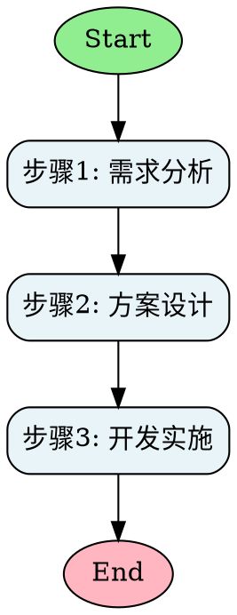
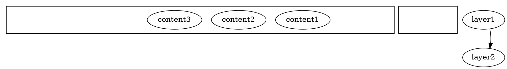

# Diagram Architect - 智能图表架构师

## 任务目标

- 本 Skill 用于：从用户的自然语言描述或参考图片中提取逻辑结构，自动生成专业的可视化图表
- 能力包含：
  - 深度逻辑拆解：从混乱描述中识别实体、关系、流程、层次
  - 智能图表选择：根据结构特征自动匹配最合适的图表类型
  - 多模态输入支持：理解文本描述或分析参考图片
  - 高质量输出：生成PNG/SVG/PDF格式的专业图表
- 触发条件：用户表达"画一个流程图"、"帮我设计组织架构"、"根据这张图生成类似图表"等需求

## 前置准备

### 依赖说明

scripts脚本所需的依赖包及版本：
```
graphviz==0.20.1
```

### 系统依赖安装

Graphviz渲染引擎需要系统级安装：
```bash
apt-get update && apt-get install -y graphviz
```

## 操作步骤

### 步骤1：理解与拆解（智能体核心能力）

**输入类型判断：**
- **纯文本描述**：执行逻辑拆解流程
- **参考图片**：先分析图片结构，再提取特征

**逻辑拆解方法论：**

1. **识别关键实体**
   - 提取名词：人物、角色、部门、系统、组件、步骤
   - 识别属性：每个实体的特征、职责、状态
   - 标注层级：顶层实体、中层实体、底层实体

2. **识别关系类型**
   - 流程关系：先后顺序、并行、循环、分支
   - 层级关系：上下级、包含、归属
   - 交互关系：数据流、控制流、反馈回路
   - 协作关系：协同、依赖、通信

3. **判断结构模式**
   - **线性结构**：A→B→C→D（适合流程图）
   - **层级结构**：顶层→中层→底层（适合组织架构图）
   - **网状结构**：多对多关系（适合系统架构图）
   - **循环结构**：反馈回路、迭代流程（适合控制框图）
   - **发散结构**：中心主题→多个分支（适合思维导图）

**关键词识别信号：**
- 流程图信号："步骤"、"流程"、"然后"、"接着"、"如果...那么"
- 组织架构图信号："部门"、"汇报"、"下属"、"管理"、"负责"
- 控制框图信号："系统"、"模块"、"输入"、"输出"、"反馈"
- 思维导图信号："主题"、"分支"、"包括"、"分为"

### 步骤2：图表类型选择（智能体决策能力）

**决策树：**

```
是否有明确的流程顺序？
├─ 是 → 是否有分支/循环？
│   ├─ 是 → 流程图
│   └─ 否 → 线性流程图/时序图
└─ 否 → 是否有层级关系？
    ├─ 是 → 组织架构图
    └─ 否 → 是否有系统组件交互？
        ├─ 是 → 控制框图/系统架构图
        └─ 否 → 思维导图/关系图
```

**详细判断标准：** 参考 [references/diagram-types-guide.md](references/diagram-types-guide.md)

### 步骤3：生成图表描述（智能体生成能力）

**选择输入格式：**

1. **DOT格式**（推荐）
   - 适合复杂图表，表达能力强
   - 直接定义节点和边的样式
   - 语法参考：[references/dot-language-spec.md](references/dot-language-spec.md)

2. **JSON格式**
   - 适合简单图表，易于理解
   - 结构化定义节点和关系
   - 脚本会自动转换为DOT

**DOT生成示例：**



**样式选择：**

根据场景选择合适的样式模板（位于 `assets/style-templates/`）：
- `modern.json`：现代简洁风格，适合技术文档
- `classic.json`：经典商务风格，适合汇报演示
- `tech.json`：科技感风格，适合系统架构
- `minimal.json`：极简风格，适合快速原型

### 步骤4：渲染输出（脚本执行）

**调用渲染脚本：**

```bash
python /workspace/projects/diagram-architect/scripts/render_diagram.py \
    --input ./diagram.dot \
    --output ./output.png \
    --format png \
    --engine dot
```

**参数说明：**
- `--input`：输入文件路径（.dot 或 .json）
- `--output`：输出文件路径（支持 .png/.svg/.pdf）
- `--format`：输出格式（png/svg/pdf，默认png）
- `--engine`：布局引擎（dot/neato/fdp/sfdp，默认dot）
  - `dot`：有向图，适合流程图、组织架构图
  - `neato`：无向图，适合关系图
  - `fdp`：力导向布局，适合复杂网络
  - `sfdp`：大规模力导向，适合大型图表

**布局引擎选择指南：**
- 流程图、组织架构图 → `dot`
- 思维导图 → `dot` 或 `neato`
- 系统架构图 → `fdp`
- 复杂关系网络 → `sfdp`

### 步骤5：验证与优化

**输出验证：**
1. 检查生成的图片是否清晰可读
2. 验证节点和边的位置是否合理
3. 确认文字标签是否完整显示

**常见问题处理：**
- 文字截断：增大 `dpi` 参数或调整节点大小
- 布局混乱：尝试不同的布局引擎
- 节点重叠：调整 `nodesep` 和 `ranksep` 参数

## 分层图表对齐最佳实践

基于生成嵌入式软件架构图的经验总结：

### 问题分析：多层图表对齐偏移

在生成多层分层架构图时，经常出现以下对齐问题：
1. **垂直方向偏移**：第二层相对第一层偏左，后续每层逐渐向右偏移
2. **边框宽度不一致**：各层内部元素数量不同导致外框宽度差异
3. **内容不居中**：实际节点在层内位置偏左或偏右

### 根本原因分析

1. **Graphviz布局算法特性**：
   - `dot`引擎使用分层布局算法，优先处理节点间连接关系
   - 子图（cluster）边界由内部节点位置决定，而非固定约束
   - 缺乏强约束时，布局算法会寻找"能量最小化"的平衡点

2. **填充节点分布不对称**：
   ```dot
   // 错误示例：左右填充数量不平衡
   subgraph cluster {
       left_fill [style=invis];
       node1; node2; node3;
       // 右边缺少填充节点
   }
   ```

3. **缺乏跨层对齐约束**：
   - 各层独立布局，缺乏垂直方向对齐参考
   - 连接边只约束内容节点，不影响边框位置

### 解决方案：对称网格布局法

#### 核心原则
1. **统一网格结构**：所有层使用相同数量的"列"（推荐6列基准）
2. **对称填充**：左右填充节点数量平衡，确保内容居中
3. **强约束对齐**：使用不可见边强制垂直对齐

#### 实现步骤

**步骤1：确定基准列数**
```python
# 以节点最多的层为基准（如驱动层有6个节点）
BASE_COLUMNS = 6
```

**步骤2：设计每层的6列布局**
```
应用层（3节点）：  填充1 + 节点1 + 节点2 + 节点3 + 填充2 + 填充3
中间件层（2节点）：填充1 + 填充2 + 节点1 + 节点2 + 填充3 + 填充4
驱动层（6节点）：  节点1 + 节点2 + 节点3 + 节点4 + 节点5 + 节点6
硬件抽象层（2节点）：填充1 + 填充2 + 节点1 + 节点2 + 填充3 + 填充4
硬件层（4节点）：  填充1 + 节点1 + 节点2 + 节点3 + 节点4 + 填充2
外部设备层（5节点）：节点1 + 节点2 + 节点3 + 节点4 + 节点5 + 填充1
```

**步骤3：添加垂直对齐约束**
```dot
// 强制左侧边界对齐
edge [style="invis", weight=100];
layer1_left_fill -> layer2_left_fill -> layer3_first_node -> ...;

// 强制右侧边界对齐  
layer1_right_fill -> layer2_right_fill -> layer3_last_node -> ...;
```

**步骤4：使用固定节点尺寸**
```dot
node [
    width=1.6,
    height=0.55,
    fixedsize=true,  // 关键：固定尺寸
    margin=0.08
];
```

### 通用DOT模板



### 调试技巧

1. **临时显示填充节点**：
   ```dot
   // 调试时，将invis改为dotted查看布局
   fill_node [style=dotted, fillcolor=gray];
   ```

2. **分层渲染验证**：
   ```bash
   # 逐步添加约束，验证每层效果
   dot -Tpng -Granksep=0.5 -o debug.png diagram.dot
   ```

3. **权重调整**：
   ```dot
   // 权重值影响布局优先级
   edge [weight=100];  // 高权重：严格对齐
   edge [weight=1];    // 低权重：灵活布局
   ```

### 偏移模式的一般规律

#### 偏移方向不固定
- **向左偏移**：当左侧填充不足或连接边主要来自右侧时
- **向右偏移**：当右侧填充不足或连接边主要来自左侧时  
- **交替偏移**：各层填充策略不同导致逐层偏移

#### 影响因素
1. **连接边方向**：出边较多的节点会向连接方向"牵引"
2. **填充节点分布**：左右填充数量不平衡导致重心偏移
3. **节点尺寸差异**：标签长度不同的节点影响包围盒计算
4. **布局参数**：`nodesep`、`ranksep`值影响间距分布

### 经验总结

1. **偏移不一定相同**：不同图表可能向左或向右偏移，取决于内部节点分布
2. **根本原因是布局自由度**：Graphviz算法在没有强约束时会自由排列
3. **对称性是关键**：左右填充节点数量平衡是居中对齐的基础
4. **约束需要强权重**：`weight=100`确保对齐优先级高于美观布局
5. **固定尺寸减少变量**：`fixedsize=true`防止节点大小变化影响布局

### 适用范围

此方法适用于：
- 软件架构图（分层设计）
- 组织架构图（层级汇报关系）
- 网络协议栈（OSI七层模型）
- 任何需要严格对齐的多层图表

## 资源索引

### 必要脚本
- [scripts/render_diagram.py](scripts/render_diagram.py)：图表渲染脚本，支持DOT/JSON输入，PNG/SVG/PDF输出

### 领域参考
- [references/diagram-types-guide.md](references/diagram-types-guide.md)：图表类型判断标准与适用场景
- [references/dot-language-spec.md](references/dot-language-spec.md)：DOT语言语法规范与示例
- [references/structure-extraction-methods.md](references/structure-extraction-methods.md)：逻辑拆解与结构提取方法论

### 输出资产
- [assets/style-templates/modern.json](assets/style-templates/modern.json)：现代简洁风格
- [assets/style-templates/classic.json](assets/style-templates/classic.json)：经典商务风格
- [assets/style-templates/tech.json](assets/style-templates/tech.json)：科技感风格
- [assets/style-templates/minimal.json](assets/style-templates/minimal.json)：极简风格

## 注意事项

1. **优先使用智能体能力**：逻辑拆解、结构识别、图表选择、DOT生成都由智能体完成，脚本仅负责技术性渲染
2. **保持结构清晰**：生成的DOT代码应层次分明，便于后续修改
3. **选择合适引擎**：不同布局引擎适用于不同类型的图表
4. **参考图片处理**：分析参考图片时，提取的是结构特征而非直接复制样式
5. **输出格式选择**：PNG适合演示，SVG适合编辑，PDF适合打印

## 使用示例

### 示例1：从自然语言生成流程图

**用户输入：**
"用户下单后系统验证库存，有库存就生成订单并发送通知，没库存就提示缺货"

**智能体处理：**
1. 提取实体：用户、系统、订单、通知
2. 识别流程：下单 → 验证 → 分支（有库存/无库存）→ 生成订单/提示缺货
3. 判断类型：带分支的流程图
4. 生成DOT描述

**执行脚本：**
```bash
python /workspace/projects/diagram-architect/scripts/render_diagram.py \
    --input ./order_flow.dot \
    --output ./order_flow.png
```

### 示例2：生成组织架构图

**用户输入：**
"CEO下面有CTO和CFO，CTO管理技术部和产品部，CFO管理财务部和法务部"

**智能体处理：**
1. 提取层级：CEO（顶层）→ CTO/CFO（中层）→ 各部门（底层）
2. 识别关系：汇报线、管理关系
3. 判断类型：组织架构图
4. 生成DOT描述（使用 `rankdir=TB` 自上而下布局）

### 示例3：根据参考图片生成

**用户输入：**
提供一张系统架构图，要求"生成类似风格的图表，但组件替换为我的系统模块"

**智能体处理：**
1. 分析参考图片：识别图表类型、布局方向、颜色方案、节点样式
2. 提取用户模块：从用户的补充描述中识别新组件
3. 应用参考风格：使用相似的样式和布局
4. 生成新的DOT描述