# DOT语言语法规范

## 目录

1. [概述](#概述)
2. [基础语法](#基础语法)
3. [图表类型](#图表类型)
4. [节点定义](#节点定义)
5. [边定义](#边定义)
6. [属性设置](#属性设置)
7. [子图与聚类](#子图与聚类)
8. [常用模板](#常用模板)
9. [最佳实践](#最佳实践)

---

## 概述

DOT是Graphviz工具使用的图形描述语言，用于定义节点、边和图形属性。本规范提供DOT语言的核心语法和常用模式。

**核心特点：**
- 声明式语言：描述图形结构
- 自动布局：由布局引擎决定最终位置
- 丰富的属性：支持样式、颜色、字体等自定义

---

## 基础语法

### 图表结构

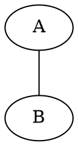

### 注释

```dot
// 单行注释

/*
 * 多行注释
 */
```

### 标识符规则

- 字母、数字、下划线
- 以字母开头
- 大小写敏感
- 包含特殊字符时用引号：`"节点A"`

---

## 图表类型

### 无向图 (graph)

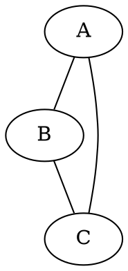

**适用场景：**
- 关系网络
- 无向连接
- 对称关系

### 有向图 (digraph)

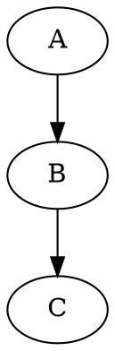

**适用场景：**
- 流程图
- 数据流
- 层级关系

---

## 节点定义

### 基本定义

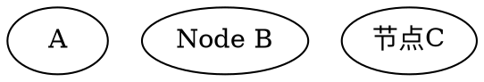

### 节点形状


**常用形状列表：**

| 形状 | 名称 | 适用场景 |
|------|------|---------|
| `box` | 矩形 | 处理步骤 |
| `ellipse` | 椭圆 | 开始/结束 |
| `circle` | 圆形 | 连接点 |
| `diamond` | 菱形 | 决策判断 |
| `parallelogram` | 平行四边形 | 输入/输出 |
| `hexagon` | 六边形 | 准备/初始化 |
| `octagon` | 八边形 | 手动操作 |
| `doublecircle` | 双圆 | 终止节点 |
| `record` | 记录 | 结构化数据 |
| `plaintext` | 纯文本 | 无边框标签 |

### 节点样式

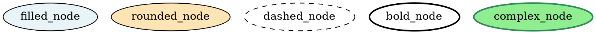

---

## 边定义

### 基本定义

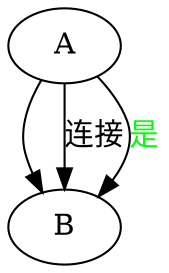

### 边样式

```dot
digraph Edges {
    // 线型
    solid_edge [style=solid];
    dashed_edge [style=dashed];
    dotted_edge [style=dotted];
    bold_edge [style=bold];
    
    // 箭头
    normal_arrow [arrowhead=normal];
    vee_arrow [arrowhead=vee];
    dot_arrow [arrowhead=dot];
    none_arrow [arrowhead=none];  // 无箭头
    
    // 双向箭头
    bidirection [dir=both];
    
    // 无箭头方向
    no_dir [dir=none];
}
```

**常用箭头类型：**

| 箭头 | 名称 | 适用场景 |
|------|------|---------|
| `normal` | 标准箭头 | 默认 |
| `vee` | V形箭头 | 强调方向 |
| `dot` | 圆点 | 特殊标记 |
| `box` | 方框 | 目标端点 |
| `diamond` | 菱形 | 特殊连接 |
| `none` | 无箭头 | 双向关系 |

### 多边连接

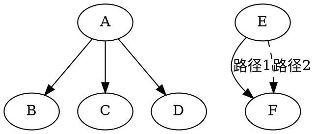

---

## 属性设置

### 图形属性

```dot
digraph GraphAttrs {
    // 布局方向
    rankdir=TB;  // TB(上到下)、LR(左到右)、BT(下到上)、RL(右到左)
    
    // 节点间距
    nodesep=0.5;    // 同层节点间距
    ranksep=1.0;    // 层级间距
    
    // 图形大小
    size="8,11";    // 最大尺寸（英寸）
    ratio=fill;     // 填充模式
    
    // 字体
    fontname="Arial";
    fontsize=14;
    
    // 背景
    bgcolor="white";
    
    // 节点和边的默认属性
    node [fontname="Arial", fontsize=12];
    edge [fontname="Arial", fontsize=10];
}
```

### 全局默认属性

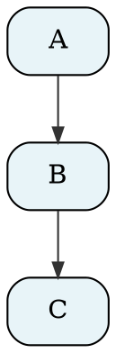

---

## 子图与聚类

### 子图 (subgraph)

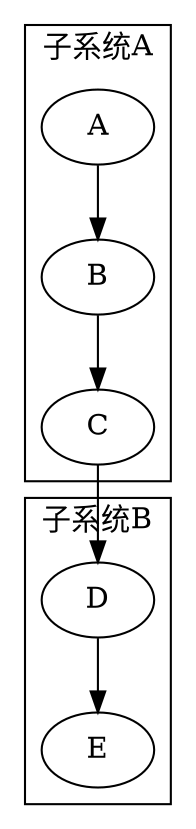

### 聚类样式

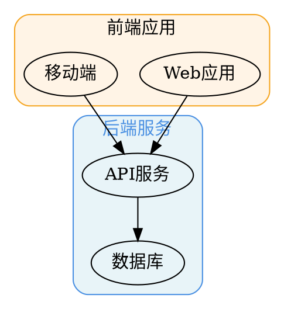

---

## 常用模板

### 流程图模板

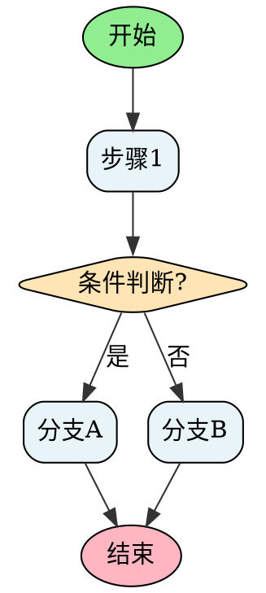

### 组织架构图模板

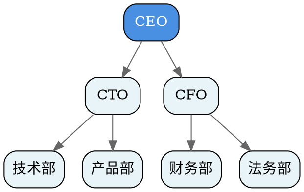

### 系统架构图模板

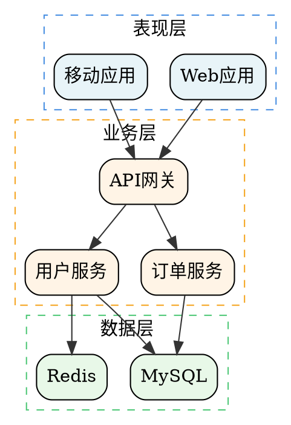

### 控制框图模板

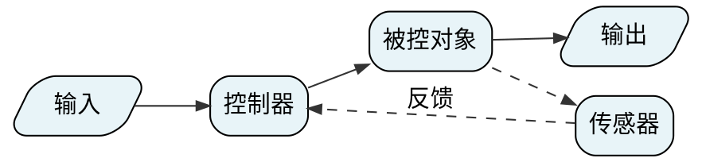

---

## 最佳实践

### 1. 命名规范

```dot
// 推荐：使用有意义的标识符
start_process [label="开始处理"];
validate_input [label="验证输入"];
send_notification [label="发送通知"];

// 避免：无意义命名
node1 [label="开始"];
node2 [label="验证"];
```

### 2. 结构化组织

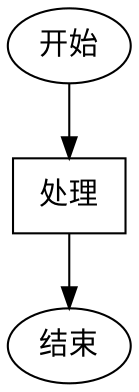

### 3. 注释说明

```dot
digraph CommentedGraph {
    // 设置布局方向为从上到下
    rankdir=TB;
    
    // 定义主要节点
    A [label="步骤A"];
    B [label="步骤B"];
    
    // 定义主要流程
    A -> B;  // A完成后执行B
}
```

### 4. 样式一致性

```dot
digraph ConsistentStyle {
    // 统一使用相同颜色方案
    node [fillcolor="#E8F4F8", style="rounded,filled"];
    
    // 同类节点使用相同样式
    process1 [label="处理1"];
    process2 [label="处理2"];
    process3 [label="处理3"];
    
    // 特殊节点显式覆盖
    special [fillcolor="#FFE4B5", label="特殊处理"];
}
```

### 5. 避免常见错误

```dot
// 错误：中文标识符未加引号
节点A -> 节点B;  // ❌

// 正确：中文标识符加引号
"节点A" -> "节点B";  // ✅

// 错误：属性值未加引号
node [label=处理步骤];  // ❌

// 正确：属性值加引号
node [label="处理步骤"];  // ✅
```

---

## 属性快速参考

### 节点属性

| 属性 | 说明 | 示例 |
|------|------|------|
| `label` | 显示文本 | `label="步骤1"` |
| `shape` | 形状 | `shape=box` |
| `style` | 样式 | `style="rounded,filled"` |
| `fillcolor` | 填充颜色 | `fillcolor="#E8F4F8"` |
| `color` | 边框颜色 | `color="#4A90E2"` |
| `fontname` | 字体 | `fontname="Arial"` |
| `fontsize` | 字号 | `fontsize=12` |
| `fontcolor` | 字体颜色 | `fontcolor="#333333"` |
| `width` | 最小宽度 | `width=2` |
| `height` | 最小高度 | `height=1` |

### 边属性

| 属性 | 说明 | 示例 |
|------|------|------|
| `label` | 边标签 | `label="是"` |
| `color` | 颜色 | `color="#4A90E2"` |
| `style` | 线型 | `style=dashed` |
| `arrowhead` | 箭头类型 | `arrowhead=vee` |
| `arrowsize` | 箭头大小 | `arrowsize=0.8` |
| `dir` | 方向 | `dir=both` |
| `penwidth` | 线宽 | `penwidth=2` |

### 图形属性

| 属性 | 说明 | 示例 |
|------|------|------|
| `rankdir` | 布局方向 | `rankdir=TB` |
| `nodesep` | 节点间距 | `nodesep=0.5` |
| `ranksep` | 层级间距 | `ranksep=1.0` |
| `size` | 图形大小 | `size="8,11"` |
| `dpi` | 分辨率 | `dpi=150` |
| `bgcolor` | 背景色 | `bgcolor="white"` |

---

## 总结

DOT语言核心要点：

1. **声明式思维**：描述"有什么"，而非"怎么画"
2. **属性继承**：合理使用默认属性减少重复
3. **结构清晰**：良好的组织和注释便于维护
4. **样式一致**：统一的视觉风格提升可读性
5. **工具辅助**：善用布局引擎的自动排版能力
