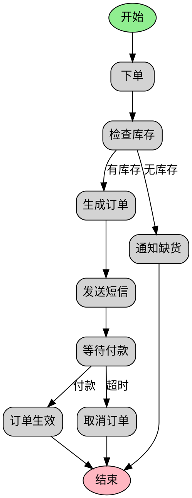
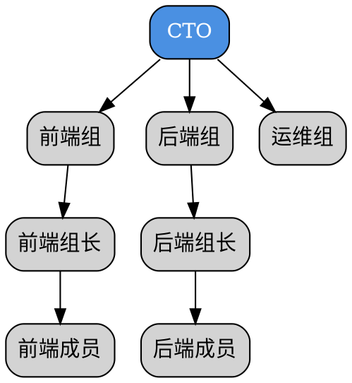
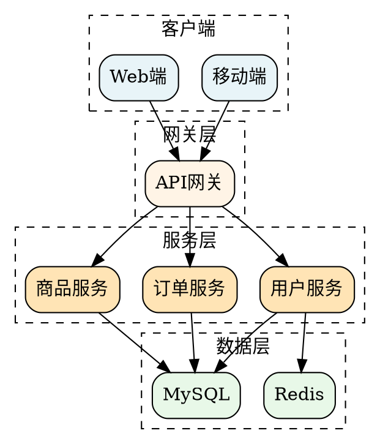

# 结构提取方法论

## 目录

1. [概述](#概述)
2. [核心方法论](#核心方法论)
3. [实体识别技术](#实体识别技术)
4. [关系推断技术](#关系推断技术)
5. [层次划分技术](#层次划分技术)
6. [结构模式识别](#结构模式识别)
7. [复杂场景处理](#复杂场景处理)
8. [实践案例](#实践案例)

---

## 概述

本文档提供从自然语言描述中提取逻辑结构的方法论和技术，帮助智能体透过混乱的表述洞察其背后的业务逻辑、组织关系或思维结构。

**核心挑战：**
- 表述混乱：逻辑跳跃、信息碎片化
- 信息冗余：无关细节干扰核心结构
- 隐含关系：部分关系未明确表达
- 结构混合：多种结构交织

**解决思路：**
1. 过滤噪声，提取核心信息
2. 识别实体，建立元素清单
3. 推断关系，构建连接网络
4. 划分层次，明确结构模式
5. 优化输出，生成清晰描述

---

## 核心方法论

### 三阶段提取流程

```
阶段1：信息过滤
├─ 去除无关信息
├─ 识别关键语句
└─ 提取核心表述

阶段2：结构识别
├─ 实体识别
├─ 关系推断
└─ 层次划分

阶段3：结构优化
├─ 模式匹配
├─ 关系补全
└─ 结构输出
```

---

## 实体识别技术

### 1. 名词提取法

**识别策略：**
- 提取所有名词性成分
- 识别专有名词（人名、地名、系统名）
- 标记抽象名词（流程、概念、状态）

**示例：**

**输入：**
"用户登录系统后，系统验证用户信息，验证通过进入主页，验证失败返回登录页面"

**提取：**
- 实体：用户、系统、用户信息、主页、登录页面
- 动作：登录、验证、进入、返回

### 2. 角色识别法

**识别策略：**
- 识别人物角色：用户、管理员、审批人
- 识别系统角色：服务、模块、接口
- 识别抽象角色：输入源、输出目标、处理单元

**示例：**

**输入：**
"客户下单，销售确认，仓库发货，财务结算"

**提取：**
- 客户（发起者）
- 销售（确认者）
- 仓库（执行者）
- 财务（结算者）

### 3. 组件识别法

**识别策略：**
- 识别系统组件：服务、模块、数据库
- 识别硬件组件：服务器、路由器、传感器
- 识别抽象组件：数据流、控制流

**示例：**

**输入：**
"前端请求API网关，网关路由到用户服务和订单服务，两个服务都访问MySQL数据库"

**提取：**
- 前端（调用者）
- API网关（路由器）
- 用户服务（服务提供者）
- 订单服务（服务提供者）
- MySQL数据库（数据存储）

---

## 关系推断技术

### 1. 时序关系推断

**关键词：**
- 显式：然后、接着、之后、下一步、最后
- 隐式：动词时态变化、逻辑先后

**推断规则：**
```
规则1：时间标记 → 时序关系
"先A，再B" => A → B（先后关系）

规则2：因果标记 → 时序关系
"A后进行B" => A → B（因果关系）

规则3：逻辑标记 → 时序关系
"A完成后B" => A → B（依赖关系）
```

**示例：**

**输入：**
"收到订单后，先检查库存，库存充足就发货，否则通知缺货"

**推断：**
```
收到订单 → 检查库存 → {库存充足 → 发货, 库存不足 → 通知缺货}
```

### 2. 层级关系推断

**关键词：**
- 显式：下属、汇报、管理、负责、属于
- 隐式：大单位包含小单位

**推断规则：**
```
规则1：管理动词 → 层级关系
"A管理B" => A（上级）→ B（下级）

规则2：包含动词 → 层级关系
"A包括B" => A（父）→ B（子）

规则3：归属动词 → 层级关系
"B属于A" => A（父）→ B（子）
```

**示例：**

**输入：**
"技术部包括前端组和后端组，每个组有组长，组长向技术总监汇报"

**推断：**
```
技术总监
  ↓
技术部
  ├→ 前端组 → 组长
  └→ 后端组 → 组长
```

### 3. 交互关系推断

**关键词：**
- 显式：调用、请求、发送、接收、访问
- 隐式：动词方向性

**推断规则：**
```
规则1：通信动词 → 交互关系
"A调用B" => A → B（调用关系）

规则2：数据动词 → 交互关系
"A发送数据给B" => A → B（数据流）

规则3：访问动词 → 交互关系
"A访问B" => A → B（依赖关系）
```

**示例：**

**输入：**
"应用服务器调用缓存服务获取数据，缓存未命中时查询数据库"

**推断：**
```
应用服务器
  ↓ 调用
缓存服务
  ↓ 未命中时查询
数据库
```

### 4. 条件分支推断

**关键词：**
- 显式：如果...那么、否则、条件是、当...时
- 隐式：选择性动词

**推断规则：**
```
规则1：条件标记 → 分支关系
"如果A，那么B，否则C" => 条件A → {B, C}

规则2：选择标记 → 分支关系
"A时执行B，否则执行C" => 判断 → {B, C}

规则3：状态标记 → 分支关系
"成功时A，失败时B" => 状态 → {A, B}
```

**示例：**

**输入：**
"验证成功进入主页，验证失败返回登录页面"

**推断：**
```
验证 → {成功 → 进入主页, 失败 → 返回登录页面}
```

---

## 层次划分技术

### 1. 明确层次识别

**识别标志：**
- 数字编号：第一层、第二层
- 缩进层级：大纲格式
- 量词标记：若干、多个、每种

**示例：**

**输入：**
"系统分为三层：表现层包括Web和App，业务层包括用户服务和订单服务，数据层包括MySQL和Redis"

**层次划分：**
```
L1: 系统
  ├─ L2: 表现层
  │    ├─ L3: Web
  │    └─ L3: App
  ├─ L2: 业务层
  │    ├─ L3: 用户服务
  │    └─ L3: 订单服务
  └─ L2: 数据层
       ├─ L3: MySQL
       └─ L3: Redis
```

### 2. 隐含层次推断

**推断依据：**
- 包含关系：大概念包含小概念
- 抽象程度：高层抽象，低层具体
- 职责范围：整体到局部

**示例：**

**输入：**
"公司下面有技术部和市场部，技术部有研发组和运维组，市场部有销售组和推广组"

**层次推断：**
```
公司（L1）
  ├─ 技术部（L2）
  │    ├─ 研发组（L3）
  │    └─ 运维组（L3）
  └─ 市场部（L2）
       ├─ 销售组（L3）
       └─ 推广组（L3）
```

---

## 结构模式识别

### 1. 线性模式

**特征：**
- 单一路径
- 顺序推进
- 无分支

**识别信号：**
- 关键词：然后、接着、下一步
- 无决策标记
- 无并行描述

**示例：**
"用户注册 → 填写信息 → 提交审核 → 审核通过 → 开通账号"

### 2. 分支模式

**特征：**
- 决策节点
- 多条路径
- 互斥选择

**识别信号：**
- 关键词：如果、否则、条件
- 明确的分支描述
- 不同分支结果

**示例：**
```
验证
├─ 通过 → 进入系统
└─ 失败 → 提示错误
```

### 3. 循环模式

**特征：**
- 重复执行
- 回退路径
- 条件终止

**识别信号：**
- 关键词：循环、重复、直到、回到
- 返回标记
- 终止条件

**示例：**
```
处理请求
  ↓
是否完成？
  ├─ 是 → 结束
  └─ 否 → 回到处理请求
```

### 4. 并行模式

**特征：**
- 同时执行
- 无依赖关系
- 汇聚节点

**识别信号：**
- 关键词：同时、并行、各自
- 无顺序标记
- 明确的汇聚点

**示例：**
```
      ┌→ 处理A ─┐
开始 →┤          ├→ 汇总
      └→ 处理B ─┘
```

### 5. 反馈模式

**特征：**
- 输出到输入的回路
- 闭环控制
- 持续调整

**识别信号：**
- 关键词：反馈、监测、调整、闭环
- 回流路径
- 控制器存在

**示例：**
```
输入 → 控制器 → 被控对象 → 输出
         ↑              ↓
         └─── 传感器 ───┘
```

---

## 复杂场景处理

### 场景1：信息碎片化

**问题描述：**
用户零散描述多个环节，缺乏连贯逻辑

**处理策略：**
1. 提取所有信息点
2. 识别时间标记或逻辑标记
3. 重建逻辑顺序
4. 补充缺失环节

**示例：**

**输入：**
"哦对了，用户会收到邮件，然后之前说的那个验证，验证通过了才行，还有用户得先提交表单"

**处理：**
```
步骤提取：
- 提交表单
- 验证
- 验证通过
- 收到邮件

逻辑重建：
提交表单 → 验证 → 验证通过 → 收到邮件
```

### 场景2：多结构交织

**问题描述：**
同一描述包含流程、层级、交互等多种结构

**处理策略：**
1. 识别主导结构
2. 拆分为子结构
3. 建立子结构关联
4. 分层可视化

**示例：**

**输入：**
"系统有前端和后端，前端负责用户界面，后端包括用户服务和订单服务。用户在前端提交订单，前端调用后端的订单服务创建订单，订单服务再调用用户服务验证用户"

**处理：**
```
主导结构：系统架构图（层级）
次要结构：调用流程图（时序）

架构图：
前端 ←→ 后端
         ├→ 用户服务
         └→ 订单服务

流程图：
用户 → 前端 → 订单服务 → 用户服务
```

### 场景3：隐含关系补全

**问题描述：**
部分关系未明确表达，需要推断补全

**处理策略：**
1. 识别已表达关系
2. 分析实体职责
3. 推断必要关系
4. 标注推断来源

**示例：**

**输入：**
"用户服务管理用户信息，订单服务处理订单"

**处理：**
```
已表达关系：
- 用户服务 → 用户信息（管理）
- 订单服务 → 订单（处理）

推断关系：
- 订单服务 → 用户服务（订单需要关联用户）
推断依据：订单通常包含用户信息

完整结构：
用户服务 ←→ 订单服务
    ↓           ↓
用户信息      订单
```

---

## 实践案例

### 案例1：电商订单流程

**原始描述：**
"用户下单，然后系统检查库存，如果有库存就生成订单并发送短信通知用户，没库存就通知缺货，用户付款后订单生效，如果超时未付款就取消订单"

**提取过程：**

**步骤1：实体识别**
- 用户、系统、订单、库存、短信

**步骤2：关系推断**
- 下单 → 检查库存（时序）
- 有库存 → 生成订单（分支）
- 无库存 → 通知缺货（分支）
- 付款 → 订单生效（时序）
- 超时 → 取消订单（分支）

**步骤3：结构识别**
- 主流程：线性 + 分支
- 库存判断：决策分支
- 付款状态：状态分支

**步骤4：DOT生成**


### 案例2：技术团队组织架构

**原始描述：**
"我们是技术团队，有个CTO，下面分前端组和后端组，前端组有5个人，有个组长，后端组也差不多，还有个运维组，运维组归CTO直接管"

**提取过程：**

**步骤1：实体识别**
- CTO（高层）
- 前端组、后端组、运维组（中层）
- 前端组长、后端组长（中层管理）
- 前端成员、后端成员（基层）

**步骤2：关系推断**
- CTO → 前端组、后端组、运维组（管理）
- 前端组长 → 前端成员（管理）
- 后端组长 → 后端成员（管理）

**步骤3：层次划分**
- L1: CTO
- L2: 前端组、后端组、运维组
- L3: 组长
- L4: 成员

**步骤4：DOT生成**


### 案例3：微服务架构

**原始描述：**
"我们有移动端和Web端，都访问API网关，网关把请求路由到不同的微服务，主要有用户服务、订单服务、商品服务，这些服务都会用到MySQL和Redis"

**提取过程：**

**步骤1：实体识别**
- 移动端、Web端（客户端）
- API网关（路由）
- 用户服务、订单服务、商品服务（服务层）
- MySQL、Redis（数据层）

**步骤2：关系推断**
- 移动端 → API网关（调用）
- Web端 → API网关（调用）
- API网关 → 各微服务（路由）
- 各微服务 → MySQL、Redis（访问）

**步骤3：层次划分**
- 表现层：移动端、Web端
- 网关层：API网关
- 服务层：各微服务
- 数据层：MySQL、Redis

**步骤4：DOT生成**


---

## 总结

结构提取的核心原则：

1. **信息过滤优先**：先去除噪声，再提取核心
2. **实体是基础**：明确的实体清单是结构分析的前提
3. **关系是关键**：关系的正确推断决定结构的准确性
4. **层次是骨架**：清晰的层次划分支撑整体结构
5. **模式是捷径**：识别常见模式可加速分析过程
6. **补全要谨慎**：推断的关系需要标注来源，避免误导

**最终目标：将混乱的自然语言转化为清晰的、结构化的、可可视化的逻辑模型。**
