# 嵌入式软件方案设计说明书

## 文档信息

| 项目 | 内容 |
|------|------|
| 项目名称 | 主控制板F413固件 |
| 芯片型号 | STM32F4xx (ARM Cortex-M4) |
| 操作系统 | FreeRTOS |
| 文档版本 | V1.0 |
| 生成日期 | 2026-03-19 |

---

## 1. 系统概述

### 1.1 产品定位

本系统为**医疗手术动力设备主控制板**，用于控制无刷电机驱动、显示屏交互、脚踏/手柄输入等多模块协同工作。系统支持多种手术器械模式（磨钻、刨刀、耳膜机等），具备完善的故障检测与报警机制。

### 1.2 核心功能

- **电机控制**: 支持A/B双通道无刷电机调速（最高160000 RPM）
- **人机交互**: 4.3寸LCD显示屏 + 电容触摸按键
- **输入控制**: 脚踏板（支持多种踩踏模式）+ 手柄按键
- **液体管理**: 灌注泵、注水泵流量控制
- **安全监控**: 过载保护、掉电存储、异常报警

### 1.3 关键约束

| 指标 | 规格 | 源码依据 |
|------|------|----------|
| 系统时钟 | 100MHz (PLL 200MHz/2) | `main.c: SystemClock_Config()` |
| UART数量 | 7路 (6路DMA) | `main.c: MX_USART1_UART_Init() ~ MX_UART7_Init()` |
| ADC通道 | 4通道 | `board.h: BOARD_ADC_CHANNEL_CNT` |
| 看门狗 | 禁用（与参考项目对齐） | `main.c: /* MX_IWDG_Init(); */` |
| 任务栈深度 | 1024字节 | `app_task.c: APP_TASK_STACK_DEPTH` |

---

## 2. 软件架构

### 2.1 分层架构

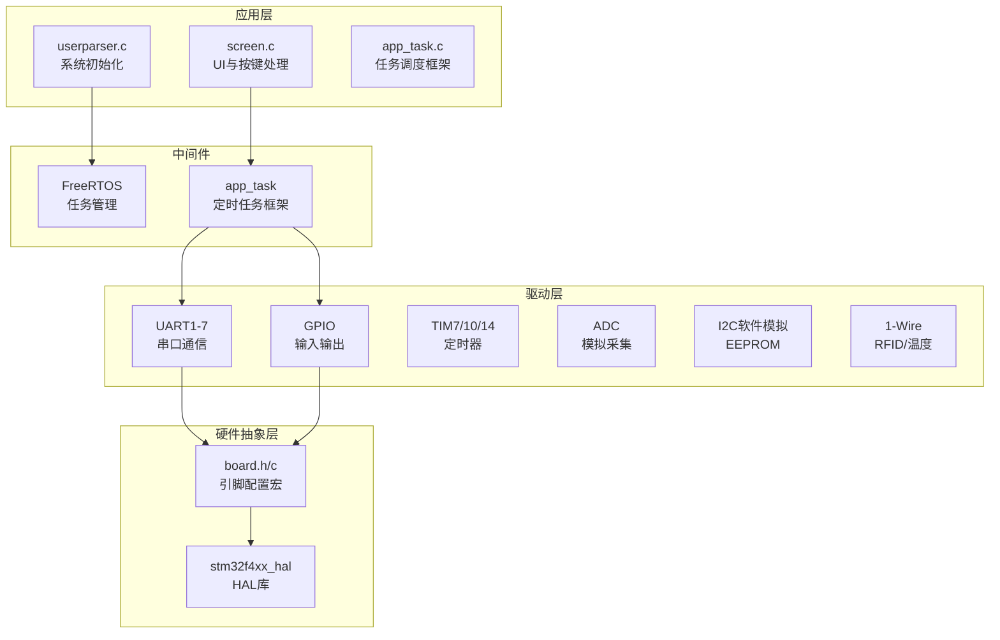

### 2.2 目录结构

```
EIDE/
├── Src/                          # STM32CubeMX生成代码
│   ├── main.c                   # 主程序入口
│   ├── usart.c                  # UART外设配置
│   ├── app_task.c               # 定时任务框架
│   └── ...
├── User/
│   ├── board/                   # 硬件抽象层
│   │   ├── board.h              # 引脚/外设宏定义
│   │   └── board.c              # 硬件初始化实现
│   ├── Peripheral/
│   │   └── uart/
│   │       ├── uart1.c          # 无刷电机通信
│   │       ├── uart2.c          # 外部通讯
│   │       ├── uart3.c          # 射频通信
│   │       ├── uart4.c          # 脚踏通信
│   │       ├── uart5.c          # 步进电机1
│   │       ├── uart6.c          # 显示屏通信
│   │       └── uart7.c          # 步进电机2
│   └── Application/
│       ├── Src/
│       │   └── userparser.c     # 系统初始化与任务创建
│       └── Screen/
│           └── screen.c         # UI显示与按键处理
└── docs/
    └── EmbeddedSoftwareDesign.md # 本文档
```

---

## 3. 硬件资源分配

### 3.1 UART外设分配

| 端口 | 用途 | 波特率 | DMA通道 | 源码位置 |
|------|------|--------|---------|----------|
| USART1 | 无刷电机 | 9600 | DMA2_Stream2 | `uart1.c` |
| USART2 | 外部通讯 | 9600 | DMA1_Stream5 | `uart2.c` |
| USART3 | 显示屏 | 115200 | DMA1_Stream1 | `uart3.c` |
| UART4 | 脚踏 | 115200 | DMA1_Stream2 | `uart4.c` |
| UART5 | 步进电机1 | 9600 | DMA1_Stream0 | `uart5.c` |
| USART6 | 预留 | 115200 | DMA2_Stream1 | `uart6.c` |
| UART7 | 步进电机2 | 9600 (Tx only) | DMA1_Stream3 | `uart7.c` |

### 3.2 GPIO资源分配

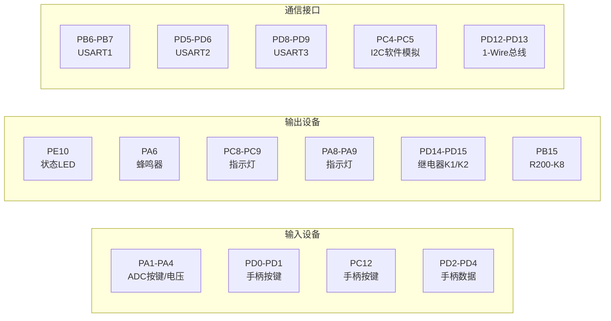

### 3.3 定时器分配

| 定时器 | 用途 | 周期 | 源码依据 |
|--------|------|------|----------|
| TIM6 | 系统滴答 | 1ms | `main.c: HAL_TIM_PeriodElapsedCallback` |
| TIM7 | 系统滴答 | - | `main.c: MX_TIM7_Init()` |
| TIM10 | 蜂鸣器驱动 | 50000预分频×5周期 | `board.h: BOARD_TIM10_PRESCALER` |
| TIM14 | 系统计时 | 50000预分频×500周期 = 1s | `board.h: BOARD_TIM14_PERIOD` |

---

## 4. 任务设计

### 4.1 FreeRTOS任务列表

| 任务名 | 优先级 | 周期 | 功能 | 源码位置 |
|--------|--------|------|------|----------|
| AppTask | Idle+3 | 1ms | 应用层定时任务调度 | `app_task.c` |
| (系统任务) | - | - | FreeRTOS内核管理 | `freertos.c` |

### 4.2 应用定时任务（基于AppTask框架）

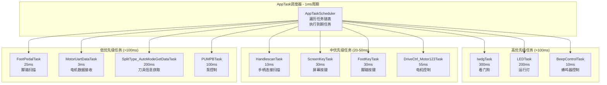

### 4.3 任务创建代码映射

```c
// 源码位置: userparser.c: Userparser_Init()

// 高优先级
IwdgTaskInit();              // 看门狗任务
LEDTaskInit();               // 运行灯任务  
BeepControlTask_Init();      // 蜂鸣器控制
HandlescanTaskInit();        // 手柄扫描

// 中优先级
PedalRecvTask_Init();        // 脚踏数据接收 (3ms)
FootPedalTask_Init();        // 脚踏连接扫描
ScreenKeyTask_Init();        // 屏幕按键逻辑
FootKeyTask_Init();          // 脚踏按键任务
ScreenKey_ScanInit();        // 屏幕按键扫描 (22ms)
FootThrottleTask_Init();     // 脚踏油门
DriveCtrl_Motor123Task_Init(); // 电机控制
HandleKeyScan_Init();        // 手柄按键扫描

// 低优先级
MotorUartData_Init();        // 驱动板数据接收
SplitType_AutoModeGetData_Init(); // 刀具信息获取 (200ms)
DriveCtrl_HMITask_Init();    // HMI刷新
PUMPBTask_Init();            // 泵控制
```

---

## 5. 状态机设计

### 5.1 系统运行状态机

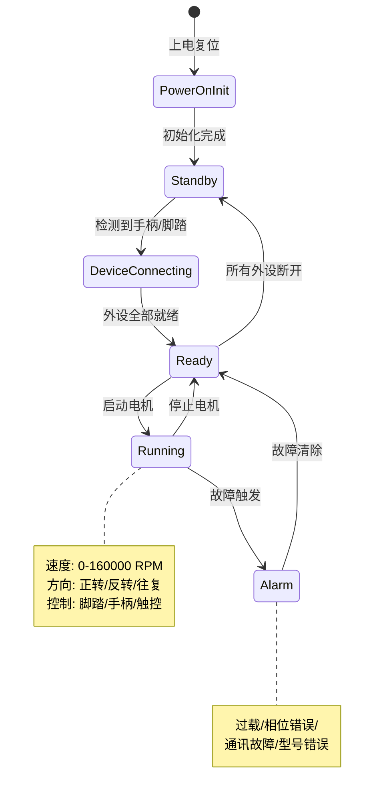

### 5.2 手柄识别状态

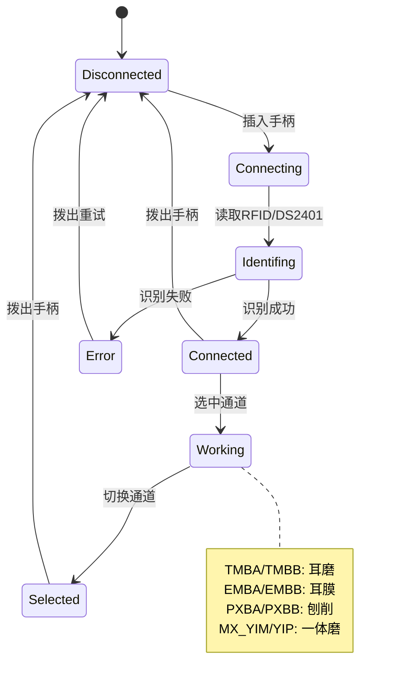

### 5.3 电机控制状态

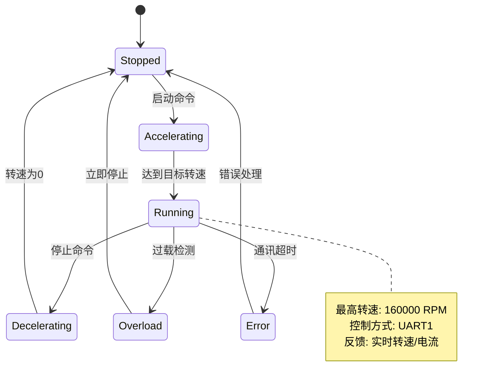

---

## 6. 通信协议

### 6.1 显示屏通信 (UART3 - 115200bps)

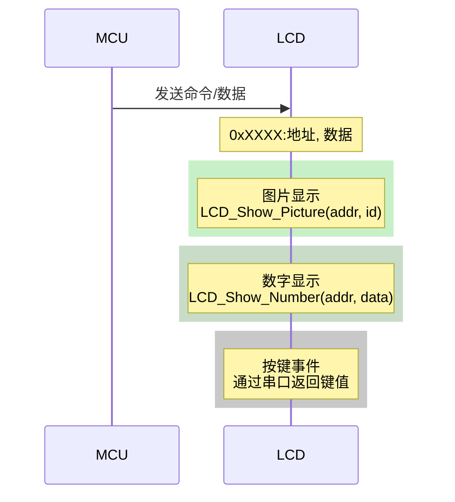

### 6.2 无刷电机通信 (UART1 - 9600bps)

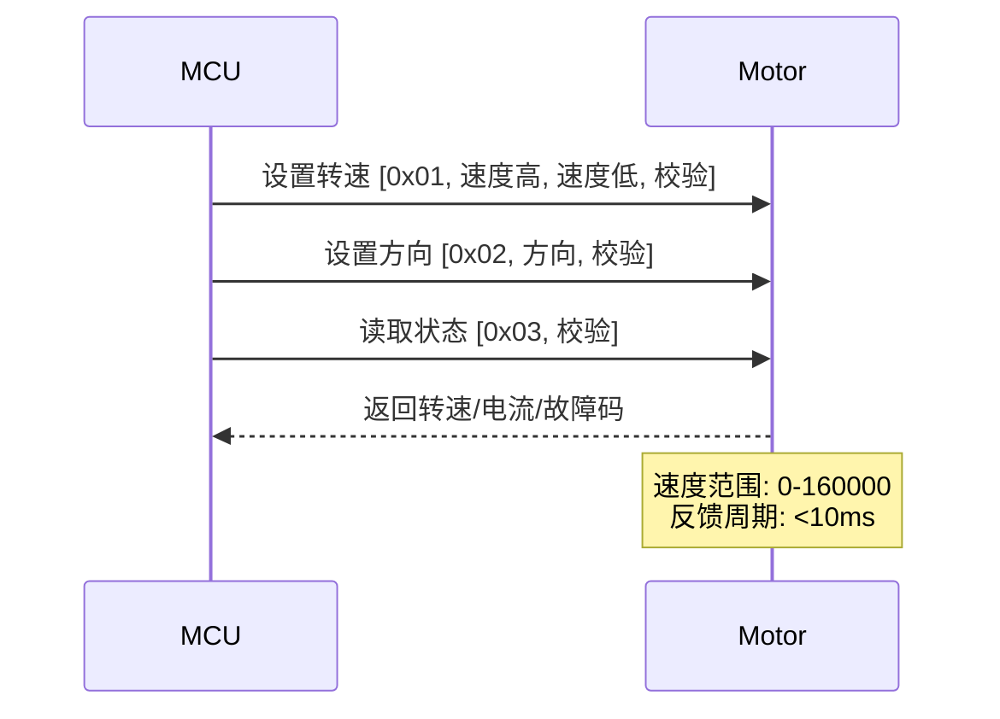

### 6.3 脚踏通信 (UART4 - 115200bps)

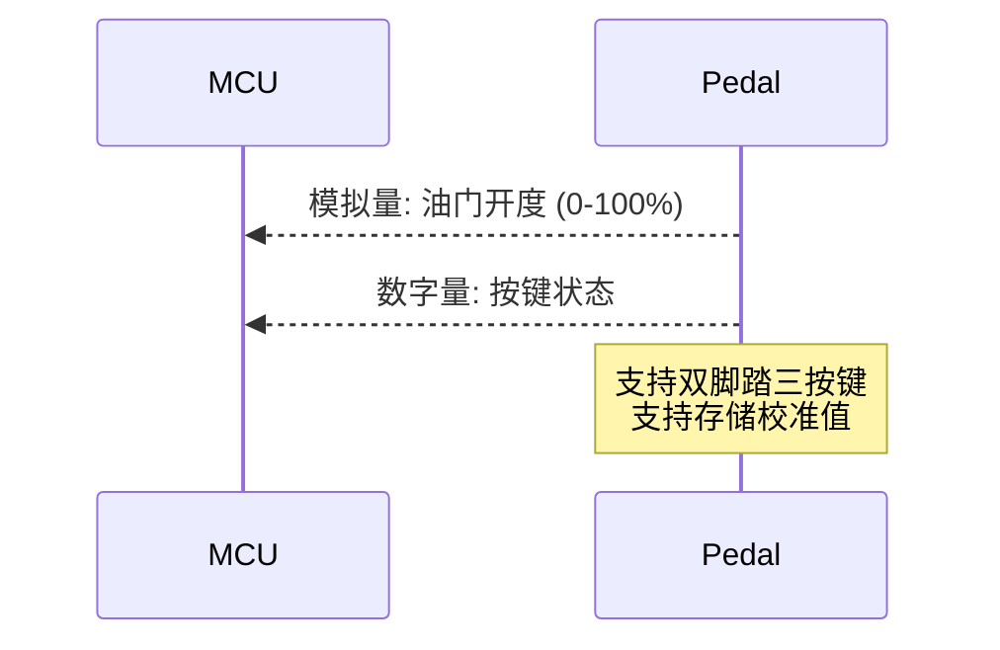

---

## 7. 数据流设计

### 7.1 核心数据流

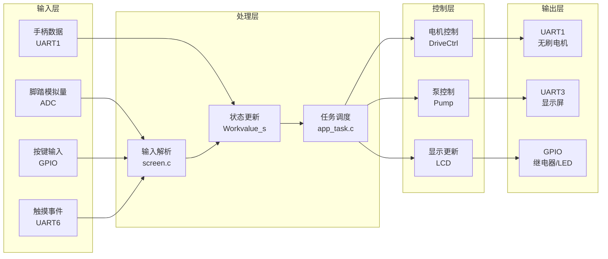

### 7.2 关键数据结构

```c
// 源码位置: screen.c

// 工作参数结构体
typedef struct {
    uint32_t set_speed;           // 设置转速 (0-160000)
    uint32_t set_Freq;            // 往复频率 (0-40Hz)
    uint8_t set_Direction;        // 方向: 0-停止, 1-正转, 2-反转, 3-往复
    uint8_t set_Way;              // 控制方式: 脚控/手控/触控
    uint8_t set_Injection;        // 注水设置 (0-70ml)
    uint8_t set_Irrigate;         // 灌注设置
    uint8_t hand_model;           // 手柄型号
    uint8_t tool_model;           // 刀具模式: 0-磨头, 1-刨刀
    
    // 状态标志
    uint8_t MOTORWorking_flag;    // 电机运行标志
    uint8_t beep_Alarm_flag;      // 报警标志
    uint8_t Alarm_value;          // 报警代码
    
    // 连接状态
    uint8_t Achanell_online_flag; // A通道在线
    uint8_t Bchanell_online_flag; // B通道在线
    uint8_t footcontrol_online_flag; // 脚踏在线
} Workvalue;

// 通道记忆结构体
typedef struct {
    uint32_t set_speed;
    uint8_t set_Freq;
    uint8_t set_Direction;
    uint8_t set_Way;
    uint8_t tool_model;
    uint8_t hand_model;
    uint8_t manual_flag;
} ChannelValue_t;
```

---

## 8. 存储设计

### 8.1 Flash分区

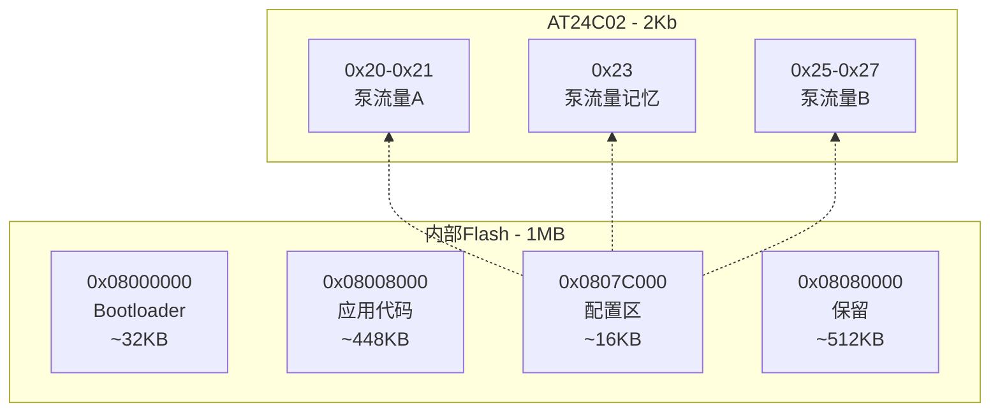

### 8.2 存储操作

| 地址 | 用途 | 大小 | 源码依据 |
|------|------|------|----------|
| ADDR_BASE (0x0807C000) | 手柄模式 | 2字节 | `userparser.c: Storage_HandleMode_init()` |
| 0x20-0x27 | 泵流量 | 8字节 | `userparser.c: Storage_PumpFlow_init()` |

---

## 9. 可靠性设计

### 9.1 安全机制

| 机制 | 状态 | 说明 |
|------|------|------|
| 看门狗 (IWDG) | ⚠️ 禁用 | 与参考项目对齐，待确认是否启用 |
| 错误处理 | ✅ 启用 | `Error_Handler()` 死循环 |
| Flash存储 | ✅ 启用 | 关键配置掉电保存 |
| 报警系统 | ✅ 启用 | 16种报警代码 |

### 9.2 报警代码

```c
// 源码位置: screen.c

#define ALARM_1  1  // 手柄未连接
#define ALARM_2  2  // 脚踏未连接
#define ALARM_3  3  // 刀具未连接
#define ALARM_4  4  // 霍尔型号错误
#define ALARM_5  5  // 电机通讯故障
#define ALARM_6  6  // 电机过载
#define ALARM_7  7  // 手柄未连接，无法启动脚踏
#define ALARM_8  8  // 电机相位错误
#define ALARM_9  9  // 脚踏存储值错误
#define ALARM_10 10 // 手柄型号错误
#define ALARM_11 11 // UID错误
#define ALARM_12 12 // 脚控已选中，请使用脚控
#define ALARM_13 13 // 手控已选中，请使用手控
```

### 9.3 风险与待确认项

| 风险项 | 严重程度 | 建议措施 |
|--------|----------|----------|
| 看门狗已禁用 | 🔴 高 | 建议启用IWDG，喂狗周期<500ms |
| UART7仅TX模式 | 🟡 中 | 确认步进电机无需反馈 |
| 继电器无电流检测 | 🟡 中 | 建议增加负载检测 |

---

## 10. 性能指标建议

### 10.1 响应时间

| 指标 | 当前值 | 建议值 | 说明 |
|------|--------|--------|------|
| 按键响应 | <30ms | <20ms | ScreenKeyTask周期 |
| 电机启停 | <100ms | <50ms | 含通讯超时 |
| 显示屏刷新 | <100ms | <50ms | DriveCtrl_HMITask |
| 报警触发 | <15ms | <10ms | Warn_StatusScanTask |

### 10.2 资源占用

| 资源 | 使用量 | 总量 | 使用率 |
|------|--------|------|--------|
| SRAM | ~64KB | 192KB | ~33% |
| Flash | ~256KB | 1MB | ~25% |
| 任务栈 | 11KB | - | 11×1KB |

---

## 11. 接口定义

### 11.1 任务创建API

```c
// 源码位置: app_task.c

typedef void (*cbFunc)(uint32_t event);

typedef struct task {
    bool start;           // 任务启动标志
    bool oneShot;         // 单次执行标志
    uint32_t period;     // 周期 (ms)
    uint32_t timerTick;  // 计时器
    cbFunc func;         // 回调函数
    struct task *next;   // 链表next
} task_t;

// 创建任务
int app_task_create(task_t *task, cbFunc func);

// 启动任务
// one_shot: true-单次, false-周期执行
// time_ms: 执行周期 (ms)
int app_task_start(task_t *task, bool one_shot, uint32_t time_ms);

// 停止任务
int app_task_stop(task_t *task);
```

### 11.2 屏幕显示API

```c
// 源码位置: screen.c

// 图片显示
void LCD_Show_Picture(uint16_t addr, uint16_t pic_id);
void LCD_Disappear_Picture(uint16_t addr);

// 数字显示
void LCD_Show_Number(uint16_t addr, uint16_t data);
void LCD_Show_4byte_Number(uint16_t addr, uint32_t data);
void LCD_Disappear_Number(uint16_t addr);

// 刀具参数
void LCD_IntegratedCutterData_Update(uint16_t addr, uint16_t length, uint8_t diameter, uint8_t angle);
```

---

## 12. 验证建议

### 12.1 单元测试

| 模块 | 测试项 | 预期结果 |
|------|--------|----------|
| app_task | 多任务并发 | 各任务按周期执行，无遗漏 |
| uart1 | 接收超时 | 3ms无新数据触发处理 |
| screen | 按键响应 | 43种按键正确解析 |
| storage | 掉电存储 | 断电后配置保持 |

### 12.2 集成测试

| 测试场景 | 验证点 |
|----------|--------|
| 手柄插拔 | 识别时间<500ms，状态正确切换 |
| 电机调速 | 转速响应<100ms，显示正确 |
| 多任务压力 | 1ms周期任务稳定运行 |
| 长时间运行 | 连续运行8小时无内存泄漏 |

### 12.3 故障注入

| 故障类型 | 注入方法 | 预期行为 |
|----------|----------|----------|
| 通讯断线 | 断开UART | 触发ALARM_5报警 |
| 过载 | 堵转电机 | 触发ALARM_6停机 |
| 看门狗 | 禁用喂狗 | 系统复位 |

---

## 13. 附录

### 13.1 源码证据索引

| 章节 | 源码文件 | 关键函数/行 |
|------|----------|-------------|
| 系统时钟 | `main.c` | `SystemClock_Config()` L80-100 |
| UART初始化 | `main.c` | `MX_USART1_UART_Init()` L47-55 |
| 任务框架 | `app_task.c` | `AppTaskScheduler()` L16-40 |
| 系统初始化 | `userparser.c` | `Userparser_Init()` L35-100 |
| UI处理 | `screen.c` | `KeyBehavior()` L1200-1350 |
| 硬件配置 | `board.h` | 全部宏定义 |

### 13.2 修订历史

| 版本 | 日期 | 修订内容 |
|------|------|----------|
| V1.0 | 2026-03-19 | 初始版本 |

---

**文档结束**

> ⚠️ 待确认项
> - 看门狗是否需要启用
> - 是否有性能优化需求
> - 是否需要补充安全加密模块
