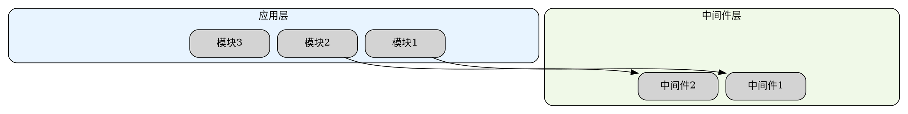

# 多层图表对齐经验总结
## 基于嵌入式软件架构图生成实践

### 问题现象
在生成多层分层架构图时，观察到以下对齐问题：
1. **垂直方向偏移**：第二层相对第一层偏左，后续每层逐渐向右偏移
2. **边框宽度不一致**：各层内部元素数量不同导致外框宽度差异
3. **内容不居中**：实际节点在层内位置偏左或偏右

### 根本原因分析

#### 1. Graphviz布局算法特性
- **分层算法优先级**：`dot`引擎使用Sugiyama分层布局算法，优先考虑节点间的连接关系，而不是视觉对齐
- **子图边界计算**：子图（cluster）边界由内部节点的包围盒决定，缺乏固定边界约束
- **能量最小化**：算法在缺乏强约束时寻找整体"能量最小化"的布局，可能导致层间偏移

#### 2. 填充节点分布不对称
```dot
// 问题示例：左右填充不平衡导致内容偏左
subgraph cluster_app {
    left_fill [style=invis];      // 左侧1个填充
    node1; node2; node3;          // 3个实际节点
    // 右侧缺少填充节点 → 内容偏左
}
```

#### 3. 缺乏跨层对齐约束
- 各层独立布局，缺乏垂直方向对齐参考
- 连接边只约束内容节点，不影响边框位置
- 层间缺乏强约束关系，布局算法自由度高

### 偏移模式的一般规律

#### 偏移方向不固定
- **向左偏移**：当左侧填充不足或连接边主要来自右侧时
- **向右偏移**：当右侧填充不足或连接边主要来自左侧时
- **交替偏移**：各层填充策略不同导致逐层偏移

#### 影响因素
1. **连接边方向**：出边较多的节点会向连接方向"牵引"
2. **填充节点分布**：左右填充数量不平衡导致重心偏移
3. **节点尺寸差异**：标签长度不同的节点影响包围盒计算
4. **布局参数**：`nodesep`、`ranksep`值影响间距分布

### 解决方案：对称网格布局法

#### 核心原则
1. **统一网格结构**：所有层使用相同数量的"列"（以最多节点的层为基准）
2. **对称填充策略**：左右填充节点数量平衡，确保内容居中
3. **强约束对齐**：使用不可见边和高权重强制垂直对齐
4. **固定节点尺寸**：减少布局变量，提高一致性

#### 实现步骤

**步骤1：确定基准列数**
```python
# 分析各层节点数量，取最大值作为基准
layer_nodes = {
    'app': 3,      # 应用层
    'mw': 2,       # 中间件层
    'drv': 6,      # 驱动层（基准）
    'hal': 2,      # 硬件抽象层
    'hw': 4,       # 硬件层
    'peri': 5      # 外部设备层
}
BASE_COLUMNS = max(layer_nodes.values())  # 6
```

**步骤2：设计每层的对称布局**
```
应用层（3节点）：   填充L1 + 节点1 + 节点2 + 节点3 + 填充R1 + 填充R2
中间件层（2节点）： 填充L1 + 填充L2 + 节点1 + 节点2 + 填充R1 + 填充R2
驱动层（6节点）：   节点1 + 节点2 + 节点3 + 节点4 + 节点5 + 节点6
硬件抽象层（2节点）：填充L1 + 填充L2 + 节点1 + 节点2 + 填充R1 + 填充R2
硬件层（4节点）：   填充L1 + 节点1 + 节点2 + 节点3 + 节点4 + 填充R1
外部设备层（5节点）：节点1 + 节点2 + 节点3 + 节点4 + 节点5 + 填充R1
```

**步骤3：添加垂直对齐约束**
```dot
// 强制左侧边界对齐（高权重确保优先级）
edge [style="invis", weight=100];
app:fillL1 -> mw:fillL1 -> drv:node1 -> hal:fillL1 -> hw:fillL1 -> peri:node1;

// 强制右侧边界对齐
app:fillR2 -> mw:fillR2 -> drv:node6 -> hal:fillR2 -> hw:fillR1 -> peri:fillR1;
```

**步骤4：配置关键布局参数**
```dot
digraph PerfectAlignedArchitecture {
    graph [
        rankdir=TB,
        newrank=true,      // 启用新排名算法，支持复杂约束
        compound=true,     // 允许子图边界参与布局
        concentrate=false, // 不合并边，保持连接清晰
        nodesep=0.15,      // 节点水平间距
        ranksep=0.3        // 层级垂直间距
    ];
    
    node [
        fixedsize=true,    // 关键：固定节点尺寸
        width=1.6,
        height=0.55,
        margin=0.08
    ];
}
```

### 完整DOT模板示例



### 调试与验证技巧

#### 1. 可视化填充节点
```dot
// 调试阶段显示填充节点位置
fill_node [
    style=dotted,
    fillcolor="#F0F0F0",
    color="#CCCCCC",
    label="填充"
];
```

#### 2. 分层渲染验证
```bash
# 逐步添加约束验证效果
# 1. 只渲染基础结构
dot -Tpng -o step1.png base.dot

# 2. 添加填充节点
dot -Tpng -o step2.png with_fills.dot

# 3. 添加对齐约束
dot -Tpng -o step3.png with_constraints.dot
```

#### 3. 权重调整策略
```dot
// 不同权重值的应用场景
edge [weight=100];  // 强制对齐：边框边界、关键参考线
edge [weight=10];   // 重要关系：主要数据流、控制流
edge [weight=1];    // 次要关系：辅助连接、可选路径
```

#### 4. 边界检查方法
```python
# 验证各层边界是否对齐
def check_alignment(image_path):
    # 1. 提取各层边界坐标
    # 2. 计算垂直方向偏差
    # 3. 报告偏移超过阈值的位置
    pass
```

### 适用范围与限制

#### 适用场景
- **软件架构图**：分层设计、模块依赖
- **组织架构图**：层级汇报关系、部门结构
- **网络协议栈**：OSI七层模型、TCP/IP协议族
- **业务流程图**：多阶段处理、并行分支
- **系统部署图**：物理层、虚拟化层、应用层

#### 限制条件
- **节点数量差异大**：各层节点数相差超过3倍时效果下降
- **非矩形布局**：环形、网状等非分层结构不适用
- **动态内容**：标签长度变化大的图表需要动态调整
- **超大图表**：超过50个节点时布局计算时间显著增加

### 经验总结

#### 1. 偏移不一定相同
- 不同图表可能向左或向右偏移，取决于内部节点分布
- 连接边的方向和密度是主要影响因素
- 填充策略需要根据具体图表调整

#### 2. 根本原因是布局自由度
- Graphviz算法在没有强约束时会自由排列
- 对称性和约束是控制布局的关键
- 权重值决定约束的优先级

#### 3. 对称性是关键
- 左右填充节点数量平衡是居中对齐的基础
- 填充节点尺寸应与实际节点保持一致
- 对称布局提高视觉一致性

#### 4. 约束需要强权重
- `weight=100`确保对齐优先级高于美观布局
- 不可见边不影响视觉效果但控制布局
- 约束网络应覆盖所有关键边界点

#### 5. 固定尺寸减少变量
- `fixedsize=true`防止节点大小变化影响布局
- 统一尺寸简化包围盒计算
- 适当留白（margin）提高可读性

### 最佳实践清单

1. ✅ 使用统一网格结构（如6列基准）
2. ✅ 实施对称填充策略
3. ✅ 添加垂直对齐约束（weight=100）
4. ✅ 固定节点尺寸（fixedsize=true）
5. ✅ 启用新排名算法（newrank=true）
6. ✅ 允许子图边界参与布局（compound=true）
7. ✅ 逐步验证布局效果
8. ✅ 根据连接密度调整填充分布
9. ✅ 为长标签预留额外空间
10. ✅ 文档化布局策略便于维护

### 自动化工具建议

```python
def generate_aligned_layers(layers_data, base_columns=6):
    """
    自动生成对齐的多层图表
    
    参数：
        layers_data: 各层节点数据，格式：
            [
                {"name": "应用层", "nodes": ["模块1", "模块2", "模块3"]},
                {"name": "中间件层", "nodes": ["中间件1", "中间件2"]},
                # ...
            ]
        base_columns: 基准列数，默认为6
    
    返回：
        DOT格式字符串
    """
    # 1. 计算每层需要的填充节点
    # 2. 生成对称布局
    # 3. 添加对齐约束
    # 4. 返回完整DOT代码
    pass
```

### 后续优化方向

1. **智能填充算法**：根据连接关系自动优化填充分布
2. **动态列数调整**：根据内容复杂度自适应调整基准列数
3. **视觉平衡检测**：自动检测并校正布局不平衡
4. **交互式调整**：提供可视化调整界面
5. **模板库建设**：收集和复用成功布局模式

---

*本文档基于F413嵌入式软件架构图生成实践总结，适用于各类多层图表对齐场景。*