# 整机项目产品软件接手文档

版本：2026-05-27  
主线工程：`F413EXOsSSCH_RTOSV1.5-EH_mainReconstruct`  
文档目的：通过本文理解整机软件结构、运行链路、接口协议、调试入口和静态风险，再按需阅读源码。本文以主控工程为主线，其他四个工程按“主控依赖的下位机或工具”展开。

## 1. 文档边界与工程清单

### 1.1 本文档覆盖范围

本文档覆盖以下五个工程共同组成的产品软件：

| 角色 | 工程路径 | 作用 | 接入主控方式 |
| --- | --- | --- | --- |
| 主控工程 | `D:\EH_main\soft\FinalSoft_test\F413EXOsSSCH_RTOSV1.5-EH_mainReconstructV1\F413EXOsSSCH_RTOSV1.5-EH_mainReconstruct` | 整机调度中心，负责 UI、手柄、脚踏、外控、电机、泵、压力、报警和 EEPROM 数据流 | STM32F413，FreeRTOS + 自研软任务调度 |
| 无刷/有刷驱动工程 | `D:\EH_main\reference\shima_waixie\GE2433_WSYS_2026_3_31\GE2433_WSYS_2026_3_31\0` | 高速电机驱动板，当前默认跑无刷方波驱动，也保留有刷模式 | 主控 UART1，115200 8N1，私有 0xAA 帧 |
| 步进驱动工程 | `D:\EH_main\reference\shima_waixie\small_2026_3_31\small_2026_3_31` | 步进/泵驱动板，接收方向和速度命令，返回错误码 | 主控 UART5/UART7 方向，115200 8N1，当前 `0xAA ... BB AA`，驱动也支持 CRC |
| 外部通信上位机 | `D:\EH_main\soft\FinalSoft_test\外部通信上位机\uart2-external-host-standalone` | Web Serial 调试和外控工具，支持授权、运行参数、EEPROM、心跳、压力显示和急停 | 主控 UART2，115200 8N1，`D7 CA F8 F1` 协议 |
| 压力传感器工程 | `D:\EH_main\soft\Pressure_STM32F030F4` | CS1237 压力采集下位机，周期上报原始值、重量、阈值、设备码 | 主控软串口，9600 8N1，21 字节 `AA 55 ... 55 AA` 帧 |

### 1.2 接手阅读顺序

1. 先看本文第 2 章到第 5 章，建立“主控如何把所有外设串起来”的图。
2. 再看第 6 章协议速查，确认每条线上的波特率、帧头、帧长和关键字段。
3. 上电调试前看第 7 章测试流程，尤其是电机、泵、压力和外控授权顺序。
4. 接手修改前看第 8 章逐文件静态审查，里面列了当前静态可见的预期 bug、风险和验证办法。
5. 需要深入某个模块时，再按第 8 章文件接手索引去读源码。

### 1.3 文档依据

本文基于源码静态审查、工程内已有文档和近期修改记录整理。已有可直接参考的文档包括：

| 文档 | 用途 |
| --- | --- |
| `EIDE\docs\主控工程产品文档.md` | 主控原有产品文档，已覆盖硬件平台、FreeRTOS、手柄、电机、泵、脚踏、外部协议的一部分 |
| `无刷驱动工程接手说明.md` | 无刷/有刷驱动工程已有详细接手文档，可作为驱动板专项资料 |
| `D:\EH_main\soft\Pressure_STM32F030F4\docs\cs1237_uart_protocol.md` | 压力传感器周期上报协议 |
| `D:\EH_main\soft\Pressure_STM32F030F4\docs\pressure_calibration_host_protocol.md` | 压力传感器标定上位机协议 |
| `task_plan.md`、`findings.md`、`progress.md` | 主控近期手柄插拔和报警逻辑修改记录 |

## 2. 整机软件架构总览

### 2.1 一句话理解整机

主控板是整机唯一的业务仲裁中心。屏幕、手柄、脚踏和外部上位机都不能直接驱动电机或泵，它们都先把“谁要控制、以什么参数控制、是否允许控制”交给主控；主控再根据手柄 EEPROM、工作模式、报警状态、外控授权、压力传感器和下位机反馈，统一生成电机和泵的输出命令。

### 2.2 软件拓扑

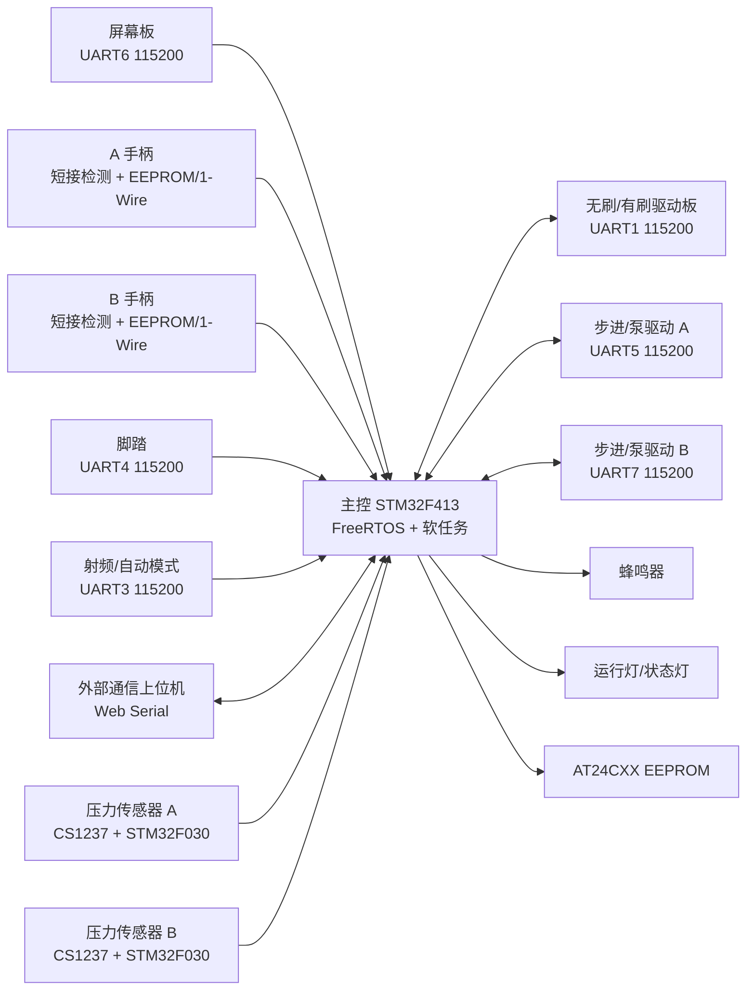

### 2.3 主控工程分层

| 层级 | 目录 | 主要职责 |
| --- | --- | --- |
| 自动生成层 | `Src`、`Inc`、`Drivers`、`Middlewares` | CubeMX/HAL/FreeRTOS 初始化，尽量少手改 |
| Board/BSP | `User\board`、`User\Hardware` | 板级引脚定义、硬件后初始化入口 |
| 外设层 | `User\Peripheral` | UART、软 UART、I2C、1-Wire、IWDG 等硬件访问 |
| 内核适配层 | `User\Kernel` | 自研软任务调度、队列、任务入口封装 |
| 应用层 | `User\Application` | 手柄、脚踏、屏幕、电机、泵、外部通信、报警、公共数据 |
| 引导层 | `User\App` | `App_Bootstrap_Init()`，把主控业务初始化挂到 `main()` |

### 2.4 主控作为主线的关键数据流

1. `Userparser_Init()` 完成硬件和业务模块初始化。
2. 手柄扫描任务识别 A/B 通道在线、短接、EEPROM 校验结果，并写入 `MemoryMsgA/MemoryMsgB`。
3. 控制来源任务包括手柄按键、脚踏、屏幕键、外部通信。它们通过事件或公共接口改变 `WorkMessage`。
4. `WorkMessage` 是当前工作快照，电机、泵、UI、蜂鸣器和外部上位机都读取它。
5. 电机任务把 `WorkMessage` 转成无刷驱动板 UART1 命令；泵任务把泵目标值转成 UART5/UART7 命令。
6. 软 UART 解析压力传感器的 CS1237 帧，写入 `pumpMessageA/pumpMessageB`，泵闭环和外部上位机心跳都会用这些数据。
7. 外部通信任务每 10ms 处理 UART2 下行帧，每 100ms 上传心跳，心跳里包含运行状态、报警、泵、压力扩展字段。

## 3. 主控启动链路与调度模型

### 3.1 主控启动主线

启动入口在 `Src\main.c`，主链路如下：

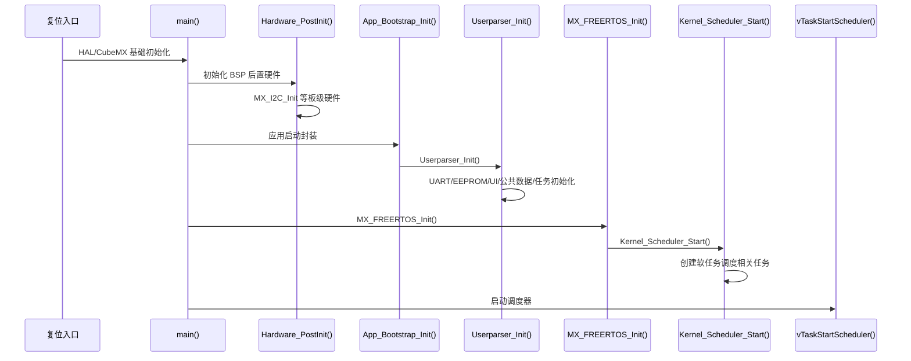

关键文件：

| 文件 | 关注点 |
| --- | --- |
| `Src\main.c` | `Hardware_PostInit()`、`App_Bootstrap_Init()`、`MX_FREERTOS_Init()`、`vTaskStartScheduler()` 的顺序 |
| `User\Hardware\Bsp\hw_bootstrap.c` | 板级硬件后初始化 |
| `User\App\Bootstrap\app_bootstrap.c` | 调用 `Userparser_Init()` |
| `User\Application\Src\userparser.c` | 主控业务初始化总入口 |
| `Src\freertos.c` | 调用 `Kernel_Scheduler_Start()` |
| `User\Kernel\Scheduler\kernel_entry.c` | 调度器入口 |

### 3.2 `Userparser_Init()` 初始化顺序

`Userparser_Init()` 是接手主控必须先读的函数，它把业务模块按依赖顺序拉起来。静态审查看到的主要顺序如下：

1. 屏幕显示开机页。
2. `Hardware_BoardGpioInit()` 初始化板级 GPIO。
3. `EEPROM_AT24CXX_Init()` 初始化外部 EEPROM。
4. 初始化硬件 UART：
   - `Uart1_Init()`：无刷/有刷驱动板。
   - `Uart2_Init()`：外部通信上位机。
   - `Uart3_Init()`：射频/自动模式。
   - `Uart4_Init()`：脚踏。
   - `Uart5_Init()`：步进/泵 A。
   - `Uart6_Init()`：屏幕。
   - `Uart7_Init()`：步进/泵 B。
5. `Motor_ErrorEmergencyStop_Ctrl()` 先发电机紧急停止，避免上电残留输出。
6. `UI_Start_Fun()` 初始化 UI 启动画面和屏幕状态。
7. `Userparser_PubinterfaceInit()` 初始化 `WorkMessage`、通道记忆、泵公共状态等公共接口。
8. 依次初始化软任务：看门狗、LED、蜂鸣、按键行为、手柄扫描、脚踏、屏幕键、电机驱动、手柄按键、电机 UART、外部通信、RFID、A/B 泵、UI 显示、压力软串口。

### 3.3 主控 UART 与软串口速查

主控串口参数以 `Src\usart.c` 为准；`User\board\board.h` 中 `BOARD_UART_LIST` 有部分预留波特率和注释与当前 CubeMX 初始化不一致，接手时不要只看 `board.h` 判断真实通信参数。压力传感器走软串口 9600。

| 接口 | 对端 | 主控任务/模块 | 波特率 | 关键风险 |
| --- | --- | --- | --- | --- |
| UART1 | 无刷/有刷驱动板 | `sscDrive.c`、`motoruartdata.c` | 115200 8N1 | 电机命令与回包解析必须匹配 0xAA 私有协议 |
| UART2 | 外部通信上位机 | `external_comm_task.c` | 115200 8N1 | 粘包、半包、CRC、外控授权和链路超时 |
| UART3 | RFID/自动模式 | `sscRFID.c` | 115200 8N2 | 自动模式数据不能绕过运行仲裁 |
| UART4 | 脚踏 | `sscFOOT.c`、`pedal.c` | 115200 8N2 | 脚踏在线检测、行程映射、控制权切换 |
| UART5 | 步进/泵 A | `sscPUMPA.c`、`pump.c` | 115200 8N1 | A 泵固定识别开关、压力闭环和输出方向 |
| UART6 | 屏幕 | `screenkey.c`、`sscUIDP.c` | 115200 8N2 | 屏幕事件会触发插拔、模式和参数变更 |
| UART7 | 步进/泵 B | `sscPUMPB.c`、`pump.c` | 115200 8N1，当前 `UART_MODE_TX` | B 泵固定识别开关、压力闭环和输出方向 |
| 软串口 1 | B 泵压力传感器 | `soft_uart.c` | 9600 | RX=PE4，现场固定映射到 B 泵 |
| 软串口 2 | A 泵压力传感器 | `soft_uart.c` | 9600 | RX=PE6，现场固定映射到 A 泵 |

主控硬件引脚和 DMA 速查：

| 接口/信号 | 引脚 | DMA/中断 | 当前用途 | 接手注意 |
| --- | --- | --- | --- | --- |
| UART1 TX/RX | PB6/PB7 | DMA2_Stream2 Ch4 RX | 无刷/有刷驱动板 | 正式回包为 12 字节 CRC 帧，抓包时不要只看主控下发 |
| UART2 TX/RX | PD5/PD6 | DMA1_Stream5 Ch4 RX | 外部通信上位机 | Web Serial 工具、外控授权、EEPROM 读写都走这里 |
| UART3 TX/RX | PD8/PD9 | DMA1_Stream1 Ch4 RX | RFID/自动模式 | 8N2，和常见 8N1 串口助手默认值不同 |
| UART4 TX/RX | PA11/PA12 | DMA1_Stream2 Ch4 RX | 脚踏 | 8N2，脚踏帧异常时先核对停止位 |
| UART5 TX/RX | PB8/PB9 | DMA1_Stream0 Ch4 RX | 泵/步进物理 A 口 | 逻辑 A/B 泵可能在最后输出层互换，见泵章节 |
| UART6 TX/RX | PC6/PC7 | DMA2_Stream1 Ch5 RX | 屏幕 | 8N2，屏幕事件直接触发通道和模式变化 |
| UART7 TX/RX | PE7/PE8 | DMA1_Stream3 Ch5 RX | 泵/步进物理 B 口 | CubeMX 当前只开 TX，若需要回包必须重新确认 RX 初始化 |
| UART8 TX/RX | PE1/PE0 | DMA1_Stream6 Ch5 RX | 预留 | 当前不是主线链路，改动前先查调用点 |
| UART10 TX/RX | PE3/PE2 | DMA2_Stream0 Ch5 RX | 调试/预留 | 压力透传和外控心跳曾做过开关，交付默认不要输出调试文本 |
| 软串口 1 TX/RX | PE5/PE4 | EXTI4 + TIM11 | B 泵压力 | 同时两路上报时会争用 active receiver |
| 软串口 2 TX/RX | PE11/PE6 | EXTI9_5 + TIM11 | A 泵压力 | RX 线反接会导致压力闭环错源 |
| 手柄短接数据 | PD2/PD3/PD4 | GPIO | 手柄识别/短接 | 配合 `handlescan.c` 判断 A/B 插拔 |
| 手柄按键数据 | PD0/PD1/PC12 | GPIO/EXTI | 手柄按键 | PD1 同时在 board.h 里作为 EXTI1，改硬件前要核冲突 |
| ADC1 | PA1/PA2/PA3/PA4 | ADC1 | 手柄按键、电压、温度 | PA1/PA2 是 H_KEY1/H_KEY2，不是普通 GPIO |
| 软 I2C | PC4/PC5 | GPIO bit-bang | AT24CXX/手柄 EEPROM | 页尾 2 字节校验由驱动管理 |
| 1-Wire I/II | PD13/PD12 | GPIO bit-bang | 手柄/刀具识别 | A/B 识别异常要和短接检测一起看 |
| 蜂鸣器 | PA6 | GPIO | 报警/提示 | `BEEP_ON()` 为置位输出，实际有源电平按硬件验证 |
| 状态灯 | PE10 | GPIO | 系统运行灯 | 200ms 任务翻转，可用示波器看调度是否活着 |
| 指示 LED H1-H4 | PC8/PC9/PA8/PA9 | GPIO | 通道/状态显示 | 宏中 ON/OFF 有低有效写法，不能按字面推断 |

系统时钟来自 8MHz HSE，当前 `board.h` 记录 SYSCLK 100MHz、APB1 50MHz、APB2 100MHz。软 UART 用 TIM11 做 RX 采样，DWT/TIM7 做 TX 微秒延时；如果后续改系统时钟，必须重新验证 9600 软串口采样点。

### 3.4 软任务调度周期

主控不是每个业务都有一个 FreeRTOS 原生任务。工程里有 `Kernel_TaskStart()` 软任务调度接口，应用模块把周期任务注册到调度器。静态审查得到的主要周期如下：

| 任务/句柄 | 文件 | 周期 | 功能 |
| --- | --- | --- | --- |
| `MOTORUARTTask` | `User\Application\MotorUartData\motoruartdata.c` | 3ms | 读取 UART1 驱动板反馈 |
| `PEDALRECVTask` | `User\Application\Pedal\pedal.c` | 3ms | 读取脚踏串口数据 |
| `HANDLESCANTask` | `User\Application\Handle\handlescan.c` | 10ms | A/B 手柄短接、插拔、EEPROM 校验 |
| `FOOTTask` | `User\Application\Beep\sscFOOT.c` | 10ms | 脚踏解析 |
| `UIDISPLAYBehaviorTask` | `User\Application\Beep\sscUIDP.c` | 10ms | UI 状态刷新 |
| `ExternalCommTask` | `User\Application\ExternalComm\external_comm_task.c` | 10ms | UART2 外控接收、FIFO 解析、心跳计时 |
| `FOOTBHHandle` | `User\Application\Beep\sscFOOT.c` | 25ms | 脚踏行为处理 |
| `PUMPABehaviorHandle` | `User\Application\Beep\sscPUMPA.c` | 25ms | A 泵行为处理 |
| `SCREENKEYTask` | `User\Application\ScreenKey\screenkey.c` | 30ms | 屏幕按键解析 |
| `HANDLEKEYTask` | `User\Application\Handle\handlekey.c` | 30ms | 手柄按键扫描 |
| `KeyBehaviorsTask` | `User\Application\Beep\sscKEYBH.c` | 30ms | 屏幕/按键行为分发 |
| `MOTORRUNTask` | `User\Application\Beep\sscDrive.c` | 50ms | 电机运行命令下发 |
| `BeepControlTask` | `User\Application\Beep\sscBEEP.c` | 100ms | 蜂鸣控制 |
| `PUMPBBehaviorHandle` | `User\Application\Beep\sscPUMPB.c` | 100ms | B 泵行为处理 |
| `AUTOMODEGETDATATask` | `User\Application\Beep\sscRFID.c` | 100ms | RFID/自动模式数据 |
| `SimUartTask` | `User\Peripheral\uart\soft_uart.c` | 100ms | 压力软串口状态维护 |
| `LEDTask` | `User\Application\Led\sysrunled.c` | 200ms | 系统状态灯 |
| `IWDGTask` | `User\Peripheral\iwdg\iwdg.c` | 300ms | 喂狗 |

调试建议：如果出现“串口有波形但业务没有反应”，先确认对应软任务是否初始化成功，再确认任务周期是否足够处理该协议的帧间隔。

## 4. 主控核心业务模块详解

### 4.1 公共数据模型

主控公共数据集中在 `User\Application\include\Pubinterface.h` 和对应 `Pubinterface.c`。

| 对象/宏 | 含义 | 下游影响 |
| --- | --- | --- |
| `CHANNEL_A = 1` | A 手柄/通道 | 屏幕、手柄扫描、工作通道、EEPROM |
| `CHANNEL_B = 2` | B 手柄/通道 | 屏幕、手柄扫描、工作通道、EEPROM |
| `CHANNEL_NONE = 0` | 无选中通道 | 禁止依赖通道记忆启动 |
| `NOWORK = 0` | 无控制方式 | 待机 |
| `JTWORK = 1` | 脚踏工作 | 脚踏拥有控制权 |
| `HANDLEWORK = 2` | 手控工作 | 手柄按键拥有控制权 |
| `TOUCHWORK = 3` | 外部/触控工作 | 屏幕或外部通信控制 |
| `WorkMessage` | 当前工作快照 | 电机、泵、UI、蜂鸣、上位机心跳都读取 |
| `MemoryMsgA/B` | A/B 通道参数记忆 | 手柄切换、插拔恢复、EEPROM 加载 |
| `pumpMessageA/B` | A/B 泵状态和压力扩展 | 泵输出、压力闭环、外控心跳 |
| `WorkAlarm_Set/ClearIf/Is` | 统一报警接口 | 蜂鸣、UI、上位机报警一致性 |

近期手柄插拔逻辑已经把 `MemoryMsgA/B` 到 `WorkMessage` 的装载收敛到公共入口，避免屏幕、上位机、插拔自动选择各自复制不同字段。

`WorkMessage_t` 字段接手表：

| 字段 | 含义 | 主要写入者 | 主要读取者 | 调试关注点 |
| --- | --- | --- | --- | --- |
| `runflag_work` | 当前电机运行门控 | 脚踏、手柄、外控、急停、驱动错误处理 | `sscDrive.c`、心跳、UI | 只要为 false，电机任务会周期下发停止帧 |
| `switchhandle_counts` | 双踏板长按切换通道计数 | 脚踏行为 | 通道切换逻辑 | 现场误切通道时查长按计数是否被噪声累加 |
| `switchhandleA_flag/B_flag` | 脚踏切通道后的确认标志 | 脚踏/通道切换 | 脚踏启动 | 防止脚踏切通道后立即误启动 |
| `alarm_flag`/`alarm_value` | 主控统一报警状态 | `WorkAlarm_Set/Clear`、驱动反馈、手柄扫描 | 蜂鸣、屏幕、外控报警帧 | 不要绕过 `WorkAlarm_*` 直接写报警 |
| `Channel_Aonline/Bonline` | A/B 手柄插孔在线 | `handlescan.c`、插拔事件 | 上位机心跳、切通道、启动前置检查 | 在线只说明插孔/识别链路，不等于当前通道已选中 |
| `hand_model` | 当前选中通道手柄型号 | 手柄 EEPROM 识别、通道装载 | 电机 run_type、UI | 切通道时必须由 `MemoryMsgA/B` 装载 |
| `channel_work` | 当前选中通道 | 插拔、屏幕、外控切换 | 全部输出链路 | 1=A，2=B，0=无；运行中当前通道拔出不自动切另一路 |
| `drivetype_work` | 控制方式记忆 | 脚踏、手柄、屏幕/外控 | UI、控制仲裁 | `JTWORK/HANDLEWORK/TOUCHWORK` 会影响输入互斥 |
| `hmiactive_work` | 外部控制激活显示/状态 | 外控申请/释放 | UI、仲裁辅助 | 不等同于 `ControlArbitration_IsExternalActive()` 的锁状态 |
| `touchactive_work` | 触控占用显示/状态 | 屏幕/外控 | 脚踏接管前置检查 | 触控残留会让脚踏拒绝接管 |
| `tool_type` | 刀具类型，刨/磨 | EEPROM、屏幕/外控切换 | 电机选择、UI | `PLANER=1`，`GRINDH=2` |
| `speed_work` | 当前实际输出速度，内部 x10 | 控制来源、脚踏比例、停机置零 | 电机任务、心跳 | 外控显示 rpm 时通常需要除以 10 |
| `speed_set_work` | 当前设定速度，内部 x10 | EEPROM 装载、外控设置、方向切换 | 脚踏比例、启动恢复 | 停机时可保留设定值，启动时再恢复到 `speed_work` |
| `freq_work` | 往复频率 | EEPROM、屏幕/外控 | 电机任务 | 电机命令第 2 字节上限 100 |
| `dir_work` | 方向 | EEPROM、屏幕/外控/手柄 | 电机任务、心跳 | `ZZDIR=0`，`FZDIR=1`，`OSCDIR=2` |
| `current_work` | 下发给驱动板的保护电流 | EEPROM/型号默认 | 电机任务 | 不要和实时反馈电流混用 |
| `driver_speed_feedback` | 驱动板实际转速反馈 | `motoruartdata.c` | 心跳/监测 | 来自回包 byte4~5，单位沿用驱动协议 |
| `driver_current_x100` | 驱动板实时电流 0.01A | `motoruartdata.c` | 心跳/监测 | 只上传监测，不覆盖保护电流 |
| `tool_reduction_ratio` | 刀具减速比 | EEPROM 解析 | UI/业务计算 | 高 16 位和低 16 位分别表示增速/减速含义 |

`MemoryMsgA/B` 是“通道参数记忆”，只有切到对应通道或 EEPROM 识别成功后才应该同步到 `WorkMessage`。字段含义如下：

| 字段组 | 字段 | 说明 | 修改后必须验证 |
| --- | --- | --- | --- |
| 识别 | `hand_model`、`hand_type_raw_major/minor` | 解析后的手柄类型和 Page2 原始类型字节 | 心跳中在线手柄类型是否和 EEPROM 一致 |
| 工具/控制 | `tool_type`、`drive_type` | 刀具类型和控制方式记忆 | 屏幕/外控切换后断电或切通道是否保持 |
| 速度 | `zz_speed`、`fz_speed`、`osc_speed` | 正转、反转、往复默认速度，单位 x10 | 切方向时 `speed_set_work` 是否随方向切换 |
| 频率/方向 | `freq`、`dir` | 往复频率和默认方向 | 往复模式下频率命令是否正确 |
| 电流 | `current_work` | 电机保护电流 | 驱动过载报警阈值是否符合工具 |
| 注水 | `default_injection_flow` | Page4 默认注水流量 | 手柄启动时 A 注水泵跟随是否使用该值 |
| 阈值 | `speed_alarm_for/rev`、`freq_alarm_osc` | 速度/频率蜂鸣阈值 | 只蜂鸣提示，不应强制停机 |
| 机械 | `tool_reduction_ratio` | 刀具减速比 | UI 显示和速度换算是否一致 |

`ChannelrecognizeMessageA/B` 是“刚从手柄 EEPROM 识别出的原始能力”，它比 `MemoryMsgA/B` 更接近 EEPROM 页内容。接手时记住：识别结构不代表当前工作状态，必须经过插拔/切通道入口确认后，才写入通道记忆并装载到 `WorkMessage`。

| 字段组 | 字段 | 来源/单位 | 用途 |
| --- | --- | --- | --- |
| 适配能力 | `digital_enable`、`Pubadapter`、`dualDrive_Flag`、`dualDrive_Matchcode` | Page2/Page3 解析 | 预留数字适配、公共转接头、双驱协作 |
| 频率 | `freq_max/min/default` | EEPROM 单字节 | 往复频率范围和默认值 |
| 刀具规格 | `draw`、`diameter`、`meioticratio`、`length` | Page3 | UI 显示、刀具规格 |
| 速度范围 | `speed_zzmax/min`、`speed_fzmax/min`、`speed_oscmax/min` | Page4，单位 x10 | 屏幕/外控限幅 |
| 步进 | `speed_zzstep/fzstep/oscstep` | Page6 | 档位或按键调速步进 |
| 默认速度 | `speed_zzdefault/fzdefault/oscdefault` | Page4/Page6 | 首次装载默认值 |
| 过载 | `overloadThresholdFor/Rev/OSC` | EEPROM | 下发驱动保护电流来源之一 |
| 注水和报警 | `default_injection_flow`、`speed_alarm_for/rev`、`freq_alarm_osc` | Page4 | 注水泵跟随和蜂鸣阈值 |
| 运行选择 | `handle_type`、`run_direction`、`control_mode`、`tool_type` | EEPROM/识别结果 | 生成 `MemoryMsgA/B` |

`pumpMessageA/B` 是泵业务状态和压力状态的汇合点：

| 字段 | 含义 | 写入者 | 下游 |
| --- | --- | --- | --- |
| `online_flag` | 泵/压力模块在线 | CS1237 设备码或外控固定识别 | 外控启动前置检查、心跳 |
| `run_flag` | 泵输出门控 | 脚踏、外控、排空、急停 | `sscPUMPA/B.c` |
| `timingDrainage_flag/times` | 定时排空状态和计数 | 泵行为入口 | 泵任务 25ms/100ms 周期 |
| `step_value` | 调节步进 | 屏幕/配置 | 调泵 UI |
| `associated_channel` | 泵关联通道 | 配置/预留 | 后续双通道扩展 |
| `type` | 业务泵类型 | 屏幕、脚踏、外控固定识别 | 泵方向和速度公式 |
| `direction` | 泵方向 | 泵输出层 | 调试观察 |
| `speed_work` | 泵业务速度 | 脚踏/外控/默认流量 | 速度公式、心跳 |
| `speed_Max/Min/step_value` | 泵速度范围 | 识别/配置 | UI 限幅 |
| `losses_times` | 设备识别丢失计数 | CS1237 解析 | 在线抖动诊断 |
| `pressure_value` | CS1237 原始值 | 软串口解析 | 上位机压力窗口 |
| `pressure_threshold` | 压力阈值 g | 压力模块 | 压力闭环 |
| `weight_x10` | 重量 0.1g | 压力模块 | 压力闭环、心跳 |
| `seq` | 压力帧序号 | 压力模块 | 判断数据是否卡死 |

`ControlSignalMessage_t` 是控制来源的“边沿/门控信号”，不是最终状态。最终是否输出仍看 `WorkMessage.runflag_work` 和 `pumpMessageA/B.run_flag`。

| 字段 | 含义 | 易错点 |
| --- | --- | --- |
| `jt_enable_flag`、`handle_enable_flag`、`HMI_enable_flag` | 脚踏、手柄、外控使能 | 使能不等于正在运行 |
| `jtL_control_flag`、`jtR_control_flag` | 脚踏左右控制电机 | 释放脚踏时必须清，否则 owner 不释放 |
| `handle_control_flag`、`HMI_control_flag` | 手柄/外控控制电机 | 驱动错误和急停要同时清 |
| `jtL_gentlypump_flag`、`jtR_gentlypump_flag`、`HMI_gentlypump_flag` | 轻踩/外控轻排泵 | 泵停止时要和 `run_flag` 同步 |
| `JTSCREENL/R_pump_flag`、`HMIL/R_pump_flag` | 屏幕/外控泵控制 | 外控静默停输出会清外控泵标志 |

### 4.2 报警码

`WorkMessage.alarm_value` 是主控统一报警码。

| 报警码 | 宏 | 含义 | 调试动作 |
| --- | --- | --- | --- |
| 0 | `WORK_ALARM_NONE` | 无报警 | 正常 |
| 1 | `WORK_ALARM_HANDLE_NOT_CONNECTED` | 手柄未连接 | 查 A/B 短接检测、手柄线、EEPROM |
| 2 | `WORK_ALARM_MANUAL_SELECTED` | 手控已选中 | 用户应使用手控，或释放手控控制权 |
| 3 | `WORK_ALARM_FOOT_SELECTED` | 脚控已选中 | 用户应使用脚踏，或释放脚踏控制权 |
| 4 | `WORK_ALARM_MOTOR_OVERLOAD` | 电机过载 | 查驱动板回包、电流阈值、机械负载 |
| 5 | `WORK_ALARM_FOOT_VALUE_ERROR` | 脚踏值错误 | 查 UART4、脚踏行程 ADC/协议 |
| 6 | `WORK_ALARM_MOTOR_OVERLOAD_ALT` | 电机过载兼容旧 UI 位 | 同 4 |
| 7 | `WORK_ALARM_UID_ERROR` | UID 错误 | 查射频/自动模式或权限 |
| 8 | `WORK_ALARM_MOTOR_COMM_ERROR` | 电机通讯异常 | 查 UART1、驱动板电源、帧解析 |
| 9 | `WORK_ALARM_HALL_ERROR` | Hall 值错误 | 查无刷驱动 Hall 反馈 |
| 10 | `WORK_ALARM_HANDLE_MODEL_ERROR_A` | A 通道 EEPROM 校验失败 | 查 A 手柄 EEPROM 数据和线束 |
| 11 | `WORK_ALARM_SPEED_THRESHOLD` | Page4 速度/频率阈值蜂鸣 | 只提示，不强制停机 |
| 12 | `WORK_ALARM_HANDLE_MODEL_ERROR_B` | B 通道 EEPROM 校验失败 | 查 B 手柄 EEPROM 数据和线束 |
| 14 | `WORK_ALARM_HANDLE_MODEL_ERROR_AB` | A/B EEPROM 都失败 | 两通道都需检查 |

报警调试原则：

1. 驱动错误、手柄 EEPROM 错、脚踏值错误、UID 错误都汇聚到同一个 `WorkMessage.alarm_value`，所以上位机看到的报警码不是来源模块本身，需要结合最近的输入事件和驱动回包判断来源。
2. 运行中另一路坏手柄的 3 秒临时报警不写入 `WorkMessage`，由外控任务单独上传临时报警帧；真实报警存在时临时报警必须让位。
3. `WORK_ALARM_SPEED_THRESHOLD` 是 Page4 阈值蜂鸣提示，只驱动提示，不应该被测试人员理解为强制保护停机。

### 4.2.1 输入事件码与 UI 区域码

主控事件码集中在 `Pubinterface.h`，屏幕、外控、脚踏和手柄最终都会转成这些值或相近行为。调 UI 和上位机时，先查这张表。

事件来源类型：

| 宏 | 值 | 含义 |
| --- | --- | --- |
| `JTKey` | 1 | 脚踏调节按键 |
| `HANDLEKey` | 2 | 手控调节按键 |
| `HMIkey` | 3 | 外部调节按键 |
| `SCREENKey` | 4 | 显示屏调节按键 |
| `PLUGunPLUG` | 5 | 手柄插拔事件 |

方向、控制方式和泵类型：

| 宏 | 值 | 含义 |
| --- | --- | --- |
| `ZZDIR` | 0 | 正转 |
| `FZDIR` | 1 | 反转 |
| `OSCDIR` | 2 | 往复 |
| `NOWORK` | 0 | 无控制 |
| `JTWORK` | 1 | 脚踏控制 |
| `HANDLEWORK` | 2 | 手柄控制 |
| `TOUCHWORK` | 3 | 外部/触控控制 |
| `DRAWWATER` | 1 | 抽水 |
| `INJECTWATER` | 2 | 注水 |
| `POURWATER` | 3 | 灌注 |
| `PLANER` | 1 | 刨头 |
| `GRINDH` | 2 | 磨头 |

手柄按键事件：

| 事件码 | 宏 | 行为 |
| --- | --- | --- |
| 7 | `HANDLEKey_speed_add` | 速度加 |
| 8 | `HANDLEKey_speed_sub` | 速度减 |
| 9 | `HANDLEKey_motor_start` | 启动电机 |
| 10 | `HANDLEKey_motor_stop` | 停止电机 |
| 11 | `HANDLEKey_dir_Forward` | 正转 |
| 12 | `HANDLEKey_dir_Reverse` | 反转/中间长按 |
| 13 | `HANDLEKey_dir_OSC` | 往复 |
| 14-18 | `HANDLEKey_greaI` 到 `HANDLEKey_greaV` | 一到五档 |

外部/HMI 按键事件：

| 事件码 | 宏 | 行为 |
| --- | --- | --- |
| 19/20/21 | `HMIkey_APUMP_Add/Sub/control` | A 泵加、减、控制 |
| 22/23/24 | `HMIkey_BPUMP_Add/Sub/control` | B 泵加、减、控制 |
| 25/26 | `HMIkey_SPEED_Add/Sub` | 速度加/减 |
| 27/28 | `HMIkey_FREQ_Add/Sub` | 频率加/减 |
| 29/30 | `HMIkey_HANDLE_A/B` | 切 A/B 手柄 |
| 31/32 | `HMIkey_PlanerH/GrindH` | 切刨头/磨头 |
| 33/34/35 | `HMIkey_Dir_Forward/Reverse/OSC` | 正转、反转、往复 |
| 36/37 | `HMIkey_OpenPos_ClockWise/AntiClockWise` | 开口定位顺/逆时针 |
| 38 | `HMIkey_HMI_EXIT` | 外部控制退出 |
| 64/65 | `HMIkey_JTActi/HandleActi` | 脚控/手控激活 |
| 68/69 | `HMIkey_Gently_start/stop` | 轻排开始/停止 |
| 72 | `HMIkey_TouchEXIT` | 触控退出 |

屏幕按键事件：

| 事件码 | 宏 | 行为 |
| --- | --- | --- |
| 39/40/41 | `SCREENKey_APUMP_Add/Sub/control` | A 泵加、减、控制 |
| 42/43/44 | `SCREENKey_BPUMP_Add/Sub/control` | B 泵加、减、控制 |
| 45/46 | `SCREENKey_SPEED_Add/Sub` | 速度加/减 |
| 47/48 | `SCREENKey_FREQ_Add/Sub` | 频率加/减 |
| 49/50 | `SCREENKey_HANDLE_A/B` | 切 A/B 手柄 |
| 51/52 | `SCREENKey_PlanerH/GrindH` | 切刨头/磨头 |
| 53/54/55 | `SCREENKey_Dir_Forward/Reverse/OSC` | 正转、反转、往复 |
| 56/57 | `SCREENKey_OpenPos_ClockWise/AntiClockWise` | 开口定位顺/逆时针 |
| 58/59/60 | `SCREENKey_JTActi/HandleActi/TouchActi` | 脚控、手控、触控激活 |
| 61/62/63 | `SCREENKey_TouchStart/TouchEXIT/HMI_EXIT` | 触控启动、触控退出、外控退出 |
| 70/71 | `SCREENKey_PLUG_A/B` | 插入 A/B 手柄 |
| 72/73 | `SCREENKey_UNPLUG_A/B` | 拔出 A/B 手柄 |

UI 刷新区域 ID：

| UI ID | 宏 | 含义 |
| --- | --- | --- |
| 1 | `UI_PUMPA_ID` | A 泵区域 |
| 2 | `UI_PUMPB_ID` | B 泵区域 |
| 3 | `UI_CONTROL_ID` | 控制模式 |
| 4 | `UI_DIR_ID` | 方向 |
| 5 | `UI_HANDLE_ID` | 手柄显示 |
| 6 | `UI_TOOL_ID` | 刀具图片 |
| 7 | `UI_ORAL_ID` | 开口定位 |
| 8 | `UI_FREQ_ID` | 频率 |
| 9 | `UI_SPEED_ID` | 速度 |
| 10 | `UI_AIARM_ID` | 报警提示 |
| 11 | `UI_TOOLSPEC_ID` | 刀具规格 |
| 12 | `UI_MANUALBUTTON_ID` | 手动识别按钮 |
| 13/14 | `UI_PUMPAGEAR_ID/UI_PUMPBGEAR_ID` | A/B 泵档位显示 |
| 15/16 | `UI_PUMPABUTTON_ID/UI_PUMPBBUTTON_ID` | A/B 泵按钮显示 |

### 4.3 手柄扫描与 A/B 通道规则

核心文件：

| 文件 | 功能 |
| --- | --- |
| `User\Application\Handle\handlescan.c` | A/B 手柄短接检测、去抖、EEPROM 校验、通道在线状态 |
| `User\Application\Handle\handlekey.c` | 手柄按键扫描和手控触发 |
| `User\Application\Beep\sscKEYBH.c` | 屏幕按键事件和手柄切换事件分发 |
| `User\Application\Pubinterface\Pubinterface.c` | `MemoryMsgA/B`、`WorkMessage` 和报警公共接口 |

当前手柄插拔规则：

| 场景 | 当前行为 |
| --- | --- |
| 非工作状态插入 A 或 B，EEPROM 校验通过 | 最后插入且校验通过的通道自动成为选中通道 |
| 非工作状态当前通道拔出，另一通道在线 | 自动回落到另一在线通道 |
| 工作状态非当前通道插入或拔出 | 不影响当前运行，只更新对应通道记忆或临时报警提示 |
| 当前工作通道拔出 | 不自动切换到另一通道，等待用户手动确认 |
| A/B 任一通道 EEPROM 校验失败 | 报警允许区分 A、B、AB 来源，上位机也要显示对应来源 |
| 报警状态 | 普通扫描暂停，但手柄 EEPROM 校验报警允许另一通道继续识别 |

#### 4.3.1 手柄 EEPROM 认证与识别算法

这部分是接手手柄问题时最容易误判的地方：短接 IO 只能说明“物理插入候选成立”，真正上线必须通过 AT24CS32 认证、Page2 手柄型号映射、Page3 刀具型号映射、Page4 初始运行参数解析，最后再通过插拔事件把识别结果搬到通道记忆。

扫描入口和总线划分：

| 项 | A 通道 | B 通道 |
| --- | --- | --- |
| 周期入口 | `HandlescanA_Fun_SSC()` | `HandlescanB_Fun_SSC()` |
| 调度周期 | 10ms | 10ms |
| 短接检测 | `HANDLESCAN_A_SHORT_GPIO/PIN`，低电平为插入 | `HANDLESCAN_B_SHORT_GPIO/PIN`，低电平为插入 |
| EEPROM 总线 | I2C2 | I2C3 |
| 识别缓存 | `ChannelrecognizeMessageA` | `ChannelrecognizeMessageB` |
| 通道记忆 | `MemoryMsgA` | `MemoryMsgB` |

手柄识别函数调用流程图：

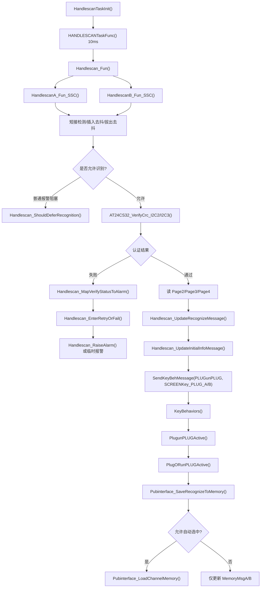

手柄数据流向图：

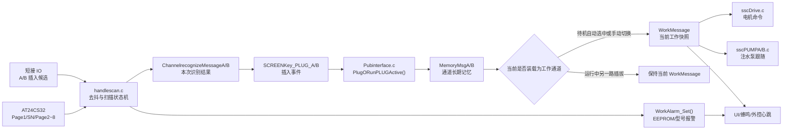

手柄运行按键调用与控制数据流：

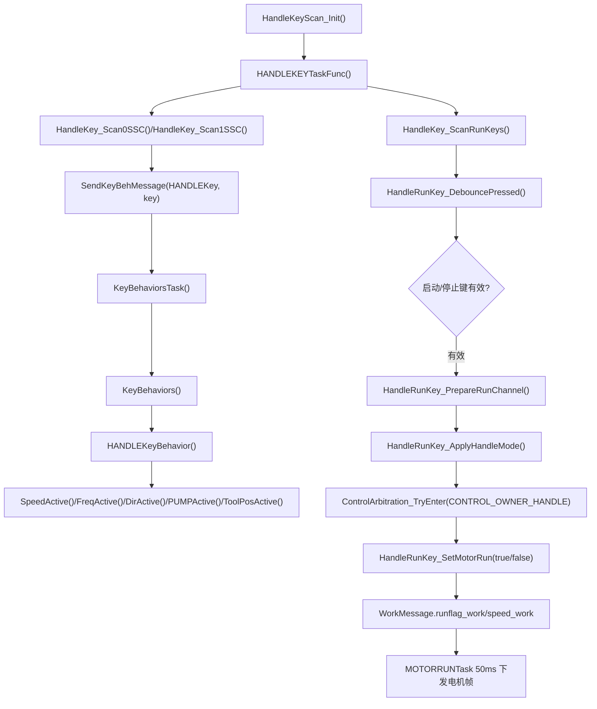

这张图用于区分两类手柄输入：普通按键先进入 `sscKEYBH.c` 的统一按键行为队列；独立运行键走 `HandleRunKey_*`，在启动电机前还要检查手柄型号、通道在线、报警状态和控制权仲裁。

状态机和时间参数：

| 阶段 | 进入条件 | 动作 | 退出条件 |
| --- | --- | --- | --- |
| `IDLE` | 当前无稳定插入 | 清空扫描缓存和刀具规格缓存，等待短接低电平 | 检测到插入候选后进入 `DEBOUNCE_IN` |
| `DEBOUNCE_IN` | 短接低电平出现 | 累计插入去抖 50ms | 低电平连续稳定后进入 `WAIT_VERIFY`，若中途断开回 `IDLE` |
| `WAIT_VERIFY` | 插入去抖通过 | 等待 200ms，让插头、电源和 EEPROM 总线稳定 | 到时进入 `VERIFY` |
| `VERIFY` | 等待结束或重试到时 | 调用 `AT24CS32_VerifyCrc_I2C2/I2C3()` 做 Page1 + SN + Page2~8 认证 | 认证通过进 `READ_INFO`，失败进 `RETRY_WAIT` 或 `VERIFY_FAIL` |
| `READ_INFO` | 认证通过 | 读 Page2 16B、Page3 16B、Page4 整页并解析 | 全部解析通过后上线；读取或映射失败进入重试/失败态 |
| `ONLINE` | 识别成功并发送插入事件 | 保持在线，只监控拔出候选 | 短接断开进入 `DEBOUNCE_OUT` |
| `DEBOUNCE_OUT` | 在线后短接断开 | 累计拔出去抖 500ms | 断开稳定后清本通道状态并发送拔出事件；若短接恢复回在线相关流程 |
| `RETRY_WAIT` | 前 1~2 次认证/读取失败 | 等待 200ms 快速重试 | 到时回 `VERIFY` |
| `VERIFY_FAIL` | 第 3 次连续失败 | 保持失败态，监控拔出，同时每 1000ms 慢速自恢复重试 | 仍插着则周期性回 `VERIFY`，拔出则清状态 |

认证算法按固定布局执行：

1. 读取 Page1 原始 32 字节，先校验 Page1 页尾；Page1 前 8 字节是存储认证值，Page1 尾 2 字节只参与页校验，不参与认证值比较。
2. 从 AT24CS32 序列号区读取 SN 16 字节，设备地址使用 `0xB0/0xB1`，字地址固定 `0x0800`。
3. 读取 Page2~Page8 共 7 页、224 字节；每一页都先做页尾校验，且认证输入包含每页最后 2 字节页校验。
4. 拼接认证输入：`SN(16B) + Page2~Page8(224B)`，总长度 240 字节。
5. 对同一 240 字节输入计算 4 组 CRC16，初值均为 `0xFFFF`，多项式分别为 `0x1021`、`0x8005`、`0x3D65`、`0xA097`。
6. CRC 算法为高位优先：每字节先 `crc ^= data[i] << 8`，循环 8 bit；若 `crc & 0x8000` 则左移后异或多项式，否则只左移。
7. 4 个 CRC16 按大端拼成 8 字节：`crc1_H, crc1_L, crc2_H, crc2_L, crc3_H, crc3_L, crc4_H, crc4_L`。
8. 将计算出的 8 字节与 Page1 `[0..7]` 比较；完全一致才认为认证通过。

认证伪代码：

```text
page1 = read_raw_page(0)
if read_fail(page1): return PAGE1_READ_FAILED
if checksum(page1[0..29]) != u16be(page1[30..31]): return PAGE1_CHECKSUM_FAILED

stored_auth = page1[0..7]
sn = read_sn(addr = 0x0800, len = 16)
if sn_fail: return SN_READ_FAILED

auth_pages = []
for page in Page2..Page8:
    buf = read_page(page)
    if read_fail(buf) or checksum(buf[0..29]) != u16be(buf[30..31]):
        return DATA_READ_FAILED
    auth_pages += buf

input = sn + auth_pages
calc = crc16(input, 0xFFFF, 0x1021)
     + crc16(input, 0xFFFF, 0x8005)
     + crc16(input, 0xFFFF, 0x3D65)
     + crc16(input, 0xFFFF, 0xA097)
return OK if calc == stored_auth else CRC_MISMATCH
```

页校验规则是所有业务页读写的底线：

| 项 | 规则 |
| --- | --- |
| 页大小 | 32 字节 |
| 有效数据 | `[0..29]` |
| 校验存储 | `[30]` 高字节，`[31]` 低字节 |
| 校验公式 | `uint16 sum = page[0] + ... + page[29]`，自然 16 位截断 |
| 读整页 | `AT24CS32_ReadPage_*()` 读 32B 后立即校验，不通过返回失败 |
| 写整页 | `AT24CS32_WritePage_*()` 写入前自动重算 `[30..31]` |

认证返回码和报警映射：

| 认证返回码 | 原因 | 扫描层处理 |
| --- | --- | --- |
| `OK` | 认证通过 | 进入 `READ_INFO` |
| `BAD_PARAM` | 参数错误 | 最终失败后映射为本通道 EEPROM 型号报警 |
| `PAGE1_READ_FAILED` | Page1 读取失败 | 同上 |
| `PAGE1_CHECKSUM_FAILED` | Page1 页尾校验失败 | 同上 |
| `SN_READ_FAILED` | 序列号区读取失败 | 同上 |
| `DATA_READ_FAILED` | Page2~8 读取或页校验失败 | 同上 |
| `CRC_MISMATCH` | 4 组 CRC 认证值与 Page1 前 8 字节不一致 | 同上 |

报警码区分：

| 通道状态 | 报警码 |
| --- | --- |
| A 认证最终失败 | `WORK_ALARM_HANDLE_MODEL_ERROR_A`，当前码值 10 |
| B 认证最终失败 | `WORK_ALARM_HANDLE_MODEL_ERROR_B`，当前码值 12 |
| A/B 都在失败保持态 | `WORK_ALARM_HANDLE_MODEL_ERROR_AB`，当前码值 14 |
| 运行中非当前通道坏手柄 | 只触发 3 秒临时蜂鸣、屏幕提示和外控临时报警帧，不写 `WorkMessage.alarm_value` |

认证通过后的信息读取流程：

| 步骤 | 地址/页 | 长度 | 解析内容 | 失败处理 |
| --- | --- | --- | --- | --- |
| 1 | `0x0020`，Page2 起始 | 16B | 手柄主类型、子类型 | 进入快速重试；最终进入 `VERIFY_FAIL`，但当前 `alarm_value=0`，不会形成持续报警 |
| 2 | `0x0040`，Page3 起始 | 16B | 刀具主类型、子类型、直径、长度、角度 | 同上 |
| 3 | Page4，`page_index=3` | 32B | 默认流量、速度上下限、默认速度、频率、报警阈值 | 同上；Page4 使用整页读取，会校验页尾 |

Page2 手柄型号映射：

| Page2 `[0]` | Page2 `[1]` | 内部型号 | 名称 |
| --- | --- | --- | --- |
| `0x6B` | `0x01` | `TMBB_ONLINES` | TMBB |
| `0x6B` | `0x02` | `TMBA_ONLINES` | TMBA |
| `0x6B` | `0x03` | `EMBA_ONLINES` | EMBA |
| `0x6B` | `0x04` | `EMBB_ONLINES` | EMBB |
| `0x6B` | `0x05` | `PXBA_ONLINES` | PXBA |
| `0x6B` | `0x06` | `PXBB_ONLINES` | PXBB |

Page3 刀具型号和规格映射：

| Page3 `[0]` | Page3 `[1]` | 内部刀具型号 | 名称 |
| --- | --- | --- | --- |
| `0x7C` | `0x01` | `MX_YIM_ONLINES` | MXYTM |
| `0x7C` | `0x02` | `MX_YIP_ONLINES` | MXYTP |
| `0x7C` | `0x03` | `PX_YIM_ONLINES` | PXYTM |
| `0x7C` | `0x04` | `PX_YIP_ONLINES` | PXYTP |
| `0x7C` | `0x05` | `JMB_ONLINES` | JMB |
| `0x7C` | `0x06` | `MX_YIM16_ONLINES` | MXYTM16 |

| Page3 偏移 | 字段 | 端序/单位 | 主控处理 |
| --- | --- | --- | --- |
| 0 | 刀具主类型 | 单字节 | 必须为 `0x7C` |
| 1 | 刀具子类型 | 单字节 | 查刀具映射表 |
| 2 | 直径 | 大端，0.1 单位 | `diameter` 和 `paoxueSpeciValue[1]` |
| 4 | 长度 | 大端，0.1 单位 | `length = length_tenth / 10`，规格显示缓存 `[0]=length_tenth/5` |
| 6 | 角度 | 大端，0.1 单位 | `draw` 和规格显示缓存 `[2]` |

Page4 初始运行参数解析：

| 偏移 | 字段 | 端序/单位 | 主控处理 |
| --- | --- | --- | --- |
| 0 | 默认注水流量 | 小端，0.1 单位 | `/10` 后写 `default_injection_flow`，并限制最大 70 |
| 2 | 默认速度 | 小端，x10 | 先按同页最小/最大速度钳位，再写三个方向默认速度 |
| 4 | 最小速度 | 小端，x10 | 写 `speed_min`、`speed_zzmin/fzmin/oscmin` |
| 6 | 最大速度 | 小端，x10 | 若小于最小速度，则按最小速度收敛 |
| 8 | 默认方向 | 单字节 | 当前代码保留入口但忽略原始值，固定返回 `ZZDIR` |
| 9 | 默认频率 | 单字节 | 写 `freq_default`；上下限来自 `FreqMin=0`、`FreqMax=40` |
| 10 | 正转速度报警阈值 | 小端，x10 | 写 `speed_alarm_for` |
| 12 | 反转速度报警阈值 | 小端，x10 | 写 `speed_alarm_rev` |
| 14 | 往复频率报警值 | 单字节 | 写 `freq_alarm_osc`，用于阈值蜂鸣提示 |

识别结果流向：

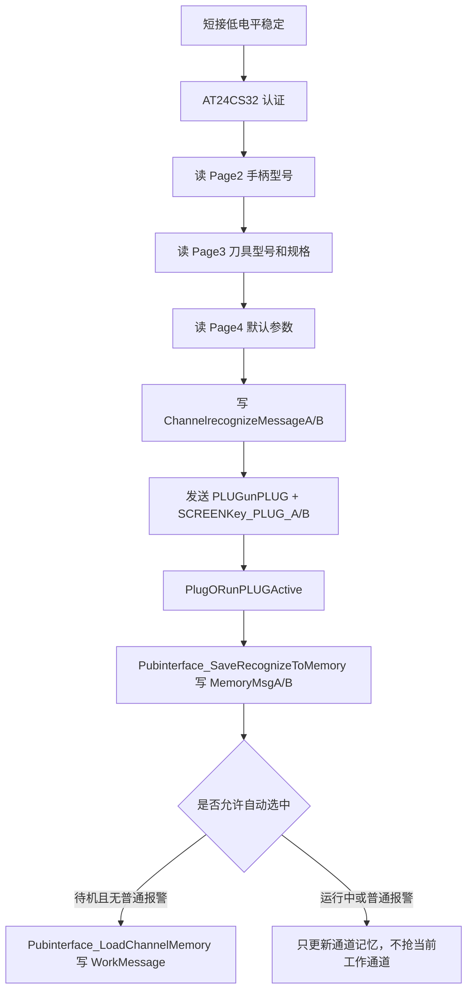

调试时按这个顺序判断问题：

1. 先看短接 IO 是否低电平稳定超过 50ms；如果短接不成立，不会访问 EEPROM。
2. 再看是否处于普通系统报警；普通报警会暂停识别，手柄 EEPROM 报警不会阻止另一通道识别。
3. 打开 `HANDLESCAN_TRACE_ENABLE=1` 后看 `HS,CH=xx,ST=xx,VAL=xx`，`ST=0x05` 是认证返回码，`ST=0x06` 是信息页读取失败，`ST=0x07` 是型号无法映射，`ST=0x08` 是上线。
4. 若看到 `HSDBG`，重点看 `dev_addr`、`mem_addr`、`len`、`hal_status`、`hal_error`、`i2c_state_before/after`；`HAL_BUSY`、`HAL_TIMEOUT` 或 `HAL_I2C_ERROR_TIMEOUT` 会触发一次 `HAL_I2C_DeInit + MX_I2Cx_Init + 2ms` 的软恢复和单次重试。
5. 认证通过但不成为当前通道时，继续看 `PlugORunPLUGActive()` 和 `Pubinterface_ShouldAutoSelectPluggedChannel()`；运行中插入另一路只更新 `MemoryMsgA/B`，不会覆盖 `WorkMessage`。

屏幕插拔事件码：

| 事件码 | 宏 | 含义 |
| --- | --- | --- |
| 70 | `SCREENKey_PLUG_A` | 插入 A 手柄 |
| 71 | `SCREENKey_PLUG_B` | 插入 B 手柄 |
| 72 | `SCREENKey_UNPLUG_A` | 拔出 A 手柄 |
| 73 | `SCREENKey_UNPLUG_B` | 拔出 B 手柄 |

调试断点建议：

| 断点 | 目的 |
| --- | --- |
| `HandlescanA_Fun_SSC()`、`HandlescanB_Fun_SSC()` | 看短接、去抖、EEPROM 校验过程 |
| `PlugORunPLUGActive()` | 看插入/拔出如何影响 `WorkMessage.channel_work` |
| `HandleSwitchActive()` | 看屏幕/按键切换通道是否正确 |
| `Pubinterface_LoadChannelMemory()` | 看 `MemoryMsgA/B` 到 `WorkMessage` 的字段装载 |
| `WorkAlarm_Set()` | 看报警来源和报警码 |

### 4.4 控制权仲裁

主控同时面对脚踏、手柄、屏幕、外控四类输入。正确理解控制权比理解单个串口更重要。

| 控制来源 | 典型入口 | 典型工作模式 | 关键限制 |
| --- | --- | --- | --- |
| 手柄按键 | `handlekey.c` | `HANDLEWORK` | 手柄必须在线且 EEPROM 校验通过 |
| 脚踏 | `sscFOOT.c`、`pedal.c` | `JTWORK` | 脚踏行程和在线状态必须正常 |
| 屏幕触控 | `screenkey.c`、`sscKEYBH.c` | `TOUCHWORK` | 需要按当前界面和通道参数写入 |
| 外部上位机 | `external_comm_task.c` | 外控 owner + `TOUCHWORK` | 需要授权，链路静默会停输出或释放外控 |

测试控制权时不要只看电机是否转，要同时看：

1. `WorkMessage.runflag_work` 是否变更。
2. `WorkMessage.work_mode` 是否符合当前入口。
3. 控制 owner 是否从脚踏/手柄/外控切换。
4. 报警码是否阻止输出。
5. 泵输出是否跟随或独立。

脚踏链路细节：

| 项 | 内容 |
| --- | --- |
| 接口 | UART4，115200 8N2 |
| 接收任务 | `PEDALRECVTask` 3ms 读取串口数据，`FOOTTask` 10ms 解析，`FOOTBHHandle` 25ms 处理行为 |
| 帧格式 | `AA TYPE AD_H AD_L KEY CONNECT PEDAL_TYPE CHECKSUM BB` |
| AD 值 | `AD_H/AD_L` 组成踏板行程值 |
| 连接状态 | `CONNECT=0x01` 在线，`0x00` 离线 |
| 踏板类型 | `0x01` 单踏板，`0x02` 双踏板 |
| 离线阈值 | 当前运行解析分支是 `FOOTTask` 10ms 内 `footDisconnect_times > 100`，约 1s；头文件 `FOOT_OFFLINE_THRESHOLD=20` 和旧注释不是实际判定 |
| 校准读高值 | `FE EF B6 C1 B8 DF 3E 84` |
| 校准读低值 | `FE EF B6 C1 B5 CD A3 00` |

脚踏按键值：

| 值 | 宏 | 含义 |
| --- | --- | --- |
| `0x00` | `FOOT_KEY_NONE` | 无按键 |
| `0x01` | `FOOT_KEY_CENTER_LONG` | 中间长按，当前用于手柄切换 |
| `0x02` | `FOOT_KEY_CENTER_SHORT` | 中间短按 |
| `0x03` | `FOOT_KEY_LEFT_SHORT` | 左边短按 |
| `0x04` | `FOOT_KEY_RIGHT_SHORT` | 右边短按 |
| `0x05` | `FOOT_KEY_RIGHT_LONG` | 右边长按 |

脚踏控制过程：

1. 脚踏在线后，若当前不是手控/触控占用，UI 控制区显示脚控在线，并把 `drivetype_work` 切到 `JTWORK`。
2. 轻踩超过低阈值后，若 A 或 B 是注水泵，会先用当前手柄 Page4 默认流量启动注水泵。
3. 真正启动电机前调用 `ControlArbitration_TryEnter(CONTROL_OWNER_FOOT)`，抢不到 owner 时本周期返回。
4. 电机速度按 `(当前 AD - 低值) / (高值 - 低值) * speed_set_work` 计算。
5. 松开脚踏后清 `runflag_work`、脚踏控制标志和轻排泵标志，并停止对应注水泵。
6. 脚踏掉线时，如果脚踏正在控制电机，主控会停电机，并只清手柄未连接/电机过载这两类可恢复报警。

脚踏测试时不要只看 AD 值，要同时观察 owner、`runflag_work`、`pumpMessageA/B.run_flag` 和 UI 控制区。外控仍有效或触控残留时，脚踏会被拒绝接管。

#### 4.4.1 脚踏解析、定标和行程控制算法

脚踏链路分成“定标串口接收”和“运行控制”两条线，但二者都使用 UART4，所以现场调试要分清当前是在定标页，还是在工作页。

| 任务 | 周期 | 文件 | 责任 |
| --- | --- | --- | --- |
| `PEDALRECVTask` | 3ms | `User\Application\Pedal\pedal.c` | 定标页收脚踏回包，刷新高/中/低点和按键缓存 |
| `FOOTTask` | 10ms | `User\Application\Beep\sscFOOT.c` | 工作态解析脚踏在线、AD、按键和踏板类型 |
| `FOOTBHHandle` | 25ms | `User\Application\Beep\sscFOOT.c` | 消费脚踏消息，执行控制权、泵预启动和电机速度映射 |

脚踏函数调用流程图：

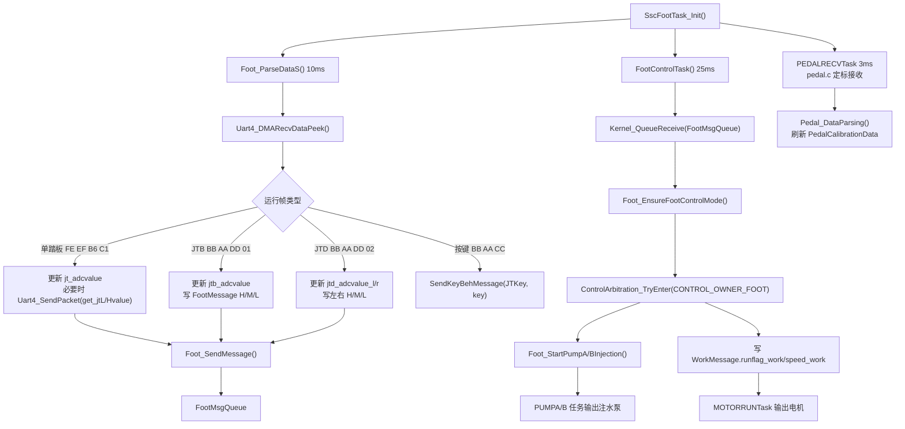

脚踏数据流向图：

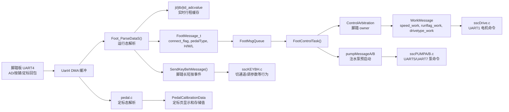

运行解析 `Foot_ParseDataS()` 的核心流程：

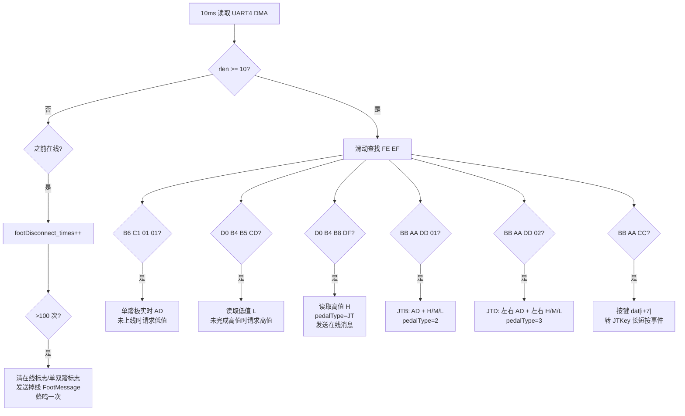

运行帧字段要按实际分支理解：

| 帧族 | 识别字节 | 主控提取 | 备注 |
| --- | --- | --- | --- |
| 单踏板实时值 | `FE EF B6 C1 01 01 AD_H AD_L` | `jt_adcvalue` | 首次看到实时值后会先读低值，再读高值，完成后才认为在线 |
| 单踏板低值 | `FE EF D0 B4 B5 CD L_H L_L` | `LValue_Left` | 当前运行分支只装左侧字段，单踏板兼容左脚逻辑 |
| 单踏板高值 | `FE EF D0 B4 B8 DF H_H H_L` | `HValue_Left` | 收到后 `pedalType=1`，脚踏上线 |
| JTB | `FE EF BB AA DD 01 ...` | `AD`、`H/M/L` | 低阈值只预启动注水泵，中阈值以上才启动电机 |
| JTD | `FE EF BB AA DD 02 ...` | 左右 `AD`、左右 `H/M/L` | 左右踏板可对应 A/B 通道，并可触发通道切换 |
| 按键 | `FE EF BB AA CC ... KEY` | `dat[i+7]` | 0x01 左长、0x02 右长、0x03 中长、0x04 右短等，再转 `JTKey_*` |

`Foot_EnsureFootControlMode()` 是脚踏能不能接管的总闸：

1. 当前已经是 `JTWORK` 时直接放行。
2. `channel_work=CHANNEL_NONE` 时设置 `WORK_ALARM_HANDLE_NOT_CONNECTED`，脚踏不能盲启电机。
3. 外控有效、HMI 控制标志为真、`touchactive_work=TOUCHWORK` 时拒绝脚踏接管。
4. 其它本地 owner 正在占用时拒绝；若其它 owner 占用，行为任务还会丢弃一个脚踏旧消息，防止对方释放后被旧 AD 误启动。
5. 若当前只是历史 `WORK_ALARM_MANUAL_SELECTED`，先清这个旧误报；其它真实报警保持禁止启动。
6. 条件满足后写 `JTWORK` 到 `WorkMessage` 和对应通道记忆，并刷新 UI 控制区。

脚踏速度映射分两级：

| 踏板类型 | 轻踩动作 | 电机启动阈值 | 速度公式 |
| --- | --- | --- | --- |
| JT 单踏板 | `AD > L + JT_threshold` 后立即申请脚踏模式，并启动注水泵 | 同一低阈值 | `(AD - L) / (H - L) * speed_set_work` |
| JTB | `AD > L + JT_threshold` 只启动注水泵 | `AD > M + JT_threshold` | `(AD - M) / (H - M) * speed_set_work` |
| JTD 左踏板 | 左侧轻踩启动注水泵 | 左侧 `AD > M_Left + JT_threshold` | `(AD_Left - M_Left) / (H_Left - M_Left) * speed_set_work` |
| JTD 右踏板 | 右侧轻踩启动注水泵 | 右侧 `AD > M_Right + JT_threshold` | `(AD_Right - M_Right) / (H_Right - M_Right) * speed_set_work` |

注意两个细节：

1. 如果 `speed_set_work=0`，脚踏启动前会用当前手柄 Page4 默认速度补值，避免旧版固定 `60000` 的行为。
2. 运行分支没有统一防御 `H==L` 或 `H==M`，定标异常时可能除 0 或得到异常速度；这应进入脚踏定标专项测试。

JTD 双踏板还有“踩非当前通道时尝试切通道”的逻辑。左踏板在当前 B 通道时，如果 A 在线，`switchhandle_counts` 连续累计到 10 次后发送 `JTKey_middle_long` 去切 A；行为任务周期 25ms，所以代码实际门槛约 250ms，注释里的 500ms 需要实测确认。右踏板在当前 A 通道时按对称逻辑尝试切 B，但当前代码检查的是 `WorkMessage.Channel_Aonline`，需要确认是否应为 `Channel_Bonline`。

脚踏释放动作不是简单停电机，还要做这些清理：

1. 清 `WorkMessage.runflag_work` 和 `speed_work`。
2. 清 `jtL_control_flag/jtR_control_flag`。
3. 如果轻踩阶段启动过注水泵，清 `jtL_gentlypump_flag` 并停对应 A/B 注水泵。
4. 只允许清 `WORK_ALARM_HANDLE_NOT_CONNECTED` 和 `WORK_ALARM_MOTOR_OVERLOAD` 这两类脚踏相关可恢复报警，不能误清通讯、HALL、UID、EEPROM 等故障。

### 4.5 电机控制链路

主控到无刷/有刷驱动板的链路：

1. `WorkMessage` 中保存目标方向、速度、频率、保护电流等运行参数。
2. `sscDrive.c` 周期 50ms 生成 UART1 控制帧。
3. `motoruartdata.c` 周期 3ms 解析驱动板回包。
4. `WorkMessage.driver_speed_feedback` 保存驱动板反馈实际转速，单位沿用驱动协议中的“转速/10”。
5. `WorkMessage.driver_current_x100` 保存实时电流，单位 0.01A，只用于监测上传，不覆盖 `current_work` 保护电流。

主控发给驱动板的私有控制帧为 11 字节，当前 `sscDrive.c` 下发的是测试尾 `BB AA`，不带 CRC：

```text
AA MODE FREQ MOTOR SPD_H SPD_L RUN_TYPE CUR_H CUR_L BB AA
```

参考驱动工程 `mcuart.c` 的接收条件是 `CalcCRC == RxCRC || RxCRC == 0xAABB`，因此当前主控的 `BB AA` 尾会被驱动当作测试旁路帧接受。调试时要明确：主控下发命令目前不验证 CRC，驱动回包才由主控做 CRC 校验；如果后续要把主控下发改成正式 CRC，两端必须同时改。

电机命令字段生成规则：

| `WorkMessage` 输入 | 下发字段 | 规则 |
| --- | --- | --- |
| `dir_work=ZZDIR` | `MODE=0x01`，`FREQ=0` | 正转 |
| `dir_work=FZDIR` | `MODE=0x02`，`FREQ=0` | 反转 |
| `dir_work=OSCDIR` | `MODE=0x03`，`FREQ=min(freq_work,100)` | 往复；驱动端会再按自己的规则处理频率 |
| `channel_work=CHANNEL_A` 且非有刷刀具 | `MOTOR=0x01` | A 通道无刷 |
| `channel_work=CHANNEL_B` 且非有刷刀具 | `MOTOR=0x02` | B 通道无刷 |
| `channel_work=CHANNEL_A` 且 `tool_type` 为一体刨/一体磨 | `MOTOR=0x03`，`RUN_TYPE=0x03` | A 通道有刷 |
| `channel_work=CHANNEL_B` 且 `tool_type` 为一体刨/一体磨 | `MOTOR=0x04`，`RUN_TYPE=0x04` | B 通道有刷 |
| `hand_model=PXBA/PXBB` 且无刷 | `RUN_TYPE=0x02` | 带 Hall 往复手柄 |
| 其他无刷 | `RUN_TYPE=0x01` | 默认无 Hall |
| `speed_work` | `SPD_H=speed_work/2560`，`SPD_L=(speed_work/10)%256` | 主控内部速度为 x10 单位 |
| `current_work` | `CUR_H=current/256`，`CUR_L=current%256` | 保护电流下发值 |

驱动板回包解析：

| 字段 | 来源 | 写入主控 | 说明 |
| --- | --- | --- | --- |
| 帧头 | byte0=`AA` | - | `motoruartdata.c` 在 UART1 DMA 缓冲中滑动查找 |
| 实际转速 | byte4~5 | `driver_speed_feedback` | 只监测/上传，不覆盖目标速度 |
| 驱动错误 | byte7 | `WorkMessage.alarm_value` | 见下方映射表 |
| 实时电流 | byte8~9 | `driver_current_x100` | 单位 0.01A |
| CRC | byte10~11 | 校验通过才解析 | CRC 为 `Common_Crc16(&dat[i],10)`，比较低字节在前 |

驱动 Err 到主控报警映射：

| Err | 驱动含义 | 主控报警 |
| --- | --- | --- |
| 0 | 无故障 | 清除本模块拥有的旧驱动报警 |
| 2 | 过流 OC1 | `WORK_ALARM_MOTOR_OVERLOAD` |
| 5 | 运行堵转 RUNSTALL | `WORK_ALARM_MOTOR_OVERLOAD` |
| 3/4 | 过压/欠压 | `WORK_ALARM_MOTOR_COMM_ERROR` |
| 11/12 | Hall 断线/学习错误 | `WORK_ALARM_HALL_ERROR` |
| 14 | 缺相 | `WORK_ALARM_MOTOR_COMM_ERROR` |
| 其他非零 | 温度、保存、刹车、编码器、握手等 | `WORK_ALARM_MOTOR_COMM_ERROR` |

驱动报非零错误时，主控会停止电机、清手柄/外控/脚踏控制标志，并停 A/B 泵。测试过载保护时必须同时观察电机、泵、蜂鸣、屏幕、外控报警是否一起进入安全状态。

#### 4.5.1 电机命令生成和驱动回包处理算法

电机输出的主线是 `WorkMessage -> MOTORRUN() -> UART1 -> 驱动回包 -> WorkMessage/报警`。

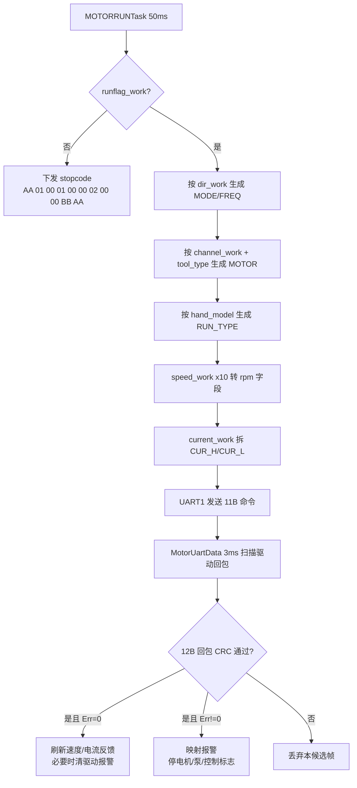

电机函数调用流程图：

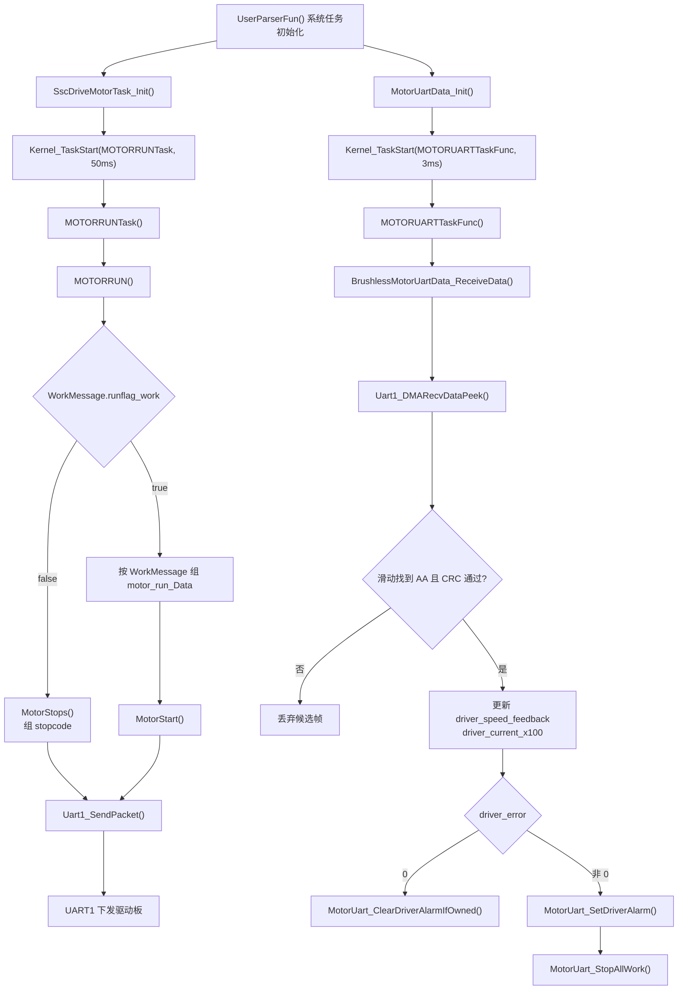

电机数据流向图：

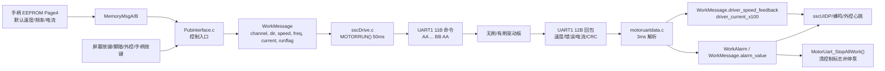

命令生成要按下面顺序查问题：

1. `runflag_work=false` 时不管其它字段是什么，都周期发送 `motor_stopcode`。所以“电机不转”首先查哪个控制来源清了 `runflag_work`。
2. `dir_work=ZZDIR/FZDIR/OSCDIR` 分别对应 `MODE=0x01/0x02/0x03`；只有往复模式使用 `FREQ`，并钳位到 100。
3. 驱动端会把 `R_DATA[2] * 2` 写入往复频率，所以主控不能提前乘 2。
4. `tool_type=PX_YIP_ONLINES/PX_YIM_ONLINES` 时按有刷刀具处理，A/B 分别下发 `MOTOR=0x03/0x04` 和 `RUN_TYPE=0x03/0x04`。
5. 其它刀具按无刷处理，A/B 分别下发 `MOTOR=0x01/0x02`；只有 `hand_model=PXBA/PXBB` 时 `RUN_TYPE=0x02`，其它无刷默认 `0x01`。
6. `speed_work` 内部是 x10 单位，下发时 `SPD_H=speed_work/2560`、`SPD_L=(speed_work/10)%256`，驱动端再用 `(SPD_H<<8 | SPD_L) * 10` 还原。
7. `current_work` 是保护电流命令，不等同于回包实时电流；回包实时电流写入 `driver_current_x100`。

驱动回包解析的关键边界：

| 项 | 当前实现 | 调试含义 |
| --- | --- | --- |
| 接收任务 | `MOTORUARTTaskFunc` 3ms | 如果回包太慢，报警不会及时刷新；如果回包太快，要看 DMA 缓冲是否被覆盖 |
| 帧头搜索 | 在 UART1 DMA 快照中滑动找 `0xAA` | 粘包时可以解析后续帧 |
| CRC | `Common_Crc16(&dat[i],10)` 对比 `dat[i+10] + (dat[i+11]<<8)` | 回包 CRC 是低字节在前 |
| 最短长度判断 | `rlen < 11` 直接返回 | 但后面实际读到 `i+11`，本质需要 12 字节 |
| 循环条件 | `i < (rlen - 11)` | 当 `rlen` 正好等于 12 时循环不进入，需用回包模拟器验证是否丢完整单帧 |
| 故障动作 | 任意非零 Err 都停电机、停泵、清控制标志 | 故障恢复后只有 Err=0 且报警归属本模块时才清驱动报警 |

开口定位 `ToolPosMay(channel, direction, angel)` 走同一条 UART1 私有帧，但 `MODE=0x04/0x05`，`SPD_L` 字节被当作角度步数。驱动工程中模式 4/5 又存在 `CtlMode != 4 || CtlMode != 5` 永真风险，所以开口定位必须做独立台架验证，不能只靠正反转电机测试覆盖。

### 4.6 泵与压力闭环

主控泵相关文件：

| 文件 | 功能 |
| --- | --- |
| `User\Application\Beep\sscPUMPA.c` | A 泵行为任务，周期 25ms |
| `User\Application\Beep\sscPUMPB.c` | B 泵行为任务，周期 100ms |
| `User\Application\Pump\pump.c` | 泵输出和压力数据读取 |
| `User\Application\include\pump_pressure_control.h` | 泵压力闭环数据源说明 |
| `User\Peripheral\uart\soft_uart.c` | 解析 CS1237 压力传感器帧 |
| `User\Application\ExternalComm\external_comm_task.c` | 心跳上传泵和压力扩展字段 |

压力映射：

| 主控软串口 | RX | 现场泵 | 写入对象 |
| --- | --- | --- | --- |
| `SIM_UART_1` | PE4 | B 泵压力传感器 | `pumpMessageB` |
| `SIM_UART_2` | PE6 | A 泵压力传感器 | `pumpMessageA` |

主控对 CS1237 的合法设备码白名单：

| 设备码 | 含义 |
| --- | --- |
| `0x00` | 当前四孔全装磁铁泵的合法在线码 |
| `0x0E` | 历史合法组合 |
| `0x0C` | 历史合法组合 |
| `0x08` | 历史合法组合 |
| `0x09` | 历史合法组合 |

注意：压力传感器文档列出的设备码包含 `0x0F/0x0E/0x0C/0x08/0x09`，主控当前白名单包含 `0x00` 但不含 `0x0F`。这属于跨工程协议差异，必须实测霍尔位组合后统一。

泵输出方向、物理口和速度公式：

| 逻辑泵 | 默认逻辑输出函数 | 物理口互换开关为 1 时实际串口 | `DRAWWATER` 方向/公式 | `INJECTWATER` 方向/公式 | `POURWATER` 方向/公式 |
| --- | --- | --- | --- | --- | --- |
| A 泵 | `Pump_SetSpeedS_A()` | UART7 | `pump_dir=0`，速度限 15，`uart_data=speed*42` | `pump_dir=1`，速度限 `PUMP_INJECTWATER_SPEED_MAX=300`，`uart_data=(speed*0.02+2.1)*speed` | `pump_dir=1`，速度限 300，`uart_data=speed*0.62` |
| B 泵 | `Pump_SetSpeedS_B()` | UART5 | `pump_dir=1`，速度限 15，`uart_data=speed*42` | `pump_dir=0`，速度限 `PUMP_INJECTWATER_SPEED_MAX=300`，`uart_data=(speed*0.02+2.1)*speed` | `pump_dir=0`，速度限 300，`uart_data=speed*0.62` |

最终发给泵/步进板的 6 字节帧是：

```text
AA DIR SPEED_H SPEED_L BB AA
```

其中 `DIR` 在发送函数内做了一次反向映射：`pump_dir` 为真时发 `0x00`，为假时发 `0x01`。现场调方向时要同时记录“业务方向”“pump_dir”和线上 `DIR`，不要只看变量名。

压力闭环规则：

| 项 | 当前值/行为 |
| --- | --- |
| 总开关 | `PUMP_PRESSURE_CONTROL_ENABLE=1` |
| A 泵压力源 | 固定 `pumpMessageA`，即 SIM_UART_2/PE6 |
| B 泵压力源 | 固定 `pumpMessageB`，即 SIM_UART_1/PE4 |
| 普通限速 | 阈值以下不降速，阈值到硬停倍率之间线性降速 |
| 硬停倍率 | `PUMP_PRESSURE_CONTROL_STOP_RATIO_NUM/DEN = 3/2 = 1.5` |
| 硬停动作 | 本周期输出压到 0，不清 `run_flag`，压力恢复后可自动继续 |
| 排空计时 | 压力硬停期间不累计排空时间 |
| 调试输出 | `PUMP_PRESSURE_CONTROL_UART10_DEBUG_ENABLE=0`，交付版不应打开 |

外控固定注水泵识别开关：

| 宏 | 当前值 | 影响 |
| --- | --- | --- |
| `EXTERNAL_COMM_UART5_INJECT_PUMP_FIXED_ENABLE` | 1 | A 泵在外控链路中固定在线且类型为注水泵 |
| `EXTERNAL_COMM_UART5_INJECT_PUMP_FOLLOW_HANDLE_ENABLE` | 1 | 当前手柄运行时，A 注水泵可跟随运行用于冷却 |
| `EXTERNAL_COMM_PUMPB_INJECT_PUMP_FIXED_ENABLE` | 1 | B 泵在外控链路中固定在线且类型为注水泵 |

这一组开关是交付配置，能绕开没有 CS1237 霍尔识别时泵不能启动的问题，但也意味着心跳看到的泵在线/类型不一定完全来自压力下位机。调试“泵明明没接压力板但上位机显示在线”时，先查这些宏。

泵/压力调试断点：

| 断点/观察点 | 目的 |
| --- | --- |
| `Cs1237_UpdatePumpMessage()` | 看压力帧是否进了正确的 A/B `pumpMessage` |
| `PUMPA_ApplyPressureClosedLoop()`、`PUMPB_ApplyPressureClosedLoop()` | 看阈值、重量和限速结果 |
| `Pump_SetSpeedS_A()`、`Pump_SetSpeedS_B()` | 看最终 UART5/UART7 输出口和线上 6 字节 |
| `ExternalComm_ApplyFixedPumpIdentity()` | 看外控固定识别是否覆盖在线状态和类型 |
| `ExternalComm_RefreshUart5PumpRunState()` | 看 A 注水泵“外控独立运行”和“手柄跟随运行”的并集 |

#### 4.6.1 泵输出与压力闭环算法

泵任务不是收到一次队列消息就直接输出一次，而是周期性从公共 `pumpMessageA/B` 取当前运行状态。队列只作为兼容入口更新 `type` 和 `speed_work`。

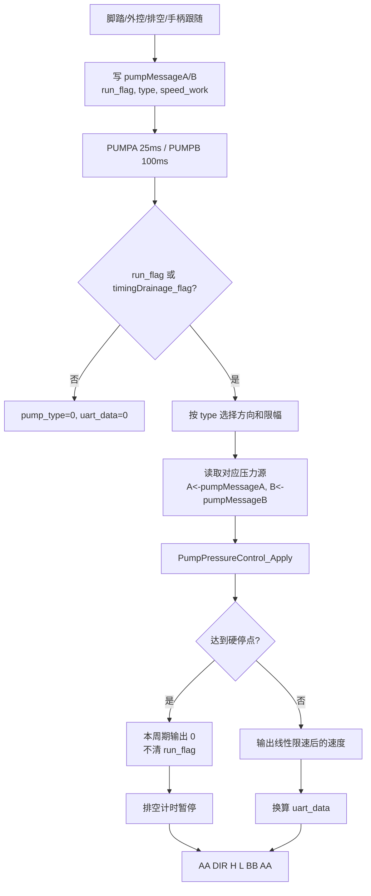

泵函数调用流程图：

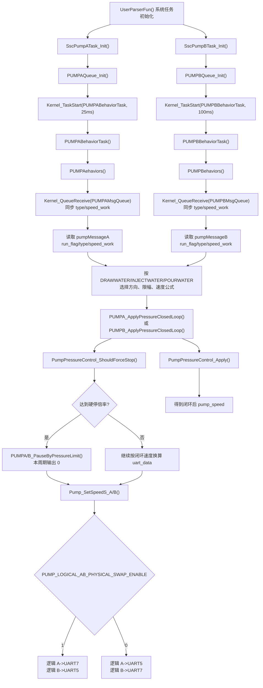

泵与压力数据流向图：

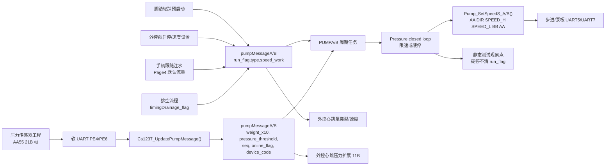

泵类型到输出值的计算顺序是固定的：

1. 先根据 `type` 选择业务方向 `pump_dir` 和业务速度上限。
2. 再用压力闭环把业务速度降速或压到 0。
3. 最后把闭环后的速度换算成 UART 速度字。
4. 发送函数内把 `pump_dir` 翻译成线上 `DIR`：`pump_dir=true` 发 `0x00`，`pump_dir=false` 发 `0x01`。
5. `PUMP_LOGICAL_AB_PHYSICAL_SWAP_ENABLE=1` 时，逻辑 A 最终走 UART7，逻辑 B 最终走 UART5。

压力闭环公式：

```text
threshold_x10 = threshold_g * 10
stop_x10 = threshold_x10 * PUMP_PRESSURE_CONTROL_STOP_RATIO_NUM / PUMP_PRESSURE_CONTROL_STOP_RATIO_DEN

if target_speed == 0: return 0
if threshold_g == 0: return target_speed
if weight_x10 <= threshold_x10: return target_speed
if weight_x10 >= stop_x10: return 0

available = stop_x10 - threshold_x10
remaining = stop_x10 - weight_x10
return target_speed * remaining / available
```

默认硬停倍率是 `3/2`，所以阈值 400g 时：

| `WeightX10` | 实际重量 | 输出比例 |
| --- | --- | --- |
| `<=4000` | `<=400.0g` | 100% |
| `5000` | `500.0g` | 约 50% |
| `>=6000` | `>=600.0g` | 0，本周期硬停 |

硬停不是锁存故障。`PUMPA_PauseByPressureLimit()`、`PUMPB_PauseByPressureLimit()` 只让本周期输出 0，不清 `run_flag`、不清手动启动请求，也不清手柄跟随请求。压力掉回硬停点以下后，下一周期会按原 `speed_work` 继续闭环输出。这个行为适合“压力释放后自动恢复注水”，但测试时必须确认不会在管路弹性释放后产生频繁启停。

排空 `timingDrainage_flag` 的计时也受压力硬停影响：压力硬停期间不增加 `timingDrainage_times`，避免高压等待消耗排空时长。A/B 都是 `>100` 次后结束，但 A 周期 25ms 约 2.5s，B 周期 100ms 约 10s，二者实际排空时间不同。

#### 4.6.2 软 UART 压力帧解析算法

压力下位机到主控没有硬件 UART，而是两路 GPIO 软串口：

| 通道 | RX | 业务映射 | 采样 |
| --- | --- | --- | --- |
| `SIM_UART_1` | PE4 | B 泵压力传感器 -> `pumpMessageB` | 9600 8N1，TIM11 |
| `SIM_UART_2` | PE6 | A 泵压力传感器 -> `pumpMessageA` | 9600 8N1，TIM11 |

软 UART 位级状态机：

1. EXTI 捕获 RX 下降沿，只有全局 `active_channel=SIM_UART_NONE` 时才锁定该通道。
2. 定时器先等半个 bit 时间确认起始位。
3. 再按 1 bit 时间采 8 个数据位，低位先收。
4. 最后采停止位；停止位异常增加 framing error。
5. 完成的字节先进入 ISR 环形缓冲，再由 100ms `SimUartTaskFunc` 搬到协议解析器。

全局只有一个 active receiver。若 A/B 两个压力模块同时起始：

| 场景 | 当前动作 | 结果 |
| --- | --- | --- |
| A 正在收，B 起始位到来 | B 的 `overlap_drop_count++`，B EXTI 暂时抑制 | B 当前字节或整帧可能丢失 |
| B 正在收，A 起始位到来 | A 同理被抑制 | A 当前字节或整帧可能丢失 |
| 两路错相超过一帧时间 | 可交替完整接收 | 心跳中 A/B `seq` 都应递增 |

CS1237 协议帧固定 21 字节：

```text
AA 55 02 01 0C Seq RawCs1237(4LE) WeightX10(4LE) ThresholdG(2LE) DeviceCode CRC_L CRC_H 55 AA
```

校验条件：

1. byte0/1 必须是 `AA 55`。
2. byte2/3/4 必须是 `02 01 0C`。
3. byte19/20 必须是 `55 AA`。
4. CRC16/MODBUS 覆盖 `frame[2]` 起 15 字节，帧内 CRC 小端。
5. 无效帧不会整体清空，解析器会在候选帧内部继续搜索下一处 `AA55` 重同步。

软 UART 压力函数调用流程图：

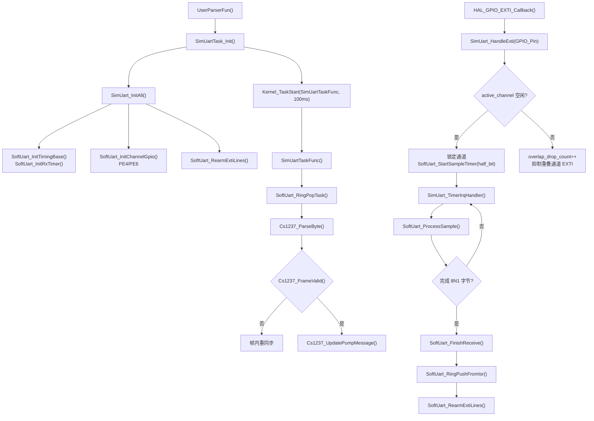

压力帧数据流向图：

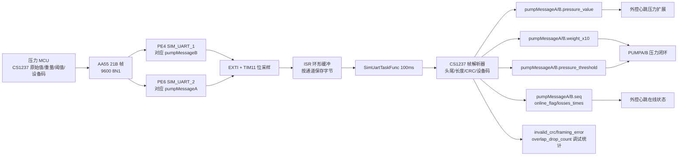

`DeviceCode` 只用于 `online_flag` 和 `losses_times`，不能写 `pumpMessage.type`。主控当前合法码是 `0x00/0x0E/0x0C/0x08/0x09`；压力工程协议头文件合法码是 `0x0F/0x0E/0x0C/0x08/0x09`。这会直接影响“压力板在线但泵不允许启动/上位机显示离线”的判断。

### 4.7 外部通信链路

主控外部通信由 UART2 处理：

| 文件 | 功能 |
| --- | --- |
| `User\Application\include\external_comm_protocol.h` | 协议常量、帧结构、解析和组帧 API |
| `User\Application\ExternalComm\external_comm_protocol.c` | 查找帧头、校验长度、帧尾、CRC、组 ACK 和心跳 |
| `User\Application\ExternalComm\external_comm_task.c` | UART2 FIFO、命令处理、外控授权、心跳上传、链路超时 |

关键周期和超时：

| 宏 | 当前值 | 说明 |
| --- | --- | --- |
| `EXTERNAL_COMM_TASK_PERIOD_MS` | 10ms | UART2 外控任务周期 |
| `EXTERNAL_COMM_HEARTBEAT_PERIOD_MS` | 100ms | 主控主动上传心跳周期 |
| `EXTERNAL_COMM_LINK_STOP_OUTPUT_TIMEOUT_MS` | 1000ms | 外控链路静默 1s 后停电机和泵输出，但保留授权 |
| `EXTERNAL_COMM_LINK_RELEASE_TIMEOUT_MS` | 5000ms | 外控链路静默 5s 后释放外控授权 |

静态审查注意点：`EXTERNAL_COMM_LINK_RELEASE_TIMEOUT_MS` 当前值是 5000ms，但源码注释写“静默 30s 后释放外控授权”。调试时以代码值为准，并建议后续把注释或宏值统一。

外控下行命令矩阵：

| FunCode | 含义 | AreaCode/载荷 | 成功 ACK | 常见失败原因 |
| --- | --- | --- | --- | --- |
| `0x01` | 申请外部控制 | InforArea 必须 8 字节授权码；V1 只校验长度 | `0xAA` | `0xBB` 授权失败；`0xAB` + `BUSY` 表示已有控制来源 |
| `0x02` | 设置运行值 | `0x01` 当前手柄速度，2 字节大端 | `0x01` + Area + 值 | 未外控、无通道、长度错 |
| `0x02` | 设置运行值 | `0x02` 当前手柄频率，1 或 2 字节 | `0x01` + Area + 值 | 未外控、无通道、长度错 |
| `0x02` | 设置运行值 | `0x03` A 泵速度，2 字节大端 | `0x01` + Area + 值 | 未外控、长度错 |
| `0x02` | 设置运行值 | `0x04` B 泵速度，2 字节大端 | `0x01` + Area + 值 | 未外控、长度错 |
| `0x03` | 切换值 | `0x01` 切 A 通道，无载荷也可 | `0x01` + Area + value | A 不在线、运行中、报警中 |
| `0x03` | 切换值 | `0x02` 切 B 通道，无载荷也可 | `0x01` + Area + value | B 不在线、运行中、报警中 |
| `0x03` | 切换值 | `0x03` 方向，value 兼容 0 或 1/2/3 | `0x01` + Area + value | 方向值非法或无载荷 |
| `0x03` | 切换值 | `0x04` 控制模式，只允许 `JTWORK/HANDLEWORK/TOUCHWORK` | `0x01` + Area + value | 模式值非法 |
| `0x03` | 切换值 | `0x05` 工具类型，只允许 `PLANER/GRINDH` | `0x01` + Area + value | 工具类型非法 |
| `0x04` | 控制命令 | `0x01` A 泵启动 | `0x03` + Area | 未外控、泵离线 |
| `0x04` | 控制命令 | `0x02` A 泵停止 | `0x03` + Area | 未外控 |
| `0x04` | 控制命令 | `0x03` B 泵启动 | `0x03` + Area | 未外控、泵离线 |
| `0x04` | 控制命令 | `0x04` B 泵停止 | `0x03` + Area | 未外控 |
| `0x04` | 控制命令 | `0x05` 当前手柄启动 | `0x03` + Area | 未外控、无在线手柄、报警 |
| `0x04` | 控制命令 | `0x06` 当前手柄停止 | `0x03` + Area | 未外控 |
| `0x04` | 控制命令 | `0x07/0x08` 开口定位左右 | `0x03` + Area | 无当前通道 |
| `0x04` | 控制命令 | `0xFF` 急停 | `0x03` + Area | 安全例外，不要求外控 |
| `0x05` | 读业务 EEPROM 页 | Area `0x01..0x08` 映射 Page2/3/4/5/6/8/9/11 | `0x01` EEPROM 上传帧 | 无通道、页码非法、I2C 失败 |
| `0x06` | 读业务整区 | V1 禁用 | `0x06` 失败 | `NOT_SUPPORT` |
| `0x07` | 写业务 EEPROM 页 | Area `0x01..0x08`，InforArea 必须 30 字节 | `0x05` | 长度错、页码非法、I2C 失败 |
| `0x08` | 读导航页 | Area 为实际 Page12..128 或导航序号 1..117 | `0x01` EEPROM 上传帧 | 页码非法、I2C 失败 |
| `0x09` | 读导航整区 | V1 禁用 | `0x06` 失败 | `NOT_SUPPORT` |
| `0x0A` | 写导航页 | Area 为实际 Page12..128 或导航序号 1..117，30 字节 | `0x05` | 长度错、页码非法、I2C 失败 |
| `0xBB` | 上位机退出外控 | 无载荷 | `0x03` + `0xBB` | 通常不失败 |
| `0xFA` | 权限开放 | InforArea 必须 8 字节权限码；V1 只校验长度 | `0xFE` | `0xFF` 权限失败 |

失败 ACK 的 InforArea 固定 2 字节：第 1 字节是失败对象 AreaCode 或 FunCode，第 2 字节是原因。

| 失败原因 | 值 | 含义 |
| --- | --- | --- |
| `BAD_LENGTH` | `0x01` | 载荷长度不符合要求 |
| `BAD_AREA` | `0x02` | AreaCode/FunCode 未定义或取值非法 |
| `NO_CHANNEL` | `0x03` | 当前无选中 A/B 或目标通道不在线 |
| `DEVICE_FAIL` | `0x04` | EEPROM/I2C/泵在线等底层条件失败 |
| `NOT_SUPPORT` | `0x05` | 当前版本明确禁用该命令 |
| `BUSY` | `0x06` | 运行中、报警中、未取得外控或其他控制来源占用 |

#### 4.7.1 外控帧解析、授权、保活和安全动作

外控不是“收到命令就执行”，而是先经过 FIFO 重同步、协议校验、授权/owner 校验、业务前置条件校验，最后才修改 `WorkMessage` 或 `pumpMessageA/B`。

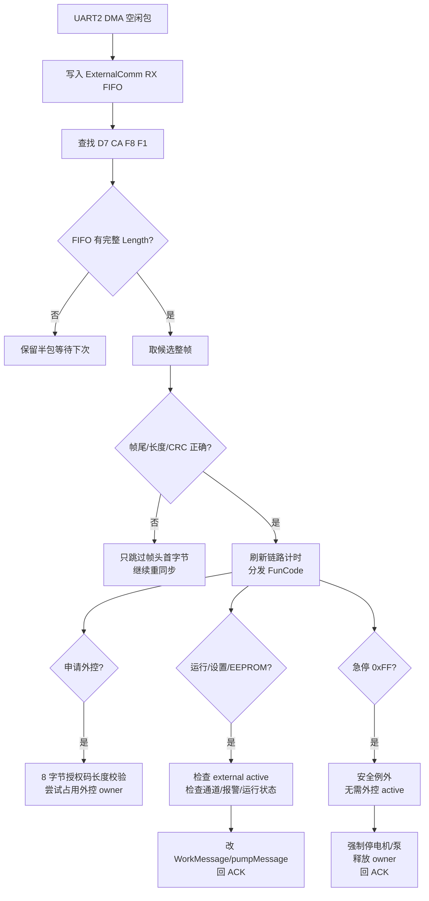

外控函数调用流程图：

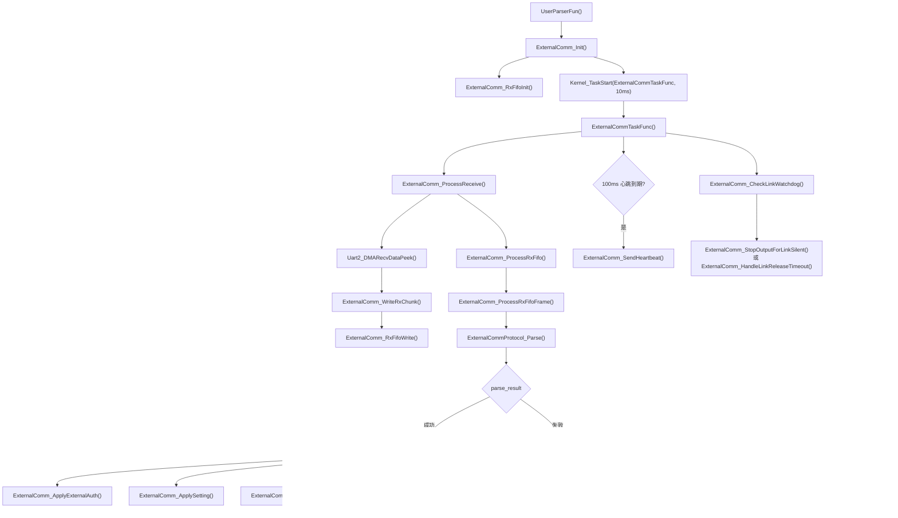

外控数据流向图：

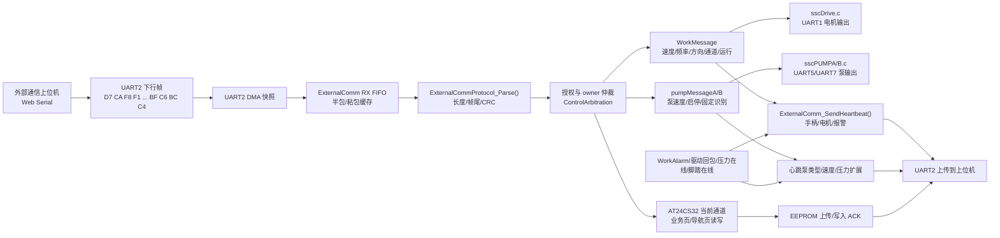

帧解析边界：

| 字段 | 偏移 | 规则 |
| --- | --- | --- |
| Head | 0..3 | 固定 `D7 CA F8 F1`，FIFO 层滑动查找 |
| TranCode | 4 | 下行为 `0x02`，上传为 `0x01` |
| Length | 5..6 | 大端，表示整帧长度，必须在 16..150 |
| FunCode/AreaCode/InforCode | 7/8/9 | 业务分发三元组 |
| InforArea | 10..CRC 前 | 最大 134 字节 |
| CRC | InforArea 后 2B | 大端；覆盖 `TranCode` 到 `InforArea` |
| Tail | CRC 后 4B | 固定 `BF C6 BC C4` |

授权和互斥规则：

1. 申请外控 `0x01` 的 InforArea 当前只校验 8 字节长度，V1 不校验具体密码内容。
2. 授权通过后必须成功调用 `ControlArbitration_EnterExternalControl()`，否则返回 `BUSY`。
3. 外控 active 后，设置速度/频率/泵速度只改设定，不等于启动输出。
4. 切通道、切方向、切工具类型要求“不在运行、无报警、目标在线或取值合法”。
5. 手柄启动 `0x05` 要求当前通道在线且无报警；启动时把 `speed_work` 恢复为 `speed_set_work`，并按开关带动 A 注水泵跟随。
6. 急停 `0xFF` 是安全例外，即使没有外控授权也允许执行。

链路看门狗有两级：

| 静默时间 | 动作 | 设计意图 |
| --- | --- | --- |
| `>=1000ms` | 停电机、停 A/B 泵输出，保留外控授权 | USB/上位机短暂停顿时先进入安全输出，不立刻把控制权交出去 |
| `>=5000ms` | 释放外控 owner，清外控 active | 上位机真正失联后允许脚踏/手柄重新接管 |

源码注释里对长超时仍写“30s”，实际宏值是 5000ms。测试报告必须写实测时间，不要引用旧注释。

外控 EEPROM 读写永远跟随“当前选中通道”，上位机不能直接指定 I2C2/I2C3。读页会读取 32 字节并校验页尾，只上传前 30 字节；写页要求 InforArea 正好 30 字节，驱动写入时生成尾部 2 字节页校验。运行中写 EEPROM 没有统一物理互锁，现场流程应禁止电机/泵运行时批量写页。

外控心跳 InforArea 是动态长度，不是固定结构体。解析规则必须按“在线才追加后续字段”顺序走：

| 顺序 | 字段 | 何时出现 | 说明 |
| --- | --- | --- | --- |
| 1 | A 手柄在线状态 | 固定 | `0x01` 在线，`0xFF` 离线 |
| 2 | A 手柄原始类型 2 字节 | A 在线时 | 来自 `MemoryMsgA.hand_type_raw_major/minor` |
| 3 | B 手柄在线状态 | 固定 | `0x01` 在线，`0xFF` 离线 |
| 4 | B 手柄原始类型 2 字节 | B 在线时 | 来自 `MemoryMsgB.hand_type_raw_major/minor` |
| 5 | 当前选中手柄 | 固定 | A=`0x01`，B=`0x02`，无效=`0xFF` |
| 6 | 当前手柄运行状态 | 固定 | 待机=`0x01`，运行=`0x02`，未接入=`0x03` |
| 7 | 当前手柄模式 | 固定 | 正转=`0x01`，反转=`0x02`，往复=`0x03`，未知=`0xFF` |
| 8 | 当前速度 2 字节大端 | 当前手柄运行中 | `WorkMessage.speed_work`，内部 x10 |
| 9 | 驱动实时电流 2 字节大端 | 当前手柄运行中 | `driver_current_x100`，0.01A |
| 10 | 脚踏在线 | 固定 | 以 `ControlSignalMessage.jt_enable_flag` 为准 |
| 11 | A 泵在线 | 固定 | `pumpMessageA.online_flag` |
| 12 | A 泵类型 1 字节、速度 2 字节、压力扩展 11 字节 | A 泵在线时 | 压力扩展见压力协议 |
| 13 | B 泵在线 | 固定 | `pumpMessageB.online_flag` |
| 14 | B 泵类型 1 字节、速度 2 字节、压力扩展 11 字节 | B 泵在线时 | 压力扩展见压力协议 |

外控链路安全动作：

| 场景 | 主控动作 | 测试方法 |
| --- | --- | --- |
| 合法下行帧到达 | 保活计时清零 | 上位机 300ms 周期发保活，确认不会停输出 |
| 静默 1s | 停电机和 A/B 泵输出，但保留外控授权 | 外控运行中拔 USB 转串口 TX 或暂停发送 1.2s |
| 静默 5s | 释放外控仲裁锁 | 静默超过 5s 后尝试脚踏/手柄接管 |
| 急停 `0xFF` | 强制清电机、泵、外控、触控和仲裁锁 | 不申请外控也发送急停，确认允许执行 |

### 4.8 屏幕、蜂鸣、LED

| 模块 | 文件 | 作用 |
| --- | --- | --- |
| 屏幕按键接收 | `User\Application\ScreenKey\screenkey.c` | UART6 接收屏幕事件，生成行为消息 |
| 屏幕/UI 显示 | `User\Application\Beep\sscUIDP.c` | 周期刷新 UI 状态 |
| 行为分发 | `User\Application\Beep\sscKEYBH.c` | 把屏幕插拔、通道切换、模式变化分发到公共接口 |
| 蜂鸣 | `User\Application\Beep\sscBEEP.c` | 报警、阈值提示、3 秒临时蜂鸣 |
| LED | `User\Application\Led\sysrunled.c` | 系统运行状态灯 |

近期逻辑中，运行中另一路坏手柄会触发 3 秒临时报警/蜂鸣/上位机提示，而不是长期覆盖当前运行通道报警。这一行为必须在回归测试里保留。

### 4.9 EEPROM 与参数记忆

主控中存在两类参数：

1. 手柄 EEPROM 或通道记忆参数，最终进入 `MemoryMsgA/B`。
2. 外部 EEPROM/主控参数页，经由外部通信工具可读写。

调试 EEPROM 相关问题时，要区分：

| 问题 | 应查位置 |
| --- | --- |
| 手柄型号错误 | 手柄 EEPROM 读取、校验、A/B 通道记忆 |
| 屏幕参数不更新 | `MemoryMsgA/B` 到 `WorkMessage` 装载 |
| 外部上位机写入后丢失 | UART2 EEPROM 命令、AT24CXX 写入、页地址 |
| A/B 通道参数串通 | 通道选择、`Pubinterface_LoadChannelMemory()`、`MemoryMsgA/B` |

EEPROM 页规则：

| 规则 | 内容 |
| --- | --- |
| 页大小 | 每页 32 字节 |
| 有效数据 | 前 30 字节 |
| 页校验 | 最后 2 字节由驱动生成/校验 |
| 外控读写 | 上位机只读写 30 字节有效数据 |
| 驱动页下标 | 代码访问为 0 基页下标，文档 PageN 对应 `page_index=N-1` |
| 目标总线 | 当前选 A 通道走 I2C2，当前选 B 通道走 I2C3 |

业务页布局和外控 AreaCode 映射：

| 文档页 | 外控 AreaCode | 驱动 page_index | 主要内容 | 接手注意 |
| --- | --- | --- | --- | --- |
| Page1 | 不暴露 | 0 | 加密/CRC 区，前 8 字节 CRC，尾 2 字节页校验 | 不通过外控普通页接口读写 |
| Page2 | `0x01` | 1 | 手柄或刀具代号、厂家、地域、适配机型、是否重复使用 | 心跳原始类型字节来自 Page2 前 2 字节 |
| Page3 | `0x02` | 2 | 刀具型号、直径、长度、角度、减速比、夹持范围 | 影响 UI 工具规格和电机类型 |
| Page4 | `0x03` | 3 | 默认流量、默认/最小/最大速度、默认方向、默认频率、速度/频率报警阈值、可运行时间/次数 | 最关键运行参数页，速度按 x10 小端保存 |
| Page5 | `0x04` | 4 | 按键自定义功能区，当前保留 | 写入前确认屏幕/手柄是否已支持 |
| Page6 | `0x05` | 5 | 多档位调节区，含档位数和各档速度/报警值 | Page7 保留，外控不单独暴露 |
| Page7 | 不暴露 | 6 | 多档位保留页 | 防止误写 |
| Page8 | `0x06` | 7 | 使用时长、次数、常用速度/频率/流量、报警电流统计、报警次数 | 可用于售后追溯 |
| Page9 | `0x07` | 8 | 客户可编辑区域 | Page10 保留，外控不单独暴露 |
| Page10 | 不暴露 | 9 | 客户可编辑保留页 | 防止误写 |
| Page11 | `0x08` | 10 | 批次、技术状态、总数、销售区域 | 出厂信息，现场慎写 |
| Page12-128 | 导航页命令 | 11-127 | 导航数据区域 | Area 可发实际页号 12-128，也可发导航序号 1-117 |

Page4 字段细化：

| 偏移顺序 | 字段 | 字节数 | 单位/端序 | 映射到主控 |
| --- | --- | --- | --- | --- |
| 1 | 默认流量 | 2 | 0.1 单位，小端 | `default_injection_flow`，手柄跟随注水泵使用 |
| 2 | 默认速度 | 2 | x10，小端 | `speed_*default`、`speed_set_work` |
| 3 | 最小速度 | 2 | x10，小端 | UI/外控限幅 |
| 4 | 最大速度 | 2 | x10，小端 | UI/外控限幅 |
| 5 | 默认运动方向 | 1 | 原始方向字节 | 当前 `Handlescan_ParseInitialDirection()` 忽略原始值并固定返回 `ZZDIR`，如需支持默认反转/往复必须先补编码表 |
| 6 | 默认频率 | 1 | 频率命令值 | `freq_work` |
| 7 | 正转速度报警阈值 | 2 | x10，小端 | `speed_alarm_for` |
| 8 | 反转速度报警阈值 | 2 | x10，小端 | `speed_alarm_rev` |
| 9 | 往复频率报警值 | 1 | 频率命令值 | `freq_alarm_osc` |
| 10 | 可运行时间 | 2 | 业务定义 | 统计/寿命 |
| 11 | 可运行次数 | 2 | 业务定义 | 统计/寿命 |

EEPROM 调试用例：

| 用例 | 步骤 | 预期 |
| --- | --- | --- |
| A/B 读页隔离 | 切 A 后读 Page4，再切 B 后读 Page4 | 两路数据来自不同 EEPROM，总线不串 |
| 写 Page4 默认速度 | 停机、选中通道、外控写 Area `0x03` 30 字节、读回 | 读回一致，重启后默认速度生效 |
| 页校验错误 | 手工破坏尾 2 字节或写入不完整页 | 手柄识别报警，不应装载脏参数 |
| 导航页边界 | 读 Area 1、117、12、128 | 两种编号方式都能映射，越界返回失败 |
| 运行中写页 | 电机/泵运行时尝试写页 | 应按业务规程禁止现场操作，避免 I2C 阻塞和参数跳变 |

## 5. 四个配套工程接入说明

### 5.1 无刷/有刷驱动工程

工程路径：

```text
D:\EH_main\reference\shima_waixie\GE2433_WSYS_2026_3_31\GE2433_WSYS_2026_3_31\0
```

核心结论：

| 项 | 内容 |
| --- | --- |
| MCU/工程 | AT32F403A，工程名 `AT32F403A_FOC` |
| 当前默认 | `YSorWSFlag = 1`，表示无刷；`2` 表示有刷 |
| 主控接口 | USART3，PB10 TX，PB11 RX，115200 8N1，DMA1_Channel3 RX |
| 控制入口 | `UserCode\mcuart.c` |
| 主逻辑 | 500us 定时中断 -> `logic.c` -> `HallSqu_Ctl/HallSqu_Ctl2` -> TMR1/TMR8 PWM |
| 保护开关 | `TEMP_PROTECT_ENABLE = 1`，`STALL_PROTECT_ENABLE = 1` |

驱动板数据流：

```mermaid
flowchart LR
    Main["主控 UART1"] --> U3["驱动 USART3 DMA"]
    U3 --> Mcuart["UserCode/mcuart.c"]
    Mcuart --> AppLogic["App.Logic"]
    AppLogic --> Tmr6["TMR6 500us 中断"]
    Tmr6 --> Hall["HallSqu_Ctl/HallSqu_Ctl2"]
    Hall --> PWM["TMR1/TMR8 PWM 输出"]
```

常用测试帧：

| 用途 | 帧 |
| --- | --- |
| 停止 | `AA 00 00 01 00 00 02 00 00 2C 46` |
| 电机 1 Hall 1000rpm 正转 | `AA 01 00 01 00 64 02 00 C8 F3 2C` |

静态风险：

```c
if(App.Logic.CtlMode != 4 || App.Logic.CtlMode != 5)
```

这个条件永远为真，因为 `CtlMode` 不可能同时等于 4 和 5。预期应为 `&&`。影响是某些模式 4/5 的特殊保护或控制分支可能被错误执行。验证方法：分别下发 `CtlMode=4`、`CtlMode=5`，观察该分支是否仍进入，并确认保护行为是否符合设计。

驱动板私有协议接收算法：

1. USART3 DMA/IDLE 收到主控帧后，`mcuart.c` 先计算接收 CRC。
2. 私有协议进入条件是 `Addr == 0xAA`，并且 `CalcCRC == RxCRC || RxCRC == 0xAABB`。后者正好兼容主控当前下发的 `BB AA` 尾。
3. 驱动端把 `R_DATA[4..5]` 组合成转速，再乘 10 写入 `App.Logic.Set_Spd`，与主控内部 x10 单位对齐。
4. `R_DATA[2]` 往复频率会乘 2 写入 `u8WfFru`，所以主控文档和上位机配置都应把主控下发值视为“协议原值”。
5. `R_DATA[7..8] / 100.0f` 作为保护电流，非 0 时写入无刷通道 1/2 的过流阈值。
6. `YSorWSFlag=1` 时按无刷处理，只允许 `Motor_Kind=1/2`；若收到 `3/4` 且两个无刷通道都等待，会切到有刷模式。
7. `YSorWSFlag=2` 时按有刷处理，只允许 `Motor_Kind=3/4`；若收到 `1/2` 且有刷通道都等待，会切回无刷模式。
8. 正在运行时，如果电机类型、控制模式或 Hall 类型变化，驱动不会直接硬切，而是设置 `Change_Kind/Change_Mode/Change_Hall` 和 `Brake_Kind`，等待刹车过程完成后再切换。
9. 停机命令 `Set_Spd=0` 会清错误，并设置停机刹车或位置刹车标志。
10. 驱动回包是 12 字节，`T_DATA[10]` 写 CRC 低字节，`T_DATA[11]` 写 CRC 高字节；主控 `motoruartdata.c` 正是按这个小端 CRC 解析。

驱动回包字段与主控的对应关系：

| 驱动回包字段 | 驱动来源 | 主控消费 |
| --- | --- | --- |
| byte1 `CtlMode` | `App.Logic.CtlMode` 或有刷 `App2.Log.CtlMode` | 主控暂未按模式做闭环控制，只用于潜在调试 |
| byte4..5 | `Spd_Now/10` 或等效速度字段 | `driver_speed_feedback` |
| byte7 | `App.FB.Err/App.FB2.Err/App2.Err` | 映射为主控报警 |
| byte8..9 | `App.FB.Prot.AllCur * 100` | `driver_current_x100` |
| byte10..11 | CRC16 小端 | 主控回包校验 |

联调时推荐同时抓两端：主控 UART1 TX 看 11 字节命令，驱动 USART3 TX 看 12 字节回包。如果主控持续发 `BB AA` 命令但驱动不动，优先查驱动是否仍保留 `RxCRC == 0xAABB` 旁路。

### 5.2 步进驱动工程

工程路径：

```text
D:\EH_main\reference\shima_waixie\small_2026_3_31\small_2026_3_31
```

核心结论：

| 项 | 内容 |
| --- | --- |
| MCU/框架 | STM32L4，HAL 工程 |
| 主控接口 | USART3，PB10 TX，PB11 RX，115200 8N1，DMA + IDLE |
| 关键文件 | `USER\bujing.c`、`USER\logic.c`、`USER\motor.c`、`USER\protect.c` |
| PWM | TIM1 CH1-CH4 |
| 编码器 | TIM2 |
| 定时 | TIM6/TIM16/TIM1 update |

步进板命令解析在 `USER\logic.c`：

| 字段 | 含义 |
| --- | --- |
| `R_DATA[0] = 0xAA` | 帧头 |
| `R_DATA[1]` | 方向，0 正转，1 反转 |
| `R_DATA[2..3]` | 速度，高字节在前 |
| `R_DATA[4..5]` | CRC，或测试旁路 `BB AA` |

回包形态：

```text
AA DIR SPEED_H SPEED_L ERR CRC_L CRC_H
```

静态风险：

| 风险 | 位置 | 说明 | 测试方法 |
| --- | --- | --- | --- |
| CRC 测试旁路 | `USER\logic.c` | `R_DATA[4]=0xBB` 且 `R_DATA[5]=0xAA` 时绕过 CRC | 现场版禁止用旁路帧做长期测试；串口工具分别发送错误 CRC 和 `BB AA`，确认设备是否仍执行 |
| PWM 注释不一致 | `USER\motor.h` | `PWM_FRE 8000 //10K`，代码是 8000，注释写 10K | 示波器测 TIM1 PWM 频率；统一注释或宏 |
| 方向反转过程 | `USER\logic.c`、`USER\bujing.c` | 目标速度和当前速度符号不一致时可能先置 0 | 从正转切反转，记录减速到 0、再反向启动的时间和是否丢步 |

步进/泵板运行算法：

1. USART3 IDLE 中断停止 DMA，计算本次接收长度，然后重启 DMA。
2. `USER\logic.c` 只要 `R_DATA[0]=0xAA` 且 CRC 通过，或 `R_DATA[4..5]=BB AA` 测试旁路成立，就接受命令。
3. `R_DATA[1]=0` 时 `Set_Speed=R_DATA[2]*256+R_DATA[3]`，`R_DATA[1]=1` 时写成负速度。
4. 如果新设定速度与当前 `Set_SpdTemp` 符号相反，先把目标速度置 0，等减速完成后再反向启动，避免直接反向造成大电流。
5. 开环步进单位为 `Set_Speed * ENCODER_STEPS / 60 / PWM_FRE / 2`，当前 `ENCODER_STEPS=3999`、`PWM_FRE=8000`。
6. PWM 输出按目标相电压与母线电压比例写 TIM1 CCR：`CCR = PWM_STEPS * v_phase / v_supply + PWM_STEPS_OFFSET`。
7. 欠压、过压、过流分别写 `App.Err=E_UV2/E_OV3/E_OC1`，回包 byte4 上传错误码。
8. 回包固定 7 字节：`AA DIR SPEED_H SPEED_L ERR CRC_L CRC_H`。

由于主控泵输出当前也是 `AA DIR SPEED_H SPEED_L BB AA`，步进板会走测试旁路而不是正式 CRC。生产固件若要抗干扰，应取消旁路并让主控泵帧改为正式 CRC，两端同步验证。

### 5.3 外部通信上位机工程

工程路径：

```text
D:\EH_main\soft\FinalSoft_test\外部通信上位机\uart2-external-host-standalone
```

核心文件：

| 文件 | 作用 |
| --- | --- |
| `ExternalCommHost.html` | 单文件 Web Serial 上位机，包含 UI、协议、串口、心跳、EEPROM、压力显示 |
| `ExternalCommHost.json` | 默认配置，串口、授权码、运行参数、安全开关 |

默认配置：

| 配置项 | 默认值 |
| --- | --- |
| 串口 | 115200 8N1，无流控 |
| 授权码 | `11 22 33 44 55 66 77 88` |
| 默认速度 | 3000 |
| 默认频率 | 20 |
| A/B 泵默认值 | 100 / 100 |
| EEPROM 写入确认 | `confirmWrites: true` |
| 急停长按时间 | `holdEmergencyMs: 700` |

运行要求：

1. 使用 Chrome 或 Edge。
2. Web Serial 需要安全上下文，建议从 `localhost` 打开；如果直接双击 HTML 后浏览器禁用串口，应起一个本地静态服务。
3. 连接前确认 USB 转串口映射到主控 UART2。
4. 外控前先确认授权成功，再下发运行或 EEPROM 命令。

上位机和主控使用同一套外部通信协议，帧头 `D7 CA F8 F1`，帧尾 `BF C6 BC C4`。

### 5.4 压力传感器工程

工程路径：

```text
D:\EH_main\soft\Pressure_STM32F030F4
```

核心结论：

| 项 | 内容 |
| --- | --- |
| MCU | STM32F030F4 |
| 串口 | USART1，PA9 TX，PA10 RX，9600 8N1 |
| CS1237 DOUT | PA7 |
| CS1237 SCK | PA5 |
| 默认采样/上报 | 主循环约 200ms 周期 |
| 周期上报帧 | 21 字节 `AA 55 ... 55 AA` |
| 标定命令帧 | `A5 5A ... 5A A5` |
| 标定表保存 | `0x08003800` |
| IROM 限制 | `0x08000000..0x080037FF` |

周期上报载荷：

```text
AA 55 | 02 | 01 | 0C | Seq | RawCs1237(4 LE) | WeightX10(4 LE) | ThresholdG(2 LE) | DeviceCode | CRC16(2 LE) | 55 AA
```

CRC 规则：CRC16/MODBUS，覆盖 `ProtocolVer` 到 `DeviceCode`，不包含帧头、CRC 字段和帧尾。

标定协议命令：

| Cmd | 含义 |
| --- | --- |
| `0x01` | 握手 |
| `0x10` | 写入标定表 |
| `0x11` | 清除标定表 |
| `原命令 | 0x80` | MCU 应答命令字 |

静态风险：

1. 周期上报和标定命令共用 USART1。标定写入期间要测试是否会和 200ms 周期上报互相穿插。
2. 设备码白名单与主控白名单不完全一致，需要统一 `0x00` 和 `0x0F` 的定义。

压力传感器运行算法：

```mermaid
flowchart TD
    A["上电初始化"] --> B["CS1237 初始化\n增益/比例/配置"]
    B --> C["从 Flash 读取阈值和标定表"]
    C --> D["主循环"]
    D --> E["处理标定协议 RX"]
    E --> F["读取 CS1237 24 位有符号原始值"]
    F --> G["分段标定换算 WeightX10"]
    G --> H["PA1..PA4 霍尔输入去抖"]
    H --> I["打包 DeviceCode"]
    I --> J["构建 21B AA55 上报帧"]
    J --> K["USART1 9600 发送"]
    K --> L["HAL_Delay 200ms"]
    L --> D
```

标定表换算规则：

1. Flash 表必须有 2 个以上点，点数不能超过上限。
2. 相邻点 `raw_value` 不能相等，否则无法插值。
3. `real_x10` 必须严格递增，避免重量曲线反向。
4. 原始值落在两个点之间时做线性插值。
5. 原始值落在表外时选择最近的一段做外推。
6. Flash 表 magic、version、check 任一不通过时，优先使用默认标定点；若关闭默认分段标定，则回退到 `CS1237_GetMeasurementX10()`。

霍尔设备码算法：PA1..PA4 稳定状态按 `device_code=(st1<<3)|(st2<<2)|(st3<<1)|st4` 打包。GPIO 使用上拉，磁铁触发后的电平含义必须和主控白名单一起实测确认。当前压力工程合法表包含 `0x0F`，主控合法表包含 `0x00`，说明至少有一端对“有磁铁”高低电平的解释不同。

标定协议与周期上报共用 USART1。主循环在读取重量前后各处理一次 `CalibrationProtocol_Process()`，但写 Flash 时仍可能阻塞周期上报；标定工具测试时要抓串口确认没有半包、粘包或旧帧被当作新压力值。

## 6. 协议速查

### 6.1 主控外部通信协议 UART2

固定帧结构：

```text
Head(4) TranCode(1) Length(2) FunCode(1) AreaCode(1) InforCode(1) InforArea(N) CRC16(2) Tail(4)
```

| 字段 | 当前值/说明 |
| --- | --- |
| Head | `D7 CA F8 F1` |
| Tail | `BF C6 BC C4` |
| 固定开销 | 16 字节 |
| 最大帧长 | 150 字节 |
| CRC | 覆盖 `TranCode` 到 `InforArea` |
| 上传 TranCode | `0x01` |
| 下发 TranCode | `0x02` |

功能码：

| FunCode | 宏 | 含义 |
| --- | --- | --- |
| `0x01` | `EXTERNAL_COMM_FUNC_EEPROM_UPLOAD` | EEPROM 单页数据上传 |
| `0x02` | `EXTERNAL_COMM_FUNC_HOST_SETTING` | 主机设置 |
| `0x03` | `EXTERNAL_COMM_FUNC_HOST_RUNNING` | 主机运行 |
| `0xAA` | `EXTERNAL_COMM_FUNC_HEARTBEAT` | 心跳 |
| `0xBB` | `EXTERNAL_COMM_FUNC_HOST_EXIT` | 主机退出外控 |
| `0xCC` | `EXTERNAL_COMM_FUNC_PLUG_SWITCH` | 接插切换 |
| `0xDD` | `EXTERNAL_COMM_FUNC_ACK` | ACK |
| `0xEE` | `EXTERNAL_COMM_FUNC_HOST_CONTROL` | 主机控制 |

ACK 码：

| ACK | 含义 |
| --- | --- |
| `0x01` | 运行值设置成功 |
| `0x02` | 运行值设置失败 |
| `0x03` | 控制命令成功 |
| `0x04` | 控制命令失败 |
| `0x05` | EEPROM 读写成功 |
| `0x06` | EEPROM 读写失败 |
| `0xAA` | 外部控制申请成功 |
| `0xAB` | 外部控制申请失败 |
| `0xBB` | 授权码或权限码失败 |
| `0xFE` | 功能权限开放成功 |
| `0xFF` | 功能权限未开放 |

### 6.2 主控到无刷/有刷驱动板

```text
AA MODE FREQ MOTOR SPD_H SPD_L RUN_TYPE CUR_H CUR_L BB AA
```

| 字段 | 说明 |
| --- | --- |
| `MODE` | 控制模式 |
| `FREQ` | 往复频率或模式相关频率 |
| `MOTOR` | 电机选择 |
| `SPD_H/SPD_L` | 目标速度 |
| `RUN_TYPE` | Hall/无 Hall/有刷运行类型 |
| `CUR_H/CUR_L` | 保护电流 |
| `BB AA` | 当前主控下发测试尾；驱动接收端以 `RxCRC == 0xAABB` 兼容 |

驱动回包是另一种 12 字节帧，末尾为 CRC 小端：

```text
AA MODE ... SPD_H SPD_L ... ERR CUR_H CUR_L CRC_L CRC_H
```

主控只对驱动回包做 `Common_Crc16(&dat[i],10)` 校验。

### 6.3 主控到步进/泵驱动板

下发：

```text
AA DIR SPEED_H SPEED_L BB AA
```

当前主控泵输出走测试尾；步进/泵板也支持正式 CRC 帧，若后续取消旁路，需要把这里同步改成 `AA DIR SPEED_H SPEED_L CRC_L CRC_H` 并做串口噪声测试。

回包：

```text
AA DIR SPEED_H SPEED_L ERR CRC_L CRC_H
```

注意：步进工程当前支持 `BB AA` 测试旁路，需要在生产调试规程里明确禁止或保留条件。

### 6.4 压力传感器周期上报

```text
AA 55 02 01 0C Seq RawCs1237[4] WeightX10[4] ThresholdG[2] DeviceCode CRC16[2] 55 AA
```

| 字段 | 说明 |
| --- | --- |
| `RawCs1237` | 24 位符号扩展后的 `int32_t`，little-endian |
| `WeightX10` | 0.1g 单位最终重量，little-endian |
| `ThresholdG` | 阈值，g，little-endian |
| `DeviceCode` | 霍尔设备类型码 |
| `Seq` | 递增序号，用于判断丢包/卡死 |

主控软串口解析细节：

| 项 | 当前实现 |
| --- | --- |
| 字节接收 | 下降沿 EXTI 捕获起始位，TIM11 半位/整位采样，8N1 |
| 中断缓冲 | 每路 64 字节 ISR 环形缓冲 |
| 任务队列 | 每路 128 字节静态队列 |
| 解析周期 | `SimUartTaskFunc()` 100ms 搬运并解析 |
| 帧同步 | 按字节寻找 `AA 55`，候选帧无效时从帧内重新找下一处 `AA 55` |
| CRC | CRC16/MODBUS，主控覆盖 frame[2] 开始 15 字节，和压力文档一致 |
| 在线判断 | `DeviceCode` 必须在主控白名单内 |
| A/B 映射 | SIM_UART_1 写 `pumpMessageB`，SIM_UART_2 写 `pumpMessageA` |
| 互斥限制 | 全局 `active_channel` 任意时刻只允许一路接收一个字节，双路同相上报有丢帧风险 |

压力调试抓包建议：

1. 先单独接 A 压力板，确认 `pumpMessageA.seq` 递增、`pumpMessageB.seq` 不动。
2. 再单独接 B 压力板，确认 `pumpMessageB.seq` 递增、`pumpMessageA.seq` 不动。
3. 双路同时接入后，分别测试上电同相和错相上报；若 `seq` 长时间停滞，优先查软串口 active receiver 竞争。
4. 压力超阈值测试要同时看 `weight_x10`、`pressure_threshold`、最终泵 UART 帧速度是否降到 0。

### 6.5 压力传感器标定协议

```text
A5 5A | Ver | Cmd | PayloadLen | Seq | Payload | CRC16(2) | 5A A5
```

标定写入建议只在泵停止、主控不依赖实时压力闭环时做，并记录写入前后的原始值和 `WeightX10`。

## 7. 产品测试调试流程与注意事项

### 7.1 上电前检查

| 检查项 | 目的 |
| --- | --- |
| 电源分组 | 主控、驱动板、步进/泵板、压力板供电电压必须分别确认 |
| 共地 | UART、软串口、驱动控制必须共地 |
| 电机机械负载 | 首次联调建议空载或可控低负载 |
| 泵管路 | 避免堵转、空转、反接导致压力异常 |
| 急停 | 确认主控上电会先执行 `Motor_ErrorEmergencyStop_Ctrl()` |
| 串口工具 | 准备逻辑分析仪或串口抓包，至少可抓 UART1/UART2/压力软串口 |
| 固件版本 | 主控、驱动板、步进板、压力板版本要成套记录 |

### 7.2 最小 bring-up 顺序

1. 只上主控，确认 LED 200ms 周期和 IWDG 300ms 喂狗正常。
2. 接屏幕 UART6，确认开机页和按键事件。
3. 接 A/B 手柄，分别确认短接、插入、拔出、EEPROM 校验和通道切换。
4. 接电机驱动板 UART1，不接负载或低负载，先发停止，再低速运行。
5. 接脚踏 UART4，确认脚踏在线、行程变化和控制权切换。
6. 接步进/泵 A/B，低速验证方向、速度、停止。
7. 接压力传感器 A/B，确认主控能解析 `Seq`、`RawCs1237`、`WeightX10`、`DeviceCode`。
8. 接外部通信上位机 UART2，先授权，再心跳，再运行，再 EEPROM。
9. 做组合测试：手柄运行中插拔另一通道、外控运行中链路静默、压力超阈值、驱动板掉线。

### 7.3 手柄与通道测试用例

| 用例 | 步骤 | 期望 |
| --- | --- | --- |
| A 单独插入 | 待机，插入 A | A 在线，A 成为选中通道 |
| B 单独插入 | 待机，插入 B | B 在线，B 成为选中通道 |
| A 后 B | 待机，先插 A，再插 B | 最后校验通过的 B 成为选中通道 |
| B 后 A | 待机，先插 B，再插 A | 最后校验通过的 A 成为选中通道 |
| 当前通道拔出 | 待机，A/B 都在线且选 A，拔 A | 自动回落到 B |
| 运行中非当前通道拔出 | A 运行，拔 B | A 继续运行，B 状态更新 |
| 运行中当前通道拔出 | A 运行，拔 A | 停止或报警，不能自动切 B 继续运行 |
| A EEPROM 错 | 插入坏 A，B 正常 | 报警码 10，B 仍可识别 |
| B EEPROM 错 | 插入坏 B，A 正常 | 报警码 12，A 仍可识别 |
| A/B 都错 | 插入坏 A 和坏 B | 报警码 14，上位机显示双通道来源 |

手柄 EEPROM 算法专项用例：

| 用例 | 构造方法 | 观测点 | 期望 |
| --- | --- | --- | --- |
| Page1 页校验错 | 破坏 Page1 `[30..31]`，保持前 8 字节不变 | `HS ST=0x05 VAL=PAGE1_CHECKSUM_FAILED`，报警码 | 连续 3 次失败后报本通道 EEPROM 型号错误 |
| Page2~8 认证数据被改 | 改 Page4 任一有效字节并同步或不同步页尾，视需求构造 | 认证返回 `DATA_READ_FAILED` 或 `CRC_MISMATCH` | 页尾错走数据读取失败；页尾对但 Page1 认证值未更新走 CRC 不匹配 |
| SN 读取失败 | 断开或干扰 I2C SN 地址响应 | `HSDBG dev_addr=0xB0/0xB1 mem_addr=0x0800` | 最终映射为本通道 EEPROM 型号错误 |
| Page2 型号未知 | Page2 `[0..1]` 写成未在 `0x6B/0x01..06` 表内的值，并保持认证通过 | `HS ST=0x07`，`ChannelrecognizeMessage` 不上线 | 当前实现最终停在 `VERIFY_FAIL`，但因 `alarm_value=0` 不形成持续报警，应作为待确认风险 |
| Page3 刀具未知 | Page3 `[0..1]` 写成未在 `0x7C/0x01..06` 表内的值，并保持认证通过 | `HS ST=0x07`，刀具规格不更新 | 同上，不能误认为手柄已上线 |
| Page4 默认速度越界 | 默认速度小于最小值或大于最大值 | `MemoryMsgA/B.zz_speed/fz_speed/osc_speed` | 默认速度被钳位到 Page4 最小/最大范围内 |
| Page4 最大小于最小 | 写 `max < min` | `ChannelrecognizeMessage*.speed_*min/max` | 最大值被收敛到最小值，避免速度边界反向 |
| Page4 默认方向非正转 | 写入反转或往复方向字节 | `MemoryMsgA/B.dir`、`WorkMessage.dir_work` | 当前仍为 `ZZDIR`，这是代码现状，不是 EEPROM 写入失败 |
| 运行中另一路坏手柄 | A 正常运行时插入坏 B | `WorkMessage.alarm_value`、屏幕、蜂鸣、外控临时报警 | 只提示 3 秒，不覆盖 A 的运行状态和全局报警 |

### 7.4 脚踏专项测试用例

| 用例 | 步骤 | 期望 |
| --- | --- | --- |
| 单踏板上线 | 只接单踏板，上电后观察 UART4 | 主控依次看到实时 AD、读低值、读高值，`pedalType=1`，UI 脚踏在线 |
| JTB/JTD 识别 | 分别接 JTB、JTD 脚踏 | `pedalType=2/3`，H/M/L 和左右 AD 字段正确 |
| 掉线时间 | 脚踏在线后断 UART4 | 约 1s 后发送掉线消息并蜂鸣，不按 500ms 或 1.6s 判断 |
| 外控占用 | 外控授权并保持 active 时踩脚踏 | 脚踏不改 `WorkMessage`，不启动电机/泵 |
| 触控残留 | 让 `touchactive_work=TOUCHWORK` 后踩脚踏 | 脚踏拒绝接管，需先释放触控/外控状态 |
| 无手柄踩脚踏 | `channel_work=CHANNEL_NONE` 时踩脚踏 | 设置 `WORK_ALARM_HANDLE_NOT_CONNECTED`，电机不转 |
| 单踏板速度线性 | 定标 L/H 后缓慢踩下 | `speed_work` 按 `(AD-L)/(H-L)` 平滑变化，松开清零 |
| JTB 两级阈值 | 低于 M 但高于 L 踩下 | 只启动注水泵，不启动电机；超过 M 后才 `runflag_work=true` |
| JTD 左右通道 | 当前 A/B 分别踩另一侧踏板 | 符合通道切换策略，不应在 B 离线时误切到 B |
| 定标异常 H=L | 构造高低值相等的脚踏回包 | 不应除 0；若当前固件异常，应记录为必须修复项 |
| 定标异常 H=M | 构造高值等于中值 | JTB/JTD 中阈值启动不应产生异常速度 |
| JTB 短包噪声 | 发送 `BB AA DD 01` 但长度不足 16 字节 | 不应越界读取或误上线 |
| 旧消息滞留 | 手柄/外控占用时持续踩脚踏，再释放占用 | 旧脚踏消息应被丢弃，不应释放后突然启动 |
| 轻踩注水泵 | A/B 分别配置为注水泵后轻踩 | 对应 `pumpMessage*.run_flag` 打开，松开后关闭 |

### 7.5 电机测试用例

| 用例 | 步骤 | 期望 |
| --- | --- | --- |
| 上电停止 | 主控和驱动板上电 | 主控先发停机，驱动无异常输出 |
| 主控命令抓包 | 运行正转/反转/往复各一次 | UART1 TX 为 11B `AA ... BB AA`，不是 CRC 尾 |
| 速度单位 | 设置 `speed_work=30000` | 主控下发 `SPD=3000`，驱动内部还原为 30000 |
| 往复频率 | 设置 `freq_work=20/80/150` | 主控下发 20/80/100，驱动端再乘 2 |
| 低速正转 | 目标速度从低值开始 | 驱动板回包速度逐渐接近目标 |
| 低速反转 | 停稳后反转 | 方向正确，电流正常 |
| 往复模式 | 设置频率和速度 | 驱动执行往复，频率符合预期 |
| 有刷/无刷切换 | A/B 分别接有刷和无刷刀具 | `MOTOR/RUN_TYPE` 与刀具类型匹配，驱动等待态下才切模式 |
| Hall 异常 | 人为断开 Hall 或模拟异常 | 主控报警 9 或驱动错误码 |
| 通讯异常 | 拔 UART1 或断驱动板电源 | 主控报警 8，停止输出 |
| 过载 | 增加机械负载 | 主控/驱动进入过载保护，报警 4/6 |
| 回包单帧边界 | 模拟器只回 12 字节完整帧 | 主控应解析；若不解析，验证 `i < rlen-11` 边界问题 |
| 错误码映射 | 分别模拟 Err=2/5/11/12/14/其他 | 主控报警映射符合第 4.5 节，且泵同步停止 |
| 开口定位 | 外控下发左右开口定位 | 驱动模式 4/5 正确执行，不受永真条件误停影响 |

### 7.6 泵与压力测试用例

| 用例 | 步骤 | 期望 |
| --- | --- | --- |
| A 泵方向 | A 泵低速启动 | 实际流向与业务类型一致 |
| B 泵方向 | B 泵低速启动 | 实际流向与业务类型一致 |
| A/B 物理口互换 | 抓 UART5/UART7 | 逻辑 A 走 UART7，逻辑 B 走 UART5 |
| 泵帧格式 | A/B 各启动一次 | 线上为 `AA DIR SPEED_H SPEED_L BB AA` |
| A 压力解析 | 接 A 压力板 | `pumpMessageA` 更新，Seq 递增 |
| B 压力解析 | 接 B 压力板 | `pumpMessageB` 更新，Seq 递增 |
| 双压力同时上报 | A/B 压力板都 200ms 上报 | 主控不应长期丢某一路 |
| 软 UART 同相碰撞 | 两个压力板同步复位同相上报 | 记录 `seq` 丢失和 `overlap_drop_count`，评估是否需要错相 |
| 压力阈值以下 | 设置阈值 400g，施加 300g | 泵速不降 |
| 压力线性降速 | 阈值 400g，施加 500g | 输出约为目标速度 50% |
| 压力硬停 | 阈值 400g，施加 600g | 本周期输出 0，但 `run_flag` 不清 |
| 压力恢复 | 硬停后释放到 450g/350g | 450g 降速恢复，350g 恢复目标速度 |
| 设备码异常 | 改变霍尔组合或断霍尔 | 泵在线状态变化符合白名单 |
| `0x00/0x0F` 差异 | 构造两种设备码 | 主控和压力工程显示差异明确记录 |
| 排空硬停 | 排空期间施加硬停压力 | 压力硬停期间排空计时不增加 |
| A/B 排空时间 | A/B 分别排空 | A 约 2.5s，B 约 10s，确认是否符合产品需求 |
| 固定泵识别 | 不接压力板，仅外控设置泵速/启动 | 固定识别打开时仍显示在线并可控，文档记录这是交付配置 |
| 标定写入 | 通过压力上位机写表 | 写入后重启，标定表仍生效 |

### 7.7 外控上位机测试用例

| 用例 | 步骤 | 期望 |
| --- | --- | --- |
| 浏览器支持 | Chrome/Edge 打开页面 | 连接按钮可用，能请求串口 |
| 授权成功 | 下发默认授权码 | ACK `0xAA` 或权限成功 |
| 授权失败 | 改错授权码 | ACK `0xBB` 或失败提示 |
| 未授权设置 | 不申请外控直接设置速度/泵速 | 返回失败 ACK，`WorkMessage` 不变 |
| 心跳解析 | 主控正常上报 | 100ms 级别刷新，运行/报警/压力字段正常 |
| 粘包/半包 | 串口工具一次发两帧或拆开发一帧 | FIFO 能解析完整帧并保留半包 |
| 错 CRC | 修改 InforArea 后不改 CRC | 主控丢帧，不执行业务 |
| 运行参数设置 | 下发速度、频率、泵值 | ACK 成功，主控 `WorkMessage` 更新 |
| 运行中切通道 | 外控运行时切 A/B | 返回 BUSY，不应切通道 |
| 报警中启动 | 人为设置电机/手柄报警后下发启动 | 返回失败，电机/泵不输出 |
| 急停长按 | 长按急停超过 700ms | 主控停止电机和泵 |
| 未授权急停 | 不申请外控直接发 `0xFF` | 仍执行急停并返回控制 ACK |
| 链路静默 1s | 外控运行中暂停下发 | 电机和泵停止，授权保留 |
| 链路静默 5s | 继续保持静默 | 外控授权释放 |
| 无通道读 EEPROM | 拔掉手柄后读页 | 返回 `NO_CHANNEL`，上位机弹 EEPROM 失败提示 |
| 写 EEPROM 长度 | 写 29/31/30 字节 | 只有 30 字节允许进入写页 |
| EEPROM 批量写 | 开启确认后写入 | 用户确认后写，页数据可读回 |

### 7.8 问题定位速查

| 现象 | 优先检查 |
| --- | --- |
| 主控无任何反应 | 电源、时钟、IWDG、`main()` 是否到 `vTaskStartScheduler()` |
| 屏幕不更新 | UART6、`SCREENKEYTask`、`UIDISPLAYBehaviorTask` |
| 手柄插入无效 | 短接 IO、1-Wire/EEPROM、`handlescan.c` |
| A/B 通道串参数 | `MemoryMsgA/B`、`Pubinterface_LoadChannelMemory()` |
| 手柄运行中突然切通道 | `PlugORunPLUGActive()`、`HandleSwitchActive()` |
| 电机不转 | UART1 帧、驱动板电源、驱动板错误码 |
| 电机转速不对 | 主控速度单位、驱动板 `SPD_H/SPD_L`、回包解析 |
| 泵不转 | UART5/UART7 帧、步进板 CRC、泵固定识别开关 |
| 压力一直离线 | PE4/PE6 映射、9600 波特率、设备码白名单 |
| 外控连上但不能运行 | 授权、owner、报警、外控链路超时 |
| 上位机没有串口权限 | 浏览器、localhost、安全上下文 |

## 8. 逐文件静态审查与预期 bug

### 8.1 主控工程

| 文件 | 静态审查结论 | 预期风险/bug | 建议测试 |
| --- | --- | --- | --- |
| `Src\main.c` | 启动顺序清晰，`Hardware_PostInit()` 在 `App_Bootstrap_Init()` 前 | 如果硬件后初始化失败，应用初始化仍可能继续 | 加启动日志或断点，确认 I2C/UART/GPIO 初始化成功 |
| `Src\freertos.c` | 通过 `Kernel_Scheduler_Start()` 间接创建软任务 | 若软任务未注册成功，业务看似启动但无周期动作 | 断点 `Kernel_TaskStart()`，统计任务数 |
| `User\Application\Src\userparser.c` | 初始化总入口，模块依赖强 | 新增模块容易因顺序错导致串口/公共数据未就绪 | 每次改初始化顺序后做最小 bring-up |
| `User\Kernel\Scheduler\kernel_scheduler.c` | 软任务周期统一管理 | 高频 3ms 任务、10ms 外控和 100ms 压力任务相互影响需要测 CPU 占用 | Tracealyzer 或 GPIO 翻转测周期抖动 |
| `User\Application\include\Pubinterface.h` | 公共状态定义集中 | `WorkMessage` 被多任务读写，字段一致性依赖调用纪律 | 外控、脚踏、手柄并发切换压力测试 |
| `User\Application\Pubinterface\Pubinterface.c` | 报警和通道记忆公共入口 | 若绕过公共装载入口，A/B 参数可能不一致 | grep 查是否直接复制 `MemoryMsg` 字段 |
| `User\Application\Pubinterface\Pubinterface.c` | `SpeedActive()` 按当前通道取速度步进和边界 | B 通道分支使用 `ChannelrecognizeMessageB.speed_*step`，但最大/最小速度仍取 `ChannelrecognizeMessageA.speed_*max/min`，B 手柄速度边界可能被 A 手柄限制 | A/B 写不同 Page4 速度范围，选 B 后连续加减速，确认是否按 B 边界钳位 |
| `User\Application\Pubinterface\Pubinterface.c` | `FreqActive()` 频率加减 | B 通道频率减分支使用 `if (freq_value > ChannelrecognizeMessageB.freq_min)`，从高频减一次可能直接钳到最小值 | 选 B 刨削手柄，频率从 40 减到 30，观察是否错误跳到 0 |
| `User\Application\Handle\handlescan.c` | A/B 扫描和 EEPROM 校验关键 | 报警暂停扫描规则复杂，容易影响另一通道识别 | A/B 坏手柄组合测试 |
| `User\Application\Handle\handlescan.c` | Page2/Page3/Page4 读取和型号映射 | 信息页读取失败、Page2 未知型号、Page3 未知刀具最终以 `alarm_value=0` 进入失败态，可能表现为“不上线但无持续报警” | 构造认证通过但型号未知的 EEPROM，看 UI/上位机是否有足够提示 |
| `User\Application\Handle\handlescan.c` | Page4 默认方向解析 | 当前 `Handlescan_ParseInitialDirection()` 固定返回 `ZZDIR`，EEPROM 默认方向字段不生效 | 写 Page4 默认反转/往复后重插，确认方向仍为正转，并决定是否补编码表 |
| `User\Application\Beep\sscKEYBH.c` | 屏幕事件分发到插拔/切换 | 事件码错误会直接导致通道误切换 | 模拟 `SCREENKey_PLUG/UNPLUG/HANDLE` |
| `User\Application\Handle\handlekey.c` | 手柄按键控制入口 | 手控与脚踏/外控抢控制权时可能产生边界问题 | 手控运行中踩脚踏、外控授权、屏幕停止 |
| `User\Application\Beep\sscBEEP.c` | 报警蜂鸣和临时提示 | 3 秒临时报警不能覆盖长期报警 | 长期报警中触发临时坏手柄提示 |
| `User\Application\Beep\sscDrive.c` | 电机控制帧下发 | 当前主控下发 11B `BB AA` 测试尾，不带 CRC；若现场按正式 CRC 协议理解会误判 | 抓 UART1 TX，确认驱动固件仍接受 `RxCRC=0xAABB` |
| `User\Application\MotorUartData\motoruartdata.c` | 3ms 解析驱动回包 | 循环条件 `i < (rlen - 11)` 但读取到 `i+11`，刚好 12B 单帧可能不解析 | 用模拟器只回一帧 12B，确认 `driver_speed_feedback` 是否更新 |
| `User\Application\MotorUartData\motoruartdata.c` | 驱动 Err 映射 | 任意非零 Err 都会停电机和泵，若驱动误报瞬态 Err 会造成整机停机 | 注入 Err=2/5/11/12/14/15 和恢复 0，观察报警归属和清除 |
| `User\Application\Beep\sscPUMPA.c` | A 泵行为，25ms | A 泵压力数据来自 `SIM_UART_2/PE6`，接线错会闭环错源 | 断 A/B 压力线分别验证 |
| `User\Application\Beep\sscPUMPB.c` | B 泵行为，100ms | B 泵任务周期比 A 慢，排空 `>100` 次导致 B 排空约 10s 而 A 约 2.5s | A/B 同目标压力阶跃和排空时间对比 |
| `User\Application\Pump\pump.c` | 泵输出和压力读取 | 业务泵类型不能被 CS1237 设备码覆盖 | 外控心跳中泵类型和业务类型分别核对 |
| `User\Peripheral\uart\soft_uart.c` | 双路 9600 软 UART + CS1237 解析 | 双路同时上报时只允许一个 active receiver，存在帧碰撞/丢帧风险 | 两个压力板固定 200ms 同周期，上电相位错开和同相都测 |
| `User\Application\ExternalComm\external_comm_protocol.c` | 外控协议解析/组帧 | CRC 覆盖范围正确但需与上位机一致 | 用上位机构造合法/错误 CRC 帧 |
| `User\Application\ExternalComm\external_comm_task.c` | 外控授权、心跳、泵压力上传 | `EXTERNAL_COMM_LINK_RELEASE_TIMEOUT_MS=5000` 但注释写 30s | 实测静默 1s 和 5s 行为，统一注释 |
| `User\Application\ExternalComm\external_comm_task.c` | EEPROM 读写跟随当前通道 | 上位机不能指定 A/B 总线，切通道后批量写页可能写到另一只手柄 | A/B 插双手柄，切换后分别读写 Page4 并读回确认 |
| `User\Application\Beep\sscFOOT.c` | 脚踏解析和行为 | 运行掉线阈值实际约 1s，和头文件 20 次/旧注释 1.6s 不一致 | 脚踏在线后断线，实测 UI/蜂鸣时间 |
| `User\Application\Beep\sscFOOT.c` | 脚踏速度映射 | `(H-L)`、`(H-M)` 未统一防 0，定标异常可能导致除 0 或异常速度 | 构造 H=L、H=M 回包，观察是否保护 |
| `User\Application\Beep\sscFOOT.c` | JTB 运行帧解析 | JTB 分支检查 `i+13 < rlen` 后读取到 `i+15`，长度保护偏弱 | 发送 14/15 字节短包噪声，确认不误上线/不异常 |
| `User\Application\Beep\sscFOOT.c` | JTD 右踏切通道 | 当前 A 通道踩右踏尝试切 B 时检查 `Channel_Aonline`，疑似应检查 B 在线 | 仅 A 在线时踩右踏，确认不会误触发切 B |
| `User\Application\Pedal\pedal.c` | UART4 定标接收，3ms | 定标页和运行页共用 UART4，回包字段大量依赖固定字节 | 定标读/写 H/M/L 时叠加运行 AD 帧和噪声帧 |
| `User\Application\ScreenKey\screenkey.c` | 屏幕 UART6 接收 | 屏幕事件与实际页面状态若不同步，可能执行错误行为 | 页面切换中快速点击/重复帧 |
| `User\Peripheral\iwdg\iwdg.c` | 300ms 喂狗 | 长时间阻塞串口解析或 EEPROM 写可能导致复位 | EEPROM 批量写、压力标定、外控写入时观察复位 |

主控文件接手索引：

| 文件 | 接手时先看什么 | 推荐断点/观察点 | 修改风险 |
| --- | --- | --- | --- |
| `Src\main.c` | `main()` 中 HAL、时钟、GPIO、DMA、UART、任务启动顺序 | `Hardware_PostInit()`、`App_Bootstrap_Init()` | 改初始化顺序会影响外设未就绪时的应用初始化 |
| `Src\usart.c` | UART1-10 真实波特率、停止位、TX/RX 模式、DMA | 各 `MX_USARTx_UART_Init()` | `board.h` 注释和 `Src\usart.c` 不完全一致 |
| `User\Application\Src\userparser.c` | `Userparser_Init()` 业务初始化顺序 | `Userparser_PubinterfaceInit()`、各 `Ssc*Task_Init()` | 公共数据没初始化就启动任务会出现随机状态 |
| `User\Kernel\Scheduler\kernel_scheduler.c` | 软任务创建、周期、事件分发 | `Kernel_TaskStart()`、任务回调入口 | 高频任务过多会影响 3ms 串口接收和软 UART |
| `User\Application\Pubinterface\Pubinterface.c` | 公共状态初始化、通道记忆装载、报警接口、控制仲裁 | `Pubinterface_LoadChannelMemory()`、`WorkAlarm_Set()`、`ControlArbitration_TryEnter()` | 绕过公共入口会导致 UI、外控、输出状态不一致 |
| `User\Application\include\Pubinterface.h` | 宏、事件码、结构体字段含义 | 无运行断点，作为查表文件 | 新增字段要同步初始化和所有装载路径 |
| `User\Application\Handle\handlescan.c` | A/B 短接检测、EEPROM 校验、插拔去抖 | `HandlescanA_Fun_SSC()`、`HandlescanB_Fun_SSC()` | 报警暂停扫描和另一通道继续识别容易互相影响 |
| `User\Application\Handle\handlekey.c` | 手柄按键转事件、手控启动/停止 | 手柄启动、停止、方向分支 | 手控不能抢外控/脚踏 owner |
| `User\Application\Beep\sscKEYBH.c` | 屏幕按键分发、插拔和通道切换 | `PlugORunPLUGActive()`、`HandleSwitchActive()` | 插拔规则和运行安全强相关 |
| `User\Application\Beep\sscDrive.c` | `WorkMessage` 到 UART1 电机命令 | `MOTORRUN()`、`MotorStart()`、`MotorStops()` | 速度单位、Hall 类型、有刷/无刷选择错误会直接驱动错电机 |
| `User\Application\MotorUartData\motoruartdata.c` | UART1 回包 CRC、速度/电流反馈、Err 映射 | `BrushlessMotorUartData_ReceiveData()`、`MotorUart_SetDriverAlarm()` | 误清其他模块报警会掩盖故障 |
| `User\Application\Motor\motor.c` | 旧电机接口和上电急停 | `Motor_ErrorEmergencyStop_Ctrl()` | 旧接口保留测试帧，不能误当当前主运行链路 |
| `User\Application\Beep\sscPUMPA.c` | A 泵任务、压力闭环、逻辑到物理口 | `PUMPAehaviors()`、`Pump_SetSpeedS_A()` | A/B 物理互换开关会改变实际串口 |
| `User\Application\Beep\sscPUMPB.c` | B 泵任务、压力闭环、100ms 周期 | `PUMPBehaviors()`、`Pump_SetSpeedS_B()` | B 周期比 A 慢，双泵一致性要实测 |
| `User\Application\Pump\pump.c` | 泵底层兼容接口 | `Pump_SetSpeed_A/B()` | 旧接口和新 `pumpMessage` 链路混用会造成输出来源不清 |
| `User\Application\include\pump_pressure_control.h` | 压力闭环宏和硬停倍率 | `PumpPressureControl_Apply()` | 改倍率必须用压力台架验证 |
| `User\Peripheral\uart\soft_uart.c` | 双路软 UART、CS1237 解析、A/B 压力映射 | `Cs1237_UpdatePumpMessage()`、`Cs1237_FrameValid()` | 双路同相上报可能丢帧，不能用单路测试代替双路测试 |
| `User\Application\ExternalComm\external_comm_protocol.c` | 外控帧头、长度、CRC、组帧 | `ExternalCommProtocol_Parse()`、`BuildFrame()` | CRC 覆盖范围要和上位机完全一致 |
| `User\Application\ExternalComm\external_comm_task.c` | 外控授权、命令分发、心跳、超时停输出 | `ExternalComm_DispatchFrame()`、`ExternalComm_SendHeartbeat()`、`ExternalComm_CheckLinkWatchdog()` | 外控安全动作改错会影响急停和断线停机 |
| `User\Application\Beep\sscFOOT.c` | 脚踏帧、行程比例、脚踏接管、轻排泵 | `FootControlTask()`、`Foot_EnsureFootControlMode()` | 脚踏消息滞留会在其他控制释放后误触发 |
| `User\Application\Pedal\pedal.c` | UART4 接收和脚踏底层数据 | DMA 接收处理 | 噪声帧过滤不足会导致脚踏误动作 |
| `User\Application\ScreenKey\screenkey.c` | UART6 屏幕事件接收 | 屏幕按键入队点 | 页面和事件不同步会触发错误业务行为 |
| `User\Application\Beep\sscUIDP.c` | UI 状态刷新 | `SendUIDSMessage()` 消费端 | 全局 `DisPlayData` 复用时要保证数据有效 |
| `User\Application\Beep\sscBEEP.c` | 报警蜂鸣、临时蜂鸣 | 报警状态分支 | 临时提示不能覆盖长期故障 |
| `User\Application\Led\sysrunled.c` | 状态灯周期 | LED 翻转点 | 可作为软调度是否运行的低成本观测点 |
| `User\Peripheral\EEPROM\eeprom.c` / `at24cs32` | EEPROM 读写、页校验 | 读页/写页返回值 | 写页阻塞和页校验失败会影响识别 |

### 8.2 无刷/有刷驱动工程

| 文件 | 静态审查结论 | 预期风险/bug | 建议测试 |
| --- | --- | --- | --- |
| `UserCode\mcuart.c` | 主控命令入口，默认 `YSorWSFlag=1` 无刷 | `CtlMode != 4 || CtlMode != 5` 永真 | 模式 4/5 分别下发，确认分支执行 |
| `UserCode\mcuart.c` | 私有协议接受 `RxCRC==0xAABB` 旁路 | 当前依赖主控 `BB AA` 尾；若任一端改 CRC 策略会不兼容 | 分别发送 `BB AA` 和正式 CRC 帧，确认驱动接收条件 |
| `UserCode\mcuart.c` | 电机类型切换依赖等待态 | 有刷/无刷切换时若对应通道未等待，会把设定速度压 0 | 运行中切有刷/无刷，确认必须停稳后才切 |
| `UserCode\interrupt.c` | TMR6 500us、USART3 IDLE、保护检测 | 中文注释存在历史编码乱码，修改时要避免整文件重写 | 只做局部修改，构建后抓 500us 周期 |
| `UserCode\logic.c` | 方波逻辑和状态机 | 无刷/有刷共用状态，模式切换要防止残留状态 | 无刷和有刷切换后复位再运行 |
| `UserCode\protect.c` | 堵转、过流、过温等保护 | 保护使能宏为 1，调试低速大负载可能频繁进保护 | 温度、电流、堵转分别模拟 |
| `UserCode\userpara.h` | 保护宏和参数 | 临时屏蔽保护容易遗留到交付固件 | 构建前 grep 保护宏必须为 1 |

### 8.3 步进驱动工程

| 文件 | 静态审查结论 | 预期风险/bug | 建议测试 |
| --- | --- | --- | --- |
| `USER\logic.c` | USART3 命令解析和回包 | `BB AA` 可绕过 CRC | 生产联调必须发正式 CRC 帧 |
| `USER\logic.c` | 正反转速度符号处理 | 新旧速度符号相反时先把目标置 0，方向切换响应不是立即反向 | 正转到反转阶跃，测停顿时间和电流峰值 |
| `USER\motor.h` | PWM 频率宏 | `PWM_FRE=8000` 注释写 10K | 示波器测 TIM1 输出 |
| `USER\bujing.c` | PWM 服务和开环步进算法 | 方向切换、编码器偏移影响实际运动 | 正反切换、低速爬行、丢步测试 |
| `USER\bujing.c` | PWM 占空比按母线电压折算 | `v_supply` 采样错误会直接影响相电压和泵速 | 可调电源阶跃，记录同一速度下 CCR 和实际流量 |
| `USER\protect.c` | 欠压、过压、过流 | 保护阈值需和硬件量程对应 | 电源限流和可调电源模拟 |
| `Core\Src\stm32l4xx_it.c` | USART3 IDLE + DMA 接收 | 多处重新开启 DMA，异常分支需确认不会丢首字节 | 粘包、半包、噪声帧测试 |

### 8.4 外部通信上位机

| 文件 | 静态审查结论 | 预期风险/bug | 建议测试 |
| --- | --- | --- | --- |
| `ExternalCommHost.html` | 单文件工具，功能集中 | 文件很大，任何协议改动要同步 UI、解析、构帧、状态机 | 修改后浏览器打开，跑授权、心跳、EEPROM、急停 |
| `ExternalCommHost.html` | Web Serial 依赖浏览器安全上下文 | 直接本地打开可能无法串口授权 | 优先 localhost 打开 |
| `ExternalCommHost.json` | 默认授权和安全配置 | 默认授权码若泄露或与固件不一致会导致现场误判 | 版本发布时记录授权码来源 |

### 8.5 压力传感器工程

| 文件 | 静态审查结论 | 预期风险/bug | 建议测试 |
| --- | --- | --- | --- |
| `Core\Src\main.c` | 200ms 采样并上报 | 上报和命令处理共用串口，标定期间可能穿插 | 标定写入时抓 USART1 |
| `Core\Src\cs1237.c` | CS1237 bit-bang 读写配置 | 时序依赖短延时，编译优化或主频变化会影响 | 示波器看 SCK 脉宽 |
| `Core\Src\weight_calibration.c` | 标定表和重量换算 | Flash 表损坏或版本不兼容会影响 `WeightX10` | 写表、清表、重启、断电恢复 |
| `Core\Src\weight_calibration.c` | 表外使用最近段外推 | 超出标定范围的压力仍会给出值，可能被误认为精确测量 | 标定范围外加载，记录外推误差和硬停触发点 |
| `Core\Src\protocol.c` / `Core\Inc\protocol.h` | 21B 周期上报帧 | DeviceCode 合法集和主控不一致 | 同一霍尔状态下抓压力 TX 和主控 online_flag |
| `docs\cs1237_uart_protocol.md` | 列出 `0x0F/0x0E/0x0C/0x08/0x09` | 与主控白名单 `0x00/0x0E/0x0C/0x08/0x09` 不一致 | 统一霍尔高低电平定义 |
| `docs\pressure_calibration_host_protocol.md` | 标定表保存 `0x08003800` | IROM 到 `0x080037FF`，越界空间需确认链接脚本保护 | map 文件确认应用不会覆盖标定表 |

## 9. 常用构建与验证命令

### 9.1 主控工程

在主控工程根目录执行：

```powershell
python tools\check_handle_channel_logic.py
```

该脚本当前用于回归手柄通道逻辑。近期记录显示 8 项检查通过，是修改手柄插拔、报警和 A/B 通道逻辑后必须跑的最低限度检查。

如需 EIDE 构建，按工程现有 EIDE 配置执行。注意 `Agents.md` 明确要求：调整源文件注册关系时，必须同步检查：

| 文件 | 原因 |
| --- | --- |
| `EIDE\.eide\eide.yml` | EIDE 工程源文件清单 |
| `EIDE\build\MainCtrlF413MXOs\builder.params` | EIDE 实际构建优先使用 |
| `build\MainCtrlF413MXOs\builder.params` | 根目录构建参数 |
| `MDK-ARM\MainCtrlF413MXOs.uvprojx` | Keil 工程源文件清单 |
| `MDK-ARM\MainCtrlF413MXOs.uvoptx` | 旧 watch/文件记录可能残留 |

### 9.2 文档静态检查

生成或修改本文档后，至少执行：

```powershell
rg -n "占位标记|乱码替换符" docs\product-software-handoff.md
Get-Content docs\product-software-handoff.md -Encoding UTF8 -TotalCount 20
```

目的：

1. 不留下占位符。
2. 不出现 UTF-8 乱码替换符。
3. 确认中文可读。

### 9.3 跨工程协议一致性检查

协议修改时至少 grep 以下关键字：

```powershell
rg -n "D7|CA|F8|F1|BF|C6|BC|C4|EXTERNAL_COMM" D:\EH_main\soft\FinalSoft_test
rg -n "AA 55|CS1237|DeviceCode|WeightX10" D:\EH_main\soft\Pressure_STM32F030F4 D:\EH_main\soft\FinalSoft_test
rg -n "CtlMode != 4|CtlMode != 5|YSorWSFlag" D:\EH_main\reference\shima_waixie\GE2433_WSYS_2026_3_31\GE2433_WSYS_2026_3_31\0\UserCode
rg -n "BB AA|PWM_FRE|CRC_Calc" D:\EH_main\reference\shima_waixie\small_2026_3_31\small_2026_3_31
```

## 10. 接手修改原则

1. 主控业务修改先找 `WorkMessage`、`MemoryMsgA/B`、控制 owner 和报警码，不要直接从某个输入模块绕到输出模块。
2. 电机和泵输出修改必须先定义安全停止行为，再改运行行为。
3. 协议字段修改必须同时改主控、上位机、下位机和文档，不允许只改一端。
4. A/B 通道逻辑修改必须覆盖插入、拔出、当前通道、非当前通道、运行中、非运行中、EEPROM 失败七类场景。
5. 压力闭环修改必须确认 A/B 软串口映射，避免把 A 压力用于 B 泵。
6. 上位机 EEPROM 写入功能默认要保留确认弹窗，现场调试不要关闭 `confirmWrites` 后忘记恢复。
7. 对历史中文乱码文件，只做局部修改，避免整文件重写导致编码进一步破坏。

## 11. 最小交付检查清单

| 类别 | 必测项 | 通过标准 |
| --- | --- | --- |
| 启动 | 主控上电 | LED、屏幕、无异常复位 |
| 安全 | 上电停机 | 电机和泵无残留输出 |
| 手柄 | A/B 插拔和坏 EEPROM | 通道、报警、上位机显示符合第 7.3 节 |
| 脚踏 | 行程和控制权 | 脚踏控制平滑，和手柄/外控互斥正确 |
| 电机 | 正转、反转、停止、过载 | 速度、方向、报警正确 |
| 泵 | A/B 启停、方向、压力 | 泵与压力源映射正确 |
| 外控 | 授权、心跳、运行、急停、静默 | ACK、停输出、释放授权符合预期 |
| EEPROM | 读写和重启保持 | 读回一致，断电不丢 |
| 压力 | 周期上报和标定 | `Seq` 递增，重量可校准，标定表持久 |
| 回归 | `check_handle_channel_logic.py` | 检查通过 |

## 12. 当前最值得优先处理的风险

| 优先级 | 风险 | 原因 |
| --- | --- | --- |
| P1 | 无刷驱动 `CtlMode != 4 || CtlMode != 5` 永真 | 这是确定的逻辑错误形态，可能影响模式 4/5 |
| P1 | 主控 B 通道速度/频率调节存在 A/B 边界串用迹象 | `SpeedActive()` 的 B 分支取 A 的速度上下限，`FreqActive()` 的 B 减频判断方向可疑，可能直接影响 B 手柄现场调速 |
| P1 | 压力设备码 `0x00` 与 `0x0F` 跨工程不一致 | 会直接影响泵在线判断和压力闭环 |
| P1 | 步进驱动 CRC 旁路 `BB AA` | 生产环境如果误用，串口干扰可能被当成有效命令 |
| P1 | 脚踏定标异常可能导致速度除 0 | 多处速度公式使用 `H-L`、`H-M` 作除数，运行前未见统一防御 |
| P1 | 主控电机命令依赖驱动 `0xAABB` 测试旁路 | 当前 11B 下发无 CRC，若驱动固件取消旁路，整机电机链路会失效 |
| P2 | 手柄 Page2/Page3 未知型号可能“不上线但无持续报警” | 当前信息页/型号映射异常以 `alarm_value=0` 进入失败态，现场可能只看到手柄无效 |
| P2 | 手柄 Page4 默认方向字段当前不生效 | 代码固定返回 `ZZDIR`，如果产品要求 EEPROM 控制默认方向，需要补编码表和回归测试 |
| P2 | 脚踏 JTB 短包长度保护偏弱 | JTB 分支检查到 `i+13` 却读取到 `i+15`，噪声帧需专项注入验证 |
| P2 | 脚踏 JTD 右踏切通道在线判断可疑 | 当前 A 通道踩右踏尝试切 B 时仍检查 `Channel_Aonline` |
| P2 | 电机回包解析 12B 边界可能漏单帧 | 循环条件和读取长度不完全一致，刚好一帧时需模拟器验证 |
| P2 | 主控外控释放超时注释 30s 与代码 5s 不一致 | 现场测试和客户预期可能不一致 |
| P2 | 双路压力软串口同时上报竞争 | 软 UART 同时接收能力需要实测，压力数据可能掉帧 |
| P2 | B 泵任务周期 100ms、A 泵 25ms | A/B 响应和排空时间都不同，可能影响双泵一致性 |

## 13. 接手提示

这套软件的难点不在“某个函数怎么写”，而在“所有输入都要经过同一个主控仲裁模型”。遇到问题时，先问四个问题：

1. 当前是谁拥有控制权？
2. 当前选中的 A/B 通道是哪一个？
3. 当前报警码是什么，是否阻止输出？
4. 输出命令、下位机回包、UI/上位机显示是否来自同一份公共状态？

只要这四个问题能答清楚，大多数现场问题都能沿着 `输入事件 -> WorkMessage/MemoryMsg -> 输出任务 -> 下位机反馈 -> UI/上位机` 这条链路定位。
