# 主控整机软件原理与调试报告

生成日期：2026-06-27
主控工程：`D:\EH_main\soft\FinalSoft\F413EXOsSSCH_RTOSV1.5-EH_mainReconstructV1\F413EXOsSSCH_RTOSV1.5-EH_mainReconstruct`

## 1. 文档定位

这份文档是当前主控工程后续测试、临时改配置、问题定位的主文档。它不是简单列断点，也不是只介绍目录结构，而是按下面的顺序解释：

1. 为什么系统要这样设计。
2. 状态从哪里来，流到哪里去。
3. 哪些变量是核心状态，哪些只是缓存或显示。
4. 某个现象出现时，应该沿哪条链路查。
5. 临时修改配置时，应该改哪个文件，改完要验证什么。

旧文档 `docs/product-software-handoff.md` 保留为历史资料和补充索引。若旧文档和当前源码不一致，本报告以当前源码为准，并在风险章节标出需要实机验证的位置。

### 1.1 手册组织原则

本文按交付资料的方式组织，不按源码目录机械排列。每个重要模块都按同一套顺序说明：

1. 模块解决的实际产品问题。
2. 为什么不能简单直连、直接赋值或直接发串口。
3. 关键状态、配置宏和协议字段。
4. 正常路径从入口到输出的完整链路。
5. 异常路径如何保护系统。
6. 临时修改时改哪里、影响什么、如何验证。
7. 出现故障时断在哪里、看什么变量、正常值是什么、异常值说明什么。

这种组织方式的目的，是让测试、维护、临时改配置、定位 bug 都能从同一份文档进入，不需要在“架构文档、源码、协议文档、调试笔记”之间来回切换。

### 1.2 工程资料地图

主控工程内的资料分为五类。查问题时先判断属于哪一类，再进入对应文件。

| 资料类别 | 代表路径 | 用途 | 使用注意 |
| --- | --- | --- | --- |
| 启动和 CubeMX 外设 | `Src\main.c`、`Src\usart.c`、`Src\gpio.c`、`Src\freertos.c` | 判断芯片外设、UART、DMA、TIM、FreeRTOS 是否创建 | CubeMX 生成代码只说明硬件初始化，不说明业务流程 |
| 业务应用层 | `User\Application\*` | 手柄、脚踏、电机、泵、压力、外控、UI、报警、公共状态 | 本报告的主要依据 |
| 硬件抽象和板级资源 | `User\Hardware\*`、`User\board\*` | 板级引脚、GPIO、UART、I2C 资源映射 | 引脚和宏冲突时，以当前编译进工程的头文件为准 |
| 外设驱动 | `User\Peripheral\*` | EEPROM、软串口、UART、LCD、Flash、I2C | 外设驱动只负责通信动作，业务含义在应用层解释 |
| 项目资料和协议 | `EIDE\*.txt`、`EIDE\*.md`、`docs\*.md` | 历史协议、EEPROM 布局、压力协议、外控协议、接手资料 | 若与当前源码冲突，以当前源码为准 |

配套工程不在主控工程目录内，但调试整机时必须同时确认：

| 配套工程 | 典型关注点 | 主控侧对应入口 |
| --- | --- | --- |
| 无刷/有刷驱动工程 | UART1 命令是否被解析、停止是否走刹车链路、驱动错误码如何回传 | `sscDrive.c`、`motoruartdata.c` |
| 步进/泵驱动工程 | UART5/UART7 帧格式、速度上限、CRC 旁路、启动斜坡 | `sscPUMPA.c`、`sscPUMPB.c`、`pump.c` |
| 压力传感器工程 | 设备码、CS1237 原始值、WeightX10、阈值、CRC | `soft_uart.c`、`pump_pressure_control.c` |
| 外部通信上位机 | 授权命令、心跳显示、EEPROM 读写、急停和参数下发 | `external_comm_protocol.c`、`external_comm_task.c` |

### 1.3 本文使用的证据优先级

同一个问题可能同时出现在旧文档、源码注释、协议文件、上位机页面和实机现象里。判断时按下面顺序取证：

1. 当前编译清单中实际参与构建的源码。
2. 当前源码中的宏、结构体、任务周期、协议解析和输出函数。
3. EIDE/Keil 工程文件中实际注册的源文件。
4. 当前 `docs/software-debug-report.md` 中已经复核过的结论。
5. 历史文档、旧协议说明、历史注释。
6. 实机抓包、示波器、逻辑分析仪和调试器观察值。

如果实机现象和源码结论不一致，应先确认是否有旧模块回到构建、EIDE 缓存是否重新生成清单、下位机工程是否使用了旧协议，再判断是否属于软件 bug。

### 1.4 代码段阅读规则

本文中的代码段不是为了完整复制源码，而是为了固定“关键判断点”。阅读每个代码段时按四步看：

1. 先看入口条件。入口条件决定这段代码什么时候会执行，很多问题不是代码算错，而是根本没进到这段分支。
2. 再看写了哪个公共状态。凡是写 `WorkMessage`、`MemoryMsgA/B`、`ChannelrecognizeMessageA/B`、`pumpMessageA/B` 的地方，都会影响后续多个模块。
3. 再看提前返回。`return` 前通常是安全门槛、互斥门槛、协议校验或硬件异常，现场“没有反应”大多停在这些返回点。
4. 最后看输出动作。输出动作包括发 UART、投递队列、刷新 UI、置报警、停泵或释放控制权。

每个关键代码段后面的解释优先回答四个问题：

| 问题 | 读代码时看哪里 | 调试价值 |
| --- | --- | --- |
| 这段代码解决什么问题 | 函数名、调用位置、写入的全局状态 | 判断它属于输入、仲裁、输出还是反馈 |
| 为什么要这样写 | 分支条件、互斥判断、异常返回 | 判断现象是设计保护还是 bug |
| 出问题时断在哪里 | 第一个入口、关键 if、最终输出函数 | 减少无效断点 |
| 正常值和异常值是什么 | 状态字段、帧字段、返回值 | 能把“没反应”拆成具体原因 |

代码段中的 `volatile` 字段要特别注意。它不是说变量一定被中断同时修改，而是说明这些字段会被多个任务、队列、串口回调或调试器观察。调试时不要只看一次快照，至少记录“进入函数前、关键分支后、任务下一周期”三次值。

## 2. 整机五个工程的关系

整机不是单个主控固件独立完成所有动作，而是五个工程配合：

| 角色 | 当前作用 | 和主控的关系 |
| --- | --- | --- |
| 主控工程 | 整机调度中心，处理 UI、手柄、脚踏、外控、电机、泵、压力、报警、EEPROM | 本文主线 |
| 无刷/有刷驱动工程 | 高速电机驱动板，执行主控 UART1 下发的启动、停止、方向、速度和模式 | 主控发命令，驱动回反馈和错误 |
| 步进/泵驱动工程 | 执行 UART5/UART7 的泵方向和速度输出 | 主控按泵类型换算速度后发命令 |
| 压力传感器工程 | 读取 CS1237，周期上报原始值、重量、阈值、设备码 | 主控用 PE4/PE6 软串口接收 |
| 外部通信上位机 | Web Serial 调试和外控工具，支持授权、参数、EEPROM、心跳、压力显示、急停 | 通过 UART2 和主控交互 |

整机关系图：

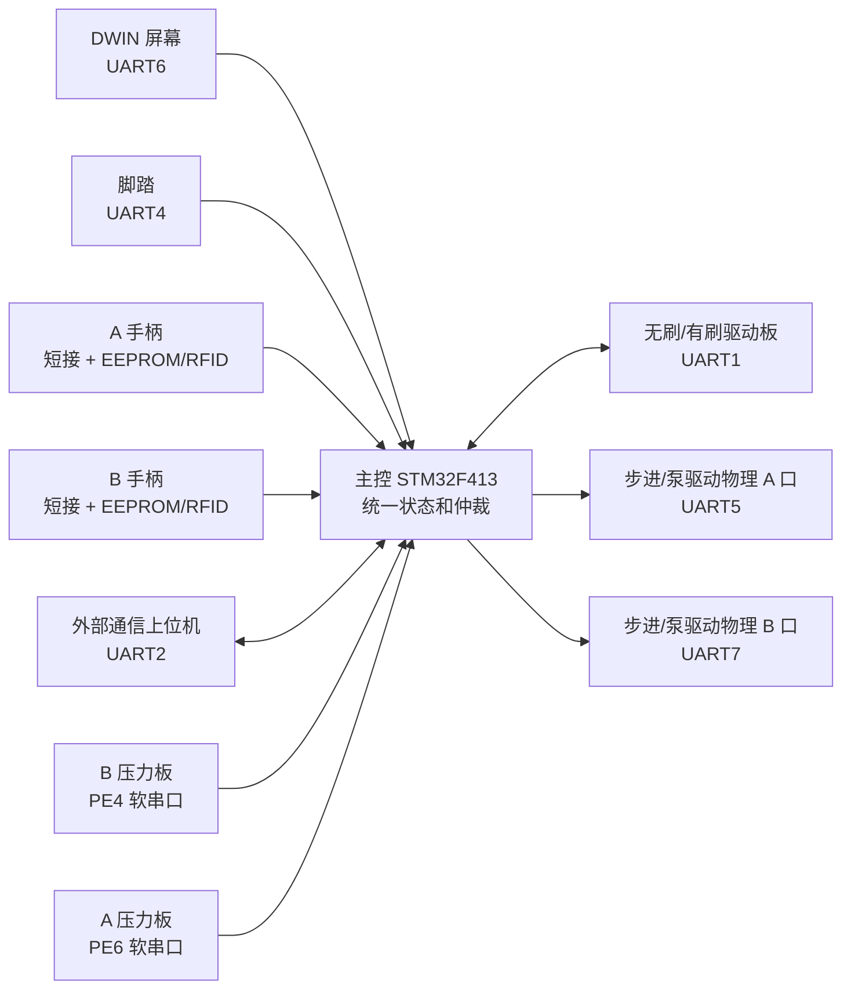

主控的核心职责不是“收到哪个按键就立刻驱动哪个硬件”，而是统一判断：谁在控制、当前通道是谁、手柄是否有效、是否报警、外控是否授权、压力是否超阈值、驱动是否有反馈，然后再输出到电机和泵。

## 3. 主控的核心设计思想

### 3.1 输入源不直接驱动输出

主控里有很多输入来源：

| 输入来源 | 入口 | 典型动作 |
| --- | --- | --- |
| 屏幕 | `ScreenKey_Scan()` | 调速、切通道、切方向、触控运行、泵启停 |
| 脚踏 | `Foot_ParseDataS()`、`FootControlTask()` | 踩踏运行、双踏板切通道、注水泵跟随 |
| 手柄按键 | `handlekey.c`、`HANDLEKeyBehavior()` | 手柄运行、调速、换方向 |
| 手柄插拔 | `HandlescanA_Fun_SSC()`、`HandlescanB_Fun_SSC()` | 识别 EEPROM/RFID，更新 A/B 通道 |
| 外控 | `ExternalComm_ApplyExternalAuth()`、`ExternalComm_ApplyControlCommand()` | 授权、设置速度、启动电机、启动泵、急停 |

这些输入源不会直接发 UART1、UART5、UART7。它们先写公共状态，再由周期任务输出：

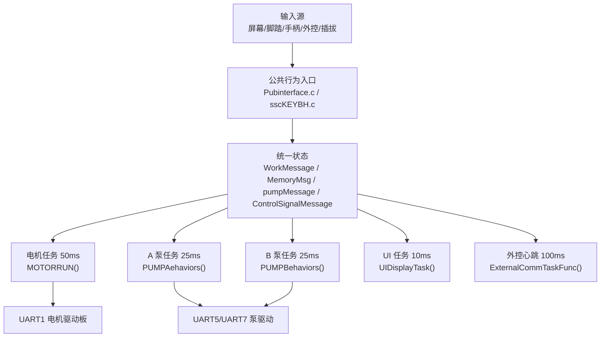

这样设计的原因：

1. 多个输入源可能同时出现，必须先仲裁。
2. 手柄、电机、泵、压力、外控之间有联动，不能让某个模块绕过全局状态。
3. 输出需要周期维持，例如电机停止时也要持续下发停止帧。
4. 异常处理必须统一，例如急停、报警、外控静默、压力停泵。
5. UI、蜂鸣、上位机心跳要看到同一份状态，否则现场会出现“屏幕显示运行但电机没转”这类错觉。

### 3.2 三层状态：识别、记忆、当前工作

理解本工程最重要的是区分三层状态：

| 层级 | 变量 | 含义 | 什么时候变化 |
| --- | --- | --- | --- |
| 识别缓存 | `ChannelrecognizeMessageA/B` | 刚从 A/B 手柄 EEPROM 或 RFID 读出来的原始能力 | 插入、RFID 刷新、识别失败清理 |
| 通道记忆 | `MemoryMsgA/B` | A/B 通道已经确认可用的参数记忆 | 插拔事件落地、RFID 刷新、用户调速调方向 |
| 当前工作 | `WorkMessage` | 当前真正被电机、UI、心跳读取的工作快照 | 自动选中、手动切通道、运行控制、报警处理 |

这三层不能混用。一个手柄插入 A 通道后，识别缓存有值，不代表当前工作通道已经切到 A。运行中插入 B 通道时，B 可以写入 `MemoryMsgB`，但不应该覆盖正在运行的 `WorkMessage`。

状态流向：

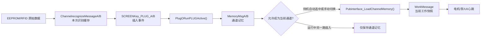

### 3.3 核心状态变量说明

`WorkMessage` 是当前工作快照。只要电机、屏幕、外控心跳要知道当前机器在干什么，基本都看它。

| 字段 | 原理说明 | 调试时看什么 |
| --- | --- | --- |
| `runflag_work` | 电机运行门控，true 时电机任务下发启动帧，false 时下发停止帧 | 不启动先看它有没有被置 true |
| `channel_work` | 当前被选中的 A/B 通道，0 表示无当前通道 | A/B 错乱先看它 |
| `Channel_Aonline/Channel_Bonline` | 插孔在线状态，不等于当前选中 | 插入后不在线先看它 |
| `hand_model` | 当前工作通道的手柄型号 | 为 0 时脚踏/外控启动会被拒绝 |
| `tool_type/raw_tool_type` | 业务刀具类型和原始标签/EEPROM 类型 | 影响有刷/无刷、开口定位、UI 显示 |
| `speed_set_work` | 当前设定速度 | 屏幕调速、外控设置、Page4 默认速度会改变它 |
| `speed_work` | 当前实际要求输出的速度 | 脚踏运行时会按踏板行程动态变化 |
| `dir_work` | 当前方向，0 正转、1 反转、2 往复 | 方向错先看它，再看电机组帧 |
| `freq_work` | 往复频率 | 只有支持往复的刀具才有效 |
| `alarm_flag/alarm_value` | 真实报警状态 | 很多输入会因报警直接返回 |
| `driver_speed_feedback` | 驱动板反馈转速 | 控制权释放和电机停稳判断会用 |
| `driver_current_x100` | 驱动板反馈电流，单位 0.01A | 心跳和监测用，不覆盖保护电流 |

`MemoryMsgA/B` 是每个通道自己的记忆。切通道时，`Pubinterface_LoadChannelMemory()` 把对应记忆装进 `WorkMessage`。

| 字段 | 原理说明 |
| --- | --- |
| `hand_model` | 本通道已经识别出的手柄型号 |
| `tool_type/raw_tool_type` | 本通道刀具类型 |
| `drive_type` | 本通道上次控制方式记忆 |
| `zz_speed/fz_speed/osc_speed` | 正转、反转、往复三个方向分别记忆速度 |
| `freq` | 本通道往复频率 |
| `dir` | 本通道当前方向 |
| `default_injection_flow` | Page4 默认注水流量，非法时业务回退 30 |
| `speed_alarm_for/speed_alarm_rev/freq_alarm_osc` | Page4 阈值蜂鸣，不强制停机 |
| `auto_identify` | RFID 自动识别模式记忆 |

`ChannelrecognizeMessageA/B` 更接近 EEPROM/RFID 原始数据，不能当作当前运行状态。

| 字段 | 原理说明 |
| --- | --- |
| `hand_type_raw_major/minor` | Page2 手柄原始类型 |
| `speed_*max/min/default` | Page4 或 RFID 解析出的速度范围 |
| `speed_*step/step_large` | Page6 小步进和大步进 |
| `default_injection_flow` | Page4 默认注水流量 |
| `tool_reduction_ratio` | 刀具增速/减速比，高 16 位增速、低 16 位减速 |

`pumpMessageA/B` 是泵业务状态和压力状态的汇合点。

| 字段 | 原理说明 | 调试时看什么 |
| --- | --- | --- |
| `online_flag` | 压力帧设备码被识别后置 true | 外控启动泵前常看它 |
| `type` | 业务泵类型：抽吸、注水、灌注 | 决定方向和速度公式 |
| `run_flag` | 泵运行门控 | 不转先看它 |
| `speed_work` | 设定速度 | 用户或外控设置值 |
| `speed_output` | 压力闭环后的实际输出速度 | 压力限速后可能小于设定 |
| `weight_x10` | 压力重量，单位 0.1g | 超阈值判断用 |
| `pressure_threshold` | 压力阈值，单位 g | 0 表示不触发压力停泵 |
| `pressure_hold_flag` | 压力触发后的保持停泵状态 | true 时输出强制 0 |
| `pressure_recover_ms` | 兼容保留字段，当前压力锁止策略不再累计恢复时间 | 正常保持为 0 |
| `seq` | 压力帧序号 | 判断压力数据是否卡死 |

`ControlSignalMessage` 记录控制来源和一些泵请求。它不是最终输出值，而是用来说明“谁正在控制、谁请求了什么”。

### 3.4 核心结构体源码片段

下面的源码片段用于固定术语。后续章节中的“当前工作”“通道记忆”“识别缓存”“泵状态”都对应这些结构体。

`WorkMessage_t` 是整机当前工作快照。电机输出、UI 显示、外控心跳、控制权释放都会读取它：

```c
typedef struct
{
  volatile bool      runflag_work;
  volatile bool      alarm_flag;
  volatile uint8_t   alarm_value;
  volatile bool      Channel_Aonline;
  volatile bool      Channel_Bonline;
  volatile uint8_t   hand_model;
  volatile uint8_t   channel_work;
  volatile uint8_t   drivetype_work;
  volatile uint8_t   hmiactive_work;
  volatile uint8_t   touchactive_work;
  volatile uint8_t   tool_type;
  volatile uint8_t   raw_tool_type;
  volatile uint32_t  speed_work;
  volatile uint32_t  speed_set_work;
  volatile uint16_t  freq_work;
  volatile uint16_t  dir_work;
  volatile uint16_t  current_work;
  volatile uint16_t  driver_speed_feedback;
  volatile uint16_t  driver_current_x100;
  volatile uint32_t  tool_reduction_ratio;
  volatile uint8_t   auto_identify;
} WorkMessage_t;
```

这段结构体要分组理解：

| 分组 | 字段 | 为什么放在 `WorkMessage` |
| --- | --- | --- |
| 运行门控 | `runflag_work`、`alarm_flag`、`alarm_value` | 电机任务、UI、外控心跳都必须知道当前是否允许运行 |
| 通道选择 | `Channel_Aonline`、`Channel_Bonline`、`channel_work` | 在线状态和当前选中状态分开，避免运行中另一路插入抢占 |
| 当前工具 | `hand_model`、`tool_type`、`raw_tool_type`、`tool_reduction_ratio` | 电机组帧、UI 图标、外控心跳都依赖当前工作工具 |
| 当前控制方式 | `drivetype_work`、`hmiactive_work`、`touchactive_work` | 用来判断脚踏、屏幕、外控是否互斥 |
| 当前速度方向 | `speed_set_work`、`speed_work`、`freq_work`、`dir_work` | `speed_set_work` 是设定值，`speed_work` 是当前要输出的运行值 |
| 驱动反馈 | `driver_speed_feedback`、`driver_current_x100` | 用来判断电机是否停稳、外控心跳是否显示真实反馈 |

调试时不要把 `speed_set_work` 和 `speed_work` 混成一个值。屏幕或外控设置速度通常先改 `speed_set_work`，脚踏运行时会按行程动态改 `speed_work`。如果屏幕显示速度正确但电机输出不对，先比较这两个字段。

`ChannelMemoryMessagr_t` 是 A/B 通道各自的长期记忆。切通道时从这里装载到 `WorkMessage`：

```c
typedef struct
{
  volatile uint8_t   hand_model;
  volatile uint8_t   hand_type_raw_major;
  volatile uint8_t   hand_type_raw_minor;
  volatile uint8_t   tool_type;
  volatile uint8_t   raw_tool_type;
  volatile uint8_t   drive_type;
  volatile uint32_t  zz_speed;
  volatile uint32_t  fz_speed;
  volatile uint32_t  osc_speed;
  volatile uint16_t  freq;
  volatile uint16_t  dir;
  volatile uint16_t  current_work;
  volatile uint16_t  default_injection_flow;
  volatile uint32_t  speed_alarm_for;
  volatile uint32_t  speed_alarm_rev;
  volatile uint8_t   freq_alarm_osc;
  volatile uint32_t  tool_reduction_ratio;
  volatile uint8_t   auto_identify;
} ChannelMemoryMessagr_t;
```

这段结构体说明 A/B 通道不是只保存一个“在线标志”。每个通道都要保存自己的速度、方向、频率、刀具、默认注水和报警提示阈值。这样设计的原因是：A 正在运行时，B 插入成功可以先保存到 `MemoryMsgB`，但不能把 B 的速度和方向直接覆盖到 `WorkMessage`。

判断通道切换问题时按下面关系查：

| 现象 | 先看 | 正常关系 |
| --- | --- | --- |
| 切到 A 后速度不对 | `MemoryMsgA.zz_speed/fz_speed/osc_speed` | `Pubinterface_LoadChannelMemory(CHANNEL_A)` 应装载 A 记忆 |
| 切到 B 后还显示 A 刀具 | `MemoryMsgB.tool_type/raw_tool_type` | B 识别落地后应写入 B 记忆 |
| 运行中插入 B 导致 A 变了 | `WorkMessage` 是否被 B 插入事件覆盖 | 运行中另一路只应更新 `MemoryMsgB` |

`ChannelrecognizeMessage_t` 是识别缓存。它保存 EEPROM/RFID 刚解析出的能力边界，不代表当前已经选中：

```c
typedef struct
{
  volatile bool      digital_enable;
  volatile bool      Pubadapter;
  volatile bool      dualDrive_Flag;
  volatile uint8_t   freq_max;
  volatile uint8_t   freq_min;
  volatile uint8_t   freq_default;
  volatile uint32_t  speed_zzmax;
  volatile uint32_t  speed_zzmin;
  volatile uint32_t  speed_fzmax;
  volatile uint32_t  speed_fzmin;
  volatile uint32_t  speed_oscmax;
  volatile uint32_t  speed_oscmin;
  volatile uint16_t  speed_zzstep;
  volatile uint16_t  speed_fzstep;
  volatile uint16_t  speed_oscstep;
  volatile uint16_t  speed_zzstep_large;
  volatile uint16_t  speed_fzstep_large;
  volatile uint16_t  speed_oscstep_large;
  volatile uint32_t  speed_zzdefault;
  volatile uint32_t  speed_fzdefault;
  volatile uint32_t  speed_oscdefault;
  volatile uint16_t  default_injection_flow;
  volatile uint16_t  speed_alarm_for;
  volatile uint16_t  speed_alarm_rev;
  volatile uint8_t   freq_alarm_osc;
  volatile uint8_t   handle_type;
  volatile uint8_t   hand_type_raw_major;
  volatile uint8_t   hand_type_raw_minor;
  volatile uint8_t   run_direction;
  volatile uint8_t   control_mode;
  volatile uint8_t   tool_type;
  volatile uint8_t   raw_tool_type;
} ChannelrecognizeMessage_t;
```

这段结构体的关键词是“能力边界”。EEPROM Page4 和 RFID 解析出来的是某把工具允许的速度范围、默认值、步进、方向和泵默认流量。它还没有变成当前运行状态。只有插拔事件落地、保存到 `MemoryMsgA/B`、再装载到 `WorkMessage` 后，电机和 UI 才会真正使用。

常见误判：

| 看到的现象 | 正确解释 |
| --- | --- |
| `ChannelrecognizeMessageA.speed_zzdefault` 已有值，但屏幕还是旧速度 | 识别缓存还没落地到通道记忆或当前工作 |
| RFID 已解析出刀具类型，但电机仍按旧刀具跑 | 当前通道没有重新装载，或者运行中禁止覆盖 `WorkMessage` |
| Page6 步进值读到了，但调速幅度没变 | 调速函数仍在使用当前通道记忆，未装载新识别值 |

`pumpMessage_t` 是泵和压力的汇合结构。泵任务、压力软串口、压力闭环、UI 和外控心跳都会接触它：

```c
typedef struct
{
  volatile bool     online_flag;
  volatile bool     run_flag;
  volatile uint16_t timingDrainage_times;
  volatile bool     timingDrainage_flag;
  volatile uint8_t  associated_channel;
  volatile uint16_t type;
  volatile uint8_t  direction;
  volatile uint16_t speed_work;
  volatile uint16_t speed_output;
  volatile uint16_t speed_Max;
  volatile uint16_t speed_Min;
  volatile uint8_t  losses_times;
  volatile int32_t  pressure_value;
  volatile uint16_t pressure_threshold;
  volatile uint32_t weight_x10;
  volatile bool     pressure_hold_flag;
  volatile uint32_t pressure_recover_ms;
  volatile uint8_t  seq;
} pumpMessage_t;
```

这段结构体要按两条链路读：

1. 泵控制链路写 `run_flag`、`type`、`direction`、`speed_work`，表示用户、脚踏、手柄或外控希望泵怎么动。
2. 压力安全链路写 `pressure_value`、`weight_x10`、`pressure_threshold`、`pressure_hold_flag`、`speed_output`，并将兼容字段 `pressure_recover_ms` 保持为 0，表示压力板和闭环保护允许泵实际输出多少。

所以泵不转时不能只看 `run_flag`。`run_flag=true` 只能说明“有运行请求”，如果 `pressure_hold_flag=true` 或 `speed_output=0`，最终 UART 仍会发 0。压力自然下降不会自动解除锁止，必须先释放当前请求，再由新的启动沿清除锁止。

### 3.5 状态不变量

调试时优先检查这些不变量。只要其中一个被破坏，后面的电机、泵、UI 或外控表现都会变得混乱。

| 不变量 | 正常要求 | 破坏后的典型现象 | 首选断点 |
| --- | --- | --- | --- |
| 在线不等于选中 | `Channel_Aonline/Bonline` 只说明插孔在线，`channel_work` 才说明当前工作通道 | 插入 B 后 A 正在运行却被 B 参数覆盖 | `PlugORunPLUGActive()` |
| 识别缓存不直接驱动输出 | `ChannelrecognizeMessageA/B` 必须经过插拔事件和通道记忆落地 | EEPROM 读到正确但屏幕或电机仍没有变化 | `Pubinterface_SaveRecognizeToMemory()` |
| 当前工作只能来自当前通道 | `WorkMessage` 装载必须匹配 `channel_work` | A/B 速度、方向、手柄图标错乱 | `Pubinterface_LoadChannelMemory()` |
| 真实报警统一写 `WorkMessage` | 影响停机的报警必须走 `WorkAlarm_Set()` | 蜂鸣响但电机不被禁止，或 UI 无报警 | `WorkAlarm_Set()` |
| Page4 阈值只蜂鸣 | `WORK_ALARM_SPEED_THRESHOLD` 不应当阻塞调速 | 调速到阈值附近机器被误停 | `SpeedThreshold_CheckAndBeep()` 相关调用 |
| 压力停泵按新启动沿解锁 | `pressure_hold_flag=true` 时输出 0；压力下降不自动复转，新启动沿才清锁止 | 连续踩住或持续触控时意外自动复转 | `PumpBehavior_ClearPressureHoldOnNewRequest()` |
| 外控释放不是电机停稳自动释放 | 外控授权后由上位机退出或 10 秒静默释放 | 电机停了但本地屏幕/脚踏仍无法接管 | `ExternalComm_HandleLinkTimeout()` |

### 3.6 状态快照记录模板

复杂问题不要只截一处变量。建议每次停在断点时按下面顺序记录一组快照：

```text
时间点：
触发动作：插入A / 切B / 脚踏启动 / 外控启动 / 压力超阈值 / 急停

WorkMessage:
  runflag_work =
  alarm_flag/alarm_value =
  channel_work =
  Channel_Aonline/Channel_Bonline =
  hand_model =
  tool_type/raw_tool_type =
  speed_set_work/speed_work =
  dir_work/freq_work =
  drivetype_work/hmiactive_work/touchactive_work =
  driver_speed_feedback/driver_current_x100 =

MemoryMsgA:
  hand_model =
  tool_type/raw_tool_type =
  zz_speed/fz_speed/osc_speed =
  dir/freq =
  default_injection_flow =

MemoryMsgB:
  hand_model =
  tool_type/raw_tool_type =
  zz_speed/fz_speed/osc_speed =
  dir/freq =
  default_injection_flow =

pumpMessageA/B:
  online_flag =
  type =
  run_flag =
  speed_work/speed_output =
  pressure_threshold =
  weight_x10 =
  pressure_hold_flag/pressure_recover_ms =
  seq =
```

## 4. 启动与软任务原理

### 4.1 启动顺序

主控启动链路：

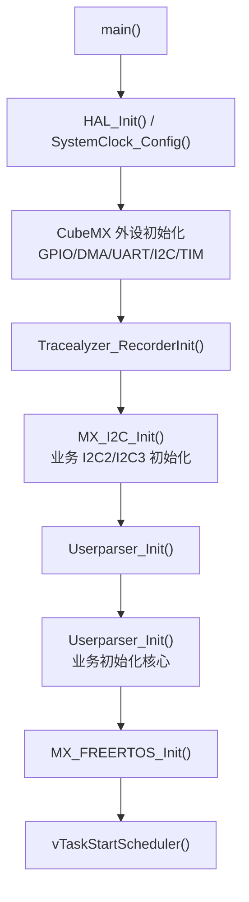

`Userparser_Init()` 做业务初始化，顺序大致为：

1. 喂狗和板级 GPIO。
2. EEPROM 初始化。
3. UART1 电机、UART2 外控、UART3 RFID、UART4 脚踏、UART5 泵、UART6 屏、UART7 泵。
4. 强制显示启动页。
5. 电机急停输出一次，避免上电残留。
6. 初始化 `WorkMessage`、`MemoryMsgA/B`、`pumpMessageA/B` 等公共状态。
7. 初始化 RFID。
8. 创建看门狗、LED、蜂鸣、按键行为、手柄扫描、脚踏、屏幕键、电机、手柄按键、电机反馈、外控、RFID、A/B 泵、UI、软串口压力任务。

### 4.2 软任务不是完全并行

工程里使用 FreeRTOS，但业务模块不是每个都直接管理原生任务。应用层通过 `Kernel_TaskStart()` 注册周期任务，再由 `Src\app_task.c` 的 worker 周期调用。

关键点：所有旧业务回调在进入前都会经过 `AppTaskRuntimeGate()`，该函数使用同一个静态互斥锁 `sAppTaskRuntimeMutex`。这意味着多个任务虽然周期不同，但业务回调本身被串行保护。

这样做的好处：

1. 降低旧全局变量并发写坏的概率。
2. 让 `WorkMessage`、`pumpMessageA/B` 这类共享结构不需要每一处都加锁。
3. 方便把旧裸机风格逻辑迁移到 RTOS。

代价：

1. 某个任务回调耗时过长，会拖慢后续任务。
2. 高频任务不一定能严格按周期完成业务逻辑。
3. 调试“并发问题”时，不能只看任务周期，还要看哪个回调占着互斥锁。

关键任务周期：

| 任务 | 周期 | 作用 |
| --- | --- | --- |
| 电机反馈 `MOTORUARTTaskFunc()` | 3ms | 解析 UART1 驱动回包 |
| 脚踏定标接收 `PedalRecv_Scan()` | 3ms | 定标页 UART4 回包 |
| 手柄扫描 `HANDLESCANTaskFunc()` | 10ms | A/B 插拔、EEPROM、RFID |
| 外控 `ExternalCommTaskFunc()` | 10ms | UART2 接收、链路计时 |
| UI 显示 `UIDisplayTask()` | 10ms | 消费 UI 队列 |
| 脚踏解析 `Foot_ParseDataS()` | 10ms | UART4 脚踏实时帧 |
| 脚踏控制 `FootControlTask()` | 25ms | 踏板行程控制电机和泵 |
| A 泵 `PUMPAehaviors()` | 25ms | A 泵输出、压力锁止和排空计时 |
| 屏幕键 `ScreenKeyTask()` | 30ms | DWIN 触摸帧和触控保活 |
| 手柄按键 `HANDLEKEYTaskFunc()` | 30ms | 手柄按键扫描 |
| 按键行为 `KeyBehaviorsTask()` | 30ms | 消费统一按键队列 |
| 电机输出 `MOTORRUNTask()` | 50ms | 按 `WorkMessage` 下发 UART1 |
| B 泵 `PUMPBehaviors()` | 25ms | B 泵输出、压力锁止和排空计时 |
| RFID 自动模式 | 100ms | UART3 RFID 请求和回包 |
| 压力软串口维护 `SimUartTaskFunc()` | 100ms | 软串口帧解析队列 |
| 蜂鸣 | 100ms | 按键音和报警音 |
| LED | 200ms | 状态灯 |
| IWDG 任务 | 300ms | 看门狗刷新任务，注意主初始化里 IWDG 是否实际开启要看当前配置 |

调试任务问题时：

| 断点 | 看什么 |
| --- | --- |
| `Kernel_TaskStart()` | 任务是否启动，周期是否正确 |
| `AppTaskWorker()` | worker 是否进入循环 |
| `AppTaskRuntimeGate()` | 是否被某个任务长时间占用 |
| `task->func(0U)` | 当前实际执行哪个业务回调 |

### 4.3 启动源码依据

`main()` 中 CubeMX 外设先完成，随后才进入板级后初始化、应用初始化和 FreeRTOS 调度：

```c
MX_GPIO_Init();
MX_DMA_Init();
MX_USART1_UART_Init();
MX_USART2_UART_Init();
MX_USART3_UART_Init();
MX_UART4_Init();
MX_UART5_Init();
MX_USART6_UART_Init();
MX_UART7_Init();
MX_UART8_Init();
MX_UART10_Init();
MX_TIM7_Init();
MX_TIM10_Init();
MX_TIM14_Init();

Tracealyzer_RecorderInit();
MX_I2C_Init();
Userparser_Init();
MX_FREERTOS_Init();
vTaskStartScheduler();
```

这段代码说明几个关键事实：

1. UART1/2/3/4/5/6/7/8/10 都在进入业务前完成 HAL 初始化。
2. 当前 `MX_IWDG_Init()` 被注释，是否真正启用看门狗不能只看 `IwdgTaskInit()`，还要看 IWDG 外设是否初始化。
3. `MX_I2C_Init()` 和 `Userparser_Init()` 是业务初始化的直接入口。若某个 GPIO/I2C 资源异常，应先确认二者的执行顺序。
4. `vTaskStartScheduler()` 后不应再回到 while 循环；若回到 while，说明 FreeRTOS 调度器启动失败或堆/任务创建异常。

`Userparser_Init()` 是业务初始化的主线。它不是普通工具函数，而是整机业务进入运行态的“总开关”：

```c
void Userparser_Init(void)
{
  Iwdg_Reset();
  Board_GPIOConfiguration();
  EEPROM_AT24CXX_Init();

  Uart1_Init();
  Uart2_Init();
  Uart3_Init();
  Uart4_Init();
  Uart5_Init();
  Uart6_Init();
  LCD_ForceShow_Which_Map(UIDP_LCD_PAGE_STARTUP);
  Uart7_Init();

  LCD_Disappear_Picture(UIDP_LCD_VP_ALARM_TIP);
  Motor_ErrorEmergencyStop_Ctrl();
  UI_Start_Fun();
  Userparser_PubinterfaceInit();
  SscRadioFreq_Init();

  IwdgTaskInit();
  LEDTaskInit();
  SscBeepControlTask_Init();
  SscKeyBehaviorTask_Init();
  HandlescanTaskInit();
  SscFootControlTask_Init();
  ScreenKey_ScanInit();
  SscDriveMotorTask_Init();
  HandleKeyScan_Init();
  MotorUartData_Init();
  ExternalComm_Init();
  SscSplitTypeAutoModeGetData_Init();
  SscPumpATask_Init();
  SscPumpBTask_Init();
  SscUIDisplayTask_Init();
  SimUartTask_Init();

  SendUIDSMessage(UI_POWERINIT_ID, false, NULL);
}
```

这段初始化代码要按四段读：

| 代码段 | 做什么 | 为什么必须在这个位置 |
| --- | --- | --- |
| `Iwdg_Reset()` 到 `EEPROM_AT24CXX_Init()` | 先准备板级 GPIO 和 EEPROM 基础资源 | 手柄识别、参数读取和后续 I2C 调试都依赖这些资源 |
| `Uart1_Init()` 到 `Uart7_Init()` | 逐个初始化业务串口，并先显示启动页 | 电机、外控、RFID、脚踏、屏幕、泵都要先有通信通道 |
| `Motor_ErrorEmergencyStop_Ctrl()` | 上电先对电机驱动做一次安全停止 | 防止驱动板保留上次输出状态或上电瞬间误动作 |
| `Userparser_PubinterfaceInit()` | 清公共状态和通道记忆 | 避免 `WorkMessage`、`MemoryMsg`、`pumpMessage` 带随机值进入任务 |
| 各 `Task_Init()` | 注册周期任务 | 所有输入输出都靠软任务周期执行 |
| `SendUIDSMessage(UI_POWERINIT_ID, ...)` | 投递开机 UI 首刷 | UI 不直接在初始化里大面积刷屏，而是交给 UI 任务消费 |

如果程序卡在这个函数里，定位顺序不是从最后一个任务开始猜，而是看“上一句已经成功、下一句是否进入”。例如屏幕没有启动页，应先确认 `Uart6_Init()` 和 `LCD_ForceShow_Which_Map()`，再看 UI 任务；如果电机上电异常，应先确认 `Motor_ErrorEmergencyStop_Ctrl()` 是否真实发帧，而不是只看后面的 `MOTORRUNTask()`。

调试上电流程时按这个顺序判断：

| 阶段 | 断点 | 正常现象 | 异常说明 |
| --- | --- | --- | --- |
| HAL 外设初始化 | `MX_USARTx_UART_Init()` | 各 UART handle 初始化完成 | 串口 handle 错误、DMA 未就绪、时钟未开 |
| I2C 后初始化 | `MX_I2C_Init()` | I2C2/I2C3 业务总线可用 | EEPROM 和手柄总线可能未准备 |
| 应用启动 | `Userparser_Init()` | 各业务模块完成初始化和任务注册 | 应用层入口未接上 |
| 屏幕启动页 | `LCD_ForceShow_Which_Map()` | UART6 发 page0 切换帧 | 屏幕黑屏或停旧页 |
| 电机急停 | `Motor_ErrorEmergencyStop_Ctrl()` | 上电先发停止/急停帧 | 驱动板可能保持上次状态 |
| 公共状态初始化 | `Userparser_PubinterfaceInit()` | `WorkMessage/MemoryMsg/pumpMessage` 清零 | 后续读取到随机状态 |
| 任务注册 | 各模块 `Task_Init()` 函数 | `Kernel_TaskStart()` 返回成功 | 对应模块周期任务不运行 |
| UI 首刷 | `SendUIDSMessage(UI_POWERINIT_ID)` | UIDP 队列收到开机刷新 | 屏幕主运行页显示不完整 |

### 4.4 软任务串行门控源码依据

当前应用层任务虽然分成多个 FreeRTOS worker，但真正执行业务回调前会进入同一个门控：

```c
static void AppTaskRuntimeGate(task_t *task)
{
    if ((task == NULL) || (task->func == NULL))
    {
        return;
    }

    if ((sAppTaskRuntimeMutex == NULL) ||
        (xSemaphoreTake(sAppTaskRuntimeMutex, portMAX_DELAY) != pdTRUE))
    {
        return;
    }

    AppTaskTrace_RecordBoundary(task, true);
    task->func(0U);
    AppTaskTrace_RecordBoundary(task, false);

    if (task->oneShot)
    {
        taskENTER_CRITICAL();
        task->start = false;
        task->timerTick = 0U;
        taskEXIT_CRITICAL();
        AppTaskTrace_RecordOneShotStop(task);
    }

    (void)xSemaphoreGive(sAppTaskRuntimeMutex);
}
```

逐段解释：

| 代码段 | 作用 | 调试含义 |
| --- | --- | --- |
| `task == NULL` 或 `task->func == NULL` | 防御无效任务指针 | 某任务没有回调时会直接返回，不会进入业务 |
| `xSemaphoreTake(..., portMAX_DELAY)` | 所有旧业务回调共用一把互斥锁 | 一个任务卡住会拖慢其它任务，不是 FreeRTOS 没调度 |
| `AppTaskTrace_RecordBoundary(task, true/false)` | 记录任务进入和退出边界 | Tracealyzer 可看到哪个业务回调耗时最长 |
| `task->func(0U)` | 真正执行业务函数 | 断在这里前后可以测单次耗时 |
| `task->oneShot` 分支 | 一次性任务执行后自动停止 | 如果 oneShot 反复执行，说明外部又把 `start` 置 true |
| `xSemaphoreGive()` | 释放串行门控 | 如果没有走到这里，后续所有业务任务都会等待 |

这段代码说明“多任务”在本工程里不是所有业务逻辑并行写全局变量。真正的业务回调被串行化了。遇到周期异常时，要分清两种情况：一种是 FreeRTOS 任务没有运行；另一种是任务在运行，但排队等互斥锁。后者在调试器里看起来像“某模块偶尔慢”，根因可能是前一个 I2C、UART 或 UI 刷新占锁太久。

这个门控直接影响调试判断：

1. 如果 `ScreenKeyTask()` 很慢，`MOTORRUN()`、`PUMPAehaviors()`、`ExternalCommTaskFunc()` 也可能被排队等待。
2. 如果某个任务卡在 I2C、UART 发送、延时或循环里，其他业务回调不是并发继续跑，而是等待同一把互斥锁。
3. 若 Tracealyzer 开启，可用 `BEGIN/END` 事件确认哪个软任务占用时间最长。
4. 如果不用 Tracealyzer，可在 `AppTaskRuntimeGate()` 里观察 `task->name`、`task->func`、进入时间和退出时间。

定位周期卡顿时建议按下面的顺序记录：

```text
断点 1：AppTaskWorker()
  task->name =
  task->periodMs =
  task->start =

断点 2：AppTaskRuntimeGate() 进入前
  task->name =
  当前 tick =
  是否成功 xSemaphoreTake =

断点 3：task->func(0U) 前后
  回调名称 =
  进入 tick =
  退出 tick =
  单次耗时 =

判断：
  单个回调耗时 > 自身周期：该模块会持续拖慢全局业务。
  高频任务等待时间明显增加：检查前一个长期占锁的任务。
  某个 oneShot 任务反复 start：检查任务启动条件是否被周期性重新置位。
```

## 5. 手柄识别、A/B 通道与 EEPROM 原理

### 5.1 为什么手柄识别不能只看插入 IO

手柄短接 IO 只能说明“可能插入了手柄”。真正上线还要证明：

1. 物理插入稳定，不是抖动。
2. I2C 总线能读到 AT24CS32。
3. Page1 认证值和 SN + Page2~Page8 计算结果一致。
4. Page2 能映射出手柄型号。
5. Page3 或 RFID 能映射出刀具类型和规格。
6. Page4 能给出速度、频率、默认注水流量、报警阈值。
7. Page6 能给出小步进和大步进。
8. 插拔事件被公共接口接收后，才更新通道记忆和当前工作通道。

### 5.2 手柄扫描状态机

A 通道入口是 `HandlescanA_Fun_SSC()`，B 通道入口是 `HandlescanB_Fun_SSC()`。A 使用 I2C2，B 使用 I2C3。

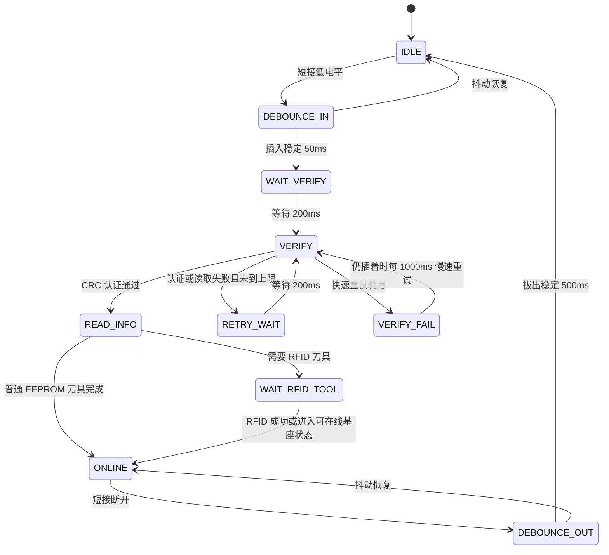

时间参数以当前源码为准：

| 参数 | 当前值 | 意义 |
| --- | --- | --- |
| 扫描周期 | 10ms | 手柄扫描任务周期 |
| 插入去抖 | 50ms | 防止插入瞬间抖动 |
| 拔出去抖 | 500ms | 防止接触瞬断误判拔出 |
| 认证前等待 | 200ms | 等插头、电源、I2C 稳定 |
| 快速重试间隔 | 200ms | EEPROM 偶发失败快速恢复 |
| 失败后慢重试 | 1000ms | 坏手柄保持插入时周期自恢复 |
| RFID 等待 | 约 900ms 起，在线监控约 2s | 运行中会暂停部分 RFID 识别 |

### 5.3 AT24CS32 认证原理

认证函数：

| 通道 | 函数 |
| --- | --- |
| A | `AT24CS32_VerifyCrc_I2C2()` |
| B | `AT24CS32_VerifyCrc_I2C3()` |

认证不是普通 CRC 一次算完，而是固定布局：

1. 读取 Page1 原始 32 字节。
2. 校验 Page1 页尾 2 字节页和。
3. Page1 前 8 字节是存储的认证结果。
4. 读取 AT24CS32 序列号 SN 16 字节。
5. 读取 Page2 到 Page8，共 7 页、224 字节；每页都要先校验页和。
6. 拼接 `SN(16B) + Page2~Page8(224B)`，总共 240 字节。
7. 对同一输入计算 4 组 CRC16。
8. 4 个 CRC16 按大端拼成 8 字节，与 Page1 前 8 字节比较。

伪代码：

```text
page1 = read_page_raw(0)
if page1 read failed: return PAGE1_READ_FAILED
if page_checksum(page1) failed: return PAGE1_CHECKSUM_FAILED

stored_auth = page1[0..7]
sn = read_serial_number()
if sn read failed: return SN_READ_FAILED

auth_data = Page2 + Page3 + ... + Page8
if any page read/checksum failed: return DATA_READ_FAILED

input = sn + auth_data
calc = crc16(input, 0xFFFF, 0x1021)
     + crc16(input, 0xFFFF, 0x8005)
     + crc16(input, 0xFFFF, 0x3D65)
     + crc16(input, 0xFFFF, 0xA097)

if calc == stored_auth: return OK
else: return CRC_MISMATCH
```

页校验规则：

| 项 | 规则 |
| --- | --- |
| 页大小 | 32 字节 |
| 有效数据 | 前 30 字节 |
| 页尾校验 | 第 30、31 字节保存前 30 字节求和 |
| 读取整页 | `AT24CS32_ReadPage_I2C2/I2C3()` 会校验页和 |
| 写整页 | `AT24CS32_WritePage_I2C2/I2C3()` 会自动重算页和 |

I2C 失败时，底层 `at24cs32.c` 会记录 `AT24CS32_DebugInfo`，字段包括操作类型、设备地址、内部地址、长度、HAL 状态、HAL 错误、访问前后 I2C 状态。查 EEPROM 问题时，不要只看认证返回码，还要读最近一次 I2C 调试信息。

### 5.4 EEPROM 页面业务含义

| 页面 | 地址或索引 | 作用 |
| --- | --- | --- |
| Page1 | 0 | 存认证结果和页和 |
| Page2 | 0x0020 | 手柄型号，决定基座类型 |
| Page3 | 0x0040 | 刀具类型、直径、长度、角度、减速比 |
| Page4 | page index 3 | 默认注水流量、默认速度、上下限、方向、频率、阈值 |
| Page6 | page index 5 | 小步进和大步进 |
| Page8 等 | 认证输入的一部分，外控读写时也有页面映射 |

Page4 很关键，因为它决定“上线后默认怎么跑”：

| 字段 | 影响 |
| --- | --- |
| 默认注水流量 | 当前通道成为工作通道时，给注水泵默认速度 |
| 默认速度 | `speed_set_work` 的初值 |
| 最小/最大速度 | 屏幕、手柄、外控调速边界 |
| 默认方向 | 当前代码默认按正转处理，历史原始方向值不要直接假设生效 |
| 频率 | 往复模式初值 |
| 速度/频率报警阈值 | 只驱动蜂鸣提示，不写真实报警，不强制停机 |

### 5.4.1 EEPROM 不是全机参数表

手柄 EEPROM 保存的是“这一个手柄、这一把刀具、这一套基座”的身份和默认运行资料，不是主控全局参数表。这个区别很重要：

1. `ChannelrecognizeMessageA/B` 是识别缓存。它来自当前插入手柄的 EEPROM 或 RFID，拔插、重试、RFID 更新都会改它。
2. `MemoryMsgA/B` 是通道记忆。它保存 A/B 通道最近一次识别成功后的业务值，用来在切换通道时重新装载。
3. `WorkMessage` 是当前工作状态。电机、脚踏、屏幕和外控最终都看它，运行中不会因为另一路手柄重新识别就被随意覆盖。
4. 外控“设置速度、设置泵速、切方向”默认只改运行态，不会自动写回手柄 EEPROM。
5. 外控 EEPROM 写页命令会改当前选中通道的手柄 EEPROM，但写完后还需要重新识别、重新装载或重新插拔，运行态才会按新页内容刷新。

因此，“参数不生效”要先问清楚写到了哪一层。写 `WorkMessage` 是立即运行态；写 `MemoryMsgA/B` 是下次装载；写 `ChannelrecognizeMessageA/B` 是识别中间态；写 EEPROM 是持久化原始数据。

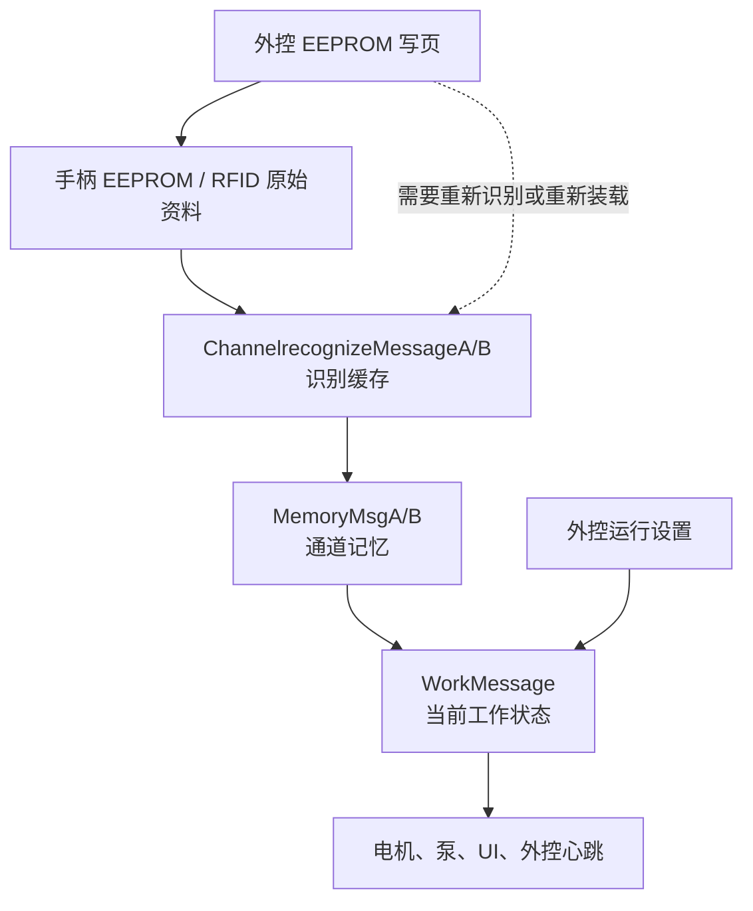

### 5.4.2 EEPROM 页结构源码依据

`AT24CS32` 当前按 128 页管理，每页 32 字节。业务有效数据是前 30 字节，最后 2 字节是页和。代码中的关键定义如下：

```c
#define AT24CS32_PAGE_SIZE        32U
#define AT24CS32_PAGE_DATA_SIZE   30U
#define AT24CS32_PAGE_COUNT       128U
#define AT24CS32_TOTAL_SIZE       4096U
#define AT24CS32_SN_SIZE          16U
```

页和不是 CRC，只是对前 30 字节求和，然后把高低字节放在页尾：

```c
static uint16_t AT24CS32_PageChecksum(const uint8_t page[AT24CS32_PAGE_SIZE])
{
    uint16_t sum = 0U;
    for (uint16_t i = 0U; i < AT24CS32_PAGE_DATA_SIZE; ++i)
    {
        sum = (uint16_t)(sum + page[i]);
    }
    return sum;
}
```

写整页时底层会重新生成页尾校验，所以外控写入时只需要给 30 字节业务数据，不能把历史页尾校验也当成业务字段写进去。

| 页面 | 业务含义 | 数据来源 | 调试时重点看什么 |
| --- | --- | --- | --- |
| Page1 | 认证结果，前 8 字节保存 4 组 CRC16 结果 | 出厂或授权工具写入 | Page1 页和、Page1[0..7]、认证返回码 |
| Page2 | 手柄/基座适配信息 | 手柄 EEPROM | 手柄型号、厂家、区域、机器兼容、是否重复使用、是否需要标定 |
| Page3 | 刀具基础信息 | 普通一体刀具 EEPROM，分体刀具可由 RFID 覆盖 | 刀具型号、直径、长度、角度、减速比、夹持范围 |
| Page4 | 上线默认运行值 | 手柄 EEPROM | 默认流量、默认速度、最小/最大速度、方向、频率、报警阈值 |
| Page6 | 多档步进 | 手柄 EEPROM | 小步进、大步进，影响屏幕和手柄调速手感 |
| Page8 | 运行统计 | 手柄 EEPROM 或后续工具维护 | 使用时长、使用次数、常用速度/频率/流量、报警统计 |
| Page11 | 出厂资料 | 手柄 EEPROM | 作为追溯资料，不直接驱动当前运行 |
| Page12~128 | 导航数据 | 手柄 EEPROM | 外控导航页读写，不参与当前普通启停链路 |

Page2、Page3、Page4、Page6 是调试手柄默认行为最常用的页面。下面按业务含义展开：

| 页面字段 | 编码方式 | 当前影响 |
| --- | --- | --- |
| Page2 手柄/工具代码 | 2 字节 | 映射 TMBB、TMBA、EMBA、EMBB、PXBA、PXBB 等基座或手柄类型 |
| Page2 厂家/区域 | 2 字节 + 2 字节 | 用于适配和追溯，当前不应拿来直接判断运行启停 |
| Page2 机器兼容 | 1 字节 | 用于判断是否适配当前主机，异常时应阻止进入有效识别 |
| Page3 刀具型号 | 2 字节 | 映射 MXYTM、MXYTP、PXYTM、PXYTP、JMB、MXYTM16 等 |
| Page3 直径/长度/角度 | 2 字节字段 | 通常按 0.1 单位解释，影响显示和工具属性 |
| Page4 默认流量 | 2 字节大端，范围 1~70 | 注水泵默认流量；0 或越界时按程序默认值处理 |
| Page4 默认速度 | 2 字节小端，乘以 10 | 上线后 `speed_set_work` 的来源之一 |
| Page4 最小/最大速度 | 2 字节小端，乘以 10 | 屏幕、手柄、外控调速边界 |
| Page4 默认方向 | 1 字节 | 当前主控解析后默认按正转处理，不能只改 EEPROM 期待方向立即变化 |
| Page4 频率 | 1 字节 | 往复模式默认频率 |
| Page4 速度/频率报警阈值 | 2 字节或 1 字节 | 当前主要驱动提示，不等同于硬停报警 |
| Page6 小步进/大步进 | 2 字节 + 2 字节 | 影响单次调速幅度 |

### 5.4.3 Page1 认证为什么要读 Page2~Page8

Page1 不是简单保存一个“手柄是否有效”的固定值。认证输入由 SN 和 Page2~Page8 共同组成：

```text
认证输入 = AT24CS32 SN 16 字节 + Page2~Page8 7 页原始数据 224 字节
认证结果 = 4 组 CRC16 结果拼成 8 字节
对比对象 = Page1[0..7]
```

这说明：

1. 只改 Page4 默认速度，也会改变认证输入。
2. 如果写 EEPROM 的工具没有同步更新 Page1 认证结果，下次插入会认证失败。
3. 如果只把一把手柄的 Page2~Page8 复制到另一把手柄，SN 不同也会导致认证失败。
4. 如果 Page2~Page8 任一页页和错误，认证流程会在读取阶段失败，不会进入业务解析。

认证返回码建议这样理解：

| 返回码 | 说明 | 优先排查 |
| --- | --- | --- |
| `OK` | Page1 页和、SN、Page2~Page8、4 组 CRC 都通过 | 继续查 Page2/Page3/Page4 解析 |
| `BAD_PARAM` | 传入指针或参数错误 | 调用入口是否传错总线或缓存 |
| `PAGE1_READ_FAILED` | Page1 原始读取失败 | I2C 总线、设备地址、短接供电 |
| `PAGE1_CHECKSUM_FAILED` | Page1 页尾校验错 | EEPROM 内容损坏或写页工具错误 |
| `SN_READ_FAILED` | SN 读取失败 | SN 地址 `0x0800`、器件型号、I2C 时序 |
| `DATA_READ_FAILED` | Page2~Page8 任一页读取或页和失败 | 最近写过的业务页、页尾校验 |
| `CRC_MISMATCH` | 页都能读，但 Page1[0..7] 与计算结果不一致 | 认证工具、SN、被改过的 Page2~Page8 |

### 5.4.4 外控 EEPROM 单页读写

外控可以读写当前选中通道的手柄 EEPROM，但它不是直接指定 I2C2 或 I2C3。当前总线由 `WorkMessage.channel_work` 决定：

| 当前工作通道 | EEPROM 总线 |
| --- | --- |
| A | I2C2 |
| B | I2C3 |
| 无当前通道 | 读写失败 |

外控业务区到 EEPROM 页的映射如下：

| 外控区域码 | 实际页 | 含义 |
| --- | --- | --- |
| `0x01` | Page2 | 识别/适配信息 |
| `0x02` | Page3 | 刀具信息 |
| `0x03` | Page4 | 初始运行值 |
| `0x04` | Page5 | 按键自定义预留 |
| `0x05` | Page6 | 多档步进 |
| `0x06` | Page8 | 运行信息 |
| `0x07` | Page9 | 客户编辑预留 |
| `0x08` | Page11 | 出厂信息 |
| 导航页 12~128 | Page12~Page128 | 导航数据 |

外控写业务页要求 `info_len == 30`。主控收到 30 字节后复制到 32 字节页缓存，再由 `AT24CS32_WritePage_*()` 自动生成最后 2 字节页和。读业务页时主控也只回前 30 字节，不把页和暴露给上位机。

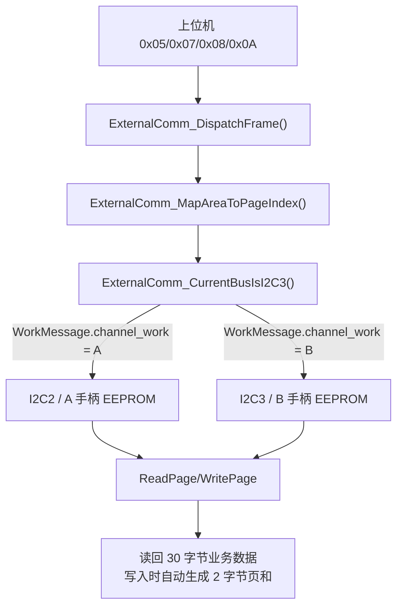

调试外控写 EEPROM 时，建议按下面顺序打断点：

| 断点 | 正常值 | 异常说明 |
| --- | --- | --- |
| `ExternalComm_DispatchFrame()` | 命令码进入读页或写页分支 | 帧头、长度、CRC 或区域码不对 |
| `ExternalComm_MapAreaToPageIndex()` | 区域码映射到预期页 | 写错 AreaCode，会写到其它业务页 |
| `ExternalComm_CurrentBusIsI2C3()` | 当前通道 A/B 明确 | 未选中手柄时不能写 EEPROM |
| `ExternalComm_WriteBusinessPage()` | `info_len == 30` | 长度不是 30 会拒绝写入 |
| `AT24CS32_WritePage_I2C2/I2C3()` | 返回成功 | I2C 总线、器件、页地址或写保护异常 |
| `AT24CS32_GetLastDebugInfo()` | `hal_status == 0` | BUSY/TIMEOUT/ERROR 时优先查线束和上拉 |

### 5.4.5 运行参数、持久化参数和 Flash

当前主控运行态参数主要在公共状态中流动，手柄相关持久化主要在 AT24CS32 EEPROM。工程里虽然有 `flash.c` 驱动，但当前主控核心业务没有把它作为主要参数保存入口使用。不要把 Flash 驱动存在等同于“所有设置都会掉电保存”。

| 修改动作 | 修改对象 | 是否掉电保存 | 什么时候生效 |
| --- | --- | --- | --- |
| 屏幕调速 | `WorkMessage` 或当前通道记忆 | 否 | 当前通道立即或下次任务周期 |
| 手柄按键调速 | `WorkMessage` 或当前通道记忆 | 否 | 当前通道立即或下次任务周期 |
| 外控设置运行参数 | `WorkMessage`、`MemoryMsgA/B`、`pumpMessageA/B` | 否 | 外控命令通过后立即进入运行态 |
| 外控写 Page4 | 当前通道 EEPROM Page4 | 是 | 重新识别或重新装载后生效 |
| 外控写 Page6 | 当前通道 EEPROM Page6 | 是 | 重新识别或重新装载后影响步进 |
| 修改源码宏 | `.h` 或 `.c` 编译常量 | 固件重新烧录后生效 | 重新编译、烧录、上电 |

最容易误判的场景是：外控先设置当前速度，再读 Page4，发现 Page4 没变。这是正常现象，因为设置当前速度不是写 EEPROM。反过来，外控写 Page4 后如果不重新识别，`WorkMessage.speed_set_work` 也可能还保留旧运行态。

### 5.5 A/B 通道规则

当前规则：

| 场景 | 行为 |
| --- | --- |
| 待机插入 A 或 B，识别通过 | 可自动选中该通道，并装载到 `WorkMessage` |
| 待机当前通道拔出，另一通道在线 | 可回落到另一在线通道 |
| 运行中插入另一路 | 只更新那一路 `MemoryMsg`，不抢当前 `WorkMessage` |
| 运行中拔出非当前通道 | 不影响当前运行 |
| 运行中拔出当前通道 | 必须停止或进入保护，不自动切到另一通道 |
| A 认证失败 | 报警 10 |
| B 认证失败 | 报警 12 |
| A/B 都失败 | 报警 14 |

调试重点：

| 断点 | 看什么 |
| --- | --- |
| `HandlescanA_Fun_SSC()` / `HandlescanB_Fun_SSC()` | 状态机走到哪一步 |
| `AT24CS32_VerifyCrc_I2C2()` / `AT24CS32_VerifyCrc_I2C3()` | 认证返回码 |
| `Handlescan_UpdateRecognizeMessage()` | 识别缓存是否被写入 |
| `SendKeyBehMessage(PLUGunPLUG, SCREENKey_PLUG_A/B)` | 插入事件是否投递 |
| `PlugORunPLUGActive()` | 插拔事件是否落地 |
| `Pubinterface_SaveRecognizeToMemory()` | 识别缓存是否写入通道记忆 |
| `Pubinterface_LoadChannelMemory()` | 通道记忆是否装载为当前工作 |

正常插入 A 的完整路径：

```text
短接 IO 低电平
-> HandlescanA_Fun_SSC()
-> 插入去抖
-> AT24CS32_VerifyCrc_I2C2()
-> 读取 Page2/Page3/Page4/Page6 或等待 RFID
-> ChannelrecognizeMessageA
-> SendKeyBehMessage(PLUGunPLUG, SCREENKey_PLUG_A)
-> KeyBehaviors()
-> PlugORunPLUGActive()
-> MemoryMsgA
-> Pubinterface_LoadChannelMemory(CHANNEL_A)
-> WorkMessage
-> UI / 外控心跳 / 电机和泵后续读取
```

### 5.6 手柄扫描源码依据

短接检测和时间参数集中在 `handlescan.c` 前部。当前现场定义是低电平表示插入候选，高电平表示拔出候选：

```c
#define HANDLESCAN_A_SHORT_GPIO               BOARD_RES_HANDLESCAN_A_SHORT_PORT
#define HANDLESCAN_A_SHORT_PIN                BOARD_RES_HANDLESCAN_A_SHORT_PIN
#define HANDLESCAN_B_SHORT_GPIO               BOARD_RES_HANDLESCAN_B_SHORT_PORT
#define HANDLESCAN_B_SHORT_PIN                BOARD_RES_HANDLESCAN_B_SHORT_PIN

#define HANDLESCAN_TASK_PERIOD_MS             10U
#define HANDLESCAN_INSERT_DEBOUNCE_MS         50U
#define HANDLESCAN_REMOVE_DEBOUNCE_MS         500U
#define HANDLESCAN_VERIFY_START_DELAY_MS      200U
#define HANDLESCAN_VERIFY_RETRY_DELAY_MS      200U
#define HANDLESCAN_VERIFY_ALARM_RETRY_MS      1000U
#define HANDLESCAN_VERIFY_RETRY_MAX           3U
#define HANDLESCAN_RFID_VERIFY_RETRY_MAX      2U
```

这些宏的调试含义：

| 宏 | 修改影响 | 验证方法 |
| --- | --- | --- |
| `HANDLESCAN_TASK_PERIOD_MS` | 改变整个手柄扫描节拍，也改变所有 tick 换算 | 插拔 20 次，确认不会漏检或误拔 |
| `HANDLESCAN_INSERT_DEBOUNCE_MS` | 影响插入响应速度和抗抖能力 | 慢插、快插、轻晃插头，确认不上线误判 |
| `HANDLESCAN_REMOVE_DEBOUNCE_MS` | 影响拔出确认速度和接触瞬断保护 | 运行中轻碰插头，确认不会错误拔出 |
| `HANDLESCAN_VERIFY_START_DELAY_MS` | 影响热插拔后 I2C 稳定等待 | 插入后看首次 I2C 是否 NACK |
| `HANDLESCAN_VERIFY_RETRY_MAX` | 影响 EEPROM 偶发失败后是否快速恢复 | 模拟一次 I2C 失败，看是否重试上线 |
| `HANDLESCAN_VERIFY_ALARM_RETRY_MS` | 影响坏手柄保持插入时自恢复频率 | 坏手柄修复后不拔出，确认能恢复 |

手柄状态枚举如下。调试时看到 `stage` 只停在某一阶段，就沿该阶段的输入条件查：

```c
typedef enum
{
    HANDLESCAN_STAGE_IDLE = 0,
    HANDLESCAN_STAGE_DEBOUNCE_IN,
    HANDLESCAN_STAGE_WAIT_VERIFY,
    HANDLESCAN_STAGE_VERIFY,
    HANDLESCAN_STAGE_READ_INFO,
    HANDLESCAN_STAGE_WAIT_RFID_TOOL,
    HANDLESCAN_STAGE_ONLINE,
    HANDLESCAN_STAGE_DEBOUNCE_OUT,
    HANDLESCAN_STAGE_RETRY_WAIT,
    HANDLESCAN_STAGE_VERIFY_FAIL
} HandlescanStage;
```

| 停留阶段 | 正常下一步 | 长时间停留说明 |
| --- | --- | --- |
| `IDLE` | 短接低电平后进 `DEBOUNCE_IN` | 短接 IO 没变化、引脚映射错误、线束未闭合 |
| `DEBOUNCE_IN` | 50ms 稳定后进 `WAIT_VERIFY` | 插入信号抖动、插头接触不稳 |
| `WAIT_VERIFY` | 200ms 后进 `VERIFY` | tick 没走、任务未周期执行 |
| `VERIFY` | 认证通过进 `READ_INFO` | EEPROM 不响应、Page1 失败、SN 读取失败、CRC 不匹配 |
| `READ_INFO` | 写识别缓存或等待 RFID | Page2/Page3/Page4/Page6 解析失败 |
| `WAIT_RFID_TOOL` | RFID 成功后在线 | RFID 串口、标签、自动识别流程异常 |
| `ONLINE` | 拔出候选进 `DEBOUNCE_OUT` | 正常在线态，后续问题看公共接口 |
| `VERIFY_FAIL` | 1000ms 慢重试 | 坏手柄、错误 EEPROM 数据、I2C 总线硬故障 |

手柄型号映射来自 Page2 前两个字节。示例表项：

```c
static const HandlescanHandleTypeConfig s_hand_type_config_table[] =
{
    {0x6B, 0x01, TMBB_ONLINES, "TMBB"},
    {0x6B, 0x02, TMBA_ONLINES, "TMBA"},
    {0x6B, 0x03, EMBA_ONLINES, "EMBA"},
    {0x6B, 0x04, EMBB_ONLINES, "EMBB"},
    {0x6B, 0x05, PXBA_ONLINES, "PXBA"},
    {0x6B, 0x06, PXBB_ONLINES, "PXBB"},
    {0x7C, 0x01, MX_YIM_ONLINES, "MXYTM"},
    {0x7C, 0x02, MX_YIP_ONLINES, "MXYTP"},
    {0x7C, 0x03, PX_YIM_ONLINES, "PXYTM"},
    {0x7C, 0x04, PX_YIP_ONLINES, "PXYTP"}
};
```

Page2 能识别手柄型号后，系统仍不能直接启动电机。还必须继续完成 Page3/4/6 或 RFID 刀具信息解析，因为速度范围、方向能力、往复频率、默认注水、刀具减速比都在后续页面。

### 5.7 手柄上线后的状态落地

手柄识别成功后，真正改变整机状态的不是 I2C 读取函数，而是插入事件落地。路径如下：

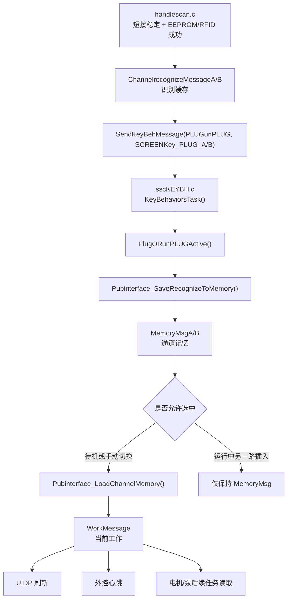

关键判断点：

| 判断点 | 应看变量 | 正常值 | 异常解释 |
| --- | --- | --- | --- |
| 识别是否完成 | `ChannelrecognizeMessageA/B.handle_type` | 非 0 或对应型号 | EEPROM/RFID 仍未解析成功 |
| 插入事件是否投递 | `SendKeyBehMessage()` 返回路径 | 队列收到 `SCREENKey_PLUG_A/B` | 队列满、任务未运行或事件未发 |
| 通道记忆是否写入 | `MemoryMsgA/B.hand_model` | 等于识别到的手柄型号 | 插拔事件未执行或保存函数提前返回 |
| 当前通道是否切换 | `WorkMessage.channel_work` | 待机插入可为 A/B | 运行中另一路插入不应改变 |
| UI 是否刷新 | `SendUIDSMessage(UI_HANDLE_ID, ...)` | enable 为 true，通道号正确 | UI 队列、图标映射或屏幕通信异常 |
| 外控是否显示在线 | 心跳中的手柄在线字段 | 对应通道在线 | 心跳组帧未读取最新状态 |

### 5.8 手柄识别现场调试流程

#### A 手柄插入不上线

按下面顺序排查，不要直接从 UI 显示开始：

1. 断在 `HandlescanA_Fun_SSC()`，观察短接 IO 原始电平。正常插入应进入低电平候选。
2. 观察 A 通道 `stage` 是否从 `IDLE` 进入 `DEBOUNCE_IN`，再进入 `WAIT_VERIFY`。
3. 断在 `AT24CS32_VerifyCrc_I2C2()`，记录返回码。
4. 若认证失败，读取 `AT24CS32_GetLastDebugInfo()`，记录设备地址、内部地址、长度、HAL 状态和 HAL 错误码。
5. 若认证通过但不上线，断在 `Handlescan_UpdateRecognizeMessage()`，看 `ChannelrecognizeMessageA` 是否写入手柄型号、刀具类型、速度范围。
6. 断在 `SendKeyBehMessage(PLUGunPLUG, SCREENKey_PLUG_A)`，确认事件是否投递。
7. 断在 `PlugORunPLUGActive()`，确认 `WorkMessage.Channel_Aonline` 和 `MemoryMsgA.hand_model` 是否更新。
8. 断在 `Pubinterface_LoadChannelMemory(CHANNEL_A)`，确认待机时是否装载到 `WorkMessage`。
9. 最后看 `UIDisplayTask()` 和 UART6 发送，确认 UI 是否只是显示未刷新。

#### 运行中插入 B 导致 A 参数变化

该现象违反“运行中另一路不能抢当前工作通道”的规则。按下面变量判断：

| 位置 | 正常值 | 异常含义 |
| --- | --- | --- |
| `WorkMessage.channel_work` | 仍为 A | 被错误切到 B |
| `WorkMessage.hand_model` | 仍为 A 手柄型号 | 被 B 覆盖 |
| `WorkMessage.speed_set_work` | 仍为 A 原速度 | B 的 Page4 默认速度被装载 |
| `MemoryMsgB.hand_model` | 更新为 B 型号 | B 识别落地正常 |
| `Pubinterface_LoadChannelMemory()` | 不应在运行中自动装载 B | 插拔策略被破坏 |

#### 拔出当前通道后机器行为异常

当前通道拔出和非当前通道拔出不是一回事：

| 场景 | 期望行为 | 调试入口 |
| --- | --- | --- |
| 待机拔出非当前通道 | 只清对应在线状态和 UI | `PlugORunPLUGActive()` |
| 待机拔出当前通道，另一通道在线 | 可回落显示另一通道 | `Pubinterface_LoadChannelMemory()` |
| 运行中拔出非当前通道 | 不影响当前电机输出 | `WorkMessage.channel_work` |
| 运行中拔出当前通道 | 停止或保护，不能自动切到另一通道继续跑 | `WorkAlarm_Set()`、`MotorStops()` |

记录模板：

```text
动作：运行中插入/拔出 A 或 B
插入前：
  WorkMessage.channel_work =
  WorkMessage.runflag_work =
  WorkMessage.hand_model =
  MemoryMsgA.hand_model =
  MemoryMsgB.hand_model =

插拔事件中：
  HandlescanStage =
  verify_result =
  SendKeyBehMessage key =
  PlugORunPLUGActive key =

插拔事件后：
  WorkMessage.channel_work =
  WorkMessage.runflag_work =
  MemoryMsgA.hand_model =
  MemoryMsgB.hand_model =
  alarm_flag/alarm_value =
  UI_HANDLE_ID 是否刷新 =
```

## 6. 输入链路原理

### 6.1 按键队列为什么存在

屏幕、手柄、脚踏按键最终大量汇入 `SendKeyBehMessage()`，由 `KeyBehaviorsTask()` 周期消费。这样做是为了让输入事件集中走同一套业务函数，避免屏幕和手柄各自复制调速、切通道、切方向逻辑。

统一分发关系：

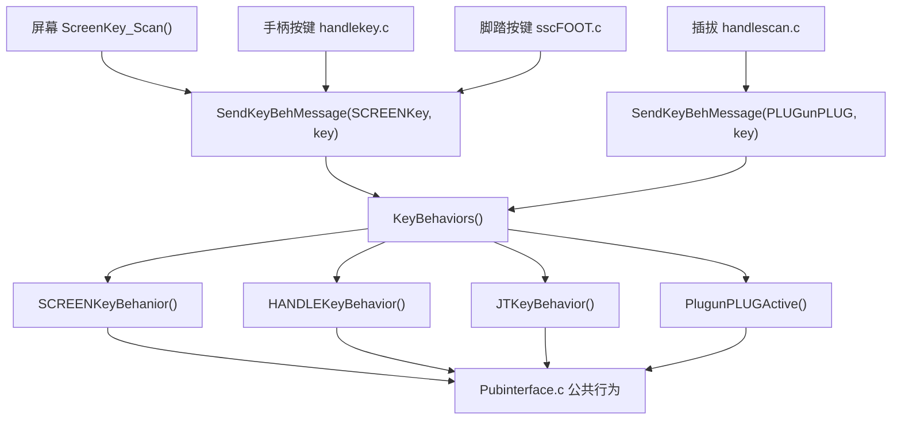

关键队列：

| 项 | 当前值 |
| --- | --- |
| 队列 | `KeyBehivQueue` |
| 深度 | 20 |
| 普通按键等待 | 0 |
| 插拔/RFID 刷新等待 | 60ms |
| 消费周期 | 30ms |

### 6.2 屏幕输入

屏幕是 DWIN 串口屏，UART6 收到 `0x5A 0xA5 ... 0x83` 后由 `ScreenKey_Scan()` 解析。屏幕上不同区域的 key 会被转成内部 `SCREENKey_*`。

几个关键设计点：

1. 屏幕触摸不直接运行电机，仍然走按键队列和公共接口。
2. 触控运行不是一次点击启动，而是持续收到 `0x5520` 保活。
3. `SCREENKey_TouchKeepAlive` 持续收到才保持触控运行，超时后只停止运行，不一定退出触控模式。
4. `UIDP_PUMP_DISPLAY_AB_MIRROR_SWAP_ENABLE` 影响泵显示和触摸映射，但不等于物理泵 UART 互换。

触控保活路径：

```text
屏幕持续发送 0x5520
-> ScreenKey_PostLegacyAction()
-> ScreenKey_ResetTouchKeepAlive()
-> SendKeyBehMessage(SCREENKey, SCREENKey_TouchKeepAlive)
-> SCREENKeyBehanior()
-> 触控运行状态写入 WorkMessage
-> MOTORRUN() 周期输出
```

如果停止发送保活，`ScreenKey_ServiceTouchKeepAlive()` 计数超时，调用 `Pubinterface_StopTouchKeepAliveRun()` 停止电机。

### 6.2.1 屏幕输入源码依据

屏幕输入从 UART6 DMA 缓冲区取帧，识别 DWIN `0x5A 0xA5` 帧头和 `0x83` 读变量指令：

```c
void ScreenKey_Scan(void)
{
  rlen = Uart6_DMARecvDataPeek(dat);
  if (rlen < 9)
    return;

  for (i = 0; i < (rlen - 8); i++)
  {
    if ((dat[i] == 0x5A) && (dat[i + 1] == 0xA5) && (dat[i + 3] == 0x83))
    {
      len = dat[i + 2] + 3;
      if (slen < len)
        break;

      Common_CopyData(&dat[i], dat1, len);
      switch (dat1[4])
      {
        case 0x24:
          /* 主运行页各区域按 dat1[5] 和 dat1[8] 转成 SCREENKey_* */
          break;
        case 0x55:
          /* 0x5520 是触控运行保活 */
          break;
      }
    }
  }
}
```

主运行页按 `dat1[5]` 区分区域，再按 `dat1[8]` 区分按钮。常用区域如下：

| `dat1[4..5]` | 区域 | `dat1[8]` 示例 | 转换结果 |
| --- | --- | --- | --- |
| `0x24 0x00` | 顶部手柄/刀具区 | 1/2 | A/B 手柄切换 |
| `0x24 0x01` | 速度区 | 1/2/3/4 | 快减、慢减、慢加、快加 |
| `0x24 0x02` | 方向区 | 1/2/3 | 正转、往复、反转 |
| `0x24 0x03` | 频率区 | 1/2 | 频率加减 |
| `0x24 0x04` | 控制方式区 | 1/2/3/4 | 脚控、手控、触控、外控退出 |
| `0x24 0x05` | A 泵区 | 1/2/3 | A 泵加、减、启停 |
| `0x24 0x06` | B 泵区 | 1/2/3 | B 泵加、减、启停 |
| `0x55 0x20` | 触控运行保活 | 固定 | `SCREENKey_TouchKeepAlive` |

触控运行的核心不是“点一下启动”，而是屏幕持续发保活帧。源码中保活逻辑的关键片段如下：

```c
#define SCREENKEY_TOUCH_KEEPALIVE_TIMEOUT_TICKS 14U

static void ScreenKey_ResetTouchKeepAlive(void)
{
  s_touch_keepalive_ticks = 0U;
}

static void ScreenKey_ServiceTouchKeepAlive(void)
{
  if ((WorkMessage.drivetype_work != TOUCHWORK) ||
      (WorkMessage.touchactive_work != TOUCHWORK))
  {
    s_touch_keepalive_ticks = SCREENKEY_TOUCH_KEEPALIVE_TIMEOUT_TICKS;
    return;
  }

 if (s_touch_keepalive_ticks >= SCREENKEY_TOUCH_KEEPALIVE_TIMEOUT_TICKS)
  {
    Pubinterface_StopTouchKeepAliveRun();
  }
}
```

这段保活代码要注意两个分支：

| 分支 | 含义 | 现场表现 |
| --- | --- | --- |
| 当前不是触控运行 | 直接把计数置到超时值并返回 | 非触控模式下不会误触发触控停机 |
| 当前是触控运行且计数超时 | 调用 `Pubinterface_StopTouchKeepAliveRun()` | 屏幕停止连续发送 `0x5520` 后，主控主动停电机 |

因此触控运行不是“一次启动后一直跑”。屏幕必须持续发送保活帧，主控每个周期用计数判断屏幕是否还在控制。调试时如果触控运行自动停，先抓 UART6 是否持续有 `0x55 0x20` 区域帧，再看 `s_touch_keepalive_ticks` 是否被 `ScreenKey_ResetTouchKeepAlive()` 清零。

调试屏幕输入时：

| 断点 | 正常值 | 异常说明 |
| --- | --- | --- |
| `Uart6_DMARecvDataPeek()` | `rlen >= 9` 且数据含 `5A A5` | UART6、DMA、屏幕波特率或线束异常 |
| `ScreenKey_Scan()` | `dat[i+3] == 0x83` | 屏幕发的不是读变量帧 |
| `ScreenKey_PostLegacyAction()` | `screen_key != 0` | VP 地址或 key 表不匹配 |
| `SendKeyBehMessage(SCREENKey, screen_key)` | 队列发送成功 | `KeyBehivQueue` 未创建或队列满 |
| `SCREENKeyBehanior()` | 进入对应 `SpeedActive/DirActive/PUMPActive` | 队列消费任务未运行 |
| `ScreenKey_ServiceTouchKeepAlive()` | 保活期间计数被清零 | `0x5520` 没有持续发送 |

屏幕泵 A/B 显示镜像只影响触摸区和显示区映射：

```c
#if (UIDP_PUMP_DISPLAY_AB_MIRROR_SWAP_ENABLE == 1U)
  /* 屏幕原 A 区实际对应逻辑 B 泵 */
#else
  /* 屏幕原 A 区对应逻辑 A 泵 */
#endif
```

它不改变 UART5/UART7 物理输出。物理输出互换只看 `PUMP_LOGICAL_AB_PHYSICAL_SWAP_ENABLE`。

### 6.3 脚踏输入

脚踏分两条链路：

1. `Foot_ParseDataS()` 10ms 解析 UART4 实时数据，产生 `footmessage`。
2. `FootControlTask()` 25ms 消费脚踏状态，根据踏板行程控制电机和注水泵。

脚踏不是简单开关。它还承担：

| 功能 | 原理 |
| --- | --- |
| 单踏板行程控制 | 按低点、高点和实时 AD 换算 `WorkMessage.speed_work` |
| 双踏板 A/B 切换 | 左/右踏板可触发通道切换，并要求松脚确认 |
| 注水泵跟随 | 电机进入运行后调用 `Pubinterface_SetHandleInjectionPumpRun(true)` |
| 松脚去抖 | 单踏板释放有 3 个 25ms 周期去抖 |
| 控制权仲裁 | 启动前必须拿到 `CONTROL_OWNER_FOOT` |

脚踏启动路径：

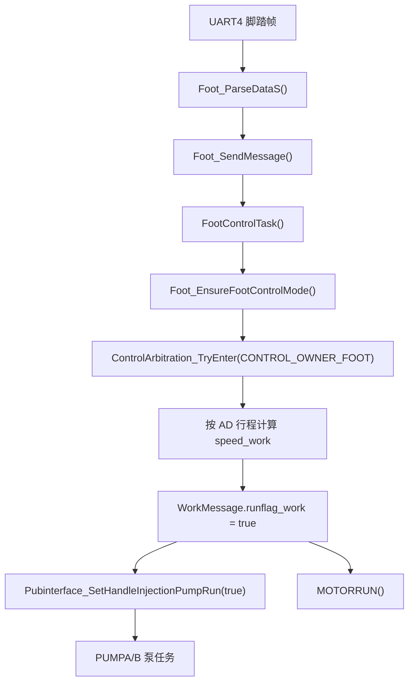

### 6.3.1 脚踏启动前置条件

脚踏不是只要 AD 大于阈值就能启动。`Foot_EnsureFootControlMode()` 会先做一组安全检查：

```c
static bool Foot_EnsureFootControlMode(void)
{
    if (WorkMessage.drivetype_work != JTWORK)
    {
        return false;
    }

    if ((WorkMessage.channel_work == CHANNEL_NONE) || (WorkMessage.hand_model == 0U))
    {
        Foot_ReportHandleNotConnectedAlarm();
        return false;
    }

    if (ControlArbitration_IsExternalActive() ||
        ControlSignalMessage.HMI_control_flag ||
        (WorkMessage.touchactive_work == TOUCHWORK))
    {
        return false;
    }

    if (ControlArbitration_IsBusyByOther(CONTROL_OWNER_FOOT))
    {
        return false;
    }

    if (WorkMessage.alarm_flag == true)
    {
        return false;
    }

    return true;
}
```

这段前置检查按“模式、通道、互斥、报警”四层阻断脚踏：

| 层级 | 代码条件 | 为什么要挡住 |
| --- | --- | --- |
| 模式 | `drivetype_work != JTWORK` | 当前不是脚控模式时，脚踏 AD 不应该偷偷启动电机 |
| 通道 | `channel_work == CHANNEL_NONE` 或 `hand_model == 0` | 无当前手柄时无法确定电机类型、速度范围和方向 |
| 互斥 | 外控、HMI、触控任一占用 | 避免脚踏和其它控制源同时改 `runflag_work` |
| owner | `ControlArbitration_IsBusyByOther()` | 电机正在被其它本地来源控制时不抢占 |
| 报警 | `alarm_flag == true` | 真实报警状态下禁止脚踏启动 |

现场排查脚踏“踩了没反应”时，按这张表从上往下看。只要某一层返回 false，后面的速度换算和电机启动都不会执行。

这段检查解释了几个现场现象：

| 现象 | 原因 | 断点和变量 |
| --- | --- | --- |
| 踩脚踏无反应 | 当前不是脚控模式 | `WorkMessage.drivetype_work` 是否为 `JTWORK` |
| 踩脚踏弹手柄未连接 | 当前没有有效工作通道或手柄型号 | `channel_work`、`hand_model` |
| 外控授权后脚踏无效 | 外控占用控制权 | `ControlArbitration_IsExternalActive()` |
| 触控页面还开着时脚踏无效 | 触控占用或锁存 | `WorkMessage.touchactive_work` |
| 报警后脚踏不启动 | 真实报警阻止运行 | `alarm_flag/alarm_value` |

### 6.3.2 单踏板速度换算

单踏板运行时，电机速度不是固定值，而是按实时 AD 在低点和高点之间线性映射：

```c
WorkMessage.speed_work =
  (float)(jt_adcvalue - msg.LValue_Left) /
  (float)(msg.HValue_Left - msg.LValue_Left) *
  WorkMessage.speed_set_work;

WorkMessage.runflag_work = true;
Pubinterface_SetHandleInjectionPumpRun(true);
```

这段代码的关键不是公式本身，而是公式使用了三个前提：

1. `msg.HValue_Left` 必须大于 `msg.LValue_Left`，否则分母异常或速度跳变。
2. `jt_adcvalue` 应该被限制在定标低点和高点之间，超出范围时要先看脚踏定标数据。
3. `WorkMessage.speed_set_work` 是当前通道设定上限，脚踏只是在这个上限内按行程缩放。

所以脚踏速度异常时不要先改电机逻辑。应先记录定标低点、高点、实时 AD 和设定速度，再判断换算结果是否合理。

调试时要同时记录四个量：

| 变量 | 正常含义 | 异常风险 |
| --- | --- | --- |
| `jt_adcvalue` | 当前脚踏实时 AD | 噪声、未更新、超范围 |
| `msg.LValue_Left` | 定标低点 | 大于实时值时会被钳到低点 |
| `msg.HValue_Left` | 定标高点 | 等于低点会导致除数异常风险 |
| `WorkMessage.speed_set_work` | 当前通道设定速度 | 为 0 时会回退默认速度 |

脚踏松开不是立即停泵，当前有 3 个 25ms 周期去抖：

```c
#define FOOT_SINGLE_PEDAL_RELEASE_DEBOUNCE_TICKS 3U
```

这表示实时 AD 短暂掉到阈值以下时，先认为是抖动，避免注水泵一停一启。若现场感觉松脚后停得慢，先确认这是 75ms 左右的软件去抖，不要直接改泵任务。

### 6.3.3 脚踏和注水泵联动

脚踏运行手柄时，注水泵跟随不是由脚踏直接发 UART5/UART7，而是通过公共接口：

```text
FootControlTask()
-> ControlArbitration_TryEnter(CONTROL_OWNER_FOOT)
-> WorkMessage.runflag_work = true
-> Pubinterface_SetHandleInjectionPumpRun(true)
-> pumpMessageA/B.run_flag = true
-> PUMPAehaviors() / PUMPBehaviors()
-> Pump_SetSpeedS_A/B()
-> UART5 / UART7
```

查“脚踏能启动电机但注水泵不转”时：

| 断点 | 正常值 | 异常说明 |
| --- | --- | --- |
| `FootControlTask()` | 进入运行分支 | 脚踏帧或模式不对 |
| `Pubinterface_SetHandleInjectionPumpRun(true)` | 被调用 | 电机没进入运行态或提前返回 |
| `pumpMessageA/B.type` | 至少一路为 `INJECTWATER` | 压力设备码未识别为注水泵 |
| `pumpMessageA/B.run_flag` | true | 跟随泵未被打开 |
| `pumpMessageA/B.speed_work` | Page4 默认注水或回退值 | 默认流量为 0 或越界 |
| `PUMPAehaviors()/PUMPBehaviors()` | 输出非 0 | 被压力闭环或类型判断拦截 |

### 6.4 手柄按键

手柄普通按键走 `HANDLEKeyBehavior()`，可以调速、调方向、启动停止、开口定位。手柄运行键还会经过专门的运行键处理，启动前必须检查：

1. 当前通道有效。
2. 当前手柄型号有效。
3. 没有真实报警。
4. 控制权没有被外控、脚踏、屏幕触控占用。
5. 当前通道有合法速度和方向。

### 6.4.1 手柄实体运行键

当前手柄实体运行键按 30ms 周期扫描，并用 2 次连续电平确认去抖，约 60ms：

```c
#define HANDLE_KEY_DEBOUNCE_COUNT 2U
#define HANDLE_KEY_PRESSED_LEVEL GPIO_PIN_RESET
```

实体键支持的手柄型号当前只包括空心钻 A/B 型：

```c
static bool HandleRunKey_IsSupportedModel(uint8_t hand_model)
{
    return ((hand_model == PXBA_ONLINES) || (hand_model == PXBB_ONLINES));
}
```

实体键启动前会按通道准备参数：

```c
static bool HandleRunKey_PrepareRunChannel(uint8_t channel)
{
    if (HandleRunKey_IsChannelReady(channel) == false)
    {
        return false;
    }

    if (WorkMessage.channel_work != channel)
    {
        HandleSwitchActive((channel == CHANNEL_A) ? SCREENKey_HANDLE_A : SCREENKey_HANDLE_B);
    }

    HandleRunKey_ApplyHandleMode(channel);

    if (WorkMessage.speed_set_work == 0U)
    {
        WorkMessage.speed_set_work = Pubinterface_GetCurrentDefaultMotorSpeed();
    }

    WorkMessage.speed_work = WorkMessage.speed_set_work;
    return (WorkMessage.speed_work != 0U);
}
```

这段准备函数解决的是“实体键按下时到底启动哪个通道、用哪个默认速度”的问题：

| 代码动作 | 业务意义 |
| --- | --- |
| `HandleRunKey_IsChannelReady(channel)` | 先确认该通道在线、型号支持、记忆已落地 |
| `HandleSwitchActive(...)` | 如果实体键目标通道不是当前通道，先走统一切通道逻辑 |
| `HandleRunKey_ApplyHandleMode(channel)` | 把该通道切到手柄控制模式 |
| `speed_set_work == 0` 时取默认速度 | 防止 Page4 或运行态没有速度导致按键启动后电机不转 |
| `speed_work = speed_set_work` | 把设定速度变成当前输出速度 |

如果实体键按下后只切了通道但电机不转，优先看这个函数最后返回值。`speed_work == 0` 表示准备阶段已经失败，后面的控制权和电机组帧都不会有意义。

实体键真正启停时，会同步控制电机运行和注水泵跟随：

```c
static bool HandleRunKey_SetMotorRun(bool enable)
{
    if (enable)
    {
        if (ControlArbitration_TryEnter(CONTROL_OWNER_HANDLE) == false)
        {
            return false;
        }
    }

    ControlSignalMessage.handle_control_flag = enable;
    WorkMessage.runflag_work = enable;
    Pubinterface_SetHandleInjectionPumpRun(enable);

    if (enable == false)
    {
        WorkMessage.speed_work = 0U;
        ControlArbitration_ExitLocalControlIfIdle(CONTROL_OWNER_HANDLE);
    }

    SendKeyBehMessage(HANDLEKey, enable ? HANDLEKey_motor_start : HANDLEKey_motor_stop);
    return true;
}
```

这段启停函数同时做了三件事：

1. 启动时先申请 `CONTROL_OWNER_HANDLE`，申请不到就不改运行状态。
2. 成功后同时写 `ControlSignalMessage.handle_control_flag` 和 `WorkMessage.runflag_work`，让后续 UI、外控心跳和电机任务看到一致状态。
3. 同步调用 `Pubinterface_SetHandleInjectionPumpRun(enable)`，让注水泵跟随电机启停。

停止分支还会把 `speed_work` 清零，并尝试释放本地 owner。这样做的目的是：按键停止后电机任务会持续发停止帧，控制权也能在电机停稳后释放。若只清 `runflag_work` 不清 owner，脚踏或屏幕可能仍然无法接管。

调试实体键：

| 断点 | 正常值 | 异常说明 |
| --- | --- | --- |
| `HANDLEKEYTaskFunc()` | 周期进入 | 任务未注册或被控制权拦截 |
| `HandleRunKey_DebouncePressEvent()` | 按下后产生 `press_event=true` | GPIO 电平、去抖计数或硬件按键异常 |
| `HandleRunKey_IsChannelReady()` | 当前通道在线且型号支持 | 非 PXBA/PXBB 或 MemoryMsg 未落地 |
| `HandleRunKey_PrepareRunChannel()` | `speed_work != 0` | Page4 默认速度未装载 |
| `ControlArbitration_TryEnter(CONTROL_OWNER_HANDLE)` | true | 被脚踏、触控或外控占用 |
| `Pubinterface_SetHandleInjectionPumpRun(true)` | 被调用 | 注水泵不跟随时重点看 |

### 6.4.2 手柄按键队列

手柄普通按键最终也会进入 `KeyBehivQueue`，再由 `HANDLEKeyBehavior()` 分发。这里的设计目的，是让手柄、屏幕、脚踏、外控尽量复用同一套 `SpeedActive()`、`DirActive()`、`PUMPActive()`、`HandleSwitchActive()`。

```c
void HANDLEKeyBehavior(uint8_t key_value)
{
    switch(key_value)
    {
        case HANDLEKey_speed_add:
        case HANDLEKey_speed_sub:
            SpeedActive(key_value);
            break;

        case HANDLEKey_motor_start:
            WorkMessage.runflag_work = true;
            ControlSignalMessage.handle_control_flag = true;
            Pubinterface_SetHandleInjectionPumpRun(true);
            break;

        case HANDLEKey_motor_stop:
            WorkMessage.runflag_work = false;
            ControlSignalMessage.handle_control_flag = false;
            Pubinterface_SetHandleInjectionPumpRun(false);
            ControlArbitration_ExitLocalControlIfIdle(CONTROL_OWNER_HANDLE);
            break;

        case HANDLEKey_dir_Forward:
        case HANDLEKey_dir_Reverse:
        case HANDLEKey_dir_OSC:
            DirActive(key_value);
            break;
    }
}
```

这个分发函数说明普通手柄按键和实体运行键最终会合到同一套公共行为：

| 按键分支 | 写入状态 | 后续影响 |
| --- | --- | --- |
| 调速 | `SpeedActive()` 更新当前通道速度 | UI、外控心跳、电机下次启动会使用新速度 |
| 启动 | `runflag_work=true`，`handle_control_flag=true`，打开注水泵跟随 | `MOTORRUN()` 下个周期发启动帧 |
| 停止 | `runflag_work=false`，关闭注水泵跟随，释放 owner | 电机任务发停止帧，泵任务停输出 |
| 方向 | `DirActive()` 更新方向和对应速度记忆 | 下次组帧改变 `control_mode` |

如果按键队列里能看到 `HANDLEKey_motor_start`，但 `WorkMessage.runflag_work` 没变，问题就在这个分发函数或其前置拦截；如果 `runflag_work` 已变但电机没动，问题转到第 8 章电机输出链路。

如果实体键能翻转 `runflag_work`，但 UI 或外控心跳没有同步，优先检查 `SendKeyBehMessage(HANDLEKey, ...)` 和 `KeyBehaviors()` 是否正常消费队列。

### 6.5 外部通信输入

外控通过 UART2 进入。它的关键点是“先授权，再控制”：

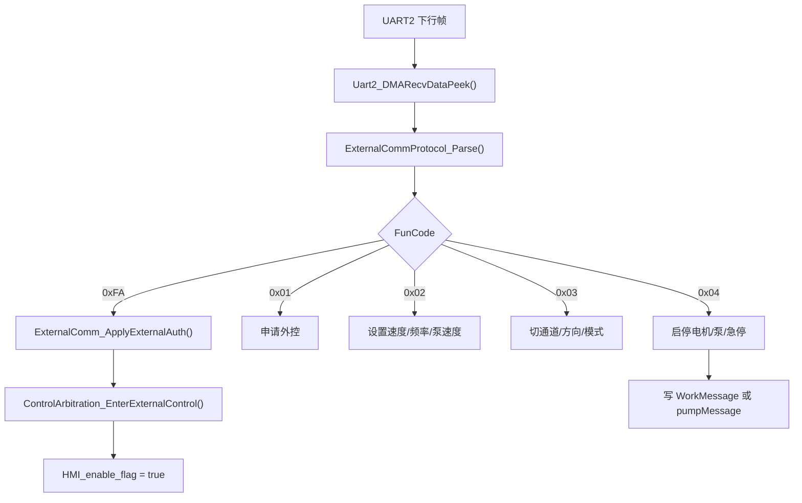

当前外控时间策略：

| 时间 | 行为 |
| --- | --- |
| 100ms | 主控上传心跳 |
| 2 秒静默 | 停电机和泵输出，但保留外控授权 |
| 10 秒静默 | 释放外控授权，熄灭在线图标 |

这里以当前源码为准：`EXTERNAL_COMM_LINK_STOP_OUTPUT_TIMEOUT_MS = 2000`，`EXTERNAL_COMM_LINK_RELEASE_TIMEOUT_MS = 10000`。

## 7. 控制权仲裁和安全逻辑

### 7.1 为什么要仲裁

如果脚踏、手柄、屏幕触控、外控都可以直接改 `runflag_work`，就会出现危险场景：

1. 外控运行时，脚踏突然踩下改变速度。
2. 手柄运行中，屏幕触控保活又启动一次。
3. 电机还没停稳，另一个来源接管。
4. 急停后某个旧队列消息又把电机启动。

所以主控使用控制权 owner：

| Owner | 含义 |
| --- | --- |
| `CONTROL_OWNER_NONE` | 当前没有来源占用 |
| `CONTROL_OWNER_EXTERNAL` | 外控占用 |
| `CONTROL_OWNER_FOOT` | 脚踏占用 |
| `CONTROL_OWNER_SCREEN` | 屏幕/触控占用 |
| `CONTROL_OWNER_HANDLE` | 手柄占用 |

启动电机前，各来源应调用 `ControlArbitration_TryEnter()`。本地来源通常在命令停止且驱动反馈停稳后释放；外控授权后不会因为电机停稳自动释放，需要上位机退出或链路 10 秒静默。

### 7.1.1 控制权源码依据

控制权由 `Pubinterface.c` 内部静态变量保存：

```c
static volatile uint8_t s_control_owner = CONTROL_OWNER_NONE;
```

Owner 定义在 `Pubinterface.h`：

```c
#define CONTROL_OWNER_NONE      0U
#define CONTROL_OWNER_EXTERNAL  1U
#define CONTROL_OWNER_FOOT      2U
#define CONTROL_OWNER_SCREEN    3U
#define CONTROL_OWNER_HANDLE    4U
```

申请控制权的核心函数如下：

```c
bool ControlArbitration_TryEnter(uint8_t owner)
{
    if (ControlArbitration_IsValidOwner(owner) == false)
    {
        return false;
    }

    ControlArbitration_ReleaseLocalOwnerIfMotorIdle();

    if (s_control_owner == owner)
    {
        return true;
    }

    if (s_control_owner == CONTROL_OWNER_EXTERNAL)
    {
        return false;
    }

    if (ControlArbitration_IsMotorBusy())
    {
        return false;
    }

    s_control_owner = owner;
    return true;
}
```

这段代码说明：

1. 无效 owner 不能进入系统，防止误写仲裁状态。
2. 每次申请前会先尝试释放已经停稳的本地 owner。
3. 同一个 owner 重复申请算成功，允许持续控制或发送停止。
4. 外控 owner 持有时，本地脚踏、屏幕、手柄都不能抢占。
5. 电机命令仍在运行，或驱动反馈还没停稳时，不允许另一个来源接管。

电机是否“忙”不是只看 `runflag_work`：

```c
static bool ControlArbitration_IsMotorBusy(void)
{
    if (WorkMessage.runflag_work == true)
    {
        return true;
    }

    return (WorkMessage.driver_speed_feedback >
            CONTROL_ARBITRATION_MOTOR_STOP_SPEED_THRESHOLD);
}
```

因此，主控已经清了 `runflag_work`，但驱动板还反馈转速时，控制权仍不释放。这是为了避免刚发停止命令、电机还在刹车过程中被另一来源接管。

### 7.1.2 外控进入和释放

外控进入时不是直接启动电机，而是先申请 owner 并清理残留输出：

```c
bool ControlArbitration_EnterExternalControl(void)
{
    bool already_external = ControlArbitration_IsOwner(CONTROL_OWNER_EXTERNAL);

    if (ControlArbitration_TryEnter(CONTROL_OWNER_EXTERNAL) == false)
    {
        return false;
    }

    if (already_external == false)
    {
        ControlArbitration_StopMotionOutput();
        ControlSignalMessage.HMI_control_flag = false;
    }

    WorkMessage.hmiactive_work = 1U;
    WorkMessage.touchactive_work = TOUCHWORK;
    WorkMessage.drivetype_work = TOUCHWORK;
    ControlSignalMessage.HMI_enable_flag = true;
    return true;
}
```

外控释放时会停电机、停泵、清外控状态，再恢复本机可接管控制方式：

```c
void ControlArbitration_ReleaseExternalControl(void)
{
    if (s_control_owner != CONTROL_OWNER_EXTERNAL)
    {
        WorkMessage.hmiactive_work = 0U;
        ControlSignalMessage.HMI_enable_flag = false;
        return;
    }

    ControlArbitration_StopMotionOutput();
    WorkMessage.hmiactive_work = 0U;
    WorkMessage.touchactive_work = 0U;
    ControlSignalMessage.HMI_enable_flag = false;
    WorkMessage.drivetype_work = ControlArbitration_GetLocalDriveTypeAfterExit();
    ControlArbitration_Exit(CONTROL_OWNER_EXTERNAL);
}
```

调试“外控退出后本地仍无法启动”时，按下面顺序看：

| 变量或函数 | 正常值 | 异常说明 |
| --- | --- | --- |
| `s_control_owner` | 退出后为 `CONTROL_OWNER_NONE` | 外控没有真正释放 |
| `WorkMessage.hmiactive_work` | 0 | UI/状态仍认为外控激活 |
| `WorkMessage.touchactive_work` | 0 或本机触控实际状态 | 外控复用触控标志残留 |
| `ControlSignalMessage.HMI_enable_flag` | false | 外控使能残留 |
| `WorkMessage.drivetype_work` | `JTWORK/HANDLEWORK/NOWORK` | 退出后仍是外控占用模式 |
| `WorkMessage.driver_speed_feedback` | 0 | 驱动反馈未归零时本地 owner 不释放 |

### 7.1.3 按键队列如何被仲裁拦截

`KeyBehaviors()` 消费队列时会先调用 `ControlArbitration_ShouldBlockLocalKey()`。它不会简单丢弃所有按键，而是区分运行控制、参数调节和泵业务：

| 按键类型 | 是否可能被 owner 拦截 | 原因 |
| --- | --- | --- |
| 电机启动/切控制方式 | 会 | 会改变运行来源 |
| 速度/频率调节 | 通常放行 | 运行中仍需要调整目标参数 |
| 屏幕/脚踏泵键 | 通常放行到泵业务 | 泵业务自己判断在线、类型、压力和外控 |
| 外控泵键 | 外控 owner 下放行 | 外控对泵的控制仍属于外部来源 |
| 插拔事件 | 不参与电机 owner | 插拔必须更新在线状态，不能因电机运行被长期丢弃 |

定位“按键没反应”时先判断它是哪一类。如果是运行控制类，重点看 `s_control_owner` 和 `ControlArbitration_IsMotorBusy()`；如果是速度调节类，重点看 `SpeedActive()` 是否进入；如果是泵键，重点看 `PUMPActive()` 和泵在线状态。

### 7.2 报警逻辑

真实报警集中在 `WorkMessage.alarm_flag/alarm_value`。建议不要绕过 `WorkAlarm_Set()`、`WorkAlarm_Clear()` 直接写。

当前报警码重点：

| 码 | 含义 | 注意 |
| --- | --- | --- |
| 1 | 手柄未连接 | 启动前置检查常见 |
| 4/5 | 电机过载相关 | 来自驱动 Err 映射 |
| 6 | 脚踏值错误 | 查脚踏定标和实时 AD |
| 8 | 电机通信/电压相关 | 查 UART1 回包 |
| 9 | Hall 异常 | 查驱动板反馈 |
| 10 | A 手柄 EEPROM 错 | A 通道认证 |
| 11 | Page4 阈值蜂鸣或驱动板故障 | 数字复用，必须看来源 |
| 12 | B 手柄 EEPROM 错 | B 通道认证 |
| 14 | A/B 都错 | 双通道认证失败 |

注意：`WORK_ALARM_SPEED_THRESHOLD` 和 `WORK_ALARM_MOTOR_DRIVER_BOARD` 都是 11。Page4 阈值只蜂鸣，不强制停机；驱动板故障是真实报警。调试时必须看来源函数。

## 8. 电机控制原理

### 8.1 从 WorkMessage 到 UART1

电机输出任务是 `MOTORRUNTask()`，每 50ms 调用 `MOTORRUN()`。它不关心是谁启动的，只看当前 `WorkMessage`。

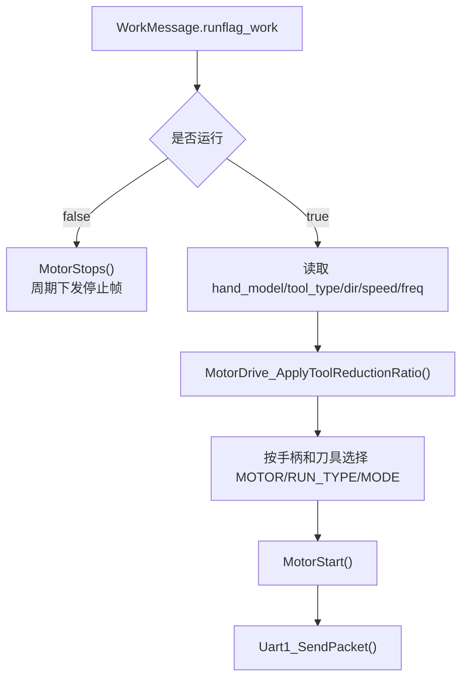

关键设计：

1. `speed_set_work` 是设定速度，`speed_work` 是当前实际运行速度。
2. 脚踏运行时，`speed_work` 会按踏板行程动态变化。
3. 刀具减速比通过 `MotorDrive_ApplyToolReductionRatio()` 修正输出速度。
4. `EMBD_ONLINES` 手柄在最终组帧时会翻转正反方向，不能只看 `dir_work` 判断物理方向。
5. 有刷/无刷选择由通道和 `tool_type` 决定。
6. 停止时不是只发一次停止帧，而是运行标志 false 后周期下发。

### 8.1.1 电机启动帧源码依据

主控发给驱动板的运行帧固定 11 字节：

```c
static uint8_t motor_stopcode[11] =
{
  0xAA, 0x01, 0x00, 0x01, 0x00, 0x00,
  0x02, 0x00, 0x00, 0xBB, 0xAA
};

uint8_t motor_startcode[11] =
{
  0xAA,
  msg.control_mode,
  msg.frequency,
  msg.motor_type,
  msg.speed_h,
  msg.speed_l,
  msg.run_type,
  msg.pro_current_h,
  msg.pro_current_l,
  0xBB,
  0xAA
};
```

这段帧定义要和普通 Modbus 区分开看。主控发给电机驱动板的是私有 11 字节帧，不是标准寄存器读写。最后两个字节 `BB AA` 在当前驱动工程中被当作兼容尾处理，因此主控和驱动必须成套验证。

读这段代码时要特别看三点：

1. 停止帧 `motor_stopcode` 不是空帧，而是一个完整的停止命令。电机停不下来时应确认主控是否周期发送这 11 字节。
2. 启动帧中 `speed_h/speed_l` 是经过倍率和刀具减速比处理后的驱动速度，不一定等于屏幕显示值。
3. `pro_current_h/l` 当前运行中写为 `0xFFFF`，所以不要把它误认为当前反馈电流；真实电流来自驱动回包。

字段含义：

| 字节 | 字段 | 来源 | 说明 |
| --- | --- | --- | --- |
| 0 | `0xAA` | 固定 | 帧头 |
| 1 | `control_mode` | `WorkMessage.dir_work` | 1 正转、2 反转、3 往复 |
| 2 | `frequency` | `WorkMessage.freq_work` | 主控钳到 100，驱动内部再处理 |
| 3 | `motor_type` | 当前通道和有刷/无刷判定 | A 无刷 1、B 无刷 2、A 有刷 3、B 有刷 4 |
| 4..5 | `speed_h/l` | `MotorDrive_ApplyToolReductionRatio()` | 16 位速度，超过钳到 `0xFFFF` |
| 6 | `run_type` | 手柄型号和有刷/无刷 | 无霍尔 1、有霍尔 2、有刷 3/4 |
| 7..8 | `pro_current_h/l` | `WorkMessage.current_work` | 当前源码运行中写为 `0xFFFF` |
| 9..10 | `BB AA` | 固定 | 驱动私有协议尾 |

速度换算源码：

```c
static uint32_t MotorDrive_ApplyToolReductionRatio(uint32_t display_speed_x10)
{
    uint32_t ratio = WorkMessage.tool_reduction_ratio;
    uint32_t reduction_ratio = ratio & 0xFFFFU;
    uint32_t speed_up_ratio = ratio >> 16U;
    uint32_t motor_speed = display_speed_x10 / 10U;

    if (reduction_ratio > 1U)
    {
        motor_speed = motor_speed * reduction_ratio;
    }
    else if (speed_up_ratio > 1U)
    {
        motor_speed = motor_speed / speed_up_ratio;
    }

    if (motor_speed > 0xFFFFU)
    {
        motor_speed = 0xFFFFU;
    }

    return motor_speed;
}
```

这段速度换算代码解释了“屏幕速度、刀具倍率、驱动速度”之间的关系：

| 步骤 | 代码 | 含义 |
| --- | --- | --- |
| 取倍率 | `ratio = WorkMessage.tool_reduction_ratio` | 高 16 位是增速比，低 16 位是减速比 |
| 单位转换 | `display_speed_x10 / 10U` | 屏幕内部按 x10 保存，驱动按普通 rpm 单位接收 |
| 减速工具 | `motor_speed * reduction_ratio` | 刀具输出要达到目标速度，电机需要更快 |
| 增速工具 | `motor_speed / speed_up_ratio` | 电机转速可低于刀具输出速度 |
| 上限保护 | `motor_speed > 0xFFFFU` | UART 帧只有 16 位速度字段 |

如果抓到 UART1 速度字段和屏幕显示不一致，按这个表逐步反推。不要直接把差异判为组帧错误。

注意：`WorkMessage.speed_set_work` 按屏幕内部 x10 速度保存，下发驱动前会除以 10。若现场抓包速度和屏幕显示相差 10 倍，先确认是否忘记这个单位换算。

### 8.1.2 方向、通道、有刷/无刷选择

`MOTORRUN()` 根据 `WorkMessage.dir_work` 选择驱动模式：

| `dir_work` | 下发 `control_mode` | 频率 |
| --- | --- | --- |
| `ZZDIR` | `0x01` | 0 |
| `FZDIR` | `0x02` | 0 |
| `OSCDIR` | `0x03` | `MotorDrive_BuildCommandFrequency(freq_work)` |

通道和电机类型选择：

| 当前通道 | 无刷/霍尔 | 有刷 |
| --- | --- | --- |
| A | `motor_type=0x01` | `motor_type=0x03` |
| B | `motor_type=0x02` | `motor_type=0x04` |

有刷判断不只看 `tool_type`，还会看 `raw_tool_type`。原因是 `tool_type` 可能已经被归一成 `PLANER/GRINDH`，而有刷一体刀具需要保留原始型号：

```c
static uint8_t MotorDrive_IsBrushedTool(uint8_t hand_model,
                                        uint8_t tool_type,
                                        uint8_t raw_tool_type)
{
    return (uint8_t)((hand_model == PX_YIP_ONLINES) ||
                     (hand_model == PX_YIM_ONLINES) ||
                     (tool_type == PX_YIP_ONLINES) ||
                     (tool_type == PX_YIM_ONLINES) ||
                     (raw_tool_type == PX_YIP_ONLINES) ||
                     (raw_tool_type == PX_YIM_ONLINES));
}
```

这段判断的目的，是避免刀具类型被业务归一化后丢失有刷信息。它同时检查 `hand_model`、`tool_type` 和 `raw_tool_type`：

| 字段 | 为什么要看 |
| --- | --- |
| `hand_model` | 有些有刷能力来自手柄或基座本身 |
| `tool_type` | 业务层已经解析出的刀具类型 |
| `raw_tool_type` | 保留 EEPROM/RFID 原始型号，防止归一化后误判 |

如果有刷刀具被当作无刷发帧，先看这三个字段哪个没有正确装载。只改 `tool_type` 可能不够，因为当前判断是三者任一命中即可。

调试方向错时，不要只看 `dir_work`。`EMBD_ONLINES` 在组帧前会局部翻转正反方向，但不会回写 `WorkMessage.dir_work`，所以 UI 方向和 UART1 物理方向可能看起来相反，这是有意兼容。

### 8.2 驱动反馈和报警

`MotorUartData_Init()` 创建 3ms 任务，`BrushlessMotorUartData_ReceiveData()` 解析 UART1 回包。

回包会更新：

| 字段 | 来源 |
| --- | --- |
| `driver_speed_feedback` | 回包 byte4~5 |
| `driver_current_x100` | 回包 byte8~9 |
| `alarm_flag/alarm_value` | Err 字段映射 |

常见 Err 映射：

| Err | 主控动作 |
| --- | --- |
| 0 | 无错误，必要时清驱动报警 |
| 2/5 | 过载类报警 |
| 3/4 | 通信或电压类报警 |
| 11/12 | Hall 异常 |
| 14 | 相位异常 |
| 其它 | 驱动板故障，报警码可能为 11 |

调试电机不启动：

| 断点 | 正常应该看到 |
| --- | --- |
| 输入来源启动分支 | 命令确实进入 |
| `ControlArbitration_TryEnter()` | 返回 true |
| `WorkMessage.runflag_work = true` | 运行门控置位 |
| `MOTORRUN()` | 进入启动分支 |
| `MotorStart()` | 组出 UART1 帧 |
| `Uart1_SendPacket()` | 发到 PB6 |
| `BrushlessMotorUartData_ReceiveData()` | 驱动有回包，反馈转速变化 |

### 8.2.1 驱动回包源码依据

驱动回包解析入口：

```c
void BrushlessMotorUartData_ReceiveData(void)
{
  rlen = Uart1_DMARecvDataPeek(dat);
  if (rlen < 11)
    return;

  for (i = 0; i < (rlen - 11); i++)
  {
    if (dat[i] == 0xAA)
    {
      CRC_Check_Vaule = Common_Crc16(&dat[i], 10);
      if (CRC_Check_Vaule == dat[i+10] + (dat[i+11] << 8))
      {
        WorkMessage.driver_speed_feedback =
          (uint16_t)(((uint16_t)dat1[4] << 8U) | dat1[5]);
        WorkMessage.driver_current_x100 =
          (uint16_t)(((uint16_t)dat1[8] << 8U) | dat1[9]);

        if (dat1[7] == MOTOR_UART_DRIVER_ERR_NONE)
        {
          MotorUart_ClearDriverAlarmIfOwned();
        }
        else
        {
          MotorUart_SetDriverAlarm(dat1[7]);
          pumpMessageA.run_flag = false;
          pumpMessageB.run_flag = false;
        }
      }
    }
  }
}
```

这段代码有三个调试重点：

1. 回包必须有 `0xAA` 帧头，并通过 `Common_Crc16(&dat[i], 10)` 校验。
2. 反馈转速只用于监测和控制权释放，不覆盖目标速度。
3. 驱动 Err 非 0 时会停 A/B 泵 `run_flag`，避免电机故障时泵继续出水。

Err 到主控报警的映射：

| 驱动 Err | 主控报警 | 处理说明 |
| --- | --- | --- |
| 0 | 无 | 若当前报警是本模块设置，可清除 |
| 2、5 | 5 | 过流、堵转，归入过载或刀具卡住 |
| 3、4 | 8 | 过压、欠压，归入供电电压异常 |
| 11、12 | 4 | 霍尔断线或学习错误 |
| 14 | 3 | 缺相 |
| 其它非 0 | 11 | 驱动板故障 |

电机停不下来时按下面链路查：

| 断点 | 正常值 | 异常解释 |
| --- | --- | --- |
| 停止来源入口 | 对应来源能执行停止 | 停止按键或外控命令没进来 |
| `WorkMessage.runflag_work` | false | 仍为 true 表示上层没有停机 |
| `MOTORRUN()` | 进入 `MotorStops()` 分支 | 输出任务没运行或被卡住 |
| `Uart1_SendPacket()` | 周期发停止帧 | UART1 发送失败 |
| `BrushlessMotorUartData_ReceiveData()` | `driver_speed_feedback` 下降到 0 | 驱动板仍在刹车或未停 |
| `ControlArbitration_IsMotorBusy()` | 最终 false | 反馈不归零导致 owner 不释放 |

如果主控已经持续发送停止帧，`driver_speed_feedback` 仍不降，问题边界就转到无刷/有刷驱动工程：查驱动板是否收到停止帧、是否进入刹车状态机、PWM 是否真正关闭。

## 9. 泵与压力闭环原理

### 9.1 泵类型、逻辑 A/B 和物理 UART

泵不是简单“写速度”。泵任务先看业务类型，再决定方向和换算公式：

| 类型 | 宏 | 作用 |
| --- | --- | --- |
| 1 | `DRAWWATER` | 抽吸 |
| 2 | `INJECTWATER` | 注水 |
| 3 | `POURWATER` | 灌注 |

当前 `PUMP_LOGICAL_AB_PHYSICAL_SWAP_ENABLE = 0`：

| 逻辑泵 | 物理 UART |
| --- | --- |
| A | UART5 |
| B | UART7 |

如果该宏改为 1，逻辑 A/B 的物理输出会互换。这个宏只影响泵驱动输出，不等于屏幕 A/B 显示镜像。

注水泵上限是 `PUMP_INJECTWATER_SPEED_MAX = 70`。外控或屏幕写更大的注水速度，最终也会被泵任务限幅。

### 9.1.1 泵输出帧源码依据

A/B 泵最终都发 6 字节帧给步进/泵驱动板：

```c
uint8_t dat[6] = {0xAA, dir, speed_h, speed_l, 0xBB, 0xAA};
```

A 泵发送函数：

```c
void Pump_SetSpeedS_A(uint16_t uart_data, uint8_t pump_dir)
{
    uint8_t dat[6] = {0xAA, 0x00, 0x00, 0x00, 0x00, 0x00};
    pump_dir ? (dat[1] = 0x00) : (dat[1] = 0x01);
    dat[2] = ((uart_data & 0xFF00) >> 8);
    dat[3] = (uart_data & 0x00FF);
    dat[4] = 0xBB;
    dat[5] = 0xAA;

#if (PUMP_LOGICAL_AB_PHYSICAL_SWAP_ENABLE == 1U)
    Uart7_SendPacket(dat, 6);
#else
    Uart5_SendPacket(dat, 6);
#endif
}
```

B 泵发送函数方向位和 A 泵相反，并且物理口也由同一个互换宏控制：

```c
static void Pump_SetSpeedS_B(uint16_t value, uint8_t pump_dir)
{
    uint8_t dat[6] = {0xAA, 0x00, 0x00, 0x00, 0x00, 0x00};
    pump_dir ? (dat[1] = 0x01) : (dat[1] = 0x00);
    dat[2] = ((value & 0xFF00) >> 8);
    dat[3] = (value & 0x00FF);
    dat[4] = 0xBB;
    dat[5] = 0xAA;

#if (PUMP_LOGICAL_AB_PHYSICAL_SWAP_ENABLE == 1U)
    Uart5_SendPacket(dat, 6);
#else
    Uart7_SendPacket(dat, 6);
#endif
}
```

这两段 A/B 泵发送代码要一起读，因为它们有两个容易误判的差异：

| 差异 | A 泵 | B 泵 | 调试含义 |
| --- | --- | --- | --- |
| 方向位转换 | `pump_dir ? 0x00 : 0x01` | `pump_dir ? 0x01 : 0x00` | A/B 物理安装方向不同，不能只按同一方向位判断 |
| 物理 UART | 默认 UART5 | 默认 UART7 | 互换宏为 1 时两者交换 |

因此“泵方向反了”要先确认是哪一层反：业务方向、A/B 方向位、物理线束、还是步进板方向解释。直接把 A 泵和 B 泵方向代码改成一样，可能会让另一路变错。

调试 A/B 泵方向或物理口时，必须同时看三层：

| 层级 | 变量或宏 | 作用 |
| --- | --- | --- |
| UI 显示层 | `UIDP_PUMP_DISPLAY_AB_MIRROR_SWAP_ENABLE` | 只换屏幕 A/B 显示和触摸区 |
| 业务逻辑层 | `pumpMessageA/B.type`、`direction`、`run_flag` | 决定逻辑 A/B 泵是否应运行 |
| 硬件出口层 | `PUMP_LOGICAL_AB_PHYSICAL_SWAP_ENABLE` | 决定逻辑 A/B 最终发 UART5 还是 UART7 |

如果现象是“屏幕 A 按钮让 B 泵显示变化”，先查 UI 显示镜像；如果现象是“逻辑 A 状态正确但物理 B 口转”，查物理互换宏或线束。

### 9.1.2 泵类型和速度换算

泵任务先拿 `pumpMessageA/B.type`，再按类型选择方向和换算公式。队列只同步目标速度，泵类型以压力模块设备码识别结果为准。

| 业务泵类型 | A 泵方向 | B 泵方向 | 速度上限 | UART 速度换算 |
| --- | --- | --- | --- | --- |
| `DRAWWATER` 抽吸 | 0 | 1 | 15 | `speed * 42` |
| `INJECTWATER` 注水 | 1 | 0 | `PUMP_INJECTWATER_SPEED_MAX` | `speed / 1.6` |
| `POURWATER` 灌注 | 1 | 0 | 300 | `speed / 1.51` |
| 排空模式 | 按当前类型 | 按当前类型 | 固定 100 参与闭环 | `(speed * 0.02 + 2.1) * speed` |

调试泵速度异常时：

| 断点 | 正常值 | 异常解释 |
| --- | --- | --- |
| `SendPumpAMessage()` / `SendPumpBMessage()` | 队列只更新速度 | 若指望这里改泵类型，理解错误 |
| `PUMPAehaviors()` / `PUMPBehaviors()` | 从 `pumpMessageA/B` 读取 type/run/speed | 公共状态没更新 |
| 类型分支 | 进入正确 `DRAWWATER/INJECTWATER/POURWATER` | 压力设备码或泵类型错误 |
| `PumpPressureControl_Apply()` | 输出小于等于输入 | 压力闭环限速或停泵 |
| `Pump_SetSpeedS_A/B()` | UART 数据符合换算 | 方向位、物理口或换算异常 |

### 9.2 A 泵和 B 泵为什么表现可能不同

| 项 | A 泵 | B 泵 |
| --- | --- | --- |
| 任务 | `PUMPAehaviors()` | `PUMPBehaviors()` |
| 周期 | 25ms | 25ms |
| 压力锁止解除 | 新启动沿 | 新启动沿 |
| 排空计数 | `timingDrainage_times >= 400` | `timingDrainage_times >= 400` |
| 实际排空时长 | 约 10s | 约 10s |

A/B 周期和排空计数已经统一。测试一致性时重点检查保留的队列深度差异：A 为5项，B为2项。

### 9.2.1 A/B 泵任务差异源码依据

A 泵任务周期和队列：

```c
#define PUMP_BEHAVIOR_TASK_PERIOD_MS 25U
PUMPAMsgQueue = Kernel_QueueCreate(5, sizeof(PUMPAMessage_t), "PUMPAMsgQueue");
Kernel_TaskStart(&PUMPABehaviorHandle, KERNEL_TASK_ALWAYS, PUMP_BEHAVIOR_TASK_PERIOD_MS);
```

B 泵任务周期和队列：

```c
#define PUMP_BEHAVIOR_TASK_PERIOD_MS 25U
PUMPBMsgQueue = Kernel_QueueCreate(2, sizeof(PUMPBMessage_t), "PUMPBMsgQueue");
Kernel_TaskStart(&PUMPBBehaviorHandle, KERNEL_TASK_ALWAYS, PUMP_BEHAVIOR_TASK_PERIOD_MS);
```

一致项和保留差异：

1. A/B 泵行为任务都按 25ms 运行，压力保护和显示刷新节奏一致。
2. `timingDrainage_times` 每次加一，达到 `PUMP_TIMING_DRAINAGE_TICKS=400` 时约为 10 秒。
3. 压力锁止不再按时间自动恢复，`pressure_recover_ms` 正常保持为 0；只有新的启动沿可以解除锁止。
4. A 队列深度 5、B 队列深度 2，这项历史差异保留；当前消息会去重，相同类型和速度不会反复入队。

测试 A/B 一致性时，应分别记录：

```text
A 泵：
  PUMPAehaviors 进入周期 =
  pumpMessageA.type =
  pumpMessageA.run_flag =
  pumpMessageA.speed_work =
  pumpMessageA.speed_output =
  pumpMessageA.pressure_hold_flag =
  pumpMessageA.pressure_recover_ms =
  UART5/UART7 实际帧 =

B 泵：
  PUMPBehaviors 进入周期 =
  pumpMessageB.type =
  pumpMessageB.run_flag =
  pumpMessageB.speed_work =
  pumpMessageB.speed_output =
  pumpMessageB.pressure_hold_flag =
  pumpMessageB.pressure_recover_ms =
  UART5/UART7 实际帧 =
```

### 9.3 压力软串口

压力板没有接硬件 UART，而是两路 GPIO 软串口：

| 通道 | RX | 固定写入 |
| --- | --- | --- |
| `SIM_UART_1` | PE4 | `pumpMessageA` |
| `SIM_UART_2` | PE6 | `pumpMessageB` |

当前主控设备码白名单以源码为准：

| 设备码 | 主控映射 |
| --- | --- |
| `0x00` | 注水泵 |
| `0x08` | 灌注泵 |
| `0x09` | 抽吸泵 |
| 其它 | 未知，`online_flag=false` |

压力帧字段：

| 字段 | 位置 | 含义 |
| --- | --- | --- |
| 帧头 | `AA 55` | 固定 |
| 协议版本 | frame[2] | 当前 `0x02` |
| 消息类型 | frame[3] | 当前 `0x01` |
| payload 长度 | frame[4] | 当前 `0x0C` |
| 序号 | frame[5] | 写入 `seq` |
| 原始值 | frame[6..9] | `pressure_value` |
| 重量 | frame[10..13] | `weight_x10`，0.1g |
| 阈值 | frame[14..15] | `pressure_threshold`，g |
| 设备码 | frame[16] | 映射泵类型和在线状态 |
| CRC | frame[17..18] | MODBUS 小端 |
| 帧尾 | `55 AA` | 固定 |

两路软串口拥有独立接收状态：PE4 使用 TIM11，PE6 使用 TIM13。两块压力板完全同相发送时也能分别采样；双压力板测试仍要覆盖同相、错相和长期在线。

### 9.3.1 压力软串口源码依据

软串口关键配置：

```c
#define SOFT_UART_DEFAULT_BAUDRATE 9600U
#define SOFT_UART_1_TIMER_INSTANCE TIM11
#define SOFT_UART_2_TIMER_INSTANCE TIM13
#define CS1237_FRAME_LENGTH        21U
#define CS1237_PROTOCOL_VER        0x02U
#define CS1237_MSG_TYPE_REPORT     0x01U
#define CS1237_PAYLOAD_LENGTH      0x0CU

#define CS1237_DEVICE_CODE_INJECT_WATER 0x00U
#define CS1237_DEVICE_CODE_POUR_WATER   0x08U
#define CS1237_DEVICE_CODE_DRAW_WATER   0x09U
```

通道固定映射：

```c
static SoftUartChannelContext s_channels[SIM_UART_COUNT] = {
    { .tx_port = GPIOE, .tx_pin = GPIO_PIN_5,
      .rx_port = GPIOE, .rx_pin = GPIO_PIN_4,
      .rx_timer = TIM11,
      .baudrate = 9600U },
    { .tx_port = GPIOE, .tx_pin = GPIO_PIN_11,
      .rx_port = GPIOE, .rx_pin = GPIO_PIN_6,
      .rx_timer = TIM13,
      .baudrate = 9600U },
};
```

有效帧校验：

```c
static bool Cs1237_FrameValid(const uint8_t *frame)
{
    if ((frame[0] != 0xAA) || (frame[1] != 0x55))
        return false;

    if ((frame[2] != 0x02) ||
        (frame[3] != 0x01) ||
        (frame[4] != 0x0C))
        return false;

    if ((frame[19] != 0x55) || (frame[20] != 0xAA))
        return false;

    frame_crc = Cs1237_ReadU16Le(&frame[17]);
    calc_crc = Cs1237_CalcCrc16Modbus(&frame[2], 15);
    return frame_crc == calc_crc;
}
```

这段校验函数把压力帧分成四道门：

| 校验门 | 代码检查 | 失败表现 |
| --- | --- | --- |
| 帧头 | `frame[0] == 0xAA`、`frame[1] == 0x55` | 软串口采样错位或噪声 |
| 协议字段 | `0x02/0x01/0x0C` | 压力板协议版本或 payload 长度不一致 |
| 帧尾 | `frame[19] == 0x55`、`frame[20] == 0xAA` | 长度错、丢字节、波特率不准 |
| CRC | `Cs1237_CalcCrc16Modbus(&frame[2], 15)` | 中间字段损坏或大小端不一致 |

压力不更新时不要直接看 `pumpMessage`。先让 `Cs1237_FrameValid()` 返回 true；只有校验通过，后面的 `Cs1237_UpdatePumpMessage()` 才有意义。

压力帧写入公共状态：

```c
if (channel == SIM_UART_1)
{
    pump_message = &pumpMessageA;
}
else if (channel == SIM_UART_2)
{
    pump_message = &pumpMessageB;
}

pump_message->pressure_value = raw_cs1237;
pump_message->weight_x10 = weight_x10;
pump_message->pressure_threshold = threshold_g;
pump_message->type = pump_type;
pump_message->seq = frame[5];
pump_message->online_flag = (pump_type != 0U);
```

这段写入代码说明压力板不仅提供压力值，还决定泵在线和泵类型：

| 写入字段 | 来源 | 后续影响 |
| --- | --- | --- |
| `pressure_value` | CS1237 原始值 | 底层诊断和标定参考 |
| `weight_x10` | 压力板换算重量 | 压力闭环主要输入 |
| `pressure_threshold` | 压力板上报阈值 | 停泵和恢复判断 |
| `type` | `DeviceCode` 映射 | 决定抽吸、注水、灌注 |
| `seq` | 压力帧序号 | 判断数据是否持续刷新 |
| `online_flag` | 设备码是否识别 | 外控启动泵和 UI 显示会看 |

如果压力值在变但泵类型不对，问题通常不是 CS1237 采样，而是 `DeviceCode` 映射或主控白名单。

查“压力不更新”时：

| 断点或变量 | 正常值 | 异常说明 |
| --- | --- | --- |
| `SimUart_HandleExti()` | 起始位能触发 | PE4/PE6 没有电平变化 |
| `s_channels[SIM_UART_1/2].rx_stage` | 接收时按 START/DATA/STOP 推进 | 一直 IDLE 表示对应引脚没捕获起始位 |
| `overlap_drop_count` | 兼容诊断字段，正常保持 0 | 非 0 表示仍有旧逻辑或异常统计写入 |
| `framing_error_count` | 不持续增长 | 波特率、停止位、采样点异常 |
| `Cs1237_FrameValid()` | true | 帧头、版本、长度、CRC 或帧尾错误 |
| `Cs1237_UpdatePumpMessage()` | 写入对应 `pumpMessage` | 通道映射或设备码不对 |
| `pumpMessageA/B.seq` | 周期递增 | 帧卡死或任务未消费 |

### 9.4 压力闭环为什么不清 run_flag

压力闭环设计目标是：管路压力过高时立即压停并建立锁止，压力自然下降不能自动复转；用户释放当前请求并再次启动后，新的启动沿才解除锁止。

流程：

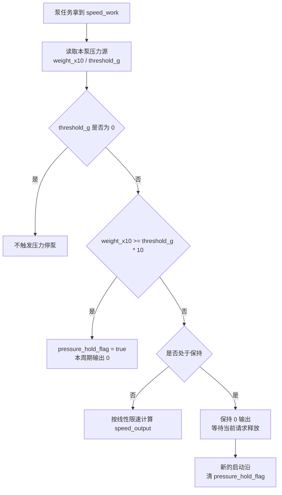

关键点：

1. `pressure_hold_flag=true` 时实际输出为 0。
2. 压力自然下降不会清除 `pressure_hold_flag`。
3. `speed_work` 保留用户设定，便于下一次启动沿恢复原设定。
4. 必须先让当前请求变为无效，再由下一次启动沿清锁止。
5. 如果 `pressure_threshold=0`，压力停泵逻辑不触发。

### 9.4.1 压力闭环源码依据

压力闭环总开关：

```c
#define PUMP_PRESSURE_CONTROL_ENABLE 1U
```

停泵判断：

```c
uint8_t PumpPressureControl_IsPressureStopReached(uint16_t target_speed,
                                                  uint32_t weight_x10,
                                                  uint16_t threshold_g)
{
    if (target_speed == 0U)
        return 0U;

    if (threshold_g == 0U)
        return 0U;

    stop_x10 = (uint32_t)threshold_g * 10U;
    return (weight_x10 >= stop_x10) ? 1U : 0U;
}
```

恢复判断：

```c
uint8_t PumpPressureControl_IsPressureRecoverReached(uint16_t target_speed,
                                                     uint32_t weight_x10,
                                                     uint16_t threshold_g)
{
    if (target_speed == 0U)
        return 1U;

    if (threshold_g == 0U)
        return 0U;

    recover_x10 = (uint32_t)threshold_g * 10U;
    return (weight_x10 < recover_x10) ? 1U : 0U;
}
```

线性限速：

```c
uint16_t PumpPressureControl_Apply(uint16_t target_speed,
                                   uint32_t weight_x10,
                                   uint16_t threshold_g)
{
    if (target_speed == 0U)
        return 0U;

    if (threshold_g == 0U)
        return target_speed;

    reduce_x10 = BuildReduceThresholdBySpeed(target_speed) * 10;
    stop_x10 = threshold_g * 10;

    if (weight_x10 >= stop_x10)
        return 0U;

    if (weight_x10 <= reduce_x10)
        return target_speed;

    return target_speed * (stop_x10 - weight_x10) /
           (stop_x10 - reduce_x10);
}
```

这段限速函数的输出不是“泵目标速度”，而是“安全层允许的实际输出速度”：

| 条件 | 返回值 | 解释 |
| --- | --- | --- |
| `target_speed == 0` | 0 | 用户或业务本来就没要求泵运行 |
| `threshold_g == 0` | `target_speed` | 阈值为 0 时不启用压力保护 |
| `weight_x10 >= stop_x10` | 0 | 达到停泵点，本周期输出 0 |
| `weight_x10 <= reduce_x10` | `target_speed` | 压力还低，不限速 |
| 中间区间 | 线性插值结果 | 压力越接近停泵点，输出越低 |

调试压力误停时，应同时记录 `target_speed`、`threshold_g`、`reduce_x10`、`stop_x10`、`weight_x10` 和返回值。只看 `pumpMessage.speed_work` 不够，因为最终 UART 使用的是闭环后的输出。

压力触发时 A/B 泵任务会设置保持标志：

```c
if (PumpPressureControl_IsPressureStopReached(pump_speed, weight_x10, threshold_g) != 0U)
{
    pumpMessageA.pressure_hold_flag = true;
    pumpMessageA.pressure_recover_ms = 0U;
    Pubinterface_HandleInjectionPumpPressureBlocked(CHANNEL_A);
    return 0U;
}
```

这里最容易误解的是：`speed_work` 保留，但 `pressure_hold_flag` 会持续拦截实际输出。压力下降不会自动复转；当前控制源释放后，再次启动形成新的请求沿，才会清除锁止并重新使用原设定速度。

### 9.4.2 压力误停和不恢复的定位

| 现象 | 先看变量 | 正常解释 | 异常方向 |
| --- | --- | --- | --- |
| 泵一启动就停 | `pressure_threshold`、`weight_x10` | 重量已超过阈值 | 压力零点、阈值、设备码或单位错误 |
| 压力阈值 0 时不停 | `threshold_g == 0` | 当前代码故意不触发停泵 | 压力板未给有效阈值 |
| 高压后 `run_flag` 变 false | `pressure_hold_flag` | 正常，压力处理会撤销对应泵运行/排空请求 | 如果仍为 true，查停泵状态清理是否执行 |
| 压力降了仍不恢复 | `pressure_hold_flag` | 当前设计要求保持锁止 | 释放控制源后重新启动，确认新启动沿清锁止 |
| A/B 解锁行为不同 | 两路均为25ms | 两路都应按新启动沿解除 | 查对应通道请求沿和 `last_request_active` |
| 屏幕显示运行但泵不转 | `speed_output` | 压力保持时输出为 0 | UI 显示设定值和实际输出值区分不清 |

调试泵不转：

| 断点 | 正常应该看到 |
| --- | --- |
| `SendPumpAMessage()` / `SendPumpBMessage()` | 目标速度入队 |
| `PUMPAehaviors()` / `PUMPBehaviors()` | `run_flag` 为 true |
| `PumpBehavior_ApplyPressure()` | 没被压力锁止压停 |
| `PumpPressureControl_Apply()` | 输出非 0 |
| `Pump_SetSpeedS_A()` / `Pump_SetSpeedS_B()` | 正确方向和 UART 数据 |
| `Uart5_SendPacket()` / `Uart7_SendPacket()` | 实际发出 |

## 10. 外控协议和心跳原理

外控协议固定帧头 `D7 CA F8 F1`，帧尾 `BF C6 BC C4`。多字节字段按大端处理。解析入口是 `ExternalCommProtocol_Parse()`，任务入口是 `ExternalCommTaskFunc()`。

外控的设计重点：

1. 未授权时不能控制电机和泵。
2. 外控授权会进入统一控制权仲裁。
3. 设置速度和启动动作分离：写泵速度不等于启动泵。
4. 外控链路静默分两级处理，避免短暂串口抖动直接释放授权。
5. 心跳不只是在线包，还上传当前通道、运行状态、报警、泵、压力和刀具扩展。

外控启动电机失败时，按这条链查：

| 条件 | 正常值 |
| --- | --- |
| UART2 是否收到帧 | `Uart2_DMARecvDataPeek()` 有长度 |
| 帧解析 | `ExternalCommProtocol_Parse()` 返回成功 |
| 授权 | `ExternalComm_ApplyExternalAuth()` 成功 |
| 控制权 | `ControlArbitration_EnterExternalControl()` 成功 |
| 当前通道 | `WorkMessage.channel_work` 为 A 或 B |
| 手柄在线 | 当前通道 online，`hand_model` 非 0 |
| 报警 | `alarm_flag=false` |
| 公共接头刀具 | 已有 RFID/EPC 刀具信息 |
| 启动结果 | `WorkMessage.runflag_work=true` |

### 10.1 外控协议帧源码依据

外控协议固定帧头、帧尾：

```c
static const uint8_t s_external_comm_head[4] =
{
  0xD7U, 0xCAU, 0xF8U, 0xF1U
};

static const uint8_t s_external_comm_tail[4] =
{
  0xBFU, 0xC6U, 0xBCU, 0xC4U
};
```

这两个数组是外控协议最外层的同步标记。主控在接收 FIFO 中靠帧头找起点，靠帧尾确认一帧结束。调试半包、粘包、错包时，先不要看业务命令，先确认原始数据里是否存在完整的 `D7 CA F8 F1 ... BF C6 BC C4`。

帧格式：

| 字段 | 长度 | 说明 |
| --- | --- | --- |
| Head | 4 | `D7 CA F8 F1` |
| TranCode | 1 | 下行或上传方向 |
| Length | 2 | 整帧长度，大端 |
| FunCode | 1 | 功能码 |
| AreaCode | 1 | 区域码 |
| InforCode | 1 | 信息码 |
| InforArea | N | 业务载荷 |
| CRC16 | 2 | 大端，覆盖 `TranCode..InforArea` |
| Tail | 4 | `BF C6 BC C4` |

协议解析核心逻辑：

```c
ExternalCommParseResult_t ExternalCommProtocol_Parse(const uint8_t *data,
                                                     uint16_t data_len,
                                                     ExternalCommFrame_t *frame)
{
    for (start = 0U; start <= (data_len - 4U); ++start)
    {
        if (ExternalComm_MatchBytes(&data[start], head, 4U) == 0U)
        {
            continue;
        }

        frame_len = ExternalComm_ReadBE16(&frame_buf[5]);
        if ((data_len - start) < frame_len)
        {
            return EXTERNAL_COMM_PARSE_INCOMPLETE;
        }

        if (ExternalComm_MatchBytes(&frame_buf[frame_len - 4U], tail, 4U) == 0U)
        {
            return EXTERNAL_COMM_PARSE_BAD_TAIL;
        }

        calc_crc = Common_Crc16((uint8_t *)&frame_buf[4], (uint16_t)(6U + info_len));
        recv_crc = ExternalComm_ReadBE16(&frame_buf[crc_pos]);
        if (calc_crc != recv_crc)
        {
            return EXTERNAL_COMM_PARSE_BAD_CRC;
        }

        return EXTERNAL_COMM_PARSE_OK;
    }
}
```

这段解析逻辑按“找头、等长度、验尾、验 CRC、输出 frame”执行：

| 步骤 | 代码动作 | 调试含义 |
| --- | --- | --- |
| 找帧头 | 遍历 `data[start]`，匹配 head | 前面有噪声时可以跳过，不应整包丢弃 |
| 读长度 | `frame_len = ExternalComm_ReadBE16(&frame_buf[5])` | `Length` 是整帧长度，写错会导致等待或越界拒绝 |
| 半包判断 | `(data_len - start) < frame_len` | 上位机分段发送时应返回 incomplete，而不是错误 |
| 帧尾判断 | 匹配 `frame_len - 4` 位置 | 长度字段错时通常先表现为坏尾 |
| CRC 判断 | 覆盖 `TranCode..InforArea` | CRC 不覆盖帧头帧尾，大小端要按大端读 |
| 返回 OK | 填充 `ExternalCommFrame_t` | 只有这里之后业务函数才会执行 |

如果 `ExternalComm_ApplyControlCommand()` 没进，不能直接说命令码错。先在这段解析里看返回结果：`INCOMPLETE` 是半包，`BAD_TAIL` 多数是长度错，`BAD_CRC` 是 CRC 或覆盖范围错。

调试外控收不到命令：

| 断点 | 正常值 | 异常说明 |
| --- | --- | --- |
| `Uart2_DMARecvDataPeek()` | 有字节进入 | 上位机串口、线束、波特率或 DMA 异常 |
| FIFO 写入函数 | 半包能被缓存 | 未进入软件 FIFO，粘包/半包会丢 |
| `ExternalCommProtocol_Parse()` | 返回 OK | 帧头、Length、帧尾或 CRC 错 |
| `frame.tran_code` | 下行码 | 上位机发错方向 |
| `frame.fun_code` | 0xFA/0x01/0x02/0x03/0x04 等 | 功能码不在支持范围 |
| `ExternalComm_SendAck()` | 返回应答 | 命令被拒绝时看失败原因 |

### 10.2 外控任务、授权和超时

外控任务周期、心跳和超时以源码宏为准：

```c
#define EXTERNAL_COMM_TASK_PERIOD_MS        10U
#define EXTERNAL_COMM_HEARTBEAT_PERIOD_MS   100U
#define EXTERNAL_COMM_LINK_STOP_OUTPUT_TIMEOUT_MS 2000U
#define EXTERNAL_COMM_LINK_RELEASE_TIMEOUT_MS     10000U
```

外控命令分类：

| FunCode | 宏 | 作用 |
| --- | --- | --- |
| `0xFA` | `EXTERNAL_COMM_DOWN_PERMISSION` | 权限或授权 |
| `0x01` | `EXTERNAL_COMM_DOWN_APPLY_CONTROL` | 申请外部控制 |
| `0x02` | `EXTERNAL_COMM_DOWN_SET_VALUE` | 设置速度、频率、泵速度 |
| `0x03` | `EXTERNAL_COMM_DOWN_SWITCH_VALUE` | 切通道、方向、控制模式、工具类型 |
| `0x04` | `EXTERNAL_COMM_DOWN_CONTROL_CMD` | 启停电机、启停泵、开口定位、急停 |
| `0x05/0x07` | EEPROM 单页读写 | 当前通道 I2C2/I2C3 |
| `0xBB` | `EXTERNAL_COMM_DOWN_HOST_EXIT` | 上位机主动退出外控 |

授权函数当前只要求 8 字节码长度：

```c
static uint8_t ExternalComm_IsAuthorizedCode(const uint8_t *code, uint16_t code_len)
{
    (void)code;
    return (code_len == 8U) ? 1U : 0U;
}
```

这段代码当前只校验授权码长度，没有校验授权码内容。它的工程含义是：当前阶段外控授权门槛主要用于区分“是否按授权流程进入”，不是做强加密认证。

因此，“授权失败”优先查帧长度和 `InforArea` 长度，不要先怀疑固定注册码内容。反过来，如果后续要做真正授权码校验，就必须同步更新上位机说明、测试样例和失败原因码。

外控静默分两级：

```text
收到合法外控帧
-> ExternalComm_ResetLinkWatchdog()
-> 计时清零

静默达到 2000ms
-> 停电机和泵输出
-> 保留外控授权和小电脑状态

静默达到 10000ms
-> ControlArbitration_ReleaseExternalControl()
-> 释放外控 owner
-> 熄灭外控在线显示
```

调试外控授权成功但不能启动电机时：

| 变量或函数 | 正常值 | 异常说明 |
| --- | --- | --- |
| `ControlArbitration_EnterExternalControl()` | true | 本地电机仍忙、外控未取得 owner |
| `WorkMessage.hmiactive_work` | 1 | 外控状态未置位 |
| `ControlSignalMessage.HMI_enable_flag` | true | 外控使能未置位 |
| `WorkMessage.channel_work` | A 或 B | 无当前工作通道 |
| `WorkMessage.hand_model` | 非 0 | 当前通道未装载手柄 |
| `WorkMessage.alarm_flag` | false | 真实报警阻止启动 |
| `ExternalComm_ApplyControlCommand()` | 进入启动分支 | 命令 AreaCode 或长度不匹配 |
| `WorkMessage.runflag_work` | true | 命令只设置参数，没有启动 |

### 10.3 心跳不是简单在线包

心跳 100ms 上传一次，载荷会组合整机状态：

| 心跳字段来源 | 变量 |
| --- | --- |
| 当前通道 | `WorkMessage.channel_work` |
| A/B 在线 | `WorkMessage.Channel_Aonline/Channel_Bonline` |
| 当前运行状态 | `WorkMessage.runflag_work` |
| 当前方向 | `WorkMessage.dir_work` |
| 速度和频率 | `speed_set_work/speed_work/freq_work` |
| 报警 | `WorkMessage.alarm_flag/alarm_value` |
| 驱动反馈 | `driver_speed_feedback/driver_current_x100` |
| A/B 泵类型和运行 | `pumpMessageA/B.type/run_flag/speed_output` |
| 压力 | `pressure_value/weight_x10/pressure_threshold/seq` |
| 刀具扩展 | EEPROM/RFID 识别缓存和规格 |

若上位机显示和屏幕不一致，不要只查上位机页面。先确认心跳字段是否已经从 `WorkMessage`、`MemoryMsgA/B`、`pumpMessageA/B` 取到最新值，再判断是主控没上传还是上位机没解析。

## 11. UI、蜂鸣和 LED 原理

UI 刷新不是每个模块直接发屏幕帧，而是多数路径先发 `SendUIDSMessage()`，由 `UIDisplayTask()` 统一消费。底层显示通过 `LCD_Show_Picture()`、`LCD_Show_4byte_Number()` 等走 UART6。

这样做是为了：

1. 降低多个模块同时刷屏造成的串口拥堵。
2. 让 UI 看到统一状态。
3. 让泵、手柄、报警、触控弹窗可以按区域刷新。

蜂鸣分两类：

| 类型 | 入口 | 特点 |
| --- | --- | --- |
| 按键音 | `SendKeyMessage()` 等 | 没有报警时响 |
| 报警音 | `SendAlarmMessage()`、`SendAlarmMessageTimed()` | 可持续或限时 |

Page4 速度/频率阈值蜂鸣只提示，不写真实报警，不阻塞调速。运行中另一路坏手柄也可能触发限时提示，不一定写 `WorkMessage.alarm_value`。

### 11.1 UI 消息队列源码依据

UI 不是每个模块直接刷屏，而是投递区域消息：

```c
typedef struct
{
    uint8_t areaId;
    bool enable_flag;
    uint8_t Value[10];
} UIDPMessage_t;

QueueHandle_t UIDPMsgQueue = NULL;
```

这段结构体说明 UI 刷新是“区域消息”，不是直接把某个变量写屏幕：

| 字段 | 作用 | 调试含义 |
| --- | --- | --- |
| `areaId` | 指定刷新哪个 UI 区域 | 图标错位或不刷新先看 areaId |
| `enable_flag` | 常用于显示/隐藏或开关状态 | 图标不消失时看它是否为 false |
| `Value[10]` | 区域参数，固定 10 字节 | 参数显示错时看值是否按区域协议填充 |
| `UIDPMsgQueue` | UI 任务队列 | 为 NULL 表示 UI 任务未初始化 |

投递函数：

```c
void SendUIDSMessage(uint8_t areaId, bool enable_flag, uint8_t *Value)
{
    if (UIDPMsgQueue == NULL)
        return;

    UIDPMessage_t msg;
    msg.areaId = areaId;
    msg.enable_flag = enable_flag;

    if (Value != NULL)
        memcpy(msg.Value, Value, 10);
    else
        memset(msg.Value, 0, sizeof(msg.Value));

    if (same_as_last_message)
        return;

    Kernel_QueueSend(UIDPMsgQueue, &msg, 10);
}
```

这段代码说明：

1. UI 消息最多带 10 字节参数。
2. 空参数会补零，避免显示任务读到旧参数。
3. 同一区域、同一开关、同一参数会被过滤，减少屏幕串口压力。
4. 队列满时，只有成功投递的消息才更新去重缓存，避免有效刷新被永久吞掉。

还要注意去重逻辑的副作用：如果上层反复投递完全相同的区域和值，UI 任务不会重复刷屏。这是为了降低 UART6 压力。调试“我明明调用了刷新但屏幕没闪动”时，要确认新消息是否和上一条完全一样；如果一样，被过滤是设计行为。

调试屏幕不刷新：

| 断点 | 正常值 | 异常说明 |
| --- | --- | --- |
| `SendUIDSMessage()` | areaId 正确 | 上层没有投递刷新 |
| `UIDPMsgQueue` | 非 NULL | UI 任务未初始化 |
| 去重判断 | 新参数不应被过滤 | 参数和上次完全相同 |
| `Kernel_QueueSend()` | pdPASS | 队列满或调度未运行 |
| `UIDisplayTask()` | 消费消息 | UI 任务卡住 |
| `LCD_Show_*()` | 走 UART6 | 底层屏幕通信异常 |

### 11.2 泵显示和实际输出的区别

泵显示档位由 `UIDP_PumpGearFromValue()` 计算，不等于 UART 输出速度：

```c
static uint8_t UIDP_PumpGearFromValue(uint8_t pump_type, uint16_t value)
{
    if (pump_type == INJECTWATER)
    {
        if (value <= 5U) gear_value = 1U;
        else if (value <= 10U) gear_value = 2U;
        ...
    }
    else if (pump_type == DRAWWATER)
    {
        if (value == 8U) gear_value = 7U;
        else if (value == 10U) gear_value = 8U;
        ...
    }
    else if (pump_type == POURWATER)
    {
        if (value <= 30U) gear_value = 1U;
        else if (value <= 60U) gear_value = 2U;
        ...
    }
}
```

这段函数只把业务速度换算成屏幕档位，不参与泵实际输出。它解释的是“显示几档”，不是“驱动板收到多少速度”。

举例：注水泵 `value <= 5` 显示 1 档，`value <= 10` 显示 2 档，但最终 UART 输出还会经过注水泵公式、上限钳位和压力闭环。因此现场看到“显示 2 档但出水量不对”，应继续查 `pumpMessage.speed_output` 和 UART5/UART7，而不是只改这个显示函数。

因此，查“泵显示几档但实际流量不对”时要分开：

| 层级 | 看什么 |
| --- | --- |
| 设定值 | `pumpMessageA/B.speed_work` |
| 压力修正后实际业务速度 | `pumpMessageA/B.speed_output` |
| UI 档位 | `UIDP_PumpGearFromValue()` 结果 |
| UART 输出值 | `uart_data` |
| 步进板实际速度 | 步进驱动板解析结果 |

### 11.3 蜂鸣消息队列源码依据

蜂鸣任务 100ms 周期运行，消息分三类：

```c
typedef struct {
    uint8_t msgType;
    uint8_t keyBeepTime;
    uint8_t alarmFlag;
    uint16_t alarmHoldTicks;
} BeepMessage_t;
```

蜂鸣消息结构体只描述声音请求，不等于整机真实报警状态：

| 字段 | 作用 |
| --- | --- |
| `msgType` | 区分按键音、持续报警、限时报警 |
| `keyBeepTime` | 按键音持续周期 |
| `alarmFlag` | 蜂鸣报警类型 |
| `alarmHoldTicks` | 限时报警剩余周期 |

是否禁止电机运行，主要看 `WorkMessage.alarm_flag` 和报警来源，而不是单独看蜂鸣队列。Page4 速度阈值蜂鸣、运行中另一路坏手柄限时提示，都可能只响蜂鸣，不把整机置为真实报警。

普通按键音：

```c
void SendKeyBeepMessage(uint8_t time)
{
    msg.msgType = BEEP_MSG_KEY;
    msg.keyBeepTime = time;
    msg.alarmFlag = 0;
    msg.alarmHoldTicks = 0U;
    Kernel_QueueSend(BeepMsgQueue, &msg, 0);
}
```

持续报警：

```c
void SendAlarmMessage(uint8_t flag)
{
    msg.msgType = BEEP_MSG_ALARM;
    msg.alarmFlag = flag;
    msg.alarmHoldTicks = 0U;
    Kernel_QueueSend(BeepMsgQueue, &msg, 0);
}
```

限时报警：

```c
void SendAlarmMessageTimed(uint8_t flag, uint16_t duration_ms)
{
    msg.msgType = BEEP_MSG_ALARM_TIMED;
    msg.alarmFlag = flag;
    msg.alarmHoldTicks = (duration_ms + 99U) / 100U;
    Kernel_QueueSend(BeepMsgQueue, &msg, 0);
}
```

蜂鸣优先级：

| 状态 | 行为 |
| --- | --- |
| 只有按键音 | `BEEP_ON()` 持续指定周期 |
| 有报警 | 报警翻转蜂鸣覆盖按键音 |
| 限时报警 | 到期后自动 `BEEP_OFF()`，不改 `WorkMessage` |
| 无消息 | 蜂鸣关闭 |

排查蜂鸣异常：

| 现象 | 先看 |
| --- | --- |
| 按键不响 | `SendKeyBeepMessage()` 是否入队 |
| 报警不响 | `SendAlarmMessage()` 是否收到非 0 报警码 |
| 报警一直响 | 是否没有发送 `SendAlarmMessage(0)` 或真实报警未清 |
| 限时报警影响真实报警 | 是否错误使用限时报警代替 `WorkAlarm_Set()` |

### 11.4 LED 状态

LED 任务只适合作为“系统任务仍在运行”的辅助信号。调试关键业务时不能只看 LED：

1. LED 正常闪烁，只能说明调度器和 LED 任务还活着。
2. LED 正常不代表 UART、I2C、手柄、泵、压力都正常。
3. LED 异常时先查 `LEDTaskInit()`、`SysRunLed` 任务周期和板级 GPIO。
4. 如果 LED 停了，同时屏幕、外控、泵任务都停，优先查 FreeRTOS 调度、互斥锁长时间占用或硬故障。

## 12. 跨工程协议风险

跨工程协议调试要先分清“主控负责什么、下位板负责什么”。主控负责状态仲裁和命令生成；驱动板负责电机或步进输出；压力板负责采样、标定和周期上报；上位机负责外部命令和 EEPROM 维护。任意一侧单独改字段、CRC、设备码或超时，都可能让链路表面在线但动作不对。

### 12.1 主控和无刷/有刷驱动板源码对照

主控电机输出入口是 `MOTORRUN()`，下发函数是 `MotorStart()`/`MotorStops()`。当前主控通过 UART1 发送 11 字节私有帧：

```text
AA MODE FREQ MOTOR_TYPE SPEED_H SPEED_L RUN_TYPE CUR_H CUR_L BB AA
```

关键含义：

| 字段 | 主控来源 | 驱动侧解释风险 |
| --- | --- | --- |
| `MODE` | `WorkMessage.run_mode_work` | 普通运行、往复、定位等模式必须双方一致 |
| `FREQ` | `WorkMessage.frequency_work` | 驱动侧可能再做倍率处理，不能重复放大 |
| `MOTOR_TYPE` | 手柄/刀具识别结果 | 有刷、无刷、Hall、无 Hall分支要实机验证 |
| `SPEED_H/L` | `speed_set_work / 10` 后组帧 | 主控按 10rpm 单位发，驱动再乘 10 恢复 |
| `RUN_TYPE` | 手柄类型、刀具类型、方向组合 | 开口定位和普通正反转不是同一控制含义 |
| `CUR_H/L` | 电流/阈值类字段 | 驱动报警阈值映射要和主控报警显示一致 |
| `BB AA` | 当前主控帧尾 | 驱动侧历史上把 `RxCRC == 0xAABB` 作为兼容旁路 |

驱动板 `UserCode\mcuart.c` 的接收逻辑会解析 `seruart->R_DATA`。历史驱动工程支持两种通过条件：真实 CRC 正确，或接收到 `0xAABB` 兼容尾。当前主控下发没有携带普通 CRC，所以如果驱动侧删除 `0xAABB` 旁路，主控电机命令会被驱动拒绝。

驱动回包是 12 字节，包含当前模式、频率、类型、速度、运行状态、错误码和电流。主控在 `BrushlessMotorUartData_ReceiveData()` 中用回包更新：

| 主控变量 | 作用 |
| --- | --- |
| `driver_speed_feedback` | 判断电机是否真正转动或停稳 |
| `driver_current_x100` | 显示和报警辅助 |
| `driver_error_code` | 映射电机驱动板报警 |
| `WorkMessage.alarm_flag` | 驱动错误可提升为整机报警 |

驱动侧停止不是“收到 0 速度立即关 PWM”这么简单。无刷分支可能先进入刹车状态，设置 `Brake_Sign`、`Brake_Kind`，再由后续状态机判断刹车完成；有刷分支也会走 `BreakSta` 和 Buck/PWM 递减。调试“主控已发停止但电机还转”时，不能只在主控看 `runflag_work=false`，还要到驱动侧确认刹车状态机是否走完。

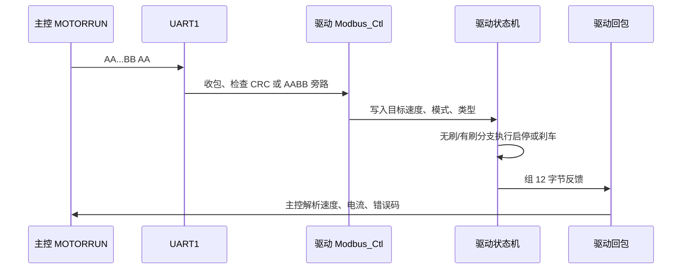

联合断点建议：

| 位置 | 正常值 | 异常说明 |
| --- | --- | --- |
| 主控 `MOTORRUN()` | 根据 `runflag_work` 进入启动或停止分支 | 输入侧没有真正改当前工作状态 |
| 主控 `MotorStart()` | 11 字节帧字段与当前 `WorkMessage` 一致 | 模式、速度、方向或类型转换错 |
| 主控 `MotorStops()` | 停止帧周期发送 | 停止命令只清状态但未持续输出 |
| 驱动 `Modbus_Ctl()` | `RxEnd=1`，帧头正确，CRC 或 `0xAABB` 通过 | 串口参数、帧长、旁路或 CRC 不匹配 |
| 驱动 `App.Logic.Set_Spd` | 启动时非 0，停止时 0 | 主控速度单位或字段位置错 |
| 驱动 `YSorWSFlag` | 与当前手柄类型一致 | 有刷/无刷分支选错 |
| 驱动 `Brake_Sign`/`Brake_Kind` | 停止时进入刹车，最终退出 | 刹车参数异常导致停不下来 |
| 驱动 `App.FB.Err`/`App2.Err` | 0 或可解释错误码 | 驱动保护触发，主控只看到不转 |

### 12.2 主控和步进/泵驱动板源码对照

主控泵输出入口是 `PUMPAehaviors()` 和 `PUMPBehaviors()`，最后通过 UART5/UART7 发送 6 字节帧：

```text
AA DIR SPEED_H SPEED_L BB AA
```

步进/泵板 `USER\logic.c` 接收 UART3 数据。它同样支持 `BB AA` 作为 CRC 旁路，也支持正常 CRC。方向字段当前按下面方式解释：

| 主控字段 | 步进板解释 |
| --- | --- |
| `DIR = 0` | 正速度，`App.Log.Set_Speed = speed` |
| `DIR = 1` | 负速度，`App.Log.Set_Speed = -speed` |
| `SPEED = 0` | 停止并清部分错误计数 |

步进板是否真的启动，还要看 `Ctl_Logic()` 的条件：电压允许、速度大于允许启动阈值、无错误。主控看到自己发了速度，不代表步进板一定启动 PWM。

| 步进板变量 | 正常含义 |
| --- | --- |
| `SerUart3.RxEnd` | 一帧 UART3 DMA 接收完成 |
| `SerUart3.RxLen` | 本次收到的长度 |
| `SerUart3.R_DATA[0..5]` | 主控 6 字节命令 |
| `App.Log.Set_Speed` | 步进板目标速度，带方向符号 |
| `MCPara[6]` | 最终方向参数 |
| `App.Start` | 是否允许启动输出 |
| `App.Status` | 步进状态机阶段 |
| `App.Err` | 步进板错误码 |

泵类型不由步进板识别。主控根据压力模块设备码、手柄默认、业务默认决定泵类型，并把类型转换成速度或显示策略。步进板只认方向和速度，所以“泵类型显示错”不应该先改步进板。

联合调试最小路径：

```text
主控 pumpMessageA/B.run_flag = true
-> 主控压力闭环计算 speed_output
-> 主控 Pump_SetSpeedS_A/B() 发 AA DIR SPEED BB AA
-> 步进板 UartDealResponse() 解析 DIR/SPEED
-> 步进板 Ctl_Logic() 判断电压、错误和速度阈值
-> 步进板 Motor_Ctl() 开 PWM 或保持停止
```

### 12.3 主控和压力传感器源码对照

压力板周期上报帧由压力工程 `protocol.c` 生成，主控软串口按 9600 8N1 接收。当前帧格式为：

```text
AA 55 02 01 0C Seq RawCs1237(4) WeightX10(4) ThresholdG(2) DeviceCode CRC16(2) 55 AA
```

字段影响如下：

| 字段 | 主控用途 |
| --- | --- |
| `Seq` | 判断压力帧是否持续更新 |
| `RawCs1237` | 原始 ADC 值，主要用于底层诊断 |
| `WeightX10` | 压力闭环计算，单位 0.1g |
| `ThresholdG` | 停泵阈值，单位 g |
| `DeviceCode` | 判断泵类型和在线状态 |
| `CRC16` | 帧有效性判断，MODBUS 小端 |

风险点在设备码：压力工程历史资料中合法设备码集合和主控白名单可能不完全一致。设备码不被主控认可时，主控可能能收到帧但不更新在线状态，表现为“压力板发包正常，主控泵类型或在线不对”。

主控侧已改为双接收器：PE4/TIM11 与 PE6/TIM13 分别维护接收阶段、位序号和临时字节。双压力板同相上报时两路 `seq` 都应持续递增；若单路停滞，应定位该路 EXTI、定时器或线束。

联合断点建议：

| 位置 | 正常值 | 异常说明 |
| --- | --- | --- |
| 压力板 `CS1237UartProtocol_BuildReportFrame()` | 21 字节帧字段正确 | 压力板上报格式或设备码错误 |
| 主控 `HAL_GPIO_EXTI_Callback()` | PE4/PE6 起始位进入 | 压力线、GPIO、EXTI 配置异常 |
| 主控 `SimUart_HandleExti()` | 对应通道 `rx_stage` 进入 START | 对应 EXTI 未触发或 A/B 线接反 |
| 主控 `Cs1237_FrameValid()` | 帧头、尾、CRC 通过 | 波特率、采样点、CRC 或帧格式不一致 |
| 主控 `Cs1237_UpdatePumpMessage()` | `pumpMessageA/B.seq` 递增 | 设备码不被接受或通道映射错 |
| 主控压力闭环 | `weight_x10`、`threshold_g` 合理 | 标定或阈值写入异常 |

### 12.4 主控和外部通信上位机源码对照

外控上位机发送的帧头和帧尾为：

```text
帧头：D7 CA F8 F1
帧尾：BF C6 BC C4
```

中间字段包含 `TranCode`、`Length`、`FunCode`、`AreaCode`、`InforCode` 和 `InforArea`，CRC 覆盖中间业务字段，不覆盖帧头、帧尾和 CRC 自身。主控 UART2 接收后会进入 FIFO，支持半包、粘包和错帧重同步。

外控安全策略必须由上位机和主控共同遵守：

1. 授权成功只代表外控可以申请控制权，不代表电机必然能启动。
2. 设置速度、方向、泵速只是写运行状态或通道记忆，不等于启动。
3. 启动电机还要满足当前通道在线、手柄有效、无报警、公共接头刀具就绪、控制权可进入。
4. 链路短超时会停输出，保留授权；链路长超时会释放外控。
5. 心跳中的手柄、泵、压力字段来自主控公共状态，不是上位机本地推算。
6. EEPROM 写页会修改当前选中通道手柄数据，上位机必须提示风险并在写后引导重新识别。

上位机工具中有两个行为要和主控设计配合：

| 上位机行为 | 主控侧对应 |
| --- | --- |
| EEPROM 写入二次确认 | 防止误写当前通道手柄 EEPROM |
| 写页间隔约 80ms | 避免连续 I2C 写页和上位机帧过密 |
| 串口错误连续计数 | 避免一次临时错误就清本地授权状态 |
| 心跳样本脚本校验 | 验证动态长度、CRC、泵/手柄扩展字段 |

外控联合断点：

| 位置 | 正常值 | 异常说明 |
| --- | --- | --- |
| 上位机 `buildFrame()` | 长度、CRC、帧尾正确 | 主控解析不到完整帧 |
| 主控 `ExternalComm_ProtocolParse()` | 半包、粘包能恢复同步 | FIFO 残留或长度字段不一致 |
| 主控 `ExternalComm_ApplyExternalAuth()` | 授权码长度和值正确 | 授权失败但链路仍在线 |
| 主控 `ControlArbitration_EnterExternalControl()` | owner 进入外控 | 本地脚踏/手柄/屏幕正在占用 |
| 主控 `ExternalComm_ApplyControlCommand()` | AreaCode 命中启动、停止或急停 | 命令码和区域码不匹配 |
| 主控 `ExternalComm_SendHeartbeat()` | 心跳字段随在线状态动态变化 | 上位机按固定长度解析会错位 |

### 12.5 跨工程协议变更规则

协议改动必须按成套验证处理，不能只看一个工程编译通过：

| 改动内容 | 必须同步确认 |
| --- | --- |
| 电机帧尾或 CRC | 主控 `MotorStart()`、驱动 `Modbus_Ctl()`、驱动回包解析 |
| 电机类型或模式编码 | 手柄识别、主控组帧、驱动有刷/无刷分支、UI 显示 |
| 泵方向字段 | 主控 UART5/UART7 输出、步进板 `DIR` 解释、实物流向 |
| 泵速度单位 | 主控流量换算、步进板速度解释、压力闭环输出 |
| 压力设备码 | 压力板霍尔编码、主控白名单、泵类型显示、外控心跳 |
| 压力帧长度或 CRC | 压力板 `BuildReportFrame()`、主控 `Cs1237_FrameValid()`、软串口采样 |
| 外控心跳字段 | 主控动态心跳、上位机解析、样本校验脚本 |
| EEPROM 页映射 | 主控外控映射、上位机页面名称、认证工具 Page1 更新 |

实机联调记录建议固定写这几项：

```text
主控固件版本：
驱动板固件版本：
步进/泵板固件版本：
压力板固件版本：
上位机版本：
本次改动字段：
主控发出的原始帧：
下位板收到的原始帧：
下位板回包原始帧：
主控公共状态快照：
结论：
```

## 13. 临时配置修改速查

| 要改什么 | 文件 | 当前值或入口 | 改完验证 |
| --- | --- | --- | --- |
| 业务初始化顺序 | `User\Application\Src\userparser.c` | `Userparser_Init()` | 上电、屏幕、串口、任务是否正常 |
| 软任务周期 | 各 `Kernel_TaskStart()` 调用 | 见第 4 章任务表 | 任务周期和互斥阻塞 |
| A/B 泵物理互换 | `User\Application\include\pump.h` | `PUMP_LOGICAL_AB_PHYSICAL_SWAP_ENABLE=0` | A/B 物理口、屏幕、外控、压力源 |
| 注水泵速度上限 | `pump.h` | `PUMP_INJECTWATER_SPEED_MAX=70` | 屏幕、脚踏、外控注水都测 |
| 压力闭环总开关 | `pump_pressure_control.h` | `PUMP_PRESSURE_CONTROL_ENABLE=1` | 压力硬停和恢复 |
| 压力锁止解除 | `pump_behavior_core.c` | 仅新启动沿解除 | 高压停泵后防止压力下降自动复转 |
| 压力设备码 | `soft_uart.c` | `0x00/0x08/0x09` | 压力板 device code 实测 |
| 外控心跳周期 | `external_comm_task.c` | 100ms | 上位机刷新 |
| 外控停输出超时 | `external_comm_task.c` | 2000ms | 静默 2s 停输出 |
| 外控释放超时 | `external_comm_task.c` | 10000ms | 静默 10s 释放授权 |
| 屏幕 VP 地址 | `screen_address.h` | `UIDP_LCD_VP_*` | 屏幕实物显示 |
| 屏幕泵显示镜像 | `screen_address.h` | `UIDP_PUMP_DISPLAY_AB_MIRROR_SWAP_ENABLE=0` | 显示和触摸映射 |
| 手柄 EEPROM 页解析 | `handlescan.c` | Page2/Page3/Page4/Page6 | 插拔、切通道、默认参数 |
| 构建源文件清单 | EIDE/Keil 四处 | 见第 15 章 | EIDE 构建和旧模块检查 |

### 13.1 参数生效层级和临时配置边界

临时修改前先判断要改的是哪一种配置：

| 配置层级 | 典型入口 | 是否需要重新编译 | 是否掉电保存 | 常见误区 |
| --- | --- | --- | --- | --- |
| 运行态 | 屏幕、脚踏、手柄按键、外控设置命令 | 否 | 否 | 以为设置速度会写入 EEPROM |
| 手柄持久化 | 外控 EEPROM 写 Page4/Page6 | 否 | 是 | 写完不重新识别就期待当前 `WorkMessage` 变化 |
| 固件常量 | `.h` 宏、`.c` 白名单、任务周期 | 是 | 随固件保存 | 只改源码但没有检查 EIDE 实际构建清单 |

优先选择顺序：

1. 只为现场验证某个动作，优先用屏幕或外控运行态设置。
2. 要让某个手柄下次插入自动带默认值，改该手柄 EEPROM 对应页。
3. 要改变整机规则，例如压力白名单、外控超时、泵物理口互换，才改固件源码。
4. 改固件源码后必须确认 EIDE 和 Keil 清单里没有旧模块回编译。

### 13.2 EEPROM 默认参数临时修改

常见手柄默认参数改 Page4 和 Page6：

| 目标 | EEPROM 页 | 字段 | 生效方式 |
| --- | --- | --- | --- |
| 默认注水流量 | Page4 | 默认流量字段 | 写页后重新插拔或重新识别 |
| 默认速度 | Page4 | 默认速度字段 | 写页后重新装载到 `WorkMessage` |
| 最小/最大速度 | Page4 | 速度上下限字段 | 写页后重新识别，调速边界才更新 |
| 默认频率 | Page4 | 频率字段 | 往复模式重新装载后生效 |
| 调速小步进 | Page6 | 小步进字段 | 重新识别后影响手柄/屏幕调速 |
| 调速大步进 | Page6 | 大步进字段 | 重新识别后影响快速调速 |

外控写 EEPROM 的注意事项：

1. 当前选中通道决定写 A 还是写 B，不是上位机随意指定。
2. 业务页写入长度必须是 30 字节。
3. 页尾 2 字节校验由主控写页函数自动生成。
4. 改 Page2~Page8 会影响 Page1 认证输入，如果没有同步更新认证结果，下次插入可能 CRC 认证失败。
5. 写 Page4 只改变手柄持久化默认值，不会自动改变正在运行的速度。

### 13.3 跨工程配置入口

| 配置目标 | 工程 | 文件或函数 | 验证方式 |
| --- | --- | --- | --- |
| 电机命令帧兼容 | 主控 + 无刷/有刷驱动 | 主控 `MotorStart()`，驱动 `Modbus_Ctl()` | 抓 UART1 原始帧，确认驱动接收条件 |
| 电机回包字段 | 主控 + 无刷/有刷驱动 | 驱动回包函数，主控 `BrushlessMotorUartData_ReceiveData()` | 回包 12 字节 CRC、速度、错误码一致 |
| 泵方向解释 | 主控 + 步进/泵板 | 主控 `Pump_SetSpeedS_A/B()`，步进板 `UartDealResponse()` | A/B 正反转和实际水流方向 |
| 步进启动斜坡 | 步进/泵板 | `USER\motor.c` 参数、`USER\logic.c` 初始化 | 低速启动、阶跃启动、停启切换 |
| 压力设备码 | 主控 + 压力板 | 主控 `soft_uart.c`，压力板 `BuildReportFrame()` | 构造设备码并确认 online/type |
| 压力阈值和标定 | 压力板 + 主控 | 压力板标定/阈值保存，主控压力闭环 | 实测重量、阈值、停泵点 |
| 外控心跳扩展 | 主控 + 上位机 | 主控心跳函数，上位机解析脚本 | 手柄/泵在线和离线动态长度 |
| EEPROM 页名和认证 | 主控 + 上位机 + 写入工具 | 外控页映射、Page1 认证工具 | 写页、重插、认证、默认参数装载 |

### 13.4 配置修改后的最小回退点

每次临时修改都要记录一个最小回退点，避免测试后不知道如何恢复：

```text
修改目标：
修改前值：
修改后值：
修改文件或 EEPROM 页：
是否重新编译：
是否重新烧录：
是否重新插拔手柄：
验证用例：
回退方法：
```

### 13.5 常用固件宏怎么改

下面这些入口是现场最常改的配置。改之前先确认当前分支、当前构建目标和实际烧录的固件来自同一份工程。

| 目标 | 文件 | 当前源码入口 | 改动影响 | 最小验证 |
| --- | --- | --- | --- | --- |
| A/B 泵物理互换 | `User\Application\include\pump.h` | `PUMP_LOGICAL_AB_PHYSICAL_SWAP_ENABLE` 当前为 `0U` | 改逻辑泵 A/B 到 UART5/UART7 的最终映射 | 屏幕启动 A 泵、外控启动 A 泵、压力 A 源三项一起测 |
| 注水泵上限 | `User\Application\include\pump.h` | `PUMP_INJECTWATER_SPEED_MAX` 当前为 `70U` | 注水泵速度钳位，影响屏幕、脚踏、外控和手柄默认流量 | 设置超过上限，确认 `pump_speed` 被钳到目标上限 |
| 压力闭环总开关 | `User\Application\include\pump_pressure_control.h` | `PUMP_PRESSURE_CONTROL_ENABLE` 当前为 `1U` | 所有泵输出是否经过压力降速和停泵保护 | 高压测试时确认 `speed_output` 是否被压低 |
| 压力锁止解除 | `User\Application\Pump\pump_behavior_core.c` | `PumpBehavior_ClearPressureHoldOnNewRequest()` | 高压停泵后必须释放并再次启动才恢复 | 保持控制源确认不复转，释放后再次启动确认解锁 |
| 压力阈值曲线 | `pump_pressure_control.h` | `PUMP_PRESSURE_CONTROL_REDUCE_*` 和 `STOP_*` | 不同目标流量下的降速点和停泵点 | 50/110/140/200/260/300 档分别压测 |
| 压力源映射 | `pump_pressure_control.h` | `PUMP_PRESSURE_CONTROL_A_SOURCE`、`B_SOURCE` | A/B 泵读取哪个 `pumpMessage` 的压力 | 单接 A、单接 B，确认只停对应泵 |
| 压力设备码 | `User\Peripheral\uart\soft_uart.c` | `CS1237_DEVICE_CODE_*` 当前为 `0x00/0x08/0x09` | 泵类型识别和在线判断 | 构造设备码，看 `pumpMessage.type/online_flag` |
| 外控停输出超时 | `User\Application\ExternalComm\external_comm_task.c` | `EXTERNAL_COMM_LINK_STOP_OUTPUT_TIMEOUT_MS` 当前为 `2000U` | 外控链路静默后多久只停电机和泵 | 上位机停止发帧，2s 左右看输出停止 |
| 外控释放超时 | `external_comm_task.c` | `EXTERNAL_COMM_LINK_RELEASE_TIMEOUT_MS` 当前为 `10000U` | 外控链路静默后多久释放授权和在线图标 | 停帧 10s，确认 owner 释放 |
| 屏幕 VP 地址 | `User\Application\include\screen_address.h` | `UIDP_LCD_VP_*` | DWIN 显示和触控地址 | 用屏幕实物逐项触发，看 VP 是否匹配 |
| 屏幕泵镜像 | `screen_address.h` | `UIDP_PUMP_DISPLAY_AB_MIRROR_SWAP_ENABLE` | 只影响屏幕显示/触控镜像，不改物理 UART | 屏幕 A/B 显示和实际泵分开验证 |

修改建议：

1. 改宏时只改一个目标，烧录后做最小验证，再继续改下一个。
2. 泵 A/B 问题先判断是屏幕镜像、物理 UART、压力源还是手柄通道，不要一次改多个宏。
3. 压力白名单和压力板设备码要同步记录压力板固件版本。
4. 外控超时改短会提高安全停机速度，但也更容易被串口抖动触发。
5. 外控超时改长会降低误停概率，但失联后输出保持时间也会变长。

### 13.6 任务周期怎么改

软任务周期通常在各模块 `Task_Init()` 中传给 `Kernel_TaskStart()`。改任务周期前要先理解 `AppTaskRuntimeGate()`：业务回调虽然分成多个任务，但进入旧业务逻辑时被同一把互斥锁串行保护。某个任务周期改得更快，不代表它一定能更快完成业务动作。

| 任务 | 当前用途 | 改周期的风险 |
| --- | --- | --- |
| `MOTORRUNTask()` | 50ms 下发电机启停帧 | 太慢会导致启停响应迟缓，太快会挤占串行业务时间 |
| `MOTORUARTTaskFunc()` | 3ms 解析驱动回包 | 太慢会延迟报警和停稳判断 |
| `HANDLESCANTaskFunc()` | 10ms 扫描手柄插拔和 EEPROM | 太慢会影响插拔体验，太快会增加 I2C 压力 |
| `Foot_ParseDataS()` | 10ms 解析脚踏实时帧 | 太慢会导致脚踏行程滞后 |
| `FootControlTask()` | 25ms 执行脚踏控制 | 改动会影响松脚去抖和泵跟随节奏 |
| `PUMPAehaviors()` | 25ms 输出 A 泵 | 改动会改变 A 泵排空计数的实际时长 |
| `PUMPBehaviors()` | 25ms 输出 B 泵 | 与 A 泵周期一致，改动仍要重测两路队列和物理输出 |
| `ExternalCommTaskFunc()` | 10ms 外控链路和超时 | 改动会影响超时计时精度和心跳发送 |
| `SimUartTaskFunc()` | 100ms 压力帧消费 | 太慢会让压力显示和闭环滞后 |

任务周期修改后的验证顺序：

```text
1. 上电确认所有 Task_Init() 执行。
2. 在 AppTaskRuntimeGate() 看是否有任务长期占锁。
3. 单独测试被改任务。
4. 同时运行电机、泵、压力、屏幕、外控。
5. 记录最坏响应时间和是否出现丢包。
```

### 13.7 外控运行配置和 EEPROM 配置不要混用

外控命令有两类：

| 类型 | 例子 | 写入对象 | 典型生效 |
| --- | --- | --- | --- |
| 运行设置 | 设置速度、方向、泵速、模式 | `WorkMessage`、`MemoryMsgA/B`、`pumpMessageA/B` | 立即或下个任务周期 |
| EEPROM 维护 | 读 Page4、写 Page4、写导航页 | 当前通道 AT24CS32 | 重新识别或重新装载后 |

现场操作建议：

1. 只想临时提速，用运行设置，不写 EEPROM。
2. 要让某把手柄以后默认提速，写 Page4，但必须确认 Page1 认证工具同步。
3. 写 EEPROM 前先用心跳确认当前选中通道，避免写错 A/B。
4. 写 EEPROM 后读回 30 字节业务数据，随后重插手柄验证默认参数。

### 13.8 修改后的检查命令

这些命令只做静态检查，不会改工程：

```powershell
rg -n "PUMP_LOGICAL_AB_PHYSICAL_SWAP_ENABLE|PUMP_INJECTWATER_SPEED_MAX|PUMP_PRESSURE_CONTROL_ENABLE|PumpBehavior_ClearPressureHoldOnNewRequest" User\Application
rg -n "CS1237_DEVICE_CODE|EXTERNAL_COMM_LINK_STOP_OUTPUT_TIMEOUT_MS|EXTERNAL_COMM_LINK_RELEASE_TIMEOUT_MS" User
rg -n "UIDP_LCD_VP_|UIDP_PUMP_DISPLAY_AB_MIRROR_SWAP_ENABLE" User\Application\include
rg -n "handledata\.c|param\.c|warn\.c|User[/\\]Data[/\\]data\.c|UI_Main\.c|UI_ModelConfiguration\.c|UI_Password\.c" EIDE\.eide\eide.yml EIDE\build\MainCtrlF413MXOs\builder.params build\MainCtrlF413MXOs\builder.params MDK-ARM\MainCtrlF413MXOs.uvprojx
git diff --check
```

改完固件常量后，最少做一轮：

1. 上电启动页。
2. A/B 手柄插拔。
3. 电机启动和停止。
4. A/B 泵启动和停止。
5. 压力停泵和恢复。
6. 外控授权、保活、静默停输出、释放授权。
7. EIDE 构建清单旧模块扫描。

## 14. 故障现象按原理排查

### 14.1 上电无响应或屏幕无启动页

原理链路：上电必须先完成 HAL、外设、业务初始化，再强制向 UART6 发送启动页。屏幕不亮不一定是 UI 任务问题，可能卡在更早的初始化。

| 断点 | 看什么 |
| --- | --- |
| `main()` | 是否进入固件 |
| `MX_I2C_Init()` | 业务 I2C2/I2C3 是否完成 |
| `Userparser_Init()` | 业务初始化是否卡住 |
| `Uart6_Init()` | 屏幕串口是否初始化 |
| `LCD_ForceShow_Which_Map()` | 是否发启动页 |
| `Uart6_SendPacket()` | 是否真实发出 |

### 14.2 手柄插入不上线

原理链路：短接 IO -> 去抖 -> EEPROM 认证 -> 读取 Page2/3/4/6 或 RFID -> 识别缓存 -> 插拔事件 -> 通道记忆 -> 当前工作。

| 断点 | 正常值或现象 |
| --- | --- |
| `HandlescanA_Fun_SSC()` / `HandlescanB_Fun_SSC()` | 进入插入和认证状态 |
| `AT24CS32_VerifyCrc_I2C2/I2C3()` | 返回 OK |
| `AT24CS32_GetLastDebugInfo()` | HAL 状态无 Busy/Timeout |
| `Handlescan_UpdateRecognizeMessage()` | `ChannelrecognizeMessageA/B.hand_type_raw_*` 有值 |
| `SendKeyBehMessage()` | 投递 `PLUGunPLUG` |
| `PlugORunPLUGActive()` | online 和 MemoryMsg 更新 |
| `Pubinterface_LoadChannelMemory()` | 待机时 WorkMessage 装载 |

### 14.3 A/B 反了

先区分四种“反”：

| 现象 | 查哪里 |
| --- | --- |
| 屏幕 A 按钮控制 B 显示 | `UIDP_PUMP_DISPLAY_AB_MIRROR_SWAP_ENABLE` |
| 逻辑 A 状态变化但物理 B 转 | `PUMP_LOGICAL_AB_PHYSICAL_SWAP_ENABLE` 或线束 |
| A 泵转但 B 压力变化 | PE4/PE6 压力线接反 |
| 插 A 手柄显示 B 通道 | 手柄短接 IO 或插拔事件映射 |

不要用一个宏同时解释所有 A/B 反。屏幕镜像、泵物理互换、压力源映射、手柄通道识别是四件事。

### 14.4 运行中插拔异常

原理链路：运行中的当前 `WorkMessage` 不能被另一路插入覆盖。另一路可以更新 `MemoryMsg`，但不能抢当前电机控制。

| 断点 | 看什么 |
| --- | --- |
| `Pubinterface_ShouldAutoSelectPluggedChannel()` | 运行中应返回 false |
| `PlugORunPLUGActive()` | 是否只更新对应 MemoryMsg |
| `WorkMessage.channel_work` | 不应被另一路插入改变 |
| `WorkMessage.hand_model` | 不应被另一路覆盖 |
| `SendAlarmMessageTimed()` | 运行中坏手柄可能只限时提示 |

### 14.5 电机不启动

原理链路：输入源启动 -> 控制权 -> `runflag_work` -> 电机任务 -> UART1 -> 驱动回包。

| 断点 | 正常值 |
| --- | --- |
| 输入来源启动分支 | 命令进入 |
| `ControlArbitration_TryEnter()` | true |
| `WorkMessage.alarm_flag` | false |
| `WorkMessage.channel_work` | A 或 B |
| `WorkMessage.hand_model` | 非 0 |
| `WorkMessage.runflag_work` | true |
| `MOTORRUN()` | 启动分支 |
| `MotorStart()` | 组帧 |
| `BrushlessMotorUartData_ReceiveData()` | 反馈变化 |

### 14.6 电机停不下来

原理链路：停止命令必须清 `runflag_work`，电机任务随后周期下发停止帧；控制权要等命令和反馈都停稳后释放。

| 断点 | 看什么 |
| --- | --- |
| 停止入口 | 停止命令是否进入 |
| `WorkMessage.runflag_work=false` | 是否被清掉 |
| `MotorStops()` | 是否周期发停止帧 |
| `driver_speed_feedback` | 是否仍大于停稳阈值 |
| `ControlArbitration_RefreshMotorOwner()` | owner 是否释放 |

### 14.7 泵不转

原理链路：泵启动请求 -> `pumpMessage.run_flag` -> 泵任务 -> 压力闭环 -> 速度换算 -> UART5/UART7。

| 断点 | 正常值 |
| --- | --- |
| `SendPumpAMessage()` / `SendPumpBMessage()` | 有目标速度 |
| `PUMPAehaviors()` / `PUMPBehaviors()` | 进入运行分支 |
| `pumpMessageA/B.type` | 1、2 或 3 |
| `pumpMessageA/B.speed_work` | 非 0 |
| `pressure_hold_flag` | false |
| `speed_output` | 非 0 |
| `Pump_SetSpeedS_A()` / `Pump_SetSpeedS_B()` | 正确方向和数据 |

### 14.8 压力不更新

原理链路：压力板 GPIO 起始位 -> EXTI -> A路TIM11/B路TIM13位采样 -> 21字节帧 -> CRC -> `pumpMessageA/B`。

| 断点 | 看什么 |
| --- | --- |
| `HAL_GPIO_EXTI_Callback()` | PE4/PE6 是否进中断 |
| `SimUart_HandleExti()` | 对应通道 `rx_stage` 是否进入 START |
| `SimUart_TimerIrqHandler()` | TIM11/TIM13 是否分别采样对应通道 |
| `Cs1237_FrameValid()` | 帧头、尾、CRC 是否通过 |
| `Cs1237_UpdatePumpMessage()` | A/B 对应 pumpMessage 是否更新 |
| `pumpMessageA/B.seq` | 是否递增 |

### 14.9 压力误停泵

先判断是否真的“误停”：

| 变量 | 判断 |
| --- | --- |
| `pressure_threshold` | 0 时不应触发压力停泵 |
| `weight_x10` | 若大于等于 `threshold * 10`，停泵是设计动作 |
| `pressure_hold_flag` | true 表示已进入保持 |
| `pressure_recover_ms` | 兼容字段，当前应保持 0 |
| `speed_output` | 保持期间为 0 |

压力超过停泵点后，代码把本周期泵输出压到 0，并设置 `pressure_hold_flag`。即使压力随后下降，锁止也不会自动解除，防止持续踩住脚踏或持续触控时意外复转。控制源必须先释放，再次启动形成新请求沿后才允许恢复输出。

解除锁止条件按下面判断：

```text
pressure_hold_flag = true
-> 当前 run/排空请求全部释放
-> last_request_active 变为 0
-> 用户再次启动形成新请求沿
-> 清保持状态
-> 本轮泵任务重新按 speed_work 和压力计算输出
```

如果重新启动后仍不恢复，优先看：

| 变量 | 正常值 | 异常说明 |
| --- | --- | --- |
| 当前运行/排空请求 | 释放阶段全部为 false | 请求一直未释放就不会形成新启动沿 |
| `pressure_hold_flag` | 新启动沿后变 false | 一直 true 表示请求沿没有从 0 变为 1 |
| `pressure_recover_ms` | 保持 0 | 非 0 表示仍有过时逻辑写入 |
| `weight_x10` | 低于当前速度 STOP 阈值 | 重新启动后仍高压会立即再次锁止 |
| `speed_work` | 非 0 | 目标速度被别的入口改成 0 |

如果 A 压力导致 B 停，优先查 PE4/PE6 接线和 `SIM_UART_1/2` 映射。

### 14.10 外控授权成功但不能启动

原理链路：授权只是拿到外控资格，不等于可以运行。运行还要看当前通道、手柄、报警、公共接头刀具、控制权。

| 断点 | 看什么 |
| --- | --- |
| `ExternalComm_ApplyExternalAuth()` | 授权是否成功 |
| `ControlArbitration_EnterExternalControl()` | 外控 owner 是否进入 |
| `ExternalComm_ApplyControlCommand()` | AreaCode 是否是启动命令 |
| `ExternalComm_EnsureActiveForRun()` | 运行前置条件 |
| `WorkMessage.channel_work` | 当前是否有通道 |
| `WorkMessage.alarm_flag` | 是否阻止启动 |
| `WorkMessage.runflag_work` | 是否最终置 true |

### 14.11 参数不生效

先判断参数写到哪一层：

| 改了哪里 | 生效条件 |
| --- | --- |
| `ChannelrecognizeMessageA/B` | 还只是识别缓存，必须插拔事件落地 |
| `MemoryMsgA/B` | 必须切到该通道或重新装载到 `WorkMessage` |
| `WorkMessage` | 当前任务会立即读取，但可能被通道切换覆盖 |
| `pumpMessageA/B.speed_work` | 泵任务读取后还会被压力闭环和上限处理 |
| 屏幕显示 | 必须发 `SendUIDSMessage()` 并被 UI 任务消费 |

常见判断路径：

```text
外控或屏幕改速度
-> 先看 WorkMessage.speed_set_work 是否变
-> 再看当前 channel_work 是否仍是目标通道
-> 再看 MOTORRUN() 是否按新速度组帧
-> 最后看驱动回包速度是否跟随
```

```text
外控写 Page4 默认速度
-> 先看 ExternalComm_WriteBusinessPage() 是否写到当前通道
-> 再看 AT24CS32_GetLastDebugInfo() 是否成功
-> 重新插拔或重新识别
-> 看 ChannelrecognizeMessageA/B 是否读到新 Page4
-> 看 MemoryMsgA/B 是否保存新值
-> 看 Pubinterface_LoadChannelMemory() 是否装载到 WorkMessage
```

重点断点：

| 断点 | 正常值 | 异常说明 |
| --- | --- | --- |
| `ExternalComm_ApplySetting()` | 当前运行态字段变化 | 外控设置命令没有进入运行态 |
| `ExternalComm_WriteBusinessPage()` | `info_len == 30`，页号正确 | 写 EEPROM 命令长度或区域码错误 |
| `AT24CS32_WritePage_I2C2/I2C3()` | 写入成功，页和自动生成 | I2C 或页地址异常 |
| `Handlescan_ParsePage4InitialValues()` | 读到新默认值 | EEPROM 写入失败或没有重新识别 |
| `Pubinterface_SaveRecognizeToMemory()` | 新识别值进入 `MemoryMsgA/B` | 识别缓存没有落地 |
| `Pubinterface_LoadChannelMemory()` | 新记忆值进入 `WorkMessage` | 当前通道没有重新装载 |
| `MOTORRUN()` / `PUMPAehaviors()` | 输出按新值计算 | 被上限、压力闭环或控制权覆盖 |

结论判断：

| 现象 | 更可能原因 |
| --- | --- |
| EEPROM 读回新值，但当前速度没变 | 没有重新装载到 `WorkMessage` |
| 当前速度变了，掉电再插又恢复旧值 | 只改了运行态，没有写 EEPROM |
| 写 Page4 后手柄不上线 | Page1 认证未同步更新或页和错误 |
| 泵速度设置后输出仍为 0 | 压力保持停泵、泵类型不在线、运行标志未置位 |
| 屏幕显示变了但电机不动 | UI 状态和 `WorkMessage.runflag_work` 不是一回事 |

### 14.12 旧模块回到构建

原理：EIDE 构建不只看根目录 `build`，实际插件优先使用 `EIDE/build/MainCtrlF413MXOs/builder.params`。旧模块如果被工程视图或缓存重新加入，会绕开当前公共状态设计。

检查：

```powershell
rg -n "handledata\.c|param\.c|warn\.c|User[/\\]Data[/\\]data\.c|UI_Main\.c|UI_ModelConfiguration\.c|UI_Password\.c|SysRunData|SysSetParam|SysModelConfig|SysHandleData|SysInterface|SysFootPedalData|SysUIDisplayData" EIDE\.eide\eide.yml EIDE\build\MainCtrlF413MXOs\builder.params build\MainCtrlF413MXOs\builder.params MDK-ARM\MainCtrlF413MXOs.uvprojx MDK-ARM\MainCtrlF413MXOs.uvoptx
```

### 14.13 脚踏异常

原理链路：脚踏底层 UART4 接收实时帧，`Foot_ParseDataS()` 解析脚踏类型、按键和行程，`FootControlTask()` 再按当前通道、控制权、行程值和泵跟随规则改变 `WorkMessage` 或 `pumpMessageA/B`。脚踏不是直接驱动电机 PWM。

先分现象：

| 现象 | 优先判断 |
| --- | --- |
| 脚踏完全没反应 | UART4 是否收帧、`footDisconnect_times` 是否持续增加 |
| 脚踏能显示在线但不能启动 | 控制权、当前通道、报警、手柄在线条件 |
| 踩下后速度跳变 | 校准值 H/M/L 是否合理，除数是否过小 |
| 松脚后泵反复启停 | 单踏板松脚去抖计数是否稳定 |
| 双踏板切通道异常 | JTD 左/右踏板分支和 `WorkMessage.channel_work` |

断点和变量：

| 断点 | 正常值 | 异常说明 |
| --- | --- | --- |
| `PedalRecv_Scan()` | UART4 定标接收正常 | 脚踏底层通信问题 |
| `Foot_ParseDataS()` | 10ms 周期解析实时帧 | 没有进入说明任务未启动或链路卡住 |
| `footDisconnect_times` | 有帧时归零 | 持续大于阈值表示脚踏掉线 |
| `footmessage.pedalType` | 能区分单踏板、JTB、JTD | 协议字段或解析偏移错误 |
| `Foot_EnsureFootControlMode()` | 返回 true | 当前模式不允许脚踏接管 |
| `ControlArbitration_TryEnter()` | 脚踏启动电机时返回 true | 被屏幕、手柄或外控占用 |
| `WorkMessage.JTBing_FLAG/JTDLing_FLAG/JTDRing_FLAG` | 与当前踏板动作一致 | 脚踏状态没有写入公共状态 |
| `pumpMessageA/B.run_flag` | 注水跟随时置 true | 跟随泵没有被触发 |

最小复现：

```text
1. 待机插入 A 手柄。
2. 松开脚踏，确认 runflag_work=false。
3. 缓慢踩下脚踏，看 WorkMessage.speed_set_work 随行程变化。
4. 踩到底保持 2 秒，看电机回包速度稳定。
5. 松脚，看 runflag_work 清零、泵跟随停止、控制权释放。
6. 双踏板机型再测左/右踏板切通道。
```

### 14.14 外控无授权或心跳异常

外控链路分三层：UART2 物理收发、协议帧解析、业务授权和控制权。能收到心跳不代表授权成功，授权成功也不代表可以启动电机。

外控无授权时按下面顺序看：

| 断点 | 正常值 | 异常说明 |
| --- | --- | --- |
| `Uart2_Init()` | UART2 初始化完成 | 串口底层未启动 |
| `ExternalCommProtocol_Parse()` | 帧头、长度、CRC、帧尾通过 | 上位机帧格式不一致 |
| `ExternalComm_ApplyExternalAuth()` | 授权码长度和值匹配 | 授权码错或字段偏移错 |
| `ControlArbitration_EnterExternalControl()` | owner 进入外控 | 本地控制源未释放 |
| `s_external_link_elapsed_ms` | 合法帧后清零 | 上位机保活周期过慢或帧解析失败 |

心跳异常时按字段来源查：

| 心跳字段 | 来源 | 排查点 |
| --- | --- | --- |
| A/B 手柄在线 | `WorkMessage.Channel_*online` 和识别缓存兜底 | 手柄扫描是否已识别但事件尚未落地 |
| 当前通道 | `WorkMessage.channel_work` | 通道切换是否被运行状态阻止 |
| 运行状态 | `WorkMessage.runflag_work` | 输入源是否只设置速度没有启动 |
| 电机速度/电流 | 驱动回包解析结果 | UART1 回包是否通过 CRC |
| 泵类型和速度 | `pumpMessageA/B` | 压力设备码和泵速度换算 |
| 压力扩展 | `pumpMessageA/B.weight_x10` 等 | 软串口压力帧是否更新 |
| RFID/刀具扩展 | `ChannelrecognizeMessageA/B` 和 RFID 缓存 | RFID 是否仍在等待或被运行状态抑制 |

上位机如果按固定长度解析心跳，遇到手柄或泵上下线时会错位。主控心跳是动态长度，解析必须以协议字段和扩展标识为准。

### 14.15 屏幕触控或显示异常

屏幕链路分输入和输出两条：输入由 DWIN 触控帧进入 `ScreenKey_Scan()`，再投递统一按键队列；输出由 `SendUIDSMessage()` 投递 UI 队列，再由 UI 任务写 VP。屏幕显示变了，不代表业务状态一定变了；业务状态变了，也可能因为 UI 队列未消费导致显示晚刷新。

| 现象 | 查哪里 |
| --- | --- |
| 触摸无反应 | `ScreenKey_Scan()`、触控帧 VP 地址、`SendKeyBehMessage()` |
| 显示不刷新 | `SendUIDSMessage()`、UI 队列、对应 `UIDP_LCD_VP_*` |
| A/B 泵显示反 | `UIDP_PUMP_DISPLAY_AB_MIRROR_SWAP_ENABLE` |
| 按钮显示已启动但电机没动 | `WorkMessage.runflag_work` 和 `MOTORRUN()` |
| 参数显示旧值 | `MemoryMsgA/B` 没有重新装载或 UI 队列未刷新 |

屏幕问题最小断点：

| 断点 | 正常值 |
| --- | --- |
| `ScreenKey_Scan()` | 能解析到触控 VP |
| `SCREENKeyBehanior()` | 进入对应按键行为 |
| `SendKeyBehMessage()` | 按键事件入队成功 |
| `SendUIDSMessage()` | UI 刷新事件入队成功 |
| `UIDisplayTask()` | UI 队列被消费 |

## 15. 构建清单和源文件注册

调整源文件注册关系时必须同步检查：

| 文件 | 作用 |
| --- | --- |
| `EIDE/.eide/eide.yml` | EIDE 工程源文件清单 |
| `EIDE/build/MainCtrlF413MXOs/builder.params` | EIDE 实际构建参数，最关键 |
| `build/MainCtrlF413MXOs/builder.params` | 根目录构建参数 |
| `MDK-ARM/MainCtrlF413MXOs.uvprojx` | Keil 工程源文件清单 |
| `MDK-ARM/MainCtrlF413MXOs.uvoptx` | Keil 视图、watch 等旧记录 |

重点确认这些旧文件或旧全局不能回来：

| 旧项 | 风险 |
| --- | --- |
| `handledata.c`、`param.c`、`warn.c`、`User/Data/data.c` | 可能恢复旧状态模型 |
| `UI_Main.c`、`UI_ModelConfiguration.c`、`UI_Password.c` | 可能恢复旧 UI 流程 |
| `SysRunData`、`SysSetParam`、`SysModelConfig` | 可能绕过 `WorkMessage` 和 `MemoryMsg` |
| `SysHandleData`、`SysInterface`、`SysFootPedalData`、`SysUIDisplayData` | 可能和当前公共接口冲突 |

## 16. 测试清单和记录模板

### 16.1 最小冒烟测试

每次文档、配置或固件常量修改后，至少跑下面这组冒烟测试：

| 模块 | 最小测试 | 通过标准 |
| --- | --- | --- |
| 启动 | 上电进启动页，所有软任务周期运行 | `Userparser_Init()` 完成，UI 显示启动页，任务不硬卡 |
| 手柄 | A 插拔、B 插拔、坏 EEPROM、运行中插另一路 | A/B 在线独立，坏 EEPROM 报警，运行中不抢当前通道 |
| 通道 | 待机自动选中、手动 A/B 切换、运行中禁止抢占 | `MemoryMsgA/B` 和 `WorkMessage` 转换符合第 5 章规则 |
| 脚踏 | 单踏板启动停止、双踏板切通道、松脚去抖、注水泵跟随 | 脚踏能拿控制权，松脚释放，跟随泵随电机停止 |
| 屏幕 | 调速、方向、泵、触控保活、触控超时停机 | VP 地址正确，UI 显示和公共状态一致 |
| 电机 | 手柄、脚踏、触控、外控分别启动停止 | UART1 帧正确，驱动回包速度和错误码可解析 |
| 泵 | A/B 三种泵类型、物理互换、压力锁止、新启动沿解除 | 逻辑泵、物理口、压力源三者不混淆 |
| 压力 | A 单路、B 单路、双路同时、设备码差异、阈值 0 | `seq` 更新，设备码映射正确，阈值 0 不误停 |
| 外控 | 授权、设置值、启动电机、启动泵、2s 静默、10s 释放、急停 | 授权和控制权独立，超时安全动作符合源码 |
| 构建 | EIDE builder.params、Keil uvprojx、旧模块 rg 检查 | 旧状态模块不回编译 |

### 16.2 内容验收场景

报告读完后，应能按下面场景把链路说清楚并在实机上定位：

| 场景 | 必须能说明 |
| --- | --- |
| `WorkMessage`、`MemoryMsgA/B`、`ChannelrecognizeMessageA/B` 的区别 | 识别缓存、通道记忆、当前工作状态各自的生命周期和覆盖规则 |
| 插入 A 手柄 | 短接 IO、去抖、EEPROM 认证、Page2/3/4/6、RFID、插拔事件、MemoryMsgA、WorkMessage、UI 刷新的完整路径 |
| 脚踏启动电机和注水泵联动 | 脚踏帧、行程换算、控制权、`runflag_work`、泵跟随、松脚释放 |
| 压力超过阈值 | 为什么泵输出为 0、为什么清运行请求、什么时候由新启动沿解除锁止 |
| 外控授权成功但不能启动 | 当前通道、手柄在线、报警、公共接头刀具、控制权、命令 AreaCode 的检查顺序 |
| A/B 泵物理互换 | `PUMP_LOGICAL_AB_PHYSICAL_SWAP_ENABLE` 只改物理 UART 映射，不改压力源和屏幕镜像 |
| 注水泵上限 | `PUMP_INJECTWATER_SPEED_MAX` 影响注水泵速度钳位，不影响灌注/抽吸泵类型本身 |
| 压力白名单 | `soft_uart.c` 设备码影响 online/type，压力板固件变更必须同步主控 |
| 外控超时 | 2s 停输出、10s 释放授权，区别是保留外控资格还是退出外控 |
| 屏幕 VP 地址 | `screen_address.h` 是显示和触控地址入口，业务状态仍以公共状态为准 |
| EIDE 源文件清单 | `EIDE/build/MainCtrlF413MXOs/builder.params` 是实际构建检查重点 |

### 16.3 专项测试建议

| 专项 | 操作 | 观察变量 |
| --- | --- | --- |
| 手柄 EEPROM 认证 | 分别破坏 Page1 页和、Page4 页和、Page1[0..7] | 认证返回码、报警码、`AT24CS32_DebugInfo` |
| RFID 等待 | 插分体基座，不放刀具头，再放刀具头 | RFID 缓存、`ChannelrecognizeMessage`、心跳工具扩展 |
| 运行中插拔 | A 运行时插 B、拔 B、拔 A | `WorkMessage.channel_work`、`runflag_work`、报警 |
| 电机失停 | 发送停止后断开驱动回包或构造驱动错误 | 停止帧、`driver_speed_feedback`、owner 释放 |
| 泵压力硬停 | 设置固定流量，逐步加压到停泵点 | `pressure_hold_flag`、`speed_output`、`run_flag` |
| 压力双路同相 | A/B 压力板同周期上报 | 两路 `seq`、TIM11/TIM13 中断、A/B 映射 |
| 脚踏异常定标 | 构造 H/L 或 H/M 接近的定标值 | 速度换算是否跳变、是否有保护 |
| 外控半包粘包 | 上位机连续发送半包、粘包、错 CRC | FIFO 重同步、授权状态、心跳 |
| EEPROM 外控写页 | 写 Page4 30 字节，读回，重插 | 页数据、认证、默认速度装载 |
| 构建清单回归 | 搜索旧模块和旧全局 | EIDE/Keil 清单无旧状态模块 |

### 16.4 实机记录模板

```text
测试日期：
主控工程路径：
主控固件版本或提交：
EIDE 构建目标：
驱动板固件版本：
步进/泵板固件版本：
压力板固件版本：
上位机版本：

测试目标：
修改项：
修改前值：
修改后值：

初始状态：
WorkMessage：
MemoryMsgA：
MemoryMsgB：
pumpMessageA：
pumpMessageB：
Control owner：

操作步骤：
1.
2.
3.

串口抓包：
UART1 电机：
UART5 A 泵：
UART7 B 泵：
压力软串口：
UART2 外控：

结果：
是否通过：
异常现象：
下一步定位：
```

### 16.5 串口抓包最小字段

| 链路 | 必须记录 |
| --- | --- |
| UART1 电机下发 | 11 字节原始帧、速度字段、模式字段、帧尾 |
| UART1 电机回包 | 12 字节原始帧、速度、错误码、电流、CRC |
| UART5/UART7 泵 | 6 字节原始帧、方向、速度、物理口 |
| 压力软串口 | 21 字节原始帧、`Seq`、`WeightX10`、`ThresholdG`、`DeviceCode` |
| UART2 外控 | 帧头、长度、功能码、区域码、CRC、帧尾 |
| 屏幕 UART6 | VP 地址、写入值、触控帧 |

## 17. 全篇审计和交付检查

### 17.1 文档静态检查

交付前执行：

```powershell
rg -n "\x{FFFD}|TO[[:alpha:]]O|TB[[:alpha:]]|待.|x{3}|FIX[[:alpha:]]E" docs\software-debug-report.md
rg -n " +$" docs\software-debug-report.md
git diff --check -- docs/software-debug-report.md docs/product-software-handoff.md task_plan.md findings.md progress.md
```

预期结果：

1. 第一条无命中。
2. 第二条无命中。
3. `git diff --check` 无错误；如果只有 CRLF 提示，不属于内容错误。

### 17.2 关键函数检索

这些函数名必须能在报告或源码中检索到，方便按报告直接跳转：

```powershell
rg -n "Userparser_Init|Pubinterface_LoadChannelMemory|PlugORunPLUGActive|HandlescanA_Fun_SSC|MOTORRUN|PUMPAehaviors|PUMPBehaviors|Cs1237_UpdatePumpMessage|ExternalComm_ApplyControlCommand" docs\software-debug-report.md User
```

### 17.3 全篇一致性检查

| 检查项 | 标准 |
| --- | --- |
| 状态模型 | `WorkMessage`、`MemoryMsgA/B`、`ChannelrecognizeMessageA/B` 不能混用 |
| A/B 关系 | 手柄通道、泵物理口、压力源、屏幕镜像必须分开描述 |
| 外控超时 | 当前报告统一按 2s 停输出、10s 释放授权 |
| 压力设备码 | 当前主控白名单写 `0x00/0x08/0x09`，历史差异放在跨工程风险 |
| 泵上限 | 注水泵上限写 `70`，不要泛化到所有泵类型 |
| EEPROM 写页 | 业务页写 30 字节，页和自动生成，Page1 认证需要同步 |
| 控制权 | 授权、owner、启动前置条件不能写成同一个动作 |
| 旧模块 | 旧状态全局不得作为当前设计入口 |

## 18. 代码段解释索引

本章用于快速回查报告中的代码片段。原则是：代码段只作为证据，真正调试时要结合入口条件、公共状态和输出动作一起看。

### 18.1 关键代码段对应的业务问题

| 代码段 | 解决的问题 | 重点变量 | 常见误解 |
| --- | --- | --- | --- |
| `WorkMessage_t` | 当前整机工作快照 | `runflag_work`、`channel_work`、`speed_work`、`alarm_flag` | 以为它保存 A/B 两路全部记忆 |
| `ChannelMemoryMessagr_t` | A/B 通道独立记忆 | `zz_speed/fz_speed/osc_speed`、`dir`、`default_injection_flow` | 以为切通道只切在线标志 |
| `ChannelrecognizeMessage_t` | EEPROM/RFID 识别缓存 | `speed_*max/min/default`、`tool_type`、`run_direction` | 以为识别缓存会直接驱动电机 |
| `pumpMessage_t` | 泵请求和压力反馈汇合 | `run_flag`、`speed_work`、`speed_output`、`pressure_hold_flag` | 只看 `run_flag` 就判断泵应该转 |
| `Userparser_Init()` | 业务初始化主线 | UART 初始化、公共状态初始化、任务注册 | 只看任务没运行，不查初始化是否卡住 |
| `AppTaskRuntimeGate()` | 串行业务回调 | `task->func`、互斥锁、oneShot | 把所有 FreeRTOS 任务当成完全并发 |
| `ScreenKey_Scan()` | 屏幕 VP 转按键事件 | `dat1[4..8]`、`screen_key` | 以为屏幕显示变化等于业务状态变化 |
| `Foot_EnsureFootControlMode()` | 脚踏启动前置检查 | `drivetype_work`、`channel_work`、owner、报警 | 以为 AD 大于阈值就能启动 |
| `HandleRunKey_PrepareRunChannel()` | 实体键准备通道和速度 | `channel_work`、`speed_set_work`、`speed_work` | 忽略实体键会先切通道 |
| `HandleRunKey_SetMotorRun()` | 实体键启停和注水泵跟随 | owner、`runflag_work`、`handle_control_flag` | 只看电机，不看注水泵跟随 |
| `MotorDrive_ApplyToolReductionRatio()` | 刀具倍率到驱动速度 | `tool_reduction_ratio`、`motor_speed` | 把屏幕速度和驱动速度直接等同 |
| `BrushlessMotorUartData_ReceiveData()` | 驱动回包解析和报警 | CRC、反馈转速、电流、Err | 以为主控目标速度就是驱动反馈速度 |
| `Pump_SetSpeedS_A/B()` | 泵方向和物理 UART 输出 | `dir`、`speed_h/l`、互换宏 | 把屏幕镜像和物理口互换混用 |
| `Cs1237_FrameValid()` | 压力帧有效性校验 | 帧头、版本、长度、CRC、帧尾 | 直接查 `pumpMessage`，忽略帧未通过 |
| `PumpPressureControl_Apply()` | 压力限速和停泵输出 | `target_speed`、`weight_x10`、`threshold_g` | 以为压力停泵会清 `run_flag` |
| `ExternalCommProtocol_Parse()` | 外控半包/粘包解析 | `Length`、Tail、CRC、返回码 | 命令不执行就直接查业务分支 |
| `ExternalComm_IsAuthorizedCode()` | 外控授权长度判断 | `code_len` | 以为当前校验了注册码内容 |
| `SendUIDSMessage()` | UI 区域刷新队列 | `areaId`、`enable_flag`、`Value[10]` | 以为每次调用都会立刻刷屏 |
| `UIDP_PumpGearFromValue()` | 泵速度到显示档位 | `pump_type`、`value`、`gear_value` | 把显示档位当成 UART 输出速度 |
| `BeepMessage_t` | 按键音和报警音请求 | `msgType`、`alarmFlag`、`alarmHoldTicks` | 把蜂鸣等同于真实报警 |

### 18.2 读代码段时的现场记录格式

遇到某个问题时，不要只记录“断点进了”或“断点没进”。建议按下面格式记录：

```text
问题现象：
代码段名称：
入口函数是否进入：
第一个提前 return 条件：
进入前公共状态：
分支后公共状态：
最终输出动作：
下一周期状态是否保持：
异常判断：
```

示例：排查外控启动电机失败。

```text
问题现象：外控授权成功，点击启动电机无动作。
代码段名称：ExternalComm_ApplyControlCommand()
入口函数是否进入：进入。
第一个提前 return 条件：ExternalComm_EnsureActiveForRun() 返回 0。
进入前公共状态：channel_work=0，hand_model=0，alarm_flag=false。
分支后公共状态：runflag_work 仍为 false。
最终输出动作：没有进入 MotorStart()。
下一周期状态是否保持：仍无当前通道。
异常判断：不是外控帧问题，是当前没有装载有效手柄。
```

### 18.3 代码段和实机抓包怎么对应

| 代码段 | 实机证据 | 对不上时优先怀疑 |
| --- | --- | --- |
| `MotorStart()` 组帧 | UART1 11 字节 `AA ... BB AA` | 速度单位、方向翻转、驱动类型 |
| `BrushlessMotorUartData_ReceiveData()` | UART1 12 字节回包 | CRC、回包长度、驱动 Err |
| `Pump_SetSpeedS_A/B()` | UART5/UART7 6 字节 `AA DIR SPEED BB AA` | A/B 物理口、方向位、速度换算 |
| `Cs1237_FrameValid()` | 压力 21 字节 `AA 55 ... 55 AA` | 软串口采样、设备码、CRC |
| `ExternalCommProtocol_Parse()` | UART2 `D7 CA F8 F1 ... BF C6 BC C4` | Length、CRC 覆盖范围、半包粘包 |
| `SendUIDSMessage()` | UART6 DWIN VP 写入帧 | UI 队列、去重、VP 地址 |

## 19. 现场定位 SOP

本章按现场现象给出固定定位步骤。执行 SOP 时不要跳步：先确认现象属于哪条链路，再按“入口是否进入、状态是否改变、输出是否发生、反馈是否回来”的顺序查。

### 19.1 上电无响应或屏幕无启动页

目标：判断系统卡在芯片启动、外设初始化、业务初始化、屏幕通信还是 UI 队列。

| 步骤 | 操作 | 正常结果 | 异常时下一步 |
| --- | --- | --- | --- |
| 1 | 断在 `main()` 第一行 | 能进入 `main()` | 若进不来，查烧录、启动脚、复位、电源 |
| 2 | 单步到 `HAL_Init()` 和 `SystemClock_Config()` 后 | 不进入 HardFault | 若 HardFault，查时钟、Flash、栈 |
| 3 | 断在各 `MX_USARTx_UART_Init()` | UART handle 初始化完成 | 某路失败先查 CubeMX 外设和时钟 |
| 4 | 断在 `MX_I2C_Init()` | I2C2/I2C3 业务总线准备完成 | 查 I2C 初始化和板级映射 |
| 5 | 断在 `Userparser_Init()` | 应用入口被调用 | 若没调用，查 main 直接调用链 |
| 6 | 断在 `Uart6_Init()` | 屏幕串口初始化 | 若失败，查 UART6 配置和 DMA |
| 7 | 断在 `LCD_ForceShow_Which_Map()` | UART6 发启动页帧 | 若没发帧，查屏幕函数入口 |
| 8 | 断在 `Userparser_PubinterfaceInit()` | 公共状态清零 | 若未执行，后续状态可能随机 |
| 9 | 断在各 `Task_Init()` | `Kernel_TaskStart()` 成功 | 某模块不运行，查对应任务创建 |
| 10 | 断在 `SendUIDSMessage(UI_POWERINIT_ID)` | UI 首刷消息入队 | 若屏幕仍不刷新，查 `UIDisplayTask()` 和 UART6 |

记录模板：

```text
main 是否进入：
卡住函数：
最后一次成功的初始化：
UART6 是否有启动页帧：
UIDPMsgQueue 是否创建：
UIDisplayTask 是否运行：
结论：
```

### 19.2 手柄插入不上线

目标：判断问题在短接 IO、去抖、I2C、Page1 认证、Page2/3/4/6 解析、RFID 等待、插拔事件还是通道装载。

| 步骤 | 断点或变量 | 正常结果 | 异常说明 |
| --- | --- | --- | --- |
| 1 | `Bsp_GpioRead(HANDLESCAN_A/B_SHORT...)` | 插入后低电平 | 线束、短接脚、板级映射异常 |
| 2 | `HandlescanA_Fun_SSC()` / `HandlescanB_Fun_SSC()` | 10ms 周期进入 | 任务未注册或被门控长期阻塞 |
| 3 | `s_a_stage/s_b_stage` | `IDLE -> DEBOUNCE_IN -> WAIT_VERIFY` | 停在 `IDLE` 是短接没成立 |
| 4 | `AT24CS32_VerifyCrc_I2C2/I2C3()` | 返回 OK | 查 Page1、SN、Page2~8、I2C |
| 5 | `AT24CS32_GetLastDebugInfo()` | `hal_status=0` | BUSY/TIMEOUT 优先查硬件总线 |
| 6 | Page2 原始类型 | 能映射手柄型号 | 未知型号或页数据错 |
| 7 | Page4 默认值 | 速度、流量、上下限合理 | 默认参数异常，可能需重写 EEPROM |
| 8 | RFID 等待阶段 | RFID 成功或进入基座在线 | 分体刀具头未读到 |
| 9 | `ChannelrecognizeMessageA/B` | 识别缓存有手柄/刀具/速度 | 仍为空说明解析未完成 |
| 10 | `SendKeyBehMessage(PLUGunPLUG, ...)` | 插入事件入队 | 队列或事件分发异常 |
| 11 | `PlugORunPLUGActive()` | 写 `MemoryMsgA/B` | 插拔事件未落地 |
| 12 | `Pubinterface_LoadChannelMemory()` | 待机装载到 `WorkMessage` | 运行中另一路插入不会装载，这是设计行为 |

判断结论：

| 最后停住的位置 | 结论 |
| --- | --- |
| 短接 IO 不变 | 硬件插入检测链路问题 |
| EEPROM 认证失败 | EEPROM/SN/Page1 认证问题 |
| Page2 未知 | 手柄型号表或 EEPROM Page2 问题 |
| RFID 等待超时 | 分体刀具头、RFID 串口或标签问题 |
| `MemoryMsg` 有值但 `WorkMessage` 没变 | 当前不允许自动选中，查运行状态和控制权 |

### 19.3 电机不启动

目标：判断启动请求是否进入、控制权是否允许、当前手柄是否有效、电机任务是否组帧、驱动是否回包。

| 步骤 | 断点或变量 | 正常结果 | 异常说明 |
| --- | --- | --- | --- |
| 1 | 输入来源入口 | 屏幕/脚踏/手柄/外控命令进入 | 输入链路未触发 |
| 2 | `ControlArbitration_TryEnter()` | 返回 true | 被其它 owner 占用 |
| 3 | `WorkMessage.alarm_flag` | false | 真实报警禁止启动 |
| 4 | `WorkMessage.channel_work` | A 或 B | 无当前通道 |
| 5 | `WorkMessage.hand_model` | 非 0 | 手柄未装载 |
| 6 | `WorkMessage.speed_set_work` | 非 0 | 当前通道没有有效速度 |
| 7 | `WorkMessage.runflag_work` | true | 上层没有真正启动 |
| 8 | `MOTORRUN()` | 进入启动分支 | 电机任务没运行或被串行门控拖住 |
| 9 | `MotorStart()` | 组 11 字节启动帧 | 速度、方向、类型转换异常 |
| 10 | UART1 抓包 | `AA ... BB AA` 周期出现 | UART1 发送链路问题 |
| 11 | `BrushlessMotorUartData_ReceiveData()` | 驱动回包通过 CRC | 驱动板未响应或协议不一致 |

最小状态快照：

```text
控制来源：
s_control_owner：
WorkMessage.channel_work：
WorkMessage.hand_model：
WorkMessage.runflag_work：
WorkMessage.speed_set_work：
WorkMessage.speed_work：
WorkMessage.dir_work：
WorkMessage.alarm_flag/alarm_value：
UART1 下发帧：
UART1 回包：
```

### 19.4 电机停不下来

目标：判断停止命令是否进入、主控是否持续发停止帧、驱动反馈是否下降、控制权是否释放。

| 步骤 | 看什么 | 正常结果 | 异常说明 |
| --- | --- | --- | --- |
| 1 | 停止入口 | 停止命令进入对应来源 | 按键/外控/脚踏停止没触发 |
| 2 | `WorkMessage.runflag_work` | false | 上层状态仍要求运行 |
| 3 | `MOTORRUN()` | 进入 `MotorStops()` | 电机任务未运行 |
| 4 | UART1 抓包 | 周期发停止帧 | 主控未持续输出停止 |
| 5 | `driver_speed_feedback` | 逐步降到 0 | 驱动板仍在运行或刹车中 |
| 6 | `ControlArbitration_IsMotorBusy()` | 最终 false | 反馈不归零导致 owner 不释放 |
| 7 | 驱动板 `Modbus_Ctl()` | 收到停止速度 0 | 若驱动没收到，查 UART1 线束和协议尾 |

边界判断：主控已经持续发停止帧且驱动反馈仍不降，问题边界转到驱动板停止状态机，不应继续只改主控。

### 19.5 泵不转或 A/B 反

目标：分清屏幕显示、逻辑泵、物理 UART、压力源和步进板解释。

| 步骤 | 看什么 | 正常结果 | 异常说明 |
| --- | --- | --- | --- |
| 1 | 启动入口 | 屏幕/脚踏/外控确实打开泵 | 输入事件没触发 |
| 2 | `pumpMessageA/B.online_flag` | 压力板识别后 true | 外控启动泵前常要求在线 |
| 3 | `pumpMessageA/B.type` | 1/2/3 | 设备码未识别或类型错误 |
| 4 | `pumpMessageA/B.run_flag` | true | 运行请求未写入 |
| 5 | `pumpMessageA/B.speed_work` | 非 0 | 速度设置为 0 |
| 6 | `pressure_hold_flag` | false | 压力保护正在拦截 |
| 7 | `speed_output` | 非 0 | 压力闭环后被压为 0 |
| 8 | `Pump_SetSpeedS_A/B()` | 进入发送函数 | 泵任务未运行或提前返回 |
| 9 | UART5/UART7 抓包 | 6 字节帧正确 | 物理口或互换宏问题 |
| 10 | 步进板接收 | 解析方向和速度 | 步进板协议或方向解释不一致 |

A/B 反的四种类型：

| 现象 | 优先查 |
| --- | --- |
| 屏幕显示 A/B 反 | `UIDP_PUMP_DISPLAY_AB_MIRROR_SWAP_ENABLE` |
| 逻辑 A 发到物理 B | `PUMP_LOGICAL_AB_PHYSICAL_SWAP_ENABLE` 或线束 |
| A 泵运行但 B 压力变 | PE4/PE6 压力线或压力源映射 |
| A 手柄插入变成 B 通道 | 短接 IO、插拔事件和通道映射 |

### 19.6 压力不更新或误停

目标：判断压力软串口是否收到帧、帧是否通过校验、设备码是否识别、闭环是否正确停泵或恢复。

| 步骤 | 断点或变量 | 正常结果 | 异常说明 |
| --- | --- | --- | --- |
| 1 | PE4/PE6 波形 | 9600 8N1 周期帧 | 压力板或线束问题 |
| 2 | `HAL_GPIO_EXTI_Callback()` | 起始位进中断 | EXTI 或 GPIO 配置问题 |
| 3 | `SimUart_HandleExti()` | A/B 对应 `rx_stage` 分别进入 START | 对应 EXTI 或引脚映射异常 |
| 4 | `SimUart_TimerIrqHandler()` | TIM11/TIM13 分别采样对应通道 | 对应定时器或采样点异常 |
| 5 | `Cs1237_FrameValid()` | true | 帧头、版本、长度、CRC、帧尾错误 |
| 6 | `Cs1237_UpdatePumpMessage()` | 写入 A/B 对应 `pumpMessage` | 设备码或映射不对 |
| 7 | `pumpMessageA/B.seq` | 周期递增 | 数据卡死或未消费 |
| 8 | `weight_x10` 和 `threshold_g` | 单位分别 0.1g 和 g | 单位误判会导致误停 |
| 9 | `PumpPressureControl_Apply()` | 返回合理 `speed_output` | 压力闭环限速或停泵 |
| 10 | 新启动沿 | 释放后再次启动会清 `pressure_hold_flag` | 请求未完全释放或仍处于高压 |

### 19.7 外控授权成功但不能启动

目标：区分外控链路在线、授权成功、owner 成功、运行前置条件成功、控制命令成功。

| 步骤 | 看什么 | 正常结果 | 异常说明 |
| --- | --- | --- | --- |
| 1 | UART2 原始帧 | 帧头、长度、CRC、帧尾正确 | 上位机帧格式问题 |
| 2 | `ExternalCommProtocol_Parse()` | 返回 OK | 半包、尾、CRC 或长度问题 |
| 3 | `ExternalComm_ApplyExternalAuth()` | 授权长度 8，通过 | 授权帧字段不对 |
| 4 | `ControlArbitration_EnterExternalControl()` | 返回 true | 本地 owner 未释放 |
| 5 | `s_external_link_elapsed_ms` | 合法帧后清零 | 保活周期过慢 |
| 6 | `ExternalComm_ApplyControlCommand()` | 命中启动 AreaCode | 命令码或区域码不对 |
| 7 | `ExternalComm_EnsureActiveForRun()` | 返回允许 | 当前通道、手柄、报警或刀具条件不满足 |
| 8 | `WorkMessage.runflag_work` | true | 没有真正进入启动 |
| 9 | UART1 电机帧 | 出现启动帧 | 启动状态没有到电机输出 |

### 19.8 旧模块回到构建

目标：确认 EIDE/Keil 源文件清单没有把旧状态模型重新带回编译。

执行检查：

```powershell
rg -n "handledata\.c|param\.c|warn\.c|User[/\\]Data[/\\]data\.c|UI_Main\.c|UI_ModelConfiguration\.c|UI_Password\.c|SysRunData|SysSetParam|SysModelConfig|SysHandleData|SysInterface|SysFootPedalData|SysUIDisplayData" EIDE\.eide\eide.yml EIDE\build\MainCtrlF413MXOs\builder.params build\MainCtrlF413MXOs\builder.params MDK-ARM\MainCtrlF413MXOs.uvprojx MDK-ARM\MainCtrlF413MXOs.uvoptx
```

判断：

| 结果 | 处理 |
| --- | --- |
| 无命中 | 构建清单未见旧模块 |
| 命中旧 `.c` 文件 | 先确认是否实际参与构建，不要只看工程树 |
| 命中旧全局 | 确认旧兼容文件是否为空，不允许恢复旧读写 |
| EIDE 重新生成后命中 | 重点查 `EIDE/build/MainCtrlF413MXOs/builder.params` |

## 20. 协议帧逐字节判读

本章用于把抓包结果直接拆成字段。所有示例中的校验字节必须以实际抓包和当前 CRC 函数计算结果为准；示例主要说明字段位置和判读方式。

### 20.1 UART1 电机下发 11 字节

模板：

```text
AA MODE FREQ MOTOR SPEED_H SPEED_L RUN_TYPE CUR_H CUR_L BB AA
```

示例：

```text
AA 01 00 01 13 88 02 FF FF BB AA
```

逐字节判读：

| 字节 | 示例 | 含义 | 正常判断 | 异常判断 |
| --- | --- | --- | --- | --- |
| 0 | `AA` | 帧头 | 固定 | 不是 `AA` 说明抓包错位 |
| 1 | `01` | 控制模式 | `01` 正转，`02` 反转，`03` 往复 | 和 `dir_work` 不一致时查方向转换 |
| 2 | `00` | 往复频率 | 普通正/反转为 0 | 往复模式为 0 时查 `freq_work` |
| 3 | `01` | 电机类型 | A 无刷 1，B 无刷 2，A 有刷 3，B 有刷 4 | 有刷/无刷或 A/B 判错 |
| 4 | `13` | 速度高字节 | 与 byte5 组成 16 位速度 | 单位已不是屏幕 x10 |
| 5 | `88` | 速度低字节 | 示例为 `0x1388=5000` | 和屏幕不一致时查倍率换算 |
| 6 | `02` | 运行类型 | 无霍尔/有霍尔/有刷分支 | 开口定位和普通运行不能混用 |
| 7 | `FF` | 电流/保护字段高字节 | 当前常见为 `FF` | 不要当作反馈电流 |
| 8 | `FF` | 电流/保护字段低字节 | 当前常见为 `FF` | 真实电流来自回包 |
| 9 | `BB` | 私有尾字节 1 | 固定 | 驱动侧若取消兼容会拒收 |
| 10 | `AA` | 私有尾字节 2 | 固定 | 和 byte9 共同形成兼容尾 |

抓包判定：

| 现象 | 结论 |
| --- | --- |
| 停止时仍周期出现非 0 速度帧 | 主控上层还没清 `runflag_work` |
| 主控发停止帧但驱动无动作 | 查驱动 `Modbus_Ctl()` 是否接受 `BB AA` 兼容尾 |
| `MODE` 正确但物理方向反 | 查 EMBD 局部翻转、驱动板方向解释和线束 |

### 20.2 UART1 电机驱动回包 12 字节

模板：

```text
AA MODE FREQ MOTOR SPEED_H SPEED_L RUN_STATE ERR CUR_H CUR_L CRC_L CRC_H
```

示例：

```text
AA 01 00 01 13 88 01 00 00 96 CC DD
```

逐字节判读：

| 字节 | 示例 | 含义 | 主控使用 |
| --- | --- | --- | --- |
| 0 | `AA` | 回包帧头 | 找帧起点 |
| 1 | `01` | 当前模式 | 辅助诊断 |
| 2 | `00` | 当前频率 | 辅助诊断 |
| 3 | `01` | 当前电机类型 | 辅助诊断 |
| 4..5 | `13 88` | 反馈速度 | 写 `driver_speed_feedback` |
| 6 | `01` | 运行状态 | 结合驱动工程判断 |
| 7 | `00` | 驱动 Err | 非 0 会映射报警 |
| 8..9 | `00 96` | 电流，0.01A 单位 | 写 `driver_current_x100` |
| 10..11 | `CC DD` | CRC 小端 | `Common_Crc16(&dat[i],10)` 校验 |

Err 判读：

| Err | 主控报警 | 现场含义 |
| --- | --- | --- |
| 0 | 无 | 驱动正常 |
| 2/5 | 过载类 | 过流、堵转、刀具卡住 |
| 3/4 | 电压类 | 过压、欠压或供电不稳定 |
| 11/12 | Hall 类 | Hall 断线或学习错误 |
| 14 | 相位类 | 缺相 |
| 其它 | 驱动板故障 | 驱动内部错误或协议异常 |

### 20.3 UART5/UART7 泵下发 6 字节

模板：

```text
AA DIR SPEED_H SPEED_L BB AA
```

示例：

```text
AA 01 00 2A BB AA
```

逐字节判读：

| 字节 | 示例 | 含义 | 调试判断 |
| --- | --- | --- | --- |
| 0 | `AA` | 帧头 | 错位时先查 UART 物理口 |
| 1 | `01` | 方向 | A/B 泵方向位转换不同 |
| 2 | `00` | 速度高字节 | 与 byte3 组成 16 位速度 |
| 3 | `2A` | 速度低字节 | 示例为 42 |
| 4 | `BB` | 兼容尾字节 1 | 步进板支持 `BB AA` 旁路 |
| 5 | `AA` | 兼容尾字节 2 | 若步进板改为强 CRC 会不兼容 |

判断：

| 现象 | 查哪里 |
| --- | --- |
| 有帧但泵不转 | 步进板启动条件、电压、错误码 |
| A 泵发到 UART7 | `PUMP_LOGICAL_AB_PHYSICAL_SWAP_ENABLE` |
| 方向位看起来和预期相反 | A/B 泵函数方向转换不同，是当前适配设计 |
| 速度字段为 0 | 压力保持、目标速度 0、类型不匹配或闭环压停 |

### 20.4 CS1237 压力 21 字节

模板：

```text
AA 55 02 01 0C SEQ RAW0 RAW1 RAW2 RAW3 W0 W1 W2 W3 TH0 TH1 DEV CRC_L CRC_H 55 AA
```

字段位置：

| 字节 | 字段 | 含义 | 主控写入 |
| --- | --- | --- | --- |
| 0..1 | `AA 55` | 帧头 | `Cs1237_FrameValid()` |
| 2 | `02` | 协议版本 | 必须为 2 |
| 3 | `01` | 消息类型 | 必须为 1 |
| 4 | `0C` | payload 长度 | 必须为 12 |
| 5 | `SEQ` | 序号 | `pumpMessage.seq` |
| 6..9 | `RAW` | CS1237 原始值，小端 | `pressure_value` |
| 10..13 | `W` | 重量 x10，小端 | `weight_x10` |
| 14..15 | `TH` | 阈值 g，小端 | `pressure_threshold` |
| 16 | `DEV` | 设备码 | 映射 `type` 和 `online_flag` |
| 17..18 | `CRC` | MODBUS CRC，小端 | 覆盖 byte2..16 |
| 19..20 | `55 AA` | 帧尾 | 固定 |

设备码：

| 设备码 | 主控类型 |
| --- | --- |
| `00` | 注水泵 |
| `08` | 灌注泵 |
| `09` | 抽水泵 |
| 其它 | 未知，在线无效 |

判读示例：

```text
WeightX10 = W0 + W1*256 + W2*65536 + W3*16777216
ThresholdG = TH0 + TH1*256
若 WeightX10 >= ThresholdG * 10，则达到阈值区。
```

### 20.5 UART2 外控帧

模板：

```text
D7 CA F8 F1 TRAN LEN_H LEN_L FUN AREA INFO_CODE INFO... CRC_H CRC_L BF C6 BC C4
```

逐字段判读：

| 字段 | 含义 | 调试重点 |
| --- | --- | --- |
| `D7 CA F8 F1` | 帧头 | 主控靠它重同步 |
| `TRAN` | 传输方向 | 下行和上传不能混用 |
| `LEN_H/L` | 整帧长度，大端 | 长度错会导致坏尾或半包 |
| `FUN` | 功能码 | 授权、申请控制、设置值、控制命令 |
| `AREA` | 区域码 | 同一功能下的具体对象 |
| `INFO_CODE` | 信息码 | 说明载荷类型 |
| `INFO...` | 业务载荷 | 长度由整帧长度反推 |
| `CRC_H/L` | CRC16 大端 | 覆盖 `TRAN..INFO` |
| `BF C6 BC C4` | 帧尾 | 固定 |

常见判读：

| 返回结果 | 说明 |
| --- | --- |
| `INCOMPLETE` | 半包，等下一批字节 |
| `BAD_TAIL` | 长度字段或帧尾错 |
| `BAD_CRC` | CRC 覆盖范围或大小端错 |
| 解析 OK 但业务无动作 | 进入业务函数后被前置条件拒绝 |

### 20.6 UART6 DWIN 屏幕触控帧

触控输入模板：

```text
5A A5 LEN 83 VP_H VP_L ... KEY
```

判读：

| 字节 | 含义 | 调试重点 |
| --- | --- | --- |
| `5A A5` | DWIN 帧头 | UART6 抓包必须先看到 |
| `LEN` | 后续长度 | 长度不足时 `ScreenKey_Scan()` 返回 |
| `83` | 读变量返回 | 当前触控解析只看这类帧 |
| `VP_H/VP_L` | VP 地址 | `0x2400` 主运行页，`0x5520` 触控保活 |
| `KEY` | 区域内按键值 | 映射成 `SCREENKey_*` |

判断：

| 现象 | 查哪里 |
| --- | --- |
| 屏幕有触摸但主控无动作 | VP 地址或 `KEY` 映射 |
| 触控运行自动停 | `0x5520` 保活是否持续发送 |
| 屏幕显示不刷新 | 这是输出链路，查 `SendUIDSMessage()` 和 `UIDisplayTask()` |

## 21. 报警和保护矩阵

报警分三类：真实报警、限时提示、蜂鸣阈值提示。只有真实报警写 `WorkMessage.alarm_flag=true`，会阻止运行或影响控制权。

### 21.1 报警码总表

| 报警码 | 宏或来源 | 触发入口 | 是否真实报警 | UI/蜂鸣/外控表现 | 解除条件 |
| --- | --- | --- | --- | --- | --- |
| 0 | `WORK_ALARM_NONE` | 清报警 | 否 | UI 隐藏报警，蜂鸣关闭，外控上传 0 | 无 |
| 1 | `WORK_ALARM_HANDLE_NOT_CONNECTED` | 运行中当前手柄拔出、无有效手柄启动 | 是 | UI 显示手柄未连接，持续蜂鸣，外控报警 | 手柄重新接入或用户确认停止 |
| 2 | `WORK_ALARM_MANUAL_SELECTED` | 手控已选中提示 | 视调用路径 | UI 提示手控已选 | 切换控制方式 |
| 3 | `WORK_ALARM_FOOT_SELECTED` 或电机相位映射 | 控制方式提示或驱动 Err 14 | 驱动 Err 时是真实报警 | UI 可能显示脚控或相位相关图，需结合来源 | 清驱动错误或切换控制 |
| 4 | 电机 Hall 映射 | 驱动 Err 11/12 | 是 | UI Hall 错误，蜂鸣，外控报警 | 驱动回包 Err 恢复 0 |
| 5 | 电机过载兼容 | 驱动 Err 2/5 | 是 | UI 过载，蜂鸣，外控报警 | 驱动错误恢复并清报警 |
| 6 | `WORK_ALARM_FOOT_VALUE_ERROR` | 脚踏定标值错误 | 是 | UI 脚踏值错误 | 重新定标或修复脚踏数据 |
| 7 | `WORK_ALARM_UID_ERROR` | UID 错误 | 是 | UI UID 错误 | 修复 UID/识别数据 |
| 8 | 电机电压/通信类 | 驱动 Err 3/4 或通信异常 | 是 | UI 通用保护或通信异常 | 驱动恢复 |
| 9 | `WORK_ALARM_HALL_ERROR` | Hall 值错误 | 是 | UI Hall 错误 | 修复 Hall/驱动反馈 |
| 10 | A EEPROM 校验失败 | `Handlescan_RaiseAlarm(A, ...)` | 是或限时提示 | A 手柄型号错误 | A 拔出、重试通过或降级为另一通道报警 |
| 11 | Page4 阈值蜂鸣或驱动板故障 | `WORK_ALARM_SPEED_THRESHOLD` 或驱动板 Err | 阈值不是，驱动板是 | 必须结合来源判断 | 阈值恢复或驱动恢复 |
| 12 | B EEPROM 校验失败 | `Handlescan_RaiseAlarm(B, ...)` | 是或限时提示 | B 手柄型号错误 | B 拔出、重试通过或降级 |
| 13 | 运行中插入提示 | `HANDLESCAN_ALARM_RUNNING_PLUG` | 通常限时提示 | 蜂鸣/临时外控报警 | 3 秒后自动消失 |
| 14 | A/B EEPROM 均失败 | `WORK_ALARM_HANDLE_MODEL_ERROR_AB` | 是 | 上位机可区分双通道失败 | 任一通道恢复后降级或清除 |

### 21.2 保护动作矩阵

| 保护来源 | 触发条件 | 写 `WorkMessage.alarm_flag` | 停电机 | 停泵 | UI | 蜂鸣 | 外控 |
| --- | --- | --- | --- | --- | --- | --- | --- |
| 手柄未连接 | 当前工作通道运行中拔出或启动时无手柄 | 是 | 是 | 关闭跟随泵 | 显示报警 | 持续 | 上传真实报警 |
| 手柄 EEPROM 校验失败 | Page1/SN/Page2~8 认证失败 | 待机通常是；运行中另一路可限时 | 当前通道失败时保护 | 视当前运行 | 显示 A/B/AB | 持续或限时 | 真实或临时报警 |
| 电机驱动 Err | UART1 回包 Err 非 0 | 是 | 要求停机 | A/B 泵 `run_flag=false` | 显示映射报警 | 持续 | 上传真实报警 |
| 压力超阈值 | `weight_x10 >= threshold_g * 10` | 否 | 若是手柄冷却泵可联动停手柄 | 本泵输出 0 | 可提示压力堵塞 | 视入口 | 心跳显示压力和泵状态 |
| 外控 2s 静默 | 外控 owner 下合法帧超时 2000ms | 否 | 是 | 是 | 外控仍在线 | 无新增真实报警 | 保留授权 |
| 外控 10s 静默 | 外控 owner 下合法帧超时 10000ms | 否 | 已停 | 已停 | 熄灭外控在线 | 无新增真实报警 | 释放 owner |
| 屏幕触控保活丢失 | 触控运行时 `0x5520` 超时 | 否 | 是 | 跟随泵停 | 触控退出 | 无新增真实报警 | 心跳运行状态变停 |
| 脚踏定标异常 | H/L 或 H/M 数据异常 | 是或阻止启动 | 阻止 | 阻止跟随 | 显示脚踏错误 | 持续 | 上传真实报警 |
| 构建旧模块 | 旧状态文件回编译 | 不一定 | 行为不可预测 | 行为不可预测 | UI 可能回旧逻辑 | 不确定 | 状态不可信 |

### 21.3 报警定位原则

| 判断问题 | 具体做法 |
| --- | --- |
| 蜂鸣响但 `alarm_flag=false` | 查限时报警或 Page4 阈值提示 |
| UI 有报警但电机还能运行 | 查是否只是 `SendAlarmMessageTimed()` 或 UI 临时显示 |
| 外控看到报警但主控无真实报警 | 查 `s_transient_alarm_value` |
| 报警码 11 | 必须区分 Page4 阈值蜂鸣和电机驱动板故障 |
| A/B 手柄校验报警 | 看 10、12、14 区分 A、B、AB |
| 驱动报警恢复后仍响 | 查 `MotorUart_ClearDriverAlarmIfOwned()` 和蜂鸣清除 |

## 22. 变量字典

变量字典用于现场 Watch 窗口配置。建议按模块分组添加，不要一次性盯所有变量。

### 22.1 当前工作状态

| 变量 | 谁写 | 谁读 | 正常范围 | 清零或变化条件 | 首选断点 |
| --- | --- | --- | --- | --- | --- |
| `WorkMessage.runflag_work` | 屏幕、脚踏、手柄、外控、报警处理 | `MOTORRUN()`、UI、心跳 | true/false | 停止命令、报警、外控超时、触控超时 | 各启动入口、`MOTORRUN()` |
| `WorkMessage.channel_work` | 插拔事件、切通道、外控切换 | 电机、UI、外控、EEPROM 写页 | 0/A/B | 手动切换、待机自动选中、当前通道拔出 | `Pubinterface_LoadChannelMemory()` |
| `WorkMessage.Channel_Aonline` | 手柄扫描插拔事件 | UI、心跳、控制前置 | true/false | A 插拔和校验 | `PlugORunPLUGActive()` |
| `WorkMessage.Channel_Bonline` | 手柄扫描插拔事件 | UI、心跳、控制前置 | true/false | B 插拔和校验 | `PlugORunPLUGActive()` |
| `WorkMessage.hand_model` | 通道记忆装载 | 启动前置、电机组帧、UI | 非 0 表示有效 | 切通道、拔出、清状态 | `Pubinterface_LoadChannelMemory()` |
| `WorkMessage.speed_set_work` | Page4、调速、外控 | 脚踏、实体键、电机组帧 | 当前工具范围内 | 调速、切通道、装载默认值 | `SpeedActive()` |
| `WorkMessage.speed_work` | 启动入口、脚踏行程、停止入口 | `MOTORRUN()` | 0 或运行速度 | 脚踏实时变化、停止清零 | `FootControlTask()`、`MOTORRUN()` |
| `WorkMessage.dir_work` | Page4、方向键、外控 | 电机组帧、UI、心跳 | 正/反/往复 | 切方向、切通道 | `DirActive()` |
| `WorkMessage.alarm_flag` | `WorkAlarm_Set()` | 所有启动前置 | true/false | 报警设置/清除 | `WorkAlarm_Set()` |
| `WorkMessage.alarm_value` | `WorkAlarm_Set()`、手柄报警处理 | UI、蜂鸣、外控 | 0~14 等 | 报警设置/降级/清除 | `WorkAlarm_Set()` |
| `WorkMessage.driver_speed_feedback` | UART1 回包 | owner 释放、心跳 | 0 或反馈转速 | 驱动回包刷新 | `BrushlessMotorUartData_ReceiveData()` |

### 22.2 A/B 通道记忆和识别缓存

| 变量 | 谁写 | 谁读 | 正常范围 | 调试意义 |
| --- | --- | --- | --- | --- |
| `MemoryMsgA/B.hand_model` | 插拔事件保存 | 切通道装载 | 非 0 | 通道是否有可用手柄 |
| `MemoryMsgA/B.tool_type` | EEPROM/RFID 解析落地 | 电机、UI、心跳 | 当前工具枚举 | 判断刀具是否正确 |
| `MemoryMsgA/B.zz_speed` | Page4、调速 | 正转装载 | 工具速度范围 | 正转速度记忆 |
| `MemoryMsgA/B.fz_speed` | Page4、调速 | 反转装载 | 工具速度范围 | 反转速度记忆 |
| `MemoryMsgA/B.osc_speed` | Page4、调速 | 往复装载 | 工具速度范围 | 往复速度记忆 |
| `ChannelrecognizeMessageA/B.hand_type_raw_major/minor` | Page2 解析 | 保存记忆、心跳兜底 | EEPROM 原始字节 | 判断 Page2 是否正确 |
| `ChannelrecognizeMessageA/B.speed_zzdefault` | Page4/RFID | 保存记忆 | x10 速度 | 默认速度来源 |
| `ChannelrecognizeMessageA/B.default_injection_flow` | Page4 | 跟随注水泵 | 1~70 或回退 30 | 默认注水 |
| `ChannelrecognizeMessageA/B.tool_reduction_ratio` | Page3/RFID | 电机速度换算 | 高 16 增速、低 16 减速 | 刀具倍率 |

### 22.3 泵和压力

| 变量 | 谁写 | 谁读 | 正常范围 | 异常判断 |
| --- | --- | --- | --- | --- |
| `pumpMessageA/B.online_flag` | 压力帧设备码识别 | UI、外控、泵启动前置 | true/false | false 表示设备码未识别或无帧 |
| `pumpMessageA/B.type` | 压力设备码或业务默认 | 泵任务、UI、心跳 | 1/2/3 | 0 或未知会导致类型分支不对 |
| `pumpMessageA/B.run_flag` | 屏幕、脚踏、手柄、外控 | 泵任务 | true/false | true 但不转要继续看压力和输出 |
| `pumpMessageA/B.speed_work` | 设置入口 | 泵任务 | 业务范围 | 为 0 时不应输出 |
| `pumpMessageA/B.speed_output` | 压力闭环 | UI、心跳、调试 | 小于等于设定 | 0 可能是压力保持 |
| `pumpMessageA/B.weight_x10` | 压力帧 | 压力闭环 | 0.1g 单位 | 卡住说明压力不更新 |
| `pumpMessageA/B.pressure_threshold` | 压力帧 | 压力闭环 | g 单位，0 表示不触发 | 单位错会误停 |
| `pumpMessageA/B.pressure_hold_flag` | 压力闭环 | 泵任务 | true/false | true 时输出强制 0 |
| `pumpMessageA/B.pressure_recover_ms` | 兼容保留字段 | 泵任务 | 当前应为 0 | 非 0 表示过时恢复计时逻辑仍在写入 |
| `pumpMessageA/B.seq` | 压力帧 | 调试和心跳 | 周期递增 | 不变说明数据卡死 |

### 22.4 外控和任务门控

| 变量 | 谁写 | 谁读 | 正常范围 | 异常判断 |
| --- | --- | --- | --- | --- |
| `s_control_owner` | 控制权仲裁 | 启动入口、释放入口 | NONE/本地/外控 | owner 不释放会阻止其它来源 |
| `ControlSignalMessage.HMI_enable_flag` | 外控授权 | 本地按键拦截、心跳 | true/false | true 时本地部分控制被拦截 |
| `WorkMessage.hmiactive_work` | 外控进入/退出 | UI、心跳、控制前置 | 0/1 | 外控图标和控制权判断 |
| `s_external_link_elapsed_ms` | 外控任务 | 外控超时处理 | 0~10000 | 超过 2000 停输出，超过 10000 释放 |
| `s_heartbeat_elapsed_ms` | 外控任务 | 心跳发送 | 0~100 | 不清零说明心跳未发送 |
| `task->func` | 软任务 worker | 调试 | 函数指针 | 卡住时看是哪一个业务回调 |
| `sAppTaskRuntimeMutex` | 任务门控 | 所有业务任务 | 可获取 | 获取不到说明其它任务占锁 |

## 23. 配置 cookbook

本章按“想实现什么”组织配置修改。所有固件常量修改后都要重新编译、烧录，并执行最小冒烟测试。

### 23.1 想把注水泵上限从 70 改为其它值

| 项 | 内容 |
| --- | --- |
| 修改入口 | `User\Application\include\pump.h` |
| 当前宏 | `PUMP_INJECTWATER_SPEED_MAX 70U` |
| 影响范围 | 注水泵速度钳位，影响屏幕、手柄默认注水、脚踏跟随、外控设置 |
| 不影响 | 抽吸泵和灌注泵类型本身 |
| 验证 | 设置超过新上限，断在 `PUMPAehaviors()`/`PUMPBehaviors()` 看钳位后的 `pump_speed` |
| 回退 | 恢复原宏值并重新烧录 |
| 风险 | 上限变大可能增加压力停泵触发频率，必须测压力闭环 |

### 23.2 想临时关闭压力闭环

| 项 | 内容 |
| --- | --- |
| 修改入口 | `User\Application\include\pump_pressure_control.h` |
| 当前宏 | `PUMP_PRESSURE_CONTROL_ENABLE 1U` |
| 修改效果 | 泵输出不再经过压力降速和停泵保护 |
| 必测 | 压力高于阈值时确认不再停泵，仅用于受控实验 |
| 禁止场景 | 真实人体、真实治疗、无人值守连续运行 |
| 回退 | 改回 1U，重新烧录后做压力停泵和恢复测试 |

### 23.3 想调整压力锁止解除策略

| 项 | 内容 |
| --- | --- |
| 修改入口 | `pump_behavior_core.c` 的 `PumpBehavior_ClearPressureHoldOnNewRequest()` |
| 当前策略 | 压力锁止不按时间自动解除，必须释放当前请求并再次启动 |
| 不建议修改原因 | 自动恢复会导致持续踩住脚踏或持续触控时压力下降后自行复转 |
| 验证 | 人为加压停泵，释放压力但保持控制源，确认不复转；完全释放后再次启动才恢复 |
| 回退 | 保持“只允许新启动沿解除锁止”的当前策略 |

### 23.4 想互换 A/B 泵物理口

| 项 | 内容 |
| --- | --- |
| 修改入口 | `User\Application\include\pump.h` |
| 当前宏 | `PUMP_LOGICAL_AB_PHYSICAL_SWAP_ENABLE 0U` |
| 修改效果 | 逻辑 A/B 最终发往 UART5/UART7 的物理口互换 |
| 不影响 | 手柄 A/B、屏幕镜像、压力源映射 |
| 验证 | 启动逻辑 A，抓 UART5/UART7；启动逻辑 B，再抓一次 |
| 回退 | 恢复原宏值 |
| 风险 | 若压力线未同步确认，会出现 A 泵被 B 压力停的错觉 |

### 23.5 想只调整屏幕 A/B 显示镜像

| 项 | 内容 |
| --- | --- |
| 修改入口 | `User\Application\include\screen_address.h` |
| 当前宏 | `UIDP_PUMP_DISPLAY_AB_MIRROR_SWAP_ENABLE` |
| 修改效果 | 屏幕显示和触控区域镜像 |
| 不影响 | UART5/UART7 物理口、压力源、泵任务 |
| 验证 | 屏幕 A/B 按钮、UI 显示、实际泵输出三者分别记录 |

### 23.6 想改外控失联保护时间

| 项 | 内容 |
| --- | --- |
| 修改入口 | `User\Application\ExternalComm\external_comm_task.c` |
| 当前短超时 | `EXTERNAL_COMM_LINK_STOP_OUTPUT_TIMEOUT_MS 2000U` |
| 当前长超时 | `EXTERNAL_COMM_LINK_RELEASE_TIMEOUT_MS 10000U` |
| 短超时影响 | 静默多久后只停电机和泵，保留外控授权 |
| 长超时影响 | 静默多久后释放外控 owner |
| 验证 | 上位机授权运行后停止发帧，秒表记录停输出和释放时间 |
| 风险 | 短超时过长会增加失联输出保持时间，过短会因串口抖动误停 |

### 23.7 想改手柄默认速度或默认注水

| 项 | 内容 |
| --- | --- |
| 推荐入口 | 外控 EEPROM 写 Page4 |
| Page4 字段 | 默认注水、默认速度、最小/最大速度、方向、频率、报警阈值 |
| 生效条件 | 写入当前选中通道 EEPROM 后重新识别或重新装载 |
| 认证风险 | Page2~Page8 改动会影响 Page1 认证输入，需同步认证结果 |
| 验证 | 写页、读回、重插、看 `ChannelrecognizeMessage`、`MemoryMsg`、`WorkMessage` |

### 23.8 想改手柄调速步进

| 项 | 内容 |
| --- | --- |
| 推荐入口 | 外控 EEPROM 写 Page6 |
| 字段 | 小步进、大步进 |
| 生效 | 重新识别后影响屏幕和手柄调速 |
| 验证 | 单击小加、小减、大加、大减，记录速度变化量 |
| 风险 | 步进过大可能越过报警阈值或速度上限 |

### 23.9 想增加压力设备码

| 项 | 内容 |
| --- | --- |
| 修改入口 | `User\Peripheral\uart\soft_uart.c` |
| 当前设备码 | `0x00` 注水、`0x08` 灌注、`0x09` 抽水 |
| 同步对象 | 压力板固件、外控心跳解析、测试样本 |
| 验证 | 构造新设备码，确认 `pumpMessage.type`、`online_flag`、UI、心跳 |
| 风险 | 设备码和压力板霍尔定义不一致会导致泵类型错 |

### 23.10 想调整任务周期

| 项 | 内容 |
| --- | --- |
| 修改入口 | 各模块 `Task_Init()` 中 `Kernel_TaskStart()` |
| 先查 | `AppTaskRuntimeGate()` 是否有长时间占锁 |
| 验证 | 单模块响应时间 + 多模块并发运行 |
| 风险 | 周期变快不代表业务变快，串行门控可能仍排队 |
| 回退 | 恢复原周期并重测启停、压力、外控 |

## 24. 测试用例表

本章把第 16 章测试清单扩展为可执行用例。每个用例都要求记录 UI、公共状态和原始帧三类证据。

### 24.1 启动和调度

| 用例 | 目的 | 前置条件 | 步骤 | 预期变量 | 预期现象 | 失败入口 |
| --- | --- | --- | --- | --- | --- | --- |
| BOOT-01 | 验证上电启动链路 | 正常供电、屏幕连接 | 上电并连接调试器 | 进入 `Userparser_Init()`，任务创建完成 | 屏幕启动页出现 | `main()`、`Userparser_Init()` |
| BOOT-02 | 验证软任务门控 | 固件正常运行 | 在 `AppTaskRuntimeGate()` 记录任务名和耗时 | 各任务周期进入，无长期占锁 | UI、外控、泵任务均运行 | `AppTaskRuntimeGate()` |
| BOOT-03 | 验证旧模块未回编译 | 当前工程清单 | 执行旧模块 `rg` 检查 | 无旧全局读写 | 构建清单干净 | 第 15 章命令 |

### 24.2 手柄和 EEPROM

| 用例 | 目的 | 前置条件 | 步骤 | 预期变量 | 预期现象 | 失败入口 |
| --- | --- | --- | --- | --- | --- | --- |
| HND-01 | A 手柄正常上线 | A 手柄 EEPROM 正常 | 插入 A | `Channel_Aonline=true`，`MemoryMsgA.hand_model!=0` | UI 显示 A 在线 | `HandlescanA_Fun_SSC()` |
| HND-02 | B 手柄正常上线 | B 手柄 EEPROM 正常 | 插入 B | `Channel_Bonline=true`，`MemoryMsgB.hand_model!=0` | UI 显示 B 在线 | `HandlescanB_Fun_SSC()` |
| HND-03 | 坏 EEPROM 报警 | 构造 Page1 或认证失败 | 插入坏手柄 | `alarm_value=10/12/14` | UI/蜂鸣报警 | `AT24CS32_VerifyCrc_*()` |
| HND-04 | 运行中另一路插入不抢占 | A 正在运行 | 插入 B | `WorkMessage.channel_work` 仍为 A | A 继续运行，B 只记忆 | `PlugORunPLUGActive()` |
| HND-05 | Page4 默认值装载 | EEPROM Page4 已知 | 插入并选中通道 | `speed_set_work`、默认注水匹配 Page4 | UI 显示默认速度 | `Handlescan_ParsePage4InitialValues()` |

### 24.3 电机

| 用例 | 目的 | 前置条件 | 步骤 | 预期变量 | 预期帧 | 失败入口 |
| --- | --- | --- | --- | --- | --- | --- |
| MOT-01 | 屏幕启动电机 | 手柄在线、无报警 | 屏幕启动 | `runflag_work=true` | UART1 `AA ... BB AA` 非 0 速度 | `MOTORRUN()` |
| MOT-02 | 脚踏启动电机 | 脚控模式、脚踏在线 | 踩脚踏 | `speed_work` 随 AD 变化 | UART1 速度随行程变化 | `FootControlTask()` |
| MOT-03 | 外控启动电机 | 外控授权、手柄在线 | 发送启动命令 | `hmiactive_work=1`，`runflag_work=true` | UART1 启动帧 | `ExternalComm_ApplyControlCommand()` |
| MOT-04 | 停止电机 | 电机运行中 | 发送停止 | `runflag_work=false`，反馈速度降为 0 | UART1 停止帧 | `MotorStops()` |
| MOT-05 | 驱动 Err 映射 | 可构造驱动回包 | 注入 Err 2/5/11/14 | `alarm_value` 映射正确 | UI/蜂鸣/外控报警 | `MotorUart_SetDriverAlarm()` |

### 24.4 泵和压力

| 用例 | 目的 | 前置条件 | 步骤 | 预期变量 | 预期帧 | 失败入口 |
| --- | --- | --- | --- | --- | --- | --- |
| PUMP-01 | A 泵启动 | A 压力板在线 | 启动 A 泵 | `pumpMessageA.run_flag=true` | UART5 6 字节帧 | `PUMPAehaviors()` |
| PUMP-02 | B 泵启动 | B 压力板在线 | 启动 B 泵 | `pumpMessageB.run_flag=true` | UART7 6 字节帧 | `PUMPBehaviors()` |
| PUMP-03 | 压力停泵 | 阈值非 0 | 加压超过阈值 | `pressure_hold_flag=true`，`speed_output=0` | 泵输出速度 0 | `PumpPressureControl_Apply()` |
| PUMP-04 | 压力锁止解除 | 已触发停泵 | 释放压力并保持控制源，再完全释放后重新启动 | 保持阶段不复转，新启动沿清 `pressure_hold_flag` | 泵只在再次启动后恢复 | `PumpBehavior_ClearPressureHoldOnNewRequest()` |
| PUMP-05 | A/B 压力源 | 两路压力板 | 单独触发 A、B 压力 | 只影响对应 `pumpMessage` | 对应泵停 | `Cs1237_UpdatePumpMessage()` |

### 24.5 外控和 EEPROM

| 用例 | 目的 | 前置条件 | 步骤 | 预期变量 | 预期帧 | 失败入口 |
| --- | --- | --- | --- | --- | --- | --- |
| EXT-01 | 外控授权 | UART2 连接 | 发送 8 字节授权 | `HMI_enable_flag=true` | 主控 Ack | `ExternalComm_ApplyExternalAuth()` |
| EXT-02 | 外控 2s 停输出 | 外控运行中 | 停止发合法帧 2s | 电机泵停止，owner 保留 | 心跳变化 | `ExternalComm_HandleLinkTimeout()` |
| EXT-03 | 外控 10s 释放 | 外控运行中 | 停止发合法帧 10s | owner 释放 | 外控在线熄灭 | `ControlArbitration_ReleaseExternalControl()` |
| EXT-04 | EEPROM 写 Page4 | 当前通道在线 | 写 30 字节 Page4 | 写页成功，读回一致 | 外控读回 30 字节 | `ExternalComm_WriteBusinessPage()` |
| EXT-05 | 心跳动态长度 | A/B 手柄和泵上下线 | 分别插拔和启停 | 心跳字段动态变化 | 上位机解析不错位 | `ExternalComm_SendHeartbeat()` |

### 24.6 UI、蜂鸣和报警

| 用例 | 目的 | 前置条件 | 步骤 | 预期变量 | 预期现象 | 失败入口 |
| --- | --- | --- | --- | --- | --- | --- |
| UI-01 | 屏幕触控映射 | 屏幕在线 | 点击速度、方向、泵区 | 事件转成 `SCREENKey_*` | 状态和 UI 同步 | `ScreenKey_Scan()` |
| UI-02 | UI 去重 | 重复发送同一刷新 | 连续调用同 area/value | 重复消息被过滤 | 无无效刷屏 | `SendUIDSMessage()` |
| ALM-01 | 真实报警 | 构造手柄未连接 | 启动当前手柄 | `alarm_flag=true` | UI、蜂鸣、外控报警 | `WorkAlarm_Set()` |
| ALM-02 | 限时报警 | 运行中插另一路坏手柄 | 插入坏手柄 | `alarm_flag` 不覆盖当前运行 | 3s 提示后消失 | `SendAlarmMessageTimed()` |
| ALM-03 | Page4 阈值蜂鸣 | 设置阈值并调速触发 | 调速到阈值 | 不强制停机 | 蜂鸣提示 | 阈值检查函数 |

## 25. 快速索引

| 我要理解或调试 | 先看 |
| --- | --- |
| 启动为什么卡住 | `main()`、`Userparser_Init()`、`AppTaskRuntimeGate()` |
| 状态为什么不一致 | `WorkMessage`、`MemoryMsgA/B`、`ChannelrecognizeMessageA/B` |
| 手柄为什么不上线 | `HandlescanA_Fun_SSC()`、`AT24CS32_VerifyCrc_I2C2()`、`PlugORunPLUGActive()` |
| B 手柄为什么不上线 | `HandlescanB_Fun_SSC()`、`AT24CS32_VerifyCrc_I2C3()` |
| 切通道参数不对 | `Pubinterface_LoadChannelMemory()` |
| 屏幕按键没反应 | `ScreenKey_Scan()`、`SendKeyBehMessage()`、`SCREENKeyBehanior()` |
| 脚踏没反应 | `Foot_ParseDataS()`、`FootControlTask()`、`Foot_EnsureFootControlMode()` |
| 电机不转 | `ControlArbitration_TryEnter()`、`MOTORRUN()`、`MotorStart()` |
| 电机报警 | `BrushlessMotorUartData_ReceiveData()`、`MotorUart_SetDriverAlarm()` |
| A 泵不转 | `PUMPAehaviors()`、`PumpPressureControl_Apply()`、`Pump_SetSpeedS_A()` |
| B 泵不转 | `PUMPBehaviors()`、`PumpPressureControl_Apply()`、`Pump_SetSpeedS_B()` |
| 压力不变 | `SimUart_HandleExti()`、`Cs1237_FrameValid()`、`Cs1237_UpdatePumpMessage()` |
| 外控不通 | `ExternalCommProtocol_Parse()`、`ExternalComm_ApplyExternalAuth()`、`ExternalComm_ApplyControlCommand()` |
| 构建旧模块 | `EIDE/build/MainCtrlF413MXOs/builder.params` 和第 15 章命令 |
