# EH-main-R1 主控工程软件说明手册

编制日期：2026-07-28
主控工程：`D:\EH_main\soft\FinalSoft\EH-main-R1\EH-main-R1`  
编制基线：`R1` 分支，`e07c6f62db89f5805c0f5f3931547a1087f982fe` 后续工作区
文档地位：本文件是工程架构、业务原理、配置入口、协议和维护方法的唯一软件说明文档真值。

## 1. 文档定位

这份手册面向主控固件开发、测试和维护。它不是简单列断点，也不是只介绍目录结构，而是按下面的顺序解释：

1. 为什么系统要这样设计。
2. 状态从哪里来，流到哪里去。
3. 哪些变量是核心状态，哪些只是缓存或显示。
4. 某个现象出现时，应该沿哪条链路查。
5. 临时修改配置时，应该改哪个文件，改完要验证什么。

配套驱动板、泵板、压力板和外部上位机只说明与主控直接交互的接口边界；其内部实现不作为本手册的主线。发现手册与当前源码不一致时，必须先按实际构建清单和源码复核，再在同一 Git 提交中修正手册。

### 1.1 阅读导航与当前基线

第一次阅读不需要从头顺序翻到末尾。先按当前任务进入对应章节，再沿章节中的函数、状态和配置入口回到源码：

| 当前任务 | 首选入口 | 继续核对 |
| --- | --- | --- |
| 快速理解整机架构和状态流 | [第2章 整机工程关系](#2-整机五个工程的关系)、[第3章 核心设计思想](#3-主控的核心设计思想) | 第4章启动与任务、第18章代码解释索引 |
| 临时修改业务配置 | [第27章 业务配置修改总索引](#27-业务配置修改总索引) | 第23章配置cookbook、第24章对应测试用例 |
| 查UART2外控和EEPROM命令 | [第10章 外控协议和心跳原理](#10-外控协议和心跳原理) | 第20章逐字节判读、第24.5节外控测试 |
| 排查设备不运行或控制权冲突 | [第7章 控制权仲裁和安全逻辑](#7-控制权仲裁和安全逻辑) | 第14章故障排查、第19章现场SOP |
| 根据报警码或屏幕图片定位故障 | [第21章 报警和保护矩阵](#21-报警和保护矩阵) | 第14章故障排查、第19章现场SOP |
| 排查A/B通道、泵口、压力或屏幕显示反向 | [第6章 输入链路原理](#6-输入链路原理) | 第9章泵与压力、第27章四套映射配置 |
| 查EEPROM页面、识别和默认参数 | [第5章 手柄识别与EEPROM](#5-手柄识别ab-通道与-eeprom-原理) | 第13章临时配置、第20章协议判读 |
| 准备构建、测试和Git提交 | [第15章 构建清单](#15-构建清单和源文件注册) | 第16章测试记录、第29.4节文档同步闸门 |

浏览器阅读时，双击 `docs/打开并自动更新软件说明手册.cmd`。工具会先根据本 Markdown 重建 `docs/软件说明手册.html`，再通过 `http://127.0.0.1` 从内存提供带左侧树形目录和全文搜索的页面；保持命令窗口运行，后续每次保存本文件都会自动重建 HTML 并刷新浏览器。当前电脑安装了文件加密软件，不要直接双击 HTML，否则浏览器可能把密文显示成乱码。HTML 是生成文件，不直接维护其中的业务内容。

当前正式发布基线与未提交工作区必须分开理解：

| 项目 | `e07c6f6`正式基线 | 当前工作区 | 使用结论 |
| --- | --- | --- | --- |
| 手柄物理A/B交换 | 按目标硬件选择 | 以 `board_profile.h` 编译值为准 | `0U`保持原物理资源，`1U`交换短接、实体键、EEPROM和电机物理资源；逻辑A/B不变 |
| RFID硬件模式 | 按目标硬件选择 | 以 `board_profile.h` 编译值为准 | `0U`使用UART3加R200-K8，`1U`使用UART3/UART9双串口 |
| R200-K8 RFID交换 | 按目标线束选择 | 以 `board_profile.h` 编译值为准 | 仅单串口模式生效；`0U`同侧映射，`1U`交换逻辑A/B选通，高低电平物理定义不变 |
| 最近一次已记录构建 | 128个C文件、1个汇编文件，0 error、0 warning | 128个C文件、1个汇编文件，0 error、0 warning | 当前工作区增加PXB刀具参数锁存、公共接头差异化掉线提示、RFID事务票据及跨周期拼帧；RO 114032B、RW 135456B、ROM 114580B，HEX SHA256为`24E18CC1442F867C0A6B20B21E5DC93C537AE44812094A972FFDB7B79E73806E` |

本手册的“当前配置值”只以第27章总索引为准。其它原理、排查和协议章节只解释作用、联动和判断方法，不再各自维护一套容易漂移的当前值。第1.2节维护记录属于历史事实，历史行中的“当前”只代表该次记录当时的工作区，不能覆盖第27章当前配置。

### 1.2 维护记录

<details>
<summary>展开完整维护记录</summary>

| 日期 | 软件基线 | 手册变更 | 验证结论 |
| --- | --- | --- | --- |
| 2026-07-29 | `R1` / `e07c6f6` 后续工作区 | PXBA/PXBB自动识别按钮在等待、已识别和参数锁存状态始终显示且可切换；切入自动识别等待时先装载EEPROM手动刀具参数，未识别到标签也能按基座安全参数运行；PXB标签暂时不可读时保留最后一次有效刀具参数且不蜂鸣，同一标签恢复静音，新标签成功装载后蜂鸣；公共接头确认掉线时清刀具并蜂鸣，同一标签重新上线也蜂鸣。RFID任务增加A/B独立事务票据、同通道请求合并、异通道FIFO等待、活动事务禁止替换和跨100ms周期半帧累计，handlescan只在匹配票据明确成功或超时后结算在线监测，500ms启动一轮并以连续6次超时约3秒确认掉线 | GPT‑5.6 Sol Pro复核锁存安全边界、公共接头提示差异和事务生命周期；当前R200-K8配置完成EIDE/AC5全量构建，128个C文件、1个汇编文件，0 error、0 warning；RO 114032B、RW 135456B、ROM 114580B，HEX SHA256为`24E18CC1442F867C0A6B20B21E5DC93C537AE44812094A972FFDB7B79E73806E` |
| 2026-07-27 | `R1` / 当前工作区 | 增加软件手册浏览器阅读版本：由本 Markdown 自动生成同名 HTML，提供左侧二至四级树形目录、当前章节高亮、全文搜索、深浅主题、打印和移动端目录；增加一键启动入口，监听 Markdown 保存后自动重建并刷新浏览器；针对本机文件加密软件改为从生成器内存经 `localhost` 返回页面，避免浏览器直接读取加密HTML出现乱码；明确 HTML 仅为生成物，内容仍只在本文件维护 | 生成器语法、Markdown到HTML完整转换、目录层级、标题锚点、搜索、内存HTTP响应和本地监听更新完成检查；确认HTTP响应为UTF-8有效HTML且不回读磁盘HTML；本轮仅增加文档阅读工具，不修改主控固件，不需要重新构建 |
| 2026-07-27 | `R1` / 当前工作区 | 修正仅接脚踏上电且A/B手柄均离线时的控制图标刷新：启动期补刷不再先整组写入暗态再恢复脚踏选中态，而是直接写入稳定脚踏状态，并分别将手控、触控保持灰色不可用；脚踏离线时仍沿用整组暗态刷新，脚踏通信、在线判定和运行控制均未改变 | 静态回归确认脚踏在线、脚踏离线及手控/触控三条显示路径；EIDE/AC5全量构建128个C、1个汇编，0 error、0 warning；RO 112596B、RW 135120B、ROM 113144B；HEX SHA256为 `A844BF56AEADEBB09C63A77FD958F79139078BC7A86636E35964EE06B8E770FD` |
| 2026-07-27 | `R1` / 当前工作区 | 按当前源码重建第21章报警机理：逐码说明真实触发条件、控制来源、停机/停泵动作、屏幕图片、蜂鸣方式和解除条件；补全驱动板`Err=0~15`映射、手柄认证、脚踏定标、公共接头缺刀具及压力堵塞链路；明确区分持续报警、限时提示、保留报码、已检测但未输出和无报码安全保护；同步把驱动细分图片开关的当前值由旧说明修正为源码实际`1U` | 静态交叉核对`work_alarm.h/.c`、全部`WorkAlarm_Set()`、`SendAlarmMessage()`、`SendAlarmMessageTimed()`调用点、UI图片映射、驱动原始Err映射、各清除入口及配置总索引；确认逻辑报警码0~15、驱动Err 0~15和`MOTOR_ALARM_DETAIL_ENABLE=1U`均已覆盖；本轮仅修改手册，不修改固件，不需要重新构建 |
| 2026-07-27 | `R1` / 当前工作区 | 恢复启动期脚踏定标入口：启动页约4秒内累计五次`0x2001/key1`才进入Page3独占模式，第五次触发100ms蜂鸣；六个定标保存按钮同样提供100ms触摸反馈；定标专用UART4解析支持单踏板10字节、双段18字节和双脚踏24字节完整CRC帧；修正第一路为单路/左路、第二路为右路的写命令映射；Page3按类型开放两点或三点保存，只显示脚踏后续回包确认的Flash值，约1秒无合法帧后清屏 | 五次触发门禁、启动期直驱蜂鸣、定标类型门禁、左右写命令、读回显示和手册说明静态回归通过；EIDE/AC5全量构建128个C、1个汇编，0 error、0 warning；RO 112560B、RW 135120B、ROM 113108B；HEX SHA256为 `502D8075559034F6D1D2DC3F63F932E2B0B86BABAFB6F0EA3E0C8DE1CF3A8F75` |
| 2026-07-27 | `R1` / `0a1dfd7` 后续工作区 | 调整主控压力设备码白名单：`0x07`映射注水泵、`0x0E`映射灌注泵、`0x0D`映射抽吸泵；未知设备码继续判离线并禁止泵运行；同步设备码表、代码示例、跨板链路说明和配置索引 | EIDE/AC5全量构建128个C、1个汇编，0 error、0 warning；RO 110472B、RW 130760B、ROM 110956B；HEX SHA256为 `1134D2308077CAF0337E6AEE34FDD69598B2047BD5C448F4CDD6812F9FCD8D2A` |
| 2026-07-26 | `R1` / `9513002` 后续工作区 | 修正本机触控待运行态拔出当前手柄后的状态收口：完成原有通道回落或无手柄清屏后，复用触控退出链关闭70号工作窗、清除触控占用并释放屏幕owner；拔出非当前通道、触控运行中掉线和外控占用路径保持原逻辑 | 针对性静态校验覆盖A/B通道、仅当前通道、仅待运行、本机触控、退出顺序及运行中掉线路径；EIDE/AC5全量构建128个C、1个汇编，0 error、0 warning；RO 110472B、RW 130760B、ROM 110956B；HEX SHA256为 `1AA6B79377460A78DC9989FF5487451F67016E046C138FB541E2E712AC95E7CA` |
| 2026-07-24 | `R1` / `1ce1779` 后续工作区 | 按新版12字节EPC将MXYTP/MXYTM从Page2手柄型号修正为公共接头RFID刀具0x04/0x05，两者保持无刷驱动；新增0x03反旋刀具，界面按标签方向显示而UART1下发相反实际方向；MXYTP固定显示往复、禁用电动往复频率并始终下发正转；MXYTM按标签单方向锁定；0x01刨刀具保留4Hz默认电动往复，0x02磨刀具禁止电动往复；A5 RFID刀具块保留EPC原始0x01～0x05；EEPROM写入工具移除旧7C 01/7C 02选项，上位机按原始型号显示 | 主控EIDE/AC5全量构建128个C、1个汇编，0 error、0 warning，RO 110380B、RW 130760B、ROM 110864B，HEX SHA256为 `72319B1A2A89AE8EF3B24971054B80C84B1F84FCBACBA08E6690DFED1B88771D`；EEPROM写入工具71/71单元测试通过并重建EXE；上位机RFID型号、A5 v1/v2、Page3倍率及报警样例回归通过 |
| 2026-07-24 | `R1` / `187da75` 后续工作区 | 阶段性按Page2手柄型号实现MXYTM固定方向和MXYTP机械往复，并完成RFID电流单位换算；MXYTP/MXYTM的身份来源已由同日上方记录按新版EPC协议修正，当前规则不得再按本行Page2模型解释 | EIDE/AC5全量构建128个C、1个汇编，0 error、0 warning；RO 110240B、RW 130760B、ROM 110724B；最终HEX SHA256为 `5807FD84A6E9753EFA8E4CE925D79F3A6044767008A328C3BCAED4489ED73001` |
| 2026-07-23 | `R1` / `187da75` 后续工作区 | 增加 `MOTOR_ALARM_DETAIL_ENABLE` 驱动细分报警图片宏：默认0U时保留84/86/87公用图片，1U时按原始Err启用91~99内部调试图片；84固定仅对应Err14缺相；Err1/4/7/13不分配细分图片；统一报警码、停机、蜂鸣、脚踏过载锁存和外控上传不随宏变化 | 宏0U和1U均按EIDE实际参数全量构建128个C、1个汇编，均为0 error、0 warning；关闭态RO 109944B、RW 130760B、ROM 110428B，开启态RO 109968B、RW 130760B、ROM 110452B；最终恢复默认0U重新构建，HEX SHA256为 `FC752F62EC04D036FB6944D4839E50FB7DC9E5B9809AD7758EDDF75279A82E62` |
| 2026-07-23 | `R1` / `d80de4d` 后续工作区 | 新增独立的 `external_comm_simple_protocol.c/.h` 简易外控模块，支持 `AA BB CC FunCode EE FF` 固定6字节协议及0x01～0x0C功能；原 `external_comm_task.c` 仅增加共用UART2帧头分流和三个窄复用接口；通过 `EXTERNAL_COMM_SIMPLE_PROTOCOL_ENABLE` 可完整屏蔽新协议识别与执行 | 开关1U和0U均按EIDE实际参数完成128个C、1个汇编全量构建，均为0 error、0 warning；启用版RO 109848B、RW 130760B、ROM 110332B，关闭版RO 109036B、RW 130760B、ROM 109520B；半包、粘包、坏尾、双协议帧头优先级、12个功能码及安全清提醒静态回归通过；默认启用版HEX SHA256为 `3D533D36B027C42D0DD041CFCB817FA4B7B7A8CB74C5C6EF57E8E7C0A4390651` |
| 2026-07-21 | `R1` / `667bf66` 后续工作区 | 修正脚踏控制手柄发生过流或堵转后的报警闭环：脚踏持续踩下时保持电机和联动泵停机，驱动 `Err=0` 不再单独解除报警；仅在驱动已恢复且当前脚踏真实松开后清除报警、蜂鸣和弹窗，单踏板、双段踏板及双脚踏共用该门禁 | 静态核对覆盖“先恢复后松脚”“先松脚后恢复”和双脚踏单侧未释放；最终EIDE/AC5全量构建及固件哈希见同日Page3维护记录 |
| 2026-07-21 | `R1` / `667bf66` 后续工作区 | 扩展手柄 EEPROM Page3 机械倍率格式：保留 `[8]/[9]` 减速/增速整数兼容镜像和 `[10]` 夹持范围，以 `[11..14]` ASCII `GR02` 强标记启用 `[15]/[16]` 两位小数；主控运行态倍率统一为 x100，旧 Page3 整数与 RFID x10 倍率在装载时转换；外控心跳刀具扩展 A5 升级为版本2并保留上位机对版本1的兼容；业务 EEPROM 外控只读边界不变 | 主控EIDE/AC5全量构建127个C、1个汇编，0 error/0 warning，RO 108876B、RW 130760B、ROM 109360B，HEX SHA256为 B2E7658E5D7F4288076B1343CCAF5F20D19C5B80C740180C131400C483CFF2C6；EEPROM写入工具71/71单元测试、固件构建和EXE冒烟通过；外部上位机A5 v1/v2及Page3回归通过 |
| 2026-07-20 | `R1` / `41bcb10` 后续工作区 | 恢复RFID请求剩余次数递减；A/B泵只在消息成功入队后更新去重缓存；CS1237有效协议帧增加24位原始值、重量和阈值业务边界，异常后连续3帧可信数据才恢复状态更新；主板版本文本升级为V1.1 | EIDE/AC5全量构建127个C文件、1个汇编文件，0 error、0 warning；RO 108292B、RW 130752B、ROM 108776B；RFID、泵队列和压力边界静态回归通过 |
| 2026-07-20 | `R1` / `41bcb10` 当前工作区 | 复核并完善唯一软件说明手册：更新代码基线和阅读导航；纠正RFID单串口现状、手柄A/B交换正式值与待验证值；清理外控写业务EEPROM及失效函数名；补充协议回归、状态生命周期、兼容矩阵和发布指纹 | 按当前源码和Git提交态完成静态交叉核对；Markdown标题、代码围栏、Mermaid围栏、失效符号和关键配置值完成一致性检查；本轮未修改固件，不需要重新烧录 |
| 2026-07-17 | `R1` / `6d14343` 当前工作区 | 修正外控EEPROM批量回包容错：上位机按目标页集合接受乱序结果，不再因中间一帧丢失而丢弃全部后续页；批量读缺页按连续区间最多补读2次；导航批量写以主控最终成功ACK确认整段写入；主控最终完成ACK重复发送3次 | 上位机真实函数回归覆盖乱序、重复、缺页补读和写入完成确认，模块语法及5项既有回归通过；主控EIDE/AC5全量构建127个C文件、1个汇编文件，0 error、0 warning，RO 108032B、RW 130744B、ROM 108516B |
| 2026-07-17 | `R1` / `6d14343` 当前工作区 | 按当前UART2协议、外控EEPROM原始读取、心跳A5/A6扩展、报警、软件版本和导航批量状态机重制`output/doc/UART2外部通信控制协议说明.docx`；同步清理本手册中“业务页可写、导航写不要求owner”等失效结论 | DOCX内70条完整帧从成品反向提取后逐条通过Length/CRC复算，最长147字节；OpenXML结构和业务规则校验通过 |
| 2026-07-17 | `R1` / `6d14343` 后续工作区 | 外控业务页继续保持只读，新增Area09/0A读取Page7/Page10；外控维护读取指定业务页或导航页时统一返回原始前30字节，不按页和过滤，全FF页面按真实FF显示，只有I2C失败才标记读取失败；新增0x06业务Page2~Page11协议级批量读，与0x09导航批量读一样由主控逐页返回，避免多条单页请求在Page10/11前丢失；03 EEPROM维护页把读取、批量和导航写入重组为三张紧凑操作卡 | 主控EIDE/AC5全量构建127个C文件、1个汇编文件，0 error、0 warning，RO 108020B、RW 130744B、ROM 108504B；上位机模块语法、业务10页及导航空页协议回归通过；03页布局验证结论保持不变 |
| 2026-07-17 | `R1` / `147d30e` 后续工作区 | 外控已取得权限且真实完成 A/B 通道互换后增加一次 100ms 操作提示音；外控切换通道装载目标参数时保持 `TOUCHWORK`，脚踏在线不再短暂点亮脚控图标；重复选择当前通道、初次选中、失败请求和其它设置保持静默，报警蜂鸣占用时丢弃提示音且不清除报警状态 | 静态安全回归已确认提示音只进入 A→B/B→A 成功边沿，外控通道切换不改目标通道本地控制方式记忆，持续报警和限时报警锁存不受影响；EIDE/AC5全量构建127个C文件、1个汇编文件，0 error、0 warning，RO 107840B、RW 130744B、ROM 108324B |
| 2026-07-16 | `R1` / `8355f6d` 后续工作区 | 修正外控链路短超时错误清零A/B泵用户设定流量的问题；静默2秒仍停止电机、泵输出和外控请求，但保留`pumpMessageA/B.speed_work`，屏幕退出外控后恢复原流量，脚踏重新接管时继续按最终设定联动 | 针对性静态回归通过；EIDE/AC5全量构建127个C文件、1个汇编文件，0 error、0 warning；急停清零、10秒释放外控、排空和压力保护逻辑未改 |
| 2026-07-16 | `R1` / `8355f6d` 后续工作区 | 优化外部通信上位机设备控制页：切换、方向、刀具、启动、停止和开口定位按钮改用独立语义色与紧凑符号块；手柄/泵状态卡放大设备图标、状态文字和右上状态点，A/B逻辑通道继续使用蓝/紫色完整描边 | Edge在1920×920和1366×768验证设备控制页；1920下按钮固定44px而不随剩余高度拉伸，设备卡82px、图标58×46px、状态点10px；1366下使用34px操作行并仅以左侧局部滚动兜底，页面无整页滚动；运行日志无error或warning，按钮ID、data-action、协议和控制顺序未改 |
| 2026-07-16 | `R1` / `8355f6d` 后续工作区 | 主控在既有200ms在线监测、连续10次缺失的真实掉线边沿累计A/B确认掉线并沿用单次蜂鸣；A6升级为版本2实时上报监测完成数和确认掉线数；上位机移除配置导入、用释放空间展示设备健康统计，并按Apple/Emil设计规范统一字体、材质、圆角、状态色和克制的按压反馈 | 统计开关1/0均通过EIDE/AC5全量构建，最终开启版127个C文件、1个汇编文件，0 error、0 warning，RO 107676B、RW 130744B、ROM 108160B；A6版本1/2解析、实时卡片刷新和1366×768四工作台Edge布局检查通过 |
| 2026-07-16 | `R1` / `8355f6d` 后续工作区 | 新增可关闭的主控 RFID 请求/应答统计，并通过心跳 A6 扩展向上位机提供 A/B 请求数、有效应答数、丢失数和异常帧数；上位机顶部状态区放大并在1366宽度改为两行分区；修正实时串口心跳被错误禁止刷新统计的问题，手工粘贴帧继续与现场统计隔离 | 统计开关1/0均通过EIDE/AC5全量构建，0 error、0 warning；A6解析样例和1366×768、1920×1080布局检查通过；浏览器模拟实时B通道133次有效应答后立即显示0/133，手工测试帧未覆盖现场快照 |
| 2026-07-16 | `R1` / `c6f5597` 后续工作区 | 修正外控占用期间脚踏拔出消息被丢弃的问题：外控门禁继续禁止脚踏行程控制，但仍消费上线/掉线消息，及时更新脚踏使能、主屏图标和外控心跳状态 | EIDE/AC5全量构建通过，127个C文件、1个汇编文件，0 error、0 warning，RO 107452B、RW 130736B、ROM 107936B；待实机验证外控期间拔出/重新插入脚踏 |
| 2026-07-16 | `R1` / `8355f6d` 后续工作区 | 移除上位机通信诊断页中与通信日志重复的自动协议解析面板；实时 TX/RX 只进入日志，手动粘贴和点击日志时才在手动解析卡片内按需展开详细字段，配置导入区填充释放空间 | 模块语法、两种桌面尺寸布局、通信日志/手动解析交互及5项既有上位机回归通过；未修改主控固件、协议编解码、Web Serial收发、配置导入或导出格式 |
| 2026-07-15 | `R1` / `8355f6d` 后续工作区 | 再平衡上位机前三个工作台：实时监控将运行趋势移入左栏余量、压力区占满右栏；设备控制六项摘要压为单行并扩大趋势区；EEPROM数据查看区弹性填充；A/B状态卡取消左侧半括号式粗线，改为完整细描边 | Edge在1920×920和1366×768验证前三页无整页滚动、状态和图表无裁切，1366下监控/控制趋势画布分别保留119px/93px；5项既有上位机回归通过，协议、Web Serial、控件ID、五类导出及分栏状态未改 |
| 2026-07-15 | `R1` / `8355f6d` 后续工作区 | 优化外部通信上位机桌面视觉和空间利用率：顶部改为品牌、全局状态、主操作、五类导出的单行分区；A/B通道及速度、电流、成功、警告、故障使用统一业务色；设备控制右侧以实时状态和趋势图填充原空白区域 | Edge在1366×768和1920×1080验证四工作台无整页滚动、顶部无溢出、控制命令区无内部滚动；三套主题、三条分隔线、五类导出和5项既有上位机回归均通过，未修改协议和Web Serial状态 |
| 2026-07-15 | `R1` / `8355f6d` 后续工作区 | 为上位机四个工作台恢复左右分栏调宽：各工作台独立保存比例、支持拖动/方向键/双击复位，窄屏隐藏无效分隔条；恢复JSONL、通用CSV、压力CSV、手柄CSV和电流CSV五类独立可见导出按钮 | 模块语法、分栏静态检查和5项既有上位机回归通过；Edge在1366×768验证四工作台独立比例、刷新恢复、双击复位和五类真实下载 |
| 2026-07-15 | `R1` / `8355f6d` 后续工作区 | 外部通信上位机由单页长滚动改为实时监控、设备控制、EEPROM维护、通信诊断四个工作台；全局连接、外控状态和急停保持固定，EEPROM批量状态使用活动卡和文字摘要而非百分比进度条，切换工作台不重置串口或运行状态 | 现有5项上位机回归、模块语法和四工作台静态检查通过；Edge在1920×1080与1366×768下完成四页切换、键盘导航和无整页滚动验证 |
| 2026-07-15 | `R1` / `8355f6d` 后续工作区 | 收紧外控 EEPROM 安全边界：业务页仅允许0x05单页读取，0x07固定拒绝；新增0x09导航范围批量读和0x0C同值模板批量写；实机联调后把逐页节拍调整为30ms，批量读坏页记录后继续、批量写遇错即停，批量帧与心跳错峰发送；当前硬件配置切换为手柄物理A/B交换开启、RFID双串口模式，逻辑A使用UART3、逻辑B使用UART9 | EIDE/AC5全量构建通过，127个C文件、1个汇编文件，0 error、0 warning，RO 107052B、RW 130848B、ROM 107536B；软件手册已同步协议安全边界、批量状态机和当前硬件配置，待再次实机联调 |
| 2026-07-15 | `R1` / `040cd17` 后续工作区 | 恢复RFID发射功率统一配置入口：保留0、10、13、15dBm四个可选档位，通过一个选择宏自动生成命令数据和校验和，不恢复会产生未使用告警的多命令数组 | EIDE/AC5全量构建通过，0 error、0 warning；当前默认保持10dBm，A/B模块初始化时使用同一配置 |
| 2026-07-14 | `R1` / `040cd17` 后续工作区 | 新增手柄物理A/B交换配置并区分两套RFID硬件：双串口版固定逻辑A=UART3、逻辑B=UART9；当前R200-K8版由独立宏决定是否交换逻辑A/B选通，固定高电平=物理A、低电平=物理B | 双串口、R200不交换及R200交换三种配置均通过 EIDE/AC5 全量构建，0 error、0 warning；最终为 `RFID_USE_DUAL_UART_MODE=0U`、`RFID_R200_AB_SWAP_ENABLE=0U`，待实机复核 |
| 2026-07-14 | `R1` / `040cd17` | 建立主控唯一软件说明手册，复核架构、任务、全部业务模块和配置入口；完整并入UART1电机、UART5/7泵、CS1237 v2压力、UART2外控、UART6 DWIN、UART4脚踏和UART3 RFID协议及异常边界 | 已按主控活动源码、配套压力板当前源码与EIDE实际构建清单完成静态交叉检查；本次不改固件，不需要重新烧录 |
</details>


以后软件修改通过测试并准备提交 Git 时，必须在同一个提交中更新本表以及所有受影响的正文、图表和索引。Git 提交本身提供最终提交哈希，因此维护记录使用“提交前软件基线 + 变更内容”的方式，避免为了回填本提交哈希再次产生无业务意义的提交。

### 1.3 手册组织原则

本文按交付资料的方式组织，不按源码目录机械排列。每个重要模块都按同一套顺序说明：

1. 模块解决的实际产品问题。
2. 为什么不能简单直连、直接赋值或直接发串口。
3. 关键状态、配置宏和协议字段。
4. 正常路径从入口到输出的完整链路。
5. 异常路径如何保护系统。
6. 临时修改时改哪里、影响什么、如何验证。
7. 出现故障时断在哪里、看什么变量、正常值是什么、异常值说明什么。

这种组织方式的目的，是让测试、维护、临时改配置、定位 bug 都能从同一份文档进入，不需要在“架构文档、源码、协议文档、调试笔记”之间来回切换。

### 1.4 工程资料地图

主控工程内的源码资料分为四类。查问题时先判断属于哪一类，再进入对应文件。

| 资料类别 | 代表路径 | 用途 | 使用注意 |
| --- | --- | --- | --- |
| 启动和 CubeMX 外设 | `Src\main.c`、`Src\usart.c`、`Src\gpio.c`、`Src\freertos.c` | 判断芯片外设、UART、DMA、TIM、FreeRTOS 是否创建 | CubeMX 生成代码只说明硬件初始化，不说明业务流程 |
| 业务应用层 | `User\Application\*` | 手柄、脚踏、电机、泵、压力、外控、UI、报警、公共状态 | 本手册的主要依据 |
| 硬件抽象和板级资源 | `User\Hardware\*`、`User\board\*` | 板级引脚、GPIO、UART、I2C 资源映射 | 引脚和宏冲突时，以当前编译进工程的头文件为准 |
| 外设驱动 | `User\Peripheral\*` | EEPROM、软串口、UART、LCD、Flash、I2C | 外设驱动只负责通信动作，业务含义在应用层解释 |

配套工程不在主控工程目录内，但调试整机时必须同时确认：

| 配套工程 | 典型关注点 | 主控侧对应入口 |
| --- | --- | --- |
| 无刷/有刷驱动工程 | UART1 命令是否被解析、停止是否走刹车链路、驱动错误码如何回传 | `sscDrive.c`、`motoruartdata.c` |
| 步进/泵驱动工程 | UART5/UART7固定尾帧、速度上限、方向和启动斜坡 | `sscPUMPA.c`、`sscPUMPB.c`、`pump_behavior_core.c` |
| 压力传感器工程 | 设备码、CS1237 原始值、WeightX10、阈值、CRC | `soft_uart.c`、`pump_pressure_control.c` |
| 外部通信上位机 | 外控申请、权限占位、ACK、心跳、独立报警、EEPROM读写、急停和参数下发 | `external_comm_protocol.c`、`external_comm_task.c` |

### 1.5 本文使用的证据优先级

同一个问题可能同时出现在构建清单、源码注释、上位机页面和实机现象里。判断时按下面顺序取证：

1. 当前烧录版本、实机复现记录、串口抓包、示波器和调试器观察值。
2. `EIDE/build/MainCtrlF413MXOs/builder.params` 中实际参与构建的源码清单。
3. 当前源码中的宏、结构体、任务周期、协议解析和输出函数。
4. `EIDE/.eide/eide.yml`、根目录构建参数和 Keil 工程中的源文件注册与硬件初始化。
5. 本手册已经与源码交叉复核的结论；如果和前四项冲突，必须随代码提交同步修正本手册。

如果实机现象和源码结论不一致，应先确认是否有旧模块回到构建、EIDE 缓存是否重新生成清单、下位机工程是否使用了旧协议，再判断是否属于软件 bug。

### 1.6 代码段阅读规则

本文中的代码段不是为了完整复制源码，而是为了固定“关键判断点”。阅读每个代码段时按四步看：

1. 先看入口条件。入口条件决定这段代码什么时候会执行，很多问题不是代码算错，而是根本没进到这段分支。
2. 再看写了哪个公共状态。凡是写 `WorkMessage`、`MemoryMsgA/B`、`ChannelrecognizeMessageA/B`、`pumpMessageA/B` 的地方，都会影响后续多个模块。
3. 再看提前返回。`return` 前通常是安全门槛、互斥门槛、协议校验或硬件异常，现场“没有反应”大多停在这些返回点。
4. 最后看输出动作。输出动作包括发 UART、投递队列、刷新 UI、置报警、停泵或释放控制权。

每个关键代码段后面的解释优先回答四个问题：

| 问题 | 读代码时看哪里 | 调试价值 |
| --- | --- | --- |
| 这段代码解决什么问题 | 函数名、调用位置、写入的全局状态 | 判断它属于输入、仲裁、输出还是反馈 |
| 为什么要这样写 | 分支条件、互斥判断、异常返回 | 判断现象是设计保护还是 bug |
| 出问题时断在哪里 | 第一个入口、关键 if、最终输出函数 | 减少无效断点 |
| 正常值和异常值是什么 | 状态字段、帧字段、返回值 | 能把“没反应”拆成具体原因 |

代码段中的 `volatile` 字段要特别注意。它不是说变量一定被中断同时修改，而是说明这些字段会被多个任务、队列、串口回调或调试器观察。调试时不要只看一次快照，至少记录“进入函数前、关键分支后、任务下一周期”三次值。

## 2. 整机五个工程的关系

整机不是单个主控固件独立完成所有动作，而是五个工程配合：

| 角色 | 当前作用 | 和主控的关系 |
| --- | --- | --- |
| 主控工程 | 整机调度中心，处理 UI、手柄、脚踏、外控、电机、泵、压力、报警、EEPROM | 本文主线 |
| 无刷/有刷驱动工程 | 高速电机驱动板，执行主控 UART1 下发的启动、停止、方向、速度和模式 | 主控发命令，驱动回反馈和错误 |
| 步进/泵驱动工程 | 执行 UART5/UART7 的泵方向和速度输出 | 主控按泵类型换算速度后发命令 |
| 压力传感器工程 | 读取 CS1237，周期上报原始值、重量、阈值、设备码 | 主控用 PE4/PE6 软串口接收 |
| 外部通信上位机 | Web Serial 调试和外控工具，支持授权、参数、EEPROM、心跳、压力显示、急停 | 通过 UART2 和主控交互 |

整机关系图：

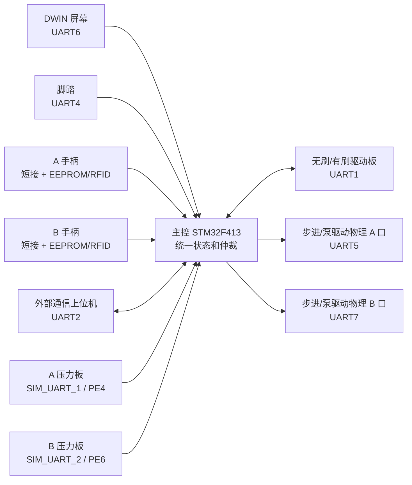

主控的核心职责不是“收到哪个按键就立刻驱动哪个硬件”，而是统一判断：谁在控制、当前通道是谁、手柄是否有效、是否报警、外控是否授权、压力是否达到当前目标泵速对应的保护曲线、驱动是否有反馈，然后再输出到电机和泵。

## 3. 主控的核心设计思想

### 3.1 输入源不直接驱动输出

主控里有很多输入来源：

| 输入来源 | 入口 | 典型动作 |
| --- | --- | --- |
| 屏幕 | `ScreenKey_Scan()` | 调速、切通道、切方向、触控运行、泵启停 |
| 脚踏 | `Foot_ParseDataS()`、`FootControlTask()` | 踩踏运行、双踏板切通道、注水泵跟随 |
| 手柄按键 | `handlekey.c`、`HANDLEKeyBehavior()` | 手柄运行、调速、换方向 |
| 手柄插拔 | `HandlescanA_Fun_SSC()`、`HandlescanB_Fun_SSC()` | 识别 EEPROM/RFID，更新 A/B 通道 |
| 外控 | `ExternalComm_ApplyExternalAuth()`、`ExternalComm_ApplyControlCommand()` | 授权、设置速度、启动电机、启动泵、急停 |

这些输入源不会直接发 UART1、UART5、UART7。它们先写公共状态，再由周期任务输出：

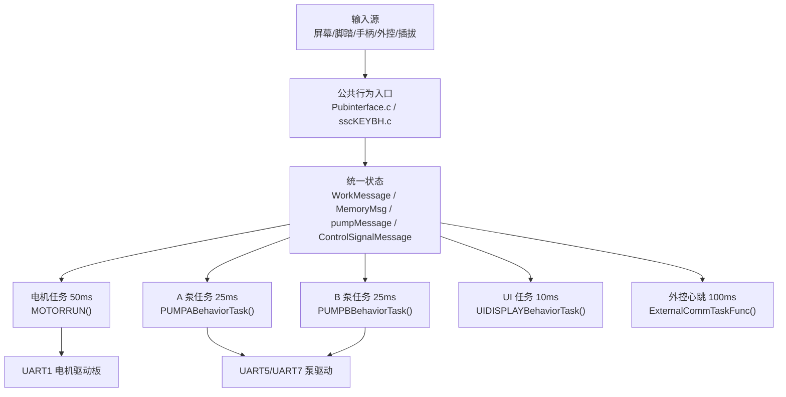

这样设计的原因：

1. 多个输入源可能同时出现，必须先仲裁。
2. 手柄、电机、泵、压力、外控之间有联动，不能让某个模块绕过全局状态。
3. 输出需要周期维持，例如电机停止时也要持续下发停止帧。
4. 异常处理必须统一，例如急停、报警、外控静默、压力停泵。
5. UI、蜂鸣、上位机心跳要看到同一份状态，否则现场会出现“屏幕显示运行但电机没转”这类错觉。

### 3.2 三层状态：识别、记忆、当前工作

理解本工程最重要的是区分三层状态：

| 层级 | 变量 | 含义 | 什么时候变化 |
| --- | --- | --- | --- |
| 识别缓存 | `ChannelrecognizeMessageA/B` | 刚从 A/B 手柄 EEPROM 或 RFID 读出来的原始能力 | 插入、RFID 刷新、识别失败清理 |
| 通道记忆 | `MemoryMsgA/B` | A/B 通道已经确认可用的参数记忆 | 插拔事件落地、RFID 刷新、用户调速调方向 |
| 当前工作 | `WorkMessage` | 当前真正被电机、UI、心跳读取的工作快照 | 自动选中、手动切通道、运行控制、报警处理 |

这三层不能混用。一个手柄插入 A 通道后，识别缓存有值，不代表当前工作通道已经切到 A。运行中插入 B 通道时，B 可以写入 `MemoryMsgB`，但不应该覆盖正在运行的 `WorkMessage`。

状态流向：

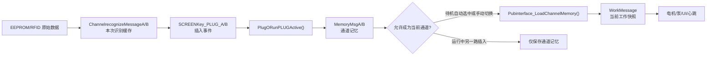

### 3.3 核心状态变量说明

`WorkMessage` 是当前工作快照。只要电机、屏幕、外控心跳要知道当前机器在干什么，基本都看它。

| 字段 | 原理说明 | 调试时看什么 |
| --- | --- | --- |
| `runflag_work` | 电机运行门控，true 时电机任务下发启动帧，false 时下发停止帧 | 不启动先看它有没有被置 true |
| `channel_work` | 当前被选中的 A/B 通道，0 表示无当前通道 | A/B 错乱先看它 |
| `Channel_Aonline/Channel_Bonline` | 插孔在线状态，不等于当前选中 | 插入后不在线先看它 |
| `hand_model` | 当前工作通道的手柄型号 | 为 0 时脚踏/外控启动会被拒绝 |
| `tool_type/raw_tool_type` | 业务刀具类型和原始标签/EEPROM 类型 | 影响有刷/无刷、开口定位、UI 显示 |
| `speed_set_work` | 当前设定速度 | 屏幕调速、外控设置、Page4 默认速度会改变它 |
| `speed_work` | 当前实际要求输出的速度 | 脚踏运行时会按踏板行程动态变化 |
| `dir_work` | 当前方向，0 正转、1 反转、2 往复 | 方向错先看它，再看电机组帧 |
| `freq_work` | 往复频率 | 只有支持往复的刀具才有效 |
| `alarm_flag/alarm_value` | 真实报警状态 | 很多输入会因报警直接返回 |
| `driver_speed_feedback` | 驱动板反馈转速 | 控制权释放和电机停稳判断会用 |
| `driver_current_x100` | 驱动板反馈电流，单位 0.01A | 心跳和监测用，不覆盖保护电流 |

`MemoryMsgA/B` 是每个通道自己的记忆。切通道时，`Pubinterface_LoadChannelMemory()` 把对应记忆装进 `WorkMessage`。

| 字段 | 原理说明 |
| --- | --- |
| `hand_model` | 本通道已经识别出的手柄型号 |
| `tool_type/raw_tool_type` | 本通道刀具类型 |
| `drive_type` | 本通道上次控制方式记忆 |
| `zz_speed/fz_speed/osc_speed` | 正转、反转、往复三个方向分别记忆速度 |
| `freq` | 本通道往复频率 |
| `dir` | 本通道当前方向 |
| `default_injection_flow` | Page4 默认注水流量，非法时业务回退 30 |
| `speed_alarm_for/speed_alarm_rev/freq_alarm_osc` | Page4阈值数据；当前只参与条件检测，报警发送调用已注释，不蜂鸣也不强制停机 |
| `auto_identify` | RFID 自动识别模式记忆 |

`ChannelrecognizeMessageA/B` 更接近 EEPROM/RFID 原始数据，不能当作当前运行状态。

| 字段 | 原理说明 |
| --- | --- |
| `hand_type_raw_major/minor` | Page2 手柄原始类型 |
| `speed_*max/min/default` | Page4 或 RFID 解析出的速度范围 |
| `speed_*step/step_large` | Page6 小步进和大步进 |
| `default_injection_flow` | Page4 默认注水流量 |
| `tool_reduction_ratio` | 刀具增速/减速比，高 16 位增速、低 16 位减速；当前运行态统一按 x100 保存，例如 `500` 表示 `5.00` 倍 |

`pumpMessageA/B` 是泵业务状态和压力状态的汇合点。

| 字段 | 原理说明 | 调试时看什么 |
| --- | --- | --- |
| `online_flag` | 压力帧设备码被识别后置 true | 外控启动泵前常看它 |
| `type` | 业务泵类型：抽吸、注水、灌注 | 决定方向和速度公式 |
| `run_flag` | 泵运行门控 | 不转先看它 |
| `speed_work` | 设定速度 | 用户或外控设置值 |
| `speed_output` | 压力闭环允许并准备下发的业务速度 | 压力限速后可能小于设定；不能证明物理泵已转 |
| `weight_x10` | 压力重量，单位 0.1g | 与主控按目标泵速查出的REDUCE/STOP曲线比较 |
| `pressure_threshold` | 压力板上报阈值字段，单位 g | 当前只作有效门禁：0禁用本帧压力保护，非0不直接决定停泵点 |
| `pressure_hold_flag` | 压力触发后的保持停泵状态 | true 时输出强制 0 |
| `pressure_recover_ms` | 兼容保留字段，当前压力锁止策略不再累计恢复时间 | 正常保持为 0 |
| `seq` | 压力帧序号 | 判断压力数据是否卡死 |

`ControlSignalMessage` 记录控制来源和一些泵请求。它不是最终输出值，而是用来说明“谁正在控制、谁请求了什么”。

### 3.4 核心结构体源码片段

下面的源码片段用于固定术语。后续章节中的“当前工作”“通道记忆”“识别缓存”“泵状态”都对应这些结构体。

`WorkMessage_t` 是整机当前工作快照。电机输出、UI 显示、外控心跳、控制权释放都会读取它：

```c
typedef struct
{
  volatile bool      runflag_work;
  volatile bool      alarm_flag;
  volatile uint8_t   alarm_value;
  volatile bool      Channel_Aonline;
  volatile bool      Channel_Bonline;
  volatile uint8_t   hand_model;
  volatile uint8_t   channel_work;
  volatile uint8_t   drivetype_work;
  volatile uint8_t   hmiactive_work;
  volatile uint8_t   touchactive_work;
  volatile uint8_t   tool_type;
  volatile uint8_t   raw_tool_type;
  volatile uint32_t  speed_work;
  volatile uint32_t  speed_set_work;
  volatile uint16_t  freq_work;
  volatile uint16_t  dir_work;
  volatile uint16_t  current_work;
  volatile uint16_t  driver_speed_feedback;
  volatile uint16_t  driver_current_x100;
  volatile uint32_t  tool_reduction_ratio;
  volatile uint8_t   auto_identify;
} WorkMessage_t;
```

这段结构体要分组理解：

| 分组 | 字段 | 为什么放在 `WorkMessage` |
| --- | --- | --- |
| 运行门控 | `runflag_work`、`alarm_flag`、`alarm_value` | 电机任务、UI、外控心跳都必须知道当前是否允许运行 |
| 通道选择 | `Channel_Aonline`、`Channel_Bonline`、`channel_work` | 在线状态和当前选中状态分开，避免运行中另一路插入抢占 |
| 当前工具 | `hand_model`、`tool_type`、`raw_tool_type`、`tool_reduction_ratio` | 电机组帧、UI 图标、外控心跳都依赖当前工作工具 |
| 当前控制方式 | `drivetype_work`、`hmiactive_work`、`touchactive_work` | 用来判断脚踏、屏幕、外控是否互斥 |
| 当前速度方向 | `speed_set_work`、`speed_work`、`freq_work`、`dir_work` | `speed_set_work` 是设定值，`speed_work` 是当前要输出的运行值 |
| 驱动反馈 | `driver_speed_feedback`、`driver_current_x100` | 用来判断电机是否停稳、外控心跳是否显示真实反馈 |

调试时不要把 `speed_set_work` 和 `speed_work` 混成一个值。屏幕或外控设置速度通常先改 `speed_set_work`，脚踏运行时会按行程动态改 `speed_work`。如果屏幕显示速度正确但电机输出不对，先比较这两个字段。

`ChannelMemoryMessagr_t` 是 A/B 通道各自的长期记忆。切通道时从这里装载到 `WorkMessage`：

```c
typedef struct
{
  volatile uint8_t   hand_model;
  volatile uint8_t   hand_type_raw_major;
  volatile uint8_t   hand_type_raw_minor;
  volatile uint8_t   tool_type;
  volatile uint8_t   raw_tool_type;
  volatile uint8_t   drive_type;
  volatile uint32_t  zz_speed;
  volatile uint32_t  fz_speed;
  volatile uint32_t  osc_speed;
  volatile uint16_t  freq;
  volatile uint16_t  dir;
  volatile uint16_t  current_work;
  volatile uint16_t  default_injection_flow;
  volatile uint32_t  speed_alarm_for;
  volatile uint32_t  speed_alarm_rev;
  volatile uint8_t   freq_alarm_osc;
  volatile uint32_t  tool_reduction_ratio;
  volatile uint8_t   auto_identify;
} ChannelMemoryMessagr_t;
```

这段结构体说明 A/B 通道不是只保存一个“在线标志”。每个通道都要保存自己的速度、方向、频率、刀具、默认注水和报警提示阈值。这样设计的原因是：A 正在运行时，B 插入成功可以先保存到 `MemoryMsgB`，但不能把 B 的速度和方向直接覆盖到 `WorkMessage`。

判断通道切换问题时按下面关系查：

| 现象 | 先看 | 正常关系 |
| --- | --- | --- |
| 切到 A 后速度不对 | `MemoryMsgA.zz_speed/fz_speed/osc_speed` | `Pubinterface_LoadChannelMemory(CHANNEL_A)` 应装载 A 记忆 |
| 切到 B 后还显示 A 刀具 | `MemoryMsgB.tool_type/raw_tool_type` | B 识别落地后应写入 B 记忆 |
| 运行中插入 B 导致 A 变了 | `WorkMessage` 是否被 B 插入事件覆盖 | 运行中另一路只应更新 `MemoryMsgB` |

`ChannelrecognizeMessage_t` 是识别缓存。它保存 EEPROM/RFID 刚解析出的能力边界，不代表当前已经选中：

```c
typedef struct
{
  volatile bool      digital_enable;
  volatile bool      Pubadapter;
  volatile bool      dualDrive_Flag;
  volatile uint8_t   freq_max;
  volatile uint8_t   freq_min;
  volatile uint8_t   freq_default;
  volatile uint32_t  speed_zzmax;
  volatile uint32_t  speed_zzmin;
  volatile uint32_t  speed_fzmax;
  volatile uint32_t  speed_fzmin;
  volatile uint32_t  speed_oscmax;
  volatile uint32_t  speed_oscmin;
  volatile uint16_t  speed_zzstep;
  volatile uint16_t  speed_fzstep;
  volatile uint16_t  speed_oscstep;
  volatile uint16_t  speed_zzstep_large;
  volatile uint16_t  speed_fzstep_large;
  volatile uint16_t  speed_oscstep_large;
  volatile uint32_t  speed_zzdefault;
  volatile uint32_t  speed_fzdefault;
  volatile uint32_t  speed_oscdefault;
  volatile uint16_t  default_injection_flow;
  volatile uint16_t  speed_alarm_for;
  volatile uint16_t  speed_alarm_rev;
  volatile uint8_t   freq_alarm_osc;
  volatile uint8_t   handle_type;
  volatile uint8_t   hand_type_raw_major;
  volatile uint8_t   hand_type_raw_minor;
  volatile uint8_t   run_direction;
  volatile uint8_t   control_mode;
  volatile uint8_t   tool_type;
  volatile uint8_t   raw_tool_type;
} ChannelrecognizeMessage_t;
```

这段结构体的关键词是“能力边界”。EEPROM Page4 和 RFID 解析出来的是某把工具允许的速度范围、默认值、步进、方向和泵默认流量。它还没有变成当前运行状态。只有插拔事件落地、保存到 `MemoryMsgA/B`、再装载到 `WorkMessage` 后，电机和 UI 才会真正使用。

常见误判：

| 看到的现象 | 正确解释 |
| --- | --- |
| `ChannelrecognizeMessageA.speed_zzdefault` 已有值，但屏幕还是旧速度 | 识别缓存还没落地到通道记忆或当前工作 |
| RFID 已解析出刀具类型，但电机仍按旧刀具跑 | 当前通道没有重新装载，或者运行中禁止覆盖 `WorkMessage` |
| Page6 步进值读到了，但调速幅度没变 | 调速函数仍在使用当前通道记忆，未装载新识别值 |

`pumpMessage_t` 是泵和压力的汇合结构。泵任务、压力软串口、压力闭环、UI 和外控心跳都会接触它：

```c
typedef struct
{
  volatile bool     online_flag;
  volatile bool     run_flag;
  volatile uint16_t timingDrainage_times;
  volatile bool     timingDrainage_flag;
  volatile uint8_t  associated_channel;
  volatile uint16_t type;
  volatile uint8_t  direction;
  volatile uint16_t speed_work;
  volatile uint16_t speed_output;
  volatile uint16_t speed_Max;
  volatile uint16_t speed_Min;
  volatile uint8_t  losses_times;
  volatile int32_t  pressure_value;
  volatile uint16_t pressure_threshold;
  volatile uint32_t weight_x10;
  volatile bool     pressure_hold_flag;
  volatile uint32_t pressure_recover_ms;
  volatile uint8_t  seq;
} pumpMessage_t;
```

这段结构体要按两条链路读：

1. 泵控制链路写 `run_flag`、`type`、`direction`、`speed_work`，表示用户、脚踏、手柄或外控希望泵怎么动。
2. 压力安全链路写 `pressure_value`、`weight_x10`、`pressure_threshold`、`pressure_hold_flag`、`speed_output`，并将兼容字段 `pressure_recover_ms` 保持为 0，表示压力板和闭环保护允许主控命令泵输出多少；泵链路无ACK，不能据此确认物理泵已转。

所以泵不转时不能只看 `run_flag`。`run_flag=true` 只能说明“有运行请求”，如果 `pressure_hold_flag=true` 或 `speed_output=0`，最终 UART 仍会发 0。压力自然下降不会自动解除锁止，必须先释放当前请求，再由新的启动沿清除锁止。

### 3.5 状态不变量

调试时优先检查这些不变量。只要其中一个被破坏，后面的电机、泵、UI 或外控表现都会变得混乱。

| 不变量 | 正常要求 | 破坏后的典型现象 | 首选断点 |
| --- | --- | --- | --- |
| 在线不等于选中 | `Channel_Aonline/Bonline` 只说明插孔在线，`channel_work` 才说明当前工作通道 | 插入 B 后 A 正在运行却被 B 参数覆盖 | `PlugORunPLUGActive()` |
| 识别缓存不直接驱动输出 | `ChannelrecognizeMessageA/B` 必须经过插拔事件和通道记忆落地 | EEPROM 读到正确但屏幕或电机仍没有变化 | `Pubinterface_SaveRecognizeToMemory()` |
| 当前工作只能来自当前通道 | `WorkMessage` 装载必须匹配 `channel_work` | A/B 速度、方向、手柄图标错乱 | `Pubinterface_LoadChannelMemory()` |
| 真实报警统一写 `WorkMessage` | 影响停机的报警必须走 `WorkAlarm_Set()` | 蜂鸣响但电机不被禁止，或 UI 无报警 | `WorkAlarm_Set()` |
| Page4阈值当前只检测 | 达到阈值不应产生蜂鸣、真实报警或停机 | 到阈值附近出现报警/误停，或维护者误以为应当有蜂鸣 | `Pubinterface_CheckSpeedThresholdAlarm()`及其中被注释的发送调用 |
| 压力停泵按新启动沿解锁 | `pressure_hold_flag=true` 时输出 0；压力下降不自动复转，新启动沿才清锁止 | 连续踩住或持续触控时意外自动复转 | `PumpBehaviorCore_Run()`的新启动沿分支 |
| 外控释放不是电机停稳自动释放 | 外控授权后由上位机退出或 10 秒静默释放 | 电机停了但本地屏幕/脚踏仍无法接管 | `ExternalComm_CheckLinkWatchdog()` |

### 3.6 状态快照记录模板

复杂问题不要只截一处变量。建议每次停在断点时按下面顺序记录一组快照：

```text
时间点：
触发动作：插入A / 切B / 脚踏启动 / 外控启动 / 压力超阈值 / 急停

WorkMessage:
  runflag_work =
  alarm_flag/alarm_value =
  channel_work =
  Channel_Aonline/Channel_Bonline =
  hand_model =
  tool_type/raw_tool_type =
  speed_set_work/speed_work =
  dir_work/freq_work =
  drivetype_work/hmiactive_work/touchactive_work =
  driver_speed_feedback/driver_current_x100 =

MemoryMsgA:
  hand_model =
  tool_type/raw_tool_type =
  zz_speed/fz_speed/osc_speed =
  dir/freq =
  default_injection_flow =

MemoryMsgB:
  hand_model =
  tool_type/raw_tool_type =
  zz_speed/fz_speed/osc_speed =
  dir/freq =
  default_injection_flow =

pumpMessageA/B:
  online_flag =
  type =
  run_flag =
  speed_work/speed_output =
  pressure_threshold =
  weight_x10 =
  pressure_hold_flag/pressure_recover_ms =
  seq =
```

## 4. 启动与软任务原理

### 4.1 启动顺序

主控启动链路：

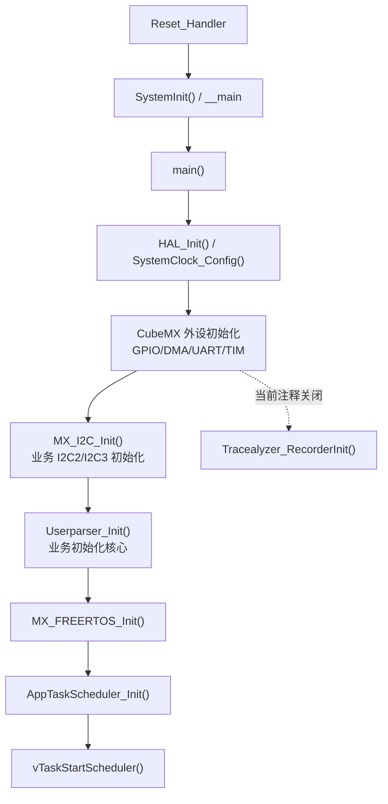

`Userparser_Init()` 做业务初始化，顺序大致为：

1. 调用当前为空操作的 `Iwdg_Reset()` 兼容接口并初始化板级GPIO。
2. EEPROM 初始化。
3. UART1 电机、UART2 外控、UART3 RFID、条件启用的 UART9 RFID、UART4 脚踏、UART5 泵、UART6 屏、UART7 泵。
4. 强制显示启动页。
5. 重复发送电机急停输出，避免驱动板上电不同步或残留输出。
6. 启动页保留约4秒入口窗口；累计收到五次 `0x2001/key1` 后发出100ms蜂鸣、切到 Page3 并进入独占脚踏定标循环，此时电机、泵、外控和正常脚踏业务任务尚未创建。
7. 初始化 `WorkMessage`、`MemoryMsgA/B`、`pumpMessageA/B` 等公共状态。
8. 初始化 RFID。
9. 创建看门狗、LED、蜂鸣、按键行为、手柄扫描、脚踏解析与控制、屏幕键、电机、手柄按键、电机反馈、外控、RFID、A/B 泵、UI、软串口压力共 17 个活动周期任务。

### 4.2 软任务不是完全并行

工程里使用 FreeRTOS，但业务模块不是每个都直接管理原生任务。应用层通过 `Kernel_TaskStart()` 注册周期任务，再由 `Src\app_task.c` 的 worker 周期调用。

关键点：所有旧业务回调在进入前都会经过 `AppTaskRuntimeGate()`，该函数使用同一个静态互斥锁 `sAppTaskRuntimeMutex`。这意味着多个任务虽然周期不同，但业务回调本身被串行保护。

这样做的好处：

1. 降低旧全局变量并发写坏的概率。
2. 让 `WorkMessage`、`pumpMessageA/B` 这类共享结构不需要每一处都加锁。
3. 方便把旧裸机风格逻辑迁移到 RTOS。

代价：

1. 某个任务回调耗时过长，会拖慢后续任务。
2. 高频任务不一定能严格按周期完成业务逻辑。
3. 调试“并发问题”时，不能只看任务周期，还要看哪个回调占着互斥锁。

每个活动业务任务由 `app_task_create_named()` 创建为一个静态 FreeRTOS 线程，默认栈深为 1024 个 `StackType_t`、优先级为 `tskIDLE_PRIORITY + 3`。17 个任务约占 68KiB 静态任务栈；`configTOTAL_HEAP_SIZE` 为 15360 字节，主要供动态业务队列等对象使用。线程相互独立，但回调进入业务代码前仍由同一个 `AppTaskRuntimeGate()` 互斥串行化。

关键任务周期：

| 任务 | 周期 | 作用 |
| --- | --- | --- |
| 电机反馈 `MOTORUARTTaskFunc()` | 3ms | 解析 UART1 驱动回包 |
| 手柄扫描 `HANDLESCANTaskFunc()` | 10ms | A/B 插拔、EEPROM、RFID |
| 外控 `ExternalCommTaskFunc()` | 10ms | UART2 接收、链路计时 |
| UI 显示 `UIDISPLAYBehaviorTask()` | 10ms | 消费 UI 队列 |
| 脚踏解析 `Foot_ParseDataS()` | 10ms | UART4 脚踏实时帧 |
| 脚踏控制 `FootControlTask()` | 25ms | 踏板行程控制电机和泵 |
| A 泵 `PUMPABehaviorTask()` | 25ms | 进入共用行为内核，处理 A 泵输出、压力锁止和排空计时 |
| B 泵 `PUMPBBehaviorTask()` | 25ms | 进入共用行为内核，处理 B 泵输出、压力锁止和排空计时 |
| 屏幕键 `SCREENKEYTaskFunc()` | 30ms | DWIN 触摸帧和触控保活 |
| 手柄按键 `HANDLEKEYTaskFunc()` | 30ms | 手柄按键扫描 |
| 按键行为 `KeyBehaviorsTask()` | 30ms | 消费统一按键队列 |
| 电机输出 `MOTORRUNTask()` | 50ms | 按 `WorkMessage` 下发 UART1 |
| RFID 自动模式 | 100ms | UART3 RFID 请求和回包 |
| 压力软串口维护 `SimUartTaskFunc()` | 100ms | 软串口帧解析队列 |
| 蜂鸣 | 100ms | 按键音和报警音 |
| LED | 200ms | 状态灯 |
| IWDG 任务 | 300ms | 当前回调为空，`MX_IWDG_Init()` 和刷新调用均关闭，不具备实际看门狗保护 |

`PedalRecvTask_Init()` 和 `CUTTERSCANTaskHandle` 仍没有接入 `Userparser_Init()` 的17个活动任务，不能计入任务总数。脚踏定标改由 `UI_Start_Fun()` 在任务创建前直接调用 `UI_FootPedalCalibration_Fun()`，定标循环内部直接扫描UART4和UART6；RFID当前只启动 `AUTOMODEGETDATATaskFunc()`。

业务动态队列和软串口静态队列如下。队列深度是容量，不是重试次数；修改后会影响 FreeRTOS heap、突发消息容忍度和丢消息表现。

| 队列 | 深度 | 消息类型 | 生产者 / 消费者 |
| --- | ---: | --- | --- |
| `UIDPMsgQueue` | 48 | `UIDPMessage_t` | 公共接口、业务模块 / `UIDISPLAYBehaviorTask()` |
| `KeyBehivQueue` | 20 | `KeyBehMessage_t` | 屏幕、手柄、脚踏、外控 / `KeyBehaviorsTask()` |
| `BeepMsgQueue` | 5 | `BeepMessage_t` | 按键、报警模块 / `BeepControlTask()` |
| `FootMsgQueue` | 5 | `FootMessage_t` | UART4 脚踏解析 / `FootControlTask()` |
| `PUMPAMsgQueue` | 5 | `PumpBehaviorMessage_t` | 兼容泵请求入口 / A泵行为任务 |
| `PUMPBMsgQueue` | 2 | `PumpBehaviorMessage_t` | 兼容泵请求入口 / B泵行为任务 |
| `RFIDMsgQueue` | 4 | `RFIDMessage_t` | 手柄扫描、屏幕 / RFID任务 |
| `SIM_UART_1` 字节队列 | 128 | `uint8_t`，静态创建 | PE4/TIM11 ISR / `SimUartTaskFunc()` |
| `SIM_UART_2` 字节队列 | 128 | `uint8_t`，静态创建 | PE6/TIM13 ISR / `SimUartTaskFunc()` |

A/B泵消息入口仍过滤连续重复设定，但去重缓存只在`Kernel_QueueSend()`成功后更新。队列满时本次消息虽然未入队，下一周期相同的最新设定仍会继续尝试，避免把未消费的设定误记为已经送达并永久丢失。

调试任务问题时：

| 断点 | 看什么 |
| --- | --- |
| `Kernel_TaskStart()` | 任务是否启动，周期是否正确 |
| `AppTaskWorker()` | worker 是否进入循环 |
| `AppTaskRuntimeGate()` | 是否被某个任务长时间占用 |
| `task->func(0U)` | 当前实际执行哪个业务回调 |

### 4.3 启动源码依据

`main()` 中 CubeMX 外设先完成，随后才进入板级后初始化、应用初始化和 FreeRTOS 调度：

```c
MX_GPIO_Init();
MX_DMA_Init();
MX_USART1_UART_Init();
MX_USART2_UART_Init();
MX_USART3_UART_Init();
MX_UART4_Init();
MX_UART5_Init();
MX_USART6_UART_Init();
MX_UART7_Init();
MX_UART8_Init();
#if (RFID_USE_DUAL_UART_MODE == 1U)
MX_UART9_Init();
#endif
MX_UART10_Init();
MX_TIM7_Init();
MX_TIM10_Init();
MX_TIM14_Init();

/* Tracealyzer_RecorderInit(); 当前默认关闭。 */
MX_I2C_Init();
Userparser_Init();
MX_FREERTOS_Init();
vTaskStartScheduler();
```

这段代码说明几个关键事实：

1. UART1/2/3/4/5/6/7/8/10 都在进入业务前完成 HAL 初始化。
2. 当前 `MX_IWDG_Init()`、`Iwdg_Reset()` 内实际刷新和 `Tracealyzer_RecorderInit()` 均被关闭；看到任务或接口名称不代表功能已经生效。
3. `MX_UART9_Init()` 仅在 `RFID_USE_DUAL_UART_MODE=1U` 时执行；设为`0U`时不初始化UART9，A/B两套RFID通过UART3和R200-K8选通。最终固件采用哪种模式必须以目标硬件和`board_profile.h`编译值为准。
4. `MX_I2C_Init()` 和 `Userparser_Init()` 是业务初始化的直接入口。若某个 GPIO/I2C 资源异常，应先确认二者的执行顺序。
5. `vTaskStartScheduler()` 后不应再回到 while 循环；若回到 while，说明 FreeRTOS 调度器启动失败或堆/任务创建异常。

`Userparser_Init()` 是业务初始化的主线。它不是普通工具函数，而是整机业务进入运行态的“总开关”：

```c
void Userparser_Init(void)
{
  Iwdg_Reset();
  Board_GPIOConfiguration();
  EEPROM_AT24CXX_Init();

  Uart1_Init();
  Uart2_Init();
  Uart3_Init();
  Uart4_Init();
  Uart5_Init();
  Uart6_Init();
  LCD_ForceShow_Which_Map(UIDP_LCD_PAGE_STARTUP);
  Uart7_Init();

  LCD_Disappear_Picture(UIDP_LCD_VP_ALARM_TIP);
  Motor_ErrorEmergencyStop_Ctrl();
  UI_Start_Fun();
  Userparser_PubinterfaceInit();
  SscRadioFreq_Init();

  IwdgTaskInit();
  LEDTaskInit();
  SscBeepControlTask_Init();
  SscKeyBehaviorTask_Init();
  HandlescanTaskInit();
  SscFootControlTask_Init();
  ScreenKey_ScanInit();
  SscDriveMotorTask_Init();
  HandleKeyScan_Init();
  MotorUartData_Init();
  ExternalComm_Init();
  SscSplitTypeAutoModeGetData_Init();
  SscPumpATask_Init();
  SscPumpBTask_Init();
  SscUIDisplayTask_Init();
  SimUartTask_Init();

  SendUIDSMessage(UI_POWERINIT_ID, false, NULL);
}
```

这段初始化代码要按四段读：

| 代码段 | 做什么 | 为什么必须在这个位置 |
| --- | --- | --- |
| `Iwdg_Reset()` 到 `EEPROM_AT24CXX_Init()` | 先经过空看门狗兼容入口，再准备板级GPIO和EEPROM基础资源 | 手柄识别、参数读取和后续I2C调试依赖这些资源；当前不能把 `Iwdg_Reset()` 当作真实喂狗 |
| `Uart1_Init()` 到 `Uart7_Init()` | 逐个初始化业务串口，并先显示启动页 | 电机、外控、RFID、脚踏、屏幕、泵都要先有通信通道 |
| `Motor_ErrorEmergencyStop_Ctrl()` | 上电先对电机驱动做一次安全停止 | 防止驱动板保留上次输出状态或上电瞬间误动作 |
| `Userparser_PubinterfaceInit()` | 清公共状态和通道记忆 | 避免 `WorkMessage`、`MemoryMsg`、`pumpMessage` 带随机值进入任务 |
| 各 `Task_Init()` | 注册周期任务 | 所有输入输出都靠软任务周期执行 |
| `SendUIDSMessage(UI_POWERINIT_ID, ...)` | 投递开机 UI 首刷 | UI 不直接在初始化里大面积刷屏，而是交给 UI 任务消费 |

如果程序卡在这个函数里，定位顺序不是从最后一个任务开始猜，而是看“上一句已经成功、下一句是否进入”。例如屏幕没有启动页，应先确认 `Uart6_Init()` 和 `LCD_ForceShow_Which_Map()`，再看 UI 任务；如果电机上电异常，应先确认 `Motor_ErrorEmergencyStop_Ctrl()` 是否真实发帧，而不是只看后面的 `MOTORRUNTask()`。

调试上电流程时按这个顺序判断：

| 阶段 | 断点 | 正常现象 | 异常说明 |
| --- | --- | --- | --- |
| HAL 外设初始化 | `MX_USARTx_UART_Init()` | 各 UART handle 初始化完成 | 串口 handle 错误、DMA 未就绪、时钟未开 |
| I2C 后初始化 | `MX_I2C_Init()` | I2C2/I2C3 业务总线可用 | EEPROM 和手柄总线可能未准备 |
| 应用启动 | `Userparser_Init()` | 各业务模块完成初始化和任务注册 | 应用层入口未接上 |
| 屏幕启动页 | `LCD_ForceShow_Which_Map()` | UART6 发 page0 切换帧 | 屏幕黑屏或停旧页 |
| 电机急停 | `Motor_ErrorEmergencyStop_Ctrl()` | 上电先发停止/急停帧 | 驱动板可能保持上次状态 |
| 公共状态初始化 | `Userparser_PubinterfaceInit()` | `WorkMessage/MemoryMsg/pumpMessage` 清零 | 后续读取到随机状态 |
| 任务注册 | 各模块 `Task_Init()` 函数 | `Kernel_TaskStart()` 返回成功 | 对应模块周期任务不运行 |
| UI 首刷 | `SendUIDSMessage(UI_POWERINIT_ID)` | UIDP 队列收到开机刷新 | 屏幕主运行页显示不完整 |

### 4.4 软任务串行门控源码依据

当前应用层任务虽然分成多个 FreeRTOS worker，但真正执行业务回调前会进入同一个门控：

```c
static void AppTaskRuntimeGate(task_t *task)
{
    if ((task == NULL) || (task->func == NULL))
    {
        return;
    }

    if ((sAppTaskRuntimeMutex == NULL) ||
        (xSemaphoreTake(sAppTaskRuntimeMutex, portMAX_DELAY) != pdTRUE))
    {
        return;
    }

    AppTaskTrace_RecordBoundary(task, true);
    task->func(0U);
    AppTaskTrace_RecordBoundary(task, false);

    if (task->oneShot)
    {
        taskENTER_CRITICAL();
        task->start = false;
        task->timerTick = 0U;
        taskEXIT_CRITICAL();
        AppTaskTrace_RecordOneShotStop(task);
    }

    (void)xSemaphoreGive(sAppTaskRuntimeMutex);
}
```

逐段解释：

| 代码段 | 作用 | 调试含义 |
| --- | --- | --- |
| `task == NULL` 或 `task->func == NULL` | 防御无效任务指针 | 某任务没有回调时会直接返回，不会进入业务 |
| `xSemaphoreTake(..., portMAX_DELAY)` | 所有旧业务回调共用一把互斥锁 | 一个任务卡住会拖慢其它任务，不是 FreeRTOS 没调度 |
| `AppTaskTrace_RecordBoundary(task, true/false)` | 记录任务进入和退出边界 | Tracealyzer 可看到哪个业务回调耗时最长 |
| `task->func(0U)` | 真正执行业务函数 | 断在这里前后可以测单次耗时 |
| `task->oneShot` 分支 | 一次性任务执行后自动停止 | 如果 oneShot 反复执行，说明外部又把 `start` 置 true |
| `xSemaphoreGive()` | 释放串行门控 | 如果没有走到这里，后续所有业务任务都会等待 |

这段代码说明“多任务”在本工程里不是所有业务逻辑并行写全局变量。真正的业务回调被串行化了。遇到周期异常时，要分清两种情况：一种是 FreeRTOS 任务没有运行；另一种是任务在运行，但排队等互斥锁。后者在调试器里看起来像“某模块偶尔慢”，根因可能是前一个 I2C、UART 或 UI 刷新占锁太久。

这个门控直接影响调试判断：

1. 如果 `SCREENKEYTaskFunc()` 很慢，`MOTORRUN()`、`PUMPABehaviorTask()`、`ExternalCommTaskFunc()` 也可能被排队等待。
2. 如果某个任务卡在 I2C、UART 发送、延时或循环里，其他业务回调不是并发继续跑，而是等待同一把互斥锁。
3. 若 Tracealyzer 开启，可用 `BEGIN/END` 事件确认哪个软任务占用时间最长。
4. 如果不用 Tracealyzer，可在 `AppTaskRuntimeGate()` 里观察 `task->name`、`task->func`、进入时间和退出时间。

定位周期卡顿时建议按下面的顺序记录：

```text
断点 1：AppTaskWorker()
  task->name =
  task->periodMs =
  task->start =

断点 2：AppTaskRuntimeGate() 进入前
  task->name =
  当前 tick =
  是否成功 xSemaphoreTake =

断点 3：task->func(0U) 前后
  回调名称 =
  进入 tick =
  退出 tick =
  单次耗时 =

判断：
  单个回调耗时 > 自身周期：该模块会持续拖慢全局业务。
  高频任务等待时间明显增加：检查前一个长期占锁的任务。
  某个 oneShot 任务反复 start：检查任务启动条件是否被周期性重新置位。
```

## 5. 手柄识别、A/B 通道与 EEPROM 原理

### 5.1 为什么手柄识别不能只看插入 IO

手柄短接 IO 只能说明“可能插入了手柄”。真正上线还要证明：

1. 物理插入稳定，不是抖动。
2. I2C 总线能读到 AT24CS32。
3. Page1 认证值和 SN + Page2~Page8 计算结果一致。
4. Page2 能映射出手柄型号。
5. Page3 或 RFID 能映射出刀具类型和规格。
6. Page4 能给出速度、频率、默认注水流量、报警阈值。
7. Page6 能给出小步进和大步进。
8. 插拔事件被公共接口接收后，才更新通道记忆和当前工作通道。

### 5.2 手柄扫描状态机

A 通道入口是 `HandlescanA_Fun_SSC()`，B 通道入口是 `HandlescanB_Fun_SSC()`。A/B 在业务层始终表示逻辑通道；物理短接脚、实体运行键、EEPROM和电机通道由 `HANDLE_PHYSICAL_AB_SWAP_ENABLE` 映射。RFID另按硬件版本处理：`RFID_USE_DUAL_UART_MODE`选择双串口或UART3加R200-K8，单串口模式再由`RFID_R200_AB_SWAP_ENABLE`决定逻辑通道选择哪个固定物理模块。

| 逻辑通道 | `HANDLE_PHYSICAL_AB_SWAP_ENABLE=1U` | `HANDLE_PHYSICAL_AB_SWAP_ENABLE=0U` |
| --- | --- | --- |
| A | PD0短接、PE13运行键、I2C3 EEPROM和原物理B电机通道 | PD1短接、PE12运行键、I2C2 EEPROM和原物理A电机通道 |
| B | PD1短接、PE12运行键、I2C2 EEPROM和原物理A电机通道 | PD0短接、PE13运行键、I2C3 EEPROM和原物理B电机通道 |

R200-K8硬件保持固定电平含义：高电平选择物理A，低电平选择物理B。`RFID_R200_AB_SWAP_ENABLE=0U`时逻辑A选择物理A、逻辑B选择物理B；确认RFID线束交叉时设为`1U`。手册只说明映射规则，交付值以目标硬件对应的编译配置为准。

该开关不交换 `s_a_context/s_b_context`、`ChannelrecognizeMessageA/B`、`MemoryMsgA/B`、屏幕 A/B 区域、报警归属和 A 后 B 的扫描顺序。

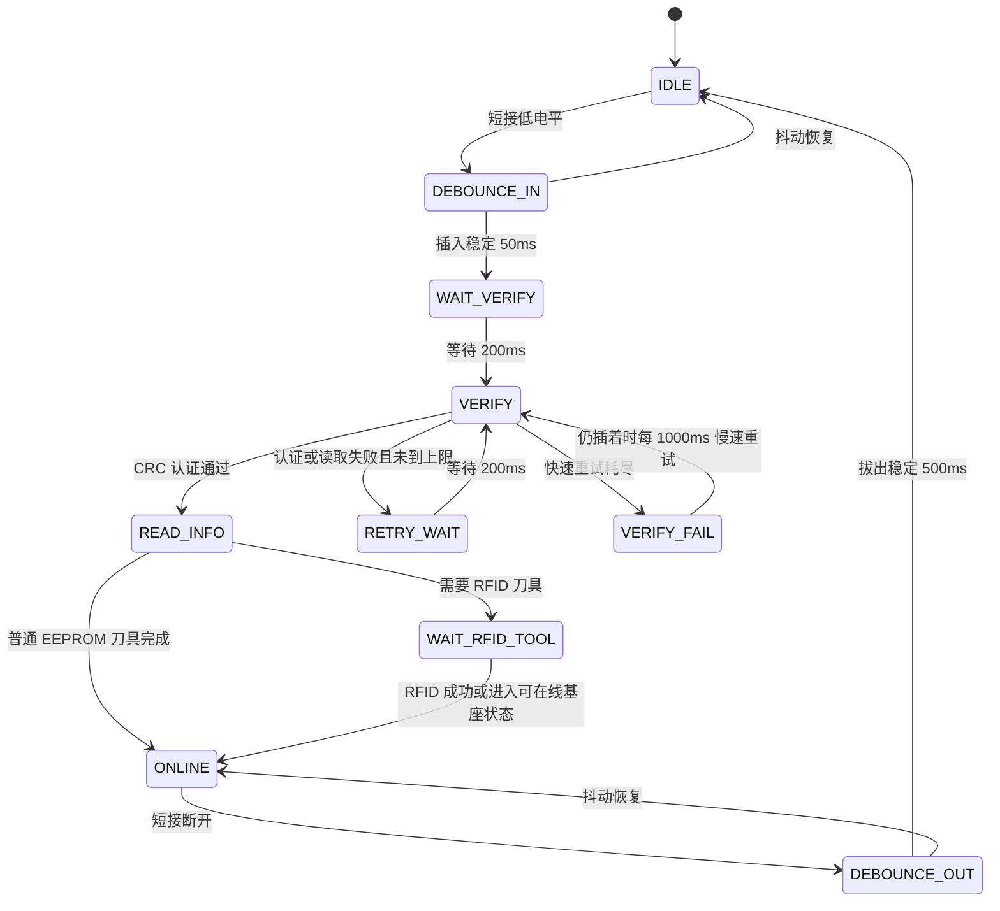

时间参数以当前源码为准：

| 参数 | 当前值 | 意义 |
| --- | --- | --- |
| 扫描周期 | 10ms | 手柄扫描任务周期 |
| 插入去抖 | 50ms | 防止插入瞬间抖动 |
| 拔出去抖 | 500ms | 防止接触瞬断误判拔出 |
| 认证前等待 | 200ms | 等插头、电源、I2C 稳定 |
| 快速重试间隔 | 200ms | EEPROM 偶发失败快速恢复 |
| 失败后慢重试 | 1000ms | 坏手柄保持插入时周期自恢复 |
| RFID 等待 | 约 900ms 起，在线监控约 2s | 运行中会暂停部分 RFID 识别 |

### 5.3 AT24CS32 认证原理

认证函数：

| 逻辑通道 | `HANDLE_PHYSICAL_AB_SWAP_ENABLE=1U` | `HANDLE_PHYSICAL_AB_SWAP_ENABLE=0U` |
| --- | --- | --- |
| A | `AT24CS32_VerifyCrc_I2C3()` | `AT24CS32_VerifyCrc_I2C2()` |
| B | `AT24CS32_VerifyCrc_I2C2()` | `AT24CS32_VerifyCrc_I2C3()` |

认证不是普通 CRC 一次算完，而是固定布局：

1. 读取 Page1 原始 32 字节。
2. 校验 Page1 页尾 2 字节页和。
3. Page1 前 8 字节是存储的认证结果。
4. 读取 AT24CS32 序列号 SN 16 字节。
5. 读取 Page2 到 Page8，共 7 页、224 字节；每页都要先校验页和。
6. 拼接 `SN(16B) + Page2~Page8(224B)`，总共 240 字节。
7. 对同一输入计算 4 组 CRC16。
8. 4 个 CRC16 按大端拼成 8 字节，与 Page1 前 8 字节比较。

伪代码：

```text
page1 = read_page_raw(0)
if page1 read failed: return PAGE1_READ_FAILED
if page_checksum(page1) failed: return PAGE1_CHECKSUM_FAILED

stored_auth = page1[0..7]
sn = read_serial_number()
if sn read failed: return SN_READ_FAILED

auth_data = Page2 + Page3 + ... + Page8
if any page read/checksum failed: return DATA_READ_FAILED

input = sn + auth_data
calc = crc16(input, 0xFFFF, 0x1021)
     + crc16(input, 0xFFFF, 0x8005)
     + crc16(input, 0xFFFF, 0x3D65)
     + crc16(input, 0xFFFF, 0xA097)

if calc == stored_auth: return OK
else: return CRC_MISMATCH
```

页校验规则：

| 项 | 规则 |
| --- | --- |
| 页大小 | 32 字节 |
| 有效数据 | 前 30 字节 |
| 页尾校验 | 第 30、31 字节保存前 30 字节求和 |
| 读取整页 | `AT24CS32_ReadPage_I2C2/I2C3()` 会校验页和 |
| 写整页 | `AT24CS32_WritePage_I2C2/I2C3()` 会自动重算页和 |

I2C 失败时，底层 `at24cs32.c` 会记录 `AT24CS32_DebugInfo`，字段包括操作类型、设备地址、内部地址、长度、HAL 状态、HAL 错误、访问前后 I2C 状态。查 EEPROM 问题时，不要只看认证返回码，还要读最近一次 I2C 调试信息。

### 5.4 EEPROM 页面业务含义

| 页面 | 地址或索引 | 作用 |
| --- | --- | --- |
| Page1 | 0 | 存认证结果和页和 |
| Page2 | 0x0020 | 手柄型号，决定基座类型 |
| Page3 | 0x0040 | 刀具类型、直径、长度、角度、夹持范围及减速/增速倍率 |
| Page4 | page index 3 | 默认注水流量、默认速度、上下限、方向、频率、阈值 |
| Page6 | page index 5 | 小步进和大步进 |
| Page8 等 | page index 7 等 | 认证输入的一部分，外控读写时也有页面映射 |

Page4 很关键，因为它决定“上线后默认怎么跑”：

| 字段 | 影响 |
| --- | --- |
| 默认注水流量 | 当前通道成为工作通道时，给注水泵默认速度 |
| 默认速度 | `speed_set_work` 的初值 |
| 最小/最大速度 | 屏幕、手柄、外控调速边界 |
| 默认方向 | EEPROM手柄按Page4方向装载；公共接头RFID刀具按EPC byte10装载，并根据刀具型号决定是否锁定界面方向或转换驱动实际方向 |
| 频率 | 往复模式初值 |
| 速度/频率报警阈值 | 数据会装载并参与条件检测；当前报警发送调用已注释，不蜂鸣、不写真实报警、不强制停机 |

### 5.4.1 EEPROM 不是全机参数表

手柄 EEPROM 保存的是“这一个手柄、这一把刀具、这一套基座”的身份和默认运行资料，不是主控全局参数表。这个区别很重要：

1. `ChannelrecognizeMessageA/B` 是识别缓存。它来自当前插入手柄的 EEPROM 或 RFID，拔插、重试、RFID 更新都会改它。
2. `MemoryMsgA/B` 是通道记忆。它保存 A/B 通道最近一次识别成功后的业务值，用来在切换通道时重新装载。
3. `WorkMessage` 是当前工作状态。电机、脚踏、屏幕和外控最终都看它，运行中不会因为另一路手柄重新识别就被随意覆盖。
4. 外控“设置速度、设置泵速、切方向”默认只改运行态，不会自动写回手柄 EEPROM。
5. 外控协议只能读取业务 EEPROM；业务写命令 `0x07` 固定拒绝。导航页写入成功后立即落盘，但不会自动改写当前运行态。

因此，“参数不生效”要先问清楚写到了哪一层。写 `WorkMessage` 是立即运行态；写 `MemoryMsgA/B` 是下次装载；写 `ChannelrecognizeMessageA/B` 是识别中间态；写 EEPROM 是持久化原始数据。

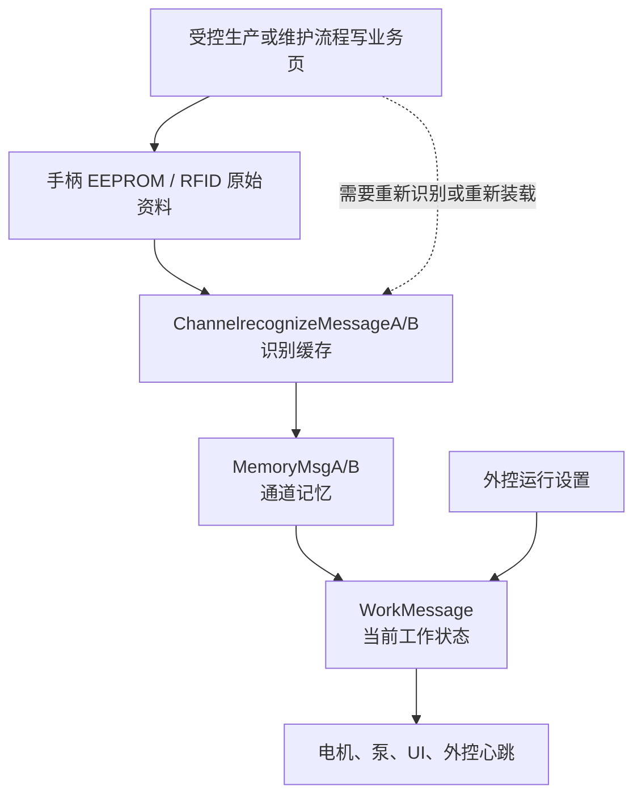

### 5.4.2 EEPROM 页结构源码依据

`AT24CS32` 当前按 128 页管理，每页 32 字节。业务有效数据是前 30 字节，最后 2 字节是页和。代码中的关键定义如下：

```c
#define AT24CS32_PAGE_SIZE        32U
#define AT24CS32_PAGE_DATA_SIZE   30U
#define AT24CS32_PAGE_COUNT       128U
#define AT24CS32_TOTAL_SIZE       4096U
#define AT24CS32_SN_SIZE          16U
```

页和不是 CRC，只是对前 30 字节求和，然后把高低字节放在页尾：

```c
static uint16_t AT24CS32_PageChecksum(const uint8_t page[AT24CS32_PAGE_SIZE])
{
    uint16_t sum = 0U;
    for (uint16_t i = 0U; i < AT24CS32_PAGE_DATA_SIZE; ++i)
    {
        sum = (uint16_t)(sum + page[i]);
    }
    return sum;
}
```

写整页时底层会重新生成页尾校验，因此受控生产/维护工具写业务页、外控写导航页时都只提供30字节数据，不能把历史页尾校验当成业务字段重复写入；外控0x07业务页写命令仍固定拒绝。

| 页面 | 业务含义 | 数据来源 | 调试时重点看什么 |
| --- | --- | --- | --- |
| Page1 | 认证结果，前 8 字节保存 4 组 CRC16 结果 | 出厂或授权工具写入 | Page1 页和、Page1[0..7]、认证返回码 |
| Page2 | 手柄/基座适配信息 | 手柄 EEPROM | 手柄型号、厂家、区域、机器兼容、是否重复使用、是否需要标定 |
| Page3 | 刀具基础信息 | 普通一体刀具 EEPROM，分体刀具可由 RFID 覆盖 | 刀具型号、直径、长度、角度、夹持范围、减速/增速整数镜像及两位小数扩展 |
| Page4 | 上线默认运行值 | 手柄 EEPROM | 默认流量、默认速度、最小/最大速度、方向、频率、报警阈值 |
| Page6 | 多档步进 | 手柄 EEPROM | 小步进、大步进，影响屏幕和手柄调速手感 |
| Page8 | 运行统计 | 手柄 EEPROM 或后续工具维护 | 使用时长、使用次数、常用速度/频率/流量、报警统计 |
| Page11 | 出厂资料 | 手柄 EEPROM | 作为追溯资料，不直接驱动当前运行 |
| Page12~128 | 导航数据 | 手柄 EEPROM | 外控导航页读写，不参与当前普通启停链路 |

Page2、Page3、Page4、Page6 是调试手柄默认行为最常用的页面。下面按业务含义展开：

| 页面字段 | 编码方式 | 当前影响 |
| --- | --- | --- |
| Page2 手柄/工具代码 | 2 字节 | 映射 TMBB、TMBA、EMBA、EMBB、PXBA、PXBB 等基座或手柄类型 |
| Page2 厂家/区域 | 2 字节 + 2 字节 | 用于适配和追溯，当前不应拿来直接判断运行启停 |
| Page2 机器兼容 | 1 字节 | 用于判断是否适配当前主机，异常时应阻止进入有效识别 |
| Page3 刀具型号 | 2 字节 | 映射PXYTM、PXYTP、JMB、MXYTM16等EEPROM刀具；MXYTP/MXYTM不再从Page3识别，而由公共接头RFID EPC byte0的0x04/0x05识别 |
| Page3 直径/长度/角度 | 2 字节字段 | 通常按 0.1 单位解释，影响显示和工具属性 |
| Page3 `[8]` 减速比整数镜像 | 1 字节 | 旧格式直接保存整数；新格式保存两位小数倍率的整数部分，`0/1` 等效为无机械变速 |
| Page3 `[9]` 增速比整数镜像 | 1 字节 | 旧格式直接保存整数；新格式保存两位小数倍率的整数部分，`0/1` 等效为无机械变速 |
| Page3 `[10]` 夹持范围 | 1 字节 | 保留原位置和既有语义，不参与倍率格式判定 |
| Page3 `[11..14]` 两位小数强标记 | ASCII `GR02`，十六进制 `47 52 30 32` | 四字节必须严格完全匹配，才允许解释 `[15]/[16]` |
| Page3 `[15]` 减速比百分位 | 1 字节，范围 0~99 | 与 `[8]` 组合为 `整数部分×100+百分位`，例如 `5` 和 `25` 表示 `5.25` 倍 |
| Page3 `[16]` 增速比百分位 | 1 字节，范围 0~99 | 与 `[9]` 组合为 `整数部分×100+百分位`，例如 `2` 和 `75` 表示 `2.75` 倍 |
| Page3 `[17..29]` | 保留 | 当前业务不解析，写入工具不得用随机演示值占用 |
| Page4 默认流量 | 2 字节大端，范围 1~70 | 注水泵默认流量；0 或越界时按程序默认值处理 |
| Page4 默认速度 | 2 字节小端，乘以 10 | 上线后 `speed_set_work` 的来源之一 |
| Page4 最小/最大速度 | 2 字节小端，乘以 10 | 屏幕、手柄、外控调速边界 |
| Page4 默认方向 | 1 字节 | EEPROM手柄按1正转、2反转、3往复解析；固定方向型号只显示该方向并拒绝换向。公共接头RFID刀具改读EPC byte10，不使用Page4方向 |
| Page4 频率 | 1 字节 | 往复模式默认频率 |
| Page4速度/频率报警阈值 | 2字节或1字节 | 当前会装载并检测，但报警发送调用已注释；不蜂鸣、不弹图，也不等同于硬停保护 |
| Page6 小步进/大步进 | 2 字节 + 2 字节 | 影响单次调速幅度 |

Page3 倍率采用整组格式判定：只有 `[11..14]` 严格等于 `GR02`，并且 `[15]`、`[16]` 都不大于 99，主控才按两位小数格式组合倍率；标记不符或任一百分位非法时，两个小数字段会被同时忽略，整组回退为旧 `[8]/[9]` 整数格式，不能一侧用新格式、另一侧用旧格式。减速和增速同时大于 `1.00` 属于矛盾配置，运行链路按 `1.00` 倍保护。

新主控读取旧 EEPROM 时会把 `[8]/[9]` 整数转换成 x100 运行值；旧主控读取新 EEPROM 时只能使用保留在 `[8]/[9]` 的整数部分，因此可以降级运行但不能获得小数精度。

### 5.4.3 Page1 认证为什么要读 Page2~Page8

Page1 不是简单保存一个“手柄是否有效”的固定值。认证输入由 SN 和 Page2~Page8 共同组成：

```text
认证输入 = AT24CS32 SN 16 字节 + Page2~Page8 7 页原始数据 224 字节
认证结果 = 4 组 CRC16 结果拼成 8 字节
对比对象 = Page1[0..7]
```

这说明：

1. 只改 Page4 默认速度，也会改变认证输入。
2. 如果写 EEPROM 的工具没有同步更新 Page1 认证结果，下次插入会认证失败。
3. 如果只把一把手柄的 Page2~Page8 复制到另一把手柄，SN 不同也会导致认证失败。
4. 如果 Page2~Page8 任一页页和错误，认证流程会在读取阶段失败，不会进入业务解析。
5. Page3 `[8..16]` 的倍率字段发生变化后，写入工程必须重算 Page3 `[30..31]` 页和、SN 与 Page2~Page8 的4组认证 CRC、Page1 `[0..7]` 以及 Page1 自身页和；只改倍率字节会让整把手柄在下次插入时认证失败。

认证返回码建议这样理解：

| 返回码 | 说明 | 优先排查 |
| --- | --- | --- |
| `OK` | Page1 页和、SN、Page2~Page8、4 组 CRC 都通过 | 继续查 Page2/Page3/Page4 解析 |
| `BAD_PARAM` | 传入指针或参数错误 | 调用入口是否传错总线或缓存 |
| `PAGE1_READ_FAILED` | Page1 原始读取失败 | I2C 总线、设备地址、短接供电 |
| `PAGE1_CHECKSUM_FAILED` | Page1 页尾校验错 | EEPROM 内容损坏或写页工具错误 |
| `SN_READ_FAILED` | SN 读取失败 | SN 地址 `0x0800`、器件型号、I2C 时序 |
| `DATA_READ_FAILED` | Page2~Page8 任一页读取或页和失败 | 最近写过的业务页、页尾校验 |
| `CRC_MISMATCH` | 页都能读，但 Page1[0..7] 与计算结果不一致 | 认证工具、SN、被改过的 Page2~Page8 |

### 5.4.4 外控 EEPROM 只读业务页与导航页读写

外控只能读取业务页，不能写入识别、刀具、运行参数和出厂数据。导航 Page12~Page128 允许单页和批量读写，但写入前必须已经取得外部控制权。外控不能直接指定 I2C2 或 I2C3，`WorkMessage.channel_work` 继续选择逻辑 A/B，访问硬件前再经过 `HANDLE_PHYSICAL_AB_SWAP_ENABLE` 换算物理总线：

| 当前工作通道 | 开启交换 `1U` | 关闭交换 `0U`（`41bcb10`正式基线） |
| --- | --- | --- |
| A | I2C3 | I2C2 |
| B | I2C2 | I2C3 |
| 无当前通道 | 读写失败 | 读写失败 |

外控业务区到 EEPROM 页的映射如下：

| 外控区域码 | 实际页 | 含义 |
| --- | --- | --- |
| `0x01` | Page2 | 识别/适配信息 |
| `0x02` | Page3 | 刀具信息 |
| `0x03` | Page4 | 初始运行值 |
| `0x04` | Page5 | 按键自定义预留 |
| `0x05` | Page6 | 多档步进 |
| `0x09` | Page7 | 多档调节保留页，只读原始数据 |
| `0x06` | Page8 | 运行信息 |
| `0x07` | Page9 | 客户编辑预留 |
| `0x0A` | Page10 | 客户编辑保留页，只读原始数据 |
| `0x08` | Page11 | 出厂信息 |
| 导航页实际页号 12~128 | Page12~Page128 | 导航数据，可单页或批量读写 |

业务页命令 `0x05` 只读前 30 字节数据；AreaCode `0x01~0x08` 对应原 Page2/3/4/5/6/8/9/11，独立只读 AreaCode `0x09/0x0A` 对应 Page7/Page10。业务批量读 `0x06` 使用实际页号：`AreaCode=起始页`、`InforArea[0]=结束页`，范围只能位于 Page2~Page11；上位机“读取业务页”只发送一条 Page2~Page11 请求，主控自行逐页返回10页及最终完成 ACK，Page10/11 不再依赖后续独立下行命令。外控 EEPROM 维护按“原始数据查看”处理，业务页和导航页都不执行页和校验：只要 I2C 读取成功，就返回指定页面的真实前 30 字节；整页未初始化时上位机显示“空页（全 FF）”并展示实际 `FF`，只有真实 I2C 访问失败才显示“读取失败”。`0x07` 无论 AreaCode、长度和外控状态如何，都固定返回 EEPROM 失败 ACK `[0x07, 0x05]`，其中原因 `0x05` 表示协议不支持。

导航批量读写不是一次访问整片 EEPROM。主控收到范围命令后锁定当前通道对应的 I2C2/I2C3，每个 10ms 外控任务周期累计时间，达到 30ms 后只处理一页；批量中途切换逻辑通道不会跨到另一颗 EEPROM。批量读逐页上传 30 字节，不按页和内容过滤，因此指定范围内的全 `FF` 页和其它原始页都会返回；只有底层 I2C 读取失败时记录失败实际页号并继续下一页，最终由上位机显示“部分页失败”。上位机按目标页集合接收结果，范围内乱序页面仍会结算；连续4秒没有新结果或完成ACK指出缺页时，只把缺失的连续页区间重新下发，最多补读2次，不能因为漏掉一帧而丢弃后续页面。批量写逐页回成功 ACK，任何一页写失败仍立即停止；若中间逐页成功ACK丢失，最终 `[0x0C, 起始页, 结束页]` 成功ACK可确认整段已经写完。主控在最后一页后连续发送3次 `[批量功能码, 起始页, 结束页]` 完成ACK，且到期心跳会避开已发送批量帧的同一周期。批量启动失败统一使用失败对象 `0xFF`，避免批量写功能码 `0x0C` 与实际 Page12 混淆。

上位机只有在帧头、长度、CRC 和帧尾全部通过时才把心跳写入实时状态、压力曲线、泵速曲线和导出日志。Web Serial 的可恢复 `Framing error` 只写通信日志，不覆盖顶部物理连接徽标；串口真实关闭和心跳超时仍按原状态机提示。

上位机EEPROM区域在批量读写期间显示持续旋转的工作指示，并列出“已返回页/总页数、最近页面、失败页数和实时耗时”。不再使用百分比填充条，因为串口回包可能在浏览器同一处理批次内快速结算，中间宽度状态无法稳定绘制，视觉上容易从0瞬间跳满。页摘要只由目标范围内尚未结算的真实成功或失败回包更新；乱序页面可以正常进入结果集合，重复、延迟或范围外页面不会重复计数。全部逐页结果到齐后即可按真实结果完成；若完成ACK先到但仍缺读页，则活动卡显示补读区间，补齐后再结束。完成、部分失败、补读耗尽、超时或断线后，旋转指示切换为对应终态图标并保留结果，点击清空EEPROM区域才隐藏。结果表仍在批量结束时统一绘制，避免逐页重绘造成界面卡顿。

外部通信上位机保持单个 HTML 和单个 Web Serial 运行实例，但界面按任务拆为四个工作台：实时监控集中显示设备状态、压力和趋势；设备控制集中显示授权、参数、通道、方向、泵和手柄动作；EEPROM维护集中显示页选择、批量活动状态、原始数据和布局解释；通信诊断集中显示日志、手动解析和设备掉线统计。通信诊断不再常驻显示与日志重复的自动协议解析面板，也不再提供JSON配置导入；实时 TX/RX 只写入通信日志，用户粘贴 HEX 或主动点击某条日志时，详细字段才在手动解析卡片内按需展开。配置导入释放的右侧空间用于手柄、泵、RFID识别掉线、射频请求丢包率和主控确认掉线率，1366×768下五类统计保持首屏可见。顶部栏采用品牌、链路/控制状态、连接/急停/清空和五类导出的单行四区布局，串口状态、外控权限、当前通道、运行状态、连接按钮和长按急停固定可见。工作台切换只改变现有 DOM 面板的可见性，不重新加载页面，因此串口连接、外控保活、日志、趋势缓存和 EEPROM 批量状态都保持不变。视觉系统使用平台系统字体、半透明层级、统一同心圆角和克制阴影；按钮只保留160ms可中断的按压/颜色反馈，实时图表、统计数值和高频工作台切换不增加装饰动画，并支持减少动态效果、减少透明度和高对比度系统偏好。

桌面布局在实时监控、设备控制、EEPROM维护和通信诊断工作台分别保存左栏比例。拖动中间分隔条只改变当前工作台；方向键每次微调2%，按住Shift时每次调5%，Home键或双击恢复默认比例。比例保存在浏览器localStorage，刷新页面后自动恢复；窗口宽度不足1100像素时隐藏分隔条并改为纵向布局。顶部导出区保持JSONL、通用CSV、压力CSV、手柄CSV和电流CSV五个独立按钮，继续复用原导出函数和文件格式。设备控制工作台右侧采用“紧凑实时状态 + 实时趋势图”上下布局，消除状态卡片下方的大块空白。

上位机业务色在三套背景主题中保持一致：A通道使用蓝色、B通道使用紫色、速度曲线使用青色、电流曲线使用琥珀色、正常/成功使用绿色、警告使用琥珀色、故障和急停使用红色。A/B设备、刀具和压力卡使用完整圆角细描边，在线和当前工作状态继续由右上状态点及整卡背景共同表达，不使用左侧半括号式粗竖线。设备控制页将启动、停止、方向、刀具和通道切换按钮分别使用绿色、红色、主色、琥珀色和A/B通道色，并在按钮内保留文字同时增加紧凑符号块；手柄/泵状态卡放大图标、文字和状态点，离线、在线、当前工作仍由文字和整卡层级共同表达。状态卡片、日志、按钮和Canvas曲线读取同一组主题变量；颜色只作为快速识别辅助，文字、图标、数值和状态点仍同时显示，避免仅靠颜色表达安全状态。

批量 EEPROM 操作只允许在手柄电机和 A/B 泵均停止时启动；执行期间任一运动输出开始，主控会在访问下一页前中止本批并返回 Busy。该门禁用于避免阻塞式 EEPROM 页操作和逐页 UART 回包拖慢共享业务任务调度。导航批量写是“模板批量写”：请求只携带一份 30 字节模板，范围内每页写入相同内容，不表示每页可以携带不同数据。

| FunCode | 请求字段 | 运行规则 |
| --- | --- | --- |
| `0x06` | `AreaCode=起始页`，`InforArea[0]=结束页` | 批量读取业务 Page2~Page11；每30ms原始读取并返回一页 |
| `0x08` | `AreaCode=实际页号12~128`，信息区为空 | 单页读取导航数据 |
| `0x09` | `AreaCode=起始页`，`InforArea[0]=结束页` | 批量读取；范围必须递增且完全位于12~128 |
| `0x0A` | `AreaCode=实际页号`，信息区30字节 | 单页写；要求外控权 |
| `0x0C` | `AreaCode=起始页`，`InforArea[0]=结束页`，后续30字节为共用模板 | 批量写；要求外控权，每页写同一份模板 |

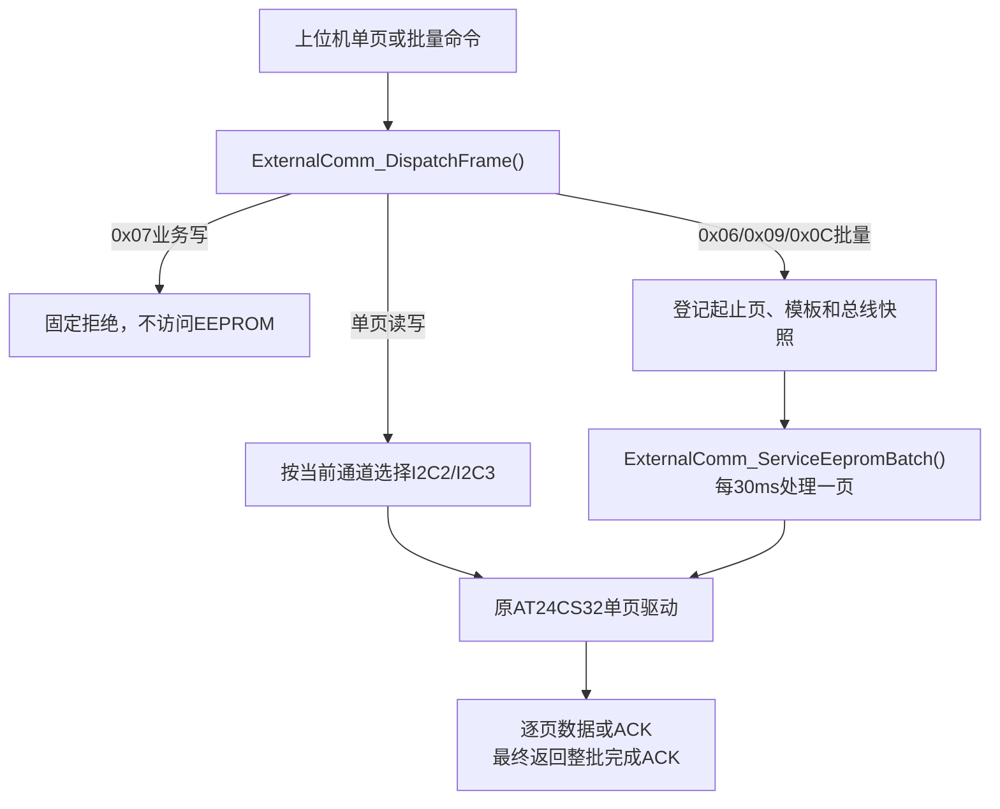

调试外控 EEPROM 时，建议按下面顺序打断点：

| 断点 | 正常值 | 异常说明 |
| --- | --- | --- |
| `ExternalComm_DispatchFrame()` | 0x07固定拒绝；0x06/0x09/0x0C进入批量登记 | 帧头、长度、CRC 或功能码不对 |
| `ExternalComm_MapAreaToPageIndex()` | 0x05业务区域码映射到预期页；09/0A分别映射Page7/10 | Page7/10只允许原始读取，不能进入业务写路径 |
| `ExternalComm_CurrentBusIsI2C3()` | 批量开始时只调用一次并保存总线 | 未选中手柄时不能启动批量操作 |
| `ExternalComm_StartNavBatch()` | 起止页12~128，写入时外控有效，手柄和A/B泵均停止 | 长度、范围、外控权、运行状态或忙状态不满足；启动失败对象为FF |
| `ExternalComm_ServiceEepromBatch()` | 每次任务只推进一页 | 当前页、总线快照或批量操作类型异常 |
| `AT24CS32_WritePage_I2C2/I2C3()` | 返回成功 | I2C 总线、器件、页地址或写保护异常 |
| `AT24CS32_GetLastDebugInfo()` | `hal_status == 0` | BUSY/TIMEOUT/ERROR 时优先查线束和上拉 |

### 5.4.5 运行参数、持久化参数和 Flash

当前主控运行态参数主要在公共状态中流动，手柄相关持久化主要在 AT24CS32 EEPROM。工程里虽然有 `flash.c` 驱动，但当前主控核心业务没有把它作为主要参数保存入口使用。不要把 Flash 驱动存在等同于“所有设置都会掉电保存”。

| 修改动作 | 修改对象 | 是否掉电保存 | 什么时候生效 |
| --- | --- | --- | --- |
| 屏幕调速 | `WorkMessage` 或当前通道记忆 | 否 | 当前通道立即或下次任务周期 |
| 手柄按键调速 | `WorkMessage` 或当前通道记忆 | 否 | 当前通道立即或下次任务周期 |
| 外控设置运行参数 | `WorkMessage`、`MemoryMsgA/B`、`pumpMessageA/B` | 否 | 外控命令通过后立即进入运行态 |
| 外控写业务 Page2~Page11 | 不允许 | 否 | 主控固定返回不支持，不访问 EEPROM |
| 外控写导航 Page12~Page128 | 当前通道 EEPROM 导航数据 | 是 | 单页或批量写成功后立即落盘；批量写每页使用同一模板 |
| 修改源码宏 | `.h` 或 `.c` 编译常量 | 固件重新烧录后生效 | 重新编译、烧录、上电 |

最容易误判的场景是：外控先设置当前速度，再读 Page4，发现 Page4 没变。这是正常现象，因为设置当前速度只修改运行态，业务 EEPROM 又被协议明确保护为只读。业务参数必须由受控生产/维护流程修改，不能通过外部控制协议写入。

### 5.5 A/B 通道规则

当前规则：

| 场景 | 行为 |
| --- | --- |
| 待机插入 A 或 B，识别通过 | 可自动选中该通道，并装载到 `WorkMessage` |
| 待机当前通道拔出，另一通道在线 | 可回落到另一在线通道 |
| 运行中插入另一路 | 只更新那一路 `MemoryMsg`，不抢当前 `WorkMessage` |
| 运行中拔出非当前通道 | 不影响当前运行 |
| 运行中拔出当前通道 | 必须停止或进入保护，不自动切到另一通道 |
| A 认证失败 | 报警 10 |
| B 认证失败 | 报警 12 |
| A/B 都失败 | 报警 14 |

调试重点：

| 断点 | 看什么 |
| --- | --- |
| `HandlescanA_Fun_SSC()` / `HandlescanB_Fun_SSC()` | 状态机走到哪一步 |
| `AT24CS32_VerifyCrc_I2C2()` / `AT24CS32_VerifyCrc_I2C3()` | 认证返回码 |
| `Handlescan_UpdateRecognizeMessage()` | 识别缓存是否被写入 |
| `SendKeyBehMessage(PLUGunPLUG, SCREENKey_PLUG_A/B)` | 插入事件是否投递 |
| `PlugORunPLUGActive()` | 插拔事件是否落地 |
| `Pubinterface_SaveRecognizeToMemory()` | 识别缓存是否写入通道记忆 |
| `Pubinterface_LoadChannelMemory()` | 通道记忆是否装载为当前工作 |

正常插入 A 的完整路径：

```text
短接 IO 低电平
-> HandlescanA_Fun_SSC()
-> 插入去抖
-> BoardProfile_MapHandlePhysicalChannel(CHANNEL_A)
-> `HANDLE_PHYSICAL_AB_SWAP_ENABLE=1U` 时进入 AT24CS32_VerifyCrc_I2C3()；设为 `0U` 时进入 I2C2
-> 读取 Page2/Page3/Page4/Page6 或等待 RFID
-> ChannelrecognizeMessageA
-> SendKeyBehMessage(PLUGunPLUG, SCREENKey_PLUG_A)
-> KeyBehaviors()
-> PlugORunPLUGActive()
-> MemoryMsgA
-> Pubinterface_LoadChannelMemory(CHANNEL_A)
-> WorkMessage
-> UI / 外控心跳 / 电机和泵后续读取
```

### 5.6 手柄扫描源码依据

短接检测和时间参数集中在 `handlescan.c` 前部。当前现场定义是低电平表示插入候选，高电平表示拔出候选：

```c
#define HANDLESCAN_A_SHORT_GPIO               BOARD_RES_HANDLESCAN_A_SHORT_PORT
#define HANDLESCAN_A_SHORT_PIN                BOARD_RES_HANDLESCAN_A_SHORT_PIN
#define HANDLESCAN_B_SHORT_GPIO               BOARD_RES_HANDLESCAN_B_SHORT_PORT
#define HANDLESCAN_B_SHORT_PIN                BOARD_RES_HANDLESCAN_B_SHORT_PIN

#define HANDLESCAN_TASK_PERIOD_MS             10U
#define HANDLESCAN_INSERT_DEBOUNCE_MS         50U
#define HANDLESCAN_REMOVE_DEBOUNCE_MS         500U
#define HANDLESCAN_VERIFY_START_DELAY_MS      200U
#define HANDLESCAN_VERIFY_RETRY_DELAY_MS      200U
#define HANDLESCAN_VERIFY_ALARM_RETRY_MS      1000U
#define HANDLESCAN_VERIFY_RETRY_MAX           3U
#define HANDLESCAN_RFID_VERIFY_RETRY_MAX      2U
```

这些宏的调试含义：

| 宏 | 修改影响 | 验证方法 |
| --- | --- | --- |
| `HANDLESCAN_TASK_PERIOD_MS` | 改变整个手柄扫描节拍，也改变所有 tick 换算 | 插拔 20 次，确认不会漏检或误拔 |
| `HANDLESCAN_INSERT_DEBOUNCE_MS` | 影响插入响应速度和抗抖能力 | 慢插、快插、轻晃插头，确认不上线误判 |
| `HANDLESCAN_REMOVE_DEBOUNCE_MS` | 影响拔出确认速度和接触瞬断保护 | 运行中轻碰插头，确认不会错误拔出 |
| `HANDLESCAN_VERIFY_START_DELAY_MS` | 影响热插拔后 I2C 稳定等待 | 插入后看首次 I2C 是否 NACK |
| `HANDLESCAN_VERIFY_RETRY_MAX` | 影响 EEPROM 偶发失败后是否快速恢复 | 模拟一次 I2C 失败，看是否重试上线 |
| `HANDLESCAN_VERIFY_ALARM_RETRY_MS` | 影响坏手柄保持插入时自恢复频率 | 坏手柄修复后不拔出，确认能恢复 |

手柄状态枚举如下。调试时看到 `stage` 只停在某一阶段，就沿该阶段的输入条件查：

```c
typedef enum
{
    HANDLESCAN_STAGE_IDLE = 0,
    HANDLESCAN_STAGE_DEBOUNCE_IN,
    HANDLESCAN_STAGE_WAIT_VERIFY,
    HANDLESCAN_STAGE_VERIFY,
    HANDLESCAN_STAGE_READ_INFO,
    HANDLESCAN_STAGE_WAIT_RFID_TOOL,
    HANDLESCAN_STAGE_ONLINE,
    HANDLESCAN_STAGE_DEBOUNCE_OUT,
    HANDLESCAN_STAGE_RETRY_WAIT,
    HANDLESCAN_STAGE_VERIFY_FAIL
} HandlescanStage;
```

| 停留阶段 | 正常下一步 | 长时间停留说明 |
| --- | --- | --- |
| `IDLE` | 短接低电平后进 `DEBOUNCE_IN` | 短接 IO 没变化、引脚映射错误、线束未闭合 |
| `DEBOUNCE_IN` | 50ms 稳定后进 `WAIT_VERIFY` | 插入信号抖动、插头接触不稳 |
| `WAIT_VERIFY` | 200ms 后进 `VERIFY` | tick 没走、任务未周期执行 |
| `VERIFY` | 认证通过进 `READ_INFO` | EEPROM 不响应、Page1 失败、SN 读取失败、CRC 不匹配 |
| `READ_INFO` | 写识别缓存或等待 RFID | Page2/Page3/Page4/Page6 解析失败 |
| `WAIT_RFID_TOOL` | RFID 成功后在线 | RFID 串口、标签、自动识别流程异常 |
| `ONLINE` | 拔出候选进 `DEBOUNCE_OUT` | 正常在线态，后续问题看公共接口 |
| `VERIFY_FAIL` | 1000ms 慢重试 | 坏手柄、错误 EEPROM 数据、I2C 总线硬故障 |

手柄型号映射来自 Page2 前两个字节。示例表项：

```c
static const HandlescanHandleTypeConfig s_hand_type_config_table[] =
{
    {0x6B, 0x01, TMBB_ONLINES, "TMBB"},
    {0x6B, 0x02, TMBA_ONLINES, "TMBA"},
    {0x6B, 0x03, EMBA_ONLINES, "EMBA"},
    {0x6B, 0x04, EMBB_ONLINES, "EMBB"},
    {0x6B, 0x05, PXBA_ONLINES, "PXBA"},
    {0x6B, 0x06, PXBB_ONLINES, "PXBB"},
    {0x7C, 0x03, PX_YIM_ONLINES, "PXYTM"},
    {0x7C, 0x04, PX_YIP_ONLINES, "PXYTP"}
};
```

MXYTP和MXYTM不是Page2手柄型号，而是公共接头手柄上由RFID EPC识别的无刷刀具。固定方向、机械往复和反旋规则如下：

| 身份来源 | 界面方向 | 输入门禁 | 驱动实际方向 |
| --- | --- | --- | --- |
| EEPROM手柄TMBA、TMBB、EMBA、EMBB、JMB | Page4默认方向高亮，其它两个方向显示灰色禁用图标 | 触屏、实体键/HMI和外控换向全部拒绝 | 按Page4默认方向 |
| RFID 0x01刨刀具 | 按EPC byte10进入正转、反转或往复；默认往复频率4Hz | 保留正转、反转和电动往复选择 | 跟随界面方向 |
| RFID 0x02磨刀具 | 按EPC byte10进入正转或反转 | 可在正转和反转间切换，禁止电动往复 | 跟随界面方向 |
| RFID 0x03反旋刀具 | EPC byte10指定的正转或反转方向高亮，其它方向显示灰色禁用图标 | 本地和外控换向全部拒绝 | 正转显示下发反转，反转显示下发正转 |
| RFID 0x04 MXYTP | 往复高亮，正转和反转显示灰色禁用图标 | 本地和外控换向全部拒绝；不开放电动往复频率设置 | UART1始终下发正转，由刀具机械结构实现往复 |
| RFID 0x05 MXYTM | EPC byte10指定的正转或反转方向高亮，其它方向显示灰色禁用图标 | 本地和外控换向全部拒绝 | 跟随标签方向 |
| 其它支持换向型号 | 按能力显示可选方向 | 电机停止且方向能力允许时可切换 | 按当前业务方向 |

灰色图标只表示不可选择，不代表隐藏。显示层由`Pubinterface_RefreshSelectedChannelDisplay()`写入禁用资源，`ScreenKey_CanUse()`、`DirActive()`和`ExternalComm_SetDirection()`继续构成实际换向门禁。

Page2 能识别手柄型号后，系统仍不能直接启动电机。还必须继续完成 Page3/4/6 或 RFID 刀具信息解析，因为速度范围、方向能力、往复频率、默认注水、刀具减速比都在后续页面。

### 5.7 手柄上线后的状态落地

手柄识别成功后，真正改变整机状态的不是 I2C 读取函数，而是插入事件落地。路径如下：

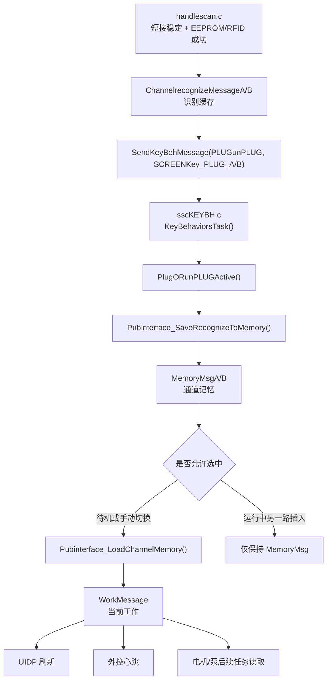

关键判断点：

| 判断点 | 应看变量 | 正常值 | 异常解释 |
| --- | --- | --- | --- |
| 识别是否完成 | `ChannelrecognizeMessageA/B.handle_type` | 非 0 或对应型号 | EEPROM/RFID 仍未解析成功 |
| 插入事件是否投递 | `SendKeyBehMessage()` 返回路径 | 队列收到 `SCREENKey_PLUG_A/B` | 队列满、任务未运行或事件未发 |
| 通道记忆是否写入 | `MemoryMsgA/B.hand_model` | 等于识别到的手柄型号 | 插拔事件未执行或保存函数提前返回 |
| 当前通道是否切换 | `WorkMessage.channel_work` | 待机插入可为 A/B | 运行中另一路插入不应改变 |
| UI 是否刷新 | `SendUIDSMessage(UI_HANDLE_ID, ...)` | enable 为 true，通道号正确 | UI 队列、图标映射或屏幕通信异常 |
| 外控是否显示在线 | 心跳中的手柄在线字段 | 对应通道在线 | 心跳组帧未读取最新状态 |

### 5.8 手柄识别现场调试流程

#### A 手柄插入不上线

按下面顺序排查，不要直接从 UI 显示开始：

1. 断在 `HandlescanA_Fun_SSC()`，观察短接 IO 原始电平。正常插入应进入低电平候选。
2. 观察 A 通道 `stage` 是否从 `IDLE` 进入 `DEBOUNCE_IN`，再进入 `WAIT_VERIFY`。
3. 先查目标固件的 `HANDLE_PHYSICAL_AB_SWAP_ENABLE`：值为 `1U` 时断在 `AT24CS32_VerifyCrc_I2C3()`，值为 `0U` 时断在 `AT24CS32_VerifyCrc_I2C2()`，记录返回码。
4. 若认证失败，读取 `AT24CS32_GetLastDebugInfo()`，记录设备地址、内部地址、长度、HAL 状态和 HAL 错误码。
5. 若认证通过但不上线，断在 `Handlescan_UpdateRecognizeMessage()`，看 `ChannelrecognizeMessageA` 是否写入手柄型号、刀具类型、速度范围。
6. 断在 `SendKeyBehMessage(PLUGunPLUG, SCREENKey_PLUG_A)`，确认事件是否投递。
7. 断在 `PlugORunPLUGActive()`，确认 `WorkMessage.Channel_Aonline` 和 `MemoryMsgA.hand_model` 是否更新。
8. 断在 `Pubinterface_LoadChannelMemory(CHANNEL_A)`，确认待机时是否装载到 `WorkMessage`。
9. 最后看 `UIDISPLAYBehaviorTask()` 和 UART6 发送，确认 UI 是否只是显示未刷新。

#### 运行中插入 B 导致 A 参数变化

该现象违反“运行中另一路不能抢当前工作通道”的规则。按下面变量判断：

| 位置 | 正常值 | 异常含义 |
| --- | --- | --- |
| `WorkMessage.channel_work` | 仍为 A | 被错误切到 B |
| `WorkMessage.hand_model` | 仍为 A 手柄型号 | 被 B 覆盖 |
| `WorkMessage.speed_set_work` | 仍为 A 原速度 | B 的 Page4 默认速度被装载 |
| `MemoryMsgB.hand_model` | 更新为 B 型号 | B 识别落地正常 |
| `Pubinterface_LoadChannelMemory()` | 不应在运行中自动装载 B | 插拔策略被破坏 |

#### 拔出当前通道后机器行为异常

当前通道拔出和非当前通道拔出不是一回事：

| 场景 | 期望行为 | 调试入口 |
| --- | --- | --- |
| 待机拔出非当前通道 | 只清对应在线状态和 UI | `PlugORunPLUGActive()` |
| 待机拔出当前通道，另一通道在线 | 可回落显示另一通道 | `Pubinterface_LoadChannelMemory()` |
| 运行中拔出非当前通道 | 不影响当前电机输出 | `WorkMessage.channel_work` |
| 运行中拔出当前通道 | 停止或保护，不能自动切到另一通道继续跑 | `WorkAlarm_Set()`、`MotorStops()` |

记录模板：

```text
动作：运行中插入/拔出 A 或 B
插入前：
  WorkMessage.channel_work =
  WorkMessage.runflag_work =
  WorkMessage.hand_model =
  MemoryMsgA.hand_model =
  MemoryMsgB.hand_model =

插拔事件中：
  HandlescanStage =
  verify_result =
  SendKeyBehMessage key =
  PlugORunPLUGActive key =

插拔事件后：
  WorkMessage.channel_work =
  WorkMessage.runflag_work =
  MemoryMsgA.hand_model =
  MemoryMsgB.hand_model =
  alarm_flag/alarm_value =
  UI_HANDLE_ID 是否刷新 =
```

### 5.9 RFID 读取模式、地区和当前限制

RFID 由 `sscRFID.c` 的 100ms 任务按请求读取 EPC，识别结果再由 `handlescan.c` 写入对应通道缓存。当前只使用 12 字节 EPC，不把 RFID 任务直接当作手柄在线真值；手柄短接、EEPROM 鉴权和 RFID 结果共同决定最终状态。

| 配置或状态 | 当前值 | 入口 | 影响 |
| --- | --- | --- | --- |
| 地区频段 | `RFID_REGION_US`（`0x02`） | `User/Application/Beep/sscRFID.c:RFID_REGION_SELECT` | 生成美国902.25～927.75MHz区域命令和校验和；交付前仍需核对销售地区法规 |
| 发射功率 | `RFID_TX_POWER_10_DBM_X100`（10dBm） | `User/Application/Beep/sscRFID.c:RFID_TX_POWER_SELECT` | 生成唯一功率命令和校验和；可选0、10、13、15dBm，A/B模块使用同一功率 |
| 跳频配置 | `AD FF`固定开启 | `User/Application/Beep/sscRFID.c:hop_ch` | A/B物理模块初始化时在功率和地区设置后开启跳频；当前没有F0抗噪、F2/F3扫描、A9动态列表或F1读回流程 |
| 请求/应答与确认掉线统计 | `1` | `User/Hardware/include/board_profile.h:RFID_LINK_STATS_ENABLE` | 1时分别累计A/B读取命令、有效应答、丢失应答、异常帧、在线监测完成和确认掉线，并追加A6版本2；0时不分配计数状态且恢复原心跳格式 |
| RFID 硬件模式 | 按硬件选择 | `User/Hardware/include/board_profile.h:RFID_USE_DUAL_UART_MODE` | `0`为UART3加R200-K8，`1`为UART3/UART9双串口；交付值以目标硬件编译配置为准 |
| R200-K8通道交换 | 按线束选择 | `User/Hardware/include/board_profile.h:RFID_R200_AB_SWAP_ENABLE` | 仅单串口模式生效；`0`同侧映射，`1`交换逻辑A/B选通，高低电平物理定义不变 |
| 请求队列与事务门禁 | 4项、全局1个活动事务 | `RFID_QUEUE_LENGTH`、`Rfid_RequestToolReadTracked()` | A/B独立生成非零票据；同通道重复请求合并，另一通道FIFO等待，活动事务结束前禁止后续启动请求替换 |
| 跨周期接收缓存 | `2 × UART包缓存` | `RFID_RX_ACCUM_SIZE`、`Rfid_AppendReceiveData()` | DMA短帧和半帧跨100ms周期累计；收到分片后暂停一次补发，事务结束或取消时清缓存 |
| 快速/普通发送与硬超时 | 10/3次；15/5个100ms周期 | `RFID_FAST/NORMAL_ATTEMPTS`、`RFID_FAST/NORMAL_HARD_TIMEOUT_TICKS` | 完整EPC提前成功；尝试耗尽且无待收半帧，或达到硬超时，才发布明确超时终态 |
| 首次等待 | 900ms，最多2轮 | `handlescan.c:HANDLESCAN_RFID_WAIT_TIMEOUT_MS`、`HANDLESCAN_RFID_VERIFY_RETRY_MAX` | 手柄上线后等待刀具EPC，整体约2秒 |
| 在线监测与掉线判断 | 500ms启动间隔，连续6次TIMEOUT | `HANDLESCAN_RFID_MONITOR_PERIOD_MS`、`HANDLESCAN_RFID_MISS_MAX` | 只结算匹配票据；SUCCESS清零、TIMEOUT加1、CANCELED不计数，标称约3秒确认掉线，排队时可能更长 |
| PXB/公共接头掉线语义 | 分体锁存/公共清除 | `Handlescan_ClearOnlineRfidTool()`、`Handlescan_ProcessOnlineRfidResult()` | PXBA/PXBB临时掉线保留参数并静音，同标签恢复静音、新标签响；公共接头掉线清刀具并响，同标签重新上线也响 |
| 调试蜂鸣 | 均为0 | `RFID_DEBUG_BEEP_EVERY_UART_RESPONSE`、`RFID_DEBUG_BEEP_EVERY_VALID_READ` | UART响应开关可临时定位；有效读取开关当前无引用，单改不会生效 |

`s_request_attempts_left`只在实际发送EPC读取命令后递减。RFID任务以票据发布`SUCCESS`、`TIMEOUT`或`CANCELED`终态；handlescan只结算本通道当前票据，因此排队或活动事务不会被下一条请求替换，业务取消也不会被误记为标签缺失。PXBA/PXBB自动识别按钮在等待、已识别和参数锁存状态均保持显示；切回手动模式后停止RFID轮询，重新进入自动模式时先装载EEPROM手动参数并等待新标签。

## 6. 输入链路原理

### 6.1 按键队列为什么存在

屏幕、手柄、脚踏按键最终大量汇入 `SendKeyBehMessage()`，由 `KeyBehaviorsTask()` 周期消费。这样做是为了让输入事件集中走同一套业务函数，避免屏幕和手柄各自复制调速、切通道、切方向逻辑。

统一分发关系：

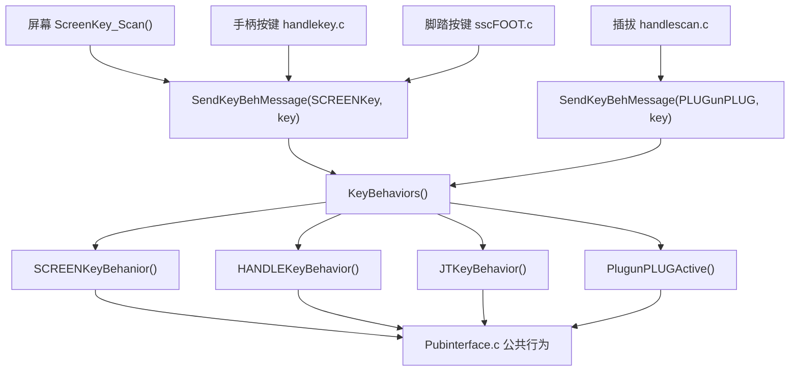

关键队列：

| 项 | 当前值 |
| --- | --- |
| 队列 | `KeyBehivQueue` |
| 深度 | 20 |
| 普通按键等待 | 0 |
| 插拔/RFID 刷新等待 | 60ms |
| 消费周期 | 30ms |

### 6.2 屏幕输入

屏幕是 DWIN 串口屏，UART6 收到 `0x5A 0xA5 ... 0x83` 后由 `ScreenKey_Scan()` 解析。屏幕上不同区域的 key 会被转成内部 `SCREENKey_*`。

几个关键设计点：

1. 屏幕触摸不直接运行电机，仍然走按键队列和公共接口。
2. 触控运行不是一次点击启动，而是持续收到 `0x5520` 保活。
3. `SCREENKey_TouchKeepAlive` 持续收到才保持触控运行，超时后只停止运行，不一定退出触控模式。
4. `UIDP_PUMP_DISPLAY_AB_MIRROR_SWAP_ENABLE` 影响泵显示和触摸映射，但不等于物理泵 UART 互换。

触控保活路径：

```text
屏幕持续发送 0x5520
-> ScreenKey_PostLegacyAction()
-> ScreenKey_ResetTouchKeepAlive()
-> SendKeyBehMessage(SCREENKey, SCREENKey_TouchKeepAlive)
-> SCREENKeyBehanior()
-> 触控运行状态写入 WorkMessage
-> MOTORRUN() 周期输出
```

如果停止发送保活，`ScreenKey_ServiceKeepAlive()` 计数超时，调用 `Pubinterface_StopTouchKeepAliveRun()` 停止电机和跟随泵，但保留触控模式。

触控工作窗只打开、尚未收到运行保活时，若当前选中手柄被拔出，插拔事件会在原有通道回落或无手柄清屏完成后复用 `SCREENKey_TouchEXIT` 退出链，关闭70号工作窗、清除本机触控占用并释放屏幕owner。拔出非当前通道不关闭当前触控窗；触控已经运行时仍执行立即停机和手柄未连接报警，并等待用户松开触控运行按钮后再完成报警退出。

### 6.2.1 屏幕输入源码依据

屏幕输入从 UART6 DMA 缓冲区取帧。当前实现已经拆成“DMA取数、同包扫描、单帧分发”三层，不能再按旧的单帧 `rlen/slen/dat1` 代码理解：

```c
void ScreenKey_Scan(void)
{
  uint8_t dat[UART6_MAX_PACKET_SIZE] = {0U};
  uint16_t rlen = Uart6_DMARecvDataPeek(dat);

  if (rlen >= SCREENKEY_MIN_FRAME_SIZE)
  {
    ScreenKey_ParseRxData(dat, rlen);
  }
}

/* ParseRxData 逐字节跳过噪声，按 LEN+3 校验9~16字节完整帧，
 * 同一DMA块内可连续分派多帧；DispatchFrame按VP和key映射业务动作。 */
```

输入帧为 `5A A5 LEN 83 VP_H VP_L WORD_COUNT DATA_H KEY ...`，整帧长度是 `LEN+3`，当前业务取 `frame[8]` 为 key。解析器没有 CRC，不保留跨 DMA 周期的半帧，但可跳过前导噪声并处理同一 DMA 数据块内的粘连帧。完整映射如下：

| VP | key | 转换结果 |
| --- | --- | --- |
| `0x2001` | 1 | 启动页脚踏定标入口；约4秒窗口内累计五次后，第五次发出100ms蜂鸣并切换到Page3独占定标模式 |
| `0x2400` | 1/2/3/4/5/6/7 | A通道、B通道、开合正向、开合反向、磨削、刨削、自动识别 |
| `0x2401` | 1/2/3/4 | 速度大减、小减、小加、大加 |
| `0x2402` | 1/2/3 | 正转、往复、反转 |
| `0x2403` | 1/2 | 频率减、频率加 |
| `0x2404` | 1/2/3/4 | 脚控、手控、触控、HMI/外控退出 |
| `0x2405` | 1/2/3 | A泵加、减、启停；镜像宏开启时映射逻辑B |
| `0x2406` | 1/2/3 | B泵加、减、启停；镜像宏开启时映射逻辑A |
| `0x2407` | 2 | 退出触控 |
| `0x2420` | 1/2/3/4/7/8 | 左低、左高、右低、右高、左中、右中定标事件 |
| `0x5520` | 任意 | `SCREENKey_TouchKeepAlive`；地址命中即处理，不校验key值 |

### 6.2.2 启动期脚踏定标

脚踏定标只在上电启动页约4秒窗口内进入。屏幕每发送一次 `0x2001/key1`，`UI_Start_Fun()`只累计一次；前四次不切页也不蜂鸣，第五次才发出100ms蜂鸣、强制切换到 Page3，并进入不会主动返回的独占定标循环；退出方式为重新上电。此时运行期电机、泵、外控、脚踏控制和蜂鸣队列均未创建，因此启动入口和六个保存按钮使用启动期直接GPIO蜂鸣，不提前创建蜂鸣任务，也不改变运行期蜂鸣队列状态机。

定标页按脚踏合法回包识别类型并开放保存键：

| 识别类型 | 页面可用保存点 | 页面显示 |
| --- | --- | --- |
| 单踏板 `1` | 左低、左高 | 左实时值、左低/高Flash值；中点和右侧清零 |
| 双段踏板 `2` | 左低、左中、左高 | 左实时值和左侧三点Flash值；右侧清零 |
| 双脚踏 `3` | 左右两组低、中、高 | 左右实时值和两组三点Flash值 |

Page3的 `0x2420` 区域仍使用 key1/2/3/4/7/8 分别保存左低、左高、右低、右高、左中、右中；六个保存按钮每次触发先发出100ms蜂鸣，脚踏实体按键调试事件不增加蜂鸣。主控只发送写命令，不把当前AD直接当作保存成功；页面必须等脚踏后续合法回包带回Flash值才更新。约1秒没有合法脚踏帧时，定标类型、实时值和存储值清零。该专用解析严格校验10/18/24字节帧的CRC；运行期 `sscFOOT.c` 的兼容解析规则不因本功能改变。

触控运行的核心不是“点一下启动”，而是屏幕持续发保活帧。源码中保活逻辑的关键片段如下：

```text
SCREENKEY_TOUCH_KEEPALIVE_TIMEOUT_TICKS = 14
ScreenKey_ServiceKeepAlive():
  若HMI外控占用：复位本机触控计时并返回
  若不是触控模式：复位计时和报警松手锁存并返回
  若触控待机且未运行：保持运行超时计数为0
  若报警后等待松手：仅在未收到原始0x5520时累计释放计时
  若电机正在运行且未收到保活：每30ms累计一次
  达到14次：Pubinterface_StopTouchKeepAliveRun()
```

这段保活代码要注意两个分支：

| 分支 | 含义 | 现场表现 |
| --- | --- | --- |
| 当前不是触控运行 | 直接把计数置到超时值并返回 | 非触控模式下不会误触发触控停机 |
| 当前是触控运行且计数超时 | 调用 `Pubinterface_StopTouchKeepAliveRun()` | 屏幕停止连续发送 `0x5520` 后，主控主动停电机 |

因此触控运行不是“一次启动后一直跑”。屏幕必须持续发送保活帧，主控每个周期用计数判断屏幕是否还在控制。屏幕任务周期为 30ms，当前 14 个周期对应约 420ms；源码附近仍有“7周期/约200ms”的旧注释时，应以宏和任务周期计算结果为准。调试时如果触控运行自动停，先抓 UART6 是否持续有 `0x55 0x20` 区域帧，再看 `s_touch_keepalive_ticks` 是否被 `ScreenKey_ResetTouchKeepAlive()` 清零。

调试屏幕输入时：

| 断点 | 正常值 | 异常说明 |
| --- | --- | --- |
| `Uart6_DMARecvDataPeek()` | `rlen >= 9` 且数据含 `5A A5` | UART6、DMA、屏幕波特率或线束异常 |
| `ScreenKey_Scan()` | `dat[i+3] == 0x83` | 屏幕发的不是读变量帧 |
| `ScreenKey_PostLegacyAction()` | `screen_key != 0` | VP 地址或 key 表不匹配 |
| `SendKeyBehMessage(SCREENKey, screen_key)` | 队列发送成功 | `KeyBehivQueue` 未创建或队列满 |
| `SCREENKeyBehanior()` | 进入对应 `SpeedActive/DirActive/PUMPActive` | 队列消费任务未运行 |
| `ScreenKey_ServiceKeepAlive()` | 保活期间计数被清零 | `0x5520` 没有持续发送 |

屏幕泵 A/B 显示镜像只影响触摸区和显示区映射：

```c
#if (UIDP_PUMP_DISPLAY_AB_MIRROR_SWAP_ENABLE == 1U)
  /* 屏幕原 A 区实际对应逻辑 B 泵 */
#else
  /* 屏幕原 A 区对应逻辑 A 泵 */
#endif
```

它不改变 UART5/UART7 物理输出。物理输出互换只看 `PUMP_LOGICAL_AB_PHYSICAL_SWAP_ENABLE`。

### 6.3 脚踏输入

脚踏分两条链路：

1. `Foot_ParseDataS()` 10ms 解析 UART4 实时数据，产生 `footmessage`。
2. `FootControlTask()` 25ms 消费脚踏状态，根据踏板行程控制电机和注水泵。

外部通信持有控制权时，`FootControlTask()`仍消费脚踏上线/掉线消息并刷新 `ControlSignalMessage.jt_enable_flag`、主屏脚踏图标和外控心跳字段，但收到连接状态后立即退出，不执行踏板行程、电机、泵或切通道逻辑。这样拔出脚踏后约1秒会正常显示黑色离线图标，同时外控 owner 和输出状态保持不变。外控切换 A/B 通道时只装载目标通道参数并保持 `WorkMessage.drivetype_work=TOUCHWORK`，不会因为脚踏在线而短暂高亮脚控；退出外控后再恢复原有脚踏优先规则。

启动期约3秒的界面补刷中，如果A/B手柄均离线但脚踏已经在线，`Pubinterface_ClearSelectedChannelDisplay()`会直接刷新脚踏最终图标状态，再分别把手控、触控保持为灰色不可用，不再通过整组暗态刷新制造脚踏图标的黑亮往返。脚踏也离线时仍整组刷新为暗态。该处理只改变屏幕消息顺序，不改变脚踏在线标志、离线超时、控制优先级或运行请求。

脚踏不是简单开关。它还承担：

| 功能 | 原理 |
| --- | --- |
| 单踏板行程控制 | 按低点、高点和实时 AD 换算 `WorkMessage.speed_work` |
| 双踏板 A/B 切换 | 左/右踏板可触发通道切换，并要求松脚确认 |
| 注水泵跟随 | 电机进入运行后调用 `Pubinterface_SetHandleInjectionPumpRun(true)` |
| 松脚去抖 | 单踏板释放有 3 个 25ms 周期去抖 |
| 控制权仲裁 | 启动前必须拿到 `CONTROL_OWNER_FOOT` |

脚踏启动路径：

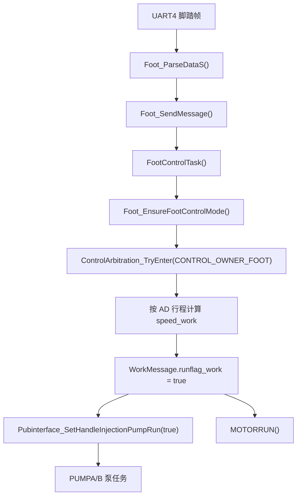

### 6.3.1 脚踏启动前置条件

脚踏不是只要 AD 大于阈值就能启动。`Foot_EnsureFootControlMode()` 会先做一组安全检查：

```c
static bool Foot_EnsureFootControlMode(void)
{
    if (WorkMessage.drivetype_work != JTWORK)
    {
        return false;
    }

    if ((WorkMessage.channel_work == CHANNEL_NONE) || (WorkMessage.hand_model == 0U))
    {
        Foot_ReportHandleNotConnectedAlarm();
        return false;
    }

    if (ControlArbitration_IsExternalActive() ||
        ControlSignalMessage.HMI_control_flag ||
        (WorkMessage.touchactive_work == TOUCHWORK))
    {
        return false;
    }

    if (ControlArbitration_IsBusyByOther(CONTROL_OWNER_FOOT))
    {
        return false;
    }

    if (WorkMessage.alarm_flag == true)
    {
        return false;
    }

    return true;
}
```

这段前置检查按“模式、通道、互斥、报警”四层阻断脚踏：

| 层级 | 代码条件 | 为什么要挡住 |
| --- | --- | --- |
| 模式 | `drivetype_work != JTWORK` | 当前不是脚控模式时，脚踏 AD 不应该偷偷启动电机 |
| 通道 | `channel_work == CHANNEL_NONE` 或 `hand_model == 0` | 无当前手柄时无法确定电机类型、速度范围和方向 |
| 互斥 | 外控、HMI、触控任一占用 | 避免脚踏和其它控制源同时改 `runflag_work` |
| owner | `ControlArbitration_IsBusyByOther()` | 电机正在被其它本地来源控制时不抢占 |
| 报警 | `alarm_flag == true` | 真实报警状态下禁止脚踏启动 |

现场排查脚踏“踩了没反应”时，按这张表从上往下看。只要某一层返回 false，后面的速度换算和电机启动都不会执行。

这段检查解释了几个现场现象：

| 现象 | 原因 | 断点和变量 |
| --- | --- | --- |
| 踩脚踏无反应 | 当前不是脚控模式 | `WorkMessage.drivetype_work` 是否为 `JTWORK` |
| 踩脚踏弹手柄未连接 | 当前没有有效工作通道或手柄型号 | `channel_work`、`hand_model` |
| 外控授权后脚踏无效 | 外控占用控制权 | `ControlArbitration_IsExternalActive()` |
| 触控页面还开着时脚踏无效 | 触控占用或锁存 | `WorkMessage.touchactive_work` |
| 报警后脚踏不启动 | 真实报警阻止运行 | `alarm_flag/alarm_value` |

### 6.3.2 脚踏行程速度换算

脚踏进入运行段后不是从 0rpm 起调，而是在“当前方向最小速度”到“当前设定上限”之间线性映射。活动实现是 `sscFOOT.c:Foot_BuildTravelMotorSpeed()`：

```text
min_speed = 当前方向 EEPROM/RFID 最小速度
max_speed = WorkMessage.speed_set_work
若 max_speed == 0：回退当前方向默认速度，并同步写回 speed_set_work
effective_high = high_adc - high_margin（仅区间足够大时）
clamped_adc = clamp(ad_value, low_adc, effective_high)
speed_work = min_speed
           + (max_speed - min_speed)
           * (clamped_adc - low_adc)
           / (effective_high - low_adc)
```

计算使用 64 位整数乘法，最终速度再次钳到 `[min_speed,max_speed]`；若 `min_speed>max_speed`，先把最小速度降到最大速度；若有效高点不大于低点，直接安全返回最小速度，避免除零。`FOOT_PEDAL_SPEED_HIGH_MARGIN=30U` 只用于 JTD 当前通道分支的高端死区，跨通道切换分支和单踏板不扣该余量。

调试时要同时记录下列量，最终观察 `speed_work`，不能用只表示上限的 `speed_set_work` 代替实时结果：

| 变量 | 正常含义 | 异常风险 |
| --- | --- | --- |
| 当前实时 AD | 单踏板、JTB或JTD对应侧的行程值 | 噪声、未更新、超范围 |
| 低/高定标值 | 当前运行段两端 | 高点不大于低点时只输出最小速度 |
| 当前方向最小速度 | `speed_zzmin/speed_fzmin/speed_oscmin` | 配置过大时脚踏一进入运行即高速 |
| `WorkMessage.speed_set_work` | 当前通道速度上限 | 为0时回退当前方向默认速度 |
| `WorkMessage.speed_work` | 本周期脚踏实际目标rpm | 应随行程在最小速度和上限之间变化 |

脚踏松开不是立即停泵，当前有 3 个 25ms 周期去抖：

```c
#define FOOT_SINGLE_PEDAL_RELEASE_DEBOUNCE_TICKS 3U
```

这表示实时 AD 短暂掉到阈值以下时，先认为是抖动，避免注水泵一停一启。若现场感觉松脚后停得慢，先确认这是 75ms 左右的软件去抖，不要直接改泵任务。

### 6.3.3 脚踏和注水泵联动

脚踏运行手柄时，注水泵跟随不是由脚踏直接发 UART5/UART7，而是通过公共接口：

```text
FootControlTask()
-> ControlArbitration_TryEnter(CONTROL_OWNER_FOOT)
-> WorkMessage.runflag_work = true
-> Pubinterface_SetHandleInjectionPumpRun(true)
-> pumpMessageA/B.run_flag = true
-> PUMPABehaviorTask() / PUMPBBehaviorTask()
-> PumpBehaviorCore_Run() / PumpBehavior_SendFrame()
-> UART5 / UART7
```

查“脚踏能启动电机但注水泵不转”时：

| 断点 | 正常值 | 异常说明 |
| --- | --- | --- |
| `FootControlTask()` | 进入运行分支 | 脚踏帧或模式不对 |
| `Pubinterface_SetHandleInjectionPumpRun(true)` | 被调用 | 电机没进入运行态或提前返回 |
| `pumpMessageA/B.type` | 至少一路为 `INJECTWATER` | 压力设备码未识别为注水泵 |
| `pumpMessageA/B.run_flag` | true | 跟随泵未被打开 |
| `pumpMessageA/B.speed_work` | Page4 默认注水或回退值 | 默认流量为 0 或越界 |
| `PUMPABehaviorTask()/PUMPBBehaviorTask()` | 共用内核输出非0 | 被压力闭环或类型判断拦截 |

### 6.3.4 脚踏速度显示和注水泵来源切换

脚踏控制产生的 `WorkMessage.speed_work` 保留完整 rpm 精度并参与电机倍率换算；`sscDrive.c:MotorDrive_QuantizeFootDisplaySpeed()` 只把屏幕显示值向下量化为 100rpm 整数倍。看到屏幕为 1200rpm 时，实际电机目标可能是 12xxrpm，不能用显示值反推驱动帧精确速度。

两段脚踏轻踩只预启动注水泵，不抢占电机 owner。当前实现沿用 `pumpMessageA/B.speed_work` 中的屏幕设定流量，避免先写 Page4 默认流量、随后切入手柄联动时进度条瞬时跳变。轻排切换到手柄冷却联动时会清 `timingDrainage_flag`、`pedalDrainage_flag` 和排空计数，只刷新排空按钮颜色，不使用上一周期 `speed_output` 重画进度条。

三类速度必须分开观察：普通注水和手柄联动受 `PUMP_INJECTWATER_SPEED_MAX=70U` 限制；屏幕定时排空单独使用 `PUMP_TIMING_DRAINAGE_SPEED=100U`；压力闭环允许并准备下发的业务速度保存在 `speed_output`。任何 UI 或外控显示问题都应同时记录这三个来源，物理泵是否转动还要看步进板或水路实测。

### 6.4 手柄按键

手柄普通按键走 `HANDLEKeyBehavior()`，可以调速、调方向、启动停止、开口定位。手柄运行键还会经过专门的运行键处理，启动前必须检查：

1. 当前通道有效。
2. 当前手柄型号有效。
3. 没有真实报警。
4. 控制权没有被外控、脚踏、屏幕触控占用。
5. 当前通道有合法速度和方向。

### 6.4.1 手柄实体运行键

当前手柄实体运行键按 30ms 周期扫描，并用 2 次连续电平确认去抖，约 60ms：

```c
#define HANDLE_KEY_DEBOUNCE_COUNT 2U
#define HANDLE_KEY_PRESSED_LEVEL GPIO_PIN_RESET
```

实体键支持的手柄型号当前只包括空心钻 A/B 型：

```c
static bool HandleRunKey_IsSupportedModel(uint8_t hand_model)
{
    return ((hand_model == PXBA_ONLINES) || (hand_model == PXBB_ONLINES));
}
```

实体键启动前会按通道准备参数：

```c
static bool HandleRunKey_PrepareRunChannel(uint8_t channel)
{
    if (HandleRunKey_IsChannelReady(channel) == false)
    {
        return false;
    }

    if (WorkMessage.channel_work != channel)
    {
        HandleSwitchActive((channel == CHANNEL_A) ? SCREENKey_HANDLE_A : SCREENKey_HANDLE_B);
    }

    HandleRunKey_ApplyHandleMode(channel);

    if (WorkMessage.speed_set_work == 0U)
    {
        WorkMessage.speed_set_work = Pubinterface_GetCurrentDefaultMotorSpeed();
    }

    WorkMessage.speed_work = WorkMessage.speed_set_work;
    return (WorkMessage.speed_work != 0U);
}
```

这段准备函数解决的是“实体键按下时到底启动哪个通道、用哪个默认速度”的问题：

| 代码动作 | 业务意义 |
| --- | --- |
| `HandleRunKey_IsChannelReady(channel)` | 先确认该通道在线、型号支持、记忆已落地 |
| `HandleSwitchActive(...)` | 如果实体键目标通道不是当前通道，先走统一切通道逻辑 |
| `HandleRunKey_ApplyHandleMode(channel)` | 把该通道切到手柄控制模式 |
| `speed_set_work == 0` 时取默认速度 | 防止 Page4 或运行态没有速度导致按键启动后电机不转 |
| `speed_work = speed_set_work` | 把设定速度变成当前输出速度 |

如果实体键按下后只切了通道但电机不转，优先看这个函数最后返回值。`speed_work == 0` 表示准备阶段已经失败，后面的控制权和电机组帧都不会有意义。

实体键真正启停时，会同步控制电机运行和注水泵跟随：

```c
static bool HandleRunKey_SetMotorRun(bool enable)
{
    if (enable)
    {
        if (ControlArbitration_TryEnter(CONTROL_OWNER_HANDLE) == false)
        {
            return false;
        }
    }

    ControlSignalMessage.handle_control_flag = enable;
    WorkMessage.runflag_work = enable;
    Pubinterface_SetHandleInjectionPumpRun(enable);

    if (enable == false)
    {
        WorkMessage.speed_work = 0U;
        ControlArbitration_ExitLocalControlIfIdle(CONTROL_OWNER_HANDLE);
    }

    SendKeyBehMessage(HANDLEKey, enable ? HANDLEKey_motor_start : HANDLEKey_motor_stop);
    return true;
}
```

这段启停函数同时做了三件事：

1. 启动时先申请 `CONTROL_OWNER_HANDLE`，申请不到就不改运行状态。
2. 成功后同时写 `ControlSignalMessage.handle_control_flag` 和 `WorkMessage.runflag_work`，让后续 UI、外控心跳和电机任务看到一致状态。
3. 同步调用 `Pubinterface_SetHandleInjectionPumpRun(enable)`，让注水泵跟随电机启停。

停止分支还会把 `speed_work` 清零，并尝试释放本地 owner。这样做的目的是：按键停止后电机任务会持续发停止帧，控制权也能在电机停稳后释放。若只清 `runflag_work` 不清 owner，脚踏或屏幕可能仍然无法接管。

调试实体键：

| 断点 | 正常值 | 异常说明 |
| --- | --- | --- |
| `HANDLEKEYTaskFunc()` | 周期进入 | 任务未注册或被控制权拦截 |
| `HandleRunKey_DebouncePressEvent()` | 按下后产生 `press_event=true` | GPIO 电平、去抖计数或硬件按键异常 |
| `HandleRunKey_IsChannelReady()` | 当前通道在线且型号支持 | 非 PXBA/PXBB 或 MemoryMsg 未落地 |
| `HandleRunKey_PrepareRunChannel()` | `speed_work != 0` | Page4 默认速度未装载 |
| `ControlArbitration_TryEnter(CONTROL_OWNER_HANDLE)` | true | 被脚踏、触控或外控占用 |
| `Pubinterface_SetHandleInjectionPumpRun(true)` | 被调用 | 注水泵不跟随时重点看 |

### 6.4.2 手柄按键队列

手柄普通按键最终也会进入 `KeyBehivQueue`，再由 `HANDLEKeyBehavior()` 分发。这里的设计目的，是让手柄、屏幕、脚踏、外控尽量复用同一套 `SpeedActive()`、`DirActive()`、`PUMPActive()`、`HandleSwitchActive()`。

```c
void HANDLEKeyBehavior(uint8_t key_value)
{
    switch(key_value)
    {
        case HANDLEKey_speed_add:
        case HANDLEKey_speed_sub:
            SpeedActive(key_value);
            break;

        case HANDLEKey_motor_start:
            WorkMessage.runflag_work = true;
            ControlSignalMessage.handle_control_flag = true;
            Pubinterface_SetHandleInjectionPumpRun(true);
            break;

        case HANDLEKey_motor_stop:
            WorkMessage.runflag_work = false;
            ControlSignalMessage.handle_control_flag = false;
            Pubinterface_SetHandleInjectionPumpRun(false);
            ControlArbitration_ExitLocalControlIfIdle(CONTROL_OWNER_HANDLE);
            break;

        case HANDLEKey_dir_Forward:
        case HANDLEKey_dir_Reverse:
        case HANDLEKey_dir_OSC:
            DirActive(key_value);
            break;
    }
}
```

这个分发函数说明普通手柄按键和实体运行键最终会合到同一套公共行为：

| 按键分支 | 写入状态 | 后续影响 |
| --- | --- | --- |
| 调速 | `SpeedActive()` 更新当前通道速度 | UI、外控心跳、电机下次启动会使用新速度 |
| 启动 | `runflag_work=true`，`handle_control_flag=true`，打开注水泵跟随 | `MOTORRUN()` 下个周期发启动帧 |
| 停止 | `runflag_work=false`，关闭注水泵跟随，释放 owner | 电机任务发停止帧，泵任务停输出 |
| 方向 | `DirActive()` 更新方向和对应速度记忆 | 下次组帧改变 `control_mode` |

如果按键队列里能看到 `HANDLEKey_motor_start`，但 `WorkMessage.runflag_work` 没变，问题就在这个分发函数或其前置拦截；如果 `runflag_work` 已变但电机没动，问题转到第 8 章电机输出链路。

如果实体键能翻转 `runflag_work`，但 UI 或外控心跳没有同步，优先检查 `SendKeyBehMessage(HANDLEKey, ...)` 和 `KeyBehaviors()` 是否正常消费队列。

### 6.5 外部通信输入

外控通过 UART2 进入。它的关键点是“先用0x01申请owner，再执行运行控制”；0xFA只是权限占位应答：

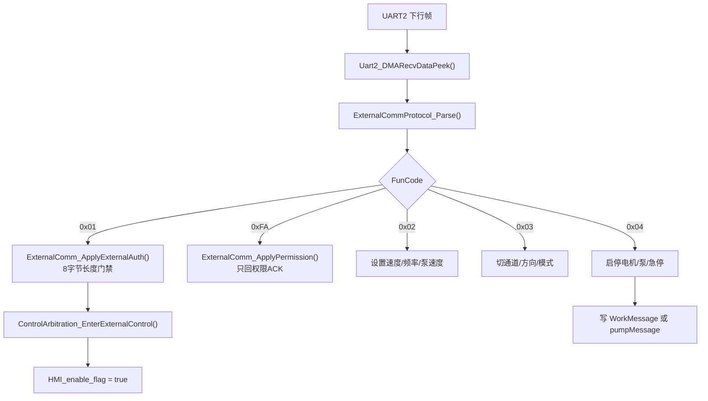

当前外控时间策略：

| 时间 | 行为 |
| --- | --- |
| 100ms | 主控上传心跳 |
| 2 秒静默 | 停电机和泵输出，但保留外控授权 |
| 10 秒静默 | 释放外控授权，熄灭在线图标 |

这里以当前源码为准：`EXTERNAL_COMM_LINK_STOP_OUTPUT_TIMEOUT_MS = 2000`，`EXTERNAL_COMM_LINK_RELEASE_TIMEOUT_MS = 10000`。

## 7. 控制权仲裁和安全逻辑

### 7.1 为什么要仲裁

如果脚踏、手柄、屏幕触控、外控都可以直接改 `runflag_work`，就会出现危险场景：

1. 外控运行时，脚踏突然踩下改变速度。
2. 手柄运行中，屏幕触控保活又启动一次。
3. 电机还没停稳，另一个来源接管。
4. 急停后某个旧队列消息又把电机启动。

所以主控使用控制权 owner：

| Owner | 含义 |
| --- | --- |
| `CONTROL_OWNER_NONE` | 当前没有来源占用 |
| `CONTROL_OWNER_EXTERNAL` | 外控占用 |
| `CONTROL_OWNER_FOOT` | 脚踏占用 |
| `CONTROL_OWNER_SCREEN` | 屏幕/触控占用 |
| `CONTROL_OWNER_HANDLE` | 手柄占用 |

启动电机前，各来源应调用 `ControlArbitration_TryEnter()`。本地来源通常在命令停止且驱动反馈停稳后释放；外控授权后不会因为电机停稳自动释放，需要上位机退出或链路 10 秒静默。

### 7.1.1 控制权源码依据

控制权由 `Pubinterface.c` 内部静态变量保存：

```c
static volatile uint8_t s_control_owner = CONTROL_OWNER_NONE;
```

Owner 定义在 `Pubinterface.h`：

```c
#define CONTROL_OWNER_NONE      0U
#define CONTROL_OWNER_EXTERNAL  1U
#define CONTROL_OWNER_FOOT      2U
#define CONTROL_OWNER_SCREEN    3U
#define CONTROL_OWNER_HANDLE    4U
```

申请控制权的核心函数如下：

```c
bool ControlArbitration_TryEnter(uint8_t owner)
{
    if (ControlArbitration_IsValidOwner(owner) == false)
    {
        return false;
    }

    ControlArbitration_ReleaseLocalIfIdle();

    if (s_control_owner == owner)
    {
        return true;
    }

    if (s_control_owner == CONTROL_OWNER_EXTERNAL)
    {
        return false;
    }

    if (ControlArbitration_IsMotorBusy())
    {
        return false;
    }

    s_control_owner = owner;
    return true;
}
```

这段代码说明：

1. 无效 owner 不能进入系统，防止误写仲裁状态。
2. 每次申请前会先尝试释放已经停稳的本地 owner。
3. 同一个 owner 重复申请算成功，允许持续控制或发送停止。
4. 外控 owner 持有时，本地脚踏、屏幕、手柄都不能抢占。
5. 电机命令仍在运行，或驱动反馈还没停稳时，不允许另一个来源接管。

电机是否“忙”不是只看 `runflag_work`：

```c
static bool ControlArbitration_IsMotorBusy(void)
{
    if (WorkMessage.runflag_work == true)
    {
        return true;
    }

    return (WorkMessage.driver_speed_feedback >
            CONTROL_ARBITRATION_MOTOR_STOP_SPEED_THRESHOLD);
}
```

因此，主控已经清了 `runflag_work`，但驱动板还反馈转速时，控制权仍不释放。这是为了避免刚发停止命令、电机还在刹车过程中被另一来源接管。

### 7.1.2 外控进入和释放

外控进入时不是直接启动电机，而是先申请 owner 并清理残留输出：

```c
bool ControlArbitration_EnterExternalControl(void)
{
    bool already_external = ControlArbitration_IsOwner(CONTROL_OWNER_EXTERNAL);

    if (ControlArbitration_TryEnter(CONTROL_OWNER_EXTERNAL) == false)
    {
        return false;
    }

    if (already_external == false)
    {
        ControlArbitration_StopMotionOutput();
        ControlSignalMessage.HMI_control_flag = false;
    }

    WorkMessage.hmiactive_work = 1U;
    WorkMessage.touchactive_work = TOUCHWORK;
    WorkMessage.drivetype_work = TOUCHWORK;
    ControlSignalMessage.HMI_enable_flag = true;
    return true;
}
```

外控释放时会停电机、停泵、清外控状态，再恢复本机可接管控制方式：

```c
void ControlArbitration_ReleaseExternalControl(void)
{
    if (s_control_owner != CONTROL_OWNER_EXTERNAL)
    {
        WorkMessage.hmiactive_work = 0U;
        ControlSignalMessage.HMI_enable_flag = false;
        return;
    }

    ControlArbitration_StopMotionOutput();
    WorkMessage.hmiactive_work = 0U;
    WorkMessage.touchactive_work = 0U;
    ControlSignalMessage.HMI_enable_flag = false;
    WorkMessage.drivetype_work = ControlArbitration_GetLocalDriveTypeAfterExit();
    ControlArbitration_Exit(CONTROL_OWNER_EXTERNAL);
}
```

调试“外控退出后本地仍无法启动”时，按下面顺序看：

| 变量或函数 | 正常值 | 异常说明 |
| --- | --- | --- |
| `s_control_owner` | 退出后为 `CONTROL_OWNER_NONE` | 外控没有真正释放 |
| `WorkMessage.hmiactive_work` | 0 | UI/状态仍认为外控激活 |
| `WorkMessage.touchactive_work` | 0 或本机触控实际状态 | 外控复用触控标志残留 |
| `ControlSignalMessage.HMI_enable_flag` | false | 外控使能残留 |
| `WorkMessage.drivetype_work` | `JTWORK/HANDLEWORK/NOWORK` | 退出后仍是外控占用模式 |
| `WorkMessage.driver_speed_feedback` | 0 | 驱动反馈未归零时本地 owner 不释放 |

### 7.1.3 按键队列如何被仲裁拦截

`KeyBehaviors()` 消费队列时会先调用 `ControlArbitration_ShouldBlockLocalKey()`。它不会简单丢弃所有按键，而是区分运行控制、参数调节和泵业务：

| 按键类型 | 是否可能被 owner 拦截 | 原因 |
| --- | --- | --- |
| 电机启动/切控制方式 | 会 | 会改变运行来源 |
| 速度/频率调节 | 通常放行 | 运行中仍需要调整目标参数 |
| 屏幕/脚踏泵键 | 通常放行到泵业务 | 泵业务自己判断在线、类型、压力和外控 |
| 外控泵键 | 外控 owner 下放行 | 外控对泵的控制仍属于外部来源 |
| 插拔事件 | 不参与电机 owner | 插拔必须更新在线状态，不能因电机运行被长期丢弃 |

定位“按键没反应”时先判断它是哪一类。如果是运行控制类，重点看 `s_control_owner` 和 `ControlArbitration_IsMotorBusy()`；如果是速度调节类，重点看 `SpeedActive()` 是否进入；如果是泵键，重点看 `PUMPActive()` 和泵在线状态。

### 7.2 报警逻辑

真实报警集中在 `WorkMessage.alarm_flag/alarm_value`。建议不要绕过 `WorkAlarm_Set()`、`WorkAlarm_Clear()` 直接写。

当前报警码速查如下，完整触发链、保护动作和解除条件以第21章为准：

| 码 | 含义 | 注意 |
| --- | --- | --- |
| 1 | 手柄未连接/公共接头缺刀具 | 根据脚踏、手控拔出、触控/外控拔出或公共接头来源，可能是真实报警或2秒提示 |
| 2 | 已选手控却踩脚踏 | 真实报警，脚踏松开/断开后清除 |
| 3 | 已选脚控却按手柄键 | 2秒限时提示 |
| 4 | 旧过载兼容码 | 当前无活动产生源 |
| 5 | 驱动过流/堵转 | 来自驱动Err 2/5；脚踏来源还需Err恢复且松脚 |
| 6 | 脚踏值错误 | 查脚踏类型、低/中/高定标值和各段跨度 |
| 7 | UID错误兼容码 | 当前无活动产生源 |
| 8 | 驱动过压/欠压 | 当前仅来自驱动Err 3/4，不是UART1无回包报警 |
| 9 | Hall异常 | 来自驱动Err 11/12 |
| 10/12/14 | A/B/AB手柄认证失败 | 查Page1、SN、Page2～8和CRC；运行中非当前通道可只提示2秒 |
| 11 | 驱动板故障 | 来自驱动Err 1/6/7/8/9/10/13/14/15；Page4阈值报警发送当前关闭 |
| 13 | 运行中插入旧保留码 | 局部常量无调用，当前不会产生 |
| 15 | 泵压力堵塞 | 2秒提示但压力输出另行锁止，图片消失不等于泵已解锁 |

注意：`WORK_ALARM_SPEED_THRESHOLD`和`WORK_ALARM_MOTOR_DRIVER_BOARD`都等于11，但当前Page4阈值分支的两个`SendAlarmMessage()`调用已经注释，不产生蜂鸣、图片或真实报警；当前出现11号真实报警时应查驱动板原始Err。若以后恢复阈值提示，必须重新区分两个来源并同步第21章。

## 8. 电机控制原理

### 8.1 从 WorkMessage 到 UART1

电机输出任务是 `MOTORRUNTask()`，每 50ms 调用 `MOTORRUN()`。它不关心是谁启动的，只看当前 `WorkMessage`。

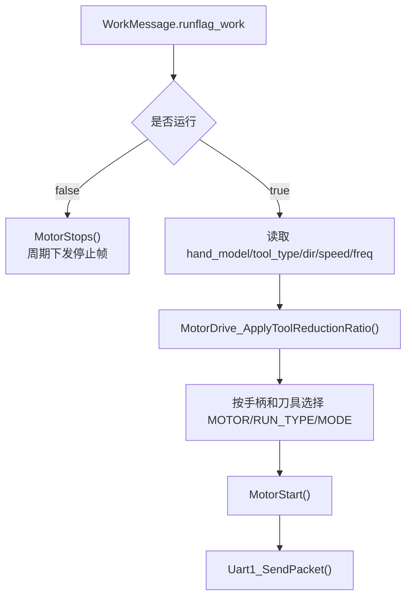

关键设计：

1. `speed_set_work` 是设定速度，`speed_work` 是当前实际运行速度。
2. 脚踏运行时，`speed_work` 会按踏板行程动态变化。
3. 刀具减速比通过 `MotorDrive_ApplyToolReductionRatio()` 修正输出速度。
4. `EMBD_ONLINES` 手柄在最终组帧时会翻转正反方向，不能只看 `dir_work` 判断物理方向。
5. 有刷/无刷选择由通道和 `tool_type` 决定。
6. 停止时不是只发一次停止帧，而是运行标志 false 后周期下发。

### 8.1.1 电机启动帧源码依据

主控发给驱动板的运行帧固定 11 字节：

```c
static uint8_t motor_stopcode[11] =
{
  0xAA, 0x01, 0x00, 0x01, 0x00, 0x00,
  0x02, 0x00, 0x00, 0xBB, 0xAA
};

uint8_t motor_startcode[11] =
{
  0xAA,
  msg.control_mode,
  msg.frequency,
  msg.motor_type,
  msg.speed_h,
  msg.speed_l,
  msg.run_type,
  msg.pro_current_h,
  msg.pro_current_l,
  0xBB,
  0xAA
};
```

这段帧定义要和普通 Modbus 区分开看。主控发给电机驱动板的是私有 11 字节帧，不是标准寄存器读写。当前主控源码只能确认活动运行帧固定以 `BB AA` 结束、没有实时 CRC；驱动板是否接受该固定尾必须用配套驱动固件和抓包成套验证。

读这段代码时要特别看三点：

1. 停止帧 `motor_stopcode` 不是空帧，而是一个完整的停止命令。电机停不下来时应确认主控是否周期发送这 11 字节。
2. 启动帧中 `speed_h/speed_l` 是经过倍率和刀具减速比处理后的驱动速度，不一定等于屏幕显示值。
3. `pro_current_h/l` 来自 `WorkMessage.current_work`，单位0.01A；值0表示让驱动板采用内部默认保护。它是下发保护设定，不是反馈电流；真实电流仍来自驱动回包。

字段含义：

| 字节 | 字段 | 来源 | 说明 |
| --- | --- | --- | --- |
| 0 | `0xAA` | 固定 | 帧头 |
| 1 | `control_mode` | `WorkMessage.dir_work` | 1 正转、2 反转、3 往复 |
| 2 | `frequency` | `WorkMessage.freq_work` | 主控钳到 100，驱动内部再处理 |
| 3 | `motor_type` | 当前通道和有刷/无刷判定 | A 无刷 1、B 无刷 2、A 有刷 3、B 有刷 4 |
| 4..5 | `speed_h/l` | `MotorDrive_BuildCommandSpeed()` | 16位协议速度，单位10rpm；倍率换算后的实际rpm先除以10，再钳到`0xFFFF` |
| 6 | `run_type` | 手柄型号和有刷/无刷 | 无霍尔 1、有霍尔 2、有刷 3/4 |
| 7..8 | `pro_current_h/l` | `WorkMessage.current_work` | 保护电流设定，单位0.01A；0表示驱动板使用内部默认值 |
| 9..10 | `BB AA` | 固定 | 驱动私有协议尾 |

UART1 当前活动命令共有三类，不能把定位帧或固定停止帧当作普通运行帧解析：

| 命令 | 帧模板 | 当前语义 |
| --- | --- | --- |
| 周期运行 | `AA MODE FREQ MOTOR_TYPE SPEED_H SPEED_L RUN_TYPE CUR_H CUR_L BB AA` | `MOTORRUN()`按当前通道、工具、方向和速度每50ms下发 |
| 周期停止 | `AA 01 00 01 00 00 02 00 00 BB AA` | 固定常量，不跟随当前通道、方向或电机类型 |
| 开口定位 | `AA MODE 00 CHANNEL 00 ANGLE 02 00 00 BB AA` | `MODE=04`顺时针、`05`逆时针；`CHANNEL=1/2`；当前业务调用角度固定1度 |

`ToolPosMay()` 是当前活动路径，手柄和外控都可在门禁通过后调用。`User/Application/Motor/motor.c` 中另有对 byte0..8 计算 CRC 的旧运行/定位兼容接口，但当前没有调用者，不能把那套 CRC 格式写成 `sscDrive.c` 活动协议。

速度换算源码：

Page3、RFID 和通道记忆最终都汇合到 `WorkMessage.tool_reduction_ratio`。Page3 旧整数、RFID x10 和旧镜像值必须在装载入口统一转换为 x100；电机换算函数只解释 x100，不再猜测历史 x10 或整数单位。

```c
static uint32_t MotorDrive_ApplyToolReductionRatio(uint32_t display_speed)
{
    uint32_t reduction_ratio = WorkMessage.tool_reduction_ratio & 0xFFFFU;
    uint32_t speed_up_ratio = WorkMessage.tool_reduction_ratio >> 16U;
    uint32_t motor_speed = display_speed; /* 已是实际rpm，不能先除10。 */

    if ((reduction_ratio > 1U) &&
        (reduction_ratio != MOTOR_DRIVE_RATIO_X100_UNIT) &&
        (speed_up_ratio > 1U) &&
        (speed_up_ratio != MOTOR_DRIVE_RATIO_X100_UNIT))
    {
        reduction_ratio = 1U;
        speed_up_ratio = 0U;
    }

    if ((reduction_ratio > 1U) &&
        (reduction_ratio != MOTOR_DRIVE_RATIO_X100_UNIT))
    {
        motor_speed = MotorDrive_ApplyReductionRatioValue(motor_speed, reduction_ratio);
    }
    else if ((speed_up_ratio > 1U) &&
             (speed_up_ratio != MOTOR_DRIVE_RATIO_X100_UNIT))
    {
        motor_speed = MotorDrive_ApplySpeedUpRatioValue(motor_speed, speed_up_ratio);
    }

    if (motor_speed > MOTOR_DRIVE_RPM_MAX)
        motor_speed = MOTOR_DRIVE_RPM_MAX;

    return motor_speed;
}

static uint16_t MotorDrive_BuildCommandSpeed(uint32_t motor_speed_rpm)
{
    uint32_t command_speed = motor_speed_rpm / 10U;
    return (command_speed > 0xFFFFU) ? 0xFFFFU : (uint16_t)command_speed;
}
```

这段速度换算代码解释了“屏幕速度、刀具倍率、驱动速度”之间的关系：

| 步骤 | 代码 | 含义 |
| --- | --- | --- |
| 取倍率 | `ratio = WorkMessage.tool_reduction_ratio` | 高16位是增速比、低16位是减速比；当前活动单位为x100 |
| 来源统一 | Page3旧整数`×100`；`GR02`格式按`整数×100+百分位`；RFID x10值`×10` | 三种来源进入`ChannelrecognizeMessage/MemoryMsg/WorkMessage`前统一成x100 |
| 业务速度 | `display_speed` | `speed_set_work/speed_work` 已是实际rpm，例如3000表示3000rpm |
| 当前减速倍率 | `((uint64_t)rpm*ratio_x100)/100` | 刀具输出要达到目标速度，电机需要更快；`525`表示5.25倍 |
| 当前增速倍率 | `((uint64_t)rpm*100)/ratio_x100` | 电机转速可低于刀具输出速度；`525`表示5.25倍 |
| 旧值兼容边界 | 仅在Page3、RFID和旧镜像装载入口转换为x100 | 进入`WorkMessage`后不再按数值范围猜测单位，避免同一原始值产生多种解释 |
| 直联与冲突保护 | `100`表示1.00倍；减速和增速同时有效时回退直联 | 避免把新格式1.00误判为历史10倍，也避免矛盾配置产生不可预测速度 |
| rpm上限 | `MOTOR_DRIVE_RPM_MAX=0xFFFF*10` | 倍率乘除使用`uint64_t`中间值，换算后再钳位，防止32位乘法回绕 |
| 协议换算 | `command_speed=motor_speed_rpm/10` | 只有最终组帧这一步才换成10rpm单位 |

倍率换算后还有一个仅对 `PXBA/PXBB + PLANER` 生效的低速补偿：电机rpm低于1500时先放大30%；补偿后仍低于500则钳到500rpm。其它手柄或磨削工具不走该补偿。因此抓包反推速度时顺序必须是“业务rpm → 机械倍率 → PX刨刀低速补偿 → 除10生成协议字段”。

如果抓到 UART1 速度字段和屏幕显示不一致，按这个表逐步反推。不要直接把差异判为组帧错误。

注意：`WorkMessage.speed_set_work` 和脚踏产生的 `speed_work` 都按实际rpm保存。抓包 byte4..5 是“实际电机rpm/10”，所以应先把16位字段乘10，再与倍率换算后的电机rpm比较；不能在进入倍率函数前额外除10。

### 8.1.2 方向、通道、有刷/无刷选择

`MOTORRUN()` 根据 `WorkMessage.dir_work` 选择驱动模式：

| `dir_work` | 下发 `control_mode` | 频率 |
| --- | --- | --- |
| `ZZDIR` | `0x01` | 0 |
| `FZDIR` | `0x02` | 0 |
| `OSCDIR` | `0x03` | `MotorDrive_BuildCommandFrequency(freq_work)` |

通道和电机类型选择：

| 当前通道 | 无刷/霍尔 | 有刷 |
| --- | --- | --- |
| A | `motor_type=0x01` | `motor_type=0x03` |
| B | `motor_type=0x02` | `motor_type=0x04` |

有刷判断不只看 `tool_type`，还会看 `raw_tool_type`。原因是 `tool_type` 可能已经被归一成 `PLANER/GRINDH`，而有刷一体刀具需要保留原始型号：

```c
static uint8_t MotorDrive_IsBrushedTool(uint8_t hand_model,
                                        uint8_t tool_type,
                                        uint8_t raw_tool_type)
{
    return (uint8_t)((hand_model == PX_YIP_ONLINES) ||
                     (hand_model == PX_YIM_ONLINES) ||
                     (tool_type == PX_YIP_ONLINES) ||
                     (tool_type == PX_YIM_ONLINES) ||
                     (raw_tool_type == PX_YIP_ONLINES) ||
                     (raw_tool_type == PX_YIM_ONLINES));
}
```

这段判断的目的，是避免刀具类型被业务归一化后丢失有刷信息。它同时检查 `hand_model`、`tool_type` 和 `raw_tool_type`：

| 字段 | 为什么要看 |
| --- | --- |
| `hand_model` | 有些有刷能力来自手柄或基座本身 |
| `tool_type` | 业务层已经解析出的刀具类型 |
| `raw_tool_type` | 保留 EEPROM/RFID 原始型号，防止归一化后误判 |

如果有刷刀具被当作无刷发帧，先看这三个字段哪个没有正确装载。只改 `tool_type` 可能不够，因为当前判断是三者任一命中即可。

调试方向错时，不要只看 `dir_work`。`EMBD_ONLINES` 在组帧前会局部翻转正反方向，但不会回写 `WorkMessage.dir_work`，所以 UI 方向和 UART1 物理方向可能看起来相反，这是有意兼容。

### 8.2 驱动反馈和报警

`MotorUartData_Init()` 创建 3ms 任务，`BrushlessMotorUartData_ReceiveData()` 解析 UART1 回包。

回包会更新：

| 字段 | 来源 |
| --- | --- |
| `driver_speed_feedback` | 回包 byte4~5 |
| `driver_current_x100` | 回包 byte8~9 |
| `alarm_flag/alarm_value` | Err 字段映射 |

完整 Err 映射：

| Err | 主控动作 |
| --- | --- |
| 0 | 驱动恢复；普通驱动报警满足最短显示时间后清除，脚踏过载还必须确认当前脚踏已松开 |
| 2/5 | 主控报警5，过载/堵转 |
| 3/4 | 主控报警8，过压/欠压 |
| 11/12 | 主控报警4，Hall异常 |
| 14 | 主控报警3，缺相 |
| 其它非0 | 主控报警11，驱动板故障 |

调试电机不启动：

| 断点 | 正常应该看到 |
| --- | --- |
| 输入来源启动分支 | 命令确实进入 |
| `ControlArbitration_TryEnter()` | 返回 true |
| `WorkMessage.runflag_work = true` | 运行门控置位 |
| `MOTORRUN()` | 进入启动分支 |
| `MotorStart()` | 组出 UART1 帧 |
| `Uart1_SendPacket()` | 发到 PB6 |
| `BrushlessMotorUartData_ReceiveData()` | 驱动有回包，反馈转速变化 |

### 8.2.1 驱动回包源码依据

驱动回包解析入口：

```c
void BrushlessMotorUartData_ReceiveData(void)
{
  rlen = Uart1_DMARecvDataPeek(dat);
  if (rlen < 11)
    return;

  for (i = 0; i < (rlen - 11); i++)
  {
    if (dat[i] == 0xAA)
    {
      CRC_Check_Vaule = Common_Crc16(&dat[i], 10);
      if (CRC_Check_Vaule == dat[i+10] + (dat[i+11] << 8))
      {
        WorkMessage.driver_speed_feedback =
          (uint16_t)(((uint16_t)dat1[4] << 8U) | dat1[5]);
        WorkMessage.driver_current_x100 =
          (uint16_t)(((uint16_t)dat1[8] << 8U) | dat1[9]);

        if (dat1[7] == MOTOR_UART_DRIVER_ERR_NONE)
        {
          MotorUart_ClearDriverAlarmIfOwned();
        }
        else
        {
          MotorUart_SetDriverAlarm(dat1[7]);
          pumpMessageA.run_flag = false;
          pumpMessageB.run_flag = false;
        }
      }
    }
  }
}
```

这段代码有三个调试重点：

1. 回包必须有 `0xAA` 帧头，并通过 `Common_Crc16(&dat[i], 10)` 校验。
2. 反馈转速只用于监测和控制权释放，不覆盖目标速度。
3. 驱动 Err 非 0 时会停 A/B 泵 `run_flag`，避免电机故障时泵继续出水。

驱动原始 Err、主控统一报警码和屏幕图片号必须分开理解。`MOTOR_ALARM_DETAIL_ENABLE` 位于 `motoruartdata.h`，当前值为`1U`；它只切换驱动报警图片，不改变停机、泵保护、蜂鸣、脚踏过载锁存和外控报警码。

| 驱动 Err | 驱动含义 | 主控统一报警码 | 宏 `0U` 公用图片 | 宏 `1U` 当前细分图片 |
| ---: | --- | ---: | --- | --- |
| 0 | 无错误 | 0 | 关闭本模块报警 | 关闭本模块报警 |
| 1 | 硬件/模块保护 | 11 | 不弹驱动图片 | 不弹驱动图片 |
| 2 | 过流保护 | 5 | 87 电机过载 | 92 手柄过流保护 |
| 3 | 母线过压 | 8 | 不弹驱动图片 | 96 手柄母线过压 |
| 4 | 母线欠压 | 8 | 不弹驱动图片 | 不弹驱动图片 |
| 5 | 运行中堵转 | 5 | 87 电机过载 | 87 电机过载 |
| 6 | 驱动器过温 | 11 | 不弹驱动图片 | 97 驱动器过温 |
| 7 | 参数保存错误 | 11 | 不弹驱动图片 | 不弹驱动图片 |
| 8 | 制动时间过长 | 11 | 不弹驱动图片 | 99 手柄制动时间过长 |
| 9 | 编码器错误 | 11 | 不弹驱动图片 | 91 编码器错误 |
| 10 | 开环启动检测错误 | 11 | 不弹驱动图片 | 95 开环启动检测错误 |
| 11 | 手柄霍尔断线 | 9 | 86 HALL值错误 | 93 手柄霍尔断线 |
| 12 | 手柄霍尔学习错误 | 9 | 86 HALL值错误 | 94 手柄霍尔学习错误 |
| 13 | 通信握手错误 | 11 | 不弹驱动图片 | 不弹驱动图片 |
| 14 | 缺相 | 11 | 84 缺相保护 | 84 缺相保护 |
| 15 | 有霍尔拖动错误 | 11 | 不弹驱动图片 | 98 有霍尔拖动错误 |

`Err=1/4/7/13` 不参与新增细分图片设计，但仍沿用既有安全报警、停机、蜂鸣和外控上传，不能因为没有调试图片而忽略驱动故障。`Err=14` 是 84 号“缺相保护”的唯一驱动来源。

屏幕报警资源与当前主控入口如下：

| 图片号 | 屏幕文案 | 当前主控来源 |
| ---: | --- | --- |
| 80 | 手柄未连接，请连接手柄 | 统一报警码1，以及公共接头缺刀具临时提示 |
| 81 | 手控已选中，请选择手控启动 | 统一报警码2 |
| 82 | 脚踏已选中，请选择脚踏启动 | 统一报警码3 |
| 83 | 脚踏存储值读取错误，请联系售后 | 统一报警码6 |
| 84 | 缺相保护，请联系售后 | 仅驱动原始 `Err=14` |
| 85 | UID错误，请联系售后 | UI仍保留统一报警码7映射，但当前活动源码没有7号报警产生源 |
| 86 | HALL值错误，请联系售后 | 统一报警码9；宏关闭时驱动 `Err=11/12` 共用 |
| 87 | 电机过载，请查看刀具是否卡死 | UI映射统一报警码4/5；当前驱动使用码5，`Err=5`始终显示87，宏关闭时`Err=2`也显示87；码4无活动产生源 |
| 88 | 外部控制中 | 屏幕资源已存在，当前主控不作为报警弹窗调用；外控状态仍使用既有在线状态图标 |
| 89 | 泵压力异常，请检查 | 统一报警码15的限时压力提示 |
| 90 | 手柄校验异常，请联系厂家 | 统一报警码10/12/14 |
| 91~99 | 驱动细分调试报警 | 当前`MOTOR_ALARM_DETAIL_ENABLE=1U`，按上表使用；91~99不写入`WorkMessage.alarm_value` |

### 8.2.2 接收窗口、报警保持和失联边界

UART1 DMA 数据由3ms任务检查；剩余计数连续3次不变后才把本批数据交给解析器，名义静默成帧窗口约9ms。反馈帧没有固定帧尾，必须以12字节长度、`AA`帧头和覆盖byte0..9的CRC16共同判断。

驱动错误不是“收到非0就立即彻底停完、收到0就立即清报警”的简单开关：

1. 同一Err连续出现时不重复蜂鸣和弹窗；非脚踏来源的驱动报警至少保持 `ALARM_DRV_MS=3000ms`，脚踏控制期间产生的过流/堵转不按固定时间退出。
2. 当前若已有手柄未连接报警1，驱动报警不覆盖该报警。
3. Err非0时立即走旧直连路径向A泵发送0速，并清A/B泵 `run_flag`；B泵依赖下一次25ms任务发0速。
4. 脚踏来源的过流/堵转由25ms脚踏任务锁存本次踩踏，并持续清除电机、脚踏来源和联动泵请求；脚踏保持踩下时不能因驱动恢复重新运行。
5. 后续收到Err=0时仍执行一次全停并清各控制来源；普通驱动报警满足最短保持时间后清除，脚踏过载必须同时满足“Err已恢复”和“当前脚踏已松开”才清报警、蜂鸣和弹窗。

当前没有“电机反馈失联超时”。UART1静默或连续坏CRC只会让 `driver_speed_feedback`、`driver_current_x100` 保持旧值，不会自动清零或产生离线报警；这也可能延迟控制权释放。UART1发送使用100ms HAL阻塞超时，返回值未处理，没有发送失败专用重试；50ms任务的下一次周期发送只是常规重发。

电机停不下来时按下面链路查：

| 断点 | 正常值 | 异常解释 |
| --- | --- | --- |
| 停止来源入口 | 对应来源能执行停止 | 停止按键或外控命令没进来 |
| `WorkMessage.runflag_work` | false | 仍为 true 表示上层没有停机 |
| `MOTORRUN()` | 进入 `MotorStops()` 分支 | 输出任务没运行或被卡住 |
| `Uart1_SendPacket()` | 周期发停止帧 | UART1 发送失败 |
| `BrushlessMotorUartData_ReceiveData()` | `driver_speed_feedback` 下降到 0 | 驱动板仍在刹车或未停 |
| `ControlArbitration_IsMotorBusy()` | 最终 false | 反馈不归零导致 owner 不释放 |

如果主控已经持续发送停止帧，`driver_speed_feedback` 仍不降，问题边界就转到无刷/有刷驱动工程：查驱动板是否收到停止帧、是否进入刹车状态机、PWM 是否真正关闭。

## 9. 泵与压力闭环原理

### 9.1 泵类型、逻辑 A/B 和物理 UART

泵不是简单“写速度”。泵任务先看业务类型，再决定方向和换算公式：

| 类型 | 宏 | 作用 |
| --- | --- | --- |
| 1 | `DRAWWATER` | 抽吸 |
| 2 | `INJECTWATER` | 注水 |
| 3 | `POURWATER` | 灌注 |

当前 `PUMP_LOGICAL_AB_PHYSICAL_SWAP_ENABLE = 0`：

| 逻辑泵 | 物理 UART |
| --- | --- |
| A | UART5 |
| B | UART7 |

如果该宏改为 1，逻辑 A/B 的物理输出会互换。这个宏只影响泵驱动输出，不等于屏幕 A/B 显示镜像。

注水泵上限是 `PUMP_INJECTWATER_SPEED_MAX = 70`。外控或屏幕写更大的注水速度，最终也会被泵任务限幅。

### 9.1.1 泵输出帧源码依据

A/B 泵不再各自保存一份完整业务算法。当前链路是：

```text
PUMPABehaviorTask()/PUMPBBehaviorTask()
→ PumpBehaviorCore_Run()
→ PumpBehavior_ConvertOutput()
→ PumpBehavior_ApplyPressure()
→ PumpBehavior_ServiceDrainage()
→ PumpBehavior_SendFrame()
→ PumpBehavior_SendPacketA()/PumpBehavior_SendPacketB()
→ UART5/UART7
```

共用内核最终发送 6 字节帧：

```c
uint8_t frame[6] = {0xAAU, dir, speed_h, speed_l, 0xBBU, 0xAAU};
```

帧组装核心：

```c
static void PumpBehavior_SendFrame(const PumpBehaviorBinding_t *binding,
                                   uint16_t uart_data,
                                   uint8_t business_direction)
{
    uint8_t frame[6] = {0xAAU, 0U, 0U, 0U, 0xBBU, 0xAAU};
    frame[1] = binding->invert_protocol_direction ?
               ((business_direction != 0U) ? 0U : 1U) :
               ((business_direction != 0U) ? 1U : 0U);
    frame[2] = (uint8_t)(uart_data >> 8);
    frame[3] = (uint8_t)uart_data;
    binding->send_packet(frame, 6U);
}
```

A/B内部业务方向和A路取反配置不同，但换成最终协议字节后，同一种泵类型在两路上的 `DIR` 一致：

| 泵类型 | A内部业务方向 | B内部业务方向 | A是否取反 | 最终帧 `DIR` |
| --- | ---: | ---: | --- | --- |
| 抽吸 `DRAWWATER` | 0 | 1 | 是 | A/B均为1 |
| 注水 `INJECTWATER` | 1 | 0 | 是 | A/B均为0 |
| 灌注 `POURWATER` | 1 | 0 | 是 | A/B均为0 |

因此“泵方向反了”要先确认业务类型、绑定方向、A路协议取反、步进板DIR解释和物理线束；不能只看绑定里的业务方向值。

调试 A/B 泵方向或物理口时，必须同时看三层：

| 层级 | 变量或宏 | 作用 |
| --- | --- | --- |
| UI 显示层 | `UIDP_PUMP_DISPLAY_AB_MIRROR_SWAP_ENABLE` | 只换屏幕 A/B 显示和触摸区 |
| 业务逻辑层 | `pumpMessageA/B.type`、`direction`、`run_flag` | 决定逻辑 A/B 泵是否应运行 |
| 硬件出口层 | `PUMP_LOGICAL_AB_PHYSICAL_SWAP_ENABLE` | 决定逻辑 A/B 最终发 UART5 还是 UART7 |

如果现象是“屏幕 A 按钮让 B 泵显示变化”，先查 UI 显示镜像；如果现象是“逻辑 A 状态正确但物理 B 口转”，查物理互换宏或线束。

UART发送没有下位机ACK或速度反馈，`speed_output`只能表示主控压力保护后允许的业务命令速度，不能证明实物已经转动。当前UART5发送超时100ms，返回值被上层忽略且无立即重试；UART7发送失败会执行abort/deinit、按115200重新初始化并重发一次，但上层仍不消费结果。开启物理互换宏后，这种恢复能力跟随物理UART7，不跟随逻辑B。

### 9.1.2 泵类型和速度换算

泵任务先拿 `pumpMessageA/B.type`，再按类型选择方向和换算公式。队列只同步目标速度，泵类型以压力模块设备码识别结果为准。

| 业务泵类型 | 最终 `DIR` | 业务速度上限 | 压力后UART速度换算 | 典型结果 |
| --- | --- | --- | --- | --- |
| `DRAWWATER` 抽吸 | 1 | 15 | `speed * 42` | 15档→630 |
| `INJECTWATER` 普通注水 | 0 | `PUMP_INJECTWATER_SPEED_MAX=70` | `speed / 1.6`，浮点结果截成整数 | 70档→43 |
| `INJECTWATER` 屏幕定时排空 | 0 | 独立固定100 | 同样 `speed / 1.6`，先经过压力保护 | 100档→62 |
| `POURWATER` 灌注 | 0 | 300 | `speed / 1.51`，浮点结果截成整数 | 300档→198 |

排空旧高转速公式已经删除；当前不存在 `(speed*0.02+2.1)*speed`。排空只是把注水业务目标临时设为100，再走与普通注水相同的压力保护和 `/1.6` 换算。普通注水结束排空后仍会回到最多70。

调试泵速度异常时：

| 断点 | 正常值 | 异常解释 |
| --- | --- | --- |
| `SendPumpAMessage()` / `SendPumpBMessage()` | 队列只更新速度 | 若指望这里改泵类型，理解错误 |
| `PUMPABehaviorTask()` / `PUMPBBehaviorTask()` | 进入 `PumpBehaviorCore_Run()` | 任务未运行或全局互斥被其它回调占用 |
| 类型分支 | 进入正确 `DRAWWATER/INJECTWATER/POURWATER` | 压力设备码或泵类型错误 |
| `PumpPressureControl_Apply()` | 输出小于等于输入 | 压力闭环限速或停泵 |
| `PumpBehavior_SendFrame()` | `DIR`和大端速度字段符合换算 | 方向、类型或换算异常 |
| `PumpBehavior_SendPacketA/B()` | 命中预期UART5/7 | 物理互换宏或线束异常 |

### 9.2 A 泵和 B 泵为什么表现可能不同

| 项 | A 泵 | B 泵 |
| --- | --- | --- |
| 任务 | `PUMPABehaviorTask()` | `PUMPBBehaviorTask()` |
| 周期 | 25ms | 25ms |
| 压力锁止解除 | 新启动沿 | 新启动沿 |
| 排空计数 | `timingDrainage_times >= 400` | `timingDrainage_times >= 400` |
| 实际排空时长 | 约 10s | 约 10s |

A/B 周期和排空计数已经统一。测试一致性时重点检查保留的队列深度差异：A 为5项，B为2项。

### 9.2.1 A/B 泵任务差异源码依据

A 泵任务周期和队列：

```c
#define PUMP_BEHAVIOR_TASK_PERIOD_MS 25U
PUMPAMsgQueue = Kernel_QueueCreate(5, sizeof(PumpBehaviorMessage_t), "PUMPAMsgQueue");
Kernel_TaskStart(&PUMPABehaviorHandle, KERNEL_TASK_ALWAYS, PUMP_BEHAVIOR_TASK_PERIOD_MS);
```

B 泵任务周期和队列：

```c
#define PUMP_BEHAVIOR_TASK_PERIOD_MS 25U
PUMPBMsgQueue = Kernel_QueueCreate(2, sizeof(PumpBehaviorMessage_t), "PUMPBMsgQueue");
Kernel_TaskStart(&PUMPBBehaviorHandle, KERNEL_TASK_ALWAYS, PUMP_BEHAVIOR_TASK_PERIOD_MS);
```

一致项和保留差异：

1. A/B 泵行为任务都按 25ms 运行，压力保护和显示刷新节奏一致。
2. `timingDrainage_times` 每次加一，达到 `PUMP_TIMING_DRAINAGE_TICKS=400` 时约为 10 秒。
3. 压力锁止不再按时间自动恢复，`pressure_recover_ms` 正常保持为 0；只有新的启动沿可以解除锁止。
4. A 队列深度 5、B 队列深度 2，这项历史差异保留；当前消息会去重，相同类型和速度不会反复入队。

测试 A/B 一致性时，应分别记录：

```text
A 泵：
  PUMPABehaviorTask 进入周期 =
  pumpMessageA.type =
  pumpMessageA.run_flag =
  pumpMessageA.speed_work =
  pumpMessageA.speed_output =
  pumpMessageA.pressure_hold_flag =
  pumpMessageA.pressure_recover_ms =
  UART5/UART7 实际帧 =

B 泵：
  PUMPBBehaviorTask 进入周期 =
  pumpMessageB.type =
  pumpMessageB.run_flag =
  pumpMessageB.speed_work =
  pumpMessageB.speed_output =
  pumpMessageB.pressure_hold_flag =
  pumpMessageB.pressure_recover_ms =
  UART5/UART7 实际帧 =
```

### 9.3 压力软串口

压力板没有接硬件 UART，而是两路 GPIO 软串口：

| 通道 | TX / RX | 位采样定时器 | 固定写入 |
| --- | --- | --- | --- |
| `SIM_UART_1` | PE5 / PE4 | TIM11 | `pumpMessageA` |
| `SIM_UART_2` | PE11 / PE6 | TIM13 | `pumpMessageB` |

当前主控设备码白名单以源码为准：

| 设备码 | 主控映射 |
| --- | --- |
| `0x07` | 注水泵，霍尔组合 0111 |
| `0x0E` | 灌注泵，霍尔组合 1110 |
| `0x0D` | 抽吸泵，霍尔组合 1101 |
| 其它 | 未知，`online_flag=false` |

压力帧字段：

| 字段 | 位置 | 含义 |
| --- | --- | --- |
| 帧头 | `AA 55` | 固定 |
| 协议版本 | frame[2] | 当前 `0x02` |
| 消息类型 | frame[3] | 当前 `0x01` |
| payload 长度 | frame[4] | 当前 `0x0C` |
| 序号 | frame[5] | 写入 `seq` |
| 原始值 | frame[6..9] | `pressure_value` |
| 重量 | frame[10..13] | `weight_x10`，0.1g |
| 阈值 | frame[14..15] | `pressure_threshold`，g |
| 设备码 | frame[16] | 映射泵类型和在线状态 |
| CRC | frame[17..18] | MODBUS 小端 |
| 帧尾 | `55 AA` | 固定 |

两路软串口默认 9600bps、中断优先级 4，各自使用 64 字节 ISR 环形缓冲和 128 字节静态 FreeRTOS 队列。两路拥有独立接收状态：PE4 使用 TIM11，PE6 使用 TIM13。有效帧中断后 1.5 秒进入疑似掉线，持续到 3 秒仍未恢复才确认离线。两块压力板完全同相发送时也能分别采样；双压力板测试仍要覆盖同相、错相和长期在线。

### 9.3.1 压力软串口源码依据

软串口关键配置：

```c
#define SOFT_UART_DEFAULT_BAUDRATE 9600U
#define SOFT_UART_1_TIMER_INSTANCE TIM11
#define SOFT_UART_2_TIMER_INSTANCE TIM13
#define CS1237_FRAME_LENGTH        21U
#define CS1237_PROTOCOL_VER        0x02U
#define CS1237_MSG_TYPE_REPORT     0x01U
#define CS1237_PAYLOAD_LENGTH      0x0CU

#define CS1237_DEVICE_CODE_INJECT_WATER 0x07U
#define CS1237_DEVICE_CODE_POUR_WATER   0x0EU
#define CS1237_DEVICE_CODE_DRAW_WATER   0x0DU
#define CS1237_PUMP_LOSS_SUSPECT_MS     1500U
#define CS1237_PUMP_LOSS_CONFIRM_MS     3000U
#define CS1237_RAW_MIN_VALUE           (-8388608)
#define CS1237_RAW_MAX_VALUE           8388607
#define CS1237_WEIGHT_MAX_X10           500000U
#define CS1237_THRESHOLD_MAX_G          50000U
#define CS1237_RECOVERY_VALID_FRAMES 3U
```

通道固定映射：

```c
static SoftUartChannelContext s_channels[SIM_UART_COUNT] = {
    { .tx_port = GPIOE, .tx_pin = GPIO_PIN_5,
      .rx_port = GPIOE, .rx_pin = GPIO_PIN_4,
      .rx_timer = TIM11,
      .baudrate = 9600U },
    { .tx_port = GPIOE, .tx_pin = GPIO_PIN_11,
      .rx_port = GPIOE, .rx_pin = GPIO_PIN_6,
      .rx_timer = TIM13,
      .baudrate = 9600U },
};
```

有效帧校验：

```c
static bool Cs1237_FrameValid(const uint8_t *frame)
{
    if ((frame[0] != 0xAA) || (frame[1] != 0x55))
        return false;

    if ((frame[2] != 0x02) ||
        (frame[3] != 0x01) ||
        (frame[4] != 0x0C))
        return false;

    if ((frame[19] != 0x55) || (frame[20] != 0xAA))
        return false;

    frame_crc = Cs1237_ReadU16Le(&frame[17]);
    calc_crc = Cs1237_CalcCrc16Modbus(&frame[2], 15);
    return frame_crc == calc_crc;
}
```

这段校验函数把压力帧分成四道门：

| 校验门 | 代码检查 | 失败表现 |
| --- | --- | --- |
| 帧头 | `frame[0] == 0xAA`、`frame[1] == 0x55` | 软串口采样错位或噪声 |
| 协议字段 | `0x02/0x01/0x0C` | 压力板协议版本或 payload 长度不一致 |
| 帧尾 | `frame[19] == 0x55`、`frame[20] == 0xAA` | 长度错、丢字节、波特率不准 |
| CRC | `Cs1237_CalcCrc16Modbus(&frame[2], 15)` | 中间字段损坏或大小端不一致 |

压力不更新时不要直接看 `pumpMessage`。先让 `Cs1237_FrameValid()` 返回 true，再确认`Cs1237_BusinessDataTrusted()`通过业务合理性检查；协议正确但业务数值越界的帧同样不会写入公共状态。

业务合理性门禁要求：24位CS1237原始值位于`-8388608..8388607`，重量不超过50000.0g，压力阈值不超过50000g。任一字段越界时，该通道保持上一份可信压力数据且不刷新有效帧时间；异常后必须连续收到3帧可信数据才恢复更新，防止单个回落样本立即把异常链路重新判定为可靠。未知设备码仍沿用原掉线处理，不会被业务门禁误当成在线泵。

压力帧写入公共状态：

```c
if (channel == SIM_UART_1)
{
    pump_message = &pumpMessageA;
}
else if (channel == SIM_UART_2)
{
    pump_message = &pumpMessageB;
}

pump_message->pressure_value = raw_cs1237;
pump_message->weight_x10 = weight_x10;
pump_message->pressure_threshold = threshold_g;
pump_message->type = pump_type;
pump_message->seq = frame[5];
pump_message->online_flag = (pump_type != 0U);
```

这段写入代码说明压力板不仅提供压力值，还决定泵在线和泵类型：

| 写入字段 | 来源 | 后续影响 |
| --- | --- | --- |
| `pressure_value` | CS1237 原始值 | 底层诊断和标定参考 |
| `weight_x10` | 压力板换算重量 | 压力闭环主要输入 |
| `pressure_threshold` | 压力板上报阈值 | 当前只作压力保护有效门禁；0不保护，非0时按主控速度曲线计算降速/停泵点 |
| `type` | `DeviceCode` 映射 | 决定抽吸、注水、灌注 |
| `seq` | 压力帧序号 | 判断数据是否持续刷新 |
| `online_flag` | 设备码是否识别 | 外控启动泵和 UI 显示会看 |

如果压力值在变但泵类型不对，问题通常不是 CS1237 采样，而是 `DeviceCode` 映射或主控白名单。

查“压力不更新”时：

| 断点或变量 | 正常值 | 异常说明 |
| --- | --- | --- |
| `SimUart_HandleExti()` | 起始位能触发 | PE4/PE6 没有电平变化 |
| `s_channels[SIM_UART_1/2].rx_stage` | 接收时按 START/DATA/STOP 推进 | 一直 IDLE 表示对应引脚没捕获起始位 |
| `overlap_drop_count` | 兼容诊断字段，正常保持 0 | 非 0 表示仍有旧逻辑或异常统计写入 |
| `framing_error_count` | 不持续增长 | 波特率、停止位、采样点异常 |
| `Cs1237_FrameValid()` | true | 帧头、版本、长度、CRC 或帧尾错误 |
| `Cs1237_UpdatePumpMessage()` | 写入对应 `pumpMessage` | 通道映射或设备码不对 |
| `pumpMessageA/B.seq` | 周期递增 | 帧卡死或任务未消费 |

### 9.4 压力闭环如何降速、停泵和锁止

压力闭环设计目标是：根据当前目标泵速选择实测压力曲线，压力升高时先线性降速，达到STOP点后立即撤销对应运行请求并建立锁止；压力自然下降不能让持续踩住或持续触控的同一次请求自动复转，只有请求完全释放后的新启动沿才解除锁止。

流程：

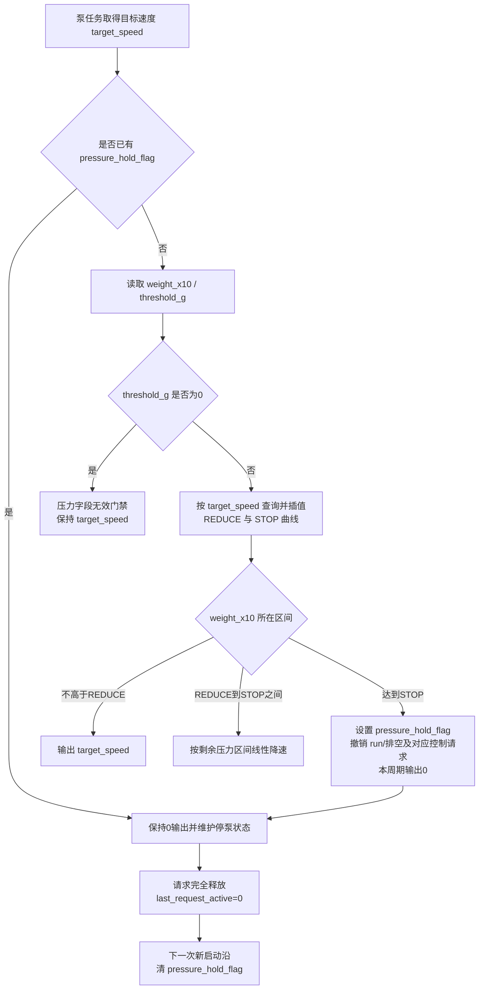

关键点：

1. `threshold_g` 不直接参与停泵点数值计算；它只表示压力板字段是否有效，0时本周期绕过压力保护。
2. REDUCE和STOP都按 `target_speed` 从主控宏表查询；相邻标定档之间线性插值，低于50沿用50档，高于300沿用300档。
3. 达到STOP时，主泵行为路径会设置 `pressure_hold_flag=true`，并由 `Pubinterface_HandlePumpPressureBlocked()` 撤销该泵的运行/排空以及相关脚踏、手柄或外控请求。
4. `speed_work` 作为用户设定可以保留，但 `run_flag` 等活动请求会被安全处理清除，`speed_output` 和UART输出为0。
5. 源码没有自动“恢复压力阈值”函数；`pressure_recover_ms` 是兼容字段，当前保持0。压力回落本身不解锁，只有请求先完全释放、再出现新启动沿才解锁。

### 9.4.1 压力曲线和源码依据

压力闭环总开关当前为：

```c
#define PUMP_PRESSURE_CONTROL_ENABLE 1U
```

六个标定点全部位于 `User/Application/include/pump_pressure_control.h`：

| 目标泵速（ml/min） | 开始降速REDUCE（g） | 停泵STOP（g） |
| ---: | ---: | ---: |
| 50 | 250 | 320 |
| 110 | 350 | 400 |
| 140 | 380 | 400 |
| 200 | 450 | 500 |
| 260 | 450 | 500 |
| 300 | 450 | 500 |

例如目标速度70位于50和110之间，REDUCE和STOP分别在两档之间按整数四舍五入插值；不能把压力板上报的 `ThresholdG` 当作70档的STOP值。

当前停泵判断等价于：

```c
if ((target_speed == 0U) || (threshold_g == 0U))
    return 0U;

stop_x10 = PumpPressure_ToX10(PumpPressure_StopThreshold(target_speed));
return (weight_x10 >= stop_x10) ? 1U : 0U;
```

线性限速核心等价于：

```c
if (target_speed == 0U)
    return 0U;
if (threshold_g == 0U)
    return target_speed;

reduce_x10 = PumpPressure_ToX10(PumpPressure_ReduceThreshold(target_speed));
stop_x10 = PumpPressure_ToX10(PumpPressure_StopThreshold(target_speed));

if (weight_x10 >= stop_x10)
    return 0U;
if (weight_x10 <= reduce_x10)
    return target_speed;

return (uint16_t)((uint64_t)target_speed * (stop_x10 - weight_x10) /
                  (stop_x10 - reduce_x10));
```

| 条件 | 返回值 | 解释 |
| --- | --- | --- |
| `target_speed == 0` | 0 | 业务本来没有输出请求 |
| `threshold_g == 0` | `target_speed` | 压力字段未启用，当前代码绕过压力保护 |
| `weight_x10 <= reduce_x10` | `target_speed` | 未到开始降速点 |
| `reduce_x10 < weight_x10 < stop_x10` | 线性缩小后的速度 | 越接近STOP点，输出越低 |
| `weight_x10 >= stop_x10` | 0并建立锁止 | 达到按目标速度查出的STOP点 |

主泵行为核心在首次达到STOP时执行：

```c
if (PumpPressureControl_IsPressureStopReached(pump_speed, weight_x10, threshold_g) != 0U)
{
    message->pressure_hold_flag = true;
    message->pressure_recover_ms = 0U;
    Pubinterface_HandlePumpPressureBlocked(public_channel);
    return 0U;
}
```

调试压力误停时，应同时记录 `target_speed`、`threshold_g`、由当前速度查出的 `reduce_x10/stop_x10`、`weight_x10`、`pressure_hold_flag`、`run_flag` 和 `speed_output`。只看 `speed_work` 或压力板 `ThresholdG` 都不能说明主控为什么停泵。

### 9.4.2 压力误停和不恢复的定位

| 现象 | 先看变量 | 正常解释 | 异常方向 |
| --- | --- | --- | --- |
| 泵一启动就停 | `target_speed`、`weight_x10`、曲线STOP值 | 重量已超过当前速度对应STOP点 | 压力零点、速度档、曲线宏、设备码或单位错误 |
| 压力板阈值字段为0时不停 | `threshold_g == 0` | 当前代码把0视为保护无效门禁，直接保留目标速度 | 压力板未给有效门禁值；不要把它误当STOP数值 |
| 高压后 `run_flag` 变 false | `pressure_hold_flag` | 正常，压力处理会撤销对应泵运行/排空和控制源请求 | 如果仍为true，查 `Pubinterface_HandlePumpPressureBlocked()` 的通道分支 |
| 压力降了仍不恢复 | `pressure_hold_flag` | 当前设计要求保持锁止 | 释放控制源后重新启动，确认新启动沿清锁止 |
| A/B 解锁行为不同 | 两路均为25ms | 两路都应按新启动沿解除 | 查对应通道请求沿和 `last_request_active` |
| 屏幕显示运行但泵不转 | `speed_output` | 压力保持时命令为0；非0也只表示主控准备下发 | 继续抓UART和检查步进板、水路 |

调试泵不转：

| 断点 | 正常应该看到 |
| --- | --- |
| `SendPumpAMessage()` / `SendPumpBMessage()` | 目标速度入队 |
| `PUMPABehaviorTask()` / `PUMPBBehaviorTask()` | `run_flag` 为 true并进入共用内核 |
| `PumpBehavior_ApplyPressure()` | 没被压力锁止压停 |
| `PumpPressureControl_Apply()` | 输出非 0 |
| `PumpBehavior_SendFrame()` / `PumpBehavior_SendPacketA/B()` | 正确方向、UART数据和物理出口 |
| `Uart5_SendPacket()` / `Uart7_SendPacket()` | 实际发出 |

## 10. 外控协议和心跳原理

UART2原外控协议固定帧头 `D7 CA F8 F1`，帧尾 `BF C6 BC C4`。外框长度、CRC和普通业务多字节字段按大端处理；心跳内嵌的压力11字节扩展保持CS1237语义，使用小端，因此整个协议不是单一端序。原协议解析入口是 `ExternalCommProtocol_Parse()`，任务入口是 `ExternalCommTaskFunc()`；可选简易协议由独立的 `external_comm_simple_protocol.c` 识别和执行。

外控的设计重点：

1. 电机和泵控制必须先由 `0x01` 申请帧取得外控owner；`0xFA`只返回权限占位ACK，不建立授权状态。
2. `0x01` 的8字节信息区当前只校验长度，成功后才尝试进入统一控制权仲裁。
3. 设置速度和启动动作分离：写泵速度不等于启动泵。
4. 外控链路静默分两级处理，避免短暂串口抖动直接释放授权。
5. 心跳上传通道、运行、泵、压力和刀具扩展；报警由独立变化帧上传，不在心跳载荷内。
6. EEPROM业务页和导航页读取不要求owner；导航单页/批量写入要求外控owner，业务页写入无条件拒绝。

外控启动电机失败时，按这条链查：

| 条件 | 正常值 |
| --- | --- |
| UART2 是否收到帧 | `Uart2_DMARecvDataPeek()` 有长度 |
| 帧解析 | `ExternalCommProtocol_Parse()` 返回成功 |
| 授权 | `ExternalComm_ApplyExternalAuth()` 成功 |
| 控制权 | `ControlArbitration_EnterExternalControl()` 成功 |
| 当前通道 | `WorkMessage.channel_work` 为 A 或 B |
| 手柄在线 | 当前通道 online，`hand_model` 非 0 |
| 报警 | `alarm_flag=false` |
| 公共接头刀具 | 已有 RFID/EPC 刀具信息 |
| 启动结果 | `WorkMessage.runflag_work=true` |

### 10.1 外控协议帧源码依据

外控协议固定帧头、帧尾：

```c
static const uint8_t s_external_comm_head[4] =
{
  0xD7U, 0xCAU, 0xF8U, 0xF1U
};

static const uint8_t s_external_comm_tail[4] =
{
  0xBFU, 0xC6U, 0xBCU, 0xC4U
};
```

这两个数组是外控协议最外层的同步标记。主控在接收 FIFO 中靠帧头找起点，靠帧尾确认一帧结束。调试半包、粘包、错包时，先不要看业务命令，先确认原始数据里是否存在完整的 `D7 CA F8 F1 ... BF C6 BC C4`。

帧格式：

| 字段 | 长度 | 说明 |
| --- | --- | --- |
| Head | 4 | `D7 CA F8 F1` |
| TranCode | 1 | 下行或上传方向 |
| Length | 2 | 整帧长度，大端 |
| FunCode | 1 | 功能码 |
| AreaCode | 1 | 区域码 |
| InforCode | 1 | 信息码 |
| InforArea | N | 业务载荷 |
| CRC16 | 2 | 大端，覆盖 `TranCode..InforArea` |
| Tail | 4 | `BF C6 BC C4` |

协议解析核心逻辑：

```c
ExternalCommParseResult_t ExternalCommProtocol_Parse(const uint8_t *data,
                                                     uint16_t data_len,
                                                     ExternalCommFrame_t *frame)
{
    for (start = 0U; start <= (data_len - 4U); ++start)
    {
        if (ExternalComm_MatchBytes(&data[start], head, 4U) == 0U)
        {
            continue;
        }

        frame_len = ExternalComm_ReadBE16(&frame_buf[5]);
        if ((data_len - start) < frame_len)
        {
            return EXTERNAL_COMM_PARSE_INCOMPLETE;
        }

        if (ExternalComm_MatchBytes(&frame_buf[frame_len - 4U], tail, 4U) == 0U)
        {
            return EXTERNAL_COMM_PARSE_BAD_TAIL;
        }

        calc_crc = Common_Crc16((uint8_t *)&frame_buf[4], (uint16_t)(6U + info_len));
        recv_crc = ExternalComm_ReadBE16(&frame_buf[crc_pos]);
        if (calc_crc != recv_crc)
        {
            return EXTERNAL_COMM_PARSE_BAD_CRC;
        }

        return EXTERNAL_COMM_PARSE_OK;
    }
}
```

这段解析逻辑按“找头、等长度、验尾、验 CRC、输出 frame”执行：

| 步骤 | 代码动作 | 调试含义 |
| --- | --- | --- |
| 找帧头 | 遍历 `data[start]`，匹配 head | 前面有噪声时可以跳过，不应整包丢弃 |
| 读长度 | `frame_len = ExternalComm_ReadBE16(&frame_buf[5])` | `Length` 是整帧长度，写错会导致等待或越界拒绝 |
| 半包判断 | `(data_len - start) < frame_len` | 上位机分段发送时应返回 incomplete，而不是错误 |
| 帧尾判断 | 匹配 `frame_len - 4` 位置 | 长度字段错时通常先表现为坏尾 |
| CRC 判断 | 覆盖 `TranCode..InforArea` | CRC 不覆盖帧头帧尾，大小端要按大端读 |
| 返回 OK | 填充 `ExternalCommFrame_t` | 只有这里之后业务函数才会执行 |

如果 `ExternalComm_ApplyControlCommand()` 没进，不能直接说命令码错。先在这段解析里看返回结果：`NOT_FOUND` 是未找到帧头，`INCOMPLETE` 是半包，`BAD_LENGTH` 是长度越界，`BAD_TAIL` 多数是长度或帧尾错，`BAD_CRC` 是 CRC 或覆盖范围错。

UART2 DMA数据先进入600字节软件环形FIFO，实际最多保存599字节。新DMA块塞不下时会清空全部旧残留，再只保留最新DMA块。坏长度、坏尾和坏CRC均只跳过1字节重新找头；找不到帧头时保留末尾3字节，便于下一批拼成4字节帧头；10ms任务每周期最多推进 `EXTERNAL_COMM_RX_FIFO_MAX_STEPS=32` 步。

协议解析本身不把方向作为合法性条件。CRC、长度和帧尾都正确后会先刷新链路计时和在线图标，再由分发层要求 `TranCode=0x02` 且 `InforCode=0xFF`；方向或信息码不对的合法帧会被静默忽略、没有ACK，但仍会“喂”链路看门狗。这是抓包时必须注意的当前边界。

调试外控收不到命令：

| 断点 | 正常值 | 异常说明 |
| --- | --- | --- |
| `Uart2_DMARecvDataPeek()` | 有字节进入 | 上位机串口、线束、波特率或 DMA 异常 |
| FIFO 写入函数 | 半包能被缓存 | 未进入软件 FIFO，粘包/半包会丢 |
| `ExternalCommProtocol_Parse()` | 返回 OK | 帧头、Length、帧尾或 CRC 错 |
| `frame.tran_code` | 下行码 | 上位机发错方向 |
| `frame.fun_code` | 0x01~0x0C、0xBB、0xFA中的活动码 | 功能码不在支持范围 |
| `ExternalComm_SendAck()` | 返回应答 | 命令被拒绝时看失败原因 |

### 10.2 外控任务、授权和超时

外控任务周期、心跳和超时以源码宏为准：

```c
#define EXTERNAL_COMM_TASK_PERIOD_MS        10U
#define EXTERNAL_COMM_HEARTBEAT_PERIOD_MS   100U
#define EXTERNAL_COMM_LINK_STOP_OUTPUT_TIMEOUT_MS 2000U
#define EXTERNAL_COMM_LINK_RELEASE_TIMEOUT_MS     10000U
```

外控命令分类：

| FunCode | 作用 | 关键边界 |
| --- | --- | --- |
| `0x01` | 申请外部控制 | 信息区必须恰好8字节；只校验长度，随后尝试取得owner |
| `0x02` | 设置速度、频率、A/B泵速度 | 设置参数不等于启动输出 |
| `0x03` | 切通道、方向、控制方式、工具类型 | 切通道要求在线；A→B或B→A成功后空闲蜂鸣100ms，重复选择和报警占用时静默；方向值0和1都解释为正转 |
| `0x04` | A/B泵、手柄启停，开口定位和急停 | 急停无owner也允许；控制分支不校验载荷内容，额外字节被忽略 |
| `0x05` | 业务EEPROM单页读取 | Area01~08映射Page2/3/4/5/6/8/9/11；Area09/0A只读Page7/10原始数据；上传原始前30字节，Page3 的 `GR02` 与倍率字节不在主控侧改写 |
| `0x06` | 业务页范围批量读取 | Area为起始实际页，信息区首字节为结束实际页；范围仅限Page2~Page11，每30ms原始读取并返回一页 |
| `0x07` | 业务EEPROM写入 | 安全禁用；固定返回失败对象07、原因05，绝不调用底层写页 |
| `0x08/0x0A` | 导航页单页读/写 | 接受实际页12~128或序号1~117；单页写固定30字节且要求外控权 |
| `0x09` | 导航页范围批量读取 | Area为起始实际页，信息区首字节为结束实际页；每30ms读一页，坏页返回失败后继续，最终报告部分失败 |
| `0x0B` | 读取主板软件版本 | 要求Area/Info为FF且信息区为空，上传状态字节加Page1原始32字节 |
| `0x0C` | 导航页范围批量写入 | Area为起始实际页，信息区为结束页+30字节共用模板；要求外控权并逐页ACK |
| `0xBB` | 上位机主动退出外控 | 停输出并释放owner |
| `0xFA` | 权限占位 | 8字节只返回权限成功ACK，不建立认证、权限或owner状态 |

`0x01`申请和`0xFA`权限占位共用的码检查当前只要求8字节长度：

```c
static uint8_t ExternalComm_IsAuthorizedCode(const uint8_t *code, uint16_t code_len)
{
    (void)code;
    return (code_len == 8U) ? 1U : 0U;
}
```

这段代码当前只校验码长度，没有校验内容。`ExternalComm_ApplyExternalAuth()`用于`0x01`申请并尝试进入owner；`ExternalComm_ApplyPermission()`用于`0xFA`且只回ACK。两者不能统称为同一授权状态，更不能把`0xFA`成功当作已经可以控制电机。

因此，“授权失败”优先查帧长度和 `InforArea` 长度，不要先怀疑固定注册码内容。反过来，如果后续要做真正授权码校验，就必须同步更新上位机说明、测试样例和失败原因码。

外控静默分两级：

```text
收到合法外控帧
-> ExternalComm_NotifyLink()
-> 计时清零

静默达到 2000ms
-> 停电机和泵输出
-> 保留外控授权和小电脑状态

静默达到 10000ms
-> ControlArbitration_ReleaseExternalControl()
-> 释放外控 owner
-> 熄灭外控在线显示
```

调试外控授权成功但不能启动电机时：

| 变量或函数 | 正常值 | 异常说明 |
| --- | --- | --- |
| `ControlArbitration_EnterExternalControl()` | true | 本地电机仍忙、外控未取得 owner |
| `WorkMessage.hmiactive_work` | 1 | 外控状态未置位 |
| `ControlSignalMessage.HMI_enable_flag` | true | 外控使能未置位 |
| `WorkMessage.channel_work` | A 或 B | 无当前工作通道 |
| `WorkMessage.hand_model` | 非 0 | 当前通道未装载手柄 |
| `WorkMessage.alarm_flag` | false | 真实报警阻止启动 |
| `ExternalComm_ApplyControlCommand()` | 进入启动分支 | 命令 AreaCode 或长度不匹配 |
| `WorkMessage.runflag_work` | true | 命令只设置参数，没有启动 |

#### 10.2.1 屏幕双击退出与重新申请保护

屏幕外控退出键不是单击立即释放。`Pubinterface.c:ConsumeExitDoubleClick()` 使用 HAL 毫秒 tick，要求 1 秒内第二次点击才调用 `ExternalComm_RequestExit()`；报警状态、外控未实际占用或图标不可用时，点击会被拦截。通信任务消费退出请求后统一停输出、释放 owner、回退出应答并打开本地退出保护。

`EXTERNAL_COMM_LOCAL_EXIT_REARM_MS=1000U` 表示屏幕退出后，必须连续 1 秒没有旧申请/保活帧，才允许上位机重新申请控制权。它解决串口 FIFO 中排队旧帧让外控刚退出又立即重入的问题，不是外控链路 2 秒/10 秒超时的一部分。调试“退出后马上又进入外控”时，依次看 `s_local_exit_requested`、`s_local_exit_guard`、`s_local_exit_quiet_ms` 和申请帧是否仍持续到达。

#### 10.2.2 当前授权和 EEPROM 写入边界

当前源码中的“授权”不能等同于密码校验：`ExternalComm_ApplyExternalAuth()` 只检查信息区长度是否为 8 字节，没有比较8字节内容；权限命令也只返回 ACK，没有建立独立权限状态。当前 EEPROM 安全边界由命令类型单独控制：`0x07`业务页写入无条件拒绝，`0x0A/0x0C`导航单页/批量写入必须已经取得外控owner。

因此不能把8字节内容当作真正密码，但也不能再把业务页描述为可写。安全评审应分别验证：任意8字节申请是否可能取得owner、未取得owner的导航写是否返回Busy、任意业务写是否固定返回失败对象07和原因05，并通过抓包确认没有进入底层业务EEPROM写页。

### 10.3 心跳和报警是两类上传帧

心跳每100ms上传一次，信息区按在线/运行状态动态增减。`RFID_LINK_STATS_ENABLE=1U`时最大134字节，关闭统计时恢复原88字节上限；两种配置都不超过协议信息区134字节上限。顺序和条件如下：

| 顺序 | 字段 | 编码 |
| ---: | --- | --- |
| 1 | A手柄在线；在线时再跟原始主/子类型 | 在线`01`、离线`FF`；类型各1字节 |
| 2 | B手柄在线；在线时再跟原始主/子类型 | 同上 |
| 3 | 当前通道 | A=`01`、B=`02`、无=`FF` |
| 4 | 运行状态 | 待机=`01`、运行=`02`、未接入=`03` |
| 5 | 当前方向/往复模式 | 正=`01`、反=`02`、往复=`03`、未知=`FF` |
| 6 | 仅运行时追加目标速度和驱动电流 | 各16位大端；电流单位0.01A |
| 7 | 脚踏在线 | 在线=`01`、离线=`FF` |
| 8 | A泵在线；在线时追加类型、显示速度、压力扩展 | 在线标志1字节；类型1字节；速度16位大端；压力11字节小端 |
| 9 | B泵在线及扩展 | 同上 |
| 10 | 泵运行位图 | bit0=A、bit1=B；必须在线、存在运行/排空请求且`speed_output>0` |
| 11 | 可选刀具扩展 | 新主控为 `A5 02 COUNT`，之后每个通道20字节；上位机仍兼容旧 `A5 01 COUNT` |
| 12 | 可选RFID链路统计扩展 | 新固件为`A6 02 02`，之后固定为A、B两个20字节统计块；上位机仍兼容旧`A6 01 02`布局 |

压力扩展固定为 `RawCs1237(int32 LE) + WeightX10(uint32 LE) + ThresholdG(uint16 LE) + Seq`，共11字节。刀具20字节块依次为：通道、来源（0 EEPROM/1 EPC；历史2 RFID USER仅由上位机兼容）、工具类型、直径、长度BE16、角度、默认速度BE16、最小速度BE16、最大速度BE16、默认流量BE16、方向、传动比BE32。EEPROM来源的工具类型保持原业务类型；RFID EPC来源保留EPC byte0原始型号`0x01～0x05`，使上位机能够区分刨刀、磨刀、反旋刀具、MXYTP和MXYTM；上位机对历史RFID USER来源沿用同一显示规则。A5版本1的传动比高16位增速、低16位减速且单位为x10；A5版本2保持相同20字节块和高低位定义，但单位升级为x100。上位机必须同时接受两个版本：版本1按 `/10`、版本2按 `/100` 显示两位小数，历史原始值 `0/1` 均显示等效 `1.00` 倍。外框和普通字段是大端，压力扩展是小端，上位机必须逐字段解析。

RFID统计版本2按大端编码并固定先A后B，每块为`Request(4) + Valid(4) + Lost(4) + Invalid(2) + MonitorCompleted(4) + ConfirmedDropout(2)`。`Request`只在主控实际发送EPC读取命令时增加；有效协议回包增加`Valid`；发送下一条命令时上一条仍未获得有效回包则增加`Lost`；UART收到数据但未解析出有效EPC帧则增加`Invalid`。运行、切通道、清刀具或外部停止导致的业务主动取消不计为请求丢包。

`MonitorCompleted`来自handlescan对匹配事务票据的结算：`SUCCESS`和`TIMEOUT`各完成一次监测，`CANCELED`不累计；presence序号只用于刷新有效标签缓存，不再单独结束请求。`ConfirmedDropout`只在此前在线的RFID刀具连续6次明确`TIMEOUT`形成掉线边沿时增加一次，持续离线不重复增加。PXBA/PXBB形成掉线边沿后保留最后一次有效刀具参数且不蜂鸣；公共接头清除刀具信息并蜂鸣。上位机请求丢包率为`Lost / (Valid + Lost)`，主控确认掉线率为`ConfirmedDropout / MonitorCompleted`，两者含义不同且都在主控复位或重新上电后清零。

报警完全不在心跳中。`ExternalComm_SendAlarmInfoIfChanged()`上传独立帧：`Tran=01、Fun=03、Area=FF、Info=05、InforArea[0]=alarm_value`。启动后先同步一次，以后只在值变化时发送；真实 `WorkMessage` 报警优先于限时报警，限时报警到期后再发0关闭弹窗。

若上位机显示和屏幕不一致，不要只查上位机页面。先确认心跳字段是否已经从 `WorkMessage`、`MemoryMsgA/B`、`pumpMessageA/B` 取到最新值；报警问题则单独抓 `Fun=03/Info=05`，不要等待下一帧心跳携带报警。

### 10.4 UART2简易外控协议

简易协议在独立模块 `external_comm_simple_protocol.c/.h` 内定义、校验和分发，固定帧为 `AA BB CC FunCode EE FF`，长度恒为6字节，不含长度字段和CRC。原协议实现不复制到新模块：共用UART2接收FIFO只比较最早出现的 `D7 CA F8 F1` 与 `AA BB CC` 帧头，选中简易帧后才交给独立模块处理，因此原协议载荷内偶然出现 `AA BB CC` 不会被抢先执行。

板级宏 `EXTERNAL_COMM_SIMPLE_PROTOCOL_ENABLE` 控制整套功能：

| 编译值 | 行为 |
| ---: | --- |
| `1U` | 原外控协议和简易协议同时可识别；两者共用外控owner、输出门禁以及2秒停输出/10秒释放保护 |
| `0U` | 简易模块保留空接口但不识别、不执行任何简易帧；UART2只运行原外控协议 |

简易协议命令表：

| FunCode | 功能 | 主控实际动作和边界 |
| ---: | --- | --- |
| `0x01` | 启动外部控制 | 复用原外控owner仲裁；本机脚踏、屏幕或手柄正在控制时申请失败 |
| `0x02` | 退出外部控制 | 仅在简易协议会话有效时安全停电机/泵并释放owner |
| `0x03` | 启动手柄/刀具电机 | 复用原启动门禁；要求已登录、当前手柄在线、无安全报警且公共接头刀具有效 |
| `0x04` | 停止手柄/刀具电机 | 清手柄运行请求和联动注水泵请求，保留设定转速 |
| `0x05` | 减小手柄/刀具转速 | 调用现有 `SpeedActive(HMIkey_SPEED_Sub)`，沿用Page6步进和上下限 |
| `0x06` | 增加手柄/刀具转速 | 调用现有 `SpeedActive(HMIkey_SPEED_Add)`，沿用Page6步进和上下限 |
| `0x07` | 切换手柄 | 当前A切到B、当前B切到A；无当前通道时不猜测目标，原在线/运行/报警门禁继续生效 |
| `0x08` | 左边泵功能开关 | 切换A泵外控独立运行请求；泵未配置或离线时由原入口拒绝启动 |
| `0x09` | 右边泵功能开关 | 切换B泵外控独立运行请求；泵未配置或离线时由原入口拒绝启动 |
| `0x0A` | 左边泵流量档位切换 | 复用A泵当前类型的0～5档循环和显示刷新 |
| `0x0B` | 右边泵流量档位切换 | 复用B泵当前类型的0～5档循环和显示刷新 |
| `0x0C` | 清除异常提醒 | 关闭蜂鸣和报警弹窗，但不清除 `WorkMessage` 安全报警锁存，故障未解除时仍禁止电机和泵启动 |

`0x03`～`0x0C`必须先由本协议 `0x01` 建立有效会话；已知控制帧会刷新原2秒/10秒链路保护，owner被超时或屏幕退出释放后私有会话随下一条简易指令作废。两套协议共享同一个物理UART2和同一个外控owner，不支持两个独立设备同时分别占用控制权。

用户给出的格式没有定义简易协议应答帧，因此当前实现不会自行发明新的6字节ACK，也会在简易命令内部复用旧业务分发时抑制旧格式ACK；原100ms心跳仍按既有协议独立上传。响应时间表示主控收到完整帧后在10ms外控任务周期内进入业务处理，真实执行成功率仍需在目标线束、泵配置和手柄负载下实机统计。

## 11. UI、蜂鸣和 LED 原理

UI 刷新不是每个模块直接发屏幕帧，而是多数路径先发 `SendUIDSMessage()`，由 `UIDISPLAYBehaviorTask()` 统一消费。底层显示通过 `LCD_Show_Picture()`、`LCD_Show_4byte_Number()` 等走 UART6。

这样做是为了：

1. 降低多个模块同时刷屏造成的串口拥堵。
2. 让 UI 看到统一状态。
3. 让泵、手柄、报警、触控弹窗可以按区域刷新。

蜂鸣分两类：

| 类型 | 入口 | 特点 |
| --- | --- | --- |
| 按键音 | `SendKeyBeepMessage()` 等 | 没有报警时响 |
| 报警音 | `SendAlarmMessage()`、`SendAlarmMessageTimed()` | 可持续或限时 |

Page4速度/频率阈值当前只计算条件，报警发送调用已注释，因此不蜂鸣、不写真实报警，也不阻塞调速。运行中另一路坏手柄仍可能触发限时提示，不一定写`WorkMessage.alarm_value`。

### 11.1 UI 消息队列源码依据

UI 不是每个模块直接刷屏，而是投递区域消息：

```c
typedef struct
{
    uint8_t areaId;
    bool enable_flag;
    uint8_t Value[10];
} UIDPMessage_t;

QueueHandle_t UIDPMsgQueue = NULL;
```

这段结构体说明 UI 刷新是“区域消息”，不是直接把某个变量写屏幕：

| 字段 | 作用 | 调试含义 |
| --- | --- | --- |
| `areaId` | 指定刷新哪个 UI 区域 | 图标错位或不刷新先看 areaId |
| `enable_flag` | 常用于显示/隐藏或开关状态 | 图标不消失时看它是否为 false |
| `Value[10]` | 区域参数，固定 10 字节 | 参数显示错时看值是否按区域协议填充 |
| `UIDPMsgQueue` | UI 任务队列 | 为 NULL 表示 UI 任务未初始化 |

投递函数：

```c
void SendUIDSMessage(uint8_t areaId, bool enable_flag, uint8_t *Value)
{
    if (UIDPMsgQueue == NULL)
        return;

    UIDPMessage_t msg;
    msg.areaId = areaId;
    msg.enable_flag = enable_flag;

    if (Value != NULL)
        memcpy(msg.Value, Value, 10);
    else
        memset(msg.Value, 0, sizeof(msg.Value));

    if (same_as_last_message)
        return;

    Kernel_QueueSend(UIDPMsgQueue, &msg, 10);
}
```

这段代码说明：

1. UI 消息最多带 10 字节参数。
2. 空参数会补零，避免显示任务读到旧参数。
3. 同一区域、同一开关、同一参数会被过滤，减少屏幕串口压力。
4. 队列满时，只有成功投递的消息才更新去重缓存，避免有效刷新被永久吞掉。

还要注意去重逻辑的副作用：如果上层反复投递完全相同的区域和值，UI 任务不会重复刷屏。这是为了降低 UART6 压力。调试“我明明调用了刷新但屏幕没闪动”时，要确认新消息是否和上一条完全一样；如果一样，被过滤是设计行为。

调试屏幕不刷新：

| 断点 | 正常值 | 异常说明 |
| --- | --- | --- |
| `SendUIDSMessage()` | areaId 正确 | 上层没有投递刷新 |
| `UIDPMsgQueue` | 非 NULL | UI 任务未初始化 |
| 去重判断 | 新参数不应被过滤 | 参数和上次完全相同 |
| `Kernel_QueueSend()` | pdPASS | 队列满或调度未运行 |
| `UIDISPLAYBehaviorTask()` | 消费消息 | UI 任务卡住 |
| `LCD_Show_*()` | 走 UART6 | 底层屏幕通信异常 |

### 11.2 泵显示和实际输出的区别

泵显示档位由 `UIDP_PumpGearFromValue()` 计算，不等于 UART 输出速度：

```c
static uint8_t UIDP_PumpGearFromValue(uint8_t pump_type, uint16_t value)
{
    if (pump_type == INJECTWATER)
    {
        if (value <= 5U) gear_value = 1U;
        else if (value <= 10U) gear_value = 2U;
        ...
    }
    else if (pump_type == DRAWWATER)
    {
        if (value == 8U) gear_value = 7U;
        else if (value == 10U) gear_value = 8U;
        ...
    }
    else if (pump_type == POURWATER)
    {
        if (value <= 30U) gear_value = 1U;
        else if (value <= 60U) gear_value = 2U;
        ...
    }
}
```

这段函数只把业务速度换算成屏幕档位，不参与泵实际输出。它解释的是“显示几档”，不是“驱动板收到多少速度”。

举例：注水泵 `value <= 5` 显示 1 档，`value <= 10` 显示 2 档，但最终 UART 输出还会经过注水泵公式、上限钳位和压力闭环。因此现场看到“显示 2 档但出水量不对”，应继续查 `pumpMessage.speed_output` 和 UART5/UART7，而不是只改这个显示函数。

因此，查“泵显示几档但实际流量不对”时要分开：

| 层级 | 看什么 |
| --- | --- |
| 设定值 | `pumpMessageA/B.speed_work` |
| 压力修正后实际业务速度 | `pumpMessageA/B.speed_output` |
| UI 档位 | `UIDP_PumpGearFromValue()` 结果 |
| UART 输出值 | `uart_data` |
| 实际泵驱动目标速度 | 在实际烧录固件或驱动侧抓包中确认解析结果 |

### 11.3 蜂鸣消息队列源码依据

蜂鸣任务 100ms 周期运行，消息分三类：

```c
typedef struct {
    uint8_t msgType;
    uint8_t keyBeepTime;
    uint8_t alarmFlag;
    uint16_t alarmHoldTicks;
} BeepMessage_t;
```

蜂鸣消息结构体只描述声音请求，不等于整机真实报警状态：

| 字段 | 作用 |
| --- | --- |
| `msgType` | 区分按键音、持续报警、限时报警 |
| `keyBeepTime` | 按键音持续周期 |
| `alarmFlag` | 蜂鸣报警类型 |
| `alarmHoldTicks` | 限时报警剩余周期 |

是否禁止电机运行，主要看`WorkMessage.alarm_flag`和报警来源，而不是单独看蜂鸣队列。脚控模式误按手柄键、运行中另一路坏手柄、公共接头缺刀具和压力堵塞都可能只做限时蜂鸣，不把整机置为真实报警；Page4速度阈值当前连蜂鸣发送也已关闭。

普通按键音：

```c
void SendKeyBeepMessage(uint8_t time)
{
    msg.msgType = BEEP_MSG_KEY;
    msg.keyBeepTime = time;
    msg.alarmFlag = 0;
    msg.alarmHoldTicks = 0U;
    Kernel_QueueSend(BeepMsgQueue, &msg, 0);
}
```

持续报警：

```c
void SendAlarmMessage(uint8_t flag)
{
    msg.msgType = BEEP_MSG_ALARM;
    msg.alarmFlag = flag;
    msg.alarmHoldTicks = 0U;
    Kernel_QueueSend(BeepMsgQueue, &msg, 0);
}
```

限时报警：

```c
void SendAlarmMessageTimed(uint8_t flag, uint16_t duration_ms)
{
    msg.msgType = BEEP_MSG_ALARM_TIMED;
    msg.alarmFlag = flag;
    msg.alarmHoldTicks = (duration_ms + 99U) / 100U;
    Kernel_QueueSend(BeepMsgQueue, &msg, 0);
}
```

蜂鸣优先级：

| 状态 | 行为 |
| --- | --- |
| 只有按键音 | `BEEP_ON()` 持续指定周期 |
| 有报警 | 报警翻转蜂鸣覆盖按键音 |
| 限时报警 | 到期后自动 `BEEP_OFF()`，不改 `WorkMessage` |
| 无消息 | 蜂鸣关闭 |

排查蜂鸣异常：

| 现象 | 先看 |
| --- | --- |
| 按键不响 | `SendKeyBeepMessage()` 是否入队 |
| 报警不响 | `SendAlarmMessage()` 是否收到非 0 报警码 |
| 报警一直响 | 是否没有发送 `SendAlarmMessage(0)` 或真实报警未清 |
| 限时报警影响真实报警 | 是否错误使用限时报警代替 `WorkAlarm_Set()` |

### 11.4 LED 状态

LED 任务只适合作为“系统任务仍在运行”的辅助信号。调试关键业务时不能只看 LED：

1. LED 正常闪烁，只能说明调度器和 LED 任务还活着。
2. LED 正常不代表 UART、I2C、手柄、泵、压力都正常。
3. LED 异常时先查 `LEDTaskInit()`、`SysRunLed` 任务周期和板级 GPIO。
4. 如果 LED 停了，同时屏幕、外控、泵任务都停，优先查 FreeRTOS 调度、互斥锁长时间占用或硬故障。

## 12. 跨工程协议风险

跨工程协议调试要先分清“主控负责什么、下位板负责什么”。主控负责状态仲裁和命令生成；驱动板负责电机或步进输出；压力板负责采样、标定和周期上报；上位机负责外部命令和 EEPROM 维护。任意一侧单独改字段、CRC、设备码或超时，都可能让链路表面在线但动作不对。

### 12.1 主控和无刷/有刷驱动板协议联调边界

主控电机输出入口是 `MOTORRUN()`，下发函数是 `MotorStart()`/`MotorStops()`。当前主控通过 UART1 发送 11 字节私有帧：

```text
AA MODE FREQ MOTOR_TYPE SPEED_H SPEED_L RUN_TYPE CUR_H CUR_L BB AA
```

关键含义：

| 字段 | 主控来源 | 驱动板联调要点 |
| --- | --- | --- |
| `MODE` | 普通运行取 `WorkMessage.dir_work`；开口定位由 `ToolPosMay()` 直接使用04/05 | 正转、反转、往复、定位等模式必须双方一致 |
| `FREQ` | `WorkMessage.freq_work` | 驱动侧可能再做倍率处理，不能重复放大 |
| `MOTOR_TYPE` | 手柄/刀具识别结果 | 有刷、无刷、Hall、无 Hall分支要实机验证 |
| `SPEED_H/L` | `speed_set_work`或脚踏`speed_work`先做机械倍率换算，最后再除10组帧 | 主控业务速度是实际rpm；协议字段单位10rpm，驱动按约定恢复 |
| `RUN_TYPE` | 手柄类型、刀具类型、方向组合 | 开口定位和普通正反转不是同一控制含义 |
| `CUR_H/L` | `WorkMessage.current_work`，大端、0.01A | 0表示使用驱动默认保护；这是设定值，不是回包反馈电流 |
| `BB AA` | 当前主控固定帧尾，不是主控侧计算出的 CRC | 实际烧录驱动固件必须按这两个固定字节收帧；若驱动要求其它校验，双方协议不兼容 |

当前主控仓库没有纳入并锁定一份与整机实际烧录版本一一对应的电机驱动板源码。因此，本手册能够确认的是主控的 11 字节下发帧、12 字节回包解析和主控侧报警映射；驱动板内部的收帧函数名、CRC兼容策略、刹车变量和控制状态机不能写成当前产品的确定实现。更换驱动固件时，必须用实际烧录版本或串口抓包确认其接受 `BB AA` 固定帧尾，并确认停止后的机械刹车行为。

驱动回包是 12 字节，包含当前模式、频率、类型、速度、运行状态、错误码和电流。主控在 `BrushlessMotorUartData_ReceiveData()` 中用回包更新：

| 主控变量 | 作用 |
| --- | --- |
| `driver_speed_feedback` | 判断电机是否真正转动或停稳 |
| `driver_current_x100` | 显示和报警辅助 |
| `WorkMessage.alarm_value/alarm_flag` | byte7 Err经来源相关映射后可提升为整机报警 |

主控在停止状态会周期发送固定停止帧，但这只能证明停止命令已从 UART1 发出，不能单独证明驱动板已收帧、已退出PWM或机械部分已经停稳。调试“主控已发停止但电机还转”时，应同时抓取 UART1 下发帧、12字节反馈速度，并在实际驱动固件中检查收帧和停机状态。

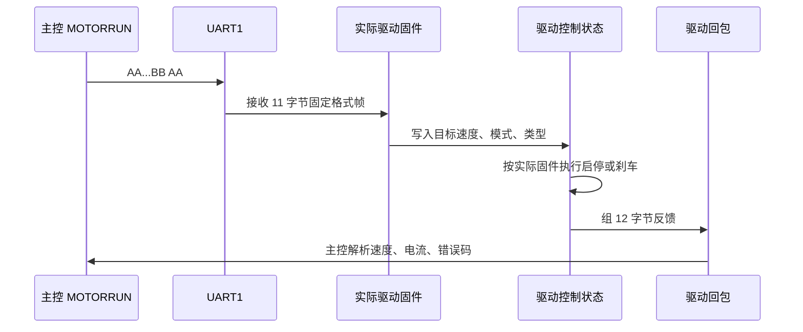

联合断点建议：

| 位置 | 正常值 | 异常说明 |
| --- | --- | --- |
| 主控 `MOTORRUN()` | 根据 `runflag_work` 进入启动或停止分支 | 输入侧没有真正改当前工作状态 |
| 主控 `MotorStart()` | 11 字节帧字段与当前 `WorkMessage` 一致 | 模式、速度、方向或类型转换错 |
| 主控 `MotorStops()` | 停止帧周期发送 | 停止命令只清状态但未持续输出 |
| 实际驱动原始接收缓冲 | 完整收到 `AA ... BB AA` 11 字节 | 波特率、帧长、固定帧尾或线束不匹配 |
| 实际驱动目标速度 | 启动时等于协议速度乘10，停止时为0 | 主控速度单位或字段位置解释错 |
| 实际驱动电机类型/模式 | 与 `MOTOR_TYPE`、`MODE` 一致 | 有刷/无刷或运行模式解释不一致 |
| 实际驱动停机状态 | 收到停止帧后进入并最终完成停机 | 驱动保护、刹车参数或机械负载异常 |
| 主控12字节回包解析 | 速度、电流、错误码持续更新 | 驱动未回包、回包格式变化或UART1接收异常 |

### 12.2 主控和步进/泵驱动板协议联调边界

主控泵输出入口是 `PUMPABehaviorTask()` 和 `PUMPBBehaviorTask()`，两路都进入 `PumpBehaviorCore_Run()`，最后通过 UART5/UART7 发送6字节帧：

```text
AA DIR SPEED_H SPEED_L BB AA
```

当前主控仓库没有纳入并锁定与整机实际烧录版本对应的步进/泵驱动板源码。下面只能按主控发送逻辑确认字段；驱动板内部函数名、CRC策略、速度正负号和启动阈值必须以实际烧录固件或台架抓包为准。

| 主控字段 | 主控侧确定含义 |
| --- | --- |
| `DIR = 0` | 主控用于注水、灌注和定时排空方向 |
| `DIR = 1` | 主控用于抽吸方向 |
| `SPEED = 0` | 主控要求该物理泵口停止 |

主控泵协议只有单向下发，没有ACK、状态或错误回包。`speed_output`非0只表示主控已经允许并下发目标速度，不能证明驱动板已收帧、已启动PWM或泵体已经产生流量。

| 联调观察点 | 正常含义 |
| --- | --- |
| 主控UART5/UART7波形 | 完整出现 `AA DIR SPEED_H SPEED_L BB AA` |
| 实际驱动接收缓冲 | 连续收到6字节，帧头、帧尾和速度一致 |
| 实际驱动目标方向 | `DIR=0/1`与整机注入/抽吸物理流向一致 |
| 实际驱动目标速度 | 与主控大端16位 `SPEED` 一致 |
| 实际驱动运行/故障状态 | 无欠压、过流、堵转或驱动侧门禁 |
| 实际泵体流量 | 与当前泵型、管路方向和目标档位一致 |

泵类型由主控根据压力模块设备码、手柄默认和业务默认决定，并在主控侧转换成速度或显示策略；主控发给泵驱动板的6字节协议里只有方向和速度，没有泵类型字段。因此“泵类型显示错”应先查主控识别和显示链路，不应先假设泵驱动板识别了泵型。

联合调试最小路径：

```text
主控 pumpMessageA/B.run_flag = true
-> 主控压力闭环计算 speed_output
-> 主控 PumpBehavior_SendFrame() 组 AA DIR SPEED BB AA
-> PumpBehavior_SendPacketA/B() 选择 UART5/UART7
-> 实际驱动固件解析 DIR/SPEED
-> 实际驱动固件检查本机门禁和故障
-> 驱动输出并用流量/压力实测确认
```

### 12.3 主控和压力传感器源码对照

压力板周期上报帧由压力工程 `protocol.c` 生成，主控软串口按 9600 8N1 接收。当前帧格式为：

```text
AA 55 02 01 0C Seq RawCs1237(4) WeightX10(4) ThresholdG(2) DeviceCode CRC16(2) 55 AA
```

字段影响如下：

| 字段 | 主控用途 |
| --- | --- |
| `Seq` | 判断压力帧是否持续更新 |
| `RawCs1237` | 原始 ADC 值，主要用于底层诊断 |
| `WeightX10` | 压力闭环计算，单位 0.1g |
| `ThresholdG` | 压力保护有效门禁，单位 g；主控仅判断是否为0，STOP数值来自速度曲线 |
| `DeviceCode` | 判断泵类型和在线状态 |
| `CRC16` | 帧有效性判断，MODBUS 小端 |

设备码存在已经由两边当前源码确认的不一致，不能再按旧表或单边注释判断：

| 位置 | 当前定义 | 实际影响 |
| --- | --- | --- |
| 压力板 `Core/Inc/protocol.h` | 声明已知集合为 `0x0F/0x0E/0x0C/0x08/0x09` | 仅供 `CS1237UartProtocol_IsKnownDeviceCode()` 判断；当前发送主循环没有调用该判断 |
| 压力板 `Core/Src/main.c` | 把消抖后的 PA1~PA4 全部组合直接打包并发送 | 即使不在上面“已知集合”，`0x07/0x0D/0x0E` 仍可进入发送帧 |
| 主控 `soft_uart.c` | 只识别 `0x07=注水`、`0x0E=灌注`、`0x0D=抽吸` | 其它码即使帧头、固定字段和 CRC 正确，也会把该泵判为离线并强制停泵 |

因此“压力板发包正常但主控泵类型或在线不对”时，必须先抓取 byte16 的原始 `DeviceCode`。调整设备码时要同步压力板霍尔组合、压力板声明集合、主控白名单、屏幕泵类型和外控心跳，不能只改其中一侧。完整编码、位极性和兼容规则见第20.4节。

主控侧已改为双接收器：PE4/TIM11 与 PE6/TIM13 分别维护接收阶段、位序号和临时字节。双压力板同相上报时两路 `seq` 都应持续递增；若单路停滞，应定位该路 EXTI、定时器或线束。

联合断点建议：

| 位置 | 正常值 | 异常说明 |
| --- | --- | --- |
| 压力板 `CS1237UartProtocol_BuildReportFrame()` | 21 字节帧字段正确 | 压力板上报格式或设备码错误 |
| 主控 `HAL_GPIO_EXTI_Callback()` | PE4/PE6 起始位进入 | 压力线、GPIO、EXTI 配置异常 |
| 主控 `SimUart_HandleExti()` | 对应通道 `rx_stage` 进入 START | 对应 EXTI 未触发或 A/B 线接反 |
| 主控 `Cs1237_FrameValid()` | 帧头、尾、CRC 通过 | 波特率、采样点、CRC 或帧格式不一致 |
| 主控 `Cs1237_UpdatePumpMessage()` | `pumpMessageA/B.seq` 递增 | 设备码不被接受或通道映射错 |
| 主控压力闭环 | `weight_x10`、`threshold_g` 合理 | 标定或阈值写入异常 |

### 12.4 主控和外部通信上位机源码对照

外控上位机发送的帧头和帧尾为：

```text
帧头：D7 CA F8 F1
帧尾：BF C6 BC C4
```

中间字段包含 `TranCode`、`Length`、`FunCode`、`AreaCode`、`InforCode` 和 `InforArea`，CRC 覆盖中间业务字段，不覆盖帧头、帧尾和 CRC 自身。主控 UART2 接收后会进入 FIFO，支持半包、粘包和错帧重同步。

外控安全策略必须由上位机和主控共同遵守：

1. 授权成功只代表外控可以申请控制权，不代表电机必然能启动。
2. 设置速度、方向、泵速只是写运行状态或通道记忆，不等于启动。
3. 启动电机还要满足当前通道在线、手柄有效、无报警、公共接头刀具就绪、控制权可进入。
4. 链路短超时会停输出并保留A/B泵用户设定流量与外控授权；链路长超时会释放外控。
5. 心跳中的手柄、泵、压力字段来自主控公共状态，不是上位机本地推算。
6. EEPROM 写页会修改当前选中通道手柄数据，上位机必须提示风险并在写后引导重新识别。

上位机工具中有两个行为要和主控设计配合：

| 上位机行为 | 主控侧对应 |
| --- | --- |
| EEPROM 写入二次确认 | 防止误写当前通道手柄 EEPROM |
| 写页间隔约 80ms | 避免连续 I2C 写页和上位机帧过密 |
| 串口错误连续计数 | 避免一次临时错误就清本地授权状态 |
| 心跳样本脚本校验 | 验证动态长度、CRC、泵/手柄扩展字段 |

外控联合断点：

| 位置 | 正常值 | 异常说明 |
| --- | --- | --- |
| 上位机 `buildFrame()` | 长度、CRC、帧尾正确 | 主控解析不到完整帧 |
| 主控 `ExternalCommProtocol_Parse()` | 半包、粘包能恢复同步 | FIFO 残留或长度字段不一致 |
| 主控 `ExternalComm_ApplyExternalAuth()` | 当前仅要求信息区长度为8字节 | 长度不为8时授权失败；内容本身当前不参与校验 |
| 主控 `ControlArbitration_EnterExternalControl()` | owner 进入外控 | 本地脚踏/手柄/屏幕正在占用 |
| 主控 `ExternalComm_ApplyControlCommand()` | AreaCode 命中启动、停止或急停 | 命令码和区域码不匹配 |
| 主控 `ExternalComm_SendHeartbeat()` | 心跳字段随在线状态动态变化 | 上位机按固定长度解析会错位 |

### 12.5 跨工程协议变更规则

协议改动必须按成套验证处理，不能只看一个工程编译通过：

| 改动内容 | 必须同步确认 |
| --- | --- |
| 电机帧尾或校验 | 主控 `MotorStart()`、实际烧录驱动板接收逻辑、主控回包解析 |
| 电机类型或模式编码 | 手柄识别、主控组帧、驱动有刷/无刷分支、UI 显示 |
| 泵方向字段 | 主控 UART5/UART7 输出、实际泵驱动板 `DIR` 解释、实物流向 |
| 泵速度单位 | 主控流量换算、实际泵驱动板速度解释、压力闭环输出 |
| 压力设备码 | 压力板霍尔编码、主控白名单、泵类型显示、外控心跳 |
| 压力帧长度或 CRC | 压力板 `BuildReportFrame()`、主控 `Cs1237_FrameValid()`、软串口采样 |
| 外控心跳字段 | 主控动态心跳、上位机解析、样本校验脚本 |
| EEPROM 页映射 | 主控外控映射、上位机页面名称、认证工具 Page1 更新 |

实机联调记录建议固定写这几项：

```text
主控固件版本：
驱动板固件版本：
步进/泵板固件版本：
压力板固件版本：
上位机版本：
本次改动字段：
主控发出的原始帧：
下位板收到的原始帧：
下位板回包原始帧：
主控公共状态快照：
结论：
```

### 12.6 当前协议兼容矩阵

多数下位板协议没有独立“协议版本号”字段，不能仅凭串口在线判断兼容。发布时应把对端固件标识、原始帧样本和下表中的兼容标识一起留档；任一标识变化，都按第12.5节执行成套联调。

| 对端或设备 | 主控接口 | 当前兼容标识 | 当前主控假设 | 最小兼容确认 |
| --- | --- | --- | --- | --- |
| 无刷/有刷驱动板 | UART1 | 11字节命令、固定帧尾、类型/模式/方向编码及回包Err映射 | 对端无显式协议版本字段 | 启动、停止、正反往复、反馈速度和全部已知Err各抓一组原始帧 |
| A/B步进泵板 | UART5/UART7 | 6字节命令、方向位、速度单位和固定尾帧 | A/B函数存在方向适配差异；主控ACK不能证明水路实际转动 | A/B各测启动、停止、方向、最小/最大速度并观察实物流向 |
| A/B压力板 | PE4/PE6软串口 | CS1237 v2、设备码0x07/0x0E/0x0D、11字节扩展和CRC16/MODBUS | 设备码决定泵类型；压力来源固定A=SIM1、B=SIM2 | 三类设备码、正负压力、掉线和CRC错误分别抓帧 |
| DWIN屏幕 | UART6 | 0x5A/0xA5帧、VP/SP地址和0x5520触控保活 | 屏幕工程无自动版本协商 | 逐页核对VP、触控、A/B镜像和保活超时 |
| 脚踏板 | UART4 | H/M/L定标字段、在线帧和解析静默掉线 | 协议无独立版本字段，定标结果在首次上线保存 | 单踏、双段、双脚踏、满踩、松脚和掉线各验证一次 |
| RFID模块 | UART3；双串口配置时增加UART9 | R200-K8选通、地区、发射功率、EPC解析和请求队列 | 单/双串口由目标硬件配置决定 | A/B分别读标签，核对物理选通、逻辑缓存、掉线统计和初始化命令 |
| 外部通信上位机 | UART2 | 外框Length/CRC、心跳A5版本1/2、统计A6版本2、EEPROM 0x05~0x0C及0x0B软件版本 | A5 v1倍率为x10、v2倍率为x100；8字节申请只校验长度；业务写0x07固定拒绝；导航写要求owner | 用第24.5节全套用例回归，并保存A5 v1/v2代表帧、主控0x0B版本载荷 |

## 13. 临时配置修改速查

| 要改什么 | 文件 | 配置入口（当前值统一见第27章） | 改完验证 |
| --- | --- | --- | --- |
| 业务初始化顺序 | `User\Application\Src\userparser.c` | `Userparser_Init()` | 上电、屏幕、串口、任务是否正常 |
| 软任务周期 | 各 `Kernel_TaskStart()` 调用 | 见第 4 章任务表 | 任务周期和互斥阻塞 |
| 手柄物理 A/B 交换 | `User\Hardware\include\board_profile.h` | `HANDLE_PHYSICAL_AB_SWAP_ENABLE` | A/B插拔、运行键、EEPROM、电机和开口定位；交付值按目标线束选择 |
| R200-K8 RFID A/B交换 | `User\Hardware\include\board_profile.h` | `RFID_R200_AB_SWAP_ENABLE` | 仅共享UART3时决定逻辑通道是否交换固定物理RFID模块 |
| A/B 泵物理互换 | `User\Application\include\pump.h` | `PUMP_LOGICAL_AB_PHYSICAL_SWAP_ENABLE` | A/B物理口、屏幕、外控和压力源分层验证 |
| 注水泵速度上限 | `pump.h` | `PUMP_INJECTWATER_SPEED_MAX` | 屏幕、脚踏、外控注水都测 |
| 压力闭环总开关 | `pump_pressure_control.h` | `PUMP_PRESSURE_CONTROL_ENABLE` | 压力硬停和新启动沿恢复 |
| 压力锁止解除 | `pump_behavior_core.c` | 仅新启动沿解除 | 高压停泵后防止压力下降自动复转 |
| 压力设备码 | `soft_uart.c` | `CS1237_DEVICE_CODE_*` | 压力板单磁铁霍尔组合与泵类型实测 |
| 外控心跳周期 | `external_comm_task.c` | `EXTERNAL_COMM_HEARTBEAT_PERIOD_MS` | 上位机刷新、批量帧错峰 |
| 外控停输出超时 | `external_comm_task.c` | `EXTERNAL_COMM_LINK_STOP_OUTPUT_TIMEOUT_MS` | 静默后停止电机和泵输出，但保留A/B泵`speed_work`设定值 |
| 外控释放超时 | `external_comm_task.c` | `EXTERNAL_COMM_LINK_RELEASE_TIMEOUT_MS` | 静默后释放owner和在线显示 |
| 屏幕 VP 地址 | `screen_address.h` | `UIDP_LCD_VP_*` | 屏幕实物显示 |
| 屏幕泵显示镜像 | `screen_address.h` | `UIDP_PUMP_DISPLAY_AB_MIRROR_SWAP_ENABLE` | 显示和触摸映射 |
| 手柄 EEPROM 页解析 | `handlescan.c` | Page2/Page3/Page4/Page6 | 插拔、切通道、默认参数 |
| 构建源文件清单 | EIDE/Keil 四处 | 见第 15 章 | EIDE 构建和旧模块检查 |

### 13.1 参数生效层级和临时配置边界

临时修改前先判断要改的是哪一种配置：

| 配置层级 | 典型入口 | 是否需要重新编译 | 是否掉电保存 | 常见误区 |
| --- | --- | --- | --- | --- |
| 运行态 | 屏幕、脚踏、手柄按键、外控设置命令 | 否 | 否 | 以为设置速度会写入 EEPROM |
| 手柄持久化 | 受控生产或维护流程写 Page4/Page6 | 取决于工具 | 是 | 外控协议已禁写业务页；写完仍需重新识别才能刷新 `WorkMessage` |
| 固件常量 | `.h` 宏、`.c` 白名单、任务周期 | 是 | 随固件保存 | 只改源码但没有检查 EIDE 实际构建清单 |

优先选择顺序：

1. 只为现场验证某个动作，优先用屏幕或外控运行态设置。
2. 要让某个手柄下次插入自动带默认值，改该手柄 EEPROM 对应页。
3. 要改变整机规则，例如压力白名单、外控超时、泵物理口互换，才改固件源码。
4. 改固件源码后必须确认 EIDE 和 Keil 清单里没有旧模块回编译。

### 13.2 EEPROM 默认参数临时修改

常见手柄默认参数改 Page4 和 Page6：

| 目标 | EEPROM 页 | 字段 | 生效方式 |
| --- | --- | --- | --- |
| 默认注水流量 | Page4 | 默认流量字段 | 写页后重新插拔或重新识别 |
| 默认速度 | Page4 | 默认速度字段 | 写页后重新装载到 `WorkMessage` |
| 最小/最大速度 | Page4 | 速度上下限字段 | 写页后重新识别，调速边界才更新 |
| 默认频率 | Page4 | 频率字段 | 往复模式重新装载后生效 |
| 调速小步进 | Page6 | 小步进字段 | 重新识别后影响手柄/屏幕调速 |
| 调速大步进 | Page6 | 大步进字段 | 重新识别后影响快速调速 |

受控生产或维护流程写业务 EEPROM 的注意事项：

1. 外部通信上位机不能写业务页；必须使用受控生产或维护工具。
2. 写入目标通道和页号必须由维护人员明确核对。
3. 页尾 2 字节校验必须由对应维护工具按当前格式生成。
4. 改 Page2~Page8 会影响 Page1 认证输入，如果没有同步更新认证结果，下次插入可能 CRC 认证失败。
5. 写 Page4 只改变手柄持久化默认值，不会自动改变正在运行的速度。

### 13.3 跨工程配置入口

| 配置目标 | 工程 | 文件或函数 | 验证方式 |
| --- | --- | --- | --- |
| 电机命令帧兼容 | 主控 + 无刷/有刷驱动 | 主控 `MotorStart()`，实际烧录驱动板接收入口 | 抓 UART1 原始帧，确认驱动接受11字节和固定帧尾 |
| 电机回包字段 | 主控 + 无刷/有刷驱动 | 实际驱动回包入口，主控 `BrushlessMotorUartData_ReceiveData()` | 回包12字节CRC、速度、错误码一致 |
| 泵方向解释 | 主控 + 步进/泵板 | 主控 `PumpBehavior_SendFrame()`，实际泵驱动接收入口 | 业务类型、最终DIR和实际水流方向 |
| 步进启动斜坡 | 步进/泵板 | 实际烧录泵驱动板的启动参数和控制状态 | 低速启动、阶跃启动、停启切换 |
| 压力设备码 | 主控 + 压力板 | 主控 `soft_uart.c`，压力板 `BuildReportFrame()` | 构造设备码并确认 online/type |
| 压力阈值和标定 | 压力板 + 主控 | 压力板标定/阈值保存，主控压力闭环 | 实测重量、阈值、停泵点 |
| 外控心跳扩展 | 主控 + 上位机 | 主控心跳函数，上位机解析脚本 | 手柄/泵在线和离线动态长度 |
| EEPROM 页名和认证 | 主控 + 上位机 + 写入工具 | 外控页映射、Page1 认证工具 | 写页、重插、认证、默认参数装载 |

### 13.4 配置修改后的最小回退点

每次临时修改都要记录一个最小回退点，避免测试后不知道如何恢复：

```text
修改目标：
修改前值：
修改后值：
修改文件或 EEPROM 页：
是否重新编译：
是否重新烧录：
是否重新插拔手柄：
验证用例：
回退方法：
```

### 13.5 常用固件宏怎么改

下面这些入口是现场最常改的配置。改之前先确认当前分支、当前构建目标和实际烧录的固件来自同一份工程。

| 目标 | 文件 | 源码入口（当前值见第27章） | 改动影响 | 最小验证 |
| --- | --- | --- | --- | --- |
| 手柄物理 A/B 交换 | `User\Hardware\include\board_profile.h` | `HANDLE_PHYSICAL_AB_SWAP_ENABLE` | 交换短接、运行键、EEPROM和电机物理资源；RFID及逻辑A/B状态不动 | A/B分别插拔、按键运行、RFID识别和开口定位，确认屏幕仍显示原逻辑侧 |
| R200-K8 RFID A/B交换 | `User\Hardware\include\board_profile.h` | `RFID_R200_AB_SWAP_ENABLE` | 单串口硬件中改变逻辑A/B选择固定物理模块的关系，不改变高低电平物理定义 | A/B分别读标签，确认对应物理模块工作且结果进入同侧逻辑界面 |
| A/B 泵物理互换 | `User\Application\include\pump.h` | `PUMP_LOGICAL_AB_PHYSICAL_SWAP_ENABLE` | 改逻辑泵 A/B 到 UART5/UART7 的最终映射 | 屏幕启动 A 泵、外控启动 A 泵、压力 A 源三项一起测 |
| 注水泵上限 | `User\Application\include\pump.h` | `PUMP_INJECTWATER_SPEED_MAX` | 注水泵速度钳位，影响屏幕、脚踏、外控和手柄默认流量 | 设置超过上限，确认 `pump_speed` 被钳到目标上限 |
| 压力闭环总开关 | `User\Application\include\pump_pressure_control.h` | `PUMP_PRESSURE_CONTROL_ENABLE` | 所有泵输出是否经过压力降速和停泵保护 | 高压测试时确认 `speed_output` 是否被压低 |
| 压力锁止解除 | `User\Application\Pump\pump_behavior_core.c` | `PumpBehaviorCore_Run()`的新启动沿分支 | 高压停泵后必须释放并再次启动才恢复 | 保持控制源确认不复转，释放后再次启动确认解锁 |
| 压力阈值曲线 | `pump_pressure_control.h` | `PUMP_PRESSURE_CONTROL_REDUCE_*` 和 `STOP_*` | 不同目标流量下的降速点和停泵点 | 50/110/140/200/260/300 档分别压测 |
| 压力源映射 | `soft_uart.c` 与 `pump_behavior_core.c` | A=`SIM_UART_1/PE4`、B=`SIM_UART_2/PE6`；头文件source宏当前无引用 | 决定哪个压力数据写入并保护哪个逻辑泵 | 单接 A、单接 B，确认只停对应泵 |
| 压力设备码 | `User\Peripheral\uart\soft_uart.c` | `CS1237_DEVICE_CODE_*` | 泵类型识别和在线判断 | 构造设备码，看 `pumpMessage.type/online_flag` |
| 外控停输出超时 | `User\Application\ExternalComm\external_comm_task.c` | `EXTERNAL_COMM_LINK_STOP_OUTPUT_TIMEOUT_MS` | 外控链路静默后多久只停电机和泵 | 按第27.5节当前值计时并确认输出停止 |
| 外控释放超时 | `external_comm_task.c` | `EXTERNAL_COMM_LINK_RELEASE_TIMEOUT_MS` | 外控链路静默后多久释放owner和在线图标 | 按第27.5节当前值计时并确认owner释放 |
| 屏幕 VP 地址 | `User\Application\include\screen_address.h` | `UIDP_LCD_VP_*` | DWIN 显示和触控地址 | 用屏幕实物逐项触发，看 VP 是否匹配 |
| 屏幕泵镜像 | `screen_address.h` | `UIDP_PUMP_DISPLAY_AB_MIRROR_SWAP_ENABLE` | 只影响屏幕显示/触控镜像，不改物理 UART | 屏幕 A/B 显示和实际泵分开验证 |

修改建议：

1. 改宏时只改一个目标，烧录后做最小验证，再继续改下一个。
2. 泵 A/B 问题先判断是屏幕镜像、物理 UART、压力源还是手柄通道，不要一次改多个宏。
3. 压力白名单和压力板设备码要同步记录压力板固件版本。
4. 外控超时改短会提高安全停机速度，但也更容易被串口抖动触发。
5. 外控超时改长会降低误停概率，但失联后输出保持时间也会变长。

### 13.6 任务周期怎么改

软任务周期通常在各模块 `Task_Init()` 中传给 `Kernel_TaskStart()`。改任务周期前要先理解 `AppTaskRuntimeGate()`：业务回调虽然分成多个任务，但进入旧业务逻辑时被同一把互斥锁串行保护。某个任务周期改得更快，不代表它一定能更快完成业务动作。

| 任务 | 当前用途 | 改周期的风险 |
| --- | --- | --- |
| `MOTORRUNTask()` | 50ms 下发电机启停帧 | 太慢会导致启停响应迟缓，太快会挤占串行业务时间 |
| `MOTORUARTTaskFunc()` | 3ms 解析驱动回包 | 太慢会延迟报警和停稳判断 |
| `HANDLESCANTaskFunc()` | 10ms 扫描手柄插拔和 EEPROM | 太慢会影响插拔体验，太快会增加 I2C 压力 |
| `Foot_ParseDataS()` | 10ms 解析脚踏实时帧 | 太慢会导致脚踏行程滞后 |
| `FootControlTask()` | 25ms 执行脚踏控制 | 改动会影响松脚去抖和泵跟随节奏 |
| `PUMPABehaviorTask()` | 25ms 调用 A 泵共用行为内核 | 改动会改变 A 泵排空计数的实际时长 |
| `PUMPBBehaviorTask()` | 25ms 调用 B 泵共用行为内核 | 与 A 泵周期一致，改动仍要重测两路队列和物理输出 |
| `ExternalCommTaskFunc()` | 10ms 外控链路和超时 | 改动会影响超时计时精度和心跳发送 |
| `SimUartTaskFunc()` | 100ms 压力帧消费 | 太慢会让压力显示和闭环滞后 |

任务周期修改后的验证顺序：

```text
1. 上电确认所有 Task_Init() 执行。
2. 在 AppTaskRuntimeGate() 看是否有任务长期占锁。
3. 单独测试被改任务。
4. 同时运行电机、泵、压力、屏幕、外控。
5. 记录最坏响应时间和是否出现丢包。
```

### 13.7 外控运行配置和 EEPROM 配置不要混用

外控命令有两类：

| 类型 | 例子 | 写入对象 | 典型生效 |
| --- | --- | --- | --- |
| 运行设置 | 设置速度、方向、泵速、模式 | `WorkMessage`、`MemoryMsgA/B`、`pumpMessageA/B` | 立即或下个任务周期 |
| EEPROM 维护 | 读业务页、读写导航页；业务页写固定拒绝 | 当前通道 AT24CS32 | 业务读立即返回原始30字节；导航写成功后立即落盘 |

现场操作建议：

1. 只想临时提速，用运行设置，不写 EEPROM。
2. 要让某把手柄以后采用新的默认值，必须使用受控生产或维护工具写 Page4，并同步 Page1 认证；外控上位机不能完成该动作。
3. 外控写导航页前必须先取得 owner，并用心跳确认当前选中通道，避免写错 A/B。
4. 受控工具写业务页后应读回30字节、复核Page1认证并重新插入手柄；外控读取只用于查看原始结果。

### 13.8 修改后的检查命令

这些命令只做静态检查，不会改工程：

```powershell
rg -n "PUMP_LOGICAL_AB_PHYSICAL_SWAP_ENABLE|PUMP_INJECTWATER_SPEED_MAX|PUMP_PRESSURE_CONTROL_ENABLE|pressure_hold_flag" User\Application
rg -n "CS1237_DEVICE_CODE|EXTERNAL_COMM_LINK_STOP_OUTPUT_TIMEOUT_MS|EXTERNAL_COMM_LINK_RELEASE_TIMEOUT_MS" User
rg -n "UIDP_LCD_VP_|UIDP_PUMP_DISPLAY_AB_MIRROR_SWAP_ENABLE" User\Application\include
rg -n "handledata\.c|param\.c|warn\.c|User[/\\]Data[/\\]data\.c|UI_Main\.c|UI_ModelConfiguration\.c|UI_Password\.c" EIDE\.eide\eide.yml EIDE\build\MainCtrlF413MXOs\builder.params build\MainCtrlF413MXOs\builder.params MDK-ARM\MainCtrlF413MXOs.uvprojx
git diff --check
```

改完固件常量后，最少做一轮：

1. 上电启动页。
2. A/B 手柄插拔。
3. 电机启动和停止。
4. A/B 泵启动和停止。
5. 压力停泵和恢复。
6. 外控授权、保活、静默停输出、释放授权。
7. EIDE 构建清单旧模块扫描。

## 14. 故障现象按原理排查

### 14.1 上电无响应或屏幕无启动页

原理链路：上电必须先完成 HAL、外设、业务初始化，再强制向 UART6 发送启动页。屏幕不亮不一定是 UI 任务问题，可能卡在更早的初始化。

| 断点 | 看什么 |
| --- | --- |
| `main()` | 是否进入固件 |
| `MX_I2C_Init()` | 业务 I2C2/I2C3 是否完成 |
| `Userparser_Init()` | 业务初始化是否卡住 |
| `Uart6_Init()` | 屏幕串口是否初始化 |
| `LCD_ForceShow_Which_Map()` | 是否发启动页 |
| `Uart6_SendPacket()` | 是否真实发出 |

### 14.2 手柄插入不上线

原理链路：短接 IO -> 去抖 -> EEPROM 认证 -> 读取 Page2/3/4/6 或 RFID -> 识别缓存 -> 插拔事件 -> 通道记忆 -> 当前工作。

| 断点 | 正常值或现象 |
| --- | --- |
| `HandlescanA_Fun_SSC()` / `HandlescanB_Fun_SSC()` | 进入插入和认证状态 |
| `AT24CS32_VerifyCrc_I2C2/I2C3()` | 返回 OK |
| `AT24CS32_GetLastDebugInfo()` | HAL 状态无 Busy/Timeout |
| `Handlescan_UpdateRecognizeMessage()` | `ChannelrecognizeMessageA/B.hand_type_raw_*` 有值 |
| `SendKeyBehMessage()` | 投递 `PLUGunPLUG` |
| `PlugORunPLUGActive()` | online 和 MemoryMsg 更新 |
| `Pubinterface_LoadChannelMemory()` | 待机时 WorkMessage 装载 |

### 14.3 A/B 反了

先区分四种“反”：

| 现象 | 查哪里 |
| --- | --- |
| 屏幕 A 按钮控制 B 显示 | `UIDP_PUMP_DISPLAY_AB_MIRROR_SWAP_ENABLE` |
| 逻辑 A 状态变化但物理 B 转 | `PUMP_LOGICAL_AB_PHYSICAL_SWAP_ENABLE` 或线束 |
| A 泵转但 B 压力变化 | PE4/PE6 压力线接反 |
| 插 A 手柄显示 B 通道 | `HANDLE_PHYSICAL_AB_SWAP_ENABLE`、手柄短接 IO 或线束；不要交换逻辑消息对象 |

不要用一个宏同时解释所有 A/B 反。屏幕镜像、泵物理互换、压力源映射、手柄通道识别是四件事。

### 14.4 运行中插拔异常

原理链路：运行中的当前 `WorkMessage` 不能被另一路插入覆盖。另一路可以更新 `MemoryMsg`，但不能抢当前电机控制。

| 断点 | 看什么 |
| --- | --- |
| `Pubinterface_ShouldAutoSelectPluggedChannel()` | 运行中应返回 false |
| `PlugORunPLUGActive()` | 是否只更新对应 MemoryMsg |
| `WorkMessage.channel_work` | 不应被另一路插入改变 |
| `WorkMessage.hand_model` | 不应被另一路覆盖 |
| `SendAlarmMessageTimed()` | 运行中坏手柄可能只限时提示 |

### 14.5 电机不启动

原理链路：输入源启动 -> 控制权 -> `runflag_work` -> 电机任务 -> UART1 -> 驱动回包。

| 断点 | 正常值 |
| --- | --- |
| 输入来源启动分支 | 命令进入 |
| `ControlArbitration_TryEnter()` | true |
| `WorkMessage.alarm_flag` | false |
| `WorkMessage.channel_work` | A 或 B |
| `WorkMessage.hand_model` | 非 0 |
| `WorkMessage.runflag_work` | true |
| `MOTORRUN()` | 启动分支 |
| `MotorStart()` | 组帧 |
| `BrushlessMotorUartData_ReceiveData()` | 反馈变化 |

### 14.6 电机停不下来

原理链路：停止命令必须清 `runflag_work`，电机任务随后周期下发停止帧；控制权要等命令和反馈都停稳后释放。

| 断点 | 看什么 |
| --- | --- |
| 停止入口 | 停止命令是否进入 |
| `WorkMessage.runflag_work=false` | 是否被清掉 |
| `MotorStops()` | 是否周期发停止帧 |
| `driver_speed_feedback` | 是否仍大于停稳阈值 |
| `ControlArbitration_RefreshMotorOwner()` | owner 是否释放 |

### 14.7 泵不转

原理链路：泵启动请求 -> `pumpMessage.run_flag` -> 泵任务 -> 压力闭环 -> 速度换算 -> UART5/UART7。

| 断点 | 正常值 |
| --- | --- |
| `SendPumpAMessage()` / `SendPumpBMessage()` | 有目标速度 |
| `PUMPABehaviorTask()` / `PUMPBBehaviorTask()` | 进入 `PumpBehaviorCore_Run()` 运行分支 |
| `pumpMessageA/B.type` | 1、2 或 3 |
| `pumpMessageA/B.speed_work` | 非 0 |
| `pressure_hold_flag` | false |
| `speed_output` | 非 0 |
| `PumpBehavior_SendFrame()` / `PumpBehavior_SendPacketA/B()` | 正确方向、数据和物理串口 |

### 14.8 压力不更新

原理链路：压力板 GPIO 起始位 -> EXTI -> A路TIM11/B路TIM13位采样 -> 21字节帧 -> CRC -> `pumpMessageA/B`。

| 断点 | 看什么 |
| --- | --- |
| `HAL_GPIO_EXTI_Callback()` | PE4/PE6 是否进中断 |
| `SimUart_HandleExti()` | 对应通道 `rx_stage` 是否进入 START |
| `SimUart_TimerIrqHandler()` | TIM11/TIM13 是否分别采样对应通道 |
| `Cs1237_FrameValid()` | 帧头、尾、CRC 是否通过 |
| `Cs1237_UpdatePumpMessage()` | A/B 对应 pumpMessage 是否更新 |
| `pumpMessageA/B.seq` | 是否递增 |

### 14.9 压力误停泵

先判断是否真的“误停”：

| 变量 | 判断 |
| --- | --- |
| `pressure_threshold` | 0时绕过压力保护；非0只开启门禁，不是实际STOP点 |
| `target_speed` | 决定从50/110/140/200/260/300六档曲线查表或插值 |
| `weight_x10` | 若达到当前 `target_speed` 对应STOP值×10，停泵是设计动作 |
| `reduce_x10/stop_x10` | 分别是当前速度对应的开始降速点和停泵点，均由主控曲线产生 |
| `pressure_hold_flag` | true 表示已进入保持 |
| `pressure_recover_ms` | 兼容字段，当前应保持 0 |
| `speed_output` | 保持期间为 0 |

压力超过停泵点后，代码把本周期泵输出压到 0，并设置 `pressure_hold_flag`。即使压力随后下降，锁止也不会自动解除，防止持续踩住脚踏或持续触控时意外复转。控制源必须先释放，再次启动形成新请求沿后才允许恢复输出。

解除锁止条件按下面判断：

```text
pressure_hold_flag = true
-> 当前 run/排空请求全部释放
-> last_request_active 变为 0
-> 用户再次启动形成新请求沿
-> 清保持状态
-> 本轮泵任务重新按 speed_work 和压力计算输出
```

如果重新启动后仍不恢复，优先看：

| 变量 | 正常值 | 异常说明 |
| --- | --- | --- |
| 当前运行/排空请求 | 释放阶段全部为 false | 请求一直未释放就不会形成新启动沿 |
| `pressure_hold_flag` | 新启动沿后变 false | 一直 true 表示请求沿没有从 0 变为 1 |
| `pressure_recover_ms` | 保持 0 | 非 0 表示仍有过时逻辑写入 |
| `weight_x10` | 低于当前速度 STOP 阈值 | 重新启动后仍高压会立即再次锁止 |
| `speed_work` | 非 0 | 目标速度被别的入口改成 0 |

如果 A 压力导致 B 停，优先查 PE4/PE6 接线和 `SIM_UART_1/2` 映射。

### 14.10 外控授权成功但不能启动

原理链路：授权只是拿到外控资格，不等于可以运行。运行还要看当前通道、手柄、报警、公共接头刀具、控制权。

| 断点 | 看什么 |
| --- | --- |
| `ExternalComm_ApplyExternalAuth()` | 授权是否成功 |
| `ControlArbitration_EnterExternalControl()` | 外控 owner 是否进入 |
| `ExternalComm_ApplyControlCommand()` | AreaCode 是否是启动命令 |
| `ExternalComm_EnsureActiveForRun()` | 运行前置条件 |
| `WorkMessage.channel_work` | 当前是否有通道 |
| `WorkMessage.alarm_flag` | 是否阻止启动 |
| `WorkMessage.runflag_work` | 是否最终置 true |

### 14.11 参数不生效

先判断参数写到哪一层：

| 改了哪里 | 生效条件 |
| --- | --- |
| `ChannelrecognizeMessageA/B` | 还只是识别缓存，必须插拔事件落地 |
| `MemoryMsgA/B` | 必须切到该通道或重新装载到 `WorkMessage` |
| `WorkMessage` | 当前任务会立即读取，但可能被通道切换覆盖 |
| `pumpMessageA/B.speed_work` | 泵任务读取后还会被压力闭环和上限处理 |
| 屏幕显示 | 必须发 `SendUIDSMessage()` 并被 UI 任务消费 |

常见判断路径：

```text
外控或屏幕改速度
-> 先看 WorkMessage.speed_set_work 是否变
-> 再看当前 channel_work 是否仍是目标通道
-> 再看 MOTORRUN() 是否按新速度组帧
-> 最后看驱动回包速度是否跟随
```

```text
受控生产或维护工具写 Page4 默认速度
-> 外控0x07不能代替维护工具，只应返回失败[07,05]
-> 工具按当前格式写30字节并同步Page1认证
-> 查看AT24CS32_GetLastDebugInfo()确认底层访问成功
-> 重新插拔或重新识别
-> 看ChannelrecognizeMessageA/B是否读到新Page4
-> 看MemoryMsgA/B是否保存新值
-> 看Pubinterface_LoadChannelMemory()是否装载到WorkMessage
```

重点断点：

| 断点 | 正常值 | 异常说明 |
| --- | --- | --- |
| `ExternalComm_ApplySetting()` | 当前运行态字段变化 | 外控设置命令没有进入运行态 |
| `ExternalComm_RejectBusinessPageWrite()` | 任意0x07均返回失败对象07、原因05 | 若进入底层写页，说明协议安全边界被破坏 |
| `AT24CS32_WritePage_I2C2/I2C3()` | 只在受控生产或维护流程中观察写入成功 | I2C、页地址、页和或Page1认证异常 |
| `Handlescan_UpdateInitialInfoMessage()` | 读到新默认值 | EEPROM读取失败、Page4未解析或没有重新识别 |
| `Pubinterface_SaveRecognizeToMemory()` | 新识别值进入 `MemoryMsgA/B` | 识别缓存没有落地 |
| `Pubinterface_LoadChannelMemory()` | 新记忆值进入 `WorkMessage` | 当前通道没有重新装载 |
| `MOTORRUN()` / `PumpBehaviorCore_Run()` | 输出按新值计算 | 被上限、压力闭环或控制权覆盖 |

结论判断：

| 现象 | 更可能原因 |
| --- | --- |
| EEPROM 读回新值，但当前速度没变 | 没有重新装载到 `WorkMessage` |
| 当前速度变了，掉电再插又恢复旧值 | 只改了运行态，没有写 EEPROM |
| 写 Page4 后手柄不上线 | Page1 认证未同步更新或页和错误 |
| 泵速度设置后输出仍为 0 | 压力保持停泵、泵类型不在线、运行标志未置位 |
| 屏幕显示变了但电机不动 | UI 状态和 `WorkMessage.runflag_work` 不是一回事 |

### 14.12 旧模块回到构建

原理：EIDE 构建不只看根目录 `build`，实际插件优先使用 `EIDE/build/MainCtrlF413MXOs/builder.params`。旧模块如果被工程视图或缓存重新加入，会绕开当前公共状态设计。

检查：

```powershell
rg -n "handledata\.c|param\.c|warn\.c|User[/\\]Data[/\\]data\.c|UI_Main\.c|UI_ModelConfiguration\.c|UI_Password\.c|SysRunData|SysSetParam|SysModelConfig|SysHandleData|SysInterface|SysFootPedalData|SysUIDisplayData" EIDE\.eide\eide.yml EIDE\build\MainCtrlF413MXOs\builder.params build\MainCtrlF413MXOs\builder.params MDK-ARM\MainCtrlF413MXOs.uvprojx MDK-ARM\MainCtrlF413MXOs.uvoptx
```

### 14.13 脚踏异常

原理链路：脚踏底层 UART4 接收实时帧，`Foot_ParseDataS()` 解析脚踏类型、按键和行程，`FootControlTask()` 再按当前通道、控制权、行程值和泵跟随规则改变 `WorkMessage` 或 `pumpMessageA/B`。脚踏不是直接驱动电机 PWM。

先分现象：

| 现象 | 优先判断 |
| --- | --- |
| 脚踏完全没反应 | UART4是否收帧、`s_foot_parser_state.silent_ticks`是否持续增加 |
| 脚踏能显示在线但不能启动 | 控制权、当前通道、报警、手柄在线条件 |
| 踩下后速度跳变 | 校准值H/M/L、当前方向最小速度、上限和AD是否合理 |
| 松脚后泵反复启停 | 单踏板松脚去抖计数是否稳定 |
| 双踏板切通道异常 | JTD 左/右踏板分支和 `WorkMessage.channel_work` |

断点和变量：

| 断点 | 正常值 | 异常说明 |
| --- | --- | --- |
| `Uart4_DMARecvDataPeek()` | 活动运行帧进入DMA | UART4物理链路或DMA问题；`PedalRecv_Scan()`属于未启动定标路径 |
| `Foot_ParseDataS()` | 10ms 周期解析实时帧 | 没有进入说明任务未启动或链路卡住 |
| `s_foot_parser_state.silent_ticks` | 合法候选帧时归零 | `>100`且满足累计条件时掉线，约1.01秒 |
| `footmessage.pedalType` | 能区分单踏板、JTB、JTD | 协议字段或解析偏移错误 |
| `Foot_EnsureFootControlMode()` | 返回 true | 当前模式不允许脚踏接管 |
| `ControlArbitration_TryEnter()` | 脚踏启动电机时返回 true | 被屏幕、手柄或外控占用 |
| `WorkMessage.JTBing_FLAG/JTDLing_FLAG/JTDRing_FLAG` | 与当前踏板动作一致 | 脚踏状态没有写入公共状态 |
| `pumpMessageA/B.run_flag` | 注水跟随时置 true | 跟随泵没有被触发 |

最小复现：

```text
1. 待机插入 A 手柄。
2. 松开脚踏，确认 runflag_work=false。
3. 缓慢踩下脚踏，看 `WorkMessage.speed_work` 在当前方向最小速度到 `speed_set_work` 上限之间变化。
4. 踩到底保持 2 秒，看电机回包速度稳定。
5. 松脚，看 runflag_work 清零、泵跟随停止、控制权释放。
6. 双踏板机型再测左/右踏板切通道。
```

### 14.14 外控无法取得owner或心跳异常

外控链路分三层：UART2物理收发、协议帧解析、`0x01`申请和控制权。能收到心跳不代表已取得owner；`0xFA`权限成功ACK也不代表可以启动电机。

外控无授权时按下面顺序看：

| 断点 | 正常值 | 异常说明 |
| --- | --- | --- |
| `Uart2_Init()` | UART2 初始化完成 | 串口底层未启动 |
| `ExternalCommProtocol_Parse()` | 帧头、长度、CRC、帧尾通过 | 上位机帧格式不一致 |
| `ExternalComm_ApplyExternalAuth()` | 信息区长度为8；当前不校验8字节内容 | 长度或字段偏移错误 |
| `ControlArbitration_EnterExternalControl()` | owner 进入外控 | 本地控制源未释放 |
| `s_external_link_elapsed_ms` | 合法帧后清零 | 上位机保活周期过慢或帧解析失败 |

心跳异常时按字段来源查：

| 心跳字段 | 来源 | 排查点 |
| --- | --- | --- |
| A/B 手柄在线 | `WorkMessage.Channel_*online` 和识别缓存兜底 | 手柄扫描是否已识别但事件尚未落地 |
| 当前通道 | `WorkMessage.channel_work` | 通道切换是否被运行状态阻止 |
| 运行状态 | `WorkMessage.runflag_work` | 输入源是否只设置速度没有启动 |
| 电机速度/电流 | `WorkMessage.speed_work` / `driver_current_x100` | 速度看当前目标，电流看UART1回包是否通过CRC |
| 泵类型和速度 | `pumpMessageA/B` | 压力设备码和泵速度换算 |
| 压力扩展 | `pumpMessageA/B.weight_x10` 等 | 软串口压力帧是否更新 |
| RFID/刀具扩展 | `ChannelrecognizeMessageA/B` 和 RFID 缓存 | RFID 是否仍在等待或被运行状态抑制 |

上位机如果按固定长度解析心跳，遇到手柄或泵上下线时会错位。主控心跳是动态长度，解析必须以协议字段和扩展标识为准。

### 14.15 屏幕触控或显示异常

屏幕链路分输入和输出两条：输入由 DWIN 触控帧进入 `ScreenKey_Scan()`，再投递统一按键队列；输出由 `SendUIDSMessage()` 投递 UI 队列，再由 UI 任务写 VP。屏幕显示变了，不代表业务状态一定变了；业务状态变了，也可能因为 UI 队列未消费导致显示晚刷新。

| 现象 | 查哪里 |
| --- | --- |
| 触摸无反应 | `ScreenKey_Scan()`、触控帧 VP 地址、`SendKeyBehMessage()` |
| 显示不刷新 | `SendUIDSMessage()`、UI 队列、对应 `UIDP_LCD_VP_*` |
| A/B 泵显示反 | `UIDP_PUMP_DISPLAY_AB_MIRROR_SWAP_ENABLE` |
| 按钮显示已启动但电机没动 | `WorkMessage.runflag_work` 和 `MOTORRUN()` |
| 参数显示旧值 | `MemoryMsgA/B` 没有重新装载或 UI 队列未刷新 |

屏幕问题最小断点：

| 断点 | 正常值 |
| --- | --- |
| `ScreenKey_Scan()` | 能解析到触控 VP |
| `SCREENKeyBehanior()` | 进入对应按键行为 |
| `SendKeyBehMessage()` | 按键事件入队成功 |
| `SendUIDSMessage()` | UI 刷新事件入队成功 |
| `UIDISPLAYBehaviorTask()` | UI 队列被消费 |

## 15. 构建清单和源文件注册

调整源文件注册关系时必须同步检查：

| 文件 | 作用 |
| --- | --- |
| `EIDE/.eide/eide.yml` | EIDE 工程源文件清单 |
| `EIDE/build/MainCtrlF413MXOs/builder.params` | EIDE 实际构建参数，最关键 |
| `build/MainCtrlF413MXOs/builder.params` | 根目录构建参数 |
| `MDK-ARM/MainCtrlF413MXOs.uvprojx` | Keil 工程源文件清单 |
| `MDK-ARM/MainCtrlF413MXOs.uvoptx` | Keil 视图、watch 等旧记录 |

重点确认这些旧文件或旧全局不能回来：

| 旧项 | 风险 |
| --- | --- |
| `handledata.c`、`param.c`、`warn.c`、`User/Data/data.c` | 可能恢复旧状态模型 |
| `UI_Main.c`、`UI_ModelConfiguration.c`、`UI_Password.c` | 可能恢复旧 UI 流程 |
| `SysRunData`、`SysSetParam`、`SysModelConfig` | 可能绕过 `WorkMessage` 和 `MemoryMsg` |
| `SysHandleData`、`SysInterface`、`SysFootPedalData`、`SysUIDisplayData` | 可能和当前公共接口冲突 |

## 16. 测试清单和记录模板

### 16.1 最小冒烟测试

每次文档、配置或固件常量修改后，至少跑下面这组冒烟测试：

| 模块 | 最小测试 | 通过标准 |
| --- | --- | --- |
| 启动 | 上电进启动页，所有软任务周期运行 | `Userparser_Init()` 完成，UI 显示启动页，任务不硬卡 |
| 手柄 | A 插拔、B 插拔、坏 EEPROM、运行中插另一路 | A/B 在线独立，坏 EEPROM 报警，运行中不抢当前通道 |
| 通道 | 待机自动选中、手动 A/B 切换、运行中禁止抢占 | `MemoryMsgA/B` 和 `WorkMessage` 转换符合第 5 章规则 |
| 脚踏 | 单踏板启动停止、双踏板切通道、松脚去抖、注水泵跟随 | 脚踏能拿控制权，松脚释放，跟随泵随电机停止 |
| 屏幕 | 调速、方向、泵、触控保活、触控超时停机 | VP 地址正确，UI 显示和公共状态一致 |
| 电机 | 手柄、脚踏、触控、外控分别启动停止 | UART1 帧正确，驱动回包速度和错误码可解析 |
| 泵 | A/B 三种泵类型、物理互换、压力锁止、新启动沿解除 | 逻辑泵、物理口、压力源三者不混淆 |
| 压力 | A 单路、B 单路、双路同时、设备码差异、阈值 0 | `seq` 更新，设备码映射正确，阈值 0 不误停 |
| 外控 | 0x01申请、0xFA权限占位、设置值、启电机/泵、独立报警、2s/10s静默、急停 | 申请owner与权限ACK不混淆，心跳/报警分帧，超时动作符合源码 |
| 构建 | EIDE builder.params、Keil uvprojx、旧模块 rg 检查 | 旧状态模块不回编译 |

### 16.2 内容验收场景

手册读完后，应能按下面场景把链路说清楚并在实机上定位：

| 场景 | 必须能说明 |
| --- | --- |
| `WorkMessage`、`MemoryMsgA/B`、`ChannelrecognizeMessageA/B` 的区别 | 识别缓存、通道记忆、当前工作状态各自的生命周期和覆盖规则 |
| 插入 A 手柄 | 短接 IO、去抖、EEPROM 认证、Page2/3/4/6、RFID、插拔事件、MemoryMsgA、WorkMessage、UI 刷新的完整路径 |
| 脚踏启动电机和注水泵联动 | 脚踏帧、行程换算、控制权、`runflag_work`、泵跟随、松脚释放 |
| 压力达到当前泵速STOP曲线 | 为什么泵输出为0、为什么清运行请求、什么时候由新启动沿解除锁止；`ThresholdG`只作有效门禁 |
| 外控授权成功但不能启动 | 当前通道、手柄在线、报警、公共接头刀具、控制权、命令 AreaCode 的检查顺序 |
| A/B 泵物理互换 | `PUMP_LOGICAL_AB_PHYSICAL_SWAP_ENABLE` 只改物理 UART 映射，不改压力源和屏幕镜像 |
| 注水泵上限 | `PUMP_INJECTWATER_SPEED_MAX` 影响注水泵速度钳位，不影响灌注/抽吸泵类型本身 |
| 压力白名单 | `soft_uart.c` 设备码影响 online/type，压力板固件变更必须同步主控 |
| 外控超时 | 2s 停输出、10s 释放授权，区别是保留外控资格还是退出外控 |
| 屏幕 VP 地址 | `screen_address.h` 是显示和触控地址入口，业务状态仍以公共状态为准 |
| EIDE 源文件清单 | `EIDE/build/MainCtrlF413MXOs/builder.params` 是实际构建检查重点 |

### 16.3 专项测试建议

| 专项 | 操作 | 观察变量 |
| --- | --- | --- |
| 手柄 EEPROM 认证 | 分别破坏 Page1 页和、Page4 页和、Page1[0..7] | 认证返回码、报警码、`AT24CS32_DebugInfo` |
| Page3 倍率兼容 | 分别写旧整数5倍、新格式减速5.25/增速2.75、错误标记和百分位100 | `ChannelrecognizeMessage.tool_reduction_ratio`、A/B通道装载、UART1换算；错误扩展必须整组回退旧整数 |
| A5 倍率版本兼容 | 向上位机分别回放A5 v1 x10和A5 v2 x100刀具块 | 两版都按两位小数显示；v1原始50和v2原始500都显示5.00倍 |
| RFID 等待 | 插分体基座，不放刀具头，再放刀具头 | RFID 缓存、`ChannelrecognizeMessage`、心跳工具扩展 |
| 运行中插拔 | A 运行时插 B、拔 B、拔 A | `WorkMessage.channel_work`、`runflag_work`、报警 |
| 电机失停 | 发送停止后断开驱动回包或构造驱动错误 | 停止帧、`driver_speed_feedback`、owner 释放 |
| 泵压力硬停 | 设置固定流量，逐步加压到停泵点 | `pressure_hold_flag`、`speed_output`、`run_flag` |
| 压力双路同相 | A/B 压力板同周期上报 | 两路 `seq`、TIM11/TIM13 中断、A/B 映射 |
| 脚踏异常定标 | 构造 H/L 或 H/M 接近的定标值 | 速度换算是否跳变、是否有保护 |
| 外控半包粘包 | 上位机连续发送半包、粘包、错 CRC | FIFO 重同步、授权状态、心跳 |
| EEPROM 外控拒写 | 发送0x07业务页写命令并读回原页 | 返回失败对象07、原因05，EEPROM内容不变 |
| 构建清单回归 | 搜索旧模块和旧全局 | EIDE/Keil 清单无旧状态模块 |

### 16.4 实机记录模板

```text
测试日期：
主控工程路径：
主控固件版本或提交：
EIDE 构建目标：
驱动板固件版本：
步进/泵板固件版本：
压力板固件版本：
上位机版本：

测试目标：
修改项：
修改前值：
修改后值：

初始状态：
WorkMessage：
MemoryMsgA：
MemoryMsgB：
pumpMessageA：
pumpMessageB：
Control owner：

操作步骤：
1.
2.
3.

串口抓包：
UART1 电机：
UART5 A 泵：
UART7 B 泵：
压力软串口：
UART2 外控：

结果：
是否通过：
异常现象：
下一步定位：
```

### 16.5 串口抓包最小字段

| 链路 | 必须记录 |
| --- | --- |
| UART1 电机下发 | 11 字节原始帧、速度字段、模式字段、帧尾 |
| UART1 电机回包 | 12 字节原始帧、速度、错误码、电流、CRC |
| UART5/UART7 泵 | 6 字节原始帧、方向、速度、物理口 |
| 压力软串口 | 21 字节原始帧、`Seq`、`WeightX10`、`ThresholdG`、`DeviceCode` |
| UART2 外控 | 帧头、长度、功能码、区域码、CRC、帧尾 |
| 屏幕 UART6 | VP 地址、写入值、触控帧 |

## 17. 全篇审计和交付检查

### 17.1 文档静态检查

交付前执行：

```powershell
rg -n "\x{FFFD}|TO[[:alpha:]]O|TB[[:alpha:]]|待.|x{3}|FIX[[:alpha:]]E" "docs\软件说明手册.md"
rg -n " +$" "docs\软件说明手册.md"
git diff --check -- Agents.md "docs/软件说明手册.md"
```

预期结果：

1. 第一条无命中。
2. 第二条无命中。
3. `git diff --check` 无错误；如果只有 CRLF 提示，不属于内容错误。

### 17.2 关键函数检索

这些函数名必须能在手册或源码中检索到，方便按手册直接跳转：

```powershell
rg -n "Userparser_Init|Pubinterface_LoadChannelMemory|PlugORunPLUGActive|HandlescanA_Fun_SSC|MOTORRUN|PUMPABehaviorTask|PUMPBBehaviorTask|PumpBehaviorCore_Run|Cs1237_UpdatePumpMessage|ExternalComm_ApplyControlCommand" "docs\软件说明手册.md" User
```

### 17.3 全篇一致性检查

| 检查项 | 标准 |
| --- | --- |
| 状态模型 | `WorkMessage`、`MemoryMsgA/B`、`ChannelrecognizeMessageA/B` 不能混用 |
| A/B 关系 | 手柄通道、泵物理口、压力源、屏幕镜像必须分开描述 |
| 外控超时 | 当前手册统一按 2s 停输出、10s 释放授权 |
| 压力设备码 | 当前主控白名单写 `0x07/0x0E/0x0D`，配套压力板必须使用同一霍尔编码 |
| 泵上限 | 注水泵上限写 `70`，不要泛化到所有泵类型 |
| EEPROM 写页 | 业务页只能由受控生产或维护工具写30字节并同步Page1认证；外控0x07必须固定拒绝 |
| 控制权 | 授权、owner、启动前置条件不能写成同一个动作 |
| 旧模块 | 旧状态全局不得作为当前设计入口 |

## 18. 代码段解释索引

本章用于快速回查手册中的代码片段。原则是：代码段只作为证据，真正调试时要结合入口条件、公共状态和输出动作一起看。

### 18.1 关键代码段对应的业务问题

| 代码段 | 解决的问题 | 重点变量 | 常见误解 |
| --- | --- | --- | --- |
| `WorkMessage_t` | 当前整机工作快照 | `runflag_work`、`channel_work`、`speed_work`、`alarm_flag` | 以为它保存 A/B 两路全部记忆 |
| `ChannelMemoryMessagr_t` | A/B 通道独立记忆 | `zz_speed/fz_speed/osc_speed`、`dir`、`default_injection_flow` | 以为切通道只切在线标志 |
| `ChannelrecognizeMessage_t` | EEPROM/RFID 识别缓存 | `speed_*max/min/default`、`tool_type`、`run_direction` | 以为识别缓存会直接驱动电机 |
| `pumpMessage_t` | 泵请求和压力反馈汇合 | `run_flag`、`speed_work`、`speed_output`、`pressure_hold_flag` | 只看 `run_flag` 就判断泵应该转 |
| `Userparser_Init()` | 业务初始化主线 | UART 初始化、公共状态初始化、任务注册 | 只看任务没运行，不查初始化是否卡住 |
| `AppTaskRuntimeGate()` | 串行业务回调 | `task->func`、互斥锁、oneShot | 把所有 FreeRTOS 任务当成完全并发 |
| `ScreenKey_Scan()` | 屏幕 VP 转按键事件 | `dat1[4..8]`、`screen_key` | 以为屏幕显示变化等于业务状态变化 |
| `Foot_EnsureFootControlMode()` | 脚踏启动前置检查 | `drivetype_work`、`channel_work`、owner、报警 | 以为 AD 大于阈值就能启动 |
| `HandleRunKey_PrepareRunChannel()` | 实体键准备通道和速度 | `channel_work`、`speed_set_work`、`speed_work` | 忽略实体键会先切通道 |
| `HandleRunKey_SetMotorRun()` | 实体键启停和注水泵跟随 | owner、`runflag_work`、`handle_control_flag` | 只看电机，不看注水泵跟随 |
| `MotorDrive_ApplyToolReductionRatio()` | 刀具倍率到驱动速度 | `tool_reduction_ratio`、`motor_speed` | 把屏幕速度和驱动速度直接等同 |
| `BrushlessMotorUartData_ReceiveData()` | 驱动回包解析和报警 | CRC、反馈转速、电流、Err | 以为主控目标速度就是驱动反馈速度 |
| `PumpBehavior_SendFrame()`、`PumpBehavior_SendPacketA/B()` | 泵方向、速度帧和物理UART输出 | `dir`、`speed_h/l`、互换宏 | 把屏幕镜像和物理口互换混用 |
| `Cs1237_FrameValid()` | 压力帧有效性校验 | 帧头、版本、长度、CRC、帧尾 | 直接查 `pumpMessage`，忽略帧未通过 |
| `PumpPressureControl_Apply()` | 压力限速和停泵输出 | `target_speed`、`weight_x10`、`threshold_g` | 以为压力停泵会清 `run_flag` |
| `ExternalCommProtocol_Parse()` | 外控半包/粘包解析 | `Length`、Tail、CRC、返回码 | 命令不执行就直接查业务分支 |
| `ExternalComm_IsAuthorizedCode()` | 外控授权长度判断 | `code_len` | 以为当前校验了注册码内容 |
| `SendUIDSMessage()` | UI 区域刷新队列 | `areaId`、`enable_flag`、`Value[10]` | 以为每次调用都会立刻刷屏 |
| `UIDP_PumpGearFromValue()` | 泵速度到显示档位 | `pump_type`、`value`、`gear_value` | 把显示档位当成 UART 输出速度 |
| `BeepMessage_t` | 按键音和报警音请求 | `msgType`、`alarmFlag`、`alarmHoldTicks` | 把蜂鸣等同于真实报警 |

### 18.2 读代码段时的现场记录格式

遇到某个问题时，不要只记录“断点进了”或“断点没进”。建议按下面格式记录：

```text
问题现象：
代码段名称：
入口函数是否进入：
第一个提前 return 条件：
进入前公共状态：
分支后公共状态：
最终输出动作：
下一周期状态是否保持：
异常判断：
```

示例：排查外控启动电机失败。

```text
问题现象：外控授权成功，点击启动电机无动作。
代码段名称：ExternalComm_ApplyControlCommand()
入口函数是否进入：进入。
第一个提前 return 条件：ExternalComm_EnsureActiveForRun() 返回 0。
进入前公共状态：channel_work=0，hand_model=0，alarm_flag=false。
分支后公共状态：runflag_work 仍为 false。
最终输出动作：没有进入 MotorStart()。
下一周期状态是否保持：仍无当前通道。
异常判断：不是外控帧问题，是当前没有装载有效手柄。
```

### 18.3 代码段和实机抓包怎么对应

| 代码段 | 实机证据 | 对不上时优先怀疑 |
| --- | --- | --- |
| `MotorStart()` 组帧 | UART1 11 字节 `AA ... BB AA` | 速度单位、方向翻转、驱动类型 |
| `BrushlessMotorUartData_ReceiveData()` | UART1 12 字节回包 | CRC、回包长度、驱动 Err |
| `PumpBehavior_SendFrame()`、`PumpBehavior_SendPacketA/B()` | UART5/UART7 6字节 `AA DIR SPEED BB AA` | A/B物理口、方向位、速度换算 |
| `Cs1237_FrameValid()` | 压力 21 字节 `AA 55 ... 55 AA` | 软串口采样、设备码、CRC |
| `ExternalCommProtocol_Parse()` | UART2 `D7 CA F8 F1 ... BF C6 BC C4` | Length、CRC 覆盖范围、半包粘包 |
| `SendUIDSMessage()` | UART6 DWIN VP 写入帧 | UI 队列、去重、VP 地址 |

## 19. 现场定位 SOP

本章按现场现象给出固定定位步骤。执行 SOP 时不要跳步：先确认现象属于哪条链路，再按“入口是否进入、状态是否改变、输出是否发生、反馈是否回来”的顺序查。

### 19.1 上电无响应或屏幕无启动页

目标：判断系统卡在芯片启动、外设初始化、业务初始化、屏幕通信还是 UI 队列。

| 步骤 | 操作 | 正常结果 | 异常时下一步 |
| --- | --- | --- | --- |
| 1 | 断在 `main()` 第一行 | 能进入 `main()` | 若进不来，查烧录、启动脚、复位、电源 |
| 2 | 单步到 `HAL_Init()` 和 `SystemClock_Config()` 后 | 不进入 HardFault | 若 HardFault，查时钟、Flash、栈 |
| 3 | 断在各 `MX_USARTx_UART_Init()` | UART handle 初始化完成 | 某路失败先查 CubeMX 外设和时钟 |
| 4 | 断在 `MX_I2C_Init()` | I2C2/I2C3 业务总线准备完成 | 查 I2C 初始化和板级映射 |
| 5 | 断在 `Userparser_Init()` | 应用入口被调用 | 若没调用，查 main 直接调用链 |
| 6 | 断在 `Uart6_Init()` | 屏幕串口初始化 | 若失败，查 UART6 配置和 DMA |
| 7 | 断在 `LCD_ForceShow_Which_Map()` | UART6 发启动页帧 | 若没发帧，查屏幕函数入口 |
| 8 | 断在 `Userparser_PubinterfaceInit()` | 公共状态清零 | 若未执行，后续状态可能随机 |
| 9 | 断在各 `Task_Init()` | `Kernel_TaskStart()` 成功 | 某模块不运行，查对应任务创建 |
| 10 | 断在 `SendUIDSMessage(UI_POWERINIT_ID)` | UI 首刷消息入队 | 若屏幕仍不刷新，查 `UIDISPLAYBehaviorTask()` 和 UART6 |

记录模板：

```text
main 是否进入：
卡住函数：
最后一次成功的初始化：
UART6 是否有启动页帧：
UIDPMsgQueue 是否创建：
UIDISPLAYBehaviorTask 是否运行：
结论：
```

### 19.2 手柄插入不上线

目标：判断问题在短接 IO、去抖、I2C、Page1 认证、Page2/3/4/6 解析、RFID 等待、插拔事件还是通道装载。

| 步骤 | 断点或变量 | 正常结果 | 异常说明 |
| --- | --- | --- | --- |
| 1 | `Bsp_GpioRead(HANDLESCAN_A/B_SHORT...)` | 插入后低电平 | 线束、短接脚、板级映射异常 |
| 2 | `HandlescanA_Fun_SSC()` / `HandlescanB_Fun_SSC()` | 10ms 周期进入 | 任务未注册或被门控长期阻塞 |
| 3 | `s_a_stage/s_b_stage` | `IDLE -> DEBOUNCE_IN -> WAIT_VERIFY` | 停在 `IDLE` 是短接没成立 |
| 4 | `AT24CS32_VerifyCrc_I2C2/I2C3()` | 返回 OK | 查 Page1、SN、Page2~8、I2C |
| 5 | `AT24CS32_GetLastDebugInfo()` | `hal_status=0` | BUSY/TIMEOUT 优先查硬件总线 |
| 6 | Page2 原始类型 | 能映射手柄型号 | 未知型号或页数据错 |
| 7 | Page4 默认值 | 速度、流量、上下限合理 | 默认参数异常，可能需重写 EEPROM |
| 8 | RFID 等待阶段 | RFID 成功或进入基座在线 | 分体刀具头未读到 |
| 9 | `ChannelrecognizeMessageA/B` | 识别缓存有手柄/刀具/速度 | 仍为空说明解析未完成 |
| 10 | `SendKeyBehMessage(PLUGunPLUG, ...)` | 插入事件入队 | 队列或事件分发异常 |
| 11 | `PlugORunPLUGActive()` | 写 `MemoryMsgA/B` | 插拔事件未落地 |
| 12 | `Pubinterface_LoadChannelMemory()` | 待机装载到 `WorkMessage` | 运行中另一路插入不会装载，这是设计行为 |

判断结论：

| 最后停住的位置 | 结论 |
| --- | --- |
| 短接 IO 不变 | 硬件插入检测链路问题 |
| EEPROM 认证失败 | EEPROM/SN/Page1 认证问题 |
| Page2 未知 | 手柄型号表或 EEPROM Page2 问题 |
| RFID 等待超时 | 分体刀具头、RFID 串口或标签问题 |
| `MemoryMsg` 有值但 `WorkMessage` 没变 | 当前不允许自动选中，查运行状态和控制权 |

### 19.3 电机不启动

目标：判断启动请求是否进入、控制权是否允许、当前手柄是否有效、电机任务是否组帧、驱动是否回包。

| 步骤 | 断点或变量 | 正常结果 | 异常说明 |
| --- | --- | --- | --- |
| 1 | 输入来源入口 | 屏幕/脚踏/手柄/外控命令进入 | 输入链路未触发 |
| 2 | `ControlArbitration_TryEnter()` | 返回 true | 被其它 owner 占用 |
| 3 | `WorkMessage.alarm_flag` | false | 真实报警禁止启动 |
| 4 | `WorkMessage.channel_work` | A 或 B | 无当前通道 |
| 5 | `WorkMessage.hand_model` | 非 0 | 手柄未装载 |
| 6 | `WorkMessage.speed_set_work` | 非 0 | 当前通道没有有效速度 |
| 7 | `WorkMessage.runflag_work` | true | 上层没有真正启动 |
| 8 | `MOTORRUN()` | 进入启动分支 | 电机任务没运行或被串行门控拖住 |
| 9 | `MotorStart()` | 组 11 字节启动帧 | 速度、方向、类型转换异常 |
| 10 | UART1 抓包 | `AA ... BB AA` 周期出现 | UART1 发送链路问题 |
| 11 | `BrushlessMotorUartData_ReceiveData()` | 驱动回包通过 CRC | 驱动板未响应或协议不一致 |

最小状态快照：

```text
控制来源：
s_control_owner：
WorkMessage.channel_work：
WorkMessage.hand_model：
WorkMessage.runflag_work：
WorkMessage.speed_set_work：
WorkMessage.speed_work：
WorkMessage.dir_work：
WorkMessage.alarm_flag/alarm_value：
UART1 下发帧：
UART1 回包：
```

### 19.4 电机停不下来

目标：判断停止命令是否进入、主控是否持续发停止帧、驱动反馈是否下降、控制权是否释放。

| 步骤 | 看什么 | 正常结果 | 异常说明 |
| --- | --- | --- | --- |
| 1 | 停止入口 | 停止命令进入对应来源 | 按键/外控/脚踏停止没触发 |
| 2 | `WorkMessage.runflag_work` | false | 上层状态仍要求运行 |
| 3 | `MOTORRUN()` | 进入 `MotorStops()` | 电机任务未运行 |
| 4 | UART1 抓包 | 周期发停止帧 | 主控未持续输出停止 |
| 5 | `driver_speed_feedback` | 逐步降到 0 | 驱动板仍在运行或刹车中 |
| 6 | `ControlArbitration_IsMotorBusy()` | 最终 false | 反馈不归零导致 owner 不释放 |
| 7 | 实际驱动接收状态 | 收到11字节停止帧且目标速度归0 | 若驱动没收到，查 UART1 线束、串口参数和固定帧尾 |

边界判断：主控已经持续发停止帧且驱动反馈仍不降，问题边界转到驱动板停止状态机，不应继续只改主控。

### 19.5 泵不转或 A/B 反

目标：分清屏幕显示、逻辑泵、物理 UART、压力源和步进板解释。

| 步骤 | 看什么 | 正常结果 | 异常说明 |
| --- | --- | --- | --- |
| 1 | 启动入口 | 屏幕/脚踏/外控确实打开泵 | 输入事件没触发 |
| 2 | `pumpMessageA/B.online_flag` | 压力板识别后 true | 外控启动泵前常要求在线 |
| 3 | `pumpMessageA/B.type` | 1/2/3 | 设备码未识别或类型错误 |
| 4 | `pumpMessageA/B.run_flag` | true | 运行请求未写入 |
| 5 | `pumpMessageA/B.speed_work` | 非 0 | 速度设置为 0 |
| 6 | `pressure_hold_flag` | false | 压力保护正在拦截 |
| 7 | `speed_output` | 非 0 | 压力闭环后被压为 0 |
| 8 | `PumpBehavior_SendFrame()`、`PumpBehavior_SendPacketA/B()` | 进入组帧和对应物理发送函数 | 泵任务未运行或提前返回 |
| 9 | UART5/UART7 抓包 | 6 字节帧正确 | 物理口或互换宏问题 |
| 10 | 步进板接收 | 解析方向和速度 | 步进板协议或方向解释不一致 |

A/B 反的四种类型：

| 现象 | 优先查 |
| --- | --- |
| 屏幕显示 A/B 反 | `UIDP_PUMP_DISPLAY_AB_MIRROR_SWAP_ENABLE` |
| 逻辑 A 发到物理 B | `PUMP_LOGICAL_AB_PHYSICAL_SWAP_ENABLE` 或线束 |
| A 泵运行但 B 压力变 | PE4/PE6 压力线或压力源映射 |
| A 手柄插入变成 B 通道 | 短接 IO、插拔事件和通道映射 |

### 19.6 压力不更新或误停

目标：判断压力软串口是否收到帧、帧是否通过校验、设备码是否识别、闭环是否按速度曲线正确降速/停泵，以及新启动沿是否正确解锁。

| 步骤 | 断点或变量 | 正常结果 | 异常说明 |
| --- | --- | --- | --- |
| 1 | PE4/PE6 波形 | 9600 8N1 周期帧 | 压力板或线束问题 |
| 2 | `HAL_GPIO_EXTI_Callback()` | 起始位进中断 | EXTI 或 GPIO 配置问题 |
| 3 | `SimUart_HandleExti()` | A/B 对应 `rx_stage` 分别进入 START | 对应 EXTI 或引脚映射异常 |
| 4 | `SimUart_TimerIrqHandler()` | TIM11/TIM13 分别采样对应通道 | 对应定时器或采样点异常 |
| 5 | `Cs1237_FrameValid()` | true | 帧头、版本、长度、CRC、帧尾错误 |
| 6 | `Cs1237_UpdatePumpMessage()` | 写入 A/B 对应 `pumpMessage` | 设备码或映射不对 |
| 7 | `pumpMessageA/B.seq` | 周期递增 | 数据卡死或未消费 |
| 8 | `weight_x10`、`threshold_g`、`target_speed` | 重量为0.1g；门禁为g且非0；速度用于查REDUCE/STOP曲线 | 把ThresholdG直接当STOP或单位误判会误导定位 |
| 9 | `PumpPressureControl_Apply()` | 按当前速度曲线返回合理 `speed_output` | 查曲线宏、插值区间和压力闭环分支 |
| 10 | 新启动沿 | 释放后再次启动会清 `pressure_hold_flag` | 请求未完全释放或仍处于高压 |

### 19.7 外控授权成功但不能启动

目标：区分外控链路在线、授权成功、owner 成功、运行前置条件成功、控制命令成功。

| 步骤 | 看什么 | 正常结果 | 异常说明 |
| --- | --- | --- | --- |
| 1 | UART2 原始帧 | 帧头、长度、CRC、帧尾正确 | 上位机帧格式问题 |
| 2 | `ExternalCommProtocol_Parse()` | 返回 OK | 半包、尾、CRC 或长度问题 |
| 3 | `ExternalComm_ApplyExternalAuth()` | 授权长度 8，通过 | 授权帧字段不对 |
| 4 | `ControlArbitration_EnterExternalControl()` | 返回 true | 本地 owner 未释放 |
| 5 | `s_external_link_elapsed_ms` | 合法帧后清零 | 保活周期过慢 |
| 6 | `ExternalComm_ApplyControlCommand()` | 命中启动 AreaCode | 命令码或区域码不对 |
| 7 | `ExternalComm_EnsureActiveForRun()` | 返回允许 | 当前通道、手柄、报警或刀具条件不满足 |
| 8 | `WorkMessage.runflag_work` | true | 没有真正进入启动 |
| 9 | UART1 电机帧 | 出现启动帧 | 启动状态没有到电机输出 |

### 19.8 旧模块回到构建

目标：确认 EIDE/Keil 源文件清单没有把旧状态模型重新带回编译。

执行检查：

```powershell
rg -n "handledata\.c|param\.c|warn\.c|User[/\\]Data[/\\]data\.c|UI_Main\.c|UI_ModelConfiguration\.c|UI_Password\.c|SysRunData|SysSetParam|SysModelConfig|SysHandleData|SysInterface|SysFootPedalData|SysUIDisplayData" EIDE\.eide\eide.yml EIDE\build\MainCtrlF413MXOs\builder.params build\MainCtrlF413MXOs\builder.params MDK-ARM\MainCtrlF413MXOs.uvprojx MDK-ARM\MainCtrlF413MXOs.uvoptx
```

判断：

| 结果 | 处理 |
| --- | --- |
| 无命中 | 构建清单未见旧模块 |
| 命中旧 `.c` 文件 | 先确认是否实际参与构建，不要只看工程树 |
| 命中旧全局 | 确认旧兼容文件是否为空，不允许恢复旧读写 |
| EIDE 重新生成后命中 | 重点查 `EIDE/build/MainCtrlF413MXOs/builder.params` |

## 20. 协议帧逐字节判读

本章用于把抓包结果直接拆成字段。所有示例中的校验字节必须以实际抓包和当前 CRC 函数计算结果为准；示例主要说明字段位置和判读方式。

### 20.1 UART1 电机下发 11 字节

模板：

```text
AA MODE FREQ MOTOR SPEED_H SPEED_L RUN_TYPE CUR_H CUR_L BB AA
```

示例：

```text
AA 01 00 01 01 2C 02 00 00 BB AA
```

逐字节判读：

| 字节 | 示例 | 含义 | 正常判断 | 异常判断 |
| --- | --- | --- | --- | --- |
| 0 | `AA` | 帧头 | 固定 | 不是 `AA` 说明抓包错位 |
| 1 | `01` | 控制模式 | `01` 正转，`02` 反转，`03` 往复 | 和 `dir_work` 不一致时查方向转换 |
| 2 | `00` | 往复频率 | 普通正/反转为 0 | 往复模式为 0 时查 `freq_work` |
| 3 | `01` | 电机类型 | A 无刷 1，B 无刷 2，A 有刷 3，B 有刷 4 | 有刷/无刷或 A/B 判错 |
| 4 | `01` | 速度高字节 | 与byte5组成16位协议速度 | 字段单位为10rpm |
| 5 | `2C` | 速度低字节 | 示例`0x012C=300`，表示电机实际3000rpm | 与业务rpm不一致时查机械倍率，再乘10还原 |
| 6 | `02` | 运行类型 | 无霍尔/有霍尔/有刷分支 | 开口定位和普通运行不能混用 |
| 7 | `00` | 电流保护设定高字节 | 与byte8组成 `current_work`，单位0.01A | 这是设定，不是反馈电流 |
| 8 | `00` | 电流保护设定低字节 | 示例0表示驱动使用内部默认保护 | 真实电流来自回包byte8..9 |
| 9 | `BB` | 私有尾字节 1 | 当前主控固定 | 是否被接收取决于配套驱动固件 |
| 10 | `AA` | 私有尾字节 2 | 当前主控固定 | 活动运行帧不在这里放CRC |

另外两类活动命令：

```text
固定周期停止：AA 01 00 01 00 00 02 00 00 BB AA
开口定位：    AA MODE 00 CHANNEL 00 ANGLE 02 00 00 BB AA
```

停止帧不跟随当前A/B通道、方向或电机类型。定位帧中 `MODE=04` 为顺时针、`05` 为逆时针，`CHANNEL=01/02` 对应A/B，当前业务 `ANGLE=01`。三类活动命令都以固定 `BB AA` 结束；不要套用回包CRC格式。`motor.c` 里未被调用的CRC运行/定位函数只是兼容路径，不是当前抓包真值。

抓包判定：

| 现象 | 结论 |
| --- | --- |
| 停止时仍周期出现非 0 速度帧 | 主控上层还没清 `runflag_work` |
| 主控发停止帧但驱动无动作 | 核对配套驱动固件是否接受当前固定停止帧和`BB AA`尾 |
| `MODE` 正确但物理方向反 | 查 EMBD 局部翻转、驱动板方向解释和线束 |

### 20.2 UART1 电机驱动回包 12 字节

模板：

```text
AA MODE FREQ MOTOR SPEED_H SPEED_L RUN_STATE ERR CUR_H CUR_L CRC_L CRC_H
```

示例：

```text
AA 01 00 01 01 2C 01 00 00 96 5A 70
```

逐字节判读：

| 字节 | 示例 | 含义 | 主控使用 |
| --- | --- | --- | --- |
| 0 | `AA` | 回包帧头 | 找帧起点 |
| 1 | `01` | 当前模式 | 辅助诊断 |
| 2 | `00` | 当前频率 | 辅助诊断 |
| 3 | `01` | 当前电机类型 | 辅助诊断 |
| 4..5 | `01 2C` | 反馈速度，大端，单位10rpm | 写 `driver_speed_feedback=300`，表示实际3000rpm |
| 6 | `01` | 运行状态 | 结合驱动工程判断 |
| 7 | `00` | 驱动 Err | 非 0 会映射报警 |
| 8..9 | `00 96` | 电流，0.01A 单位 | 写 `driver_current_x100` |
| 10..11 | `5A 70` | CRC低字节、高字节；示例前10字节的CRC16为`0x705A` | `Common_Crc16(&dat[i],10)` 校验；回包没有另设固定帧尾 |

Err 判读：

| Err | 主控报警 | 现场含义 |
| --- | --- | --- |
| 0 | 无 | 驱动正常 |
| 2/5 | 过载类 | 过流、堵转、刀具卡住 |
| 3/4 | 电压类 | 过压、欠压或供电不稳定 |
| 11/12 | Hall 类 | Hall 断线或学习错误 |
| 14 | 相位类 | 缺相 |
| 其它 | 驱动板故障 | 驱动内部错误或协议异常 |

接收任务每3ms检查UART1 DMA，计数连续3次不变后才提交本批数据，名义静默成帧窗口约9ms。当前没有反馈失联超时：静默或连续坏CRC会保留旧速度、电流，不会自动置0。Err非0后同码不重复提示；普通驱动报警至少保持3秒，脚踏来源的过流/堵转改为“驱动已恢复且当前脚踏已松开”才解除。错误分支先直接发A泵0速并清A/B泵运行请求，脚踏任务随后锁存停机；恢复帧到来时再执行一次完整控制源清理。

### 20.3 UART5/UART7 泵下发 6 字节

模板：

```text
AA DIR SPEED_H SPEED_L BB AA
```

示例：

```text
AA 01 00 2A BB AA
```

逐字节判读：

| 字节 | 示例 | 含义 | 调试判断 |
| --- | --- | --- | --- |
| 0 | `AA` | 帧头 | 错位时先查 UART 物理口 |
| 1 | `01` | 方向 | 抽吸最终为1，注水/排空/灌注最终为0 |
| 2 | `00` | 速度高字节 | 与 byte3 组成 16 位速度 |
| 3 | `2A` | 速度低字节 | 示例为 42 |
| 4 | `BB` | 固定尾字节 1 | 当前主控不在泵活动帧中发送CRC |
| 5 | `AA` | 固定尾字节 2 | 对端必须按该6字节格式匹配 |

业务速度在压力闭环之后再转换为UART字段：

| 业务类型 | 业务上限 | UART速度字段 | 最终DIR |
| --- | ---: | --- | ---: |
| 抽吸 `DRAWWATER` | 15 | `speed × 42` | 1 |
| 普通注水 `INJECTWATER` | 70 | `speed / 1.6`，整数截断 | 0 |
| 屏幕定时排空 | 业务目标100 | 同注水，字段62 | 0 |
| 灌注 `POURWATER` | 300 | `speed / 1.51`，整数截断 | 0 |

正常行为任务每25ms单发一帧，没有泵驱动回包解析或ACK。UART5用100ms阻塞发送、忽略返回且不恢复；UART7首次失败时会abort、deinit、按115200重新初始化并重发一次，但上层不使用最终返回值。物理交换宏开启后，这种恢复能力随物理UART7移动，不固定属于逻辑B。

判断：

| 现象 | 查哪里 |
| --- | --- |
| 有帧但泵不转 | 步进板启动条件、电压和实际水路；主控没有ACK能证明泵已转 |
| A 泵发到 UART7 | `PUMP_LOGICAL_AB_PHYSICAL_SWAP_ENABLE` |
| 方向位看起来和预期相反 | A/B 泵函数方向转换不同，是当前适配设计 |
| 速度字段为 0 | 压力保持、目标速度0、类型不匹配或闭环压停；`speed_output`只是主控允许/命令业务速度 |

### 20.4 CS1237 压力上报协议 v2（21字节）

#### 20.4.1 物理链路和时序契约

| 项目 | 压力板发送端 | 主控接收端 |
| --- | --- | --- |
| 业务入口 | `D:\EH_main\soft\Pressure_STM32F030F4\Core\Src\main.c` | `User/Peripheral/uart/soft_uart.c` |
| 本次核对基线 | 压力板 Git `2efe4d50bdc9039ff049ef902b4a0f42056bb39b` | 主控 Git `040cd17170a1cb8e0baa43a23153fbb22dcc3a21` |
| 物理串口 | 压力板 `USART1` | GPIO软串口；A路PE4/TIM11，B路PE6/TIM13 |
| 参数 | 9600bps、8数据位、无校验、1停止位 | `SOFT_UART_DEFAULT_BAUDRATE=9600U`，按8N1位时序采样 |
| 上报方式 | 压力板主动周期发送 | 主控不轮询；100ms任务搬运并解析两路字节 |
| 当前周期 | 压力板主循环 `HAL_Delay(200)`，约200ms一帧 | 超过1.5s无有效帧进入疑似丢失，超过3s确认离线 |
| 数据模式 | `PRESSURE_UART_DEBUG_TEXT_ENABLE=0` 时发送二进制v2帧 | 只接受固定21字节二进制v2帧；文本调试输出不会被识别 |

压力板 TX 分别接到主控 A/B 的 PE4、PE6。主控上下文还保留 PE5、PE11 两个 TX 引脚和测试转发能力，但当前周期压力上报链路的必要方向是“压力板TX → 主控RX”。更换压力板串口模式、波特率或上报周期时，应同时检查主控采样定时器、1.5/3秒掉线窗口及第27章调试宏。

#### 20.4.2 完整帧模板和字段

```text
AA 55 02 01 0C SEQ RAW0 RAW1 RAW2 RAW3 W0 W1 W2 W3 TH0 TH1 DEV CRC_L CRC_H 55 AA
```

`PayloadLen=0x0C`只统计 `Seq` 至 `DeviceCode` 的12字节，不包含帧头、版本/类型/长度、CRC和帧尾。所有多字节业务字段都按小端发送。

| Offset | Len | 字段/类型 | 发送端来源 | 主控处理 |
| ---: | ---: | --- | --- | --- |
| 0 | 2 | Header=`AA 55` | 固定定界符 | 空闲时只找`AA`，第二字节必须为`55` |
| 2 | 1 | ProtocolVer=`02` | v2固定值 | 不等于`02`则整帧无效 |
| 3 | 1 | MsgType=`01` | 周期数据上报 | 不等于`01`则整帧无效 |
| 4 | 1 | PayloadLen=`0C` | 12字节业务载荷 | 不等于`0C`则整帧无效 |
| 5 | 1 | Seq=`0x00~0xFF` | 压力板发送成功后自增并自然回绕 | 写入`pumpMessage.seq`，用于判断上报是否持续 |
| 6 | 4 | RawCs1237=`int32_t` | 24位采样符号扩展后的原始值 | 先按小端读`uint32_t`再转`int32_t`，写`pressure_value` |
| 10 | 4 | WeightX10=`uint32_t` | 分段标定及压力滤波结果 | 写`weight_x10`，单位0.1g，是当前压力闭环输入 |
| 14 | 2 | ThresholdG=`uint16_t` | 压力板运行阈值 | 写`pressure_threshold`，单位g |
| 16 | 1 | DeviceCode低4位 | PA1~PA4消抖稳定状态 | 映射泵`type`和`online_flag`；未知码立即停对应泵 |
| 17 | 2 | CRC16/MODBUS | byte2..16计算值，低字节先发 | 必须与主控重算值相等 |
| 19 | 2 | Tail=`55 AA` | 固定定界符 | 任一字节不符则候选帧无效 |

字段换算：

```text
RawU32    = RAW0 + RAW1*256 + RAW2*65536 + RAW3*16777216
RawCs1237 = 按 int32_t 解释 RawU32 的二进制补码
WeightX10 = W0 + W1*256 + W2*65536 + W3*16777216
ThresholdG = TH0 + TH1*256
```

压力板只有在 `HAL_UART_Transmit()` 返回 `HAL_OK` 后才执行 `tx_seq++`。因此序号跳变通常表示中间帧未被主控接收或解析；序号长时间不变则还要检查压力板是否一直发送失败或固件停在采样/标定路径。

#### 20.4.3 DeviceCode生成、极性和主控映射

压力板将消抖后的 PA1~PA4 打包为低4位设备码：

```c
device_code = ((st1 & 1U) << 3) |
              ((st2 & 1U) << 2) |
              ((st3 & 1U) << 1) |
              (st4 & 1U);
```

| 输入 | 设备码位 | 电平含义 |
| --- | --- | --- |
| PA1 | bit3 | `1`=高电平/无磁铁，`0`=低电平/有磁铁 |
| PA2 | bit2 | 同上 |
| PA3 | bit1 | 同上 |
| PA4 | bit0 | 同上 |

主控当前白名单是唯一决定泵业务类型和在线状态的映射：

| 霍尔稳定组合 | DeviceCode | 主控类型 | 业务结果 |
| --- | ---: | --- | --- |
| `0111` | `0x07` | `INJECTWATER` 注水泵 | 允许普通注水、屏幕排空和手柄冷却联动 |
| `1110` | `0x0E` | `POURWATER` 灌注泵 | 使用灌注方向、限幅和显示逻辑 |
| `1101` | `0x0D` | `DRAWWATER` 抽吸泵 | 使用抽吸方向、限幅和显示逻辑 |
| 其它任意值 | 其它 | 未知类型0 | 即使整帧CRC正确，也置`online_flag=false`，清运行、排空、输出速度和压力锁止 |

压力板当前 `Core/Inc/protocol.h` 另外声明的“已知码”集合为 `0x0F/0x0E/0x0C/0x08/0x09`，与主控白名单不一致。不过当前压力板发送主循环没有调用 `CS1237UartProtocol_IsKnownDeviceCode()` 拦截，`CS1237UartProtocol_BuildReportFrame()` 只取低4位，所以 `0x07/0x0D/0x0E` 仍可随实际霍尔组合发出。这个不一致属于跨工程风险：若以后压力板开始强制“已知码”校验，注水和抽吸可能不再上报，必须先同步两边定义。

#### 20.4.4 CRC16/MODBUS精确定义

| 参数 | 当前值 |
| --- | --- |
| 初值 | `0xFFFF` |
| 多项式 | `0xA001`，最低位优先右移 |
| 覆盖起点 | byte2 `ProtocolVer` |
| 覆盖终点 | byte16 `DeviceCode` |
| 覆盖长度 | 15字节 |
| 不参与校验 | byte0..1帧头、byte17..18 CRC本身、byte19..20帧尾 |
| 帧内顺序 | byte17=`CRC_L`，byte18=`CRC_H` |

伪代码：

```text
crc = 0xFFFF
for each byte in frame[2..16]:
    crc ^= byte
    repeat 8 times:
        if crc bit0 == 1: crc = (crc >> 1) XOR 0xA001
        else:             crc = crc >> 1
```

CRC通过只说明传输内容完整，不说明 `DeviceCode` 被主控支持、重量/阈值单位正确或物理泵类型正确。

#### 20.4.5 主控解析、重同步和失效动作

```text
PE4/PE6下降沿发现起始位
→ TIM11/TIM13在位中心采样8数据位和停止位
→ 每路64字节ISR环形缓冲
→ 100ms任务搬到每路128字节队列
→ 逐字节寻找 AA 55
→ 收满21字节
→ 检查版本/类型/长度/帧尾/CRC
→ 解码DeviceCode
→ 写入pumpMessageA或pumpMessageB
```

候选21字节校验失败时，`Cs1237_ParserResync()` 会在当前缓存内寻找下一组 `AA 55`；如果最后只剩一个`AA`，就保留它等待下一字节。这样半包、粘包、噪声和错位不会要求整条链路重新初始化。

| 失败点 | 主控行为 | 现场定位 |
| --- | --- | --- |
| 起始位/停止位错误 | 不把该字节压入环形缓冲，增加`framing_error_count` | 查9600 8N1、采样时钟、电平和线束 |
| ISR环形缓冲满 | 丢新字节，增加`buffer_overflow_count` | 查中断占用和100ms任务是否及时搬运 |
| 固定字段、尾或CRC错 | 不刷新最近有效帧时间，缓存内重找帧头 | 抓完整21字节并按本节重算 |
| DeviceCode未知 | 原始值等字段仍按本帧写入，但泵类型清0、判离线并强制停泵 | 重点抓byte16，不要误判成CRC错误 |
| 1.5s未见有效帧 | 进入疑似丢失，暂不立即清在线 | 观察链路是否在3s前恢复 |
| 3s仍无有效帧 | 清在线、类型、运行、排空、输出和压力锁止，并刷新UI/蜂鸣一次 | 查压力板供电、TX、对应PE4/PE6和定时器 |

#### 20.4.6 v1兼容边界和改协议规则

v1帧没有 `ThresholdG`，总长19字节；当前主控不兼容v1。主控固定等待21字节，并严格要求 `ProtocolVer=0x02`、`PayloadLen=0x0C`。把压力板切回v1、文本调试输出或其它可变长格式，都会导致主控无法形成有效帧。

后续若增加查询应答、参数下载或标定命令，应新增 `MsgType` 并给出独立长度/方向规则，不能复用 `MsgType=0x01` 的周期上报语义。修改帧长、字段单位、设备码或CRC时，必须同步压力板 `protocol.h/protocol.c/main.c`、主控 `soft_uart.c`、外控心跳、屏幕显示、抓包样本、测试用例和本手册。

### 20.5 UART2 外控帧

#### 20.5.1 外框、长度、CRC和接收重同步

```text
D7 CA F8 F1 TRAN LEN_H LEN_L FUN AREA INFO INFO_AREA... CRC_H CRC_L BF C6 BC C4
```

| 字段 | 长度 | 编码和用途 |
| --- | ---: | --- |
| Head | 4 | 固定 `D7 CA F8 F1` |
| TRAN | 1 | 主控上传=`01`，外设下发=`02` |
| Length | 2 | 整帧总长度，大端 |
| FUN | 1 | 功能码 |
| AREA | 1 | 功能内对象或页码 |
| INFO | 1 | 信息码；普通下行要求`FF`，ACK在此放结果码 |
| INFO_AREA | N | 业务载荷，最大134字节 |
| CRC16 | 2 | `Common_Crc16(frame[4], 6+N)`，初值`FFFF`、多项式`A001`，帧内高字节先 |
| Tail | 4 | 固定 `BF C6 BC C4` |

完整帧最大150字节，固定开销16字节。解析结果包括 `OK/NOT_FOUND/INCOMPLETE/BAD_LENGTH/BAD_TAIL/BAD_CRC`。软件FIFO容量600字节、环形实际可用599；新DMA块塞不下时清空旧残留，只保留最新块。坏长度、坏尾、坏CRC都只跳过一个字节重新找头；未找到头时保留末3字节；每个10ms周期最多推进32步。

解析器只验证外框，不把方向作为解析门。帧通过CRC后先刷新链路计时和在线图标，分发层才要求 `TRAN=02` 且 `INFO=FF`。因此CRC正确但方向或INFO错误的帧会静默无ACK，却仍刷新在线和链路看门狗。

#### 20.5.2 下行功能码和AreaCode

所有普通命令均使用 `TRAN=02、INFO=FF`：

| FUN | AREA | INFO_AREA | 当前动作 |
| ---: | --- | --- | --- |
| `01` | 任意 | 恰8字节 | 申请外控；只检查长度，成功后尝试取得owner |
| `02` | `01` | 至少2字节BE | 设置当前手柄rpm |
| `02` | `02` | 1字节，或至少2字节取前两字节BE | 设置往复频率 |
| `02` | `03/04` | 至少2字节BE | 设置A/B泵业务速度，不改变启停状态 |
| `03` | `01/02` | 可空 | 切到在线A/B通道；应答值为空时为0 |
| `03` | `03` | 1字节 | 方向：0或1=正转、2=反转、3=往复 |
| `03` | `04` | 1字节 | 控制方式：1=脚踏、2=手柄、3=触控/外控 |
| `03` | `05` | 1字节 | 工具：1=刨削、2=磨削 |
| `04` | `01/02` | 不检查 | A泵启动/停止；停止仅清外控独立请求，有冷却跟随时仍可继续转 |
| `04` | `03/04` | 不检查 | B泵启动/停止 |
| `04` | `05/06` | 不检查 | 当前手柄启动/停止；掉线报警时06可无owner作确认停止 |
| `04` | `07/08` | 不检查 | 开口向左/向右，当前固定1度 |
| `04` | `FF` | 不检查 | 急停；无owner和报警状态下也允许 |
| `05` | `01..0A` | 可忽略 | 业务页只读；01..08映射Page2/3/4/5/6/8/9/11，09/0A原始读取Page7/10；Page3按原始30字节返回 |
| `06` | 起始实际页2..11 | 结束实际页1字节 | 业务范围批量读；主控每30ms原始读取一页并最终返回完成ACK |
| `07` | 任意 | 任意 | 业务页写入固定禁用，不访问EEPROM，返回失败对象07、原因05 |
| `08/0A` | 页码 | 读可忽略；写恰30字节 | 导航页单页读/写；接受实际页12..128或序号1..117，0A要求外控owner |
| `09` | 起始实际页 | 结束实际页1字节 | 导航范围批量读；主控每30ms读取一页，坏页记录后继续，最后返回整批完成ACK |
| `0B` | `FF` | 空 | 读主板软件版本，上传状态字节+Page1原始32字节 |
| `0C` | 起始实际页 | 结束实际页1字节+30字节模板 | 导航模板批量写；要求外控owner，每页写同一模板并逐页ACK |
| `BB` | 任意 | 任意 | 退出外控、停输出并释放owner |
| `FA` | 任意 | 恰8字节 | 权限占位；只回权限ACK，不建立权限、认证或owner状态 |

`02/03/04`运行类操作要求对应owner和门禁；`05/08/09/0B`只读操作不要求owner，`0A/0C`导航写入必须已经取得外控owner，`07`业务写入无条件拒绝。外控维护读取业务页和导航页时直接上传原始前30字节，不执行页和校验；Page3读取因此会原样保留 `[8..16]` 的兼容倍率布局，A5刀具扩展才按版本上传已经装载的运行倍率。全 `FF` 空页和其它原始内容均按指定范围返回，只有 I2C 访问失败才产生失败页。Page7/Page10使用独立Area09/0A读取。导航单页读回使用 `Area=FF、Info=请求页码`。12..117同时落在两种单页导航编码区间，代码优先按实际页解释；批量命令只接受无歧义的实际页12..128。批量读写还要求手柄与A/B泵均停止，运行状态改变会在下一页前中止本批。

#### 20.5.3 ACK和失败原因

ACK统一为 `TRAN=01、FUN=DD、AREA=FF`，结果码放INFO：

| INFO | 含义 | 当前载荷规则 |
| ---: | --- | --- |
| `01/02` | 运行值设置成功/失败 | `01`成功为`AREA VALUE_H VALUE_L`或切换成功的`AREA VALUE`；`02`失败走2字节失败载荷 |
| `03/04` | 控制成功/失败 | `03`成功控制为`AREA`；`04`失败走2字节失败载荷 |
| `05/06` | EEPROM操作成功/失败 | 单页写成功回目标页；读成功使用独立FUN01上传数据；批量写逐页回页号，批量读逐页上传，最后回`[功能码,起始页,结束页]`；`06`失败走2字节失败载荷 |
| `AA/AB` | 外控申请成功/失败 | `AA`成功无载荷；owner忙时`AB`使用2字节失败载荷 |
| `BB` | 0x01外控申请的8字节注册码长度校验失败 | 无载荷 |
| `FE/FF` | 0xFA权限占位成功/失败 | 均无载荷，且不代表已取得外控owner |

只有调用 `ExternalComm_SendFailAck()` 的路径才固定携带2字节载荷：`[失败对象, REASON]`；当前包括`02/04/06`及owner忙时的`AB`。批量命令在启动阶段失败时对象固定为`FF`，逐页执行失败时对象为真实页号，避免`0C`与Page12冲突。原因码为：`01`长度错、`02`Area错、`03`无通道、`04`设备失败、`05`不支持、`06`忙。注册码和权限码长度检查的无载荷ACK不使用这套失败对象；退出成功应答使用 `INFO=03、INFO_AREA=[BB]`。

#### 20.5.4 心跳的动态布局和混合端序

心跳固定 `TRAN=01、FUN=AA、AREA=FF、INFO=FF`，默认从UART2发送，`EXTERNAL_COMM_HEARTBEAT_USE_UART10=0`，周期100ms，信息区最大88字节：

```text
A_ONLINE [A_RAW_MAJOR A_RAW_MINOR]
B_ONLINE [B_RAW_MAJOR B_RAW_MINOR]
SELECTED RUN_STATUS HANDLE_MODE
[RUN_SPEED_BE16 DRIVER_CURRENT_X100_BE16]
FOOT_ONLINE
A_PUMP_ONLINE [A_TYPE A_DISPLAY_SPEED_BE16 A_PRESSURE_11LE]
B_PUMP_ONLINE [B_TYPE B_DISPLAY_SPEED_BE16 B_PRESSURE_11LE]
PUMP_RUN_BITMAP
[A5 02 TOOL_COUNT TOOL_BLOCK_20 ...]
```

方括号字段按前一状态条件存在。在线=`01`、离线=`FF`；选中A/B/无=`01/02/FF`；运行状态待机/运行/未接入=`01/02/03`；方向正/反/往复/未知=`01/02/03/FF`。泵位图bit0=A、bit1=B，只有在线、存在运行或排空请求且 `speed_output>0` 才置位。

每路压力11字节是 `RawCs1237(int32 LE) + WeightX10(uint32 LE) + ThresholdG(uint16 LE) + Seq`。每个刀具块20字节为：`CHANNEL, SOURCE, TYPE, DIAMETER, LENGTH_BE16, ANGLE, DEFAULT_SPEED_BE16, MIN_SPEED_BE16, MAX_SPEED_BE16, DEFAULT_FLOW_BE16, DIRECTION, RATIO_BE32`；SOURCE 0=EEPROM、1=RFID EPC；历史值2=RFID USER仅由上位机兼容。EEPROM来源的TYPE保持现有业务类型；RFID来源的TYPE直接上报EPC byte0原始`0x01～0x05`，上位机据此显示刨刀、磨刀、反旋刀具、MXYTP或MXYTM。RATIO_BE32始终是高16位增速、低16位减速；A5版本1按x10，A5版本2按x100。新主控发送版本2，上位机必须继续接受版本1，并把 `0/1` 解释为等效 `1.00` 倍。外层和普通字段是大端，压力块是小端，必须逐字段处理，不能整帧统一换端序。

#### 20.5.5 独立报警帧和链路超时

报警不属于心跳。主控启动时先同步一次，之后只在值变化时发送：

```text
TRAN=01 FUN=03 AREA=FF INFO=05 INFO_AREA[0]=ALARM_VALUE
```

真实 `WorkMessage` 报警优先；存在真实报警时清掉临时报警。无真实报警时，限时报警保持到期后再发送0。链路静默2秒只停电机和泵、保留A/B泵用户设定流量及owner；静默10秒释放owner并熄灭在线；屏幕主动退出后还要求申请帧连续静默1秒，才允许重新申请。

### 20.6 UART6 DWIN 屏幕触控帧

#### 20.6.1 DWIN `0x83` 输入帧

```text
5A A5 LEN 83 VP_H VP_L WORD_COUNT DATA_H KEY [...]
```

整帧长度=`LEN+3`，VP大端，当前业务只取byte8作为key；`WORD_COUNT`和byte7 `DATA_H`不参与业务判断。输入无CRC/checksum，合法总长9~16字节。`ScreenKey_ParseRxData()`可跳过前导噪声、处理同一DMA块内粘连帧；长度过短、超长或超出本批剩余数据时从当前头向后移1字节继续找。UART6取数后会复位DMA，本实现不保存跨DMA周期半帧。

#### 20.6.2 完整VP/key映射

| VP | key | 业务动作 |
| --- | --- | --- |
| `2400` | 1/2/3/4/5/6/7 | A通道、B通道、开合正向、开合反向、磨削、刨削、自动识别 |
| `2401` | 1/2/3/4 | 速度大减、小减、小加、大加 |
| `2402` | 1/2/3 | 正转、往复、反转 |
| `2403` | 1/2 | 频率减、频率加 |
| `2404` | 1/2/3/4 | 脚踏、手柄、触控、HMI/外控退出 |
| `2405` | 1/2/3 | A泵加、减、启停；屏幕镜像宏开启时改映射逻辑B |
| `2406` | 1/2/3 | B泵加、减、启停；屏幕镜像宏开启时改映射逻辑A |
| `2407` | 2 | 退出触控 |
| `2420` | 1/2/3/4/7/8 | 左低、左高、右低、右高、左中、右中定标事件 |
| `5520` | 任意 | 触控运行保活，当前只判断VP命中 |

普通动作先经过 `ScreenKey_CanUse()` 门禁；拒绝时不蜂鸣、不进队列。合法普通动作会蜂鸣并投递，但兼容变量 `s_screenkey_legacy_event` 是覆盖式单槽，新事件可能覆盖尚未读取的旧事件。

#### 20.6.3 `0x5520` 保活和报警后松手

保活阈值 `SCREENKEY_TOUCH_KEEPALIVE_TIMEOUT_TICKS=14`，任务周期30ms，实际约420ms。非触控模式、触控待机但未运行时不累计运行超时；HMI外控占用时复位本机触控保活。连续保活期间只在首次进入时蜂鸣。保活丢失只停止电机、联动泵并把运行速度置0，触控模式本身仍保留。

真实报警发生后会锁存“必须松手”；必须连续约420ms没有原始 `0x5520`，才认为用户已经释放触摸并允许下一次运行。源码附近若仍写“7周期/约200ms”，以宏值和30ms任务周期为准。

#### 20.6.4 DWIN `0x82` 输出帧

```text
5A A5 LEN 82 ADDR_H ADDR_L DATA...
```

地址、16/32位数值均大端，无CRC/checksum。16位数字、图片和2字节数据帧总长8字节；32位数字10字节。隐藏数字向SP写 `FF 00`，隐藏图片写 `FF FF`。UART6 HAL发送超时3ms，LCD层忽略返回状态，没有ACK驱动的重试。

页面切换固定为：

```text
5A A5 07 82 00 84 5A 01 PAGE_H PAGE_L
```

`LCD_Show_Which_Map()`对新页面发送一次，同页允许再补发一次，之后抑制；`LCD_ForceShow_Which_Map()`无条件发送。

刀具文字 `LCD_IntegratedCutterData_Update()` 的动态LEN为31，三位整数直径时为32，总帧34或35字节。去重缓存只比较长度、直径、角度和显示模式，不比较VP，相同内容写不同地址可能被错误抑制。`LCD_HostModel_Update()`先单独发 `82+地址` 头，再发字符串，长度取 `Str[0]-3`；当前没有NULL和 `Str[0]>=3` 检查，小长度会无符号下溢并形成越界发送风险。

#### 20.6.5 UI队列、去重和丢帧边界

- `UIDPMsgQueue` 深度48；`SendUIDSMessage()`只对最后一次成功入队的完整消息去重。
- 入队最多等待10个RTOS tick；失败不更新去重缓存，但也没有自动重试。
- UI任务每10ms最多消费12条；启动重放约持续3秒，每200ms触发一次。
- `KeyBehivQueue` 深度20；屏幕事件非阻塞入队，失败返回被忽略；行为任务30ms一次并尽量清空队列。

### 20.7 UART4 脚踏协议

#### 20.7.1 活动物理链路和公共规则

当前脚踏使用UART4，PA11/PA12，115200bps、8数据位、无校验、2停止位。`Foot_ParseDataS()`每10ms解析运行帧，`FootControlTask()`每25ms消费行为。活动运行协议以 `FE EF` 开头，所有16位AD/定标值高字节在前；运行解析不校验CRC、帧尾或声明长度。

#### 20.7.2 单踏板上线和实时帧

| 方向 | 字节 | 含义 |
| --- | --- | --- |
| 脚踏→主控 | `FE EF B6 C1 01 01 AD_H AD_L ...` | 实时AD；运行解析不检查末尾两字节 |
| 主控→脚踏 | `FE EF B6 C1 B5 CD A3 00` | 请求低点 |
| 脚踏→主控 | `FE EF D0 B4 B5 CD L_H L_L ...` | 返回低点 |
| 主控→脚踏 | `FE EF B6 C1 B8 DF 3E 84` | 请求高点 |
| 脚踏→主控 | `FE EF D0 B4 B8 DF H_H H_L ...` | 返回高点 |

首次收到实时帧后依次请求低点、高点；只有 `H>L` 且 `H-L>20` 才以 `pedalType=1` 上线，否则置脚踏值错误报警并重新等待。实时AD钳到有效区间后，在当前方向最小速度与 `speed_set_work` 上限之间做64位整数线性映射。

#### 20.7.3 JTB和JTD实时帧

JTB双段单踏板首次帧至少16字节：

```text
FE EF BB AA DD 01 AD_H AD_L X8 X9 H_H H_L M_H M_L L_H L_L
```

`X8/X9`当前未使用，H/M/L在首次上线时保存，类型=`2`；在线后的实时处理只依赖前10字节并沿用已保存定标。

JTD左右双踏板首次帧至少22字节：

```text
FE EF BB AA DD 02
L_AD_H L_AD_L R_AD_H R_AD_L
L_H_H L_H_L L_M_H L_M_L L_L_H L_L_L
R_H_H R_H_L R_M_H R_M_L R_L_H R_L_L
```

类型=`3`，左右分别保存H/M/L。同通道运行的速度换算扣 `FOOT_PEDAL_SPEED_HIGH_MARGIN=30` 高端死区，跨通道切换分支不扣；两侧松脚和owner释放按独立状态处理。

#### 20.7.4 脚踏按键帧

```text
FE EF BB AA CC X5 X6 KEY
```

活动解析只识别帧头、家族码和KEY，不验证X5/X6或CRC：

| KEY | 动作 |
| ---: | --- |
| `01/02/03` | 左长按、右长按、中长按 |
| `04/05/06` | 右短按、左短按、中短按 |

#### 20.7.5 掉线、噪声和队列

- DMA长度小于10才累计缺帧；长度至少10时逐字节找 `FE EF`。
- 找到候选头会先清 `silent_ticks`，再判断帧族；至少10字节的纯噪声本周期也不会累计掉线。
- 每周期取数后复位DMA，不保存跨周期半帧。
- 只有已经在线或已有脚踏值错误报警时才累计；条件为 `silent_ticks>100`，按10ms周期实际约1.01秒。
- `FootMsgQueue` 深度5，完整结构体连续重复抑制，非阻塞入队；队满不重试。25ms行为任务每次最多取一条，owner冲突时当前消息可能已经出队后被丢弃。

`sscFOOT.h` 中 `AA/BB`、11字节、离线阈值20、仅两种脚踏类型以及 `Foot_ParseData()` 等声明是未清理遗留接口，不能作为活动运行协议真值。

#### 20.7.6 启动期脚踏定标协议

`Pedal/pedal.c` 与 `UI_FootPedalCalibration.c` 由启动页约4秒内累计五次 `0x2001/key1` 激活。第五次入口事件和Page3六个保存按钮使用启动期100ms直接蜂鸣；`PedalRecvTask_Init()` 仍不创建周期任务，Page3独占循环直接调用 `PedalRecv_Scan()`，因此它与运行期 `sscFOOT.c` 是两条解析路径。

定标接收器只接受完整且CRC正确的三类数据帧：

| 类型 | 总长度 | 关键字段 |
| --- | ---: | --- |
| 单踏板 | 10字节 | `FE EF B6 C1 01 01 AD_H AD_L CRC_H CRC_L` |
| 双段踏板 | 18字节 | `FE EF BB AA DD 01 AD H M L CRC`，H/M/L各2字节 |
| 双脚踏 | 24字节 | `FE EF BB AA DD 02 L_AD R_AD L_H L_M L_L R_H R_M R_L CRC`，各数值2字节 |

本地类型与运行协议统一：`0`未识别、`1`单踏板、`2`双段踏板、`3`双脚踏。单踏板兼容旧 `B6 C1 01 0A/0B` 左右分帧及 `D0 B4` 存储值回包；双段和双脚踏直接从周期 `DD` 帧读取Flash中的三点值。

固定命令如下，第一组对应单踏板或左路，第二组对应双脚踏右路：

| 动作 | 第一组：单路/左路 | 第二组：右路 |
| --- | --- | --- |
| 写高 | `FE EF D0 B4 B8 DF 6C 8B` | `FE EF D0 B4 B8 DF 6C 9B` |
| 写低 | `FE EF D0 B4 B5 CD F1 0F` | `FE EF D0 B4 B5 CD F1 1F` |
| 写中 | `FE EF D0 B4 B2 EE 7F 3D` | `FE EF D0 B4 B2 EE 7F 4D` |
| 读高 | `FE EF B6 C1 B8 DF 3E 84` | `FE EF B6 C1 B8 DF 3E 94` |
| 读低 | `FE EF B6 C1 B5 CD A3 00` | `FE EF B6 C1 B5 CD A3 10` |
| 读中 | `FE EF B6 C1 B2 EE 42 29` | `FE EF B6 C1 B2 EE 42 28` |

当前脚踏板程序在写命令中以末字节 `8B/0F/3D` 选择第一路，以 `9B/1F/4D` 选择第二路，并把新值写入板内Flash。主控不依赖独立写ACK：双段和双脚踏等下一帧 `DD` 回读；单踏板分时发送低点和高点读取命令，收到合法回包后更新页面。约1秒没有合法帧时清除定标缓存，避免拔出脚踏后继续显示旧值。
### 20.8 UART3 RFID R200-K8协议

#### 20.8.1 硬件模式、地区和初始化

`RFID_USE_DUAL_UART_MODE=0U`时，A/B两套RFID经R200-K8共用UART3且不初始化UART9；高电平固定选择物理A，低电平固定选择物理B，`RFID_R200_AB_SWAP_ENABLE`决定逻辑A/B是否交换选通。设为双串口模式后，UART3固定服务逻辑A、UART9固定服务逻辑B并绕过R200-K8。两项宏必须按目标硬件选择，手册不规定固定交付值。无论使用哪种硬件模式，活动事务开始后物理通道保持到明确成功、超时或取消，结果按A/B独立票据写回所属逻辑通道。当前地区为`RFID_REGION_US=0x02`，发射功率为10dBm。每个物理模块依次设置功率、美国频段并开启固定跳频；双串口分别通过UART3/UART9执行，R200-K8依次选通A/B后通过共享UART3执行：

| 命令 | 完整字节 |
| --- | --- |
| 设置发射功率 | `BB 00 B6 00 02 03 E8 A3 7E` |
| 设置美国902.25～927.75MHz频段 | `BB 00 07 00 01 02 0A 7E` |
| 开启跳频 | `BB 00 AD 00 01 FF AD 7E` |
| 无掩码读EPC | `BB 00 22 00 00 22 7E` |

地区命令校验字节按`0x08+REGION`派生；功率协议值以dBm的100倍表示，高低字节和累加校验均由`RFID_TX_POWER_SELECT`派生。当前源码没有F0抗噪参数、F2/F3环境扫描、A9动态信道表或F1读回验证，维护和测试时不得按已回退的试验流程判断当前固件。

#### 20.8.2 EPC回包、长度和checksum

```text
BB 02 22 LEN_H LEN_L META0 META1 META2 EPC0...EPC11 [OTHER...] CHECKSUM 7E
```

EPC固定从整帧偏移8提取12字节。LEN表示偏移5开始到checksum之前的数据长度，但当前实现只比较 `frame[4]` 低字节，未检查LEN高字节。checksum为 `sum(frame[1..tail-2]) & 0xFF`，不含首字节BB、checksum自身和7E。

工程示例：

```text
BB 02 22 00 11 C3 34 00 E2 00 47 0F 22 D0 60 13 04 35 E5 01 02 E5 CF 7E
```

EPC是offset8..19的 `E2 00 47 0F 22 D0 60 13 04 35 E5 01`，`CF`为checksum。解析器对每个BB只尝试其后遇到的第一个7E；若EPC内部恰含7E，短候选校验失败后可能错过同一帧头后真正帧尾。

#### 20.8.3 EPC 12字节业务布局

| EPC偏移 | 含义 |
| ---: | --- |
| 0 | 刀具型号：01刨刀具、02磨刀具、03反旋刀具、04 MXYTP、05 MXYTM；未知值按磨刀具兼容 |
| 1/2/3 | 直径、长度、角度，原始整数 |
| 4..5 | 传动比BE16；高半字节0=减速、F=增速，低12位为倍率×10 |
| 6/7/8 | 最大、最小、默认速度，单位krpm；进入业务乘1000，默认值钳到范围 |
| 9 | 默认注入流量 |
| 10 | 屏幕方向：1正转、2反转、3往复；非法值回正。0x02/0x03/0x05只接受单方向，0x04强制显示往复 |
| 11 | 电流阈值，标签单位0.1A；主控乘10转换为0.01A后复制到各方向阈值，标签100对应10.00A |

刀具型号与运动转换：

| 型号 | 电机类型 | 界面能力 | UART1实际方向 |
| --- | --- | --- | --- |
| 0x01 刨刀具 | 无刷 | 正转、反转、电动往复；默认频率4Hz | 跟随界面方向 |
| 0x02 磨刀具 | 无刷 | 正转、反转；禁止电动往复 | 跟随界面方向 |
| 0x03 反旋刀具 | 无刷 | 按标签单方向锁定 | 与界面方向相反 |
| 0x04 MXYTP | 无刷 | 固定显示往复，禁用电动往复频率 | 固定正转，由机械结构转换成往复 |
| 0x05 MXYTM | 无刷 | 按标签单方向锁定 | 跟随标签方向 |

倍率0、1或非法时回退1:1。只有0x01刨刀具装载默认往复频率内部值40，即4Hz；0x04 MXYTP的往复来自刀具机械结构，不向驱动下发电动往复频率。MXYTP/MXYTM均通过公共接头RFID识别，不参与Page2手柄型号映射，也不进入PXY有刷电机分支。

#### 20.8.4 请求状态机、缓存和已知边界

- `RfidRequestQueue`深度4，任务周期100ms，入队非阻塞且队满不重试。
- 快速请求最多10次、普通请求最多3次；每次实际发送后递减剩余次数，有效EPC提前结束，次数耗尽后自然退出。
- generation用于清刀具后淘汰旧排队请求；双手柄在线时只允许当前通道读，尚未上线阶段允许预读。
- `start=false`未核对消息通道，会停止全局当前请求，旧通道停止消息可能取消另一通道活动请求。
- `sequence`只在新payload、快速重新识别或缓存无效时递增；`presence_sequence`每次合法帧都递增，即使EPC相同。
- 清结果会清当前结果和序号、递增generation并取消活动请求，但保留payload记忆，避免同标签反复蜂鸣。
- `RFID_DEBUG_BEEP_EVERY_VALID_READ`当前已定义但无引用，修改它不会产生预期蜂鸣。

## 21. 报警和保护矩阵

本章按当前源码解释主控中全部报警、限时提示和不报码保护。现场记录故障时不要只写“报警了”，至少要同时记录：

1. 触发来源：脚踏、手柄实体键、屏幕触控、外控、手柄扫描、UART1驱动反馈或泵压力。
2. 主控逻辑报警码：`WorkMessage.alarm_value`或产生限时提示时传入的报警码。
3. 原始设备错误：例如UART1回包`dat1[7]`中的驱动板`Err`。
4. 屏幕图片号：80～99只是DWIN图片资源编号，不等于主控逻辑报警码。
5. 触发前后的运行状态：当前A/B通道、控制方式、`runflag_work`、脚踏是否仍踩住、泵是否处于压力锁止。

### 21.1 报警系统的四种行为

| 行为类型 | 源码判据 | 会不会阻止新的运行请求 | 屏幕与蜂鸣 | 典型场景 |
| --- | --- | --- | --- | --- |
| 持续真实报警 | 调用`WorkAlarm_Set(非0)`，使`WorkMessage.alarm_flag=true` | 会；各控制入口会检查统一报警标志 | 产生源还会分别发送持续蜂鸣和UI消息，直到对应清除入口执行 | 脚踏无手柄启动、脚踏定标错误、驱动板Err、待机时手柄认证失败 |
| 限时提示 | 调用`SendAlarmMessageTimed()`和UI提示，但不调用`WorkAlarm_Set()` | 不因统一报警标志阻塞；产生源可以同时拒绝本次动作或执行停机 | 到宏定义时间后自动停止蜂鸣/隐藏对应临时图片 | 脚控模式误按手柄键、手控运行中拔手柄、公共接头缺刀具、压力堵塞 |
| 已检测但当前不输出 | 代码仍计算条件，但报警发送调用被注释或没有调用点 | 按当前实现不因该条件报警 | 无报警蜂鸣、无报警图片 | Page4速度/频率阈值 |
| 无报码安全保护 | 直接清运行请求、置离线或锁止输出，不进入报警容器 | 由各模块自己的门禁决定 | 可能只短响一次普通提示音，也可能完全无提示 | UART2静默、触控保活丢失、RFID掉线、泵通信掉线 |

报警的四条输出链彼此独立，必须同时看源码调用：

- `WorkAlarm_Set()`只维护`WorkMessage.alarm_flag/alarm_value`，不会自动弹窗或启动蜂鸣。
- `SendAlarmMessage()`控制持续报警蜂鸣；蜂鸣任务100ms运行一次，报警期间约为100ms响、100ms停。只有收到报警码0才退出。
- `SendAlarmMessageTimed()`只在蜂鸣任务内部倒计时，实际时长按100ms周期向上取整，不写全局报警。
- `SendUIDSMessage(UI_AIARM_ID, ...)`负责屏幕报警图片；UI隐藏不代表真实报警已经清除。
- UART2报警上报优先发送真实报警；没有真实报警时才发送临时报警。简易协议0x0C“清提醒”只关闭蜂鸣/图片，不清`WorkMessage`中的安全报警锁存。

`WorkMessage.alarm_value`是一个全局单槽，不是报警队列，也没有完整的严重度优先级；后写入的真实报警可能覆盖前一个报警。当前只有电机驱动报警明确拒绝覆盖逻辑码1“手柄未连接”。因此现场必须记录最先出现的报警、后续报码变化和触发来源。

蜂鸣队列深度为5。普通`BEEP_MSG_KEY`消息会清蜂鸣任务内部的报警状态，只有`BEEP_MSG_KEY_IF_IDLE`保证报警期间不抢占；所以“蜂鸣停止”也不能单独作为故障恢复依据，仍要检查`alarm_flag`、UI和设备状态。

### 21.2 主控逻辑报警码总表

| 逻辑码 | 宏/名称 | 当前真实触发来源 | 当前类型 | 默认UI图片或覆盖规则 | 当前解除条件 |
| --- | --- | --- | --- | --- | --- |
| 0 | `WORK_ALARM_NONE` | 各报警源完成恢复后清零 | 无报警 | 隐藏报警图 | 无 |
| 1 | `WORK_ALARM_HANDLE_NOT_CONNECTED` | 脚踏启动时无有效手柄；运行中当前手柄拔出；公共接头无有效EPC刀具头 | 根据来源可能是持续报警或2秒限时提示 | 80，“手柄未连接/请连接手柄” | 按第21.3节对应来源解除 |
| 2 | `WORK_ALARM_MANUAL_SELECTED` | 当前通道处于手控模式时踩脚踏 | 持续真实报警 | 81，“手控已选中” | 脚踏真实松开或脚踏断开 |
| 3 | `WORK_ALARM_FOOT_SELECTED` | 当前通道处于脚控模式时按手柄实体运行键 | 2秒限时提示 | 82，“脚控已选中” | 2秒到期自动隐藏；本次按键不启动 |
| 4 | `WORK_ALARM_MOTOR_OVERLOAD` | 当前无活动产生源，仅保留旧兼容宏和UI映射 | 保留码 | 87 | 当前不会由主控主动产生 |
| 5 | `WORK_ALARM_MOTOR_OVERLOAD_ALT` | 驱动板`Err=2`过流或`Err=5`运行堵转 | 持续真实报警 | 当前细分宏为1：Err2显示92、Err5显示87 | 驱动回到Err0；若故障发生于脚踏控制，还必须真实松开脚踏 |
| 6 | `WORK_ALARM_FOOT_VALUE_ERROR` | 已保存的脚踏低/中/高定标值不满足有效行程规则 | 持续真实报警 | 83，“脚踏存储值错误” | 后续收到并装载合法定标值，或错误脚踏断开 |
| 7 | `WORK_ALARM_UID_ERROR` | 当前无活动产生源，仅保留旧兼容宏和UI映射 | 保留码 | 85 | 当前不会由主控主动产生 |
| 8 | `WORK_ALARM_MOTOR_COMM_ERROR` | 驱动板`Err=3`过压或`Err=4`欠压 | 持续真实报警 | 当前细分宏为1：Err3显示96，Err4不显示报警图 | 驱动回到Err0并满足最少保持时间 |
| 9 | `WORK_ALARM_HALL_ERROR` | 驱动板`Err=11`霍尔断线或`Err=12`霍尔学习错误 | 持续真实报警 | 当前细分宏为1：分别显示93、94 | 驱动回到Err0并满足最少保持时间 |
| 10 | `WORK_ALARM_HANDLE_MODEL_ERROR_A` | A通道AT24CS32身份认证最终失败 | 待机/当前通道时持续；运行中非当前通道时2秒限时 | 90，“手柄校验异常” | A认证重试通过或A手柄拔出；另一路仍坏时降级到对应码 |
| 11 | `WORK_ALARM_MOTOR_DRIVER_BOARD`；同时别名`WORK_ALARM_SPEED_THRESHOLD` | 驱动板`Err=1/6/7/8/9/10/13/14/15` | 驱动来源为持续真实报警；Page4阈值当前只检测不输出 | 由原始Err决定，详见第21.6节 | 驱动回到Err0并满足最少保持时间 |
| 12 | `WORK_ALARM_HANDLE_MODEL_ERROR_B` | B通道AT24CS32身份认证最终失败 | 待机/当前通道时持续；运行中非当前通道时2秒限时 | 90，“手柄校验异常” | B认证重试通过或B手柄拔出；另一路仍坏时降级到对应码 |
| 13 | 仅`handlescan.c`内定义`HANDLESCAN_ALARM_RUNNING_PLUG` | 当前没有任何活动调用点，`work_alarm.h`也没有13号统一宏 | 未使用保留码 | 无固定映射 | 当前不会产生；不能把正常运行中插入手柄判断成13号报警 |
| 14 | `WORK_ALARM_HANDLE_MODEL_ERROR_AB` | A、B两个通道同时处于AT24CS32身份认证失败保持态 | 持续真实报警 | 90，“手柄校验异常” | 任一通道恢复/拔出后降为10或12；两路都恢复后清零 |
| 15 | `WORK_ALARM_PUMP_PRESSURE_BLOCKED` | 有效压力达到当前目标泵速对应的STOP曲线 | 2秒限时提示，另有独立压力停机锁存 | 89，“压力堵塞” | 图片/蜂鸣2秒到期；输出锁存必须释放控制请求后重新触发 |

必须注意以下名称与当前行为的差异：

- 逻辑码8虽然宏名是`MOTOR_COMM_ERROR`，当前只由驱动板`Err=3/4`过压/欠压产生。UART1没有“若干秒未收到驱动回包就产生8号报警”的逻辑。
- 逻辑码11同时有“速度阈值”和“驱动板故障”两个宏名。当前Page4阈值的两个`SendAlarmMessage()`调用均被注释，所以现场出现11号真实报警时应先查驱动板原始Err，不应先查速度阈值。
- 逻辑码91～99不存在；91～99是驱动细分DWIN图片号。外控和`WorkMessage.alarm_value`仍使用5、8、9或11。
- 当前`MOTOR_ALARM_DETAIL_ENABLE=1U`。若以后改成0，报警码和保护动作不变，只会按第21.6节切回公用图片或不显示图片。

### 21.3 逻辑码1：手柄未连接的四条触发链

逻辑码1被多个业务场景复用，必须先看“谁触发”，再判断为什么有时持续、有时2秒后消失。

| 场景 | 精确触发条件 | 立即动作 | 报警表现 | 解除/再启动条件 |
| --- | --- | --- | --- | --- |
| 脚踏请求启动但无手柄 | 当前控制模式为`JTWORK`，脚踏已经踩下，同时`channel_work==CHANNEL_NONE`或当前`hand_model==0` | 拒绝本次脚踏启动，不允许电机和跟随泵进入运行 | 写真实报警码1，持续蜂鸣，显示80 | 当前脚踏真实松开、脚踏断开，或有效手柄重新识别并进入相应清除路径 |
| 手控运行中拔出当前手柄 | `runflag_work=true`，当前运行源是`HANDLEWORK`且不是本机触控保持 | 立即清电机运行、控制来源、联动泵/压力相关请求并释放owner | 码1只做`ALARM_UNPLUG_MS=2000ms`限时蜂鸣、80号图和临时上报；不写全局报警 | 2秒自动结束；重新插入后重新识别，必须重新按运行键 |
| 脚踏、触控或外控运行中拔出当前手柄 | 当前运行通道拔出，运行源不是上行“纯手柄实体键”路径 | 与上一行相同，先停止电机、泵及占用 | 写真实报警码1，持续蜂鸣，显示80 | 脚踏需真实松开/断开；触控需停止或退出；外控需停止或退出；有效手柄重新插入也可进入相应恢复路径 |
| 公共接头没有有效EPC刀具头 | 当前通道三套状态均确认是公共接头，但`WorkMessage`、`MemoryMsg`或`ChannelrecognizeMessage`中的`tool_type`任一仍为0，并且用户真正提出电机启动请求 | 拒绝这一次电机启动；保持RFID识别继续运行 | 码1只做`ALARM_SOCKET_MS=2000ms`限时蜂鸣、80号图和临时上报，不写全局报警；重复提示最短间隔`ALARM_SOCKET_REPEAT_MS=1000ms` | 识别到有效EPC后可提前清提示；否则2秒到期。脚踏场景还要求真实松脚后才允许下一次触发 |

当前手柄拔出确认需要连续约500ms；插入确认需要约50ms。拔出保护的第一动作是停输出，报警是后续用户提示，所以即使UI队列或蜂鸣队列忙，停机动作也不依赖弹窗是否成功显示。

### 21.4 逻辑码2、3、6：控制方式和脚踏定标

#### 21.4.1 逻辑码2：已选择手控却踩脚踏

`Foot_EnsureFootControlMode()`在脚踏产生实际动作后检查当前通道控制方式。若`drivetype_work==HANDLEWORK`：

1. 本次脚踏启动被拒绝。
2. `WorkAlarm_Set(2)`建立持续真实报警。
3. 屏幕显示81号图，蜂鸣持续。
4. 当前脚踏真实松开或脚踏通信断开后，本模块只在全局仍属于2号报警时清除它。

这不是普通操作提示，而是会占用全局报警槽的真实报警。

#### 21.4.2 逻辑码3：已选择脚控却按手柄运行键

手柄实体运行键经过约60ms稳定去抖后，如果当前模式是`JTWORK`，调用`SendAlarmMessageTimed(3, ALARM_MODE_MS)`：

- 本次手柄键不会启动电机。
- 不写`WorkMessage.alarm_flag`，因此属于限时提示。
- 82号图和蜂鸣保持`ALARM_MODE_MS=2000ms`后自动关闭。

#### 21.4.3 逻辑码6：脚踏保存值无效

脚踏定标数据通过CRC并不等于业务值有效，主控还会执行以下范围检查：

| 脚踏类型 | 有效条件 | 任一条件失败的结果 |
| --- | --- | --- |
| 两点式 | `high > low`，并且`high - low > JT_threshold`；当前`JT_threshold=20` | 写真实报警6、显示83、持续蜂鸣，脚踏不能上线控制 |
| 三点式 | `mid > low`且`mid-low>20`；`high > mid`且`high-mid>20` | 同上 |
| 双脚踏 | 左路和右路各自都必须满足三点式规则 | 任一路失败即整套双脚踏不能上线控制 |

后续收到合法定标帧并成功装载时清除6号报警；错误脚踏断开时也会清除本模块持有的6号报警。若现场反复出现6号报警，先核对脚踏回包中的类型、低/中/高值和CRC，再检查Page3定标写入后是否真正读回相同值。

### 21.5 逻辑码10、12、14：手柄AT24CS32身份认证

手柄插入后并不是只读Page2型号。身份认证链按以下顺序执行：

1. 原始读取Page1，并校验Page1页和。
2. 从AT24CS32专用SN地址读取芯片序列号。
3. 原始读取认证数据Page2～Page8。
4. 以`SN + Page2～Page8`为输入，按四组参数计算4个CRC16。
5. 将4个CRC16共8字节与Page1保存的认证值比较。

以下任一认证状态都会进入10/12/14报警链：

| 认证状态 | 表示的问题 | 首选排查 |
| --- | --- | --- |
| `AT24CS32_CRC_STATUS_BAD_PARAM` | 调用参数或结果缓冲无效 | 查扫描上下文、通道/I2C选择和内存破坏 |
| `AT24CS32_CRC_STATUS_PAGE1_READ_FAILED` | Page1原始读取失败 | 查手柄插接、A/B对应I2C、供电、SCL/SDA和总线恢复记录 |
| `AT24CS32_CRC_STATUS_PAGE1_CHECKSUM_FAILED` | Page1能读出，但页和错误 | 查EEPROM写入内容、Page1最后校验字节和写入中断 |
| `AT24CS32_CRC_STATUS_SN_READ_FAILED` | AT24CS32芯片SN读取失败 | 查是否使用正确器件、SN设备地址和I2C波形 |
| `AT24CS32_CRC_STATUS_DATA_READ_FAILED` | Page2～Page8认证数据读取失败 | 查具体失败页、I2C错误和接触稳定性 |
| `AT24CS32_CRC_STATUS_CRC_MISMATCH` | 数据可读，但计算CRC与Page1保存值不同 | 查手柄资料是否被改写、写入工具认证数据是否同步生成 |

报警时序和A/B合并规则如下：

- 扫描任务周期10ms；插入去抖约50ms，插入确认后等待约200ms再认证。
- 失败后按约200ms间隔快速重试，连续3次失败才进入最终失败态；失败态仍约每1000ms慢速重试，允许接触恢复后自动上线。
- A失败使用10，B失败使用12；两路同时失败时全局码升级为14。
- 非运行状态或当前正在使用的通道认证失败时，写持续真实报警，显示90并持续蜂鸣。
- 如果A正在运行而新插入的B认证失败，或B正在运行而A失败，只做`ALARM_VERIFY_MS=2000ms`限时提示，不停止当前正常通道，也不写全局报警；失败通道继续慢速重试。
- 成功重认证或手柄完成约500ms拔出确认后清本通道报警。AB状态下只恢复一路时，14会降为另一通道的10或12；两路都恢复才清零。

以下失败虽然会进入重试/失败状态，但当前传入的`alarm_value`为0，不产生10/12/14：

- Page2型号无法映射。
- 认证通过后Page3或Page4业务信息读取失败。
- RFID手柄等待刀具EPC超时。

因此“手柄没有上线但没有90号报警”并不矛盾，应继续看`s_a_context.stage/s_b_context.stage`、最近I2C调试状态、Page2型号映射和RFID等待阶段。

### 21.6 驱动板原始Err与主控报警的完整映射

主控只在UART1收到CRC正确的12字节反馈帧后解析`dat1[7]`。当前`MOTOR_ALARM_DETAIL_ENABLE=1U`，所以优先显示细分图片；表中同时给出以后将该宏改为0时的表现。

| 驱动Err | 驱动含义 | 主控逻辑码 | 当前图片（宏=1） | 宏=0图片 | 现场首选检查 |
| ---: | --- | ---: | ---: | ---: | --- |
| 0 | 无故障/故障恢复 | 0 | 隐藏 | 隐藏 | 确认是否为真实恢复帧，并继续检查报警最少保持和脚踏释放条件 |
| 1 | 模块保护 | 11 | 不显示图片 | 不显示图片 | 驱动板自身保护状态、供电和驱动内部记录 |
| 2 | 过流保护 | 5 | 92 | 87 | 刀具卡住、负载突变、电机相线、电流采样、驱动过流参数 |
| 3 | 过压保护 | 8 | 96 | 不显示图片 | 母线电压、电源回馈、制动过程和供电波动 |
| 4 | 欠压保护 | 8 | 不显示图片 | 不显示图片 | 输入电源、线束压降、启动瞬间母线跌落 |
| 5 | 运行中堵转 | 5 | 87 | 87 | 机械卡滞、刀具负载、实际转速、电流和堵转计数 |
| 6 | 驱动器过温 | 11 | 97 | 不显示图片 | 散热、环境温度、持续负载和温度检测 |
| 7 | 参数保存错误 | 11 | 不显示图片 | 不显示图片 | 驱动参数区、掉电写入和Flash状态 |
| 8 | 制动时间过长 | 11 | 99 | 不显示图片 | 减速/制动参数、惯量、负载和回馈电压 |
| 9 | 编码器错误 | 11 | 91 | 不显示图片 | 编码器线束、供电、信号和驱动配置 |
| 10 | 开环启动检测错误 | 11 | 95 | 不显示图片 | 启动负载、电机参数、相线和起动检测参数 |
| 11 | 霍尔断线 | 9 | 93 | 86 | 霍尔供电、插头、信号线和接线顺序 |
| 12 | 霍尔学习错误 | 9 | 94 | 86 | 霍尔学习流程、电机相序和霍尔相位 |
| 13 | 通信握手错误 | 11 | 不显示图片 | 不显示图片 | 主控与驱动协议参数、启动握手和驱动端状态 |
| 14 | 缺相 | 11 | 84 | 84 | U/V/W相线、端子、绕组和驱动功率级 |
| 15 | 有霍尔拖动错误 | 11 | 98 | 不显示图片 | 霍尔位置、电机相序、拖动负载和驱动位置判断 |

“不显示图片”只表示`UIAIARMDP()`收到`MOTOR_ALARM_PICTURE_NONE=0xFF`后主动隐藏旧图片，不表示没有故障。主控仍会写真实报警、持续蜂鸣并执行保护。

驱动Err非0后的主控动作：

1. 将原始Err映射为逻辑码5、8、9或11，写入真实报警；但当前真实报警若为码1，驱动报警不会覆盖它。
2. A泵立即直发0速，A/B泵的`run_flag`都清零。
3. 故障分支中的`MotorUart_StopAllWork()`当前被注释；主控会在后续第一次收到Err0的恢复边沿清`runflag_work`以及手柄、外控、左右脚踏控制源，防止旧请求在故障消失后自动恢复。现场不能仅凭“逻辑报警已建立”推断故障帧当周期已经清掉所有电机命令，应同时看驱动是否处于自身保护、`runflag_work`和UART1下发帧。
4. 新的控制入口会受真实报警门禁阻挡，不允许在报警保持期间重新启动。

驱动报警解除规则：

- 所有驱动报警都必须先收到CRC正确且`Err=0`的恢复帧。
- 非脚踏来源的故障从首次报警时刻起至少保持`ALARM_DRV_MS=3000ms`；Err0到达太早时，等满3秒后再清。
- 脚踏控制期间发生`Err=2`或`Err=5`时，额外锁存“等待脚踏释放”。只有驱动已回Err0且当前物理脚踏已经松开，两个条件都满足后才清报警；先恢复后松脚、先松脚后恢复都必须覆盖。
- 清除时只清本模块仍拥有的逻辑码，避免误清后来由其它模块建立的报警。

### 21.7 逻辑码15：泵压力限速、停泵和锁止

压力闭环总开关当前为`PUMP_PRESSURE_CONTROL_ENABLE=1U`。压力模块上报的`threshold_g`只作为“当前压力帧有效”的门禁，实际开始限速点和停泵点来自主控宏表：

| 目标泵速（ml/min） | 开始限速REDUCE（g） | 锁止停泵STOP（g） |
| ---: | ---: | ---: |
| 50 | 250 | 320 |
| 110 | 350 | 400 |
| 140 | 380 | 400 |
| 200 | 450 | 500 |
| 260 | 450 | 500 |
| 300 | 450 | 500 |

非表内泵速在相邻标定点之间线性插值；低于50或高于300时按端点值钳位。压力业务值`weight_x10`单位为0.1g，所以比较前将表内g值换算为×10。

完整动作链：

1. `target_speed==0`、`threshold_g==0`或压力总开关关闭时，不做压力限速和15号提示。
2. 压力不高于REDUCE时保持目标泵速。
3. 压力处于REDUCE与STOP之间时，输出速度随剩余压力余量线性降低，不产生报警。
4. 压力达到STOP时，本周期输出立即变为0，并将对应泵`pressure_hold_flag=true`。
5. 首次触发调用`Pubinterface_HandlePumpPressureBlocked()`：清该泵的普通运行、定时排空、脚踏排空等请求，显示89号图并限时蜂鸣`ALARM_PRESSURE_MS=2000ms`。它不写`WorkMessage.alarm_flag`。
6. 若触发的是当前手柄冷却联动泵，还会停止手柄电机、清各控制来源并建立手柄压力停机锁存；持续踩脚踏、触控保活或重复外控启动都不能直接把手柄拉起。
7. 2秒到期只关闭89号图片和蜂鸣，`pressure_hold_flag`仍可保持输出为0。只有控制请求完全释放，再出现新的启动上升沿才清锁止；若压力仍达到STOP，新启动会立即再次停泵并重新提示。

因此现场看到“89号图已经消失但泵仍不转”时，应检查`pumpMessageA/B.pressure_hold_flag`、实际`weight_x10`、`pressure_threshold`、目标泵速和控制源是否真正释放，不能反复点击启动来判断。

### 21.8 当前保留报码、静默保护和仅短响事件

#### 21.8.1 定义存在但当前不会主动产生

| 项目 | 当前源码事实 | 维护结论 |
| --- | --- | --- |
| 逻辑码4 | `work_alarm.h`和UI 87号图仍保留；活动源码没有`WorkAlarm_Set(4)`或对应报警发送调用 | 只能视为旧兼容码，不能写入现行故障表当作必测报警 |
| 逻辑码7 | 宏和UI 85号图仍保留；活动源码没有产生调用 | 当前UID相关故障不会自动报码7 |
| 逻辑码13 | `handlescan.c`保留局部常量，但没有引用；统一报警头文件没有13号宏 | 当前运行中插入手柄不会产生13号报警 |
| Page4速度/频率阈值 | `Pubinterface_CheckSpeedThresholdAlarm()`仍计算正转、反转或往复频率是否达到Page4阈值，但两处报警发送已注释 | 当前不会产生蜂鸣、图片、全局报警或外控报警；若以后恢复，必须同步明确码11与驱动板故障的区分方法 |

#### 21.8.2 会改变状态但不写真实报警

| 事件 | 当前判定和动作 | 用户可见表现 | 现场应查什么 |
| --- | --- | --- | --- |
| RFID在线后连续丢失 | 每500ms最多启动一轮；只有匹配票据明确TIMEOUT才累计，连续6次形成掉线边沿；SUCCESS清零，CANCELED不计数 | 无报警图、无`alarm_flag`；PXBA/PXBB保留最后有效参数且不蜂鸣，同标签恢复静音、新标签响；公共接头清刀具并响，同标签重新上线也响 | 事务票据、终态、RFID请求/有效应答/丢失/异常帧统计、EPC缓存和通道 |
| RFID初始等待超时 | 识别阶段等待EPC约2秒后以`alarm_value=0`进入重试/失败 | 可能表现为手柄未完整上线，但无90号报警 | 扫描阶段、RFID请求队列、天线/模块和EPC |
| 压力板未知设备码 | 设备码不是0x07注水、0x0D抽吸、0x0E灌注时置泵离线并清运行/排空/输出 | 泵区变不可用，在线变化时只短响一次；无真实报警 | 原始设备码、泵类型、压力帧CRC |
| 压力板通信丢失 | 超过1.5秒进入疑似丢失，超过3秒确认离线，清类型、运行、排空、输出和压力锁存 | 泵区离线且只短响一次；无真实报警 | 最近有效帧时间、软串口接线、帧CRC和设备供电 |
| UART1帧不完整或CRC错误 | 接收解析器保留不完整数据或忽略坏帧，不更新Err；当前没有无回包超时报警 | 无逻辑码8/11；旧速度/电流反馈可能不再更新 | UART1 DMA数据、12字节帧、CRC、反馈更新时间 |
| 外控合法帧静默2秒 | 停止外控电机、泵输出和外控运行请求，但保留owner | 无新增报警 | 外控最近合法帧时间、owner和运行请求 |
| 外控合法帧静默10秒 | 在已经停输出的基础上释放外控owner | 无新增报警，外控在线状态退出 | 串口链路、授权和心跳 |
| 屏幕触控运行保活丢失 | `0x5520`保活超时后停止触控电机和跟随泵 | 无新增报警，运行态回到停止 | DWIN UART6接收、触控保活计时和屏幕页面 |

### 21.9 现场按报警定位的固定顺序

出现报警或“停机但没有报警”时，按以下顺序记录，避免清除动作破坏第一现场：

1. 先拍屏幕报警图，并记录首次出现时间；不要先按清除、拔线或断电。
2. 读取`WorkMessage.alarm_flag`和`WorkMessage.alarm_value`。`alarm_flag=false`但有图片/蜂鸣，优先查限时提示或普通短响。
3. 记录`WorkMessage.channel_work`、当前手柄类型、`drivetype_work`、`runflag_work`和各控制源标志，确定报警来自哪种操作。
4. 若逻辑码为5、8、9、11，必须读取驱动原始`dat1[7]`或`s_motor_uart_last_driver_error`；只看主控码无法区分同组故障。
5. 若逻辑码为10、12、14，记录`s_a_context/s_b_context`中的`stage/last_alarm/verify_retry_count`、最后认证状态、物理I2C通道、Page1/SN/Page2～8读取结果；不要只更换Page2数据。
6. 若图片为89或泵不转但`alarm_flag=false`，记录A/B泵`weight_x10`、`pressure_threshold`、`speed_work`、`speed_output`和`pressure_hold_flag`。
7. 若没有报警却自动停机，优先检查本章第21.8.2节的RFID、压力板离线、UART1坏帧、外控静默和触控保活。
8. 修复后按对应“解除条件”恢复，确认必须重新产生一个新的启动沿，不能只观察报警图片消失。

| 看到的现象 | 第一判断 | 首选定位点 |
| --- | --- | --- |
| 80号图 | 逻辑码1，但可能来自四条不同链 | 当前控制源、是否运行中拔出、公共接头`tool_type`、`alarm_flag`真假 |
| 81号图 | 手控模式下踩了脚踏 | `drivetype_work`、脚踏原始值和是否已真实松开 |
| 82号图 | 脚控模式下按了手柄键 | 手柄键去抖事件；这是2秒提示，不是设备损坏 |
| 83号图 | 脚踏定标值业务校验失败 | 类型、低/中/高值、各段差值是否大于20 |
| 84号图 | 只能是驱动Err14缺相 | U/V/W、绕组、端子和功率级 |
| 85号图 | 当前源码不会主动产生 | 查是否旧固件、旧UI消息或内存异常 |
| 86、93、94号图 | 驱动Hall类故障 | 原始Err 11/12、Hall线束和学习结果 |
| 87、92号图 | 驱动过流或堵转 | 原始Err 2/5、负载、电流、实际转速和保护参数 |
| 88号图 | “外部控制中”资源，当前不作为报警弹窗调用 | 不要按报警处理；检查外控在线/owner状态图标 |
| 89号图 | 压力达到STOP曲线 | 压力、目标泵速、STOP表和压力锁止 |
| 90号图 | A/B手柄AT24CS32身份认证失败 | 逻辑码10/12/14、认证状态和I2C |
| 91、95～99号图 | 驱动细分故障图 | 按第21.6节反查原始Err；不要把图片号当报警码 |
| 持续蜂鸣但没有报警图 | 可能是驱动Err对应图片为NONE | 查`alarm_flag/alarm_value`和驱动原始Err，不能按“无图”放行 |
| 泵或电机停止但`alarm_flag=false` | 静默保护或限时压力锁止 | 查第21.8.2节和各控制源/保活计时 |

### 21.10 报警源码索引

| 需要核对的内容 | 源文件和入口 |
| --- | --- |
| 统一报警码、单槽容器 | `User/Application/include/work_alarm.h`、`User/Application/Common/work_alarm.c` |
| 持续/限时蜂鸣和100ms时基 | `User/Application/Beep/sscBEEP.c` |
| 80～90公用图片与驱动图片覆盖 | `User/Application/Beep/sscUIDP.c`中的`UIAIARMDP()` |
| 逻辑码1、压力15、Page4阈值检测 | `User/Application/Pubinterface/Pubinterface.c` |
| 逻辑码2、6及脚踏释放清除 | `User/Application/Beep/sscFOOT.c` |
| 逻辑码3和手柄实体键去抖 | `User/Application/Handle/handlekey.c` |
| 逻辑码10、12、14和A/B合并/重试 | `User/Application/Handle/handlescan.c` |
| AT24CS32认证状态和CRC计算 | `User/Peripheral/EEPROM/at24cs32_crc_verify.c/.h` |
| 驱动Err映射、报警保持和恢复边沿 | `User/Application/MotorUartData/motoruartdata.c` |
| 压力REDUCE/STOP曲线 | `User/Application/Pump/pump_pressure_control.c`、`User/Application/include/pump_pressure_control.h` |
| 压力停泵锁止和新启动沿解除 | `User/Application/Pump/pump_behavior_core.c` |
| 压力板设备码、离线和短响 | `User/Peripheral/uart/soft_uart.c` |
| 真实/临时报警的UART2上报优先级 | `User/Application/ExternalComm/external_comm_task.c` |

## 22. 变量字典

变量字典用于现场 Watch 窗口配置。建议按模块分组添加，不要一次性盯所有变量。

### 22.1 当前工作状态

| 变量 | 谁写 | 谁读 | 正常范围 | 清零或变化条件 | 首选断点 |
| --- | --- | --- | --- | --- | --- |
| `WorkMessage.runflag_work` | 屏幕、脚踏、手柄、外控、报警处理 | `MOTORRUN()`、UI、心跳 | true/false | 停止命令、报警、外控超时、触控超时 | 各启动入口、`MOTORRUN()` |
| `WorkMessage.channel_work` | 插拔事件、切通道、外控切换 | 电机、UI、外控、EEPROM 写页 | 0/A/B | 手动切换、待机自动选中、当前通道拔出 | `Pubinterface_LoadChannelMemory()` |
| `WorkMessage.Channel_Aonline` | 手柄扫描插拔事件 | UI、心跳、控制前置 | true/false | A 插拔和校验 | `PlugORunPLUGActive()` |
| `WorkMessage.Channel_Bonline` | 手柄扫描插拔事件 | UI、心跳、控制前置 | true/false | B 插拔和校验 | `PlugORunPLUGActive()` |
| `WorkMessage.hand_model` | 通道记忆装载 | 启动前置、电机组帧、UI | 非 0 表示有效 | 切通道、拔出、清状态 | `Pubinterface_LoadChannelMemory()` |
| `WorkMessage.speed_set_work` | Page4、调速、外控 | 脚踏、实体键、电机组帧 | 当前工具范围内 | 调速、切通道、装载默认值 | `SpeedActive()` |
| `WorkMessage.speed_work` | 启动入口、脚踏行程、停止入口 | `MOTORRUN()` | 0 或运行速度 | 脚踏实时变化、停止清零 | `FootControlTask()`、`MOTORRUN()` |
| `WorkMessage.dir_work` | Page4、方向键、外控 | 电机组帧、UI、心跳 | 正/反/往复 | 切方向、切通道 | `DirActive()` |
| `WorkMessage.alarm_flag` | `WorkAlarm_Set()` | 所有启动前置 | true/false | 报警设置/清除 | `WorkAlarm_Set()` |
| `WorkMessage.alarm_value` | `WorkAlarm_Set()`、手柄报警处理 | 启动门禁、UI、外控 | 当前持续报警常见值为1/2/5/6/8/9/10/11/12/14；3和15只做限时提示，4/7/13当前不产生 | 报警设置、A/B认证降级或原因解除 | `WorkAlarm_Set()`；报码含义见第21章 |
| `WorkMessage.driver_speed_feedback` | UART1 回包 | owner 释放、心跳 | 0 或反馈转速 | 驱动回包刷新 | `BrushlessMotorUartData_ReceiveData()` |
| `WorkMessage.driver_current_x100` | UART1回包 | 心跳、现场监测 | 0.01A单位 | 每帧合法驱动反馈刷新 | `BrushlessMotorUartData_ReceiveData()` |
| `s_motor_uart_last_driver_error` | UART1驱动反馈模块 | 同Err去重和故障恢复 | 0～15原始Err | 新故障更新；本模块报警生命周期结束后清0 | `MotorUart_SetDriverAlarm()` |
| `s_motor_uart_alarm_owned` | UART1驱动反馈模块 | 只清本模块拥有的报警 | 0/5/8/9/11 | 建立驱动报警时写入，清除/归属转移时归0 | `MotorUart_SetDriverAlarm()`、`MotorUart_ClearDriverAlarmIfOwned()` |
| `s_motor_uart_driver_recovered` / `s_motor_uart_overload_wait_foot_release` | UART1反馈和脚踏释放入口 | 脚踏过流/堵转解除门禁 | 0/1 | Err0置恢复；物理松脚且恢复后结束等待 | `MotorUart_ReleaseFootOverload()` |

### 22.2 A/B 通道记忆和识别缓存

| 变量 | 谁写 | 谁读 | 正常范围 | 调试意义 |
| --- | --- | --- | --- | --- |
| `MemoryMsgA/B.hand_model` | 插拔事件保存 | 切通道装载 | 非 0 | 通道是否有可用手柄 |
| `MemoryMsgA/B.tool_type` | EEPROM/RFID 解析落地 | 电机、UI、心跳 | 当前工具枚举 | 判断刀具是否正确 |
| `MemoryMsgA/B.zz_speed` | Page4、调速 | 正转装载 | 工具速度范围 | 正转速度记忆 |
| `MemoryMsgA/B.fz_speed` | Page4、调速 | 反转装载 | 工具速度范围 | 反转速度记忆 |
| `MemoryMsgA/B.osc_speed` | Page4、调速 | 往复装载 | 工具速度范围 | 往复速度记忆 |
| `ChannelrecognizeMessageA/B.hand_type_raw_major/minor` | Page2 解析 | 保存记忆、心跳兜底 | EEPROM 原始字节 | 判断 Page2 是否正确 |
| `ChannelrecognizeMessageA/B.speed_zzdefault` | Page4/RFID | 保存记忆 | x10 速度 | 默认速度来源 |
| `ChannelrecognizeMessageA/B.default_injection_flow` | Page4 | 跟随注水泵 | 1~70 或回退 30 | 默认注水 |
| `ChannelrecognizeMessageA/B.tool_reduction_ratio` | Page3/RFID | 电机速度换算 | 高16位增速、低16位减速，运行态统一x100 | Page3旧整数乘100、`GR02`小数直接组合、RFID x10乘10后应得到相同倍率 |
| `s_a_context.stage/s_b_context.stage` | A/B手柄扫描状态机 | 扫描任务 | IDLE至VERIFY_FAIL等阶段 | 没有90号图但不上线时，先判断卡在认证、业务页读取还是RFID等待 |
| `s_a_context.last_alarm/s_b_context.last_alarm` | A/B认证最终失败入口 | A/B报警合并和清除 | 0/10/12 | 判断14号AB报警由哪两路组成，以及恢复后应降级到哪一路 |
| `s_a_context.verify_retry_count/s_b_context.verify_retry_count` | 扫描失败重试入口 | 扫描任务 | 0～3；RFID等待链最多2 | 判断处于快速重试还是最终失败后的1000ms慢重试 |
| `s_at24cs32_last_debug` | AT24CS32底层读写 | 调试读取 | 最近一次操作、设备/内存地址、HAL状态/错误 | 定位Page1/SN/Page2～8读取失败对应的物理I2C错误 |

### 22.3 泵和压力

| 变量 | 谁写 | 谁读 | 正常范围 | 异常判断 |
| --- | --- | --- | --- | --- |
| `pumpMessageA/B.online_flag` | 压力帧设备码识别 | UI、外控、泵启动前置 | true/false | false 表示设备码未识别或无帧 |
| `pumpMessageA/B.type` | 压力设备码或业务默认 | 泵任务、UI、心跳 | 1/2/3 | 0 或未知会导致类型分支不对 |
| `pumpMessageA/B.run_flag` | 屏幕、脚踏、手柄、外控 | 泵任务 | true/false | true 但不转要继续看压力和输出 |
| `pumpMessageA/B.speed_work` | 设置入口 | 泵任务 | 业务范围 | 为 0 时不应输出 |
| `pumpMessageA/B.speed_output` | 压力闭环 | UI、心跳、调试 | 小于等于设定 | 0 可能是压力保持 |
| `pumpMessageA/B.weight_x10` | 压力帧 | 压力闭环 | 0.1g 单位 | 卡住说明压力不更新 |
| `pumpMessageA/B.pressure_threshold` | 压力帧 | 压力闭环 | g单位；0禁用本帧保护，非0只表示门禁有效 | 把它直接当STOP会误判；真实STOP按目标泵速查主控曲线 |
| `pumpMessageA/B.pressure_hold_flag` | 压力闭环 | 泵任务 | true/false | true 时输出强制 0 |
| `pumpMessageA/B.pressure_recover_ms` | 兼容保留字段 | 泵任务 | 当前应为 0 | 非 0 表示过时恢复计时逻辑仍在写入 |
| `pumpMessageA/B.seq` | 压力帧 | 调试和心跳 | 周期递增 | 不变说明数据卡死 |

### 22.4 外控和任务门控

| 变量 | 谁写 | 谁读 | 正常范围 | 异常判断 |
| --- | --- | --- | --- | --- |
| `s_control_owner` | 控制权仲裁 | 启动入口、释放入口 | NONE/本地/外控 | owner 不释放会阻止其它来源 |
| `ControlSignalMessage.HMI_enable_flag` | 外控授权 | 本地按键拦截、心跳 | true/false | true 时本地部分控制被拦截 |
| `WorkMessage.hmiactive_work` | 外控进入/退出 | UI、心跳、控制前置 | 0/1 | 外控图标和控制权判断 |
| `s_external_link_elapsed_ms` | 外控任务 | 外控超时处理 | 0~10000 | 超过 2000 停输出，超过 10000 释放 |
| `s_heartbeat_elapsed_ms` | 外控任务 | 心跳发送 | 0~100 | 不清零说明心跳未发送 |
| `task->func` | 软任务 worker | 调试 | 函数指针 | 卡住时看是哪一个业务回调 |
| `sAppTaskRuntimeMutex` | 任务门控 | 所有业务任务 | 可获取 | 获取不到说明其它任务占锁 |

### 22.5 状态生命周期和归属矩阵

变量值看起来正确，不代表它属于正确的生命周期。排查时先确定“谁拥有真值、断电后是否保留、下一次什么事件会覆盖”，再决定应该改源码、运行态还是EEPROM。

| 状态层 | 主要真值和写入者 | 主要读取者 | 生命周期/持久化 | 清除或覆盖条件 | 维护结论 |
| --- | --- | --- | --- | --- | --- |
| 识别缓存 | `ChannelrecognizeMessageA/B`，由手柄EEPROM/RFID解析写入 | 插拔事件、通道记忆保存 | 单次识别过程，RAM态 | 拔出、重新识别、下一次解析 | 只改缓存不会自动改变当前运行通道 |
| 通道记忆 | `MemoryMsgA/B`，由识别落地和部分调速入口写入 | 切通道装载、UI和心跳 | 本次上电期间，RAM态 | 重新识别、业务逻辑更新、掉电 | 要进入运行态必须经 `Pubinterface_LoadChannelMemory()` |
| 当前工作态 | `WorkMessage`，由屏幕、脚踏、手柄、外控和报警入口仲裁写入 | 电机、UI、心跳、启动门禁 | 当前运行会话，RAM态 | 停止、报警、切通道、超时、掉电 | 临时改速度只改这里，不等于持久化 |
| 泵和压力态 | `pumpMessageA/B`，由设置入口、压力帧和闭环写入 | 泵任务、UI、外控心跳 | 当前运行会话，RAM态 | 停泵、压力锁止、新启动沿、掉线、掉电 | 同时区分 `speed_work` 设定与 `speed_output` 实际允许输出 |
| 控制权 | `s_control_owner`、`HMI_enable_flag`、`hmiactive_work` | 所有本地/外控启动入口 | 一次控制会话，不持久化 | 主动退出、急停、10秒链路静默、掉电 | 授权长度通过、owner取得和设备实际启动是三个阶段 |
| 业务EEPROM | 手柄Page2~Page11，由受控生产或维护工具写入 | 手柄识别、外控原始只读 | 掉电保持 | 受控工具重写 | 外控0x07固定拒绝，不能把业务页写入当现场临时配置 |
| 导航EEPROM | Page12~Page128，可由外控在owner和空闲门禁下写入 | 外控单页/批量读取 | 掉电保持 | 导航单页或批量重写 | 写入立即落盘，但不自动改变 `WorkMessage` |
| EEPROM批量事务 | `s_eeprom_batch`，由外控批量命令登记 | 外控任务和心跳错峰逻辑 | 当前批次，RAM态 | 完成、失败、运行门禁、超时或重新初始化 | 开始时锁定物理I2C总线，切逻辑通道不得跨芯片 |
| 报警态 | `WorkAlarm_Set()`及限时报警路径 | 启动门禁、UI、蜂鸣、外控报警帧 | 持续报警或限定时长，RAM态 | 原因解除、明确清除或定时结束 | 必须区分真实锁止报警与不覆盖运行态的限时提示 |

## 23. 配置 cookbook

本章只按“想实现什么”说明操作步骤、影响和回退，不单独维护当前数值。执行前先到第27章读取当前值；所有固件常量修改后都要重新编译、烧录，并执行最小冒烟测试。

### 23.1 想修改注水泵速度上限

| 项 | 内容 |
| --- | --- |
| 修改入口 | `User\Application\include\pump.h` |
| 配置项 | `PUMP_INJECTWATER_SPEED_MAX`；当前值见第27.2节 |
| 影响范围 | 注水泵速度钳位，影响屏幕、手柄默认注水、脚踏跟随、外控设置 |
| 不影响 | 抽吸泵和灌注泵类型本身 |
| 验证 | 设置超过新上限，断在 `PumpBehavior_ConvertOutput()` 看钳位后的 `pump_speed` |
| 回退 | 恢复原宏值并重新烧录 |
| 风险 | 上限变大可能增加压力停泵触发频率，必须测压力闭环 |

### 23.2 想临时关闭压力闭环

| 项 | 内容 |
| --- | --- |
| 修改入口 | `User\Application\include\pump_pressure_control.h` |
| 配置项 | `PUMP_PRESSURE_CONTROL_ENABLE`；当前值见第27.2节 |
| 修改效果 | 泵输出不再经过压力降速和停泵保护 |
| 必测 | 压力高于阈值时确认不再停泵，仅用于受控实验 |
| 禁止场景 | 真实人体、真实治疗、无人值守连续运行 |
| 回退 | 改回 1U，重新烧录后做压力停泵和恢复测试 |

### 23.3 想调整压力锁止解除策略

| 项 | 内容 |
| --- | --- |
| 修改入口 | `pump_behavior_core.c` 的 `PumpBehaviorCore_Run()`新启动沿分支 |
| 当前策略 | 压力锁止不按时间自动解除，必须释放当前请求并再次启动 |
| 不建议修改原因 | 自动恢复会导致持续踩住脚踏或持续触控时压力下降后自行复转 |
| 验证 | 人为加压停泵，释放压力但保持控制源，确认不复转；完全释放后再次启动才恢复 |
| 回退 | 保持“只允许新启动沿解除锁止”的当前策略 |

### 23.4 想互换 A/B 泵物理口

| 项 | 内容 |
| --- | --- |
| 修改入口 | `User\Application\include\pump.h` |
| 配置项 | `PUMP_LOGICAL_AB_PHYSICAL_SWAP_ENABLE`；当前值见第27.2节 |
| 修改效果 | 逻辑 A/B 最终发往 UART5/UART7 的物理口互换 |
| 不影响 | 手柄 A/B、屏幕镜像、压力源映射 |
| 验证 | 启动逻辑 A，抓 UART5/UART7；启动逻辑 B，再抓一次 |
| 回退 | 恢复原宏值 |
| 风险 | 若压力线未同步确认，会出现 A 泵被 B 压力停的错觉 |

### 23.5 想只调整屏幕 A/B 显示镜像

| 项 | 内容 |
| --- | --- |
| 修改入口 | `User\Application\include\screen_address.h` |
| 配置项 | `UIDP_PUMP_DISPLAY_AB_MIRROR_SWAP_ENABLE`；当前值见第27.4节 |
| 修改效果 | 屏幕显示和触控区域镜像 |
| 不影响 | UART5/UART7 物理口、压力源、泵任务 |
| 验证 | 屏幕 A/B 按钮、UI 显示、实际泵输出三者分别记录 |

### 23.6 想改外控失联保护时间

| 项 | 内容 |
| --- | --- |
| 修改入口 | `User\Application\ExternalComm\external_comm_task.c` |
| 短超时配置 | `EXTERNAL_COMM_LINK_STOP_OUTPUT_TIMEOUT_MS`；当前值见第27.5节 |
| 长超时配置 | `EXTERNAL_COMM_LINK_RELEASE_TIMEOUT_MS`；当前值见第27.5节 |
| 短超时影响 | 静默多久后只停电机和泵，保留A/B泵`speed_work`用户设定和外控授权 |
| 长超时影响 | 静默多久后释放外控 owner |
| 验证 | 上位机授权运行后停止发帧，秒表记录停输出和释放时间 |
| 风险 | 短超时过长会增加失联输出保持时间，过短会因串口抖动误停 |

### 23.7 想改手柄默认速度或默认注水

| 项 | 内容 |
| --- | --- |
| 推荐入口 | 受控生产或维护工具写 Page4；外控协议不允许写业务页 |
| Page4 字段 | 默认注水、默认速度、最小/最大速度、方向、频率、报警阈值 |
| 生效条件 | 写入当前选中通道 EEPROM 后重新识别或重新装载 |
| 认证风险 | Page2~Page8 改动会影响 Page1 认证输入，需同步认证结果 |
| 验证 | 写页、读回、重插、看 `ChannelrecognizeMessage`、`MemoryMsg`、`WorkMessage` |

### 23.8 想改手柄调速步进

| 项 | 内容 |
| --- | --- |
| 推荐入口 | 受控生产或维护工具写 Page6；外控协议不允许写业务页 |
| 字段 | 小步进、大步进 |
| 生效 | 重新识别后影响屏幕和手柄调速 |
| 验证 | 单击小加、小减、大加、大减，记录速度变化量 |
| 风险 | 步进过大可能越过报警阈值或速度上限 |

### 23.9 想增加压力设备码

| 项 | 内容 |
| --- | --- |
| 修改入口 | `User\Peripheral\uart\soft_uart.c` |
| 配置项 | `CS1237_DEVICE_CODE_*`；当前设备码和含义见第27.2节 |
| 同步对象 | 压力板固件、外控心跳解析、测试样本 |
| 验证 | 构造新设备码，确认 `pumpMessage.type`、`online_flag`、UI、心跳 |
| 风险 | 设备码和压力板霍尔定义不一致会导致泵类型错 |

### 23.10 想调整任务周期

| 项 | 内容 |
| --- | --- |
| 修改入口 | 各模块 `Task_Init()` 中 `Kernel_TaskStart()` |
| 先查 | `AppTaskRuntimeGate()` 是否有长时间占锁 |
| 验证 | 单模块响应时间 + 多模块并发运行 |
| 风险 | 周期变快不代表业务变快，串行门控可能仍排队 |
| 回退 | 恢复原周期并重测启停、压力、外控 |

## 24. 测试用例表

本章把第 16 章测试清单扩展为可执行用例。每个用例都要求记录 UI、公共状态和原始帧三类证据。

### 24.1 启动和调度

| 用例 | 目的 | 前置条件 | 步骤 | 预期变量 | 预期现象 | 失败入口 |
| --- | --- | --- | --- | --- | --- | --- |
| BOOT-01 | 验证上电启动链路 | 正常供电、屏幕连接 | 上电并连接调试器 | 进入 `Userparser_Init()`，任务创建完成 | 屏幕启动页出现 | `main()`、`Userparser_Init()` |
| BOOT-02 | 验证软任务门控 | 固件正常运行 | 在 `AppTaskRuntimeGate()` 记录任务名和耗时 | 各任务周期进入，无长期占锁 | UI、外控、泵任务均运行 | `AppTaskRuntimeGate()` |
| BOOT-03 | 验证旧模块未回编译 | 当前工程清单 | 执行旧模块 `rg` 检查 | 无旧全局读写 | 构建清单干净 | 第 15 章命令 |

### 24.2 手柄和 EEPROM

| 用例 | 目的 | 前置条件 | 步骤 | 预期变量 | 预期现象 | 失败入口 |
| --- | --- | --- | --- | --- | --- | --- |
| HND-01 | A 手柄正常上线 | A 手柄 EEPROM 正常 | 插入 A | `Channel_Aonline=true`，`MemoryMsgA.hand_model!=0` | UI 显示 A 在线 | `HandlescanA_Fun_SSC()` |
| HND-02 | B 手柄正常上线 | B 手柄 EEPROM 正常 | 插入 B | `Channel_Bonline=true`，`MemoryMsgB.hand_model!=0` | UI 显示 B 在线 | `HandlescanB_Fun_SSC()` |
| HND-03 | 坏 EEPROM 报警 | 构造 Page1 或认证失败 | 插入坏手柄 | `alarm_value=10/12/14` | UI/蜂鸣报警 | `AT24CS32_VerifyCrc_*()` |
| HND-04 | 运行中另一路插入不抢占 | A 正在运行 | 插入 B | `WorkMessage.channel_work` 仍为 A | A 继续运行，B 只记忆 | `PlugORunPLUGActive()` |
| HND-05 | Page4 默认值装载 | EEPROM Page4 已知 | 插入并选中通道 | `speed_set_work`、默认注水匹配 Page4 | UI 显示默认速度 | `Handlescan_UpdateInitialInfoMessage()` |

### 24.3 电机

| 用例 | 目的 | 前置条件 | 步骤 | 预期变量 | 预期帧 | 失败入口 |
| --- | --- | --- | --- | --- | --- | --- |
| MOT-01 | 屏幕启动电机 | 手柄在线、无报警 | 屏幕启动 | `runflag_work=true` | UART1 `AA ... BB AA` 非 0 速度 | `MOTORRUN()` |
| MOT-02 | 脚踏启动电机 | 脚控模式、脚踏在线 | 踩脚踏 | `speed_work` 随 AD 变化 | UART1 速度随行程变化 | `FootControlTask()` |
| MOT-03 | 外控启动电机 | 外控授权、手柄在线 | 发送启动命令 | `hmiactive_work=1`，`runflag_work=true` | UART1 启动帧 | `ExternalComm_ApplyControlCommand()` |
| MOT-04 | 停止电机 | 电机运行中 | 发送停止 | `runflag_work=false`，反馈速度降为 0 | UART1 停止帧 | `MotorStops()` |
| MOT-05 | 驱动 Err 映射 | 可构造驱动回包 | 宏0/1分别注入Err 2/3/5/6/8/9/10/11/12/14/15，并补测1/4/7/13 | `alarm_value`保持5/8/9/11兼容映射 | UI按84/86/87或91~99切换；蜂鸣/外控码不随宏变化 | `MotorUart_SetDriverAlarm()` |

### 24.4 泵和压力

| 用例 | 目的 | 前置条件 | 步骤 | 预期变量 | 预期帧 | 失败入口 |
| --- | --- | --- | --- | --- | --- | --- |
| PUMP-01 | A 泵启动 | A 压力板在线 | 启动 A 泵 | `pumpMessageA.run_flag=true` | UART5 6字节帧 | `PUMPABehaviorTask()`→`PumpBehaviorCore_Run()` |
| PUMP-02 | B 泵启动 | B 压力板在线 | 启动 B 泵 | `pumpMessageB.run_flag=true` | UART7 6字节帧 | `PUMPBBehaviorTask()`→`PumpBehaviorCore_Run()` |
| PUMP-03 | 压力停泵 | 阈值非 0 | 加压超过阈值 | `pressure_hold_flag=true`，`speed_output=0` | 泵输出速度 0 | `PumpPressureControl_Apply()` |
| PUMP-04 | 压力锁止解除 | 已触发停泵 | 释放压力并保持控制源，再完全释放后重新启动 | 保持阶段不复转，新启动沿清 `pressure_hold_flag` | 泵只在再次启动后恢复 | `PumpBehaviorCore_Run()` |
| PUMP-05 | A/B 压力源 | 两路压力板 | 单独触发 A、B 压力 | 只影响对应 `pumpMessage` | 对应泵停 | `Cs1237_UpdatePumpMessage()` |

### 24.5 外控和 EEPROM

| 用例 | 目的 | 前置条件 | 步骤 | 预期变量 | 预期帧 | 失败入口 |
| --- | --- | --- | --- | --- | --- | --- |
| EXT-01 | 外控授权 | UART2 连接 | 发送 8 字节授权 | `HMI_enable_flag=true` | 主控 Ack | `ExternalComm_ApplyExternalAuth()` |
| EXT-02 | 外控 2s 停输出 | 外控运行中 | 停止发合法帧 2s | 电机泵停止，owner 保留 | 心跳变化 | `ExternalComm_CheckLinkWatchdog()` |
| EXT-03 | 外控 10s 释放 | 外控运行中 | 停止发合法帧 10s | owner 释放 | 外控在线熄灭 | `ControlArbitration_ReleaseExternalControl()` |
| EXT-04 | 业务EEPROM拒写 | 当前通道在线 | 发送0x07写Page4并再次读取 | EEPROM内容不变 | 失败对象07、原因05 | `ExternalComm_RejectBusinessPageWrite()` |
| EXT-05 | 心跳动态长度 | A/B 手柄和泵上下线 | 分别插拔和启停 | 心跳字段动态变化 | 上位机解析不错位 | `ExternalComm_SendHeartbeat()` |
| EXT-06 | 业务页批量读 | 当前通道在线 | 发送0x06读取Page2~Page11 | 批量状态逐页推进 | 返回10页原始30字节及最终完成ACK | `ExternalComm_StartBusinessBatch()` |
| EXT-07 | 导航页批量读 | 当前通道在线 | 发送0x09读取Page12~Page20 | 批量期间锁定开始时I2C总线 | 逐页返回且最终完成ACK | `ExternalComm_StartNavBatch()` |
| EXT-08 | 导航页批量写 | 已取得外控owner且设备空闲 | 发送0x0C写Page12~Page20同值模板 | 任一页失败立即终止 | 逐页成功ACK，完成ACK连续发送3次 | `ExternalComm_FinishEepromBatch()` |
| EXT-09 | 全FF空页读取 | 准备未初始化业务页或导航页 | 单页和批量分别读取 | I2C成功即判读取成功 | 显示真实30字节FF，不记失败页 | `ExternalComm_ReadBusinessPage()`、`ExternalComm_ReadNavPage()` |
| EXT-10 | 乱序重复与缺页补读 | 上位机可注入或重排回包 | 构造乱序、重复并漏一页 | 目标页集合只结算一次 | 仅补读缺失连续区间，最多2轮 | 上位机批量结果状态机 |
| EXT-11 | 最终ACK重复容错 | 导航批量写完成 | 接收3个相同完成ACK并模拟丢失其中1~2个 | 完成状态只结算一次 | 不重复写入、不重复计数 | 主控 `ExternalComm_FinishEepromBatch()` 与上位机去重 |
| EXT-12 | 批量中途运行门禁 | 批量正在进行 | 启动手柄或A/B泵 | 下一页处理前中止批量 | 返回失败且不继续访问后续页 | `ExternalComm_ServiceEepromBatch()` |
| EXT-13 | 批量中途切通道 | 在A通道启动批量 | 批量期间把逻辑通道切到B | 已锁定物理I2C总线不变化 | 本批不会跨写另一颗EEPROM | `s_eeprom_batch.use_i2c3` |
| EXT-14 | 简易协议登录和启停 | 开关1U、当前手柄在线 | 发送01登录、03启动、04停止、02退出 | owner和运行请求按顺序进入/退出 | 6字节指令本身无ACK，原心跳反映状态 | `ExtSimple_HandleFrame()` |
| EXT-15 | 简易协议半包/粘包 | UART2可分段注入 | 拆分6字节帧并与原协议帧交错发送 | 半帧保留；按最早帧头依次处理 | 原协议载荷内的AA BB CC不被误执行 | `ExtSimple_Probe()`、`ExternalComm_ProcessRxFifoFrame()` |
| EXT-16 | 简易协议关闭 | 宏设为0U并重新全量构建 | 发送全部01～0C帧 | owner、运行和泵状态均不变化 | UART2仅识别原协议 | `EXTERNAL_COMM_SIMPLE_PROTOCOL_ENABLE` |
| EXT-17 | 清除异常提醒安全边界 | 存在真实安全报警 | 发送0C后再次发送03 | 蜂鸣/弹窗关闭但`alarm_flag`保持 | 电机仍不能启动 | `EXT_SIMPLE_FUN_CLEAR_REMINDER` |

### 24.6 UI、蜂鸣和报警

| 用例 | 目的 | 前置条件 | 步骤 | 预期变量 | 预期现象 | 失败入口 |
| --- | --- | --- | --- | --- | --- | --- |
| UI-01 | 屏幕触控映射 | 屏幕在线 | 点击速度、方向、泵区 | 事件转成 `SCREENKey_*` | 状态和 UI 同步 | `ScreenKey_Scan()` |
| UI-02 | UI 去重 | 重复发送同一刷新 | 连续调用同 area/value | 重复消息被过滤 | 无无效刷屏 | `SendUIDSMessage()` |
| ALM-01 | 码1脚踏无手柄真实报警 | 当前模式设为脚控，`channel_work==NONE`或`hand_model==0` | 踩下脚踏提出启动请求 | `alarm_flag=true`、`alarm_value=1`，本次不运行 | 80号图和持续蜂鸣；真实松脚后清除 | `Foot_EnsureFootControlMode()`、`Foot_ReportHandleNotConnectedAlarm()` |
| ALM-02 | 限时报警 | 运行中插另一路坏手柄 | 插入坏手柄 | `alarm_flag` 不覆盖当前运行 | 约2s提示后消失 | `SendAlarmMessageTimed()` |
| ALM-03 | Page4阈值输出关闭边界 | 设置非0阈值并调速达到阈值 | 覆盖正转、反转和往复频率阈值 | `alarm_flag`保持不变且不强制停机 | 当前不蜂鸣、不弹报警图；若出现提示说明实现或手册已变更 | `Pubinterface_CheckSpeedThresholdAlarm()` |

## 25. 快速索引

| 我要理解或调试 | 先看 |
| --- | --- |
| 启动为什么卡住 | `main()`、`Userparser_Init()`、`AppTaskRuntimeGate()` |
| 状态为什么不一致 | `WorkMessage`、`MemoryMsgA/B`、`ChannelrecognizeMessageA/B` |
| 手柄为什么不上线 | `HandlescanA_Fun_SSC()`、`BoardProfile_MapHandlePhysicalChannel()`、对应物理 I2C 认证函数、`PlugORunPLUGActive()` |
| B 手柄为什么不上线 | `HandlescanB_Fun_SSC()`、`BoardProfile_MapHandlePhysicalChannel()`、对应物理 I2C 认证函数 |
| 切通道参数不对 | `Pubinterface_LoadChannelMemory()` |
| 屏幕按键没反应 | `ScreenKey_Scan()`、`SendKeyBehMessage()`、`SCREENKeyBehanior()` |
| 脚踏没反应 | `Foot_ParseDataS()`、`FootControlTask()`、`Foot_EnsureFootControlMode()` |
| 电机不转 | `ControlArbitration_TryEnter()`、`MOTORRUN()`、`MotorStart()` |
| 电机报警 | `BrushlessMotorUartData_ReceiveData()`、`MotorUart_SetDriverAlarm()` |
| A 泵不转 | `PUMPABehaviorTask()`、`PumpBehaviorCore_Run()`、`PumpPressureControl_Apply()`、`PumpBehavior_SendPacketA()` |
| B 泵不转 | `PUMPBBehaviorTask()`、`PumpBehaviorCore_Run()`、`PumpPressureControl_Apply()`、`PumpBehavior_SendPacketB()` |
| 压力不变 | `SimUart_HandleExti()`、`Cs1237_FrameValid()`、`Cs1237_UpdatePumpMessage()` |
| 外控不通 | 原协议看 `ExternalCommProtocol_Parse()`、`ExternalComm_ApplyExternalAuth()`；简易协议看 `ExtSimple_Probe()`、`ExtSimple_HandleFrame()` |
| 构建旧模块 | `EIDE/build/MainCtrlF413MXOs/builder.params` 和第 15 章命令 |

## 26. 硬件平台与资源总表

### 26.1 MCU、时钟、系统节拍和定时器

| 项目 | 当前实现 | 真值入口 | 修改注意 |
| --- | --- | --- | --- |
| MCU | STM32F413VG | EIDE/Keil 器件配置、`STM32F413xx` 编译宏 | 更换器件必须同步启动文件、链接布局、HAL和引脚复用 |
| 外部晶振 | 8MHz HSE | `Src/main.c:SystemClock_Config()` | `system_stm32f4xx.c` 中条件默认的25MHz不是本工程实际值 |
| PLL | M=8、N=200、P=2 | `SystemClock_Config()` | 得到100MHz SYSCLK |
| SYSCLK/HCLK | 100MHz / 100MHz | `SystemClock_Config()` | Flash latency=3 |
| APB1/APB2 | 50MHz / 100MHz | `SystemClock_Config()` | 定时器时钟还受APB倍频规则影响 |
| HAL tick | TIM6，1ms | `Src/stm32f4xx_hal_timebase_tim.c` | 与FreeRTOS tick不是同一中断 |
| FreeRTOS tick | 1kHz | `Inc/FreeRTOSConfig.h` | 任务周期和 `pdMS_TO_TICKS()` 均依赖它 |
| TIM7 | 1MHz自由运行 | `Src/tim.c`、`delay.c` | 用于微秒级忙等延时 |
| TIM11/TIM13 | 两路软串口位采样 | `soft_uart.c` | 分别服务PE4和PE6接收 |
| TIM10/TIM14 | 约10ms / 约1s中断 | `Src/tim.c`、`stm32f4xx_it.c` | 当前回调无实际业务，不要当作活动调度源 |
| IWDG | 未启用 | `Src/main.c`、`User/Peripheral/iwdg/iwdg.c` | 初始化和刷新均关闭，300ms任务为空 |
| Tracealyzer | 源码参与构建但默认未启动 | `Src/main.c`、`Src/app_task.c` | 临时打开会增加记录开销和RTT资源占用 |

### 26.2 硬件 UART 与 DMA

启动波特率和停止位必须以 `Src/usart.c` 为准。`User/board/board.h:BOARD_UART_LIST` 中仍有若干9600记录，属于未被初始化流程采用的旧元数据。

| 用途 | 外设、引脚 | 启动参数 | RX DMA | 当前状态 |
| --- | --- | --- | --- | --- |
| 电机驱动 | USART1，PB6/PB7 | 115200，8N1，TX/RX | DMA2 Stream2 Channel4 | 活动，255字节DMA缓冲 |
| 外部通信 | USART2，PD5/PD6 | 115200，8N1，TX/RX | DMA1 Stream5 Channel4 | 活动，150字节单包上限 |
| RFID逻辑A路/单串口共享口 | USART3，PD8/PD9 | 115200，8N2，TX/RX | DMA1 Stream1 Channel4 | 当前作为A/B共享口并配合PB15选通物理模块；双串口模式才固定供逻辑A |
| 脚踏 | UART4，PA11/PA12 | 115200，8N2，TX/RX | DMA1 Stream2 Channel4 | 活动 |
| 默认逻辑A泵 | UART5，PB8/PB9 | 115200，8N1，TX/RX | DMA1 Stream0 Channel4 | 活动；物理交换宏关闭时为A泵 |
| DWIN屏幕 | USART6，PC6/PC7 | 115200，8N2，TX/RX | DMA2 Stream1 Channel5 | 活动 |
| 默认逻辑B泵 | UART7，PE7/PE8 | 115200，8N1，TX only | DMA1 Stream3 Channel5结构保留 | 当前只启动发送，不启动RX DMA |
| 预留 | UART8，PE1/PE0 | 115200，8N1，TX/RX | DMA1 Stream6 Channel5配置 | HAL初始化，但无User层业务包装 |
| RFID双串口B路 | UART9，PD15/PD14 | 115200，8N2，TX/RX | DMA2 Stream7 Channel0 | 当前单串口模式不初始化；只有宏改为1时才初始化并固定供逻辑B |
| 调试/预留 | UART10，PE3/PE2 | 115200，8N1，TX/RX | DMA2 Stream0 Channel5配置 | HAL初始化；心跳、压力转发和手柄Trace当前均关闭 |

UART10可能被外控心跳重定向、压力原始字节转发和手柄Trace三类调试功能复用。临时调试时只能启用一个输出源，并评估阻塞发送对全局业务互斥的影响。UART9与历史K1/K2共用PD15/PD14，但当前 `BOARD_HAS_K1K2=0`。

### 26.3 GPIO、I2C、软件串口和存储器

| 资源 | 引脚/参数 | 当前用途 |
| --- | --- | --- |
| 状态灯 | PE10 | 200ms运行灯任务 |
| 蜂鸣器 | PA6 | 100ms蜂鸣任务控制 |
| 手柄实体运行键 | 原物理A=PE12、原物理B=PE13，低有效；宏0时逻辑A/B=PE12/PE13，宏1时为PE13/PE12 | 30ms轮询、连续2次约60ms去抖；工作区宏1尚待实机验证 |
| 手柄数据线 | PD2、PD3、PD4 | 手柄业务输入 |
| 手柄短接检测 | 原物理A=PD1、原物理B=PD0；宏0时逻辑A/B=PD1/PD0，宏1时为PD0/PD1 | 低电平表示可能插入，受统一交换配置控制，后续仍需EEPROM鉴权 |
| RFID选择 | PB15 | UART3+R200-K8模式使用：高电平固定选物理A、低电平固定选物理B；逻辑A/B是否交换由独立宏控制 |
| 主板软件IIC | PC4 SCL、PC5 SDA | 主板AT24C32软件版本记录 |
| I2C2 | PB10 SCL、PB3 SDA，100kHz | 原物理A手柄AT24CS32；宏0对应逻辑A，宏1对应逻辑B |
| I2C3 | PA8 SCL、PC9 SDA，100kHz | 原物理B手柄AT24CS32；宏0对应逻辑B，宏1对应逻辑A |
| OneWire I/II | PD13、PD12 | 源码参与构建，当前无业务调用 |
| 压力软串口1 | PE5 TX、PE4 RX、TIM11，9600bps | 固定更新 `pumpMessageA` |
| 压力软串口2 | PE11 TX、PE6 RX、TIM13，9600bps | 固定更新 `pumpMessageB` |

`board.h` 仍把PC8、PC9、PA8、PA9描述为通道指示资源，其中PA8/PC9又是I2C3实际引脚。维护时必须以当前GPIO复用和 `i2c.c` 初始化为准，不能把这些宏当成四个始终可独立驱动的LED。

| 存储器 | 容量与格式 | 业务职责 |
| --- | --- | --- |
| A/B手柄AT24CS32 | 4096字节，128页×32字节；每页前30字节数据、末2字节大端累加和 | 保存手柄、刀具、速度、频率、流量、步进等；当前逻辑A走I2C3、逻辑B走I2C2，关闭统一交换后恢复原映射 |
| AT24CS32序列号区 | 地址 `0x0800`，16字节 | 与Page2~8共同参与四组CRC16鉴权 |
| 主板AT24C32 | 软件IIC，Page1保存32字节版本记录 | 保存 `SWV1`、格式、`V1.1`、Flash范围、CRC32和页和 |

### 26.4 DWIN 页面、输入VP和输出VP/SP

屏幕写变量使用 `5A A5 Length 82 Address_H Address_L Data...`，屏幕回传使用命令 `0x83`。启动页为page0，主运行页为page4。

| 输入地址 | 业务区域 |
| --- | --- |
| `0x2400` | A/B手柄选择、开口定位、刀具和自动识别 |
| `0x2401` | 速度大小步进 |
| `0x2402` | 正转、往复、反转 |
| `0x2403` | 频率加减 |
| `0x2404` | 脚控、手控、触控和外控退出入口 |
| `0x2405` / `0x2406` | A/B泵加、减、启停 |
| `0x2407` | 触控退出 |
| `0x2420` | 脚踏标定 |
| `0x5520` | 触控运行保活 |

当前 `UIDP_PUMP_DISPLAY_AB_MIRROR_SWAP_ENABLE=0`，所以下表采用未镜像地址；开启镜像后A/B泵相关VP、SP和触摸映射成对交换，但不会交换泵UART或压力源。

| 地址 | 宏/内容 |
| --- | --- |
| `0x1401` / `0x1402` | A/B手柄图标 |
| `0x1403` / `0x1404` | 开口定位 / 刀具结果 |
| `0x1405` / `0x1406` / `0x1407` | 磨头、刨刀、自动识别 |
| `0x1408` / `0x1409` | 速度区 / 频率区 |
| `0x1410` / `0x1411` / `0x1412` | 正转、往复、反转 |
| `0x1413` / `0x1414` / `0x1415` / `0x1416` | 脚控、手控、触控、外控 |
| `0x1417` / `0x1418` | A/B泵类型 |
| `0x1419` / `0x1420` | A/B泵档位区 |
| `0x1421` / `0x1422` | A/B泵加号 |
| `0x1423` / `0x1424` | A/B泵减号 |
| `0x1425` / `0x1426` | A/B泵单位 |
| `0x1427` / `0x1428` | A/B泵按钮 |
| `0x1429` / `0x1430` | 报警提示 / 触控工作 |
| `0x3420` / `0x3470` | 转速值 / 频率值 |
| `0x3530` / `0x3550` | A/B泵流量值 |
| `0x3700`、`0x3710`、`0x3720` | 脚踏低/中/高标定系数 |
| `0x3730`、`0x3740`、`0x3750` | 左实时AD、左低值、左高值 |
| `0x3760`、`0x3770`、`0x3780` | 右实时AD、右低值、右高值 |
| `0x3790` / `0x37A0` | 左/右中值 |
| `0x4200` / SP `0x8008` | 刀具规格文本 / 文本颜色 |
| SP `0x9420` / `0x9423` / `0x9470` | 转速显示、转速单位颜色、频率显示 |
| SP `0x9530` / `0x9533` | A泵数值显示 / 输出颜色 |
| SP `0x9550` / `0x9553` | B泵数值显示 / 输出颜色 |

`0x1500`、`0x1501`、`0x1502`、`0x1506`、`0x1600`、`0x1601`、`0x1602`、`0x1606`、`0x1310`、`0x1311`、`0x1312`、`0x1313`、`0x1316` 是LCD底层历史缓存地址，不是当前EX8主页面的新输入区；完整宏名以 `screen_address.h` 为准。

### 26.5 实际构建清单

当前 EIDE 插件实际使用 `EIDE/build/MainCtrlF413MXOs/builder.params`，基线共128个编译单元：127个C文件和1个启动汇编。项目维护的构建C文件为69个；另外 `User/Peripheral/adc/adc.c` 存在但未注册。根目录 `build/MainCtrlF413MXOs/builder.params` 的源列表虽接近一致，但 `rootDir` 仍可能指向旧工作区，不能取代EIDE路径作为构建真值。

`Drivers`、`Middlewares/Third_Party/FreeRTOS` 和 `User/Tracealyzer/TraceRecorder` 属于HAL、CMSIS、FreeRTOS和Tracealyzer第三方代码。手册说明它们的集成边界和配置，不逐个解释第三方内部函数。

## 27. 业务配置修改总索引

### 27.1 修改配置前必须先判断生效层

工程没有一个集中配置文件。配置可能来自编译宏、函数内常量、EEPROM、外设初始化或配套设备协议，因此本章是手册内唯一维护“当前配置值”的主表；其它章节只说明原理和操作。除EEPROM运行参数外，本章所列源码配置均需要重新编译、烧录后才能生效。

配置真值按下面顺序判断：

1. 手柄Page4/Page6数据有效时，默认速度、上下限、方向、频率、注水流量、保护电流和步进优先使用EEPROM值。
2. EEPROM无效或字段越界时，才使用 `handlescan.c`、`Pubinterface.c` 等源码回退值。
3. 硬件UART启动参数以 `Src/usart.c` 为准，不能只改 `UartX_Configuration()` 包装函数或 `board.h` 描述表。
4. 任务周期既有头文件宏，也有 `Kernel_TaskStart()` 里的内联毫秒值；搜索配置时两者都要检查。
5. 标记为“未引用/未生效”的宏只代表设计意图，修改它不会改变当前固件行为。

风险分类：

| 分类 | 含义 | 处理方式 |
| --- | --- | --- |
| A 可调业务参数 | 产品允许按现场需求调整 | 一次只改一项，完成模块最小实机回归 |
| B 调试开关 | 仅定位问题时临时打开 | 验证后立即恢复，防止UART冲突或时序变化 |
| C 硬件映射 | 与PCB、线束、引脚复用相关 | 同步检查CubeMX/HAL、BSP、DMA和实机线路 |
| D 协议/持久化格式 | 双方帧格式、EEPROM布局、CRC、报警编号 | 禁止主控单方修改，必须同步上下位机和数据迁移 |
| E 派生或内部常量 | 由其它配置计算，或只供状态机内部使用 | 修改源配置，不直接改派生值 |
| F 休眠/无引用 | 当前构建存在但没有运行效果 | 先恢复调用链和测试设计，不能只改宏 |

### 27.2 泵与压力配置

| 配置 | 当前值 | 精确入口 | 分类 | 联动和验证 |
| --- | ---: | --- | --- | --- |
| 手柄物理A/B交换 | 按目标线束选择 | `User/Hardware/include/board_profile.h:HANDLE_PHYSICAL_AB_SWAP_ENABLE` | C | `0U`保持原物理资源，`1U`交换短接、运行键、EEPROM、电机和开口定位；RFID、逻辑消息、UI和报警不得随之交换 |
| R200-K8 RFID A/B交换 | 按目标线束选择 | `User/Hardware/include/board_profile.h:RFID_R200_AB_SWAP_ENABLE` | C | 仅单串口硬件模式生效；`0U`同侧映射，`1U`交换选通，高电平物理A、低电平物理B定义保持不变 |
| A/B泵物理出口交换 | `0U` | `User/Application/include/pump.h:PUMP_LOGICAL_AB_PHYSICAL_SWAP_ENABLE` | C | 仅换UART和方向；验证A/B物理泵，不得同时误换屏幕和压力源 |
| 普通注水上限 | `70U` | `pump.h:PUMP_INJECTWATER_SPEED_MAX` | A | 屏幕、脚踏、手柄联动、外控均测；不限制屏幕定时排空 |
| 泵任务周期 | `25U ms` | `pump.h:PUMP_BEHAVIOR_TASK_PERIOD_MS` | A/E | A/B必须同步；影响排空tick和压力响应 |
| 屏幕定时排空时间 | `10000U ms` | `pump.h:PUMP_TIMING_DRAINAGE_DURATION_MS` | A | 应为25ms整数倍；验证完整计时、结束边界和UI |
| 屏幕定时排空速度 | `100U` | `pump.h:PUMP_TIMING_DRAINAGE_SPEED` | A | 只用于屏幕排空；验证普通注水仍被限到70 |
| 排空tick | 当前400 | `pump.h:PUMP_TIMING_DRAINAGE_TICKS` | E | 由时间/周期计算，不直接修改 |
| 抽吸/灌注上限 | 15 / 300 | `User/Application/Pump/pump_control.c` 与 `pump_behavior_core.c` | A | 两处硬编码必须同步；验证屏幕、外控和输出换算 |
| 抽吸/灌注启动值 | 3 / 50 | `pump_control.c` | A | 验证首次启泵显示与实际帧 |
| 屏幕调节步长 | 抽吸1、注水5、灌注30 | `pump_control.c` | A | 验证上/下边界和数值显示 |
| 脚踏档位表 | 抽吸 `3×档`；注水0/10/20/30/50/70；灌注0/50/100/150/200/300 | `pump_control.c` | A | 修改后覆盖每档与压力闭环 |
| 默认注水流量范围 | 1~70，回退30 | `handlescan.c:HANDLESCAN_INITIAL_FLOW_*` 与 `Pubinterface.c:HANDLE_INJECTION_PUMP_FLOW_*` | A | 两组重复定义必须同步；有效Page4会覆盖回退值 |
| 默认/小/大速度步进 | 1000 / 1000 / 2000rpm | `handlescan.c`、`Pubinterface.c` | A | Page6有效时采用EEPROM；验证大小步和上下限 |

压力闭环配置全部位于 `User/Application/include/pump_pressure_control.h`：

| 流量节点 ml/min | 50 | 110 | 140 | 200 | 260 | 300 |
| --- | ---: | ---: | ---: | ---: | ---: | ---: |
| 开始降速 g | 250 | 350 | 380 | 450 | 450 | 450 |
| 停泵锁止 g | 320 | 400 | 400 | 500 | 500 | 500 |

| 配置 | 当前值 | 分类 | 约束与验证 |
| --- | --- | --- | --- |
| `PUMP_PRESSURE_CONTROL_ENABLE` | 1 | A | 关闭只用于隔离试验；关闭后必须验证两路泵不会再因压力停机 |
| 六个速度节点 | 50/110/140/200/260/300 | A | 必须严格递增，否则无符号插值可能错误 |
| 六个降速点 | 250/350/380/450/450/450g | A | 必须非递减 |
| 六个停泵点 | 320/400/400/500/500/500g | A | 每档必须不小于对应降速点 |
| `PUMP_PRESSURE_CONTROL_A_SOURCE/B_SOURCE` | A=PUMPA、B=PUMPB | F | 当前无实际引用；真实映射硬编码在 `soft_uart.c` 和行为核心 |
| `PUMP_PRESSURE_CONTROL_UART10_DEBUG_ENABLE` | 0 | F | 当前无引用，不能靠它打开压力调试 |

软串口有效配置位于 `User/Peripheral/uart/soft_uart.c`：9600bps、ISR缓冲64字节、每通道静态队列128字节、中断优先级4、疑似掉线1500ms、确认掉线3000ms。设备码 `0x07/0x0E/0x0D` 属于压力板共同协议，必须同步修改配套压力固件。`soft_uart.h` 中原始转发属于B类调试开关，UART10超时为20ms；启用前先关闭其它UART10输出。

### 27.3 手柄、EEPROM与RFID配置

| 配置 | 当前值 | 入口 | 分类 | 修改后最小验证 |
| --- | ---: | --- | --- | --- |
| 手柄扫描周期 | 10ms | `handlescan.c:HANDLESCAN_TASK_PERIOD_MS` | A/E | A/B插拔、I2C读取、所有派生tick |
| 插入/拔出去抖 | 50ms / 500ms | `HANDLESCAN_INSERT/REMOVE_DEBOUNCE_MS` | A | 快速抖动、运行中拔出和重新插入 |
| 鉴权前等待 | 200ms | `HANDLESCAN_VERIFY_START_DELAY_MS` | A | 冷上电和热插拔 |
| 快速重试间隔/次数 | 200ms / 3次 | `HANDLESCAN_VERIFY_RETRY_DELAY_MS`、`_MAX` | A | 构造偶发I2C失败和持续坏EEPROM |
| 失败后慢重试 | 1000ms | `HANDLESCAN_VERIFY_ALARM_RETRY_MS` | A | 坏手柄保持插入后的周期恢复 |
| RFID首次验证 | 900ms、最多2轮 | `HANDLESCAN_RFID_WAIT_TIMEOUT_MS`、`_VERIFY_RETRY_MAX` | A | 有/无刀具标签，整体约2秒 |
| RFID在线监测 | 500ms启动间隔、连续6次TIMEOUT | `HANDLESCAN_RFID_MONITOR_PERIOD_MS`、`_MISS_MAX` | A | 验证SUCCESS清零、TIMEOUT累计、CANCELED不累计及标称约3秒形成掉线边沿；分别验证PXB锁存静音和公共接头清除蜂鸣 |
| 手柄Trace | 0 / 0 | `HANDLESCAN_TRACE_ENABLE`、`HANDLESCAN_TOOL_TRACE_ENABLE` | B | UART10阻塞最长可达1000ms，打开会影响所有串行业务回调 |
| 实体键去抖 | 2×30ms≈60ms | `handlekey.c:HANDLE_KEY_DEBOUNCE_COUNT` 和任务周期 | A | A/B按键、PX翻转、LGZI按住/松开 |
| 报警保持/提示时长 | 驱动3000ms；错模式、手柄认证、缺刀具、运行中拔出、压力堵塞均2000ms；缺刀具重复间隔1000ms | `Pubinterface.h:ALARM_DRV_MS/ALARM_MODE_MS/ALARM_VERIFY_MS/ALARM_SOCKET_MS/ALARM_SOCKET_REPEAT_MS/ALARM_UNPLUG_MS/ALARM_PRESSURE_MS` | A/安全 | 修改后分别验证驱动恢复、脚控误按手柄键、另一路认证失败、公共接头缺EPC、手控运行中拔出和压力锁止；忽略源码个别“3秒”旧注释，以宏值为准 |

| RFID配置 | 当前值 | 入口 | 分类 | 注意 |
| --- | --- | --- | --- | --- |
| 地区 | 美国 `RFID_REGION_US` | `sscRFID.c:RFID_REGION_SELECT` | C/D | 当前使用902.25～927.75MHz；交付前仍需按销售地区法规确认 |
| 跳频 | 固定`AD FF`开启 | `sscRFID.c:hop_ch` | C/D | A/B均在功率和地区设置后开启；当前没有F0/F2/F3/A9/F1试验流程 |
| 发射功率 | 10dBm `RFID_TX_POWER_10_DBM_X100` | `sscRFID.c:RFID_TX_POWER_SELECT` | C | 可选0、10、13、15dBm；切换后自动生成高低字节和校验和，A/B模块同时生效 |
| 单/双串口 | 按目标硬件选择 | `board_profile.h:RFID_USE_DUAL_UART_MODE` | C | `0U`为UART3加R200-K8且不初始化UART9；`1U`固定UART3=逻辑A、UART9=逻辑B |
| R200-K8 A/B交换 | 按目标线束选择 | `board_profile.h:RFID_R200_AB_SWAP_ENABLE` | C | 仅单串口模式生效；`0U`同侧映射，`1U`交换逻辑A/B选通 |
| 请求队列/活动门禁 | 4 / 全局1个活动请求 | `RFID_QUEUE_LENGTH`、`Rfid_RequestToolReadTracked()` | A | 压测A/B快速切换，确认活动请求完成前下一条启动请求被拒绝而不是覆盖 |
| 快速/普通尝试 | 10 / 3 | `RFID_FAST_ATTEMPTS`、`RFID_NORMAL_ATTEMPTS` | A | 每次实际发送后递减；验证有标签提前结束和无标签自然耗尽 |
| 任意回包调试蜂鸣 | 0 | `RFID_DEBUG_BEEP_EVERY_UART_RESPONSE` | B | 有效，可临时确认UART回包 |
| 有效读取调试蜂鸣 | 0 | `RFID_DEBUG_BEEP_EVERY_VALID_READ` | F | 当前无引用 |

AT24CS32地址、32字节页、30字节数据、页和、SN地址、Page1认证和四组CRC多项式均属于D类持久化格式。修改这些常量会使已有手柄数据无法通过鉴权，必须同时提供数据迁移和生产工具更新，不能作为临时现场配置。

### 27.4 脚踏、屏幕、UI、蜂鸣和任务容量

| 配置 | 当前值 | 入口 | 分类 | 验证 |
| --- | ---: | --- | --- | --- |
| 脚踏有效跨度阈值 | 20 ADC | `sscFOOT.c:JT_threshold` | A | 单踏板、双段、双脚踏标定错误 |
| 松脚去抖 | 连续3个25ms确认，名义75ms；计入首次越阈采样最坏接近100ms | `FOOT_SINGLE_PEDAL_RELEASE_DEBOUNCE_TICKS` | A | 缓慢松脚、快速点踩、停泵联动 |
| 双脚踏切通道 | 10×25ms≈250ms | `FOOT_DOUBLE_PEDAL_SWITCH_DEBOUNCE_TICKS` | A | 左A、右B、先松脚再运行 |
| 高位死区 | 30 ADC | `sscFOOT.c:FOOT_PEDAL_SPEED_HIGH_MARGIN` | A | 只影响JTD同通道分支；验证满踩稳定性、跨通道分支和最大速度 |
| 解析掉线确认 | 超过100个10ms周期，略大于1秒 | `sscFOOT.c:s_foot_parser_state.silent_ticks` | A/内联常量 | 停止UART4有效帧并观察在线清除和安全停机 |
| `FOOT_OFFLINE_THRESHOLD` | 20 | `sscFOOT.h` | F | 当前无引用；真实掉线按解析计时判断 |
| 启动定标入口 | `0x2001/key1`累计5次，约4秒窗口 | `UI_Start.c`、`screenkey.c` | A | 前4次不切页且不蜂鸣；第5次100ms蜂鸣并进入Page3；未达到5次则继续正常启动 |
| 定标离线清屏 | 500×2ms≈1秒 | `pedal.c:PEDAL_CAL_OFFLINE_SCANS` | A | 拔出单踏板、双段和双脚踏后类型及页面数值清零 |
| 触控保活 | 14×30ms≈420ms | `screenkey.c:SCREENKEY_TOUCH_KEEPALIVE_TIMEOUT_TICKS` | A | 停发 `0x5520` 后只停输出；忽略约200ms旧注释 |
| 屏幕A/B镜像 | 0 | `screen_address.h:UIDP_PUMP_DISPLAY_AB_MIRROR_SWAP_ENABLE` | C | 同时验证VP、SP、触摸区；不动UART和压力 |
| 外控退出双击 | 1000ms | `Pubinterface.c:SCREEN_EXTERNAL_EXIT_DOUBLE_CLICK_MS` | A | 首击不退出、窗口内第二击退出、超时重计 |
| UIDP队列/周期 | 48 / 10ms | `sscUIDP.c` | A | heap、队列满、UI响应 |
| 开机补刷 | 约3s，每200ms，每批12项 | `sscUIDP.c:UIDP_STARTUP_*` | A | 冷上电、队列繁忙、page4完整显示及仅接脚踏时图标稳定性 |
| 蜂鸣队列/周期 | 5 / 100ms | `sscBEEP.c` | A | 按键音、持续报警、限时报警并发 |

全部活动任务周期和队列深度见第4章。内联周期必须在对应 `Task_Init()` 的 `Kernel_TaskStart()` 修改。所有任务共享一把运行互斥锁，缩短单个周期不代表该业务一定更快，反而可能增加排队和队列满概率。每个任务栈固定1024 words，入口在 `Inc/app_task.h`；动态队列使用的总heap为15360字节，入口在 `Inc/FreeRTOSConfig.h`。

### 27.5 外控、电机、UART、I2C和版本配置

| 配置 | 当前值 | 入口 | 分类 | 修改约束 |
| --- | ---: | --- | --- | --- |
| 外控任务/心跳 | 10ms / 100ms | `external_comm_task.c` 顶部宏 | A | 按10ms整数倍计时，验证FIFO和上位机刷新 |
| 静默停输出/释放 | 2000ms / 10000ms | 同上 | A/安全 | 释放时间不得短于停输出；测试半包、噪声和合法帧复位 |
| 本地退出重入 | 1000ms | 同上 | A/安全 | 验证旧申请帧停止后才能重新申请 |
| 简易外控协议 | `1U` | `board_profile.h:EXTERNAL_COMM_SIMPLE_PROTOCOL_ENABLE` | B/协议 | `0U`必须完全屏蔽AA BB CC帧识别和执行；开关两态均需全量构建 |
| 心跳走UART10 | 0 | `EXTERNAL_COMM_HEARTBEAT_USE_UART10` | B | 只迁移发送心跳，接收仍在UART2 |
| 注水泵随手柄 | 1 | `EXTERNAL_COMM_UART5_INJECT_PUMP_FOLLOW_HANDLE_ENABLE` | A | 验证手柄停机、掉线、压力锁止和外控退出 |
| 接收FIFO/单周期步数 | 600字节 / 32 | `EXTERNAL_COMM_RX_FIFO_SIZE`、`_MAX_STEPS` | A/E | 验证半包、粘包、噪声恢复和任务占用 |
| 外控最大帧/固定开销 | 150 / 16字节 | `external_comm_protocol.h` | D | 最大信息区134字节，双方必须同步 |
| 电机驱动报警退出 | 普通故障最短3000ms；脚踏过载无固定时长 | `Pubinterface.h:ALARM_DRV_MS`、`MotorUart_ReleaseFootOverload()` | A/安全 | 验证同Err去重；脚踏过载必须同时满足Err恢复和当前松脚，双脚踏需左右都释放 |
| 驱动细分报警图片 | `1U` | `User/Application/include/motoruartdata.h:MOTOR_ALARM_DETAIL_ENABLE` | B/调试 | 当前`1U`启用91~99细分图片；改为`0U`时使用84/86/87公用图片或隐藏未分配图片；两态的停机、蜂鸣、脚踏锁存和外控报警码必须一致 |
| 电机命令频率上限 | 100 | `sscDrive.c:MOTOR_DRIVE_CMD_FREQ_MAX` | D/A | 驱动协议字段和往复动作同步验证 |
| 电机速度单位 | 10rpm，16位 | `sscDrive.c` | D | 驱动板协议，不可单方改变 |
| 脚踏屏显步进 | 100rpm | `sscDrive.c:MOTOR_DRIVE_FOOT_DISPLAY_STEP_RPM` | A | 只影响显示量化，不得回写电机目标 |
| 串口启动参数 | 全部115200，停止位见第26章 | `Src/usart.c` | C/D | 同步外设、上位机、DMA和抓包验证 |
| I2C2/I2C3 | 100kHz，100ms超时 | `i2c.h`、`i2c.c` | C | A/B分别读SN、页和、CRC并测试总线恢复 |
| 主板版本文本 | `V1.1` | `mainboard_software_version.h:MAINBOARD_SW_VERSION_BASE_TEXT` | A | 烧录后读Page1并比对版本、Flash CRC32和页和 |
| 主板CRC范围 | `0x08000000`起256KB | 同上 | D | 与链接布局和升级工具一致，不能随意扩大 |

`sscDRIVE.h` 中多组电流阈值宏当前无引用；固定EEPROM手柄的保护电流来自Page4，单位0.01A；RFID刀具的EPC byte11单位0.1A，主控乘10后统一为0.01A。两种来源的值为0时都由驱动板使用默认保护值。`control_arbitration.c` 的停机释放阈值为0，属于安全所有权条件，不建议临时放宽。

### 27.6 调试开关、休眠宏和禁止单改常量

| 项目 | 当前状态 | 结论 |
| --- | --- | --- |
| Tracealyzer启动 | 注释关闭 | 配置头存在不代表运行时记录器已启动 |
| IWDG | 初始化、刷新关闭，任务为空 | 当前没有实际看门狗保护 |
| `UART5_DEBUG_UART10_ENABLE` | 无引用 | 修改不生效 |
| 压力A/B source宏、UART10 debug宏 | 无引用 | 修改不改变真实映射或输出 |
| RFID有效读取蜂鸣宏 | 无引用 | 修改不生效 |
| RFID 10/3次尝试 | 已按实际发送递减 | 修改次数会改变无有效标签时的请求总时长，需验证正常识别和无标签耗尽 |
| 脚踏离线阈值宏 | 无引用 | 修改不改变真实掉线判断 |
| `WATER_UPTAKE` / `water_uptake` | 大小写不一致且未作为编译宏 | 不是受支持功能开关 |
| `board.h:BOARD_UART_LIST` | 与实际初始化不一致 | 只作旧描述，不作为配置入口 |

下列项目属于D/E类，不能单独临时修改：UART帧头帧尾、CRC覆盖范围和大小端、外控功能码和ACK码、DWIN VP/SP地址、手柄EEPROM页映射与认证多项式、压力21字节帧、泵/电机下位机速度单位、报警编号。任何变更都必须同步修改通信对端、测试数据、烧录工具和本手册，并进行完整兼容性回归。

### 27.7 按需求查修改入口

| 临时需求 | 修改入口 | 必测项目 | 回退点 |
| --- | --- | --- | --- |
| 改屏幕排空时间/速度 | `pump.h:PUMP_TIMING_DRAINAGE_DURATION_MS/SPEED` | A/B注水泵、完整计时、压力停泵、按钮和进度 | 10000ms / 100 |
| 改普通注水上限 | `pump.h:PUMP_INJECTWATER_SPEED_MAX`，同步两组默认流量范围 | 屏幕、脚踏、手柄、外控、排空仍可100 | 70 |
| 改压力曲线 | `pump_pressure_control.h` 六组节点 | 低中高流量降速、截止、锁止和新启动 | 当前表格值 |
| 换A/B物理泵口 | `pump.h:PUMP_LOGICAL_AB_PHYSICAL_SWAP_ENABLE` | UART5/7、方向、A/B按钮、压力仍保持原逻辑通道 | 0 |
| 只换屏幕A/B位置 | `screen_address.h:UIDP_PUMP_DISPLAY_AB_MIRROR_SWAP_ENABLE` | 所有泵VP/SP、触摸、数值、按钮 | 0 |
| 换压力A/B来源 | 不能只改未引用source宏；修改 `soft_uart.c`/行为核心 | PE4/PE6、两路掉线、压力停对应泵、外控心跳 | A=SIM1、B=SIM2 |
| 改手柄插拔速度 | `handlescan.c` 消抖/重试宏 | A/B抖动、坏EEPROM、运行中拔出、恢复 | 50/500/200/1000ms等当前值 |
| 改RFID地区 | `sscRFID.c:RFID_REGION_SELECT` | 法规频段、A/B初始化、EPC读取 | US |
| 改RFID发射功率 | `sscRFID.c:RFID_TX_POWER_SELECT` | A/B模块读取距离、邻近标签串读概率和初始化命令 | 10dBm |
| 选择RFID硬件模式 | `board_profile.h:RFID_USE_DUAL_UART_MODE` | `0U`使用UART3+R200-K8且不初始化UART9；`1U`固定UART3=逻辑A、UART9=逻辑B | 按目标硬件 |
| 交换R200-K8 RFID通道 | `board_profile.h:RFID_R200_AB_SWAP_ENABLE` | 只改变逻辑A/B选择固定物理A/B的关系，不反转PB15高低电平定义 | 按目标线束 |
| 改触控保活 | `screenkey.c:SCREENKEY_TOUCH_KEEPALIVE_TIMEOUT_TICKS` | 连续运行、断保活停机、外控不被误停 | 14周期 |
| 改外控失联保护 | `external_comm_task.c` 三个超时宏 | 2秒停输出、10秒释放、1秒重入、噪声/半包 | 2000/10000/1000ms |
| 改任务周期 | 对应 `Kernel_TaskStart()` 或任务周期宏 | 单模块时延、全局互斥占用、队列满、总CPU负载 | 第4章当前周期 |
| 改UART/I2C | `Src/usart.c`、`i2c.h/i2c.c` | 对端参数、DMA、A/B EEPROM、抓包 | 第26章当前值 |

每次配置修改固定执行：保存当前提交和宏值 → 一次只改一个目标 → EIDE实际路径全量构建 → 烧录并执行表中最小测试 → 恢复或确认新值 → 更新第1.2节维护记录和受影响章节 → 与代码放入同一个Git提交。临时验证失败的值不得写入维护记录或提交。

### 27.8 容易遗漏的精确宏名补充索引

本节补充前述表格中以功能或数值描述、但维护时容易搜索不到的精确宏名。标为“可改”的宏仍需按第27.1节判定影响范围并完成回归；标为“派生/协议”的宏只用于理解实现，不应脱离其源配置或通信对端单独修改。

| 领域 | 精确宏名与当前值 | 文件 | 属性与修改说明 |
| --- | --- | --- | --- |
| RTOS线程栈 | `APP_TASK_THREAD_STACK_DEPTH=1024U` | `Inc/app_task.h` | 可改/E类；单位为`StackType_t`字，17个活动线程都会受影响，必须结合heap和栈余量验证 |
| UIDP队列 | `UIDP_QUEUE_LENGTH=48U` | `User/Application/Beep/sscUIDP.c` | 可改/E类；增大将占用动态heap，减小会提高刷屏消息丢弃概率 |
| 驱动细分报警图 | `MOTOR_ALARM_DETAIL_ENABLE=1U` | `User/Application/include/motoruartdata.h` | 调试/B类；当前启用91~99细分图片，改为0U后只改变图片选择，不能改变统一报警码和安全动作 |
| UIDP开机补刷 | `UIDP_STARTUP_REPLAY_PERIOD_TICKS=20U` | 同上 | 可改/A类；按10ms任务折算为200ms，必须与补刷批量和总持续时间一起验证 |
| 脚踏高位死区 | `FOOT_PEDAL_SPEED_HIGH_MARGIN=30U` | `User/Application/Beep/sscFOOT.c` | 可改/A类；改变双脚踏满踩行程和达到设定最高转速的稳定性 |
| 电机协议速度单位 | `MOTOR_DRIVE_CMD_SPEED_UNIT_RPM=10U`、`MOTOR_DRIVE_CMD_SPEED_MAX=0xFFFFU` | `User/Application/Beep/sscDrive.c` | 协议/D类；分别表示命令字段每单位10rpm及16位上限，不能与驱动板单方改动 |
| 电机派生上限 | `MOTOR_DRIVE_RPM_MAX=MOTOR_DRIVE_CMD_SPEED_MAX*MOTOR_DRIVE_CMD_SPEED_UNIT_RPM` | 同上 | 派生常量；应通过前两项协议定义变化，不直接改公式 |
| 电机传动比解释 | `MOTOR_DRIVE_SPEED_UP_SHIFT=16U` | 同上 | 协议/D类；定义`tool_reduction_ratio`高16位为增速比，关联EEPROM/RFID和外控字段 |
| 电机显示缓存 | `MOTOR_DRIVE_DISPLAY_SPEED_INVALID=0xFFFFFFFFUL` | 同上 | 内部哨兵；仅用于强制下一次屏显刷新，不是业务速度配置 |
| 泵操作上下限 | `PUMP_DRAWWATER_SPEED_MAX=15U`、`PUMP_POURWATER_SPEED_MAX=300U` | `User/Application/Pump/pump_control.c` | 可改/A类；分别限制抽水和灌注操作，需同步核对泵任务限幅及屏幕范围 |
| 泵操作起始速度 | `PUMP_DRAWWATER_START_SPEED=3U`、`PUMP_POURWATER_START_SPEED=50U` | 同上 | 可改/A类；影响操作刚进入时的默认档位，必须验证按钮步进和上下限 |
| 外控解析预算 | `EXTERNAL_COMM_RX_FIFO_MAX_STEPS=32U` | `User/Application/ExternalComm/external_comm_task.c` | 可改/E类；决定每个10ms周期最多推进的FIFO状态数，过大可能长期占用全局互斥锁 |
| 外控心跳信息区 | 统计开启134U、关闭88U | `external_comm_task.c:EXTERNAL_COMM_HEARTBEAT_INFO_MAX_LEN` | 协议/容量边界；开启时追加43字节A/B RFID版本2统计，最大值等于134字节协议信息区上限 |
| RFID地区选择 | `RFID_REGION_SELECT=RFID_REGION_US` | `User/Application/Beep/sscRFID.c` | 可改/C/D类；当前使用美国902.25～927.75MHz，可选中国920、欧洲、中国840或韩国，交付前核对法规 |
| RFID地区校验 | `RFID_REGION_COMMAND_CHECKSUM=(0x08U+RFID_REGION_SELECT)` | 同上 | 派生常量；随地区选择自动生成，不要再手工写死校验字节 |
| RFID跳频命令 | `hop_ch={BB 00 AD 00 01 FF AD 7E}` | `User/Application/Beep/sscRFID.c` | 固定初始化命令；A/B物理模块各在功率和地区设置后发送一次 |
| RFID事务接收缓存 | `RFID_RX_ACCUM_SIZE=2×RFID_UART_PACKET_SIZE` | 同上 | 内部容量；允许EPC回包跨100ms DMA周期拼接，事务结束或取消时清零 |
| RFID在线监测周期/次数 | `500ms / 6` | `HANDLESCAN_RFID_MONITOR_PERIOD_MS`、`HANDLESCAN_RFID_MISS_MAX` | 可改/A类；只结算匹配票据的明确终态，标称约3秒，排队时可能更长 |
| RFID发射功率选择 | `RFID_TX_POWER_SELECT=RFID_TX_POWER_10_DBM_X100` | 同上 | 可改/C类；可选0、10、13、15dBm四档，只修改此宏即可同时配置A/B模块 |
| RFID发射功率命令 | `RFID_TX_POWER_HIGH_BYTE`、`RFID_TX_POWER_LOW_BYTE`、`RFID_TX_POWER_COMMAND_CHECKSUM` | 同上 | 派生常量；从功率选择值自动生成，不能脱离选择宏手工改命令字节 |
| RFID请求/应答与确认掉线统计 | `RFID_LINK_STATS_ENABLE=1U` | `User/Hardware/include/board_profile.h` | 可改/C/D类；1时心跳追加A6版本2统计，0时完全恢复原计数内存和心跳格式；切换后必须重新构建 |
| 手柄扫描折算 | `HANDLESCAN_*_TICKS`系列 | `User/Application/Handle/handlescan.c` | 派生常量；由同文件`HANDLESCAN_TASK_PERIOD_MS`和对应`*_MS`宏计算，应修改毫秒宏而不是tick宏 |
| 压力帧临时转发 | `SOFT_UART_TEST_FORWARD_SOURCE=SOFT_UART_TEST_FORWARD_OFF`、`SOFT_UART_TEST_FORWARD_UART_TIMEOUT_MS=20U` | `User/Peripheral/include/soft_uart.h` | 调试/B类；可选转发SIM1或SIM2到硬件串口，量产必须保持OFF并恢复测试接线 |
| UART DMA包缓存 | `UART1_MAX_PACKET_SIZE=255`，`UART2/3/4/5/6/7/9_MAX_PACKET_SIZE=150` | `User/Peripheral/include/uart*.h` | 容量/E类；修改会影响静态缓存、DMA长度和解析器，不能只改某个调用点 |
| I2C总线时钟 | `I2C2_CLOCK_SPEED=100000U`、`I2C3_CLOCK_SPEED=100000U` | `User/Peripheral/include/i2c.h` | 可改/C类；需同步核对同名旧驱动头、AT24CS32时序和两路总线实测 |
| I2C默认超时 | `I2C_TIMEOUT_DEFAULT=100U`、`AT24CS32_I2C_TIMEOUT_MS=100U` | `User/Peripheral/include/i2c.h`、`User/Peripheral/EEPROM/at24cs32.c` | 可改/A类；两者作用层不同，修改后验证HAL超时、写周期等待和总线恢复 |
| 主板版本记录 | `MAINBOARD_SW_VERSION_BASE_TEXT="V1.1"`、`CODE_START=0x08000000UL`、`CODE_SIZE=0x00040000UL` | `User/Peripheral/include/mainboard_software_version.h` | 文本可按版本策略改；代码区范围属于升级协议，必须与链接布局和读取工具同步 |
| 主板记录容量 | `MAINBOARD_SW_VERSION_RECORD_SIZE=32U`、`TEXT_SIZE=8U`、`PAYLOAD_SIZE=RECORD_SIZE+1U` | 同上 | 协议/派生；固定对应AT24C32 Page1和外控返回格式，不应单方扩大 |

未在本节重复的`*_ADDR`、`*_OFFSET`、帧头帧尾、CRC多项式、枚举值、位掩码、由毫秒换算出的`*_TICKS`以及CubeMX/HAL配置宏，不等于“可临时调整的业务配置”。查到这类宏时，应先回到第20章协议布局、第26章硬件资源和第27.1节分类，确认它的上游源配置及通信对端后再决定是否修改。

## 28. 项目维护文件完整索引

本章按当前工程文件和实际构建清单逐项归类。状态含义：活动=当前运行链路直接调用；部分活动=只有部分接口被调用；兼容=参与构建但当前无调用或仅保留旧接口；未构建=文件存在但未进入EIDE实际源清单；生成/第三方=只说明集成边界。

### 28.1 `Src`、`Inc` 启动与系统集成

| 源文件 | 状态 | 主要职责 |
| --- | --- | --- |
| `Src/main.c` | 活动/CubeMX集成 | HAL、时钟、GPIO/DMA/UART/TIM、I2C、业务初始化和调度器入口 |
| `Src/app_task.c` | 活动 | 静态业务线程、周期等待、全局业务互斥、可选Trace边界 |
| `Src/freertos.c` | 活动/CubeMX集成 | FreeRTOS对象初始化并调用 `AppTaskScheduler_Init()` |
| `Src/dma.c` | 活动/CubeMX生成 | DMA控制器时钟和中断优先级 |
| `Src/gpio.c` | 活动/CubeMX生成 | CubeMX基础GPIO初始化 |
| `Src/usart.c` | 活动/CubeMX生成 | UART1~10真实启动参数 |
| `Src/tim.c` | 活动/CubeMX生成 | TIM7/10/14配置 |
| `Src/stm32f4xx_it.c` | 活动/CubeMX集成 | Cortex、DMA、UART和定时器中断入口 |
| `Src/stm32f4xx_hal_msp.c` | 活动/CubeMX生成 | 外设时钟、GPIO复用和DMA绑定 |
| `Src/stm32f4xx_hal_timebase_tim.c` | 活动/CubeMX生成 | TIM6 HAL毫秒tick |
| `Src/system_stm32f4xx.c` | 活动/CMSIS集成 | 系统底层初始化；条件默认HSE值不代表本工程8MHz配置 |
| `Src/iwdg.c` | 休眠/CubeMX生成 | IWDG初始化函数存在，但 `main()` 未调用 |

对应头文件为 `Inc/app_task.h`、`dma.h`、`FreeRTOSConfig.h`、`gpio.h`、`iwdg.h`、`main.h`、`stm32f4xx_hal_conf.h`、`stm32f4xx_it.h`、`tim.h`、`usart.h`。其中 `FreeRTOSConfig.h` 管理tick、heap和内核裁剪；其余主要声明CubeMX句柄、引脚和初始化接口。

### 28.2 `User/Application` 32个业务源文件

| 源文件 | 状态 | 关键入口与职责 |
| --- | --- | --- |
| `Src/userparser.c` | 活动 | `Userparser_Init()`，全部业务初始化和任务注册总入口 |
| `ScreenKey/screenkey.c` | 活动 | UART6帧扫描、触摸可用性门禁、按键入队、0x5520保活 |
| `Pump/pump_pressure_control.c` | 活动 | 压力分段插值、降速、停泵锁止 |
| `Pump/pump_control.c` | 活动 | 泵类型档位、加减、启停和屏幕入口 |
| `Pump/pump_behavior_core.c` | 活动 | A/B共用25ms行为、类型换算、排空、压力和发帧顺序 |
| `Handle/handlescan.c` | 活动 | A/B插拔状态机、EEPROM鉴权、页面解析、RFID和通道落地 |
| `Handle/handlekey.c` | 活动 | PE12/PE13实体键、型号差异和安全启停 |
| `Handle/handle_control.c` | 活动 | 手柄运行、方向、速度及公共动作封装 |
| `Common/control_arbitration.c` | 活动 | NONE/EXTERNAL/FOOT/SCREEN/HANDLE所有权和释放条件 |
| `Common/work_alarm.c` | 活动 | 单槽持续报警的设置、归属判断和条件清除 |
| `Beep/sscBEEP.c` | 活动 | 蜂鸣队列、按键音、持续/限时报警节奏 |
| `Beep/sscDrive.c` | 活动 | 50ms电机输出、倍率、方向、脚踏显示量化和11字节帧 |
| `Beep/sscFOOT.c` | 活动 | UART4实时帧解析、三类脚踏行为、电机/泵联动 |
| `Beep/sscKEYBH.c` | 活动 | 统一按键队列和屏幕/手柄/外控行为分发 |
| `Beep/sscPUMPA.c` | 活动 | A泵队列兼容入口和25ms行为任务 |
| `Beep/sscPUMPB.c` | 活动 | B泵队列兼容入口和25ms行为任务 |
| `Beep/sscRFID.c` | 活动 | RFID区域初始化、EPC请求队列、UART3/9读取和缓存 |
| `Beep/sscUIDP.c` | 活动 | 48项显示队列、主页面预绘、补刷、VP/SP输出 |
| `ExternalComm/external_comm_protocol.c` | 活动 | UART2原协议帧构造、解析、长度/尾/CRC状态 |
| `ExternalComm/external_comm_task.c` | 活动 | 共用FIFO、原协议命令分发、心跳、外控owner、超时和EEPROM读写 |
| `ExternalComm/external_comm_simple_protocol.c` | 条件活动 | 独立识别和执行AA BB CC固定6字节简易协议；由板级宏完整开关 |
| `MotorUartData/motoruartdata.c` | 活动 | 3ms电机反馈DMA解析、电流/速度和驱动错误映射 |
| `Pubinterface/Pubinterface.c` | 活动 | 当前状态、通道装载、输入动作、泵显示、外控退出和跨模块接口 |
| `Led/sysrunled.c` | 活动 | 200ms系统状态灯 |
| `Common/common.c` | 部分活动 | CRC16、复制和清零在用；`FolatToHex`、`CurrentVelocity`、`CompareData`无调用 |
| `Pump/pump.c` | 部分活动/旧直连 | 电机故障路径仍调用A泵停止；其它旧泵直连接口多无调用且包含阻塞延时 |
| `Pedal/pedal.c` | 启动期条件活动 | Page3定标读写、10/18/24字节CRC解析和约1秒离线清理；3ms任务入口仍不启动 |
| `Motor/motor.c` | 部分活动 | 上电重复安全停机有效；其余旧运行、定位接口无当前调用 |
| `DataHand/datahand.c` | 兼容 | 已编译，当前函数和全局没有调用者 |
| `DriveCtrl/drivectrl_adapter.c` | 兼容 | `DriveCtrl_PumpFlag_A/B` 无调用 |
| `FootPedal/footpedal_ui_adapter.c` | 兼容 | `FootPedal_SelectWin` 无调用 |
| `Led/led.c` | 兼容 | `Led_HandleState` 无调用；当前运行灯由 `sysrunled.c` 管理 |

业务头文件完整组位于 `User/Application/include`：`common.h`、`control_arbitration.h`、`datahand.h`、`drivectrl.h`、`external_comm_protocol.h`、`external_comm_simple_protocol.h`、`external_comm_task.h`、`footpedal_ui_adapter.h`、`handle_control.h`、`handlekey.h`、`handlescan.h`、`led.h`、`motor.h`、`motoruartdata.h`、`pedal.h`、`Pubinterface.h`、`pump.h`、`pump_behavior_core.h`、`pump_control.h`、`pump_pressure_control.h`、`screen_address.h`、`screenkey.h`、`sscBEEP.h`、`sscDRIVE.h`、`sscFOOT.h`、`sscKEYBH.h`、`sscPUMPA.h`、`sscPUMPB.h`、`sscRFID.h`、`sscUIDP.h`、`sysrunled.h`、`userparser.h`、`work_alarm.h`。

### 28.3 硬件、内核、UI和板级文件

| 文件 | 状态 | 主要职责 |
| --- | --- | --- |
| `User/Hardware/Bsp/bsp_uart.c` | 活动 | 逻辑UART编号到HAL句柄、初始化、DMA、收发和恢复的统一适配 |
| `User/Hardware/include/bsp_uart.h` | 活动头文件 | UART BSP枚举和API |
| `User/Hardware/include/bsp_gpio.h` | 活动头文件 | GPIO读写翻转内联接口 |
| `User/Hardware/include/board_resource_map.h` | 活动头文件 | 短接、实体键、软件IIC、OneWire等业务语义引脚 |
| `User/Hardware/include/board_profile.h` | 活动头文件 | 板型功能开关，包含手柄物理A/B交换、RFID模式、R200-K8独立A/B交换和简易外控协议开关 |
| `User/Kernel/Scheduler/kernel_scheduler.c` | 活动 | 软任务和FreeRTOS队列的统一包装、命名和Trace事件 |
| `User/Kernel/include/kernel_scheduler.h` | 活动头文件 | `kernel_task_t`、周期任务和命名队列接口 |
| `User/Kernel/include/kernel_osal.h` | 活动头文件 | `Kernel_DelayUntilMs()`，泵和脚踏使用 |
| `User/board/board.c` / `board.h` | 活动但含旧元数据 | 项目GPIO初始化和资源总表；UART描述表不能覆盖 `Src/usart.c` 真值 |
| `User/UI/src/UI_Start.c` / `include/UI_Start.h` | 活动 | 上电约4秒启动页，累计五次`0x2001/key1`后发出100ms蜂鸣，并在任务创建前进入Page3定标；`UI_Show_init()`当前无调用 |
| `User/UI/src/UI_FootPedalCalibration.c` / `User/UI/include/UI_FootPedalCalibration.h` | 启动期条件活动 | Page3独占定标循环，六个保存按钮提供100ms蜂鸣，按脚踏类型开放两点或三点保存并直接调用`PedalRecv_Scan()` |

### 28.4 外设文件

| 源文件 | 状态 | 主要职责 |
| --- | --- | --- |
| `User/Peripheral/EEPROM/at24cs32.c` | 活动 | A/B手柄EEPROM读写、页和、SN、忙/超时恢复 |
| `EEPROM/at24cs32_crc_verify.c` | 活动 | SN+Page2~8四路CRC16鉴权 |
| `EEPROM/mainboard_software_version.c` | 活动 | 主板AT24C32版本记录、Flash CRC32和外控读取 |
| `EEPROM/eeprom.c` | 部分活动 | 软件IIC初始化在用；旧逐字节接口无当前调用 |
| `bus/i2c.c` | 活动 | I2C2/I2C3初始化和双总线HAL包装 |
| `bus/iic.c` | 部分活动 | PC4/PC5软件IIC连续读写在用；旧AT24C02接口/自测无调用 |
| `bus/OneWireI.c` / `OneWireII.c` | 兼容 | 参与构建，当前无DS2431业务调用 |
| `delay/delay.c` | 活动 | TIM7微秒延时和毫秒忙等 |
| `lcd/lcd.c` | 活动 | DWIN写变量、切页、图片、数值、文本和显示缓存 |
| `uart/uart1.c` | 活动 | 电机UART1 DMA收发 |
| `uart/uart2.c` | 活动 | 外控UART2 DMA收发 |
| `uart/uart3.c` | 活动 | RFID UART3；共享或双串口模式均使用 |
| `uart/uart4.c` | 活动 | 脚踏运行和标定协议 |
| `uart/uart5.c` | 活动 | 默认A泵驱动，UART10镜像关闭 |
| `uart/uart6.c` | 活动 | DWIN屏幕DMA收发 |
| `uart/uart7.c` | 活动 | 默认B泵发送；发送失败会恢复并重发一次 |
| `uart/uart9.c` | 条件活动 | 仅双RFID模式作为B路DMA串口；当前模式0 |
| `uart/soft_uart.c` | 活动 | 两路压力位模拟串口、CS1237解析和在线管理 |
| `iwdg/iwdg.c` | 休眠 | 任务存在但初始化为空、刷新关闭 |
| `flash/flash.c` | 兼容 | 参与构建，无当前业务调用；不是当前配置保存链 |
| `adc/adc.c` | 未构建 | 不在EIDE清单且 `main()` 未初始化ADC；不得描述为当前采集链 |

外设头文件完整组位于 `User/Peripheral/include`：`adc.h`、`at24cs32.h`、`at24cs32_crc_verify.h`、`delay.h`、`eeprom.h`、`flash.h`、`i2c.h`、`iic.h`、`iwdg.h`、`lcd.h`、`mainboard_software_version.h`、`OneWireI.h`、`OneWireII.h`、`soft_uart.h`、`uart1.h`、`uart2.h`、`uart3.h`、`uart4.h`、`uart5.h`、`uart6.h`、`uart7.h`、`uart9.h`。

### 28.5 特殊头文件、第三方和生成代码

| 路径 | 分类 | 说明 |
| --- | --- | --- |
| `User/Data/data.h` | 历史壳头文件 | 没有当前业务实现源，不得恢复旧 `Sys*` 状态模型 |
| `User/Doc/Note.h` | 记录头文件 | 不承担运行功能 |
| `User/Driver/include/bsp_i2c_bus.h` | 迁移期头文件 | 当前I2C主路径仍是 `User/Peripheral/bus/i2c.c` |
| `User/Tracealyzer/tracealyzer_recorder.c`、`include/tracealyzer_recorder.h` | 仪器接入层 | 源码参与构建，启动调用默认关闭 |
| `User/Tracealyzer/TraceRecorder/**` | 第三方 | Percepio Tracealyzer库，不按业务文件逐函数维护 |
| `Drivers/**` | 第三方/生成 | STM32 HAL、CMSIS和器件头文件 |
| `Middlewares/Third_Party/FreeRTOS/**` | 第三方 | FreeRTOS内核和CMSIS-RTOS适配 |
| `startup_stm32f413xx.s` | 启动汇编 | 向量表、Reset_Handler和运行库入口 |

删除、替换或新增任何 `.c` 后，必须同步核对 `EIDE/.eide/eide.yml`、`EIDE/build/MainCtrlF413MXOs/builder.params`、根目录 `build/MainCtrlF413MXOs/builder.params`、`MDK-ARM/MainCtrlF413MXOs.uvprojx`，必要时再清理 `.uvoptx` 旧文件和watch记录。

## 29. 已知边界、静态风险与待验证项

### 29.1 已由当前源码和构建清单确认

- 当前主控不是单轮询任务，而是17个静态FreeRTOS线程加一个全局业务互斥门。
- 当前活动压力归属固定为A=`SIM_UART_1/PE4`、B=`SIM_UART_2/PE6`，与泵UART交换和屏幕镜像互相独立。
- 屏幕定时排空为25ms周期、10000ms、速度100；普通注水上限为70。
- UART2外控静默2秒先停输出，10秒释放owner；屏幕退出需要1秒内双击，退出后申请帧还要静默1秒。
- 主控固件只允许读取业务EEPROM；导航Page12~Page128允许读写，其中0x0A/0x0C写入必须取得外控owner。
- IWDG和Tracealyzer当前没有运行；ADC源文件没有进入构建。
- `PedalRecvTask_Init()`、RFID旧 `CUTTERSCAN`、OneWire、Flash和四个兼容适配业务不是当前主路径。

### 29.2 静态风险和代码/注释不一致

| 风险 | 当前证据 | 可能影响 | 维护要求 |
| --- | --- | --- | --- |
| 外控申请只看长度 | `0x01`注册码恰8字节即通过内容检查并尝试owner；`0xFA`只回权限占位ACK | 任意8字节申请可能取得owner；权限ACK不代表授权；取得owner后可写导航区但业务页仍固定禁写 | 对外开放前做安全评审；明确区分申请、权限占位、owner和EEPROM命令边界 |
| RFID首个帧尾策略 | 每个`BB`只尝试其后首个`7E` | EPC内部含`7E`时可能把短候选当整帧并错过真帧尾 | 构造含`7E`的EPC做解析回归 |
| 触控保活注释陈旧 | 宏14、任务30ms，实际约420ms；注释仍写约200ms | 测试按错误窗口判断超时 | 以14×30ms为准 |
| DWIN半帧不跨DMA保存 | 解析器仅处理当前DMA块，未完成帧在取数复位后丢失 | 分段到达的合法触摸帧可能没有动作 | 对端尽量整帧发送；修复需增加跨周期缓存并测粘包/噪声 |
| DWIN输入无校验 | 活动`0x83`只验头、长度和命令 | 串口噪声可能形成合法VP/key候选 | 实机做噪声和错长度测试，必要时在对端/传输层增加完整性保护 |
| LCD无ACK重试 | UART6发送超时3ms且返回被忽略 | 繁忙或瞬时错误会丢显示，状态缓存可能与屏幕不一致 | 压测UI队列；若修复需统一返回值、缓存提交和重试语义 |
| LCD文字缓存和长度边界 | 刀具文字去重不含VP；HostModel未检查NULL和`Str[0]>=3` | 同内容不同地址可能不发；异常字符串可能越界发送 | 调用前保证输入；修复需增加VP维度和长度门禁 |
| 报警编号复用 | 11的两个宏名同时表示速度阈值和驱动板；当前阈值输出已注释，真实11来自驱动板；电机私有码3/4/5/8/11与统一UI语义不完全一致 | 维护者可能把驱动故障误查成Page4阈值，或把图片号当报警码 | 记录来源和原始Err，不按单一数字判断；恢复阈值报警时同步第21章 |
| 报警只有单槽 | `WorkMessage.alarm_value/alarm_flag` | 并发报警可能被后写覆盖 | 不把它当优先队列；测试多故障并发 |
| 蜂鸣队列状态耦合 | 100ms只取一条；按键音会清蜂鸣内部alarm标志，同码报警有静态去重 | 持续同码报警理论上可能不能自动重新入队 | 实机验证报警被按键音打断后的恢复 |
| 队列满多数直接丢 | 多数发送非阻塞；UIDP最多等待10 tick且可能持有全局业务互斥 | 丢按键/显示，或UI队列满拖延全部回调 | 压测队列并记录发送返回值 |
| 旧泵直连含阻塞 | `pump.c` 发帧并延时10ms，电机故障仍可能走A泵直停 | 持有全局互斥时阻塞其它任务 | 故障路径测任务最大延迟 |
| 泵无反馈或ACK | UART5/UART7活动链路只发6字节命令 | `speed_output`和黄色UI不能证明物理泵已转 | 联调需抓步进板或实测水路，不能仅看主控变量判定成功 |
| 泵发送恢复不对称 | UART5失败无恢复；UART7失败重初始化并重发一次，上层仍忽略结果 | A/B交换后故障恢复能力跟随物理UART7 | 分别断开/扰动UART5和UART7验证，并记录物理交换状态 |


| 脚踏活动帧无CRC | `Foot_ParseDataS()`只找`FE EF`和帧族，不校验帧尾/CRC | 噪声或错误AD可能进入业务，候选头还会清掉线计时 | 做错帧、噪声、极值AD和掉线安全回归 |
| 脚踏噪声延迟掉线 | 长度至少10但无合法头时本周期不累计`s_foot_parser_state.silent_ticks` | 持续长噪声可能让在线状态保持过久 | 掉线测试必须包含静默和持续噪声两类 |
| 脚踏头文件协议陈旧 | `sscFOOT.h`仍声明AA/BB、11字节、阈值20和旧接口 | 维护者可能按错误格式开发新脚踏 | 活动协议只以`sscFOOT.c:Foot_ParseDataS()`和第20.7节为准 |
| `board.h`元数据陈旧 | UART表含9600，实际 `usart.c` 全为115200 | 维护者可能改错入口 | 始终以HAL初始化为准 |
| 软件IIC旧接口类型不一致 | 头文件仍有AT24C02选择，新版本记录使用AT24C32的16位地址 | 旧单字节接口访问0xFF以上可能错误 | 主板版本只走新连续读写接口 |
| `adc.c`未构建且索引可疑 | `T_CHANNEL=4` 对四元素数组存在越界风险 | 若误重新注册可能内存越界 | 未专项修复前禁止加入构建 |
| 根构建参数路径陈旧 | 根 `builder.params` 的 `rootDir` 可能仍指向旧工作区 | 用错参数会编译其它目录 | EIDE实际路径优先，构建前核对绝对路径 |
| 上电停机注释与耗时不符 | 旧停机函数忽略电机参数，每次发4个固定motor1零速帧，外层调用6次 | 合计24帧、约90ms阻塞，且不能从参数证明覆盖不同电机 | 优化前先抓UART1确认安全覆盖范围 |
| 电机周期停止帧固定 | `motor_stopcode`固定为motor1/有霍尔样式，不跟随当前通道和类型 | 配套驱动若不把它视作全局停止，B或有刷组合可能行为不同 | 各通道/电机型逐项实机验证停止 |
| 电机反馈无失联超时 | UART1静默或坏CRC保留旧速度/电流 | owner释放和上位机显示可能长期使用陈旧反馈 | 增加超时前先确定安全动作并与驱动重连策略联调 |
| 电机Err停机存在时序窗 | 非0Err清泵但不立即清`runflag_work`，Err0恢复帧才全停 | 错误期间50ms任务仍可能周期发送运行帧 | 抓Err非0到恢复期间UART1和电机PWM实测 |
| 外控合法错向帧仍喂狗 | CRC/长度正确后先刷新链路，再由Dispatch忽略非02或INFO非FF | 错方向流量可维持在线并延迟2s/10s保护 | 噪声、重放和错方向帧必须纳入外控安全测试 |
| 压力source/debug宏无引用 | 头文件定义存在但运行链硬编码 | 改宏没有效果 | 配置表标记F类，不宣传为可用开关 |

### 29.3 必须通过实机或对端联调确认

| 场景 | 静态源码能确认 | 仍需验证的证据 |
| --- | --- | --- |
| 上电安全停机 | 会重复发送停止帧 | 驱动板各上电阶段是否都收到并真实关PWM |
| A/B手柄热插拔 | 状态机、消抖和报警路径 | 线束抖动、I2C忙恢复、坏EEPROM长期插入 |
| 双压力并发 | 两路独立EXTI/TIM/队列 | 同相发送、长时间无丢帧、1.5/3秒掉线边界 |
| 压力闭环 | 插值、降速、锁止和新启动沿 | 真实g/ml/min标定、管路回弹和误停概率 |
| 屏幕VP/SP | 主控地址和帧格式 | 实际DWIN烧录包是否与地址、图片编号一致 |
| 电机报警 | 回包解析和私有码映射 | 每个Err的真实驱动故障、UI图片、蜂鸣和外控字段 |
| 外控安全 | 帧、FIFO、超时、业务页固定拒写和导航页owner门禁 | 噪声、半包、重放、任意8字节授权、批量中途断线和实际EEPROM逐页结果 |
| 调度裕量 | 周期和全局互斥结构 | 最坏情况下每个回调耗时、队列满、10ms阻塞和栈水位 |
| IWDG策略 | 当前明确关闭 | 产品是否要求打开、超时时间、喂狗责任和复位恢复 |
| RFID地区/模式 | 当前美国902.25～927.75MHz、共享UART3 | 销售地区法规、A/B功率/地区/固定跳频初始化、PB15切换、事务票据和双UART硬件 |

### 29.4 Git提交前的文档同步闸门

软件修改通过测试、准备提交时执行以下检查：

1. 查看暂存文件，确认业务 `.c/.h`、EIDE/Keil配置或协议数据的变化范围。
2. 在本手册第1.2节增加维护记录，写明变更、影响模块和测试结论；历史记录中的当前值不得覆盖第27章配置真值。
3. 同步更新受影响的架构图、状态机、任务/队列表、配置当前值、协议表、文件索引、风险和测试用例，删除失效文字。
4. 运行 `node tools/software_manual/build_manual.js` 重新生成 `docs/软件说明手册.html`；不得直接编辑 HTML 中的业务内容。
5. 将代码、工程配置、`docs/软件说明手册.md` 和重新生成的 `docs/软件说明手册.html` 放入同一个提交；手册或生成页面未暂存时不得提交软件变更。
6. Git提交正文用完整中文项目符号说明“手册更新了什么、哪项测试确认了最终行为”。
7. 提交后用 `git log -1 --pretty=fuller` 核对提交格式，并确认没有临时脚本、日志、锁文件、空依赖文件或空目录。

### 29.5 发布指纹和交付留证

一次“构建成功”不能唯一定位最终烧录文件。每次准备交付或送测时填写下表，并把结果写入第1.2节对应维护记录；没有生成或没有实测的项目明确写“未执行”，不能留空后默认视为通过。

| 发布字段 | 必填内容 | 取证入口 | 发布判定 |
| --- | --- | --- | --- |
| 发布日期和负责人 | 日期、执行人、测试人 | 现场记录 | 能追溯到具体人员和时间 |
| Git基线 | 分支、完整提交哈希、工作区是否干净 | `git branch --show-current`、`git rev-parse HEAD`、`git status --short` | 不允许把未说明的工作区改动混入发布 |
| 关键配置快照 | 第27章所有C/D类配置，尤其手柄/RFID/A/B映射和协议开关 | 源码宏与第27章逐项对照 | 源码、手册、送测说明三者一致 |
| 构建入口和源文件数 | EIDE/AC5或Keil入口、C文件数、汇编文件数 | EIDE实际 `builder.params`、构建日志 | 不包含旧状态模块，源文件注册一致 |
| 构建结果 | error、warning、RO/RW/ROM | 编译器和链接器最终摘要 | 错误为0；warning必须解释且经批准 |
| 烧录文件 | HEX/AXF绝对路径、文件长度、生成时间、SHA256 | `Get-Item`、`Get-FileHash -Algorithm SHA256` | 哈希与实际交付文件一致 |
| 主控版本载荷 | UART2 0x0B返回的完整载荷、代码区CRC32和Page1状态 | 上位机读取设备版本、EEPROM Page1 | 实机载荷与本次HEX解析结果一致 |
| 对端版本 | 驱动板、泵板、压力板、DWIN、脚踏和上位机版本或唯一标签 | 第12.6节兼容矩阵和实机记录 | 无版本字段时必须保存代表性原始帧 |
| 测试证据 | 第24章用例编号、结果、抓包/照片/示波器文件位置 | 测试记录 | 受影响模块的最小用例全部通过 |
| 已知风险和待验证项 | 未执行实机项、临时宏、硬件限制和回退方式 | 第29.2、29.3节 | 风险已明确接受，否则不得标记完成 |
| 文档同步 | 本手册维护记录、正文、配置表、协议表、测试表及生成后的HTML | `node tools/software_manual/build_manual.js`、`git diff --cached -- docs/软件说明手册.md docs/软件说明手册.html` | Markdown与HTML内容一致，并与软件修改同一提交、可追溯 |

建议发布记录至少保留下面几条原始输出，避免只复制人工整理后的结论：

```powershell
git branch --show-current
git rev-parse HEAD
git status --short --untracked-files=all
Get-Item EIDE\build\MainCtrlF413MXOs\MainCtrlF413MXOs.hex
Get-FileHash EIDE\build\MainCtrlF413MXOs\MainCtrlF413MXOs.hex -Algorithm SHA256
```
